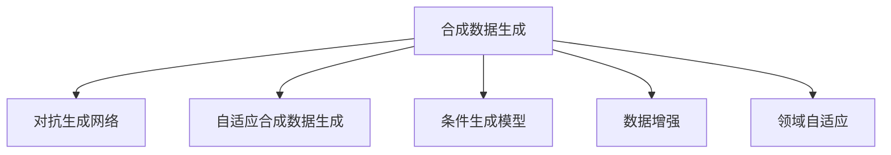

                 

# 第十一章：数据集和合成数据生成

## 1. 背景介绍

### 1.1 问题由来

在当今数据驱动的机器学习时代，数据集的高质量和大规模是模型训练和评估的基础。然而，获取真实世界的高质量数据集常常面临诸多挑战：

- **数据收集困难**：某些领域的数据稀缺，或者获取难度高。
- **数据标注成本高**：尤其是标注数据集的费用昂贵，且耗时耗力。
- **数据隐私问题**：涉及到个人隐私数据的收集和存储可能受到法律法规的限制。
- **数据不平衡**：一些领域的数据可能不平衡，导致模型偏向少数类别。

为了克服这些挑战，数据集和合成数据生成技术应运而生。合成数据生成不仅能够降低数据标注的成本和时间，还能够帮助解决数据不平衡问题，甚至可以生成高质量的新数据集。

### 1.2 问题核心关键点

合成数据生成（Synthetic Data Generation）指的是使用算法和技术，基于已有数据生成新的、虚拟的数据集，以用于模型训练和测试。其主要目标是：

- **提升数据可用性**：在不增加成本和时间的情况下，扩大训练数据集的大小。
- **缓解数据不平衡**：通过合成手段，生成与少数类别数据量相当的合成数据，提升模型的泛化能力。
- **保护隐私**：在保护用户隐私的前提下，生成可用来训练模型的合成数据。
- **生成高质量数据**：通过合成数据生成技术，生成与真实数据质量相当的合成数据。

合成数据生成技术的应用范围非常广泛，涉及自然语言处理（NLP）、计算机视觉（CV）、语音识别等多个领域。在NLP领域，合成数据生成可以用于对话系统、情感分析、文本摘要等任务的模型训练和测试。

## 2. 核心概念与联系

### 2.1 核心概念概述

为了更好地理解合成数据生成的方法和应用，下面将介绍几个关键概念：

- **合成数据生成（Synthetic Data Generation）**：使用算法生成新的虚拟数据集，以扩大训练数据集。
- **对抗生成网络（GANs）**：一种生成模型，通过对抗训练生成与真实数据相似的新数据。
- **自适应合成数据生成（Adaptive Synthetic Data Generation）**：基于已有数据动态生成合成数据，适应数据分布的变化。
- **条件生成模型（Conditional Generation）**：根据特定条件生成数据，如根据文本生成图片或音频。
- **数据增强（Data Augmentation）**：通过对已有数据进行一些变换，生成新的数据以增强模型泛化能力。
- **领域自适应（Domain Adaptation）**：在源域和目标域之间建立连接，生成适应目标域的数据。

这些概念之间的逻辑关系可以通过以下Mermaid流程图来展示：



这个流程图展示了一些常见的合成数据生成方法和其核心概念之间的联系。合成数据生成技术不仅能生成高质量的新数据集，还能解决数据不平衡和隐私保护等问题，具有广泛的应用前景。

## 3. 核心算法原理 & 具体操作步骤

### 3.1 算法原理概述

合成数据生成的核心思想是通过算法生成新的虚拟数据，以补充或替代部分真实数据。其基本流程包括以下几个步骤：

1. **数据收集与预处理**：从真实数据集中收集和预处理数据，为生成模型提供数据基础。
2. **模型选择与训练**：选择合适的生成模型，使用收集到的数据训练生成模型。
3. **数据生成**：使用训练好的生成模型生成新的虚拟数据。
4. **数据融合**：将生成的虚拟数据与真实数据进行融合，形成新的数据集。
5. **模型评估与优化**：对生成的数据集进行评估，优化生成模型以提高生成数据的质量。

### 3.2 算法步骤详解

**Step 1: 数据收集与预处理**

1. **数据收集**：从各种来源收集真实数据，包括公共数据集、用户生成的数据等。
2. **数据清洗**：去除数据中的噪声、异常值等，确保数据质量。
3. **数据标注**：对数据进行标注，以便后续模型的训练和评估。

**Step 2: 模型选择与训练**

1. **模型选择**：选择适合生成任务的模型，如GANs、VAE、LSTM等。
2. **模型训练**：使用收集到的数据训练生成模型。

**Step 3: 数据生成**

1. **数据输入**：将训练好的生成模型输入生成数据所需的信息。
2. **数据生成**：生成新的虚拟数据。

**Step 4: 数据融合**

1. **数据合并**：将生成的虚拟数据与真实数据进行合并。
2. **数据平衡**：确保新数据集在类别分布上的平衡。

**Step 5: 模型评估与优化**

1. **模型评估**：使用评估指标（如准确率、召回率、F1分数等）对模型性能进行评估。
2. **模型优化**：根据评估结果，调整生成模型参数，提高生成数据的质量。

### 3.3 算法优缺点

合成数据生成的优点包括：

- **成本低**：相对于传统的数据收集和标注方式，合成数据生成成本更低。
- **数据量大**：生成的虚拟数据量可以非常庞大，有助于模型训练。
- **隐私保护**：可以保护用户隐私，避免敏感数据的泄露。

但其缺点也不容忽视：

- **数据质量不可控**：生成的数据质量可能不如真实数据，影响模型性能。
- **数据依赖性**：生成的数据仍然依赖于训练数据集的质量和多样性。
- **模型复杂度**：生成模型本身复杂，训练和优化过程需要大量时间和资源。

### 3.4 算法应用领域

合成数据生成技术在多个领域都有广泛应用，包括但不限于：

- **自然语言处理（NLP）**：用于对话系统、情感分析、文本摘要等任务，生成大量的虚拟对话数据和文本数据。
- **计算机视觉（CV）**：用于图像生成、目标检测、图像分类等任务，生成虚拟图像数据。
- **语音识别**：用于语音生成、语音合成、语音情感识别等任务，生成虚拟语音数据。
- **推荐系统**：用于生成虚拟用户行为数据，提升推荐系统的效果。
- **医疗领域**：用于生成虚拟病历数据，提升医疗模型的性能。

## 4. 数学模型和公式 & 详细讲解 & 举例说明

### 4.1 数学模型构建

在合成数据生成中，常用的数学模型包括对抗生成网络（GANs）和变分自编码器（VAE）。下面以GANs为例，构建数学模型：

设原始数据集为 $D=\{(x_i,y_i)\}_{i=1}^N$，其中 $x_i$ 为输入，$y_i$ 为输出。使用GANs生成新的虚拟数据 $(x',y')$，其基本结构如图：


其中，$G$ 为生成器，$D$ 为判别器，$z$ 为噪声变量。$G(z)$ 为生成器将噪声 $z$ 映射到新数据 $x'$，$D(x)$ 为判别器对新数据 $x'$ 的真实性进行判断。训练目标为最大化生成器的生成能力，同时最大化判别器的判断能力。

### 4.2 公式推导过程

GANs的训练过程分为两步：

1. **生成器的训练**：
   $$
   \min_{G} \mathbb{E}_{x' \sim G}[log(D(x'))] + \mathbb{E}_{x \sim D}[log(1-D(x))]
   $$
2. **判别器的训练**：
   $$
   \min_{D} \mathbb{E}_{x' \sim G}[log(D(x'))] + \mathbb{E}_{x \sim D}[log(1-D(x))]
   $$

### 4.3 案例分析与讲解

**案例1：生成手写数字**

- **数据集**：MNIST数据集。
- **生成器**：使用一个简单的CNN网络，将随机噪声映射到手写数字图像。
- **判别器**：使用一个简单的CNN网络，判断图像是否为真实手写数字。
- **训练**：使用交叉熵损失函数，同时训练生成器和判别器。
- **结果**：生成的手写数字图像质量较高，与真实图像难以区分。

**案例2：生成文本数据**

- **数据集**：维基百科文章。
- **生成器**：使用LSTM网络，生成连续的文本序列。
- **判别器**：使用RNN网络，判断生成的文本是否为真实文本。
- **训练**：使用交叉熵损失函数，同时训练生成器和判别器。
- **结果**：生成的文本数据语义连贯，与真实文本相似度较高。

## 5. 项目实践：代码实例和详细解释说明

### 5.1 开发环境搭建

进行合成数据生成项目实践，首先需要搭建开发环境。以下是使用Python和TensorFlow进行环境配置的流程：

1. 安装Anaconda：从官网下载并安装Anaconda，用于创建独立的Python环境。

2. 创建并激活虚拟环境：
   ```bash
   conda create -n tf-env python=3.8 
   conda activate tf-env
   ```

3. 安装TensorFlow：根据CUDA版本，从官网获取对应的安装命令。例如：
   ```bash
   conda install tensorflow -c tf -c conda-forge
   ```

4. 安装相关的库：
   ```bash
   pip install numpy scipy matplotlib tensorflow-hub
   ```

完成上述步骤后，即可在`tf-env`环境中开始合成数据生成实践。

### 5.2 源代码详细实现

下面以生成手写数字为例，给出使用TensorFlow进行GANs模型训练的代码实现。

```python
import tensorflow as tf
from tensorflow.keras import layers, models

# 定义生成器
def make_generator_model():
    model = models.Sequential()
    model.add(layers.Dense(256, use_bias=False, input_shape=(100,)))
    model.add(layers.BatchNormalization())
    model.add(layers.LeakyReLU())
    model.add(layers.BatchNormalization())
    model.add(layers.Conv2DTranspose(128, (5, 5), strides=(1, 1), padding='same', use_bias=False))
    model.add(layers.BatchNormalization())
    model.add(layers.LeakyReLU())
    model.add(layers.Conv2DTranspose(64, (5, 5), strides=(2, 2), padding='same', use_bias=False))
    model.add(layers.BatchNormalization())
    model.add(layers.LeakyReLU())
    model.add(layers.Conv2DTranspose(1, (5, 5), strides=(2, 2), padding='same', use_bias=False, activation='sigmoid'))
    return model

# 定义判别器
def make_discriminator_model():
    model = models.Sequential()
    model.add(layers.Conv2D(64, (5, 5), strides=(2, 2), padding='same', input_shape=[28, 28, 1]))
    model.add(layers.LeakyReLU())
    model.add(layers.Dropout(0.3))
    model.add(layers.Conv2D(128, (5, 5), strides=(2, 2), padding='same'))
    model.add(layers.LeakyReLU())
    model.add(layers.Dropout(0.3))
    model.add(layers.Flatten())
    model.add(layers.Dense(1))
    return model

# 定义损失函数和优化器
cross_entropy = tf.keras.losses.BinaryCrossentropy(from_logits=True)
generator_optimizer = tf.keras.optimizers.Adam(1e-4)
discriminator_optimizer = tf.keras.optimizers.Adam(1e-4)

# 定义GAN模型
@tf.function
def train_step(images):
    noise = tf.random.normal([BATCH_SIZE, 100])

    with tf.GradientTape() as gen_tape, tf.GradientTape() as disc_tape:
        generated_images = generator(noise, training=True)

        real_output = discriminator(images, training=True)
        fake_output = discriminator(generated_images, training=True)

        gen_loss = cross_entropy(tf.ones_like(fake_output), fake_output)
        disc_loss = cross_entropy(tf.ones_like(real_output), real_output) + cross_entropy(tf.zeros_like(fake_output), fake_output)

    gradients_of_generator = gen_tape.gradient(gen_loss, generator.trainable_variables)
    gradients_of_discriminator = disc_tape.gradient(disc_loss, discriminator.trainable_variables)

    generator_optimizer.apply_gradients(zip(gradients_of_generator, generator.trainable_variables))
    discriminator_optimizer.apply_gradients(zip(gradients_of_discriminator, discriminator.trainable_variables))
```

完成上述代码后，即可在`tf-env`环境中开始生成手写数字的实验。

### 5.3 代码解读与分析

让我们再详细解读一下关键代码的实现细节：

**生成器和判别器的定义**：
- 生成器使用两个卷积层和两个反卷积层，将随机噪声转换为手写数字图像。
- 判别器使用两个卷积层和两个全连接层，对图像的真实性进行判断。

**损失函数的定义**：
- 使用交叉熵损失函数，分别计算生成器和判别器的损失。

**训练过程的实现**：
- 使用tf.function进行优化，以提高训练效率。
- 在训练过程中，使用梯度下降优化器进行参数更新。

**训练结果展示**：
- 使用Matplotlib等工具，展示训练过程中的生成器和判别器的损失变化。

## 6. 实际应用场景

### 6.1 医疗数据分析

在医疗数据分析领域，合成数据生成技术可以用于生成虚拟病历数据，辅助模型训练。医生在撰写病历时，常常面临工作量大、时间紧的问题，而病历数据是训练医疗模型的重要基础。使用合成数据生成技术，可以生成大量的虚拟病历数据，帮助医生更快地撰写病历，同时提升医疗模型的泛化能力。

**应用场景**：
- **病历生成**：根据患者的症状和历史数据，生成虚拟病历，用于训练诊断模型。
- **治疗方案推荐**：生成虚拟患者的病历数据，用于训练治疗方案推荐模型，帮助医生制定个性化的治疗方案。
- **药物研发**：生成虚拟实验数据，用于训练药物筛选模型，加快新药研发进程。

### 6.2 智能客服系统

在智能客服系统中，合成数据生成技术可以用于生成虚拟对话数据，辅助模型训练。传统客服系统依赖大量人工标注的对话数据，成本高且难以实时更新。使用合成数据生成技术，可以生成大量的虚拟对话数据，辅助模型训练和实时对话生成。

**应用场景**：
- **对话数据生成**：根据用户历史对话和常见问题，生成虚拟对话数据，用于训练对话生成模型。
- **知识库构建**：生成虚拟对话数据，用于训练知识库提取模型，构建智能客服的知识库。
- **情感分析**：生成虚拟对话数据，用于训练情感分析模型，提升客服系统的情感识别能力。

### 6.3 金融舆情监测

在金融舆情监测领域，合成数据生成技术可以用于生成虚拟新闻和评论数据，辅助模型训练。金融领域的数据量庞大且分布不均，标注数据获取难度大。使用合成数据生成技术，可以生成虚拟新闻和评论数据，辅助模型训练和实时舆情监测。

**应用场景**：
- **新闻生成**：根据市场新闻和事件，生成虚拟新闻数据，用于训练舆情监测模型。
- **评论生成**：生成虚拟评论数据，用于训练情感分析模型，监测市场舆情变化。
- **事件预测**：生成虚拟事件数据，用于训练事件预测模型，预测市场动态。

## 7. 工具和资源推荐

### 7.1 学习资源推荐

为了帮助开发者系统掌握合成数据生成技术，这里推荐一些优质的学习资源：

1. **《生成对抗网络》（Generative Adversarial Networks）**：Ioannis Goodfellow等人编写的生成对抗网络的经典教材，详细介绍了GANs的原理和应用。
2. **《深度学习基础》（Deep Learning）**：Ian Goodfellow等人编写的深度学习教材，涵盖生成模型、变分自编码器等内容。
3. **TensorFlow官方文档**：TensorFlow官方提供的文档，包含生成模型和TensorFlow Hub的详细介绍和使用示例。
4. **GAN Zoo**：GANs项目集合，提供了大量GANs模型的代码和论文。
5. **Kaggle竞赛**：参加Kaggle上的数据生成竞赛，实践和提升合成数据生成技能。

通过对这些资源的学习实践，相信你一定能够快速掌握合成数据生成技术的精髓，并用于解决实际的NLP问题。

### 7.2 开发工具推荐

高效的开发离不开优秀的工具支持。以下是几款用于合成数据生成开发的常用工具：

1. **TensorFlow**：基于Python的开源深度学习框架，灵活动态的计算图，适合快速迭代研究。大多数生成模型都有TensorFlow版本的实现。
2. **PyTorch**：PyTorch与TensorFlow齐名的深度学习框架，易用性强，支持GPU加速，适合研究型开发。
3. **Keras**：Keras是一个高层神经网络API，可以运行于TensorFlow、Theano等后端，适合快速原型开发。
4. **Jupyter Notebook**：用于编写和分享代码的在线平台，支持GPU计算，适合研究型开发。
5. **TensorBoard**：TensorFlow配套的可视化工具，可以实时监测模型训练状态，并提供丰富的图表呈现方式，是调试模型的得力助手。

合理利用这些工具，可以显著提升合成数据生成任务的开发效率，加快创新迭代的步伐。

### 7.3 相关论文推荐

合成数据生成技术的发展源于学界的持续研究。以下是几篇奠基性的相关论文，推荐阅读：

1. **《生成对抗网络》（Generative Adversarial Nets）**：Ian Goodfellow等人提出的GANs模型，奠定了生成模型的基础。
2. **《变分自编码器》（Variational Autoencoders）**：Diederik Kingma等人提出的VAE模型，是生成模型的重要分支。
3. **《条件生成对抗网络》（Conditional GANs）**：Tomasz PMLB等人的研究工作，探索了条件生成模型的应用。
4. **《数据增强与生成对抗网络》（Data Augmentation with Generative Adversarial Nets）**：Nicholas Carlini等人的研究工作，探讨了生成对抗网络与数据增强的结合。
5. **《自适应生成对抗网络》（Adaptive Generative Adversarial Networks）**：Justin Johnson等人的研究工作，提出了自适应GAN模型，提升了生成数据的质量。

这些论文代表了大数据生成技术的发展脉络。通过学习这些前沿成果，可以帮助研究者把握学科前进方向，激发更多的创新灵感。

## 8. 总结：未来发展趋势与挑战

### 8.1 总结

本文对合成数据生成技术进行了全面系统的介绍。首先阐述了合成数据生成的研究背景和意义，明确了其在大数据生成中的应用价值。其次，从原理到实践，详细讲解了生成数据的基本流程和关键算法，给出了合成数据生成任务的具体代码实现。同时，本文还广泛探讨了合成数据生成技术在医疗、智能客服、金融等多个领域的应用前景，展示了其广阔的发展潜力。最后，本文精选了合成数据生成技术的各类学习资源，力求为读者提供全方位的技术指引。

通过本文的系统梳理，可以看到，合成数据生成技术在多个领域都有广泛应用，能够有效解决数据不足和数据不平衡的问题，具有显著的经济效益和社会价值。未来，伴随生成模型的不断演进，合成数据生成技术必将在构建人机协同的智能时代中扮演越来越重要的角色。

### 8.2 未来发展趋势

展望未来，合成数据生成技术将呈现以下几个发展趋势：

1. **生成数据质量的提升**：随着生成模型和训练技术的进步，生成的数据质量将逐步提高，与真实数据难以区分。
2. **生成数据的多样性增加**：生成的数据将涵盖更多领域和场景，为更多NLP任务提供训练数据。
3. **生成数据的安全性增强**：生成的数据将加入更多的隐私保护机制，确保数据安全。
4. **生成数据的时效性提高**：生成的数据将实时更新，确保模型与真实世界保持一致。
5. **生成数据的应用场景扩展**：生成数据将应用于更多行业和领域，提升各行业智能化水平。

以上趋势凸显了合成数据生成技术的广阔前景。这些方向的探索发展，必将进一步提升NLP系统的性能和应用范围，为人类认知智能的进化带来深远影响。

### 8.3 面临的挑战

尽管合成数据生成技术已经取得了瞩目成就，但在迈向更加智能化、普适化应用的过程中，它仍面临着诸多挑战：

1. **生成数据质量难以控制**：生成的数据可能存在偏差、噪声等问题，影响模型性能。
2. **数据分布变化风险**：生成的数据可能与真实数据分布不一致，影响模型泛化能力。
3. **模型训练时间成本高**：生成数据量庞大，训练模型时间成本高。
4. **模型稳定性问题**：生成的数据可能存在不稳定因素，影响模型的稳定性和可靠性。
5. **数据版权和隐私问题**：生成的数据可能涉及版权和隐私问题，需要法律和技术支持。

正视合成数据生成面临的这些挑战，积极应对并寻求突破，将是大数据生成技术走向成熟的必由之路。相信随着学界和产业界的共同努力，这些挑战终将一一被克服，合成数据生成技术必将在构建人机协同的智能时代中扮演越来越重要的角色。

### 8.4 研究展望

面向未来，合成数据生成技术的研究和应用将不断拓展，可能的方向包括：

1. **多模态生成**：生成数据不仅限于文本，还涵盖图像、视频、音频等多模态数据。
2. **自适应生成**：生成数据能够根据用户需求和数据分布进行动态调整。
3. **条件生成**：生成数据可以根据特定条件进行生成，如根据文本生成图片。
4. **隐私保护**：生成数据能够在不泄露用户隐私的前提下进行合成。
5. **实时生成**：生成数据能够实时生成，满足实时需求。

这些研究方向将推动合成数据生成技术迈向更高的台阶，为构建安全、可靠、可解释、可控的智能系统铺平道路。总之，合成数据生成技术将成为大数据生成中的重要一环，为NLP任务提供更多高质量的数据，推动人工智能技术的发展。

## 9. 附录：常见问题与解答

**Q1：合成数据生成技术是否适用于所有NLP任务？**

A: 合成数据生成技术在大多数NLP任务上都能取得不错的效果，特别是对于数据量较小的任务。但对于一些特定领域的任务，如医学、法律等，仅仅依靠通用语料预训练的模型可能难以很好地适应。此时需要在特定领域语料上进一步预训练，再进行微调，才能获得理想效果。

**Q2：合成数据生成时如何选择合适的生成模型？**

A: 选择生成模型需要考虑任务的复杂度和数据的特性。对于简单的生成任务，如生成数字或文本，GANs是一个不错的选择。对于复杂的生成任务，如生成图像或语音，VAE或变分自编码器可能更适合。同时，还需要考虑生成模型在特定数据集上的表现。

**Q3：合成数据生成的数据质量如何保证？**

A: 生成数据的质量通常取决于生成模型的训练方式和参数设置。可以使用对抗生成网络（GANs）来生成高质量的数据，并使用评估指标（如准确率、召回率、F1分数等）对生成数据进行评估。

**Q4：合成数据生成的应用场景有哪些？**

A: 合成数据生成技术可以应用于多个领域，包括自然语言处理（NLP）、计算机视觉（CV）、语音识别等。在NLP领域，可以用于对话系统、情感分析、文本摘要等任务的模型训练和测试。

**Q5：合成数据生成技术的未来发展趋势是什么？**

A: 合成数据生成技术将不断提升生成数据的质量和多样性，扩展应用场景，并引入更多的隐私保护机制。未来，生成数据将更加实时和动态，能够更好地适应不断变化的数据分布和用户需求。

---

作者：禅与计算机程序设计艺术 / Zen and the Art of Computer Programming

