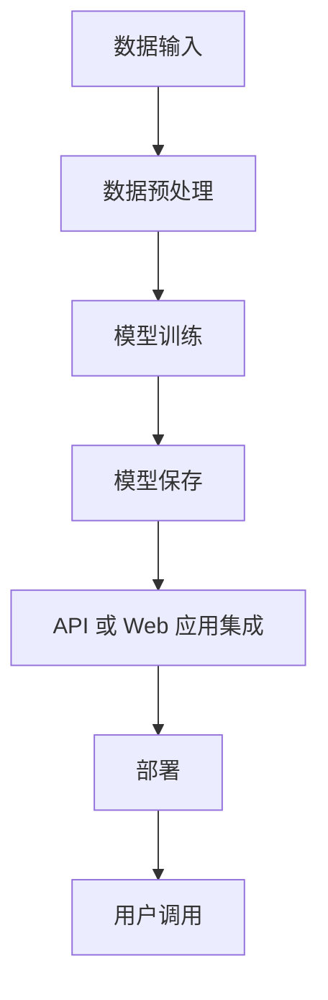

                 

# 第十六章：将 AI 部署为 API 和 Web 应用程序

## 1. 背景介绍

随着人工智能技术的发展，越来越多的企业和机构希望能够将 AI 应用部署为即插即用的 API 或功能丰富的 Web 应用程序，以满足不同的业务需求。这种部署方式不仅能够提高开发效率，还能带来更好的用户体验和灵活性。本章将详细讲解如何将 AI 应用部署为 API 和 Web 应用程序，并介绍相关技术、工具和最佳实践。

## 2. 核心概念与联系

### 2.1 核心概念概述

- **API (Application Programming Interface)**: 提供了一组定义良好的接口和协议，使得不同应用程序之间能够相互通信和交互。在 AI 应用中，API 通常用于提供机器学习模型的预测接口或数据处理接口。

- **Web 应用程序**: 基于 Web 技术（如 HTML、CSS、JavaScript 等）构建的前端应用，能够在浏览器端运行并提供用户界面。Web 应用程序能够集成 AI 功能，为用户提供智能化的服务和体验。

- **RESTful API**: 一种基于 HTTP 协议的 API 设计风格，支持资源的 CRUD (Create, Read, Update, Delete) 操作，具有良好扩展性和易用性。

- **微服务架构**: 将应用拆分为一组独立运行的小服务，每个服务负责一个特定的功能模块，能够提高系统的可扩展性和可靠性。

- **容器化部署**: 将应用程序及其依赖打包在一个独立的容器中，并通过容器编排工具（如 Docker、Kubernetes）进行管理和调度，实现跨环境的稳定运行。

### 2.2 核心概念原理和架构的 Mermaid 流程图



这个流程图展示了 AI 应用从数据输入到用户调用的全过程，其中关键组件包括数据预处理、模型训练、模型保存、API 或 Web 应用集成和部署。

## 3. 核心算法原理 & 具体操作步骤

### 3.1 算法原理概述

将 AI 应用部署为 API 或 Web 应用程序的核心原理是将模型嵌入到应用程序中，使得用户能够通过标准接口调用模型的预测能力。这种部署方式分为两个主要步骤：

1. **模型保存与集成**: 将训练好的模型保存为可部署的格式（如 TensorFlow SavedModel、PyTorch Model 等），并将其集成到 API 或 Web 应用程序中。

2. **API 或 Web 接口设计**: 设计并实现一个标准的接口，使用户能够通过网络请求调用模型，获取预测结果。

### 3.2 算法步骤详解

#### 3.2.1 模型保存与集成

1. **选择模型格式**:
   - 根据所使用的深度学习框架（如 TensorFlow、PyTorch 等），选择合适的模型保存格式（如 SavedModel、Model 等）。

2. **保存模型**:
   - 使用框架提供的工具将训练好的模型保存为选择的格式。例如，在 TensorFlow 中使用 `tf.saved_model.save` 保存模型。

3. **集成模型**:
   - 将保存好的模型集成到 API 或 Web 应用程序中。常见的方法包括使用 API 框架（如 Flask、FastAPI）或 Web 框架（如 Django、Express）构建应用程序，并加载模型进行预测。

#### 3.2.2 API 或 Web 接口设计

1. **设计接口**:
   - 设计一个或多个 API 接口，每个接口负责一个具体的预测任务。接口的输入应包括模型所需的输入数据，输出应为模型的预测结果。

2. **实现接口**:
   - 使用 API 框架或 Web 框架实现接口。通常使用 HTTP 请求处理函数（如 Flask 中的 `@app.route` 装饰器）将请求路由到相应的处理函数，读取输入数据，调用模型进行预测，并返回预测结果。

3. **部署接口**:
   - 将实现好的 API 接口部署到服务器上，使其能够接收远程请求并返回响应。可以使用容器化技术（如 Docker、Kubernetes）进行管理，确保接口的稳定性和可扩展性。

### 3.3 算法优缺点

#### 3.3.1 优点

1. **灵活性和可扩展性**:
   - 将 AI 应用部署为 API 或 Web 应用程序，能够根据不同的业务需求灵活地组合和复用模型。同时，能够方便地添加新的功能和模块。

2. **易用性和集成性**:
   - 标准的 API 接口使得不同系统和应用程序能够轻松地集成 AI 功能，提高了系统的整体性能和用户体验。

3. **性能优化**:
   - 使用容器化技术和服务器集群可以显著提高系统的性能和可伸缩性，确保在高负载下也能稳定运行。

#### 3.3.2 缺点

1. **开发和维护成本**:
   - 将 AI 应用部署为 API 或 Web 应用程序需要额外的开发和维护工作，包括 API 设计、接口实现、容器部署等。

2. **网络延迟**:
   - 在远程调用 API 或 Web 接口时，可能存在网络延迟，影响实时性能。

3. **安全性问题**:
   - API 接口暴露在外部网络中，需要考虑安全性问题，如数据加密、身份验证等。

## 4. 数学模型和公式 & 详细讲解 & 举例说明

### 4.1 数学模型构建

假设我们有一个训练好的二分类模型 $M$，输入为 $x$，输出为 $y \in \{0, 1\}$。我们将该模型部署为 API 或 Web 应用程序，并设计一个简单的 RESTful API 接口 `/predict`，用户通过 POST 请求发送输入数据 $x$，API 返回模型预测结果 $y$。

### 4.2 公式推导过程

1. **输入数据**:
   - 用户发送请求时，API 读取输入数据 $x$。

2. **模型调用**:
   - 将输入数据 $x$ 传递给模型 $M$，得到预测结果 $y$。

3. **输出响应**:
   - API 将预测结果 $y$ 作为 JSON 格式的响应返回给用户。

### 4.3 案例分析与讲解

#### 案例一：图像分类 API

假设我们有一个图像分类模型，可以识别图像中的对象类别。我们将该模型部署为 API 接口 `/classify`，接收一张图片作为输入，返回识别的类别。

1. **输入数据**:
   - 用户上传一张图像，API 读取图片数据。

2. **模型调用**:
   - 将图像数据传递给图像分类模型 $M$，得到预测类别。

3. **输出响应**:
   - API 返回识别的类别作为响应。

#### 案例二：情感分析 API

假设我们有一个情感分析模型，可以分析文本的情感倾向。我们将该模型部署为 API 接口 `/analyze`，接收一段文本作为输入，返回情感倾向（如正向、负向、中性）。

1. **输入数据**:
   - 用户输入一段文本，API 读取文本数据。

2. **模型调用**:
   - 将文本数据传递给情感分析模型 $M$，得到情感倾向。

3. **输出响应**:
   - API 返回情感倾向作为响应。

## 5. 项目实践：代码实例和详细解释说明

### 5.1 开发环境搭建

1. **安装 Python 和相关库**:
   - 确保安装了 Python 3.6 或以上版本，并安装了 TensorFlow、Flask 等必要的库。

2. **设置虚拟环境**:
   - 使用 `virtualenv` 或 `conda` 创建虚拟环境，确保不同项目之间的依赖隔离。

3. **安装 Flask**:
   - 使用 `pip install flask` 安装 Flask 框架。

### 5.2 源代码详细实现

#### 5.2.1 保存和加载模型

使用 TensorFlow 保存和加载模型：

```python
import tensorflow as tf

# 定义模型
model = tf.keras.Sequential([
    tf.keras.layers.Dense(64, activation='relu', input_shape=(10,)),
    tf.keras.layers.Dense(1, activation='sigmoid')
])

# 保存模型
tf.saved_model.save(model, 'model')

# 加载模型
loaded_model = tf.saved_model.load('model')
```

#### 5.2.2 设计 API 接口

使用 Flask 设计 API 接口：

```python
from flask import Flask, request, jsonify

app = Flask(__name__)

# 加载模型
model = tf.saved_model.load('model')

@app.route('/predict', methods=['POST'])
def predict():
    data = request.json
    input_data = tf.convert_to_tensor(data['input'])
    result = model(input_data)
    return jsonify({'result': result.numpy().tolist()})

if __name__ == '__main__':
    app.run(host='0.0.0.0', port=5000)
```

### 5.3 代码解读与分析

- **Flask 框架**:
  - Flask 是一个轻量级的 Web 框架，易于上手和使用。通过简单的装饰器（如 `@app.route`）即可定义 API 接口，并处理 HTTP 请求。

- **模型加载和调用**:
  - 在 Flask 应用程序中，我们使用 `tf.saved_model.load` 加载模型，并在接口函数中使用加载的模型进行预测，最后返回预测结果。

- **数据格式转换**:
  - 输入数据通常以 JSON 格式发送，需要使用 `tf.convert_to_tensor` 将其转换为 TensorFlow 张量。

### 5.4 运行结果展示

启动 Flask 应用程序，通过 POST 请求调用 `/predict` 接口，获取模型预测结果：

```python
import requests

# 发送 POST 请求
response = requests.post('http://localhost:5000/predict', json={'input': [1.0, 2.0, 3.0, 4.0, 5.0]})
result = response.json()

# 输出结果
print(result)
```

## 6. 实际应用场景

### 6.1 智能客服系统

智能客服系统通常需要集成多个 AI 功能，如自然语言处理、情感分析、意图识别等。通过将 AI 应用部署为 API 或 Web 应用程序，可以实现这些功能的无缝集成和灵活调用。

1. **数据预处理**:
   - 收集和处理用户的历史对话记录，提取用户意图和情感信息。

2. **模型训练**:
   - 使用自然语言处理模型和情感分析模型训练预测模型。

3. **API 集成**:
   - 将训练好的模型集成到智能客服系统中，提供自然语言处理和情感分析的接口。

4. **Web 应用部署**:
   - 开发一个 Web 应用程序，提供用户交互界面，集成多个 API 接口，实现多功能的智能客服服务。

### 6.2 金融舆情监测

金融舆情监测需要实时监测和分析网络上的舆情信息，通过将 AI 应用部署为 API 或 Web 应用程序，可以实现实时的舆情分析和预测。

1. **数据收集**:
   - 收集金融领域的新闻、报道、评论等文本数据。

2. **模型训练**:
   - 使用自然语言处理模型和情感分析模型训练预测模型。

3. **API 集成**:
   - 将训练好的模型集成到舆情监测系统中，提供情感分析接口。

4. **Web 应用部署**:
   - 开发一个 Web 应用程序，实时获取舆情信息，调用情感分析 API，实现舆情监测和分析。

### 6.3 个性化推荐系统

个性化推荐系统需要根据用户的历史行为和兴趣，推荐合适的商品或内容。通过将 AI 应用部署为 API 或 Web 应用程序，可以实现高效的推荐服务。

1. **数据收集**:
   - 收集用户的历史浏览、点击、购买等行为数据。

2. **模型训练**:
   - 使用推荐系统模型训练预测模型。

3. **API 集成**:
   - 将训练好的模型集成到推荐系统中，提供推荐接口。

4. **Web 应用部署**:
   - 开发一个 Web 应用程序，调用推荐 API，实现个性化推荐服务。

## 7. 工具和资源推荐

### 7.1 学习资源推荐

1. **《Python Web 开发实战》**:
   - 介绍 Flask、Django 等 Web 框架的使用，涵盖 Web 应用程序的开发和部署。

2. **《TensorFlow 实战》**:
   - 介绍 TensorFlow 的模型训练、保存和加载，以及 TensorFlow Serving 部署方式。

3. **《API 设计》**:
   - 介绍 RESTful API 的设计原则和实现方法，涵盖 API 接口的设计和测试。

4. **《Docker 实战》**:
   - 介绍 Docker 容器化的原理和实践，涵盖 Docker 的构建、部署和扩展。

5. **《Kubernetes 实战》**:
   - 介绍 Kubernetes 的容器编排原理和实践，涵盖 Kubernetes 的部署和管理。

### 7.2 开发工具推荐

1. **Flask**:
   - 轻量级的 Web 框架，易于上手和使用，适合快速原型开发。

2. **FastAPI**:
   - 快速、高性能的 Web 框架，适合构建 RESTful API。

3. **TensorFlow Serving**:
   - 基于 TensorFlow 的模型部署工具，提供高效的模型推理服务。

4. **Kubernetes**:
   - 容器编排工具，能够管理和调度容器化应用，实现高可用和高扩展性。

5. **Docker**:
   - 容器化工具，能够打包和分发应用程序及其依赖，实现跨环境的稳定运行。

### 7.3 相关论文推荐

1. **《Using Docker to Run Scalable Web Applications》**:
   - 介绍 Docker 容器化的原理和实践，适合新手入门。

2. **《Designing and Implementing RESTful APIs》**:
   - 介绍 RESTful API 的设计原则和实现方法，适合 API 接口的开发者。

3. **《Model Deployment with TensorFlow Serving》**:
   - 介绍 TensorFlow Serving 的原理和实践，适合模型部署的开发者。

4. **《Kubernetes: Deploying Containers to a Distributed System》**:
   - 介绍 Kubernetes 的原理和实践，适合容器编排的开发者。

## 8. 总结：未来发展趋势与挑战

### 8.1 总结

本章详细介绍了如何将 AI 应用部署为 API 和 Web 应用程序，并讨论了相关技术、工具和最佳实践。通过 API 和 Web 接口，用户能够方便地调用 AI 模型，实现各种智能应用。

### 8.2 未来发展趋势

1. **边缘计算与物联网 (IoT)**:
   - 将 AI 模型部署在边缘设备（如物联网设备、移动设备等）上，实现本地推理，减少网络延迟和带宽消耗。

2. **微服务架构**:
   - 采用微服务架构，将 AI 应用拆分为多个独立的服务，提高系统的可扩展性和可靠性。

3. **无服务器架构**:
   - 采用无服务器架构（如 AWS Lambda、Google Cloud Functions），按需调用 AI 服务，降低运维成本和资源消耗。

4. **模型优化和压缩**:
   - 优化和压缩模型，减小模型大小和推理时间，提高模型的部署效率。

### 8.3 面临的挑战

1. **模型复杂度和部署成本**:
   - 大型深度学习模型往往需要大量的计算资源和存储资源，部署成本较高。

2. **模型推理速度**:
   - 大模型的推理速度较慢，难以满足实时性和高吞吐量的需求。

3. **数据隐私和安全**:
   - AI 模型需要访问大量敏感数据，数据隐私和安全问题需要引起重视。

### 8.4 研究展望

1. **模型优化技术**:
   - 研究模型压缩、量化等技术，减小模型大小和推理时间。

2. **分布式训练与推理**:
   - 研究分布式训练和推理技术，提高模型的可扩展性和性能。

3. **自动化部署技术**:
   - 研究自动化部署技术，降低模型部署和维护的复杂度。

4. **数据隐私保护技术**:
   - 研究数据加密、差分隐私等技术，保护数据隐私和安全。

## 9. 附录：常见问题与解答

**Q1: 如何将 AI 模型部署为 API 或 Web 应用程序？**

A: 将 AI 模型保存为可部署的格式（如 TensorFlow SavedModel、PyTorch Model 等），并将其集成到 API 或 Web 应用程序中。

**Q2: 如何设计高效的 API 接口？**

A: 使用 RESTful API 设计原则，设计一个或多个 API 接口，每个接口负责一个具体的预测任务。接口的输入应包括模型所需的输入数据，输出应为模型的预测结果。

**Q3: 如何优化模型推理速度？**

A: 使用模型压缩、量化等技术，减小模型大小和推理时间。同时，采用分布式推理技术，提高模型的推理速度。

**Q4: 如何在 API 接口中添加身份验证和授权？**

A: 使用 OAuth2、JWT 等身份验证机制，保护 API 接口的安全性。同时，可以在接口中设置权限控制，限制用户对模型的访问权限。

**Q5: 如何确保 API 接口的性能和可用性？**

A: 使用负载均衡、缓存、限流等技术，确保 API 接口的性能和可用性。同时，使用容器化技术和服务器集群，提高系统的可扩展性和稳定性。

---

作者：禅与计算机程序设计艺术 / Zen and the Art of Computer Programming

