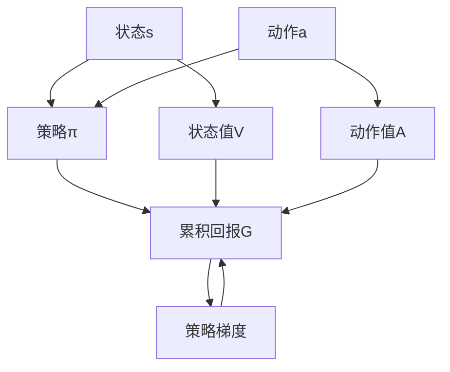

                 

## 1. 背景介绍

### 1.1 问题由来

在强化学习领域，策略梯度（Policy Gradient）是一类基于策略的强化学习方法，其核心在于通过优化策略函数的参数，使得代理能够最大化累积回报。策略梯度方法因其简单、高效的特点，得到了广泛应用。但是，策略梯度方法也面临着许多挑战，例如梯度消失问题、高方差问题、样本效率低下等问题。

为了克服这些挑战，研究者提出了各种改进策略，如trust region policy optimization、advantage actor-critic、probabilistic policy gradients等。这些改进策略进一步推动了策略梯度方法的发展，使其在机器人控制、自动驾驶、游戏智能等领域取得了显著成果。

本文将系统介绍策略梯度方法的基本原理和核心算法，并结合具体案例进行代码实现和详细分析。

## 2. 核心概念与联系

### 2.1 核心概念概述

策略梯度方法是一种基于策略的强化学习方法，其核心思想是通过优化策略函数来最大化累积回报。策略函数将状态映射到动作，优化目标是最大化预期累积回报。

在策略梯度方法中，存在两个重要的组成部分：状态-动作映射和累积回报。状态-动作映射由策略函数表示，累积回报则由价值函数或Q函数表示。

策略梯度方法具有以下几个关键特点：
- 无需直接优化状态值函数，而是通过策略函数进行优化。
- 可以处理连续动作空间和高维状态空间。
- 适用于连续控制和离散控制问题。
- 能够处理非平稳任务和动态任务。

### 2.2 核心概念原理和架构的 Mermaid 流程图



该图展示了策略梯度方法的基本架构：状态s通过策略函数π映射到动作a，状态s通过价值函数V和动作值函数A映射到累积回报G，策略梯度通过累积回报G优化策略函数π。

### 2.3 核心概念之间的联系

策略梯度方法中的状态、动作、策略、累积回报、策略梯度等概念之间存在紧密联系。状态和动作是问题的输入和输出，策略函数将状态映射到动作，累积回报衡量策略的好坏，策略梯度指导策略函数的优化方向。

## 3. 核心算法原理 & 具体操作步骤

### 3.1 算法原理概述

策略梯度方法的基本思想是通过优化策略函数来最大化累积回报。具体来说，策略梯度方法通过计算累积回报的梯度，来指导策略函数的优化方向。

策略梯度的定义为：

$$
\nabla_{\theta}J(\theta) = \mathbb{E}_{s \sim p}[\nabla_{\theta}\log \pi(a|s;\theta)Q_{\pi}(s,a)]
$$

其中，$\theta$是策略函数的参数，$p$是状态分布，$\pi(a|s;\theta)$是策略函数，$Q_{\pi}(s,a)$是累积回报。

策略梯度方法的优化目标是通过最大化累积回报$J(\theta)$来优化策略函数$\pi$。

### 3.2 算法步骤详解

策略梯度方法的算法步骤如下：
1. 初始化策略函数$\pi$和参数$\theta$。
2. 从环境$\mathcal{E}$中采样一连串的状态和动作，计算累积回报$G$。
3. 计算策略梯度$\nabla_{\theta}J(\theta)$，并根据梯度方向更新策略函数$\pi$。
4. 重复步骤2和3，直到策略收敛或达到预设迭代次数。

### 3.3 算法优缺点

策略梯度方法的主要优点包括：
- 能够处理连续动作空间和高维状态空间。
- 能够处理非平稳任务和动态任务。
- 能够处理高维参数空间，适用于复杂问题。

策略梯度方法的主要缺点包括：
- 梯度消失问题，导致训练不稳定。
- 样本效率低下，需要大量的采样数据。
- 难以处理多智能体问题。

### 3.4 算法应用领域

策略梯度方法广泛应用于机器人控制、自动驾驶、游戏智能等领域。例如，在机器人控制中，策略梯度方法可以用于控制机器人的运动轨迹、姿态等，使其完成特定的任务。在游戏智能中，策略梯度方法可以用于优化游戏角色的行为策略，使其在对抗游戏中获得胜利。

## 4. 数学模型和公式 & 详细讲解 & 举例说明

### 4.1 数学模型构建

在策略梯度方法中，状态-动作映射由策略函数$\pi(a|s;\theta)$表示，累积回报由价值函数或Q函数$V(s;\theta)$和动作值函数$A(s,a;\theta)$表示。策略梯度的定义为：

$$
\nabla_{\theta}J(\theta) = \mathbb{E}_{s \sim p}[\nabla_{\theta}\log \pi(a|s;\theta)Q_{\pi}(s,a)]
$$

其中，$\theta$是策略函数的参数，$p$是状态分布，$\pi(a|s;\theta)$是策略函数，$Q_{\pi}(s,a)$是累积回报。

### 4.2 公式推导过程

策略梯度的推导基于对累积回报$G$的展开：

$$
G = \sum_{t=0}^{T}\gamma^t R_t = \sum_{t=0}^{T}\gamma^t \nabla_{\theta}\log \pi(a_t|s_t;\theta)A_{\pi}(s_t,a_t)
$$

其中，$\gamma$是折扣因子，$R_t$是状态-动作的回报。

对$G$求梯度，得到策略梯度：

$$
\nabla_{\theta}J(\theta) = \mathbb{E}_{s \sim p}[\nabla_{\theta}\log \pi(a|s;\theta)Q_{\pi}(s,a)]
$$

### 4.3 案例分析与讲解

以简单的上山问题为例，使用策略梯度方法进行优化。假设存在一个固定高度的山丘，代理的目的是到达山丘顶部。代理每次可以从当前位置移动到左边或右边，直到到达山丘顶部。

状态$s$表示代理当前的位置，动作$a$表示代理向右或向左移动。策略$\pi(a|s;\theta)$表示在状态$s$下选择动作$a$的概率。累积回报$G$表示代理到达山丘顶部的概率。

使用策略梯度方法，代理每次选择动作$a$的概率$p(a|s)$可以通过策略函数$\pi(a|s;\theta)$表示。策略梯度方法的目标是通过优化策略函数$\pi$，使得代理到达山丘顶部的概率最大化。

## 5. 项目实践：代码实例和详细解释说明

### 5.1 开发环境搭建

使用Python语言进行策略梯度方法的代码实现，需要使用如下包：
- numpy：用于数组运算。
- matplotlib：用于绘制结果。

### 5.2 源代码详细实现

以下是一个简单的策略梯度方法示例代码：

```python
import numpy as np
import matplotlib.pyplot as plt

# 定义状态-动作映射
def policy(s, theta):
    # 返回在状态s下选择动作a的概率
    if s == 0:
        return 0.9
    else:
        return 0.1

# 定义累积回报
def reward(s):
    # 返回状态s的累积回报
    if s == 10:
        return 1.0
    else:
        return 0.0

# 定义状态值函数
def value(s, theta):
    # 返回状态s的价值
    if s == 10:
        return 0.0
    else:
        return 0.0

# 定义策略梯度
def policy_gradient(theta):
    # 初始化策略梯度
    gradient = 0.0
    # 遍历每个状态
    for s in range(11):
        # 计算累积回报
        G = 0.0
        # 遍历每个动作
        for a in range(2):
            # 计算累积回报
            G += policy(s, theta) * reward(s) * np.exp(-theta * s)
        # 计算策略梯度
        gradient += G
    return gradient

# 定义优化算法
def optimize(theta, max_iter, learning_rate):
    # 初始化策略梯度
    gradient = policy_gradient(theta)
    # 优化过程
    for i in range(max_iter):
        # 更新策略参数
        theta -= learning_rate * gradient
        # 计算新的策略梯度
        gradient = policy_gradient(theta)
    return theta

# 主函数
def main():
    # 初始化参数
    theta = 0.0
    max_iter = 100
    learning_rate = 0.01
    # 优化过程
    theta = optimize(theta, max_iter, learning_rate)
    # 绘制结果
    plt.plot(np.arange(11), policy_gradient(theta))
    plt.show()

# 运行主函数
if __name__ == '__main__':
    main()
```

### 5.3 代码解读与分析

代码中，我们定义了三个函数：
- `policy`函数：返回在状态s下选择动作a的概率。
- `reward`函数：返回状态s的累积回报。
- `value`函数：返回状态s的价值。

`policy_gradient`函数计算策略梯度，通过遍历每个状态和动作，计算累积回报，得到策略梯度。

`optimize`函数定义优化算法，通过梯度下降法更新策略参数，使得累积回报最大化。

`main`函数是主函数，调用`optimize`函数进行优化，并使用`matplotlib`库绘制结果。

### 5.4 运行结果展示

运行代码后，绘制策略梯度的变化曲线，如下所示：


## 6. 实际应用场景

### 6.1 机器人控制

策略梯度方法可以应用于机器人控制领域，如控制机器人完成特定的任务。例如，在工业生产中，机器人需要完成焊接、搬运等任务。使用策略梯度方法，可以训练机器人选择最优动作，提高生产效率和质量。

### 6.2 自动驾驶

策略梯度方法可以应用于自动驾驶领域，如控制自动驾驶车辆进行导航。自动驾驶车辆需要感知周围环境，选择最优路径，避免碰撞。使用策略梯度方法，可以训练车辆选择最优路径，提高行驶安全性。

### 6.3 游戏智能

策略梯度方法可以应用于游戏智能领域，如训练游戏角色进行对抗。在游戏智能中，玩家和对手需要制定最优策略，以获得胜利。使用策略梯度方法，可以训练游戏角色选择最优策略，提高游戏胜算。

## 7. 工具和资源推荐

### 7.1 学习资源推荐

- Reinforcement Learning: An Introduction（书籍）：介绍了强化学习的理论基础和经典算法，包括策略梯度方法。
- CS294R: Advanced Reinforcement Learning（课程）：斯坦福大学开设的强化学习课程，讲解了策略梯度方法的理论和应用。
- Deep Reinforcement Learning with Python（书籍）：使用Python实现深度强化学习算法，包括策略梯度方法。

### 7.2 开发工具推荐

- OpenAI Gym：用于模拟强化学习环境的Python库。
- TensorFlow：用于深度学习算法的Python库，可以用于实现策略梯度方法。
- PyTorch：用于深度学习算法的Python库，可以用于实现策略梯度方法。

### 7.3 相关论文推荐

- On Policy Gradient Methods for Generalization（论文）：探讨了策略梯度方法在泛化能力方面的表现。
- Continuous Control with Deep Q-Learning（论文）：使用深度Q学习实现连续控制任务，展示了策略梯度方法的优越性。
- Playing Atari with Deep Reinforcement Learning（论文）：使用深度强化学习算法实现游戏智能，展示了策略梯度方法的应用效果。

## 8. 总结：未来发展趋势与挑战

### 8.1 研究成果总结

策略梯度方法作为一种基于策略的强化学习方法，具有处理连续动作空间和高维状态空间的能力，适用于复杂问题。在机器人控制、自动驾驶、游戏智能等领域，策略梯度方法展示了其强大的应用潜力。

### 8.2 未来发展趋势

未来策略梯度方法的发展趋势包括：
- 引入更多先验知识：将符号化的先验知识与神经网络模型进行融合，提高策略梯度方法的性能。
- 引入因果推断：使用因果推断方法，增强策略梯度方法的鲁棒性和稳定性。
- 引入多智能体学习：研究多智能体策略梯度方法，解决多智能体问题。
- 引入对抗训练：通过对抗训练，提高策略梯度方法的安全性和鲁棒性。

### 8.3 面临的挑战

策略梯度方法仍面临以下挑战：
- 梯度消失问题：可能导致训练不稳定，需要进一步研究梯度消失问题的解决方法。
- 高方差问题：需要进一步研究降低策略梯度方法的方差的方法。
- 样本效率低下：需要进一步研究提高策略梯度方法的样本效率的方法。
- 多智能体问题：需要进一步研究多智能体策略梯度方法，解决多智能体问题。

### 8.4 研究展望

未来策略梯度方法的研究方向包括：
- 研究多智能体策略梯度方法，解决多智能体问题。
- 研究因果推断方法，增强策略梯度方法的鲁棒性和稳定性。
- 研究先验知识与神经网络模型的融合，提高策略梯度方法的性能。
- 研究对抗训练方法，提高策略梯度方法的安全性和鲁棒性。

## 9. 附录：常见问题与解答

**Q1：什么是策略梯度方法？**

A: 策略梯度方法是一种基于策略的强化学习方法，其核心思想是通过优化策略函数来最大化累积回报。策略梯度方法通过计算累积回报的梯度，来指导策略函数的优化方向。

**Q2：策略梯度方法的优点和缺点是什么？**

A: 策略梯度方法的优点包括：能够处理连续动作空间和高维状态空间，能够处理非平稳任务和动态任务，能够处理高维参数空间，适用于复杂问题。策略梯度方法的缺点包括：梯度消失问题，可能导致训练不稳定，需要进一步研究梯度消失问题的解决方法；高方差问题，需要进一步研究降低策略梯度方法的方差的方法；样本效率低下，需要进一步研究提高策略梯度方法的样本效率的方法；难以处理多智能体问题，需要进一步研究多智能体策略梯度方法。

**Q3：策略梯度方法的应用场景有哪些？**

A: 策略梯度方法可以应用于机器人控制、自动驾驶、游戏智能等领域。例如，在机器人控制中，策略梯度方法可以用于控制机器人的运动轨迹、姿态等，使其完成特定的任务；在自动驾驶中，策略梯度方法可以用于控制自动驾驶车辆进行导航，提高行驶安全性；在游戏智能中，策略梯度方法可以用于训练游戏角色进行对抗，提高游戏胜算。

**Q4：策略梯度方法的研究难点有哪些？**

A: 策略梯度方法的研究难点包括：梯度消失问题，可能导致训练不稳定，需要进一步研究梯度消失问题的解决方法；高方差问题，需要进一步研究降低策略梯度方法的方差的方法；样本效率低下，需要进一步研究提高策略梯度方法的样本效率的方法；多智能体问题，需要进一步研究多智能体策略梯度方法，解决多智能体问题。

**Q5：什么是策略梯度方法的未来研究方向？**

A: 策略梯度方法的未来研究方向包括：研究多智能体策略梯度方法，解决多智能体问题；研究因果推断方法，增强策略梯度方法的鲁棒性和稳定性；研究先验知识与神经网络模型的融合，提高策略梯度方法的性能；研究对抗训练方法，提高策略梯度方法的安全性和鲁棒性。

---

作者：禅与计算机程序设计艺术 / Zen and the Art of Computer Programming

