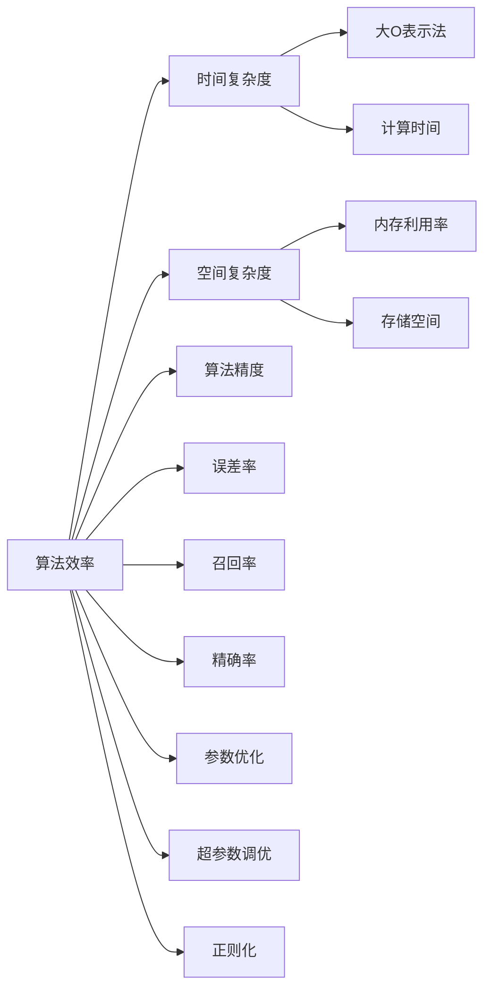

                 

## 1. 背景介绍

在人工智能的迅猛发展中，AI 2.0 算法在各个领域中大放异彩，如自然语言处理、计算机视觉、智能推荐等。然而，面对日益增长的数据量与复杂度，如何高效地优化算法，使其在精度与效率之间取得平衡，成为每个 AI 从业者必须直面的挑战。本文将从核心概念、算法原理、操作步骤、实际应用等多个角度，探讨提高 AI 2.0 算法效率和精度的策略与方法。

## 2. 核心概念与联系

### 2.1 核心概念概述

为了更好地理解算法优化技术，我们需要先了解一些关键概念：

- **算法效率**：指算法在执行时的速度，包括时间复杂度、空间复杂度等。高效的算法能够快速处理大量数据，减少等待时间，提高用户体验。
- **算法精度**：指算法在处理数据时的准确度，包括误差率、召回率、精确率等。高精度的算法能够提供可靠的结果，减少误判，提升应用效果。
- **时间复杂度**：指算法执行时间随数据规模增长而增长的速率。通常用大O表示，如 $O(n)$ 表示时间复杂度与数据规模成正比。
- **空间复杂度**：指算法在内存中所需的存储空间。高效的空间利用能够减少系统资源消耗，提高并发性能。
- **参数优化**：通过调整模型参数，优化算法性能，提高算法的准确度和效率。
- **超参数调优**：调整算法中不参与模型训练的参数，如学习率、批大小等，以适应不同数据集和任务。
- **正则化**：通过惩罚复杂模型，避免过拟合，提升模型泛化能力。

### 2.2 核心概念原理和架构的 Mermaid 流程图



## 3. 核心算法原理 & 具体操作步骤

### 3.1 算法原理概述

提高 AI 2.0 算法效率和精度通常需要从以下几个方面入手：

1. **时间复杂度优化**：通过算法改进来降低时间复杂度。
2. **空间复杂度优化**：通过算法改进来降低空间复杂度。
3. **参数优化**：通过调整模型参数来提升算法精度。
4. **超参数调优**：通过调整算法中不参与模型训练的参数来适应不同数据集和任务。
5. **正则化**：通过惩罚复杂模型来避免过拟合，提升模型泛化能力。

### 3.2 算法步骤详解

#### 3.2.1 时间复杂度优化

时间复杂度优化的方法包括：

1. **算法选择**：根据数据特性选择合适的算法。如对于大规模数据集，可选择分治算法，减少单次计算量。
2. **数据预处理**：通过数据压缩、数据划分等方式减少数据量，提高算法效率。
3. **并行计算**：利用多核、分布式等并行计算技术，提高计算速度。
4. **缓存优化**：通过缓存中间结果，减少重复计算，提高效率。

#### 3.2.2 空间复杂度优化

空间复杂度优化的方法包括：

1. **数据结构选择**：根据数据特点选择高效的数据结构，如哈希表、平衡树等。
2. **内存管理**：通过动态分配、复用等方式减少内存占用。
3. **稀疏化处理**：对于稀疏数据，采用稀疏矩阵等数据结构，减少内存消耗。

#### 3.2.3 参数优化

参数优化的方法包括：

1. **参数搜索**：通过网格搜索、随机搜索等方式，找到最优参数组合。
2. **参数调优算法**：使用如梯度下降、遗传算法等优化算法，调整模型参数。
3. **正则化技术**：如 L1 正则、L2 正则等，防止模型过拟合。

#### 3.2.4 超参数调优

超参数调优的方法包括：

1. **网格搜索**：穷举所有可能的超参数组合。
2. **随机搜索**：在一定范围内随机选择超参数。
3. **贝叶斯优化**：通过贝叶斯方法，选择最有潜力的超参数。

#### 3.2.5 正则化

正则化的方法包括：

1. **L1 正则**：通过对参数的绝对值求和，惩罚大的参数，促进模型稀疏性。
2. **L2 正则**：通过对参数的平方和求和，惩罚大的参数，防止过拟合。
3. **Dropout**：随机删除部分神经元，降低模型复杂度。

### 3.3 算法优缺点

时间复杂度优化、空间复杂度优化、参数优化、超参数调优、正则化等方法，各有其优缺点：

#### 优点：

1. **提高效率**：通过优化算法和数据结构，提高计算和内存效率，加快处理速度。
2. **提升精度**：通过优化参数和正则化，提高模型准确度和泛化能力。
3. **适应性强**：通过调优超参数，适应不同数据集和任务，提高算法适用性。

#### 缺点：

1. **复杂度增加**：优化算法和正则化方法可能增加代码复杂度，增加开发难度。
2. **效果不稳定**：超参数调优和正则化效果依赖于数据集和任务，可能存在不稳定的情况。
3. **计算资源消耗**：优化算法和正则化方法可能增加计算资源消耗，如内存、计算时间等。

### 3.4 算法应用领域

算法优化技术广泛应用于各个领域：

- **计算机视觉**：通过时间复杂度优化和空间复杂度优化，提高图像处理和识别的效率和精度。
- **自然语言处理**：通过参数优化和正则化，提升自然语言处理任务的准确度和泛化能力。
- **智能推荐**：通过超参数调优和参数优化，提高推荐系统的精度和效率，提升用户体验。
- **金融预测**：通过时间复杂度优化和正则化，提高金融预测模型的准确度和鲁棒性。

## 4. 数学模型和公式 & 详细讲解 & 举例说明

### 4.1 数学模型构建

提高 AI 2.0 算法效率和精度的数学模型构建，通常包括以下几个关键步骤：

1. **算法选择**：根据问题特性选择最合适的算法。
2. **数据预处理**：对数据进行归一化、标准化等处理，减少数据量，提高算法效率。
3. **参数初始化**：合理初始化模型参数，减少训练时间。
4. **超参数设置**：设置合适的超参数，提高算法适应性。
5. **正则化处理**：应用正则化技术，防止模型过拟合。

### 4.2 公式推导过程

以线性回归为例，推导其数学模型和优化公式：

设训练集为 $(x_i, y_i)$，$i=1,2,\ldots,n$，目标函数为最小二乘法，即最小化误差平方和：

$$
\min_{\theta} \sum_{i=1}^n (y_i - \theta^T x_i)^2
$$

其中 $\theta$ 为模型参数。通过求导，可以得到参数更新公式：

$$
\theta = (\frac{1}{2n} \sum_{i=1}^n x_i x_i^T + \lambda I)^{-1} (\frac{1}{n} \sum_{i=1}^n x_i y_i)
$$

其中 $\lambda$ 为正则化系数，$I$ 为单位矩阵。

### 4.3 案例分析与讲解

以卷积神经网络 (CNN) 为例，分析时间复杂度优化和空间复杂度优化的策略：

1. **时间复杂度优化**：通过卷积运算，减少单次计算量。设输入图像大小为 $h \times w$，卷积核大小为 $k \times k$，步幅为 $s$，则时间复杂度为 $O(h \times w \times k^2 \times s)$。
2. **空间复杂度优化**：通过池化运算，减少内存占用。设池化窗口大小为 $p \times p$，步幅为 $s$，则空间复杂度为 $O(h \times w \times p^2 \times s)$。

## 5. 项目实践：代码实例和详细解释说明

### 5.1 开发环境搭建

开发环境搭建的步骤如下：

1. **安装 Python 和相关库**：安装 Python 3.x 及 TensorFlow、PyTorch、NumPy、Pandas 等常用库。
2. **准备数据集**：下载并处理所需数据集，如 MNIST、CIFAR-10 等。
3. **搭建计算环境**：使用 GPU 或 TPU 进行计算加速，并搭建分布式计算环境。

### 5.2 源代码详细实现

以线性回归为例，给出 PyTorch 实现：

```python
import torch
import torch.nn as nn
import torch.optim as optim

# 定义模型
class LinearRegression(nn.Module):
    def __init__(self, input_size, output_size):
        super(LinearRegression, self).__init__()
        self.linear = nn.Linear(input_size, output_size)

    def forward(self, x):
        y_pred = self.linear(x)
        return y_pred

# 定义损失函数和优化器
criterion = nn.MSELoss()
optimizer = optim.SGD(model.parameters(), lr=0.01)

# 训练模型
for epoch in range(1000):
    optimizer.zero_grad()
    y_pred = model(x_train)
    loss = criterion(y_pred, y_train)
    loss.backward()
    optimizer.step()
    if (epoch + 1) % 100 == 0:
        print(f"Epoch {epoch+1}, Loss: {loss.item():.4f}")
```

### 5.3 代码解读与分析

- **定义模型**：使用 PyTorch 的 `nn.Linear` 定义线性回归模型，输入为 $x$，输出为 $\hat{y}$。
- **定义损失函数和优化器**：使用均方误差损失函数和随机梯度下降优化器，进行参数更新。
- **训练模型**：通过前向传播和反向传播，不断优化模型参数，直至收敛。

## 6. 实际应用场景

### 6.1 智能推荐系统

智能推荐系统通过算法优化，可以提升推荐效率和准确度，提升用户体验。具体措施包括：

1. **用户行为建模**：使用时间复杂度优化方法，提高用户行为建模的效率。
2. **物品相似度计算**：使用空间复杂度优化方法，提高物品相似度计算的速度。
3. **模型参数调优**：通过超参数调优和正则化技术，提升推荐模型的效果。

### 6.2 计算机视觉

计算机视觉领域中，算法优化技术可应用于图像分类、目标检测、图像分割等任务。具体措施包括：

1. **特征提取**：使用时间复杂度优化方法，提高特征提取的速度。
2. **卷积操作**：使用空间复杂度优化方法，提高卷积操作的速度。
3. **模型压缩**：使用参数优化和正则化技术，减少模型参数量，提升计算效率。

### 6.3 自然语言处理

自然语言处理中，算法优化技术可应用于机器翻译、文本分类、命名实体识别等任务。具体措施包括：

1. **词嵌入优化**：使用时间复杂度优化方法，提高词嵌入的计算速度。
2. **序列建模**：使用空间复杂度优化方法，提高序列建模的速度。
3. **模型压缩**：使用参数优化和正则化技术，减少模型参数量，提升计算效率。

## 7. 工具和资源推荐

### 7.1 学习资源推荐

1. **《深度学习》（Ian Goodfellow 著）**：全面介绍深度学习基础和算法优化技术。
2. **《Python机器学习》（Sebastian Raschka 著）**：详细介绍 Python 在机器学习中的应用，包括算法优化技术。
3. **Kaggle 竞赛**：参与 Kaggle 竞赛，实战学习算法优化技术。

### 7.2 开发工具推荐

1. **PyTorch**：高性能的深度学习框架，支持动态计算图和 GPU 加速。
2. **TensorFlow**：灵活的深度学习框架，支持分布式计算和 GPU 加速。
3. **MXNet**：高效的深度学习框架，支持分布式计算和 GPU 加速。

### 7.3 相关论文推荐

1. **《Distributional Smoothing in Exemplar-based Learning》（Yann LeCun 等）**：介绍正则化技术在深度学习中的应用。
2. **《Parameter-Efficient Training of Deep Learning Models》（Sean J. Wyse 等）**：介绍参数优化技术在深度学习中的应用。
3. **《Hyperparameter Optimization for Deep Neural Networks》（Jesse Addy 等）**：详细介绍超参数调优技术在深度学习中的应用。

## 8. 总结：未来发展趋势与挑战

### 8.1 总结

提高 AI 2.0 算法效率和精度是当前研究的热点之一。本文从算法原理、操作步骤、实际应用等方面，详细探讨了算法优化的策略和方法。通过优化时间复杂度、空间复杂度、参数和超参数，引入正则化技术，可以显著提升算法性能。

### 8.2 未来发展趋势

未来算法优化技术将呈现以下几个发展趋势：

1. **高效算法**：随着硬件的发展，高效算法将被广泛应用，进一步提升计算效率。
2. **混合算法**：通过将多种算法结合，实现更高效和更精确的计算。
3. **自适应算法**：根据数据特性，自动调整算法参数，提高算法适应性。
4. **联邦学习**：通过分布式计算，保护数据隐私的同时提升计算效率。

### 8.3 面临的挑战

算法优化技术在发展过程中，也面临一些挑战：

1. **数据质量**：数据质量的好坏直接影响算法优化效果，需要加强数据预处理和清洗。
2. **计算资源**：高效算法的计算复杂度可能较高，需要更多的计算资源。
3. **模型复杂度**：复杂的算法模型可能难以优化，需要进一步研究。
4. **算法鲁棒性**：算法优化后，需要保证模型鲁棒性，避免过拟合和泛化能力下降。

### 8.4 研究展望

未来算法优化技术需要在以下几个方面进行研究：

1. **自动化优化**：通过自动化工具，降低算法优化难度，提高开发效率。
2. **多目标优化**：优化算法不仅要考虑效率和精度，还要考虑其他目标，如公平性、可解释性等。
3. **跨领域应用**：将算法优化技术应用于更多领域，如医疗、金融等，提升应用效果。
4. **融合新技术**：融合新的人工智能技术，如知识图谱、生成对抗网络等，提升算法效果。

## 9. 附录：常见问题与解答

**Q1: 如何选择合适的算法？**

A: 选择算法应考虑数据特性和问题目标。例如，对于大规模数据集，选择时间复杂度低的算法；对于小规模数据集，选择空间复杂度低的算法。

**Q2: 如何减少模型过拟合？**

A: 应用正则化技术，如 L1 正则、L2 正则、Dropout 等。此外，使用数据增强和模型压缩等方法，减少模型复杂度。

**Q3: 如何提高计算效率？**

A: 使用并行计算、缓存优化、数据预处理等方法。例如，使用 GPU 或 TPU 进行加速计算，减少单次计算量。

**Q4: 如何提高算法精度？**

A: 优化参数和超参数，减少噪声和干扰。例如，使用梯度下降等优化算法，调整模型参数。

**Q5: 如何降低计算资源消耗？**

A: 使用模型压缩、稀疏化存储等方法。例如，对于稀疏数据，使用稀疏矩阵等数据结构，减少内存占用。

---

作者：禅与计算机程序设计艺术 / Zen and the Art of Computer Programming

