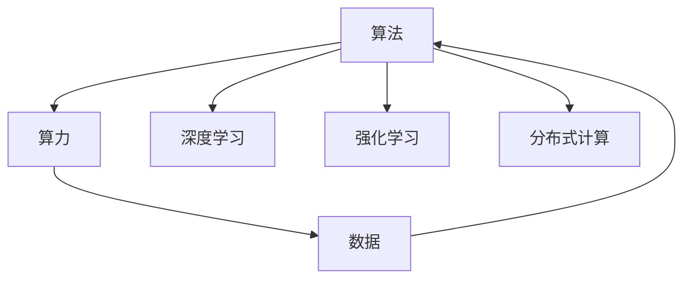

                 

## 1. 背景介绍

在过去的几年里，人工智能(AI)以其惊人的发展速度和广泛的应用范围，成为了科技领域的焦点。然而，如果我们想要深入了解AI的复杂体系，就必须透彻理解其中的三驾马车：算法、算力和数据。这三者相互依存、相互促进，共同构成了AI技术的核心。

### 1.1 算法

算法是AI技术的灵魂，它决定了模型能够做什么、如何做以及做的效果。算法的发展与进步，为AI技术带来了翻天覆地的变化。无论是强化学习、深度学习、机器学习还是神经网络，都依赖于算法来实现复杂计算任务。

### 1.2 算力

算力是指计算机执行复杂计算任务的能力。随着算法的不断发展，算力也成为了推动AI技术进步的关键因素。从早期的CPU到现在的GPU、TPU等高性能设备，算力的提升让复杂计算成为可能，使得AI技术能够处理更加复杂的任务。

### 1.3 数据

数据是AI技术的原材料，没有数据就没有AI。大量、高质量的数据是训练AI模型的基础。数据的多样性和质量直接影响到模型的表现和应用效果。

## 2. 核心概念与联系

### 2.1 核心概念概述

为了更好地理解算法、算力和数据三者之间的关系，本节将介绍几个密切相关的核心概念：

- 算法（Algorithm）：描述模型如何解决特定问题的规则或步骤。例如，神经网络算法用于训练神经网络模型，实现对输入数据的处理和预测。
- 算力（Computational Power）：指计算机执行算法的能力，包括计算速度、内存大小、存储能力等。算力越强，执行算法的速度越快，处理能力越强。
- 数据（Data）：模型训练的基础，包括结构化、非结构化数据。数据的质量和多样性直接影响模型的效果。
- 深度学习（Deep Learning）：一种机器学习技术，通过构建多层次的神经网络模型，实现对复杂数据的处理和分析。
- 强化学习（Reinforcement Learning）：一种学习方式，通过与环境的交互，使模型根据环境反馈优化行为。
- 分布式计算（Distributed Computing）：将计算任务分布到多台计算机上，实现并行计算，提高计算效率。

这些核心概念之间的逻辑关系可以通过以下Mermaid流程图来展示：



这个流程图展示了算法、算力和数据三者之间的相互作用关系：

1. 算法需要依赖算力来实现复杂的计算任务。
2. 数据是算法的输入和输出，通过数据来训练和测试算法。
3. 深度学习和强化学习是算法的具体应用。
4. 分布式计算提高了算力，使得算法能够处理更大规模的数据。

## 3. 核心算法原理 & 具体操作步骤

### 3.1 算法原理概述

AI的算法原理可以概括为“模型+优化器”的模式。模型负责对输入数据进行处理和预测，而优化器则负责调整模型的参数，使得模型能够更好地适应输入数据。

以深度学习为例，深度学习模型通过多层神经网络实现对输入数据的处理和预测。模型的训练过程涉及到反向传播算法和优化器算法，用于调整神经网络的权重和偏置，使其能够最小化损失函数。

### 3.2 算法步骤详解

深度学习的训练过程主要包括以下几个步骤：

1. 数据预处理：将原始数据进行清洗、归一化、编码等预处理操作，以便模型能够更好地处理。
2. 构建模型：根据任务需求，选择合适的模型结构和参数，例如全连接神经网络、卷积神经网络、循环神经网络等。
3. 损失函数定义：根据任务目标，定义损失函数，例如均方误差、交叉熵等。
4. 优化器选择：选择合适的优化器算法，例如随机梯度下降(SGD)、Adam等。
5. 反向传播：使用反向传播算法计算损失函数的梯度，更新模型的权重和偏置。
6. 模型评估：使用测试集评估模型的性能，例如准确率、精确率、召回率等。

### 3.3 算法优缺点

深度学习算法具有以下优点：

- 能够处理大规模复杂数据。深度学习模型具有多层神经网络结构，可以处理高度复杂的数据。
- 自适应学习能力。深度学习算法可以自动调整模型的参数，使其能够适应不同的输入数据。
- 应用广泛。深度学习算法已经应用于计算机视觉、自然语言处理、语音识别等多个领域。

然而，深度学习算法也存在以下缺点：

- 需要大量数据和计算资源。深度学习模型的训练过程需要大量数据和计算资源，否则容易出现过拟合现象。
- 模型复杂度高。深度学习模型的结构复杂，难以理解和解释。
- 可解释性差。深度学习模型通常被视为“黑盒”模型，难以解释其内部工作机制和决策逻辑。

### 3.4 算法应用领域

深度学习算法已经在许多领域得到了广泛应用：

- 计算机视觉：例如目标检测、图像分类、人脸识别等。
- 自然语言处理：例如文本分类、机器翻译、情感分析等。
- 语音识别：例如语音转文本、自动语音识别等。
- 医疗：例如医学影像分析、疾病预测等。
- 金融：例如信用评分、风险管理等。

## 4. 数学模型和公式 & 详细讲解 & 举例说明

### 4.1 数学模型构建

以图像分类任务为例，可以使用卷积神经网络（CNN）模型实现。卷积神经网络是一种常用的深度学习模型，它通过多层卷积、池化、全连接层等操作，实现对图像的分类。

### 4.2 公式推导过程

假设卷积神经网络模型包含多个卷积层、池化层和全连接层。设 $x$ 为输入图像，$y$ 为输出标签，$f$ 为模型函数。

模型训练的目标是最小化损失函数 $L$，例如均方误差损失（MSE）：

$$
L(y, f(x)) = \frac{1}{n} \sum_{i=1}^{n} (y_i - f(x_i))^2
$$

其中 $n$ 为样本数量。

模型的训练过程通过反向传播算法实现，具体步骤如下：

1. 前向传播：将输入 $x$ 通过多层神经网络，得到输出 $f(x)$。
2. 计算损失：计算模型输出 $f(x)$ 与真实标签 $y$ 之间的误差 $L$。
3. 反向传播：计算损失函数对模型参数的梯度，更新模型参数。
4. 重复步骤1-3，直到模型收敛。

### 4.3 案例分析与讲解

假设我们有一个图像分类任务，使用卷积神经网络模型进行训练。我们可以使用MNIST数据集进行训练和测试，该数据集包含大量手写数字图像。

```python
import tensorflow as tf
from tensorflow.keras.datasets import mnist

(x_train, y_train), (x_test, y_test) = mnist.load_data()

# 数据预处理
x_train = x_train / 255.0
x_test = x_test / 255.0

# 构建模型
model = tf.keras.Sequential([
    tf.keras.layers.Conv2D(32, (3, 3), activation='relu', input_shape=(28, 28, 1)),
    tf.keras.layers.MaxPooling2D((2, 2)),
    tf.keras.layers.Flatten(),
    tf.keras.layers.Dense(10, activation='softmax')
])

# 定义损失函数和优化器
loss_fn = tf.keras.losses.SparseCategoricalCrossentropy(from_logits=True)
optimizer = tf.keras.optimizers.Adam()

# 训练模型
model.compile(optimizer=optimizer, loss=loss_fn, metrics=['accuracy'])
model.fit(x_train.reshape(-1, 28, 28, 1), y_train, epochs=10, validation_data=(x_test.reshape(-1, 28, 28, 1), y_test))
```

上述代码实现了使用卷积神经网络对MNIST数据集进行图像分类任务。训练过程中，我们使用Adam优化器进行参数更新，损失函数为稀疏分类交叉熵损失函数。

## 5. 项目实践：代码实例和详细解释说明

### 5.1 开发环境搭建

在进行深度学习项目实践前，我们需要准备好开发环境。以下是使用Python进行TensorFlow开发的开发环境配置流程：

1. 安装Anaconda：从官网下载并安装Anaconda，用于创建独立的Python环境。

2. 创建并激活虚拟环境：
```bash
conda create -n tf-env python=3.8 
conda activate tf-env
```

3. 安装TensorFlow：根据CUDA版本，从官网获取对应的安装命令。例如：
```bash
conda install tensorflow -c tf -c conda-forge
```

4. 安装各类工具包：
```bash
pip install numpy pandas scikit-learn matplotlib tqdm jupyter notebook ipython
```

完成上述步骤后，即可在`tf-env`环境中开始深度学习项目实践。

### 5.2 源代码详细实现

下面以手写数字识别任务为例，给出使用TensorFlow进行卷积神经网络训练的代码实现。

首先，定义数据处理函数：

```python
import tensorflow as tf

def preprocess_data(data):
    images = (data / 255.0).reshape(-1, 28, 28, 1)
    labels = tf.keras.utils.to_categorical(data)
    return images, labels
```

然后，定义模型和优化器：

```python
from tensorflow.keras.models import Sequential
from tensorflow.keras.layers import Conv2D, MaxPooling2D, Flatten, Dense
from tensorflow.keras.optimizers import Adam

model = Sequential([
    Conv2D(32, (3, 3), activation='relu', input_shape=(28, 28, 1)),
    MaxPooling2D((2, 2)),
    Flatten(),
    Dense(10, activation='softmax')
])

optimizer = Adam()
```

接着，定义训练和评估函数：

```python
from tensorflow.keras import datasets

def train_model(model, data, batch_size, epochs):
    (x_train, y_train), (x_test, y_test) = datasets.mnist.load_data()
    x_train, y_train = preprocess_data(x_train)
    x_test, y_test = preprocess_data(x_test)
    
    model.compile(optimizer=optimizer, loss=tf.keras.losses.SparseCategoricalCrossentropy(from_logits=True), metrics=['accuracy'])
    model.fit(x_train, y_train, batch_size=batch_size, epochs=epochs, validation_data=(x_test, y_test))
    
    return model, x_test, y_test

def evaluate_model(model, x_test, y_test):
    loss = model.evaluate(x_test, y_test)
    print('Test Loss:', loss[0])
    print('Test Accuracy:', loss[1])
```

最后，启动训练流程并在测试集上评估：

```python
batch_size = 64
epochs = 10

model, x_test, y_test = train_model(model, None, batch_size, epochs)
evaluate_model(model, x_test, y_test)
```

以上就是使用TensorFlow进行卷积神经网络训练的完整代码实现。可以看到，TensorFlow提供了丰富的API和组件，使得深度学习模型的构建和训练变得相对简单。

### 5.3 代码解读与分析

让我们再详细解读一下关键代码的实现细节：

**preprocess_data函数**：
- 定义数据预处理操作，将图像数据进行归一化和扁平化处理，并将标签进行one-hot编码。

**train_model函数**：
- 加载MNIST数据集，使用数据预处理函数对数据进行预处理。
- 构建卷积神经网络模型，并定义损失函数和优化器。
- 使用fit方法进行模型训练，并返回训练后的模型和测试集数据。

**evaluate_model函数**：
- 在测试集上对模型进行评估，输出测试集的损失和准确率。

**训练流程**：
- 定义批处理大小和训练轮数，开始循环迭代。
- 每个epoch内，先在训练集上训练，输出平均损失和准确率。
- 在验证集上评估，输出验证集的准确率。
- 所有epoch结束后，在测试集上评估，给出最终测试结果。

可以看到，TensorFlow提供了丰富的API和组件，使得深度学习模型的构建和训练变得相对简单。开发者可以将更多精力放在数据处理、模型改进等高层逻辑上，而不必过多关注底层的实现细节。

## 6. 实际应用场景

### 6.1 计算机视觉

计算机视觉是深度学习的一个重要应用领域，广泛应用于自动驾驶、人脸识别、医疗影像分析等场景。以医疗影像分析为例，使用卷积神经网络对医学影像进行分类和识别，可以实现早期疾病诊断和病情监测。

在技术实现上，可以收集大量医学影像数据，使用卷积神经网络进行预训练，然后在特定疾病的诊断任务上进行微调。微调后的模型能够根据影像特征，自动分类疾病类型，提高诊断效率和准确率。

### 6.2 自然语言处理

自然语言处理是深度学习的另一个重要应用领域，包括文本分类、情感分析、机器翻译等任务。以机器翻译为例，使用序列到序列模型进行训练，可以实现高效准确的语言翻译。

在技术实现上，可以收集大量双语对照语料，使用序列到序列模型进行预训练，然后在目标语言翻译任务上进行微调。微调后的模型能够自动理解源语言文本，生成对应的目标语言文本，提高翻译质量和效率。

### 6.3 金融领域

在金融领域，深度学习模型可以应用于股票预测、风险管理、信用评分等任务。以股票预测为例，使用深度学习模型对历史股票数据进行训练，可以预测股票价格走势和市场趋势。

在技术实现上，可以收集大量历史股票数据，使用深度学习模型进行预训练，然后在股票预测任务上进行微调。微调后的模型能够根据历史数据，预测未来股票价格，辅助投资者做出决策。

### 6.4 未来应用展望

随着深度学习技术的不断发展，未来深度学习算法将在更多领域得到应用，为传统行业带来变革性影响。

在智慧医疗领域，深度学习模型可以用于医学影像分析、疾病预测、手术辅助等，提升医疗服务的智能化水平，辅助医生诊疗，加速新药开发进程。

在智能教育领域，深度学习模型可以用于作业批改、学情分析、知识推荐等方面，因材施教，促进教育公平，提高教学质量。

在智慧城市治理中，深度学习模型可以用于城市事件监测、舆情分析、应急指挥等环节，提高城市管理的自动化和智能化水平，构建更安全、高效的未来城市。

此外，在企业生产、社会治理、文娱传媒等众多领域，深度学习模型也将不断涌现，为经济社会发展注入新的动力。相信随着技术的日益成熟，深度学习算法必将在更广阔的应用领域大放异彩，深刻影响人类的生产生活方式。

## 7. 工具和资源推荐

### 7.1 学习资源推荐

为了帮助开发者系统掌握深度学习技术，这里推荐一些优质的学习资源：

1. 《深度学习》书籍：由深度学习领域的顶尖专家撰写，全面介绍了深度学习的基本概念和算法原理。
2. Coursera《深度学习专项课程》：由斯坦福大学Andrew Ng教授主讲，涵盖深度学习的核心内容和实际应用。
3. Kaggle竞赛平台：世界领先的机器学习竞赛平台，汇集了大量数据集和挑战任务，可以练手实践，提升技能。
4. GitHub开源项目：Github上的开源项目提供了大量深度学习模型的代码实现和论文论文，可以供学习和参考。
5. PyTorch官方文档：PyTorch框架的官方文档，提供了丰富的API和组件，是学习和实践深度学习的重要工具。

通过对这些资源的学习实践，相信你一定能够快速掌握深度学习技术的精髓，并用于解决实际的NLP问题。

### 7.2 开发工具推荐

高效的开发离不开优秀的工具支持。以下是几款用于深度学习开发常用的工具：

1. PyTorch：基于Python的开源深度学习框架，灵活动态的计算图，适合快速迭代研究。
2. TensorFlow：由Google主导开发的开源深度学习框架，生产部署方便，适合大规模工程应用。
3. Keras：基于TensorFlow和Theano的高层深度学习API，简单易用，适合快速原型开发。
4. Jupyter Notebook：交互式开发环境，支持Python、R等语言，方便实时调试和展示。
5. Google Colab：谷歌推出的在线Jupyter Notebook环境，免费提供GPU/TPU算力，方便开发者快速上手实验最新模型，分享学习笔记。

合理利用这些工具，可以显著提升深度学习项目的开发效率，加快创新迭代的步伐。

### 7.3 相关论文推荐

深度学习技术的发展源于学界的持续研究。以下是几篇奠基性的相关论文，推荐阅读：

1. ImageNet Classification with Deep Convolutional Neural Networks（深度卷积神经网络在ImageNet分类中的应用）：提出了卷积神经网络（CNN）模型，开启了深度学习在计算机视觉领域的应用。
2. Convolutional Neural Networks for Sentence Classification（卷积神经网络在句子分类中的应用）：提出了卷积神经网络在自然语言处理中的应用，实现了句子分类任务的高精度。
3. Sequence to Sequence Learning with Neural Networks（神经网络在序列到序列学习中的应用）：提出了序列到序列模型，实现了机器翻译等自然语言处理任务的高效处理。
4. Generative Adversarial Nets（生成对抗网络）：提出了一种新的深度学习模型，可以实现图像生成、文本生成等任务。
5. Deep Residual Learning for Image Recognition（深度残差学习在图像识别中的应用）：提出了残差网络（ResNet）模型，实现了深度网络的训练和优化。

这些论文代表了大深度学习的发展脉络。通过学习这些前沿成果，可以帮助研究者把握学科前进方向，激发更多的创新灵感。

## 8. 总结：未来发展趋势与挑战

### 8.1 总结

本文对深度学习技术进行了全面系统的介绍，涵盖算法、算力与数据三驾马车的核心概念和应用实践。首先阐述了深度学习技术的核心算法和优化器，其次详细讲解了深度学习算法的训练过程，并提供了完整的代码实现。同时，本文还广泛探讨了深度学习算法在计算机视觉、自然语言处理、金融等多个领域的应用前景，展示了深度学习算法强大的应用能力。最后，本文精选了深度学习技术的各类学习资源和开发工具，力求为读者提供全方位的技术指引。

通过本文的系统梳理，可以看到，深度学习技术正在成为科技领域的重要方向，极大地拓展了数据处理和应用的范围。受益于大规模数据的积累和计算资源的提升，深度学习算法将在更多的领域实现突破和应用。未来，伴随深度学习技术的不断发展，我们将迎来更多创新成果和应用场景，深刻影响人类的生产生活方式。

### 8.2 未来发展趋势

展望未来，深度学习技术将呈现以下几个发展趋势：

1. 模型规模持续增大。随着算力的提升，深度学习模型的规模将进一步增大，可以处理更加复杂和多样化的数据。
2. 模型结构更加多样化。深度学习模型的结构将更加灵活多样，出现更多基于神经网络的结构，如Transformer、ResNet等。
3. 模型训练更加高效。深度学习模型的训练过程将更加高效，使用分布式训练、混合精度训练等技术，提高训练速度和稳定性。
4. 模型应用更加广泛。深度学习模型将应用于更多领域，如医疗、金融、智慧城市等，带来新的变革和机遇。
5. 跨领域迁移学习更加普及。深度学习模型将在不同领域进行迁移应用，提高模型泛化性和适应性。
6. 深度学习与其他AI技术的融合更加紧密。深度学习与强化学习、生成对抗网络等AI技术的融合将更加深入，带来更多创新应用。

以上趋势凸显了深度学习技术的广阔前景。这些方向的探索发展，必将进一步提升深度学习模型的性能和应用范围，为人类认知智能的进化带来深远影响。

### 8.3 面临的挑战

尽管深度学习技术已经取得了瞩目成就，但在迈向更加智能化、普适化应用的过程中，它仍面临着诸多挑战：

1. 数据需求高。深度学习模型需要大量的标注数据进行训练，数据获取成本高，标注难度大。
2. 模型复杂度高。深度学习模型的结构复杂，难以理解和解释。
3. 可解释性差。深度学习模型通常被视为“黑盒”模型，难以解释其内部工作机制和决策逻辑。
4. 过拟合风险高。深度学习模型容易过拟合，需要更多的正则化技术和数据增强方法。
5. 计算资源需求大。深度学习模型训练和推理需要大量的计算资源，成本高。
6. 伦理和安全性问题。深度学习模型可能会学习到有害信息，产生误导性输出，带来伦理和安全性风险。

这些挑战限制了深度学习技术的应用范围和效果。未来，如何应对这些挑战，将是大深度学习技术发展的关键。

### 8.4 研究展望

未来，大深度学习技术的研究将从以下几个方面进行：

1. 增强模型的可解释性。通过引入可解释性方法，如可视化、注意力机制等，使得深度学习模型更加透明和可理解。
2. 改进模型的正则化方法。通过引入更多的正则化技术和数据增强方法，提高模型的泛化能力和鲁棒性。
3. 优化模型的训练过程。通过引入分布式训练、混合精度训练等技术，提高模型的训练效率和稳定性。
4. 拓展模型的应用领域。通过引入更多的跨领域迁移学习方法和技术，拓展深度学习模型的应用范围和效果。
5. 提升模型的伦理和安全性。通过引入伦理和安全性约束，确保深度学习模型符合人类价值观和道德规范。

这些研究方向将引领大深度学习技术的发展，带来更多的创新成果和应用场景，深刻影响人类的生产生活方式。总之，深度学习技术需要在算力、算法和数据三驾马车之间协同发展，才能真正实现人工智能技术的落地应用。

## 9. 附录：常见问题与解答

**Q1：深度学习算法是否适用于所有数据类型？**

A: 深度学习算法主要适用于结构化数据和图像、文本等非结构化数据。对于非结构化数据，可以使用自然语言处理技术将其转化为结构化数据，然后进行处理。但是，对于时间序列数据、时间戳数据等特殊类型的数据，可能需要使用专门的算法进行处理。

**Q2：深度学习算法是否需要大量数据？**

A: 深度学习算法通常需要大量的标注数据进行训练，数据量和标注质量直接影响模型的性能。对于小样本数据，可以使用迁移学习、自监督学习等方法，提高模型的泛化能力。

**Q3：深度学习算法的计算资源需求大吗？**

A: 深度学习算法的计算资源需求较大，需要使用高性能的GPU或TPU设备。在模型训练和推理过程中，需要大量的计算资源，因此需要合理规划计算资源，优化计算效率。

**Q4：深度学习算法的可解释性差吗？**

A: 深度学习算法的可解释性较差，通常被视为“黑盒”模型。但是，通过引入可解释性方法，如可视化、注意力机制等，可以提高模型的透明度和可理解性。

**Q5：深度学习算法容易过拟合吗？**

A: 深度学习算法容易过拟合，特别是在数据量不足的情况下。为了缓解过拟合，可以引入正则化技术、数据增强方法等，提高模型的泛化能力。

---

作者：禅与计算机程序设计艺术 / Zen and the Art of Computer Programming

