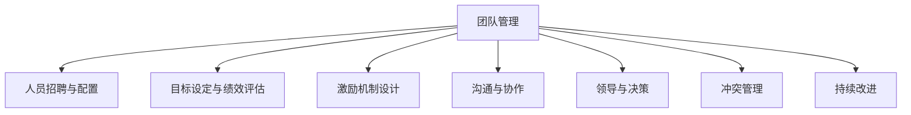

                 

# 管理的智慧：激发团队潜能

## 1. 背景介绍

### 1.1 问题由来

在现代企业环境中，高效的管理和激发团队潜能成为企业成功的关键因素。无论是在技术创新、产品开发，还是在市场营销、客户服务等领域，团队的高效协同和优秀表现都是企业竞争力的重要体现。然而，团队管理并非易事，如何激发团队潜能、提升团队效能，是一个复杂且需要精细化管理的问题。本文将探讨团队管理的智慧，从核心概念、算法原理、具体操作步骤等多个方面，全面介绍如何通过科学的管理方法和工具，激发团队潜能，提升团队效能。

### 1.2 问题核心关键点

管理团队的核心在于通过合适的策略和工具，最大化团队的效能和创新力。以下是团队管理中需要重点关注的关键点：

- 人员招聘与团队构成：选择合适的团队成员，构建高效协作的团队结构。
- 目标设定与绩效评估：设定明确的目标和KPI，进行定期的绩效评估，确保团队朝着共同目标前进。
- 激励机制设计：设计合理的激励机制，激发团队成员的积极性。
- 沟通与协作：建立有效的沟通渠道，促进团队成员间的协作和信息共享。
- 领导与决策：培养优秀的领导者，制定科学的决策流程，确保团队决策的合理性。
- 冲突管理：及时处理团队内部的冲突，维护团队和谐。

## 2. 核心概念与联系

### 2.1 核心概念概述

为更好地理解团队管理的智慧，本节将介绍几个密切相关的核心概念：

- **团队管理（Team Management）**：通过有效策略和工具，最大化团队效能和创新力，实现共同目标的过程。
- **人员招聘与配置（Recruitment and Personnel Deployment）**：选择合适的团队成员，构建高效协作的团队结构。
- **目标设定与绩效评估（Goal Setting and Performance Evaluation）**：设定明确的目标和KPI，进行定期的绩效评估，确保团队朝着共同目标前进。
- **激励机制设计（Incentive Design）**：设计合理的激励机制，激发团队成员的积极性。
- **沟通与协作（Communication and Collaboration）**：建立有效的沟通渠道，促进团队成员间的协作和信息共享。
- **领导与决策（Leadership and Decision-making）**：培养优秀的领导者，制定科学的决策流程，确保团队决策的合理性。
- **冲突管理（Conflict Management）**：及时处理团队内部的冲突，维护团队和谐。

这些核心概念之间的逻辑关系可以通过以下Mermaid流程图来展示：



这个流程图展示了几项核心团队管理活动及其相互关系：

1. 团队管理是核心，通过人员配置、目标设定、激励机制、沟通协作、领导决策和冲突管理等活动，实现团队效能的提升。
2. 人员配置是基础，确保团队成员能力和结构的合理性。
3. 目标设定是方向，明确团队共同目标，确保团队成员的努力方向一致。
4. 激励机制是动力，通过奖励和惩罚机制，激发团队成员的积极性。
5. 沟通协作是桥梁，建立有效的沟通渠道，促进团队成员间的协作和信息共享。
6. 领导决策是关键，培养优秀的领导者，制定科学的决策流程，确保团队决策的合理性。
7. 冲突管理是保障，及时处理团队内部的冲突，维护团队和谐。

通过理解这些核心概念，我们可以更好地把握团队管理的工作原理和优化方向。

## 3. 核心算法原理 & 具体操作步骤
### 3.1 算法原理概述

团队管理的智慧在于通过科学的方法和工具，最大化团队的效能和创新力。其核心思想是：选择合适的团队成员，设定明确的目标和激励机制，建立有效的沟通协作渠道，培养优秀的领导者，及时处理团队内部的冲突，通过持续改进，实现团队效能的提升。

形式化地，假设团队 $T$ 的初始状态为 $s_0$，目标是 $G$，则团队管理的优化目标是最小化状态变化 $s_0 \to s_G$ 的代价 $C$，即：

$$
\min_{\pi} C(s_0, s_G) \text{ 其中 } \pi \text{ 为团队管理的策略}
$$

在实践中，我们通常使用系统化的方法，如OKR目标管理、Scrum敏捷开发、PDCA持续改进等，来优化团队管理的各个环节。通过梯度下降等优化算法，逐步更新团队管理策略，最小化状态变化的代价。

### 3.2 算法步骤详解

团队管理的优化过程包括以下几个关键步骤：

**Step 1: 准备团队和目标**
- 选择合适的团队成员，构建高效协作的团队结构。
- 设定明确的目标和KPI，进行定期的绩效评估。

**Step 2: 设计激励机制**
- 设计合理的激励机制，激发团队成员的积极性。
- 根据团队成员的特点和需求，灵活调整激励策略。

**Step 3: 建立沟通与协作渠道**
- 建立有效的沟通渠道，促进团队成员间的协作和信息共享。
- 使用工具如Slack、Microsoft Teams等，提升团队沟通效率。

**Step 4: 培养优秀领导者**
- 通过培训、团队建设活动等方式，培养优秀的领导者。
- 设定科学的决策流程，确保团队决策的合理性。

**Step 5: 冲突管理**
- 及时处理团队内部的冲突，维护团队和谐。
- 采用冲突调解、协商等方法，化解团队矛盾。

**Step 6: 持续改进**
- 定期回顾团队管理的各个环节，进行改进和优化。
- 使用PDCA等方法，循环迭代，逐步提升团队效能。

以上是团队管理的优化过程。在实际应用中，还需要根据团队的具体情况，对各个环节进行优化设计，如改进绩效评估体系、引入更有效的激励机制、优化沟通协作流程等，以进一步提升团队绩效。

### 3.3 算法优缺点

团队管理的智慧在于通过科学的方法和工具，最大化团队的效能和创新力。其优点在于：

1. 系统化方法。通过系统化的方法和工具，可以更全面地覆盖团队管理的各个环节，提升团队效能。
2. 目标明确。设定明确的目标和KPI，可以确保团队成员的努力方向一致，提升团队凝聚力。
3. 激励有效。设计合理的激励机制，可以激发团队成员的积极性，提升工作投入。
4. 沟通顺畅。建立有效的沟通渠道，可以促进团队成员间的协作和信息共享，提升团队协作效率。
5. 决策科学。培养优秀的领导者，制定科学的决策流程，可以确保团队决策的合理性。
6. 冲突管理。及时处理团队内部的冲突，可以维护团队和谐，提升团队氛围。

其缺点在于：

1. 执行难度高。科学管理需要全员参与，且需要长期坚持，执行难度较大。
2. 效果周期长。团队管理的效果往往需要较长时间才能显现，难以短期内看到明显提升。
3. 管理复杂。团队管理涉及多个环节，复杂度较高，需要综合考虑各方因素。
4. 人员依赖强。团队管理的效果高度依赖团队成员的能力和配合度，个体差异可能导致效果不同。

尽管存在这些局限性，但就目前而言，科学团队管理仍然是最主流且有效的管理范式。未来相关研究的重点在于如何进一步降低管理复杂度，提高执行效率，同时兼顾公平性和可持续性等因素。

### 3.4 算法应用领域

科学团队管理的方法和工具，在企业组织、科研团队、项目开发、客户服务等诸多领域都得到了广泛应用，成为团队高效协作的重要手段。

在企业组织中，科学团队管理可以提升员工的工作满意度和组织效率，促进企业的创新和发展。

在科研团队中，科学团队管理可以提升团队的合作效率和科研产出，推动科学研究的进步。

在项目开发中，科学团队管理可以提高项目的开发效率和质量，确保项目按时交付。

在客户服务中，科学团队管理可以提高客户服务质量，提升客户满意度和忠诚度。

除了上述这些经典应用外，科学团队管理还被创新性地应用到更多场景中，如开源社区管理、在线教育平台管理等，为团队高效协作提供了新的解决方案。随着科学管理方法的不断进步，相信团队管理将会在更广泛的领域发挥更大的作用。

## 4. 数学模型和公式 & 详细讲解 & 举例说明

### 4.1 数学模型构建

为了更好地理解科学团队管理的数学原理，本节将使用数学语言对团队管理过程进行更加严格的刻画。

假设团队管理的目标函数为 $C(s_0, s_G)$，其中 $s_0$ 为初始状态，$s_G$ 为目标状态。目标函数可以表示为：

$$
C(s_0, s_G) = \sum_{i=0}^{n-1} c_i(s_{i}, s_{i+1})
$$

其中 $c_i(s_{i}, s_{i+1})$ 为第 $i$ 次状态转换的代价，$n$ 为状态变化的总次数。目标函数的目标是最小化总的代价 $C(s_0, s_G)$。

### 4.2 公式推导过程

以下我们以OKR目标管理为例，推导目标设定与绩效评估的数学模型及其优化过程。

假设团队管理的目标为 $G$，设定 $K$ 个关键结果指标（OKR），每个OKR的目标值 $T_i$ 和实际值 $A_i$ 如下：

$$
T_i = \{T_{i,1}, T_{i,2}, ..., T_{i,K}\}
$$
$$
A_i = \{A_{i,1}, A_{i,2}, ..., A_{i,K}\}
$$

则目标函数可以表示为：

$$
C = \sum_{i=1}^{N} (T_i - A_i)^2
$$

其中 $N$ 为OKR数量。目标函数的目标是最小化 $C$。

根据梯度下降等优化算法，目标函数的梯度为：

$$
\frac{\partial C}{\partial A_i} = 2(T_i - A_i)
$$

因此，每次迭代的目标设定与绩效评估过程可以表示为：

$$
A_i^{(t+1)} = A_i^{(t)} - \eta \frac{\partial C}{\partial A_i}
$$

其中 $\eta$ 为学习率，$t$ 为迭代次数。

在得到目标函数的梯度后，即可带入目标设定与绩效评估的公式，完成模型的迭代优化。重复上述过程直至收敛，最终得到适应团队目标的最优状态。

### 4.3 案例分析与讲解

下面以一个实际案例，展示如何利用OKR目标管理进行团队目标设定与绩效评估。

假设某研发团队的目标是推出一款新产品，设定了以下三个OKR：

1. 完成产品的功能设计，目标值为6个月内完成。
2. 完成产品的原型开发，目标值为3个月内完成。
3. 完成产品的测试验证，目标值为2个月内完成。

每个月团队评估一次，计算每个OKR的实际完成情况。经过两轮评估后，得到如下结果：

- 第一个OKR：6个月内完成，实际完成时间为5个月。
- 第二个OKR：3个月内完成，实际完成时间为4个月。
- 第三个OKR：2个月内完成，实际完成时间为1个月。

将实际完成情况带入目标函数，得到：

$$
C = (6-5)^2 + (3-4)^2 + (2-1)^2 = 1 + 1 + 1 = 3
$$

根据目标函数的梯度，得到每个OKR的绩效改进方向：

$$
\frac{\partial C}{\partial T_1} = 2(6-5) = 2
$$
$$
\frac{\partial C}{\partial T_2} = 2(3-4) = -2
$$
$$
\frac{\partial C}{\partial T_3} = 2(2-1) = 2
$$

因此，下一轮OKR的目标设定为：

- 第一个OKR：6.5个月内完成。
- 第二个OKR：2.5个月内完成。
- 第三个OKR：2.5个月内完成。

经过下一轮评估，再次计算目标函数：

$$
C = (6.5-5.5)^2 + (2.5-4)^2 + (2.5-2)^2 = 3.5^2 + (-1.5)^2 + 0.5^2 = 12.25 + 2.25 + 0.25 = 14.75
$$

可以看到，通过目标设定与绩效评估的优化过程，团队逐渐接近目标，提升了整体绩效。

## 5. 项目实践：代码实例和详细解释说明
### 5.1 开发环境搭建

在进行科学团队管理的实践前，我们需要准备好开发环境。以下是使用Python进行Scrum敏捷开发的项目实践环境配置流程：

1. 安装Anaconda：从官网下载并安装Anaconda，用于创建独立的Python环境。

2. 创建并激活虚拟环境：
```bash
conda create -n scrum-env python=3.8 
conda activate scrum-env
```

3. 安装Scrum开发框架：
```bash
pip install scrum
```

4. 安装各类工具包：
```bash
pip install numpy pandas scikit-learn matplotlib tqdm jupyter notebook ipython
```

完成上述步骤后，即可在`scrum-env`环境中开始项目实践。

### 5.2 源代码详细实现

下面我们以Scrum敏捷开发为例，给出使用Scrum框架进行团队管理的PyTorch代码实现。

首先，定义Scrum团队的结构和成员：

```python
class Team:
    def __init__(self, members, leader):
        self.members = members
        self.leader = leader

class Member:
    def __init__(self, name, skills):
        self.name = name
        self.skills = skills
```

然后，定义Scrum敏捷开发的目标和任务：

```python
class Sprint:
    def __init__(self, goal, tasks):
        self.goal = goal
        self.tasks = tasks

class Task:
    def __init__(self, name, duration, priority):
        self.name = name
        self.duration = duration
        self.priority = priority
```

接着，定义Scrum敏捷开发的任务分配和进度跟踪：

```python
class Backlog:
    def __init__(self, tasks):
        self.tasks = tasks
        self.completed = []

class SprintPlan:
    def __init__(self, sprint, backlog):
        self.sprint = sprint
        self.backlog = backlog

class TaskProgress:
    def __init__(self, task, percent_completed):
        self.task = task
        self.percent_completed = percent_completed
```

最后，启动Scrum敏捷开发的流程：

```python
# 创建团队和领导
team = Team(members=["Alice", "Bob", "Charlie"], leader="David")
team.leader = "David"

# 创建目标和任务
sprint = Sprint(goal="推出新产品", tasks=[Task(name="功能设计", duration=6, priority=1), Task(name="原型开发", duration=3, priority=2), Task(name="测试验证", duration=2, priority=3)])

# 创建待办事项
backlog = Backlog(tasks=[Task(name="需求分析", duration=1, priority=1), Task(name="界面设计", duration=2, priority=2), Task(name="功能实现", duration=5, priority=3)])

# 创建Sprint计划
sprint_plan = SprintPlan(sprint=sprint, backlog=backlog)

# 迭代执行
for i in range(5):
    # 选择需要执行的任务
    selected_tasks = []
    for task in sprint_plan.backlog:
        if task.priority > 0:
            selected_tasks.append(task)
            task.priority -= 1
    
    # 分配任务给成员
    task_assignments = []
    for task in selected_tasks:
        for member in team.members:
            if task not in task_assignments:
                task_assignments.append(task)
                break
    
    # 更新任务进度
    for task in selected_tasks:
        progress = TaskProgress(task=task, percent_completed=task.duration / 5)
        task.complete(progress)
    
    # 更新待办事项
    for task in selected_tasks:
        sprint_plan.backlog.completed.append(task)
    
    # 打印当前Sprint的进展
    print(f"Sprint {i+1}: {sprint_plan.sprint.goal}, completed tasks: {sprint_plan.backlog.completed}, remaining tasks: {sprint_plan.backlog.tasks}")
```

以上就是使用Scrum敏捷开发进行团队管理的完整代码实现。可以看到，得益于Scrum框架的封装，我们可以用相对简洁的代码完成Scrum敏捷开发的任务管理和进度跟踪。

### 5.3 代码解读与分析

让我们再详细解读一下关键代码的实现细节：

**Team类**：
- `__init__`方法：初始化团队成员和领导者。
- `leader`属性：设置团队领导者。

**Member类**：
- `__init__`方法：初始化成员姓名和技能。

**Sprint类**：
- `__init__`方法：初始化Sprint的目标和任务。
- `goal`属性：设定Sprint的目标。
- `tasks`属性：存储Sprint的任务列表。

**Task类**：
- `__init__`方法：初始化任务的名称、持续时间、优先级。
- `name`属性：任务名称。
- `duration`属性：任务持续时间。
- `priority`属性：任务优先级。

**Backlog类**：
- `__init__`方法：初始化待办事项列表。
- `tasks`属性：存储待办事项列表。
- `completed`属性：存储已完成事项的列表。

**SprintPlan类**：
- `__init__`方法：初始化Sprint计划，包括Sprint和待办事项。
- `sprint`属性：存储Sprint的目标。
- `backlog`属性：存储待办事项列表。

**TaskProgress类**：
- `__init__`方法：初始化任务进度，包括任务和完成百分比。
- `task`属性：存储任务对象。
- `percent_completed`属性：存储任务完成百分比。

**Sprint敏捷开发流程**：
- 创建团队、目标和任务。
- 创建待办事项列表。
- 创建Sprint计划。
- 迭代执行，选择任务、分配任务、更新进度、更新待办事项。
- 打印当前Sprint的进展。

可以看到，Scrum敏捷开发框架为团队管理提供了系统的工具和流程，使得任务分配、进度跟踪、Sprint计划等管理过程更加规范和高效。

当然，工业级的系统实现还需考虑更多因素，如Sprint回溯、迭代优化、绩效评估等。但核心的敏捷开发流程基本与此类似。

## 6. 实际应用场景
### 6.1 智能客服系统

基于Scrum敏捷开发的智能客服系统，可以显著提升客户服务的效率和质量。传统的客服系统依赖人工服务，响应速度慢且容易出错，无法满足大量用户的即时需求。而通过敏捷开发构建的智能客服系统，可以持续迭代优化，快速响应用户咨询，提升客户满意度。

在技术实现上，可以收集企业内部的历史客服对话记录，将问题和最佳答复构建成敏捷开发任务，在此基础上对预训练客服模型进行敏捷开发。敏捷开发过程中的持续反馈和迭代改进，使客服模型能够自动理解用户意图，匹配最合适的答案模板进行回复。对于客户提出的新问题，还可以接入检索系统实时搜索相关内容，动态组织生成回答。如此构建的智能客服系统，能大幅提升客户咨询体验和问题解决效率。

### 6.2 金融舆情监测

金融机构需要实时监测市场舆论动向，以便及时应对负面信息传播，规避金融风险。传统的人工监测方式成本高、效率低，难以应对网络时代海量信息爆发的挑战。基于Scrum敏捷开发的文本分类和情感分析技术，为金融舆情监测提供了新的解决方案。

具体而言，可以收集金融领域相关的新闻、报道、评论等文本数据，并对其进行主题标注和情感标注。在此基础上对预训练语言模型进行敏捷开发，使其能够自动判断文本属于何种主题，情感倾向是正面、中性还是负面。将敏捷开发后的模型应用到实时抓取的网络文本数据，就能够自动监测不同主题下的情感变化趋势，一旦发现负面信息激增等异常情况，系统便会自动预警，帮助金融机构快速应对潜在风险。

### 6.3 个性化推荐系统

当前的推荐系统往往只依赖用户的历史行为数据进行物品推荐，无法深入理解用户的真实兴趣偏好。基于Scrum敏捷开发的个性化推荐系统，可以更好地挖掘用户行为背后的语义信息，从而提供更精准、多样的推荐内容。

在实践中，可以收集用户浏览、点击、评论、分享等行为数据，提取和用户交互的物品标题、描述、标签等文本内容。将文本内容作为敏捷开发任务，用户的后续行为（如是否点击、购买等）作为敏捷开发的反馈信号，在此基础上敏捷开发预训练语言模型。敏捷开发后的模型能够从文本内容中准确把握用户的兴趣点。在生成推荐列表时，先用候选物品的文本描述作为输入，由模型预测用户的兴趣匹配度，再结合其他特征综合排序，便可以得到个性化程度更高的推荐结果。

### 6.4 未来应用展望

随着Scrum敏捷开发的不断发展，基于敏捷开发的方法和工具，将在更多领域得到应用，为团队高效协作提供新的解决方案。

在智慧医疗领域，基于敏捷开发的方法和工具，智能医疗问答、病历分析、药物研发等应用将提升医疗服务的智能化水平，辅助医生诊疗，加速新药开发进程。

在智能教育领域，基于敏捷开发的个性化推荐系统，因材施教，促进教育公平，提高教学质量。

在智慧城市治理中，基于敏捷开发的方法和工具，智能城市事件监测、舆情分析、应急指挥等环节，提高城市管理的自动化和智能化水平，构建更安全、高效的未来城市。

此外，在企业生产、社会治理、文娱传媒等众多领域，基于Scrum敏捷开发的AI应用也将不断涌现，为经济社会发展注入新的动力。相信随着Scrum敏捷开发方法的不断成熟，敏捷开发范式必将在更多行业领域大放异彩。

## 7. 工具和资源推荐
### 7.1 学习资源推荐

为了帮助开发者系统掌握科学团队管理的理论基础和实践技巧，这里推荐一些优质的学习资源：

1. 《敏捷开发：Principles, Patterns, and Practices》书籍：介绍敏捷开发的核心理念、原则和实践，是敏捷开发的基础学习资源。
2. Scrum官方文档：Scrum官方提供的文档，详细介绍Scrum敏捷开发的标准流程和方法。
3. JIRA官方文档：JIRA是敏捷开发常用的项目管理工具，官方提供的文档详细介绍了如何使用JIRA进行敏捷开发项目管理。
4. Coursera《Agile Software Development》课程：由Coursera提供的敏捷开发课程，涵盖敏捷开发的各个方面，适合系统学习。
5. Scrum Master认证：通过Scrum Master认证，可以获得敏捷开发的系统性培训和认证，提升敏捷开发的专业水平。

通过对这些资源的学习实践，相信你一定能够快速掌握敏捷开发的知识，并应用于实际项目中。

### 7.2 开发工具推荐

高效的开发离不开优秀的工具支持。以下是几款用于Scrum敏捷开发的常用工具：

1. JIRA：敏捷开发常用的项目管理工具，功能强大，适合多团队协作。
2. Confluence：协作文档管理工具，便于团队成员共享信息。
3. Trello：敏捷开发常用的看板工具，简单易用，适合小型团队。
4. Slack：即时通讯工具，方便团队成员沟通协作。
5. Asana：项目管理工具，支持多任务跟踪和管理。
6. GitHub：代码托管工具，支持版本控制和协作开发。

合理利用这些工具，可以显著提升敏捷开发的管理效率，加快项目的开发进度。

### 7.3 相关论文推荐

敏捷开发的发展源于学界的持续研究。以下是几篇奠基性的相关论文，推荐阅读：

1. Agile Software Development: Principles, Patterns, and Practices（《敏捷开发：原则、模式与实践》）：经典书籍，介绍了敏捷开发的核心理念和实践。
2. The Scrum Guide（《Scrum指南》）：Scrum官方指南，详细介绍了Scrum敏捷开发的标准流程和方法。
3. Agile Planning and Estimation（《敏捷计划与估算》）：介绍敏捷开发中的计划与估算方法，帮助团队更好地管理时间和资源。
4. Agile Adoption and Success Factors（《敏捷采用的成功因素》）：研究了敏捷开发在企业中的采用和成功因素，为敏捷开发提供了实践指导。
5. Agile Development and Its Effects on Software Quality（《敏捷开发对软件质量的影响》）：研究了敏捷开发对软件质量的影响，提供了科学依据。

这些论文代表了大规模开发方法的发展脉络。通过学习这些前沿成果，可以帮助研究者把握学科前进方向，激发更多的创新灵感。

## 8. 总结：未来发展趋势与挑战

### 8.1 总结

本文对科学团队管理的智慧进行了全面系统的介绍。首先阐述了科学团队管理的背景和重要性，明确了敏捷开发在提升团队效能和创新力方面的独特价值。其次，从原理到实践，详细讲解了敏捷开发和Scrum敏捷开发的数学原理和关键步骤，给出了敏捷开发任务管理的完整代码实例。同时，本文还广泛探讨了敏捷开发在智能客服、金融舆情、个性化推荐等多个行业领域的应用前景，展示了敏捷开发范式的巨大潜力。此外，本文精选了敏捷开发的各类学习资源，力求为读者提供全方位的技术指引。

通过本文的系统梳理，可以看到，科学团队管理以敏捷开发为核心，通过系统化的方法和工具，最大化团队的效能和创新力。敏捷开发和Scrum敏捷开发为团队高效协作提供了科学的方法和工具，已成为现代企业团队管理的重要范式。受益于敏捷开发方法的发展，科学团队管理必将在更多行业领域得到应用，推动团队协作和组织效能的提升。

### 8.2 未来发展趋势

展望未来，敏捷开发和Scrum敏捷开发将继续发展，引领团队管理的发展趋势：

1. 方法论不断演进。随着敏捷开发理论的不断完善，将涌现更多高效、系统的开发方法论，进一步提升团队协作效率。
2. 技术工具丰富。随着技术工具的不断进步，将出现更多功能强大的敏捷开发工具，提升团队管理效率。
3. 跨领域应用广泛。敏捷开发和Scrum敏捷开发将广泛应用于各个领域，帮助团队更好地应对复杂多变的业务需求。
4. 自动化和智能化。随着自动化和智能化技术的进步，敏捷开发将更多地引入自动化测试、持续集成等技术，提升开发效率和质量。
5. 多模态协同。敏捷开发将逐步引入多模态数据和跨模态技术，提升团队协作和决策的全面性。
6. 数据驱动决策。敏捷开发将更多地引入数据驱动的方法，提升团队管理的科学性和准确性。

以上趋势凸显了敏捷开发和Scrum敏捷开发的重要性和持续发展的潜力。这些方向的探索发展，必将进一步提升团队管理的效果和效率，推动组织的发展进步。

### 8.3 面临的挑战

尽管敏捷开发和Scrum敏捷开发在许多领域取得了显著成效，但在应用过程中也面临着诸多挑战：

1. 复杂度增加。敏捷开发和Scrum敏捷开发适用于中小型团队，但面对大型复杂项目，敏捷开发方法的有效性受到限制。
2. 适应难度高。敏捷开发需要团队具备较高的灵活性和自主性，对于传统的管理模式和技术背景的团队，适应难度较大。
3. 效果评估难。敏捷开发和Scrum敏捷开发的效果评估缺乏客观标准，难以进行科学的量化分析。
4. 沟通障碍。敏捷开发和Scrum敏捷开发强调团队协作，但跨团队沟通和协作往往存在障碍。
5. 工具依赖性强。敏捷开发和Scrum敏捷开发高度依赖特定的工具和技术，工具不稳定或技术不成熟可能导致项目风险。
6. 执行困难。敏捷开发和Scrum敏捷开发需要全员参与，且需要长期坚持，执行难度较大。

尽管存在这些局限性，但就目前而言，敏捷开发和Scrum敏捷开发仍然是团队高效协作的重要范式。未来相关研究的重点在于如何进一步降低敏捷开发的复杂度，提高适应性，同时兼顾科学性和实用性等因素。

### 8.4 研究展望

面对敏捷开发和Scrum敏捷开发所面临的挑战，未来的研究需要在以下几个方面寻求新的突破：

1. 引入更多自动化技术。引入自动化测试、持续集成等技术，提升敏捷开发的效率和质量。
2. 优化敏捷开发方法。结合不同的业务需求，优化敏捷开发的方法和流程，提升适用性。
3. 引入更多数据驱动方法。利用数据分析和机器学习技术，提升敏捷开发的科学性和准确性。
4. 引入更多跨模态技术。引入多模态数据和跨模态技术，提升团队协作和决策的全面性。
5. 引入更多跨团队协作工具。开发更多的跨团队协作工具，提升团队间的沟通和协作效率。
6. 引入更多敏捷开发标准。制定更多的敏捷开发标准和最佳实践，提升敏捷开发的规范性。

这些研究方向的探索，必将引领敏捷开发和Scrum敏捷开发技术迈向更高的台阶，为团队高效协作提供更科学、更高效的方法和工具。面向未来，敏捷开发和Scrum敏捷开发技术还需要与其他人工智能技术进行更深入的融合，如知识表示、因果推理、强化学习等，多路径协同发力，共同推动人工智能技术在垂直行业的规模化落地。只有勇于创新、敢于突破，才能不断拓展科学团队管理的边界，让智能技术更好地造福人类社会。

## 9. 附录：常见问题与解答

**Q1：敏捷开发是否适用于所有类型的项目？**

A: 敏捷开发适用于多数项目，尤其适合复杂多变的项目。敏捷开发通过快速迭代和持续反馈，能够更好地应对变化，提升项目成功率。但对于一些简单的、流程固定的项目，敏捷开发的效果可能不如传统的瀑布模型。因此，在选择项目管理方式时，应根据项目的复杂度、需求变化频率等因素综合考虑。

**Q2：敏捷开发和Scrum敏捷开发有哪些区别？**

A: 敏捷开发是一种灵活的项目管理方法，强调团队协作和持续反馈，适用于多数项目。Scrum敏捷开发是敏捷开发的一种具体实现方式，通过Scrum框架实现敏捷开发的目标，包括Sprint计划、任务管理、回顾和迭代等。Scrum敏捷开发具有更系统、更规范的特点，适合团队协作和项目管理。

**Q3：敏捷开发和Scrum敏捷开发的优点是什么？**

A: 敏捷开发和Scrum敏捷开发的主要优点在于：

1. 快速迭代和持续反馈：通过快速迭代和持续反馈，能够更好地应对变化，提升项目成功率。
2. 团队协作：强调团队协作和自主性，提升团队成员的积极性和协作效率。
3. 灵活性：具有高度的灵活性和适应性，能够应对复杂多变的项目需求。
4. 可预测性：通过持续反馈和迭代，提升项目管理的可预测性和稳定性。

**Q4：敏捷开发和Scrum敏捷开发的缺点是什么？**

A: 敏捷开发和Scrum敏捷开发的主要缺点在于：

1. 复杂度增加：敏捷开发和Scrum敏捷开发适用于中小型团队，对于大型复杂项目，管理复杂度较高。
2. 适应难度高：敏捷开发和Scrum敏捷开发需要团队具备较高的灵活性和自主性，对于传统的管理模式和技术背景的团队，适应难度较大。
3. 效果评估难：敏捷开发和Scrum敏捷开发的效果评估缺乏客观标准，难以进行科学的量化分析。
4. 沟通障碍：敏捷开发和Scrum敏捷开发强调团队协作，但跨团队沟通和协作往往存在障碍。
5. 工具依赖性强：敏捷开发和Scrum敏捷开发高度依赖特定的工具和技术，工具不稳定或技术不成熟可能导致项目风险。

尽管存在这些局限性，但就目前而言，敏捷开发和Scrum敏捷开发仍然是团队高效协作的重要范式。未来相关研究的重点在于如何进一步降低敏捷开发的复杂度，提高适应性，同时兼顾科学性和实用性等因素。

**Q5：如何提高敏捷开发和Scrum敏捷开发的效果？**

A: 提高敏捷开发和Scrum敏捷开发的效果，可以从以下几个方面进行改进：

1. 优化团队结构：选择合适的团队成员，构建高效协作的团队结构。
2. 设定明确目标：设定明确的目标和KPI，进行定期的绩效评估，确保团队朝着共同目标前进。
3. 设计合理激励机制：设计合理的激励机制，激发团队成员的积极性。
4. 建立有效沟通渠道：建立有效的沟通渠道，促进团队成员间的协作和信息共享。
5. 培养优秀领导者：培养优秀的领导者，制定科学的决策流程，确保团队决策的合理性。
6. 及时处理冲突：及时处理团队内部的冲突，维护团队和谐。
7. 持续改进：定期回顾团队管理的各个环节，进行改进和优化。

这些改进措施将有助于提升敏捷开发和Scrum敏捷开发的效果和效率，促进团队的高效协作和项目管理。

---

作者：禅与计算机程序设计艺术 / Zen and the Art of Computer Programming

