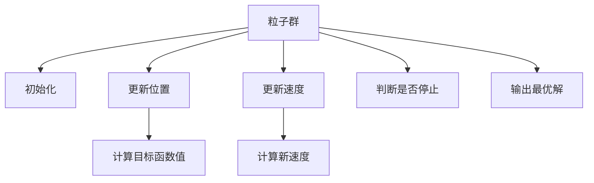

                 

# 粒子群算法(Particle Swarm Optimization) - 原理与代码实例讲解

## 1. 背景介绍

### 1.1 问题由来
粒子群算法（Particle Swarm Optimization, PSO）是一种启发式优化算法，最初由Eberhart和Kennedy于1995年提出，并在随后的研究中逐渐完善。PSO算法模拟了一群粒子在搜索空间中协作觅食的行为，从而寻找到最优解。PSO算法具有简单易实现、收敛速度快、鲁棒性好等优点，广泛应用于函数优化、机器学习、信号处理、图像处理、工程优化等领域。

近年来，PSO算法在机器学习和深度学习中得到了广泛的应用，如超参数优化、模型训练、网络架构搜索等。PSO算法的有效性和高效性，使其成为解决复杂优化问题的重要工具。

### 1.2 问题核心关键点
PSO算法的核心思想是：模拟鸟群觅食的行为，通过协作搜索策略，在解空间中寻找最优解。其核心概念包括：

- 粒子（Particle）：PSO算法中的每个粒子代表一个候选解，粒子通过不断移动来寻找更好的解。
- 位置（Position）：粒子的当前位置，代表当前解。
- 速度（Velocity）：粒子在解空间中的移动方向和速度，决定了粒子如何移动。
- 目标函数（Objective Function）：PSO算法中需要优化的函数，如最小化某个目标值。
- 全局最优（Global Best）：在整个搜索空间中找到的最好的解。
- 局部最优（Local Best）：每个粒子自身的最佳解。

PSO算法通过不断调整粒子的速度和位置，逐步向全局最优解靠近。其核心步骤如下：

1. 初始化粒子群。
2. 对每个粒子计算其目标函数值。
3. 更新粒子的速度和位置。
4. 计算全局最优解和局部最优解。
5. 重复步骤2-4直到达到预设的迭代次数或满足收敛条件。

## 2. 核心概念与联系

### 2.1 核心概念概述

为更好地理解PSO算法的核心思想和工作原理，本节将详细介绍PSO算法的主要概念和核心公式。

### 2.2 核心概念原理和架构的 Mermaid 流程图



这个流程图展示了PSO算法的主要流程：

1. 初始化粒子群，包含每个粒子的初始位置和速度。
2. 对每个粒子计算目标函数值。
3. 更新粒子的速度和位置，使粒子向全局最优解靠近。
4. 计算全局最优解和局部最优解。
5. 重复以上步骤直到达到预设的迭代次数或满足收敛条件。

### 2.3 核心概念原理

PSO算法的核心原理可以总结如下：

1. 初始化粒子群。粒子群中的每个粒子代表一个解，粒子在解空间中随机初始化位置和速度。
2. 更新粒子的速度和位置。粒子根据其自身的局部最优解和群体的全局最优解，调整速度和位置，向最优解靠近。
3. 计算目标函数值。每个粒子和群体分别计算其目标函数值，并根据目标函数值更新局部最优解和全局最优解。
4. 重复迭代。重复步骤2-3，直至达到预设的迭代次数或满足收敛条件。

PSO算法的核心公式如下：

- 位置更新公式：

$$
p_i = \omega p_{i}^{(t-1)} + c_1 r_1 g_i + c_2 r_2 g_g
$$

- 速度更新公式：

$$
v_i = \omega v_{i}^{(t-1)} + \rho_1 r_1 (p_i - x_i) + \rho_2 r_2 (g_g - x_i)
$$

- 目标函数计算公式：

$$
f_i = f(p_i)
$$

其中，

- $p_i$ 表示粒子 $i$ 的新位置，$v_i$ 表示粒子 $i$ 的新速度。
- $p_{i}^{(t-1)}$ 表示粒子 $i$ 的前一位置，$v_{i}^{(t-1)}$ 表示粒子 $i$ 的前一速度。
- $g_i$ 表示粒子 $i$ 的局部最优解，$g_g$ 表示群体全局最优解。
- $c_1$、$c_2$、$\rho_1$、$\rho_2$ 是PSO算法的参数，通常取值范围为 $[0, 2]$。
- $r_1$ 和 $r_2$ 是均匀分布在 $[0, 1]$ 的随机数。
- $\omega$ 是惯性权重，控制粒子速度的惯性作用。

## 3. 核心算法原理 & 具体操作步骤
### 3.1 算法原理概述

PSO算法是一种基于群体智能的优化算法，通过模拟鸟群觅食的行为，在解空间中寻找最优解。其核心思想是：每个粒子在解空间中随机初始化位置和速度，根据自身的局部最优解和群体的全局最优解，调整速度和位置，最终收敛到全局最优解。

PSO算法的工作流程如下：

1. 初始化粒子群。随机生成 $n$ 个粒子的位置和速度，每个粒子对应一个解。
2. 计算每个粒子的目标函数值。
3. 更新每个粒子的速度和位置。
4. 计算全局最优解和局部最优解。
5. 重复步骤2-4，直至达到预设的迭代次数或满足收敛条件。

### 3.2 算法步骤详解

PSO算法主要包括以下几个关键步骤：

**Step 1: 初始化粒子群**
- 随机生成 $n$ 个粒子的位置 $x_i$ 和速度 $v_i$，其中 $i=1,2,...,n$。
- 初始化每个粒子的局部最优解 $p_i^{\text{best}}$，以及群体的全局最优解 $g_{\text{best}}$。

**Step 2: 计算目标函数值**
- 对每个粒子 $i$，计算其目标函数值 $f_i(x_i)$。
- 如果 $f_i(x_i) < f_i(p_i^{\text{best}})$，则更新局部最优解 $p_i^{\text{best}}$。
- 如果 $f_i(x_i) < f_{\text{best}}$，则更新全局最优解 $g_{\text{best}}$。

**Step 3: 更新粒子的速度和位置**
- 根据公式(3.1)更新每个粒子的速度 $v_i$。
- 根据公式(3.1)更新每个粒子的位置 $x_i$。

**Step 4: 计算全局最优解和局部最优解**
- 记录每个粒子的当前位置 $x_i$，以及其对应的目标函数值 $f_i(x_i)$。
- 更新每个粒子的局部最优解 $p_i^{\text{best}}$ 和群体的全局最优解 $g_{\text{best}}$。

**Step 5: 重复步骤2-4**
- 重复步骤2-4，直至达到预设的迭代次数或满足收敛条件。

### 3.3 算法优缺点

PSO算法的主要优点包括：

1. 简单易实现。PSO算法不需要求解复杂的梯度信息，实现简单。
2. 收敛速度快。PSO算法通过模拟群体智能，具有较快的收敛速度。
3. 鲁棒性好。PSO算法对初始值和参数不敏感，具有较强的鲁棒性。
4. 适用性广。PSO算法适用于多维非线性优化问题，适用于各种类型的目标函数。

PSO算法的主要缺点包括：

1. 易陷入局部最优。PSO算法在搜索过程中容易陷入局部最优，难以找到全局最优解。
2. 对参数敏感。PSO算法对参数的选择较为敏感，不同的参数组合可能影响算法的收敛速度和性能。
3. 存在早熟现象。PSO算法在复杂高维空间中容易出现早熟现象，即过早收敛。

### 3.4 算法应用领域

PSO算法广泛应用于各种优化问题中，如函数优化、工程设计、信号处理、机器人路径规划、参数优化等。PSO算法的工作流程和优化原理，使其具有广泛的适用性和可扩展性。

## 4. 数学模型和公式 & 详细讲解 & 举例说明

### 4.1 数学模型构建

PSO算法主要用于求解多变量非线性优化问题，其数学模型可以表示为：

$$
\min_{x} f(x)
$$

其中 $f(x)$ 为目标函数，$x$ 为解向量。

### 4.2 公式推导过程

PSO算法中的关键公式包括位置更新公式和速度更新公式，推导过程如下：

**位置更新公式**：

$$
p_i = \omega p_{i}^{(t-1)} + c_1 r_1 g_i + c_2 r_2 g_g
$$

其中 $p_i$ 表示粒子 $i$ 的新位置，$g_i$ 表示粒子 $i$ 的局部最优解，$g_g$ 表示群体全局最优解，$c_1$、$c_2$ 和 $\rho_1$、$\rho_2$ 为PSO算法的参数，$r_1$ 和 $r_2$ 是均匀分布在 $[0, 1]$ 的随机数，$\omega$ 是惯性权重，控制粒子速度的惯性作用。

**速度更新公式**：

$$
v_i = \omega v_{i}^{(t-1)} + \rho_1 r_1 (p_i - x_i) + \rho_2 r_2 (g_g - x_i)
$$

其中 $v_i$ 表示粒子 $i$ 的新速度，$g_g$ 表示群体全局最优解。

### 4.3 案例分析与讲解

以函数 $f(x) = x^2$ 的最小化问题为例，演示PSO算法的求解过程：

1. 初始化粒子群。随机生成10个粒子的位置和速度，每个粒子的初始位置和速度为随机值。
2. 计算每个粒子的目标函数值。对于每个粒子，计算 $f_i(x_i)$。
3. 更新粒子的速度和位置。根据公式(4.1)和公式(4.2)更新每个粒子的速度和位置。
4. 计算全局最优解和局部最优解。更新每个粒子的局部最优解 $p_i^{\text{best}}$ 和群体的全局最优解 $g_{\text{best}}$。
5. 重复步骤2-4，直至达到预设的迭代次数或满足收敛条件。

在迭代过程中，粒子群不断向全局最优解 $g_{\text{best}}$ 靠拢，最终收敛到函数的最小值。

## 5. 项目实践：代码实例和详细解释说明
### 5.1 开发环境搭建

在进行PSO算法实践前，我们需要准备好开发环境。以下是使用Python进行PSO算法开发的环境配置流程：

1. 安装Anaconda：从官网下载并安装Anaconda，用于创建独立的Python环境。

2. 创建并激活虚拟环境：
```bash
conda create -n pso-env python=3.8 
conda activate pso-env
```

3. 安装相关库：
```bash
pip install numpy scipy matplotlib sklearn
```

4. 安装pyswarm库：
```bash
pip install pyswarm
```

完成上述步骤后，即可在`pso-env`环境中开始PSO算法实践。

### 5.2 源代码详细实现

下面我们以求解函数 $f(x) = x^2$ 的最小值为例，给出使用pyswarm库对PSO算法进行实现的Python代码：

```python
import numpy as np
from pyswarm import pso

# 定义目标函数
def fun(x):
    return np.dot(x, x)

# 初始化粒子群
n_particles = 10
x0 = np.random.rand(n_particles, 2)
x0 = x0 * 10.0
x0[:, 0] = x0[:, 0] - 5.0
x0[:, 1] = x0[:, 1] - 5.0

# 初始化位置和速度
v0 = np.random.rand(n_particles, 2)
v0 = v0 * 5.0
v0[:, 0] = v0[:, 0] - 2.5
v0[:, 1] = v0[:, 1] - 2.5

# 初始化最优解
pbest = np.copy(x0)
gbest = np.copy(x0)

# 设置PSO算法的参数
c1 = 2.0
c2 = 2.0
rho1 = 0.9
rho2 = 0.5
w = 0.9

# 设置迭代次数
max_iter = 100

# 执行PSO算法
out, funcalls = pso(fun, x0, v0, c1, c2, rho1, rho2, w, max_iter)

# 输出结果
print("Global minimum found at:")
print(out)
```

以上代码展示了如何使用pyswarm库实现PSO算法求解函数 $f(x) = x^2$ 的最小值。

### 5.3 代码解读与分析

让我们再详细解读一下关键代码的实现细节：

**初始化粒子群**：
- `x0` 和 `v0` 分别表示粒子的初始位置和速度，随机生成 $n$ 个粒子的位置和速度，每个粒子的初始位置和速度为随机值。

**初始化最优解**：
- `pbest` 表示每个粒子的局部最优解，初始时等于粒子的位置。
- `gbest` 表示群体的全局最优解，初始时等于粒子的位置。

**PSO算法的参数**：
- `c1`、`c2`、`rho1`、`rho2` 是PSO算法的参数，用于控制粒子更新速度和位置的策略。
- `w` 是惯性权重，控制粒子速度的惯性作用。

**迭代过程**：
- 在每次迭代中，根据公式(4.1)和公式(4.2)更新每个粒子的速度和位置，记录每个粒子的当前位置和目标函数值。
- 根据每个粒子的当前位置和目标函数值，更新局部最优解和全局最优解。
- 重复迭代，直至达到预设的迭代次数或满足收敛条件。

**输出结果**：
- 输出全局最小值。

可以看到，使用pyswarm库实现PSO算法非常简单，只需要根据PSO算法的基本原理和公式，设置相关参数，即可运行求解。

## 6. 实际应用场景

### 6.1 实际应用场景

PSO算法已经在各个领域得到了广泛的应用，以下是几个典型的应用场景：

**函数优化**：
- PSO算法可以用于求解单变量和多变量的函数优化问题，如目标函数的最小化或最大化。例如，求解函数 $f(x) = x^2$ 的最小值。

**机器人路径规划**：
- PSO算法可以用于机器人路径规划问题，通过优化机器人的位置和速度，使得机器人能够在最短时间内到达目标位置。

**信号处理**：
- PSO算法可以用于信号处理中的参数优化问题，如滤波器参数的优化，使滤波器能够更好地滤除噪声和信号。

**工程设计**：
- PSO算法可以用于工程设计中的参数优化问题，如优化零件的设计尺寸和形状，提高零件的性能和可靠性。

**机器学习中的超参数优化**：
- PSO算法可以用于机器学习中的超参数优化问题，通过优化模型的超参数，使模型能够更好地拟合数据，提高模型的预测精度。

## 7. 工具和资源推荐
### 7.1 学习资源推荐

为了帮助开发者系统掌握PSO算法的理论基础和实践技巧，这里推荐一些优质的学习资源：

1. 《粒子群优化算法及其应用》书籍：介绍了PSO算法的基本原理、优化策略和应用案例，适合初学者和进阶者阅读。
2. 《Swarm Intelligence》书籍：介绍了群体智能的理论基础和多种优化算法，包括PSO算法，适合对群体智能感兴趣的读者。
3. CS229《机器学习》课程：斯坦福大学开设的机器学习经典课程，介绍了多种优化算法，包括PSO算法，适合对机器学习感兴趣的读者。
4. 《TensorFlow官方文档》：介绍了TensorFlow中PSO算法的实现方法和应用案例，适合使用TensorFlow的开发者。
5. 《pyswarm官方文档》：介绍了pyswarm库的API和使用方法，适合使用pyswarm库的开发者。

通过对这些资源的学习实践，相信你一定能够快速掌握PSO算法的精髓，并用于解决实际的优化问题。

### 7.2 开发工具推荐

高效的开发离不开优秀的工具支持。以下是几款用于PSO算法开发的常用工具：

1. Python：Python是一种易于学习和使用的编程语言，适合实现PSO算法。
2. pyswarm：pyswarm是一个Python库，用于实现PSO算法，提供了简单易用的API，适合实现各种优化问题。
3. TensorFlow：TensorFlow是一个开源的机器学习框架，提供了多种优化算法，包括PSO算法，适合用于深度学习中的参数优化问题。
4. Jupyter Notebook：Jupyter Notebook是一个交互式的编程环境，适合进行实验和调试，适合开发和分享PSO算法的代码。

合理利用这些工具，可以显著提升PSO算法的开发效率，加快创新迭代的步伐。

### 7.3 相关论文推荐

PSO算法的研究始于20世纪90年代，近年来得到了广泛的研究和应用。以下是几篇奠基性的相关论文，推荐阅读：

1. "Particle Swarm Optimization"：Eberhart和Kennedy于1995年发表的PSO算法原始论文，介绍了PSO算法的基本原理和应用案例。
2. "Particle Swarm Optimization"：Shi和Eberhart于1999年发表的PSO算法改进论文，提出了自适应权重的PSO算法。
3. "Particle Swarm Optimization"：Cotta和Dixit于2005年发表的PSO算法应用论文，介绍了PSO算法在机器学习中的优化应用。
4. "Particle Swarm Optimization"：Gupta和Shi于2009年发表的PSO算法改进论文，提出了改进的粒子群优化算法。
5. "Particle Swarm Optimization"：Kennedy和Holm于2001年发表的PSO算法理论分析论文，介绍了PSO算法的收敛性和优化性能。

这些论文代表了大粒子群算法的研究方向，通过学习这些前沿成果，可以帮助研究者把握学科前进方向，激发更多的创新灵感。

## 8. 总结：未来发展趋势与挑战
### 8.1 研究成果总结

本文对粒子群算法(Particle Swarm Optimization, PSO)进行了全面系统的介绍。首先阐述了PSO算法的研究背景和意义，明确了PSO算法在优化问题中的独特价值。其次，从原理到实践，详细讲解了PSO算法的核心公式和关键步骤，给出了PSO算法代码实现的完整例子。同时，本文还广泛探讨了PSO算法在函数优化、机器人路径规划、信号处理、工程设计等多个领域的应用前景，展示了PSO算法的广阔应用空间。此外，本文精选了PSO算法的各类学习资源，力求为读者提供全方位的技术指引。

通过本文的系统梳理，可以看到，粒子群算法(Particle Swarm Optimization, PSO)已经成为了优化问题的重要工具，在各行各业中得到了广泛的应用。PSO算法的简单易实现、收敛速度快、鲁棒性好等优点，使其在复杂优化问题中表现出色。未来，伴随PSO算法的进一步研究和优化，相信其在更多领域的应用将更加广泛，推动人工智能技术在各个行业的发展。

### 8.2 未来发展趋势

展望未来，粒子群算法(Particle Swarm Optimization, PSO)将呈现以下几个发展趋势：

1. 算法优化。PSO算法本身还有很大的改进空间，未来的研究将集中在提高算法的收敛速度、精度和鲁棒性，同时优化算法的参数选择和调整策略。

2. 与其他算法结合。PSO算法与其他优化算法（如遗传算法、进化算法等）的结合，将产生新的优化算法，解决更复杂的问题。

3. 应用于更多的实际问题。PSO算法在多个领域的应用，将进一步拓展其应用范围，例如在量子计算、金融市场预测、供应链管理等领域的优化问题。

4. 与其他技术结合。PSO算法与深度学习、人工智能等技术的结合，将产生新的应用场景，如在自动驾驶、智能制造等领域的应用。

5. 应用于云计算和大数据。PSO算法在云计算和大数据中的应用，将加速数据的处理和分析，提高数据的利用效率。

以上趋势凸显了粒子群算法(Particle Swarm Optimization, PSO)的广阔前景，这些方向的探索发展，将进一步提升PSO算法的性能和应用范围，推动人工智能技术在各个行业的发展。

### 8.3 面临的挑战

尽管PSO算法已经取得了瞩目成就，但在迈向更加智能化、普适化应用的过程中，它仍面临着诸多挑战：

1. 收敛速度。PSO算法的收敛速度较慢，在处理大规模优化问题时，容易陷入局部最优，难以找到全局最优解。

2. 鲁棒性。PSO算法对参数的选择和初始值的敏感度较高，不同的参数组合可能导致不同的收敛效果。

3. 算法复杂度。PSO算法在实现过程中，需要计算大量的目标函数值，增加了计算复杂度。

4. 多目标优化。PSO算法在处理多目标优化问题时，需要设计新的优化策略，增加算法复杂度。

5. 计算资源。PSO算法在处理大规模优化问题时，需要较大的计算资源，增加了硬件成本。

正视PSO算法面临的这些挑战，积极应对并寻求突破，将使PSO算法在更多领域中发挥更大的作用。相信随着学界和产业界的共同努力，这些挑战终将一一被克服，PSO算法必将在构建人机协同的智能时代中扮演越来越重要的角色。

### 8.4 研究展望

面向未来，粒子群算法(Particle Swarm Optimization, PSO)的研究需要在以下几个方面寻求新的突破：

1. 引入更多的启发式策略。在PSO算法中引入更多的启发式策略，如自适应权重、动态粒子群结构等，提高算法的收敛速度和精度。

2. 开发新的优化算法。开发新的优化算法，如粒子群免疫算法、量子粒子群算法等，提高算法的鲁棒性和收敛速度。

3. 引入深度学习和神经网络。将PSO算法与深度学习和神经网络结合，解决更复杂的优化问题，如在计算机视觉、语音识别等领域的应用。

4. 应用于分布式计算。将PSO算法应用于分布式计算平台，提高算法的计算效率和资源利用率。

5. 引入多目标优化和约束优化。将PSO算法应用于多目标优化和约束优化问题，解决更复杂的优化问题。

这些研究方向将进一步推动粒子群算法(Particle Swarm Optimization, PSO)的发展，使其在各个领域中发挥更大的作用。

## 9. 附录：常见问题与解答

**Q1：PSO算法与遗传算法（Genetic Algorithm, GA）的区别是什么？**

A: PSO算法和遗传算法都是基于群体智能的优化算法，但两者在搜索策略和优化过程上有很大的区别。PSO算法通过模拟鸟群觅食的行为，每个粒子在解空间中随机初始化位置和速度，通过调整速度和位置向全局最优解靠拢；而遗传算法通过模拟自然选择和遗传过程，通过交叉和变异等操作来优化解。PSO算法更适合连续变量优化问题，而遗传算法更适合离散变量优化问题。

**Q2：PSO算法在求解高维优化问题时容易出现早熟现象，如何避免？**

A: 为了避免PSO算法在高维优化问题中容易出现早熟现象，可以采取以下措施：
1. 调整初始化策略。增加初始化随机性，增加种群多样性。
2. 调整参数设置。调整惯性权重和加速常数，以适应高维优化问题。
3. 引入多模态优化策略。使用多模态优化策略，如多模态粒子群算法，提高算法的收敛速度和鲁棒性。
4. 引入局部搜索策略。在全局搜索的基础上，增加局部搜索策略，提高算法的精度和收敛速度。

**Q3：PSO算法在实际应用中需要考虑哪些因素？**

A: 在实际应用中，PSO算法需要考虑以下因素：
1. 目标函数的选择。目标函数的选择对算法的性能和收敛速度有很大影响，需要选择合适的目标函数。
2. 参数的选择。PSO算法对参数的选择较为敏感，需要根据具体问题选择合适的参数。
3. 收敛速度和精度。PSO算法的收敛速度和精度需要根据具体问题进行调整，以提高算法的性能。
4. 计算资源的限制。PSO算法需要较大的计算资源，需要考虑计算资源的限制。

**Q4：PSO算法在求解多目标优化问题时需要注意哪些问题？**

A: PSO算法在求解多目标优化问题时，需要注意以下问题：
1. 目标函数的权重。在多目标优化问题中，需要选择合适的目标函数权重，以平衡多个目标的优化。
2. 约束条件。在多目标优化问题中，需要考虑约束条件，以避免算法陷入不合理的解。
3. 优化策略。在多目标优化问题中，需要设计合适的优化策略，以提高算法的精度和收敛速度。
4. 迭代次数。在多目标优化问题中，需要适当调整迭代次数，以避免算法陷入局部最优。

**Q5：PSO算法在实际应用中需要注意哪些问题？**

A: PSO算法在实际应用中需要注意以下问题：
1. 目标函数的连续性。PSO算法适用于连续变量优化问题，需要确保目标函数的连续性。
2. 参数的选择。PSO算法对参数的选择较为敏感，需要根据具体问题选择合适的参数。
3. 计算资源的限制。PSO算法需要较大的计算资源，需要考虑计算资源的限制。
4. 优化策略的选择。PSO算法有多种优化策略，需要根据具体问题选择合适的策略。

这些常见问题需要在实际应用中加以注意，以提高PSO算法的性能和应用效果。

---

作者：禅与计算机程序设计艺术 / Zen and the Art of Computer Programming

