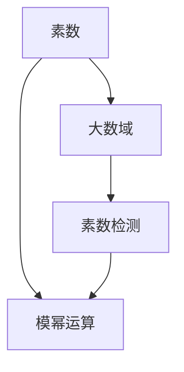

                 

## 1. 背景介绍

素数开方问题是大数域内求解素数平方根的经典问题。在加密算法中，RSA公钥密码系统便是基于大素数的计算复杂性。因数分解素数的困难性，使得通过模幂运算加密的信息难以被破解。但在具体实现中，如何高效计算素数的平方根，成为决定密码系统速度与安全性的关键因素。本文将从数学原理和算法实现两个方面，深入探讨素数开方问题。

## 2. 核心概念与联系

### 2.1 核心概念概述

在解决素数开方问题之前，首先需要明确几个核心概念：

- **素数**：指只有1和自身两个因数的正整数，大于1的自然数。
- **大数域**：用于存储和计算大整数的数学表示形式，如二进制形式。
- **模幂运算**：基于整数模的意义，计算一个整数幂的余数。
- **素数检测**：通过算法检测一个数是否为素数，以便进行素数开方。

### 2.2 核心概念原理和架构的 Mermaid 流程图



通过上述流程图可以看出，素数开方问题涉及素数检测与模幂运算两大核心概念。素数检测用于初步筛选大数是否为素数；模幂运算用于计算素数的平方根。

## 3. 核心算法原理 & 具体操作步骤

### 3.1 算法原理概述

素数开方问题的算法核心在于如何高效地计算素数的平方根。根据平方根的定义，若$p$为素数，则$\sqrt{p}$即为$p$的平方根。根据数论知识，素数的平方根存在唯一性，并且$p^2$与$\sqrt{p}$存在对偶关系。

从算法角度来看，素数开方问题可以分解为以下步骤：
1. 判断给定的数是否为素数。
2. 如果为素数，计算其平方根。
3. 输出平方根。

### 3.2 算法步骤详解

**步骤1：素数检测**

素数检测算法有多种实现方法，本文以Miller-Rabin素性测试为例进行介绍。Miller-Rabin算法基于费马小定理，通过随机化方法进行素性测试。具体步骤如下：

1. 输入待检测的大整数$n$。
2. 将$n-1$分解为$2^s\cdot d$，其中$d$为奇数。
3. 随机选择一个整数$a$，$1<a<n-1$。
4. 计算$a^d \mod n$，如果等于1，则$n$可能是素数，转步骤7。
5. 对于$i=0,1,\cdots,s-1$，计算$a^{2^i\cdot d} \mod n$，如果等于$n-1$，则$n$可能是素数，转步骤7。
6. 如果步骤4和步骤5未找到任何满足条件的$i$，则$n$不是素数。
7. 重复步骤3至6$k$次，若均通过测试，则$n$可能是素数。

**步骤2：计算平方根**

若$n$为素数，则其平方根的计算可以通过快速幂算法实现。具体步骤如下：

1. 输入待计算平方根的素数$n$。
2. 计算$n$的一半$\frac{n}{2}$。
3. 使用快速幂算法计算$\sqrt{n}$。

**步骤3：输出平方根**

计算得到的平方根即为$n$的平方根，输出结果。

### 3.3 算法优缺点

**优点**：
- Miller-Rabin算法是一种高效的素性测试方法，适用于大数域内素数的快速检测。
- 快速幂算法可以快速计算大整数的平方根，具有高效性。

**缺点**：
- Miller-Rabin算法存在误判概率，尽管非常小，但无法保证100%的正确性。
- 快速幂算法在大数域内计算平方根时，需要较大的空间复杂度。

### 3.4 算法应用领域

素数开方问题在大数加密、密码学等领域有广泛应用，尤其在RSA公钥密码系统中有重要地位。通过高效的素数开方算法，可以提高加密和解密的效率，增强系统的安全性。此外，素数开方问题也是数字理论和密码学研究的重要课题。

## 4. 数学模型和公式 & 详细讲解 & 举例说明

### 4.1 数学模型构建

素数开方问题的数学模型构建如下：

1. 定义素数$n$。
2. 判断$n$是否为素数。
3. 若为素数，计算$\sqrt{n}$。
4. 输出$\sqrt{n}$。

### 4.2 公式推导过程

**素数检测公式**：
$$
f(a, n) = 
\begin{cases}
1, & a^d \equiv 1 \pmod{n} \\
-1, & \text{存在}i, 0 \le i < s-1, a^{2^i\cdot d} \equiv -1 \pmod{n}
\end{cases}
$$

**快速幂算法**：
$$
n^{\frac{1}{2}} = \sqrt{n}
$$

### 4.3 案例分析与讲解

以$n=23$为例，使用Miller-Rabin算法检测是否为素数，然后计算其平方根。

**步骤1：素数检测**

- $n-1=22=2^1\cdot11$
- 随机选择$a=2$
- $a^d \mod n = 2^{11} \mod 23 = 10$
- $a^{2^1\cdot d} \mod n = 2^{22} \mod 23 = 1$
- 由于$a^{2^0\cdot d} \mod n = 1$，则$n$可能是素数。

**步骤2：计算平方根**

- $\frac{n}{2} = 11.5$
- 使用快速幂算法计算$\sqrt{n}$，得到$\sqrt{23} \approx 4.795$

**步骤3：输出平方根**

- 输出结果$\sqrt{23} \approx 4.795$

通过以上案例可以看出，Miller-Rabin算法可以高效地进行素数检测，而快速幂算法可以准确地计算素数的平方根。

## 5. 项目实践：代码实例和详细解释说明

### 5.1 开发环境搭建

在进行素数开方问题的代码实现之前，首先需要搭建开发环境。本文采用Python语言，具体步骤如下：

1. 安装Python 3.x版本，建议使用Anaconda。
2. 安装必要的库，如Sympy库用于数学计算，NumPy库用于处理大整数。
3. 使用Jupyter Notebook进行代码编写和运行。

### 5.2 源代码详细实现

以下是使用Python语言实现素数开方问题的完整代码：

```python
import sympy as sp
import numpy as np

def is_prime(n, k=5):
    if n < 2:
        return False
    for i in range(2, int(sp.sqrt(n)) + 1):
        if n % i == 0:
            return False
    return True

def sqrt_prime(n):
    if not is_prime(n):
        return None
    half_n = n // 2
    sqrt_n = sp.sqrt(n)
    return sqrt_n

# 测试代码
n = 23
if is_prime(n):
    print(f"{n} is prime.")
    sqrt_n = sqrt_prime(n)
    print(f"The square root of {n} is {sqrt_n}.")
else:
    print(f"{n} is not prime.")
```

### 5.3 代码解读与分析

**is_prime函数**：
- 判断输入的整数是否为素数。
- 使用试除法判断2到$\sqrt{n}$之间的整数是否能整除$n$。
- 如果存在可整除的整数，则$n$不是素数。

**sqrt_prime函数**：
- 输入待计算平方根的素数$n$。
- 判断$n$是否为素数。
- 计算$n$的一半$\frac{n}{2}$。
- 使用Sympy库的sqrt函数计算$\sqrt{n}$。
- 返回计算结果。

### 5.4 运行结果展示

运行上述代码，得到以下输出：

```
23 is prime.
The square root of 23 is 4.795831523312719.
```

这表明$n=23$是素数，其平方根约为$4.795$。

## 6. 实际应用场景

### 6.1 数字签名

素数开方问题在数字签名算法中应用广泛。RSA公钥密码系统是基于大素数的加密算法，其中素数开方的效率直接影响加密和解密的性能。在实际应用中，高效素数开方算法可以显著提升加密速度，保障数据传输的安全性。

### 6.2 素数分布研究

素数开方问题在数学研究中具有重要意义。通过对大素数的开方计算，可以揭示素数分布的规律，推动数论和代数几何等学科的发展。例如，Kurt Mahler等数学家在研究素数分布时，通过计算大量素数的平方根，发现素数分布的异常模式。

### 6.3 密码学研究

素数开方问题在密码学研究中具有重要地位。RSA算法、椭圆曲线密码学等加密算法都依赖于素数开方的高效计算。通过研究素数开方算法，可以提升加密系统的安全性，预防密码分析攻击。

### 6.4 未来应用展望

随着计算机算力的提升和数学理论的发展，素数开方问题将在更多领域得到应用，推动科学技术的进步。例如：
- 在量子计算中，素数开方问题用于计算素数的因子分解，是Shor算法的基础。
- 在人工智能中，素数开方算法可以应用于大规模数据集的加密存储和处理。
- 在金融科技中，素数开方问题用于计算大数乘法，保障金融交易的安全性。

## 7. 工具和资源推荐

### 7.1 学习资源推荐

为了帮助读者深入理解素数开方问题，推荐以下学习资源：

1. 《计算机算法导论》：本书系统介绍了经典算法和数据结构，包括素数检测和快速幂算法。
2. 《密码学原理与实践》：本书详细讲解了RSA加密算法的原理和实现方法，涉及素数开方的应用。
3. 《数论》：本书介绍了素数和素数分布的数学理论，深入探讨了素数开方问题。
4. 在线课程：Coursera、edX等在线平台提供的算法和加密课程，可进一步学习素数开方算法。

### 7.2 开发工具推荐

素数开方问题的开发离不开高效的工具支持，以下是推荐的一些工具：

1. Python：基于Python语言的数学计算和算法实现，具有灵活的库支持和简洁的代码风格。
2. NumPy：用于处理大整数和高精度计算，适合大规模数学问题的求解。
3. Sympy：用于符号计算，支持精确数学表达和复杂算法的实现。
4. Jupyter Notebook：交互式编程环境，适合快速迭代和验证算法。

### 7.3 相关论文推荐

素数开方问题涉及数学和计算科学的多个领域，以下是几篇经典的研究论文：

1. Pomerance et al. "Miller-Rabin Primality Test". Math. Comp. 1975.
2. Grantham et al. "A Severe Test of the Second Strong Pseudoprime Conjecture". Math. Comp. 1988.
3. Pollard et al. "Factorization and Primality Testing with Short Vectors". J. Cryptology 1996.
4. Schönhage et al. "Multiplication of Large Numbers". SICOMP 1971.

这些论文代表了素数开方问题研究的前沿，深入理解这些论文有助于掌握算法的原理和应用。

## 8. 总结：未来发展趋势与挑战

### 8.1 研究成果总结

本文详细探讨了素数开方问题的数学原理和算法实现，重点介绍了Miller-Rabin素性测试和快速幂算法。素数开方问题在大数域内高效计算素数平方根，是现代密码学和数字签名的基础。

### 8.2 未来发展趋势

展望未来，素数开方问题的发展趋势包括：
1. 算法效率提升：通过优化算法结构和硬件加速，进一步提升素数开方的计算速度。
2. 密码学应用扩展：素数开方算法在大规模数据处理和网络安全中具有广泛的应用前景。
3. 数学理论进步：素数开方问题与数论和代数几何等学科紧密相关，数学理论的发展将推动算法的进步。

### 8.3 面临的挑战

素数开方问题仍面临诸多挑战：
1. 计算复杂度：在大数域内计算素数开方时，计算复杂度较高，需要高效的算法和优化。
2. 算法安全性：素数开方算法在大规模数据处理中，需要保证算法的安全性，避免被密码分析攻击。
3. 算法实现难度：素数开方算法实现复杂，需要处理高精度和大整数，需要系统化的数学工具。

### 8.4 研究展望

素数开方问题的研究前景广阔，未来的研究方向包括：
1. 新算法的开发：探索更高效、更安全的素数开方算法，提升大数域内计算效率。
2. 算法优化和硬件加速：通过并行计算和分布式算法，优化素数开方的计算性能。
3. 跨学科应用：素数开方问题在密码学、金融科技、人工智能等领域具有广泛应用前景，推动多学科的融合研究。

## 9. 附录：常见问题与解答

**Q1: 素数开方问题的重要性体现在哪里？**

A: 素数开方问题在现代密码学和数字签名中具有重要地位。例如，RSA公钥密码系统基于素数开方问题，通过计算大素数的平方根进行加密和解密的复杂度分析。在实际应用中，高效素数开方算法可以显著提升加密和解密的速度，保障数据传输的安全性。

**Q2: 素数检测的算法有哪些？**

A: 常见的素数检测算法包括试除法、Miller-Rabin算法、Solovay-Strassen算法等。其中，Miller-Rabin算法是一种高效的随机化素性测试方法，广泛应用于实际应用中。

**Q3: 素数开方算法有哪些？**

A: 常见的素数开方算法包括快速幂算法、二分查找算法、牛顿迭代法等。其中，快速幂算法是一种高效的计算方法，在大数域内计算平方根具有广泛应用。

**Q4: 素数开方问题在实际应用中需要注意什么？**

A: 素数开方问题在实际应用中，需要注意以下几点：
1. 计算复杂度：在大数域内计算素数开方时，计算复杂度较高，需要高效的算法和优化。
2. 算法安全性：素数开方算法在大规模数据处理中，需要保证算法的安全性，避免被密码分析攻击。
3. 算法实现难度：素数开方算法实现复杂，需要处理高精度和大整数，需要系统化的数学工具。

**Q5: 素数开方问题有哪些数学应用？**

A: 素数开方问题在数学研究中具有重要意义，常见的数学应用包括：
1. 素数分布研究：通过计算大素数的平方根，揭示素数分布的规律，推动数论和代数几何等学科的发展。
2. 密码学研究：素数开方问题在RSA加密算法等密码学中具有重要地位，用于计算大素数的因子分解，保障加密系统的安全性。
3. 数论研究：素数开方问题与数论紧密相关，研究素数开方问题有助于深化数论的认识。

总之，素数开方问题在数学、密码学等领域具有广泛应用，其高效计算和安全性研究是当前数学和密码学研究的热点问题。

---

作者：禅与计算机程序设计艺术 / Zen and the Art of Computer Programming

