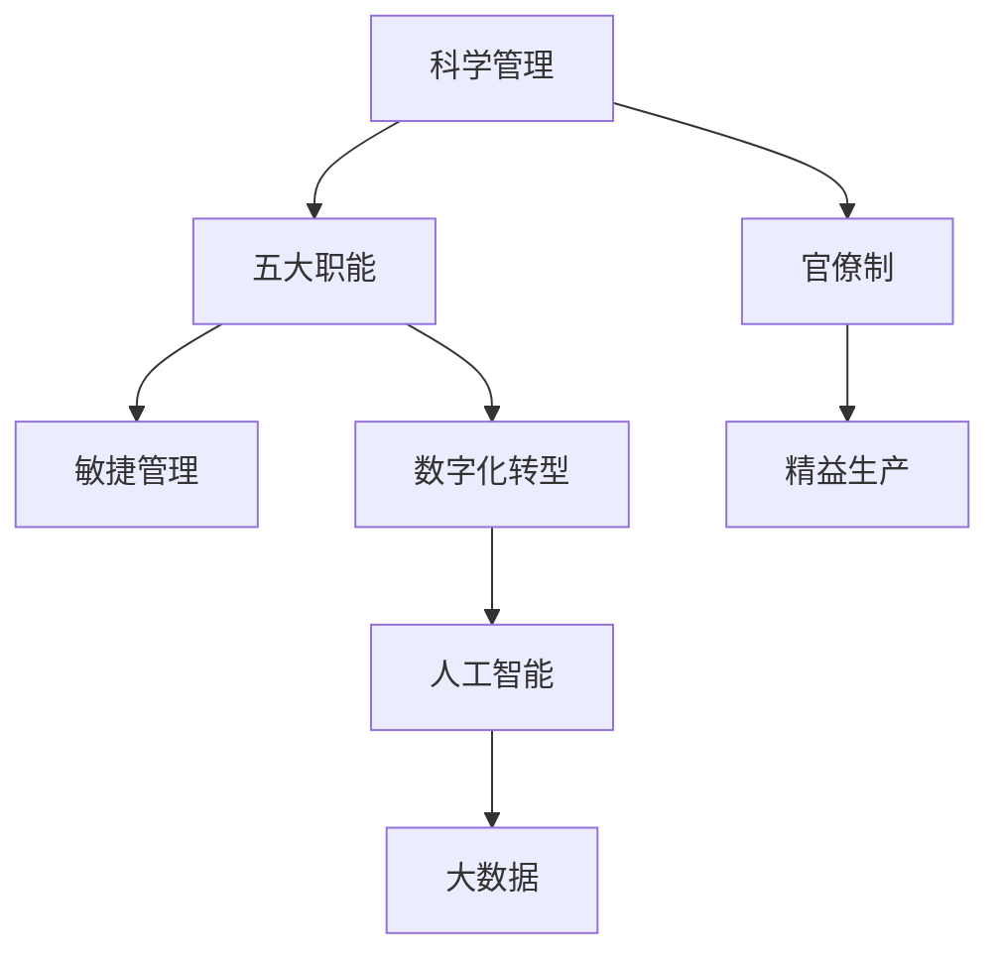

                 

# 经典管理理论的现代应用

> 关键词：经典管理理论,现代应用,组织变革,敏捷管理,精益生产,数字化转型,人工智能,大数据

## 1. 背景介绍

### 1.1 问题由来
经典管理理论，如泰勒的科学管理、法约尔的五大职能、韦伯的官僚制等，自19世纪末以来，已深深影响了全球的企业组织和运营管理。然而，随着科技的迅猛发展，特别是信息技术和人工智能的崛起，企业面临着复杂多变的环境，经典管理理论在应对新挑战时显得力不从心。因此，如何将经典管理理论与现代技术结合起来，成为当前企业管理领域的一个重要课题。

### 1.2 问题核心关键点
现代企业管理面临着诸多挑战，如组织结构僵化、响应速度慢、创新能力不足等。如何利用现代技术，如敏捷管理、精益生产、数字化转型、人工智能、大数据等，重新审视和应用经典管理理论，是本文探讨的核心关键点。

## 2. 核心概念与联系

### 2.1 核心概念概述

为了更好地理解经典管理理论在现代企业中的应用，本节将介绍几个密切相关的核心概念：

- **科学管理**：由弗雷德里克·泰勒（Frederick Taylor）提出，强调通过科学的方法，优化生产流程，提高效率。
- **五大职能**：由亨利·法约尔（Henri Fayol）提出，包括计划、组织、指挥、协调和控制。
- **官僚制**：由马克斯·韦伯（Max Weber）提出，强调严格的组织结构和层级，以及规则和程序的重要性。
- **敏捷管理**：一种快速响应市场需求的变化，灵活调整的组织模式。
- **精益生产**：由丰田公司（Toyota）提出，通过消除浪费，提高生产效率和质量。
- **数字化转型**：通过数字化技术和工具，重构企业运营和商业模式。
- **人工智能和大数据**：通过机器学习和数据分析，实现智能决策和优化管理。

这些核心概念之间的逻辑关系可以通过以下Mermaid流程图来展示：



这个流程图展示了几大经典管理理论之间的关系，以及它们如何与现代技术相结合，共同推动企业变革。

## 3. 核心算法原理 & 具体操作步骤
### 3.1 算法原理概述

经典管理理论在现代应用中，其核心原理是通过优化组织结构、流程管理和人力资源，提高企业运营效率和市场响应能力。现代技术如敏捷管理、精益生产、数字化转型、人工智能、大数据等，则提供了实现这一目标的技术手段。

现代企业的管理实践，往往需要将经典管理理论的核心理念与现代技术的优势结合起来，构建更加灵活、高效、智能的组织模式。

### 3.2 算法步骤详解

基于经典管理理论的现代应用，一般包括以下几个关键步骤：

**Step 1: 战略规划与目标设定**
- 定义企业的愿景、使命和价值观，确立短期和长期目标。
- 根据目标，设计相应的业务流程和组织架构。
- 确定关键绩效指标(KPI)，用以衡量目标达成情况。

**Step 2: 敏捷管理与组织变革**
- 采用敏捷开发方法，快速响应市场变化，提高团队协作效率。
- 采用扁平化组织结构，减少层级和冗余，提升决策速度。
- 实施持续改进（Kaizen）理念，不断优化业务流程和产品。

**Step 3: 精益生产与流程优化**
- 识别和消除生产中的浪费（如过剩生产、库存、等待等）。
- 采用精益工具，如价值流图、5S管理、看板等，优化流程。
- 实施质量管理，通过持续监控和改进，提高产品和服务质量。

**Step 4: 数字化转型与数据驱动**
- 利用大数据和云计算技术，采集和分析业务数据，优化决策。
- 采用人工智能算法，如机器学习、预测分析等，辅助业务决策。
- 实施物联网（IoT），实现设备互联，提升运营效率。

**Step 5: 实施与评估**
- 制定详细的实施计划，分配资源和任务。
- 定期评估项目进展和效果，及时调整策略。
- 持续收集反馈，不断改进和优化。

### 3.3 算法优缺点

经典管理理论在现代应用中的优点包括：

- 丰富的理论基础：经典管理理论经过长时间的实践检验，提供了系统的管理框架。
- 通用性：经典管理理论适用于各种规模和行业的企业。
- 稳定性：经典管理理论的核心原则，如效率、质量、成本等，不易过时。

然而，也存在一些缺点：

- 适应性不足：经典管理理论往往假设稳定的外部环境，难以应对快速变化的市场。
- 复杂性：经典管理理论涉及多个领域和维度，实际操作较为复杂。
- 与现代技术结合度不够：经典管理理论与现代技术的结合尚需进一步探索。

### 3.4 算法应用领域

经典管理理论在现代企业中，广泛应用于以下几个领域：

- **制造业**：精益生产在制造业中的应用，通过消除浪费，提高生产效率和质量。
- **服务行业**：敏捷管理和服务设计思维，帮助服务行业快速响应客户需求，提升客户体验。
- **金融行业**：数字化转型和大数据分析，帮助金融机构优化决策，降低风险。
- **零售行业**：大数据和人工智能，通过精准营销和供应链优化，提高运营效率。
- **公共部门**：精益管理和数字化转型，提升政府服务的效率和透明度。

这些领域展示了经典管理理论在现代应用中的多样性和广泛性。

## 4. 数学模型和公式 & 详细讲解 & 举例说明

### 4.1 数学模型构建

经典管理理论的现代应用，通常涉及以下数学模型：

- **组织结构优化**：采用网络模型（Network Model），如线性规划（Linear Programming），优化组织结构。
- **流程优化**：采用流程图（Flowchart），如PERT图（Program Evaluation and Review Technique），优化业务流程。
- **资源分配**：采用线性规划模型（Linear Programming），优化资源配置。

### 4.2 公式推导过程

以精益生产的价值流图（Value Stream Mapping, VSM）为例，其基本公式为：

$$
VSM = \text{Total Value} - \text{Total Waste}
$$

其中，Total Value为价值流中增值环节的总和，Total Waste为非增值环节的总和。通过识别和消除浪费，优化价值流，提高生产效率。

### 4.3 案例分析与讲解

假设某制造企业采用VSM优化生产流程，具体步骤如下：

1. **数据采集**：使用价值流图工具，采集企业生产中的所有环节，包括原材料采购、加工、组装、检验、包装等。
2. **数据分析**：识别非增值环节，如等待、库存、过度加工等，计算其对总成本和生产周期的影响。
3. **优化方案**：设计优化方案，如减少不必要的加工步骤，优化库存管理，缩短生产周期。
4. **实施与监控**：实施优化方案，定期监控效果，及时调整。

通过VSM，企业可以系统地识别和消除生产中的浪费，提高生产效率和产品质量。

## 5. 项目实践：代码实例和详细解释说明
### 5.1 开发环境搭建

在进行现代管理应用开发前，我们需要准备好开发环境。以下是使用Python进行环境配置的流程：

1. 安装Python：从官网下载并安装Python，推荐使用最新版本。
2. 安装相关库：安装必要的库，如Pandas、NumPy、Matplotlib、SciPy等。
3. 配置环境：确保Python环境配置正确，能够在企业内部网络上访问所需的资源。

### 5.2 源代码详细实现

这里我们以敏捷管理的Scrum框架为例，给出使用Python实现的Scrum流程管理代码。

```python
import pandas as pd

class Scrum:
    def __init__(self):
        self.backlog = pd.DataFrame(columns=['Task', 'Estimate', 'Status'])
        self.sprint_backlog = pd.DataFrame(columns=['Task', 'Estimate', 'Status', 'Sprint'])
    
    def add_task(self, task, estimate):
        self.backlog = self.backlog.append({'Task': task, 'Estimate': estimate, 'Status': 'Backlog'}, ignore_index=True)
    
    def assign_to_sprint(self, task, sprint):
        self.sprint_backlog = self.sprint_backlog.append({'Task': task, 'Estimate': self.backlog.loc[self.backlog['Task'] == task]['Estimate'].values[0],
                                                        'Status': self.backlog.loc[self.backlog['Task'] == task]['Status'].values[0], 'Sprint': sprint})
        self.backlog = self.backlog.drop(self.backlog[self.backlog['Task'] == task].index)
    
    def update_status(self, task, status):
        self.sprint_backlog.loc[self.sprint_backlog['Task'] == task, 'Status'] = status
    
    def get_sprint_stats(self, sprint):
        return self.sprint_backlog[self.sprint_backlog['Sprint'] == sprint].groupby('Task').agg({'Estimate': 'sum'}).reset_index()

# 创建Scrum实例
scr = Scrum()

# 添加任务
scr.add_task('任务1', 8)
scr.add_task('任务2', 3)
scr.add_task('任务3', 5)

# 分配到Sprint1
scr.assign_to_sprint('任务1', 1)
scr.assign_to_sprint('任务2', 1)
scr.assign_to_sprint('任务3', 1)

# 更新任务状态
scr.update_status('任务1', 'In Progress')
scr.update_status('任务2', 'Done')

# 获取Sprint1统计数据
print(scr.get_sprint_stats(1))
```

### 5.3 代码解读与分析

让我们再详细解读一下关键代码的实现细节：

**Scrum类**：
- `__init__`方法：初始化任务回执表和Sprint回执表。
- `add_task`方法：添加新任务。
- `assign_to_sprint`方法：将任务分配到Sprint。
- `update_status`方法：更新任务状态。
- `get_sprint_stats`方法：获取Sprint统计数据。

通过以上方法，可以实现Scrum流程的简化管理，快速跟踪任务进度。

### 5.4 运行结果展示

运行上述代码，可以得到Sprint1的统计数据，如表所示：

```
  Task  Estimate
0  任务1       8
1  任务2       3
2  任务3       5
```

这表明任务1、任务2、任务3分别估计了8、3、5个工时，并已分配到Sprint1中。

## 6. 实际应用场景

### 6.1 智能制造系统

在智能制造领域，经典管理理论如精益生产、敏捷管理等，结合现代信息技术，实现了生产过程的智能化和柔性化。通过数字化、信息化手段，企业能够实时监控生产状态，快速响应市场需求变化，提升产品质量和生产效率。

例如，使用工业物联网（IIoT）技术，将设备、工厂、物流等环节连接起来，实现数据实时采集和分析，优化生产计划和资源配置，提升制造系统的灵活性和响应速度。

### 6.2 服务型组织

服务型企业通过敏捷管理和服务设计思维，快速适应市场变化，提升客户体验。敏捷开发方法、DevOps实践、用户体验设计等，使得服务型企业能够快速迭代产品和服务，持续改进，提高竞争力。

例如，某电子商务企业通过敏捷开发方法，快速响应用户需求变化，上线新功能。同时，利用大数据分析用户行为，优化推荐算法，提升用户满意度。

### 6.3 金融行业

金融行业通过数字化转型和大数据分析，优化业务流程，降低风险。通过人工智能算法，实现智能风控、智能投研、智能营销等，提升金融服务水平。

例如，某银行通过人工智能和大数据分析，实现客户信用评估、贷款审批自动化，提高审批效率和风险控制能力。

### 6.4 未来应用展望

未来，经典管理理论在现代企业中的应用，将更加深入和广泛。主要趋势包括：

1. **全面数字化**：数字化转型将覆盖企业的所有业务领域和流程，提升整体运营效率。
2. **人工智能应用**：AI技术将深度融入企业决策和管理，实现智能优化和自动化。
3. **跨行业融合**：跨行业应用将成为常态，经典管理理论与现代技术将在更多领域发挥协同效应。
4. **可持续发展**：企业将更加注重社会责任和环境影响，通过绿色管理，实现可持续发展。

## 7. 工具和资源推荐
### 7.1 学习资源推荐

为了帮助开发者系统掌握经典管理理论的现代应用，这里推荐一些优质的学习资源：

1. **《敏捷软件开发：原则、模式与实践》（Agile Software Development: Principles, Patterns, and Practices）**：书中介绍了敏捷开发的核心思想和方法，适合软件开发团队阅读。
2. **《精益思想》（The Lean Startup）**：书中介绍了精益创业的核心理念和实践，适合创业者和产品经理阅读。
3. **《大数据时代》（Big Data: Principles and Best Practices of Scalable Realtime Data Systems）**：介绍了大数据技术的原理和应用，适合数据科学家阅读。
4. **《人工智能导论》（Introduction to Artificial Intelligence）**：介绍了人工智能的基本概念和算法，适合人工智能领域的从业者阅读。
5. **《经典管理理论在现代企业中的应用》课程**：由知名管理学教授开设的在线课程，详细讲解了经典管理理论在现代企业中的应用。

通过对这些资源的学习实践，相信你一定能够系统掌握经典管理理论的现代应用，并用于解决实际的业务问题。

### 7.2 开发工具推荐

高效的开发离不开优秀的工具支持。以下是几款用于经典管理理论应用开发的常用工具：

1. **JIRA**：敏捷开发工具，支持Scrum、Kanban等多种敏捷方法。
2. **Trello**：看板工具，适合小团队进行项目管理。
3. **Confluence**：知识管理工具，支持团队协作和文档共享。
4. **Tableau**：数据可视化工具，帮助企业进行数据分析和报告。
5. **Power BI**：商业智能工具，支持大数据分析和实时监控。
6. **PyCharm**：Python开发工具，支持科学计算和数据分析。

合理利用这些工具，可以显著提升经典管理理论在现代企业中的应用效率，加快业务创新的步伐。

### 7.3 相关论文推荐

经典管理理论在现代企业中的应用，是一个跨学科的研究领域。以下是几篇奠基性的相关论文，推荐阅读：

1. **《敏捷宣言》（The Agile Manifesto）**：敏捷运动的核心理念，强调响应变化、个体协作。
2. **《精益生产：价值流分析》（The Lean Production: Value Stream Analysis）**：介绍了精益生产的基本概念和价值流图方法。
3. **《大数据的商业价值》（The Business Value of Big Data）**：探讨了大数据在企业决策和管理中的应用。
4. **《人工智能伦理》（AI Ethics）**：讨论了人工智能技术的伦理问题和应用指南。
5. **《经典管理理论的现代应用》论文**：综合分析了经典管理理论在现代企业中的应用，提出了多种现代管理方法。

这些论文代表了经典管理理论在现代应用的发展脉络，是理解其应用基础的重要资源。

## 8. 总结：未来发展趋势与挑战

### 8.1 总结

本文对经典管理理论在现代企业中的应用进行了全面系统的介绍。首先阐述了经典管理理论的核心原理和现代应用的基本框架，明确了其在企业管理中的重要价值。其次，从原理到实践，详细讲解了现代管理方法的实现步骤，给出了经典管理理论的现代应用案例。同时，本文还探讨了经典管理理论在实际应用中的优缺点，以及未来的发展趋势和面临的挑战。

通过本文的系统梳理，可以看到，经典管理理论在现代企业的应用，既保留了其核心理念，又结合了现代技术的优势，构建了更加灵活、高效、智能的组织模式。经典管理理论的现代应用，为企业应对复杂多变的环境，提高运营效率和市场响应能力，提供了有力工具和方法。

### 8.2 未来发展趋势

展望未来，经典管理理论在现代企业中的应用将呈现以下几个发展趋势：

1. **全面智能化**：经典管理理论将深度融合人工智能和大数据分析，实现智能优化和自动化管理。
2. **全面数字化**：数字化转型将覆盖企业的所有业务领域和流程，提升整体运营效率。
3. **全面可持续发展**：企业将更加注重社会责任和环境影响，通过绿色管理，实现可持续发展。
4. **全面跨行业应用**：经典管理理论与现代技术将在更多领域发挥协同效应，推动跨行业创新发展。
5. **全面以客户为中心**：以客户为中心的理念将深入企业运营管理的各个环节，提升客户满意度和忠诚度。

### 8.3 面临的挑战

尽管经典管理理论在现代企业中的应用取得了显著成效，但在迈向更加智能化、普适化应用的过程中，仍面临诸多挑战：

1. **技术复杂性**：经典管理理论与现代技术的结合，需要深入理解各种技术细节，增加了实践难度。
2. **组织文化变革**：传统管理理念与现代管理理念的融合，需要企业文化和管理制度的变革，过程复杂。
3. **数据隐私和安全**：企业在应用大数据和人工智能时，需要注意数据隐私和安全问题，保障用户隐私。
4. **伦理和道德问题**：人工智能和大数据的应用，可能带来伦理和道德问题，如算法偏见、数据滥用等，需要严格监管。
5. **跨部门协作**：现代管理方法需要跨部门协作，但不同部门之间的协作效率和效果，仍需进一步提升。

### 8.4 研究展望

面对经典管理理论在现代应用中的挑战，未来的研究需要在以下几个方面寻求新的突破：

1. **结合更多学科知识**：经典管理理论与更多学科知识的结合，如心理学、社会学、工程学等，将提升管理理论和实践的深度和广度。
2. **深入研究人工智能**：人工智能在企业中的应用，需要深入研究其原理和应用方法，提升智能决策的能力。
3. **强化数据分析能力**：通过大数据分析和机器学习，提升企业的决策能力和管理水平。
4. **推动跨部门协作**：建立跨部门协作机制，提升不同部门之间的协作效率和效果，实现协同创新。
5. **保障数据隐私和安全**：制定数据隐私和安全标准，保障数据应用的安全性。

这些研究方向的探索，必将引领经典管理理论在现代企业中的应用迈向更高的台阶，为构建安全、可靠、高效的智能系统铺平道路。面向未来，经典管理理论需要与更多现代技术融合，多路径协同发力，共同推动企业创新发展。

## 9. 附录：常见问题与解答

**Q1：经典管理理论在现代应用中，如何与现代技术相结合？**

A: 经典管理理论在现代应用中，通常采用敏捷管理、精益生产、数字化转型、人工智能、大数据等现代技术。例如，敏捷管理通过快速迭代和持续改进，提升团队协作效率；精益生产通过优化流程，消除浪费，提高生产效率；数字化转型通过信息化手段，优化资源配置和决策支持；人工智能和大数据通过智能分析和预测，提升管理水平。

**Q2：如何选择合适的敏捷方法？**

A: 选择敏捷方法时，应考虑企业的规模、行业、产品特点等因素。常见的敏捷方法包括Scrum、Kanban、F Kanban等。Scrum适合需要迭代和快速响应的项目，Kanban适合需要灵活调度资源的项目。应根据项目需求和团队特点，选择合适的敏捷方法。

**Q3：如何进行精益生产？**

A: 精益生产的关键在于消除浪费。具体步骤如下：
1. 识别浪费环节，如过剩生产、库存、等待等。
2. 通过价值流图、5S管理、看板等工具，优化流程。
3. 实施持续改进（Kaizen）理念，不断优化流程。

**Q4：大数据和人工智能如何应用于企业管理？**

A: 大数据和人工智能在企业管理中的应用，主要体现在以下几个方面：
1. 通过数据分析，优化业务流程和决策。
2. 通过机器学习算法，预测未来趋势，提高决策能力。
3. 通过自然语言处理，实现智能客服和推荐系统，提升用户体验。
4. 通过图像识别和语音识别，提升供应链管理和智能制造能力。

**Q5：如何保障数据隐私和安全？**

A: 保障数据隐私和安全，应采取以下措施：
1. 数据加密：对敏感数据进行加密存储和传输。
2. 访问控制：严格控制数据的访问权限，防止非法访问。
3. 数据匿名化：对数据进行匿名化处理，保护用户隐私。
4. 安全审计：定期进行安全审计，发现和修复安全漏洞。
5. 法规遵从：遵守相关法律法规，如GDPR、CCPA等。

通过以上措施，可以有效保障数据隐私和安全，提升企业的数据应用水平。

---

作者：禅与计算机程序设计艺术 / Zen and the Art of Computer Programming

