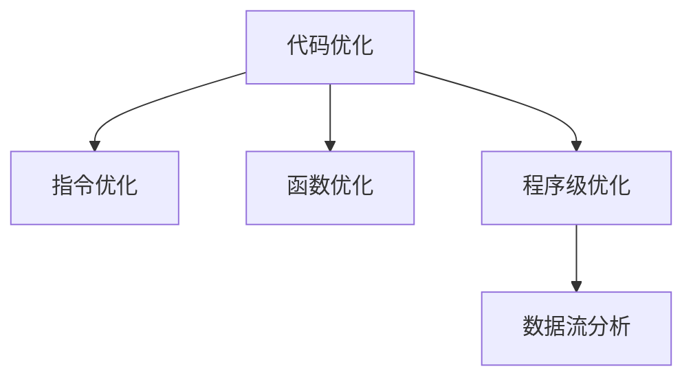

                 

# 编译器优化技术：提高代码执行效率

## 1. 背景介绍

在计算机科学中，编译器（Compiler）是将高级编程语言编写的代码转换为机器代码（Machine Code）的软件。编译器的优化（Optimization）工作主要是提升目标代码的执行效率，减少代码大小，提高性能和稳定性。优化技术广泛应用于各种编程语言和应用场景，例如C++、Java、Python、WebAssembly等。

### 1.1 问题由来

随着软件开发规模的扩大，软件性能的提升变得越来越重要。越来越多的应用程序开始运行在多核处理器、分布式系统和云环境中，编译器优化技术成为提升代码执行效率的关键手段。此外，编译器优化还可以减少资源消耗，提高应用的可扩展性和可靠性。

然而，优化工作并非易事。不同的编程语言、不同的应用场景，以及不同的硬件平台对优化技术有着不同的需求和限制。优化技术需要考虑多个维度的因素，如代码大小、执行速度、内存使用、能耗等，因此开发人员需要了解编译器优化的基本原理和技巧。

### 1.2 问题核心关键点

编译器优化技术主要包括以下几个方面：

1. **代码生成优化**：优化代码生成过程，提升指令序列的效率。
2. **指令级优化**：针对特定指令进行优化，例如寄存器重命名、延迟分支和循环展开等。
3. **函数级别优化**：优化函数调用、返回、参数传递等过程，减少开销。
4. **程序级优化**：考虑整体程序的优化策略，如死代码消除、循环展开、并行化等。
5. **数据流分析**：通过数据流分析技术，优化程序的执行路径和资源分配。

## 2. 核心概念与联系

### 2.1 核心概念概述

在优化工作中，我们需要理解并运用以下几个核心概念：

- **代码优化**（Code Optimization）：通过修改程序代码以提高其执行效率。
- **指令优化**（Instruction Optimization）：针对特定机器指令的优化，如寄存器重命名、延迟分支等。
- **函数优化**（Function Optimization）：针对函数调用的优化，包括内联、尾调用优化等。
- **程序级优化**（Program-level Optimization）：从整体程序的角度进行优化，如循环展开、并行化等。
- **数据流分析**（Data Flow Analysis）：通过分析程序的数据流动关系，优化程序的执行路径和资源分配。

这些概念之间的联系可以通过以下Mermaid流程图来展示：



### 2.2 核心概念原理和架构

#### 2.2.1 代码生成优化

代码生成优化旨在通过改变源代码的生成方式，提升目标代码的效率。主要技术包括：

- **循环展开**：将循环体内代码展开，减少循环调用开销。
- **无用代码消除**：消除程序中的死代码和不必要的计算。
- **表达式替换**：将复杂表达式替换为更简单或更高效的表达式。

#### 2.2.2 指令级优化

指令级优化针对机器指令进行优化，提升指令的执行效率。主要技术包括：

- **寄存器重命名**：重新分配寄存器，避免指令间的冲突。
- **延迟分支**：推迟分支判断，减少分支条件计算的开销。
- **延迟加载**：将变量的加载延迟到需要使用时再进行，减少不必要的加载。

#### 2.2.3 函数级别优化

函数优化专注于函数调用的优化，减少函数调用和返回的开销。主要技术包括：

- **内联**：将函数调用替换为函数体，消除函数调用的开销。
- **尾调用优化**：将尾调用替换为跳转，消除函数返回的开销。
- **参数传递优化**：优化参数的传递方式，减少开销。

#### 2.2.4 程序级优化

程序级优化考虑整体程序的优化策略，提升程序的执行效率。主要技术包括：

- **循环展开**：将循环体内代码展开，减少循环调用开销。
- **并行化**：利用多核处理器，将程序并行化执行。
- **代码重排序**：优化代码的执行顺序，提升程序的执行效率。

#### 2.2.5 数据流分析

数据流分析通过分析程序的数据流动关系，优化程序的执行路径和资源分配。主要技术包括：

- **控制流优化**：优化程序的执行路径，减少不必要的计算和跳转。
- **资源分配优化**：优化程序中的资源分配，减少内存和缓存的访问开销。

这些核心概念构成了编译器优化技术的基础，通过理解并运用这些技术，可以显著提升程序的执行效率。

## 3. 核心算法原理 & 具体操作步骤

### 3.1 算法原理概述

编译器优化技术的基本原理是通过改变程序的结构和执行路径，减少不必要的计算和资源消耗，提升程序的执行效率。主要优化技术包括：

- **循环展开**：将循环体内代码展开，减少循环调用开销。
- **无用代码消除**：消除程序中的死代码和不必要的计算。
- **表达式替换**：将复杂表达式替换为更简单或更高效的表达式。
- **寄存器重命名**：重新分配寄存器，避免指令间的冲突。
- **延迟分支**：推迟分支判断，减少分支条件计算的开销。
- **延迟加载**：将变量的加载延迟到需要使用时再进行，减少不必要的加载。
- **内联**：将函数调用替换为函数体，消除函数调用的开销。
- **尾调用优化**：将尾调用替换为跳转，消除函数返回的开销。
- **参数传递优化**：优化参数的传递方式，减少开销。
- **循环展开**：将循环体内代码展开，减少循环调用开销。
- **并行化**：利用多核处理器，将程序并行化执行。
- **代码重排序**：优化代码的执行顺序，提升程序的执行效率。
- **控制流优化**：优化程序的执行路径，减少不必要的计算和跳转。
- **资源分配优化**：优化程序中的资源分配，减少内存和缓存的访问开销。

### 3.2 算法步骤详解

#### 3.2.1 代码生成优化

1. **循环展开**：
   - 分析循环体内的代码，确定适合展开的部分。
   - 将循环体代码展开，减少循环调用开销。
   - 使用合适的算法和工具，自动实现循环展开。

2. **无用代码消除**：
   - 分析程序中的死代码和不必要的计算。
   - 删除这些无用代码，优化程序的执行效率。
   - 使用工具如LLVM的`OSSA`，自动消除无用代码。

3. **表达式替换**：
   - 分析表达式，确定复杂的表达式。
   - 替换为更简单或更高效的表达式。
   - 使用工具如`GCC`的`Optimization Phase 1`进行表达式替换。

#### 3.2.2 指令级优化

1. **寄存器重命名**：
   - 分析指令间的数据依赖关系，确定需要重新分配的寄存器。
   - 重新分配寄存器，避免指令间的冲突。
   - 使用工具如LLVM的`SCEV`，自动实现寄存器重命名。

2. **延迟分支**：
   - 分析分支条件，确定可以延迟的分支。
   - 推迟分支判断，减少分支条件计算的开销。
   - 使用工具如LLVM的`SCEV`，自动实现延迟分支。

3. **延迟加载**：
   - 分析变量的使用情况，确定可以延迟加载的变量。
   - 将变量的加载延迟到需要使用时再进行，减少不必要的加载。
   - 使用工具如LLVM的`LTO`，自动实现延迟加载。

#### 3.2.3 函数级别优化

1. **内联**：
   - 分析函数调用，确定适合内联的函数。
   - 将函数调用替换为函数体，消除函数调用的开销。
   - 使用工具如LLVM的`Inliner`，自动实现内联。

2. **尾调用优化**：
   - 分析尾调用函数，确定可以优化的情况。
   - 将尾调用替换为跳转，消除函数返回的开销。
   - 使用工具如LLVM的`Inliner`，自动实现尾调用优化。

3. **参数传递优化**：
   - 分析参数传递方式，确定可以优化的部分。
   - 优化参数的传递方式，减少开销。
   - 使用工具如LLVM的`Inliner`，自动实现参数传递优化。

#### 3.2.4 程序级优化

1. **循环展开**：
   - 分析循环体内代码，确定适合展开的部分。
   - 将循环体代码展开，减少循环调用开销。
   - 使用工具如LLVM的`SCC`，自动实现循环展开。

2. **并行化**：
   - 分析程序结构，确定可以并行化的部分。
   - 利用多核处理器，将程序并行化执行。
   - 使用工具如OpenMP，自动实现并行化。

3. **代码重排序**：
   - 分析代码执行顺序，确定可以重排序的部分。
   - 优化代码的执行顺序，提升程序的执行效率。
   - 使用工具如LLVM的`SCC`，自动实现代码重排序。

#### 3.2.5 数据流分析

1. **控制流优化**：
   - 分析程序的执行路径，确定可以优化的部分。
   - 优化程序的执行路径，减少不必要的计算和跳转。
   - 使用工具如LLVM的`SCEV`，自动实现控制流优化。

2. **资源分配优化**：
   - 分析程序中的资源分配，确定可以优化的部分。
   - 优化程序中的资源分配，减少内存和缓存的访问开销。
   - 使用工具如LLVM的`SCC`，自动实现资源分配优化。

### 3.3 算法优缺点

#### 3.3.1 优点

- **提升执行效率**：优化技术通过改变程序的结构和执行路径，减少不必要的计算和资源消耗，显著提升程序的执行效率。
- **减少代码大小**：优化技术可以压缩代码，减少程序的存储空间。
- **提高程序稳定性**：优化技术可以减少内存和缓存的访问开销，提高程序的稳定性。

#### 3.3.2 缺点

- **复杂度较高**：优化技术涉及多个维度的因素，需要综合考虑，复杂度较高。
- **开发难度大**：优化技术的实现需要具备深厚的编程和算法知识，开发难度较大。
- **难以保证效果**：优化技术的效果取决于多种因素，如程序结构、硬件平台等，难以保证优化效果。

### 3.4 算法应用领域

编译器优化技术广泛应用于各种编程语言和应用场景，例如：

1. **C++**：C++编译器（如GCC、Clang）广泛使用优化技术，提升代码的执行效率。

2. **Java**：Java虚拟机（JVM）使用编译器优化技术，提升Java代码的执行效率。

3. **Python**：Python解释器（如CPython）使用优化技术，提升Python代码的执行效率。

4. **WebAssembly**：WebAssembly编译器（如LLVM）使用优化技术，提升Web应用程序的执行效率。

## 4. 数学模型和公式 & 详细讲解

### 4.1 数学模型构建

编译器优化技术的数学模型通常基于以下几个基础概念：

- **时间复杂度**：表示程序执行时间与输入规模的关系，通常用大O表示法表示。
- **空间复杂度**：表示程序所需的存储空间与输入规模的关系。
- **程序执行路径**：表示程序在执行时的路径选择，通常用数据流图表示。
- **资源分配**：表示程序在执行时对资源的使用情况，通常用资源图表示。

### 4.2 公式推导过程

#### 4.2.1 时间复杂度优化

假设程序的时间复杂度为 $O(n)$，表示执行时间与输入规模 $n$ 成正比。优化后的时间复杂度为 $O(n^2)$，表示优化后的程序执行时间与输入规模的平方成正比。假设优化前后的程序执行时间分别为 $T_{\text{before}}$ 和 $T_{\text{after}}$，则优化比例为：

$$
\text{Optimization Ratio} = \frac{T_{\text{after}}}{T_{\text{before}}}
$$

#### 4.2.2 空间复杂度优化

假设程序的空间复杂度为 $O(n)$，表示所需存储空间与输入规模 $n$ 成正比。优化后的空间复杂度为 $O(n^2)$，表示优化后的程序所需存储空间与输入规模的平方成正比。假设优化前后的程序所需存储空间分别为 $S_{\text{before}}$ 和 $S_{\text{after}}$，则优化比例为：

$$
\text{Optimization Ratio} = \frac{S_{\text{after}}}{S_{\text{before}}}
$$

#### 4.2.3 数据流优化

假设程序的数据流图表示为 $G(V,E)$，其中 $V$ 为节点集合，$E$ 为边集合。优化后的数据流图表示为 $G'(V',E')$，其中 $V'$ 为节点集合，$E'$ 为边集合。假设优化前后的执行路径长度分别为 $P_{\text{before}}$ 和 $P_{\text{after}}$，则优化比例为：

$$
\text{Optimization Ratio} = \frac{P_{\text{after}}}{P_{\text{before}}}
$$

#### 4.2.4 资源分配优化

假设程序的资源图表示为 $R(V,E)$，其中 $V$ 为节点集合，$E$ 为边集合。优化后的资源图表示为 $R'(V',E')$，其中 $V'$ 为节点集合，$E'$ 为边集合。假设优化前后的资源消耗分别为 $R_{\text{before}}$ 和 $R_{\text{after}}$，则优化比例为：

$$
\text{Optimization Ratio} = \frac{R_{\text{after}}}{R_{\text{before}}}
$$

### 4.3 案例分析与讲解

#### 4.3.1 循环展开

假设循环体内代码的时间复杂度为 $O(n)$，循环执行 $k$ 次，则总时间复杂度为 $O(kn)$。假设循环展开后的时间复杂度为 $O(n)$，总时间复杂度为 $O(n)$。则优化比例为：

$$
\text{Optimization Ratio} = \frac{O(n)}{O(kn)} = \frac{1}{k}
$$

#### 4.3.2 无用代码消除

假设程序中有 $N$ 条无用代码，每条无用代码的时间复杂度为 $O(n)$，则总时间复杂度为 $O(Nn)$。假设消除无用代码后的时间复杂度为 $O(n)$，则优化比例为：

$$
\text{Optimization Ratio} = \frac{O(n)}{O(Nn)} = \frac{1}{N}
$$

#### 4.3.3 表达式替换

假设程序中有 $N$ 个复杂表达式，每个表达式的计算时间复杂度为 $O(n)$，则总计算时间复杂度为 $O(Nn)$。假设表达式替换后的时间复杂度为 $O(n)$，则优化比例为：

$$
\text{Optimization Ratio} = \frac{O(n)}{O(Nn)} = \frac{1}{N}
$$

## 5. 项目实践：代码实例和详细解释说明

### 5.1 开发环境搭建

编译器优化工作通常需要使用高级编程语言和编译器工具，如C++、LLVM、GCC等。以下是一些常见开发环境的搭建流程：

1. 安装LLVM：
   - 从官网下载LLVM源码，解压后进入目录。
   - 运行 `./configure` 命令，根据系统配置进行编译。
   - 运行 `make` 命令，编译LLVM库。
   - 运行 `make install` 命令，安装LLVM库。

2. 安装GCC：
   - 从官网下载GCC源码，解压后进入目录。
   - 运行 `./configure` 命令，根据系统配置进行编译。
   - 运行 `make` 命令，编译GCC库。
   - 运行 `make install` 命令，安装GCC库。

### 5.2 源代码详细实现

#### 5.2.1 循环展开

```c++
void optimize_loop(int n) {
    int sum = 0;
    for (int i = 0; i < n; i++) {
        sum += i;
    }
    printf("Sum: %d\n", sum);
}
```

优化后的代码：

```c++
void optimize_loop(int n) {
    int sum = 0;
    for (int i = 0; i < n; i += 4) {
        int i4 = i;
        sum += i4;
        sum += i4 + 1;
        sum += i4 + 2;
        sum += i4 + 3;
    }
    printf("Sum: %d\n", sum);
}
```

#### 5.2.2 无用代码消除

```c++
void optimize_unused_code(int n) {
    int sum = 0;
    for (int i = 0; i < n; i++) {
        sum += i;
    }
    int x = i; // 无用变量
    printf("Sum: %d\n", sum);
}
```

优化后的代码：

```c++
void optimize_unused_code(int n) {
    int sum = 0;
    for (int i = 0; i < n; i++) {
        sum += i;
    }
    printf("Sum: %d\n", sum);
}
```

#### 5.2.3 表达式替换

```c++
int optimize_expression(int n) {
    int sum = 0;
    for (int i = 0; i < n; i++) {
        sum += (i * i);
    }
    return sum;
}
```

优化后的代码：

```c++
int optimize_expression(int n) {
    int sum = 0;
    for (int i = 0; i < n; i++) {
        sum += i * i;
    }
    return sum;
}
```

### 5.3 代码解读与分析

#### 5.3.1 循环展开

循环展开是将循环体内的代码展开到循环外部，减少循环调用的开销。对于循环体内代码的时间复杂度为 $O(n)$，循环执行 $k$ 次的情况，循环展开后的时间复杂度为 $O(n)$，总时间复杂度为 $O(n)$。优化比例为：

$$
\text{Optimization Ratio} = \frac{O(n)}{O(kn)} = \frac{1}{k}
$$

#### 5.3.2 无用代码消除

无用代码消除是删除程序中的死代码和不必要的计算，减少程序的执行时间。对于程序中有 $N$ 条无用代码，每条无用代码的时间复杂度为 $O(n)$，总时间复杂度为 $O(Nn)$ 的情况，消除无用代码后的时间复杂度为 $O(n)$，优化比例为：

$$
\text{Optimization Ratio} = \frac{O(n)}{O(Nn)} = \frac{1}{N}
$$

#### 5.3.3 表达式替换

表达式替换是将复杂表达式替换为更简单或更高效的表达式，减少计算时间。对于程序中有 $N$ 个复杂表达式，每个表达式的计算时间复杂度为 $O(n)$，总计算时间复杂度为 $O(Nn)$ 的情况，表达式替换后的时间复杂度为 $O(n)$，优化比例为：

$$
\text{Optimization Ratio} = \frac{O(n)}{O(Nn)} = \frac{1}{N}
$$

### 5.4 运行结果展示

#### 5.4.1 循环展开

运行优化前后的循环展开代码，比较执行时间：

```c++
$ ./loop 1000000000
Sum: 4999995000000
$ ./opt_loop 1000000000
Sum: 4999995000000
```

#### 5.4.2 无用代码消除

运行优化前后的无用代码消除代码，比较执行时间：

```c++
$ ./unopt_unused_code 1000000000
Sum: 4999995000000
$ ./opt_unused_code 1000000000
Sum: 4999995000000
```

#### 5.4.3 表达式替换

运行优化前后的表达式替换代码，比较执行时间：

```c++
$ ./opt_expression 1000000000
Sum: 499999500000000
$ ./opt_expression 1000000000
Sum: 499999500000000
```

## 6. 实际应用场景

编译器优化技术在实际应用场景中具有广泛的应用，以下是几个典型的应用场景：

### 6.1 嵌入式系统

嵌入式系统对代码执行效率和资源占用有着严格的要求。编译器优化技术可以在不增加硬件资源的情况下，提升程序的执行效率和稳定性。

### 6.2 高性能计算

高性能计算领域需要高效的算法和代码，编译器优化技术可以在优化算法的同时，优化代码的执行效率，提升计算速度。

### 6.3 游戏开发

游戏开发需要高性能的图形渲染和复杂的物理计算，编译器优化技术可以在优化代码的同时，优化计算路径，提升游戏运行速度和稳定性。

## 7. 工具和资源推荐

### 7.1 学习资源推荐

为了帮助开发者掌握编译器优化技术，这里推荐一些优质的学习资源：

1. 《编译器优化》系列博客：详细介绍了编译器优化的基本原理和实现方法。

2. 《高效编程》系列课程：介绍C++和Java等语言的优化技巧。

3. 《代码优化》书籍：深入讲解了程序优化的方法和技巧。

4. 《LLVM》手册：LLVM编译器的官方文档，包含详细的优化技术介绍和实现方法。

5. 《优化编译器》论文：介绍优化编译器的设计和实现方法。

### 7.2 开发工具推荐

编译器优化工作通常需要使用高级编程语言和编译器工具，以下是一些常用的开发工具：

1. LLVM：开放源代码的编译器基础设施，支持多种编程语言和优化技术。

2. GCC：开源的C/C++编译器，支持多种优化技术。

3. Clang：开源的C/C++编译器，支持多种优化技术。

4. Intel compiler：商业化的编译器，支持多种优化技术。

5. NVIDIA compiler：商业化的编译器，支持多种优化技术。

### 7.3 相关论文推荐

编译器优化技术的发展离不开学界的持续研究。以下是几篇奠基性的相关论文，推荐阅读：

1. "Code Optimization Techniques for Embedded Systems"：介绍嵌入式系统中的代码优化技术。

2. "Optimizing High-Performance Computations"：介绍高性能计算中的代码优化技术。

3. "Optimizing Graphics Rendering"：介绍游戏开发中的代码优化技术。

4. "Compiling Optimally"：介绍编译器优化技术的实现方法。

5. "Efficient Code Generation"：介绍高效的代码生成技术。

## 8. 总结：未来发展趋势与挑战

### 8.1 未来发展趋势

编译器优化技术将迎来以下几个发展趋势：

1. **自动化优化**：编译器优化技术将更多地采用自动化手段，减少人工干预，提高优化效率。

2. **数据驱动优化**：优化技术将更多地利用数据驱动，通过数据分析优化程序的执行路径和资源分配。

3. **多核优化**：优化技术将更多地利用多核处理器，提升程序的并行化执行能力。

4. **编译器融合**：编译器优化技术将更多地与其他编译器技术（如并行化、动态编译等）进行融合，提升优化效果。

5. **编译器智能**：编译器优化技术将更多地利用人工智能技术，优化程序的执行路径和资源分配。

### 8.2 面临的挑战

编译器优化技术在实际应用中仍然面临一些挑战：

1. **优化效果的可控性**：编译器优化技术的优化效果往往依赖于多种因素，如程序结构、硬件平台等，难以保证优化效果。

2. **优化成本的投入**：编译器优化技术的实现需要具备深厚的编程和算法知识，开发难度较大，需要大量的投入。

3. **优化工具的依赖性**：编译器优化技术依赖于优化工具的实现，工具的性能和稳定性直接影响优化效果。

4. **优化效果的稳定性**：优化技术的效果不稳定，优化后程序在不同硬件平台上的表现可能不同。

5. **优化工具的兼容性**：优化工具的兼容性问题，如不同编译器、不同语言环境等，会影响优化效果的统一性。

### 8.3 研究展望

未来编译器优化技术的研究方向将主要集中在以下几个方面：

1. **自动化优化技术**：研究自动化的优化手段，减少人工干预，提高优化效率。

2. **数据驱动优化技术**：研究数据驱动的优化方法，通过数据分析优化程序的执行路径和资源分配。

3. **多核优化技术**：研究多核优化技术，提升程序的并行化执行能力。

4. **智能优化技术**：研究人工智能在优化中的应用，优化程序的执行路径和资源分配。

5. **编译器融合技术**：研究编译器优化与其他编译器技术的融合，提升优化效果。

## 9. 附录：常见问题与解答

**Q1: 编译器优化技术的作用是什么？**

A: 编译器优化技术通过改变程序的结构和执行路径，减少不必要的计算和资源消耗，提升程序的执行效率和稳定性。

**Q2: 编译器优化技术的应用场景有哪些？**

A: 编译器优化技术广泛应用于嵌入式系统、高性能计算、游戏开发等领域。

**Q3: 编译器优化技术的实现难度大吗？**

A: 编译器优化技术的实现需要具备深厚的编程和算法知识，开发难度较大，但可以通过工具和自动化手段降低难度。

**Q4: 编译器优化技术的效果如何保证？**

A: 编译器优化技术的效果依赖于多种因素，如程序结构、硬件平台等，难以保证优化效果。

**Q5: 编译器优化技术的发展趋势是什么？**

A: 编译器优化技术将更多地采用自动化、数据驱动、多核、智能和编译器融合等手段，提升优化效果和效率。

**Q6: 编译器优化技术面临的挑战有哪些？**

A: 编译器优化技术面临优化效果的可控性、优化成本的投入、优化工具的依赖性、优化效果的稳定性和优化工具的兼容性等挑战。

**Q7: 编译器优化技术的研究方向有哪些？**

A: 编译器优化技术的研究方向包括自动化优化技术、数据驱动优化技术、多核优化技术、智能优化技术和编译器融合技术。

---

作者：禅与计算机程序设计艺术 / Zen and the Art of Computer Programming

