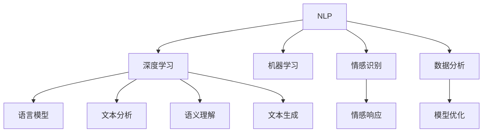

                 

# 聊天机器人科学和探索：数据分析和理论

> 关键词：聊天机器人,数据分析,理论研究,机器学习,自然语言处理(NLP),深度学习,智能问答系统

## 1. 背景介绍

### 1.1 问题由来

聊天机器人（Chatbots）作为一种人工智能技术，已经成为各行各业数字化转型中的重要工具。从客服机器人到智能助手，再到健康咨询、教育辅导，聊天机器人覆盖了人们生活的方方面面。然而，尽管聊天机器人已经得到广泛应用，但在实际使用过程中仍存在诸多挑战。

- **理解能力不足**：聊天机器人难以准确理解用户的意图，导致对话常常陷入僵局。
- **知识局限性**：聊天机器人无法实时获取最新信息，知识库更新不及时。
- **多轮对话能力差**：机器人在处理多轮对话时，常常出现无法接上下文的情况。
- **缺乏情感智能**：聊天机器人无法准确捕捉用户的情感，无法提供情感化的交流体验。

### 1.2 问题核心关键点

聊天机器人技术的核心在于通过机器学习技术，让机器能够理解和生成自然语言。其核心关键点包括：

- **自然语言处理（NLP）**：理解和生成自然语言的技术。
- **机器学习（ML）**：通过数据训练模型，让机器能够学习用户的语言习惯和偏好。
- **深度学习（DL）**：使用深层神经网络进行复杂的特征提取和模式识别。
- **数据分析**：通过数据分析优化机器学习模型的训练，提升聊天机器人的智能水平。
- **情感识别**：理解用户的情感状态，提供更符合心理需求的交流体验。

### 1.3 问题研究意义

聊天机器人技术的研究意义在于：

1. **提升用户体验**：通过更智能的交流方式，提升用户的交互体验。
2. **提高效率**：自动处理常见问题，解放人力资源，提高工作效率。
3. **个性化服务**：根据用户的历史行为和偏好，提供个性化的服务。
4. **数据驱动决策**：通过数据分析，优化聊天机器人的行为策略。
5. **拓展应用场景**：聊天机器人可以应用于教育、医疗、金融等多个领域，推动产业数字化转型。

## 2. 核心概念与联系

### 2.1 核心概念概述

为更好地理解聊天机器人技术，本节将介绍几个密切相关的核心概念：

- **自然语言处理（NLP）**：涉及语言模型的建立、文本分析、语义理解、文本生成等多个方面。
- **深度学习（DL）**：通过深层神经网络进行复杂的特征提取和模式识别，适用于NLP任务。
- **机器学习（ML）**：通过数据训练模型，提升机器对语言的理解和生成能力。
- **情感识别**：通过数据分析和模型训练，使机器人能够识别和响应用户的情感。
- **数据分析**：通过统计分析、数据挖掘等方法，优化机器学习模型的训练，提升聊天机器人的智能水平。

这些核心概念之间的逻辑关系可以通过以下Mermaid流程图来展示：



这个流程图展示了几大核心概念及其之间的关系：

1. NLP技术通过深度学习、机器学习等方法，建立语言模型、文本分析、语义理解、文本生成等模块。
2. 深度学习提供了复杂的特征提取和模式识别能力，适用于NLP任务。
3. 机器学习通过数据训练模型，提升NLP模块的性能。
4. 情感识别通过数据分析和模型训练，使机器人能够识别和响应用户的情感。
5. 数据分析优化机器学习模型的训练，提升聊天机器人的智能水平。

这些概念共同构成了聊天机器人技术的核心框架，使其能够进行自然语言的理解和生成。通过理解这些核心概念，我们可以更好地把握聊天机器人技术的本质和优化方向。

## 3. 核心算法原理 & 具体操作步骤
### 3.1 算法原理概述

聊天机器人技术基于自然语言处理和机器学习算法，其核心原理可以概括为以下几个步骤：

1. **数据收集和预处理**：收集用户与机器人的对话记录，进行清洗、分词、标注等预处理。
2. **模型训练**：使用预处理后的数据训练NLP模型，提升模型的语言理解和生成能力。
3. **数据分析**：通过数据分析优化模型的训练过程，提升模型的智能水平。
4. **情感识别**：通过情感分析，使机器人能够识别和响应用户的情感。
5. **多轮对话处理**：设计对话策略，提升机器人处理多轮对话的能力。
6. **部署和优化**：将训练好的模型部署到实际应用中，并通过用户反馈不断优化模型。

### 3.2 算法步骤详解

聊天机器人技术的核心算法步骤包括：

**Step 1: 数据收集和预处理**
- 收集用户与聊天机器人的对话记录，并将其清洗、分词、标注等。
- 去除噪声和无用信息，保留有用对话记录。
- 使用分词工具将文本切分成单词或词组，便于模型处理。

**Step 2: 模型训练**
- 选择适当的NLP模型，如Seq2Seq、Transformer等。
- 将清洗后的对话记录作为训练数据，使用机器学习算法进行模型训练。
- 使用反向传播算法和梯度下降优化器，不断调整模型参数，最小化损失函数。

**Step 3: 数据分析**
- 使用统计分析、数据挖掘等方法，分析对话数据中的规律和模式。
- 通过数据可视化工具，展示对话数据中的关键特征和趋势。
- 根据分析结果，调整模型训练策略，优化模型性能。

**Step 4: 情感识别**
- 使用情感分析算法，对用户文本进行情感分类。
- 设计情感响应策略，根据用户情感状态调整聊天机器人的回答策略。
- 通过不断优化情感分析模型，提高情感识别的准确率。

**Step 5: 多轮对话处理**
- 设计对话管理策略，使机器人能够处理多轮对话。
- 使用记忆网络、上下文向量等方法，记录对话历史，提升上下文理解能力。
- 通过对话策略优化，提高机器人处理复杂对话的能力。

**Step 6: 部署和优化**
- 将训练好的模型部署到实际应用中。
- 通过用户反馈和实时数据，不断优化模型。
- 定期更新模型，保持模型性能和知识库的时效性。

### 3.3 算法优缺点

聊天机器人技术的优点包括：

1. **高效处理对话**：通过自动处理常见问题，解放人力资源，提高工作效率。
2. **提升用户体验**：通过智能化的交流方式，提升用户的交互体验。
3. **个性化服务**：根据用户的历史行为和偏好，提供个性化的服务。
4. **数据驱动决策**：通过数据分析，优化聊天机器人的行为策略。

同时，该方法也存在一定的局限性：

1. **理解能力有限**：对于一些复杂、模糊的对话，聊天机器人可能无法准确理解用户的意图。
2. **知识局限性**：聊天机器人无法实时获取最新信息，知识库更新不及时。
3. **多轮对话能力差**：机器人在处理多轮对话时，常常出现无法接上下文的情况。
4. **缺乏情感智能**：聊天机器人无法准确捕捉用户的情感，无法提供情感化的交流体验。

尽管存在这些局限性，但就目前而言，聊天机器人技术在提供快速、便捷的交流服务方面，已经取得了显著的效果。未来相关研究的重点在于如何进一步提升聊天机器人的理解能力、知识更新能力和情感智能，同时兼顾可解释性和伦理安全性等因素。

### 3.4 算法应用领域

聊天机器人技术在多个领域得到了广泛应用，例如：

- **客户服务**：自动化处理客户咨询，提高服务效率。
- **健康咨询**：提供医学知识查询、病情分析等服务。
- **教育辅导**：提供学习辅导、作业批改等功能。
- **金融咨询**：提供投资建议、财务规划等服务。
- **交通导航**：提供路线规划、交通信息查询等服务。

除了上述这些经典应用外，聊天机器人技术也被创新性地应用到更多场景中，如智能家居、智能客服、智能推荐等，为各行各业带来了新的发展机遇。随着技术的不断进步，聊天机器人技术的应用场景还将不断拓展，成为推动数字化转型升级的重要工具。

## 4. 数学模型和公式 & 详细讲解 & 举例说明

### 4.1 数学模型构建

聊天机器人技术的核心模型基于自然语言处理（NLP）和深度学习（DL）技术，主要涉及以下数学模型：

- **语言模型（Language Model）**：用于评估一个序列的概率，通过最大化条件概率$p(w_t|w_{<t})$来学习语言规律。
- **神经网络模型（Neural Network）**：用于复杂的特征提取和模式识别，常用的有RNN、LSTM、Transformer等。
- **情感分析模型（Sentiment Analysis）**：用于分析用户文本的情感状态，常用的有情感词典、情感分类器等。

**语言模型**：假设已知一个句子 $w=w_1w_2...w_n$，其概率为 $p(w)=\prod_{i=1}^{n}p(w_i|w_{<i})$。在实际应用中，通常使用n-gram模型或者神经网络模型来近似表示语言概率。

**神经网络模型**：常用的神经网络模型包括RNN、LSTM和Transformer等。以Transformer为例，其结构如下：


**情感分析模型**：常用的情感分析模型包括情感词典、情感分类器等。以情感分类器为例，其训练过程如下：

1. 收集情感标注数据。
2. 将文本转换为向量表示。
3. 设计情感分类器，如SVM、神经网络等。
4. 训练分类器，最小化损失函数。
5. 测试分类器性能。

### 4.2 公式推导过程

以下我们以情感分类器为例，推导分类器的训练过程和损失函数。

假设训练数据集为 $D=\{(x_i,y_i)\}_{i=1}^N$，其中 $x_i$ 为输入文本，$y_i \in \{1,0\}$ 为情感标签，1表示积极情感，0表示消极情感。

情感分类器的目标是最小化损失函数：

$$
\mathcal{L}(\theta) = -\frac{1}{N}\sum_{i=1}^N \log p(y_i|x_i;\theta)
$$

其中 $p(y_i|x_i;\theta)$ 为情感分类器的输出概率，$\theta$ 为模型参数。

假设使用二分类交叉熵损失函数，分类器输出的概率为：

$$
p(y_i|x_i;\theta) = \sigma(\theta^Tx_i)
$$

其中 $\sigma$ 为 sigmoid 函数，$\theta^Tx_i$ 为线性判别函数。

因此，情感分类器的损失函数可以表示为：

$$
\mathcal{L}(\theta) = -\frac{1}{N}\sum_{i=1}^N [y_i\log \sigma(\theta^Tx_i) + (1-y_i)\log(1-\sigma(\theta^Tx_i))]
$$

通过优化上述损失函数，训练情感分类器。

### 4.3 案例分析与讲解

以智能客服机器人为例，其情感分析模型的训练过程如下：

1. **数据收集**：收集客服对话记录，标注情感标签。
2. **数据预处理**：清洗数据，去除噪声，进行分词。
3. **特征提取**：将文本转换为向量表示，如使用TF-IDF、Word2Vec等方法。
4. **模型训练**：设计情感分类器，如SVM、神经网络等，使用交叉熵损失函数进行训练。
5. **模型测试**：在测试集上评估模型性能，调整模型参数。
6. **应用部署**：将训练好的模型部署到实际应用中，根据用户情感状态调整聊天策略。

## 5. 项目实践：代码实例和详细解释说明
### 5.1 开发环境搭建

在进行聊天机器人项目开发前，我们需要准备好开发环境。以下是使用Python进行TensorFlow开发的環境配置流程：

1. 安装Anaconda：从官网下载并安装Anaconda，用于创建独立的Python环境。

2. 创建并激活虚拟环境：
```bash
conda create -n chatbot-env python=3.8 
conda activate chatbot-env
```

3. 安装TensorFlow：根据CUDA版本，从官网获取对应的安装命令。例如：
```bash
conda install tensorflow tensorflow-gpu=cuda11.1 -c conda-forge
```

4. 安装各类工具包：
```bash
pip install numpy pandas scikit-learn matplotlib tqdm jupyter notebook ipython
```

完成上述步骤后，即可在`chatbot-env`环境中开始聊天机器人开发。

### 5.2 源代码详细实现

下面我们以情感分类器为例，给出使用TensorFlow对文本进行情感分类的PyTorch代码实现。

首先，定义情感分类器的数据处理函数：

```python
import tensorflow as tf
from tensorflow.keras.preprocessing.text import Tokenizer
from tensorflow.keras.preprocessing.sequence import pad_sequences

class SentimentDataset:
    def __init__(self, texts, labels):
        self.texts = texts
        self.labels = labels
        self.max_len = 128
        self.tokenizer = Tokenizer(num_words=10000, oov_token='<OOV>')
        self.tokenizer.fit_on_texts(texts)
        
    def __len__(self):
        return len(self.texts)
    
    def __getitem__(self, item):
        text = self.texts[item]
        label = self.labels[item]
        
        sequences = self.tokenizer.texts_to_sequences([text])
        padded_sequences = pad_sequences(sequences, maxlen=self.max_len, padding='post', truncating='post')
        
        return {'input_ids': padded_sequences, 
                'labels': tf.keras.utils.to_categorical(label, num_classes=2)}
```

然后，定义情感分类器的模型：

```python
from tensorflow.keras.models import Sequential
from tensorflow.keras.layers import Embedding, Dense, Dropout, LSTM, Bidirectional

model = Sequential()
model.add(Embedding(input_dim=10000, output_dim=128, input_length=128))
model.add(Bidirectional(LSTM(64, return_sequences=True)))
model.add(Bidirectional(LSTM(64)))
model.add(Dense(64, activation='relu'))
model.add(Dropout(0.5))
model.add(Dense(2, activation='softmax'))

model.compile(loss='binary_crossentropy', optimizer='adam', metrics=['accuracy'])
```

接着，定义情感分类器的训练函数：

```python
from tensorflow.keras.callbacks import EarlyStopping
from sklearn.model_selection import train_test_split

def train_model(model, train_dataset, dev_dataset, epochs, batch_size):
    model.fit(train_dataset, epochs=epochs, batch_size=batch_size, validation_data=dev_dataset, callbacks=[EarlyStopping(patience=3)])
    
    print("Accuracy on training set: {:.2f}%".format(model.evaluate(train_dataset)[1]*100))
    print("Accuracy on validation set: {:.2f}%".format(model.evaluate(dev_dataset)[1]*100))
```

最后，启动情感分类器的训练流程：

```python
from sklearn.datasets import fetch_20newsgroups

data = fetch_20newsgroups(subset='train', remove=('headers', 'footers', 'quotes'))
texts = data.data
labels = data.target

train_texts, dev_texts, train_labels, dev_labels = train_test_split(texts, labels, test_size=0.2, random_state=42)

train_dataset = SentimentDataset(train_texts, train_labels)
dev_dataset = SentimentDataset(dev_texts, dev_labels)

epochs = 10
batch_size = 32

train_model(model, train_dataset, dev_dataset, epochs, batch_size)
```

以上就是使用TensorFlow对文本进行情感分类的完整代码实现。可以看到，通过TensorFlow的高级API，代码实现相对简洁高效。

### 5.3 代码解读与分析

让我们再详细解读一下关键代码的实现细节：

**SentimentDataset类**：
- `__init__`方法：初始化文本、标签、分词器等关键组件，定义最大序列长度。
- `__len__`方法：返回数据集的样本数量。
- `__getitem__`方法：对单个样本进行处理，将文本转换为序列，并进行填充。

**模型定义**：
- 使用Embedding层将文本转换为向量表示。
- 使用Bidirectional LSTM层进行双向序列建模。
- 使用Dropout层防止过拟合。
- 使用Dense层进行分类输出，使用softmax激活函数。
- 使用adam优化器和二分类交叉熵损失函数进行训练。

**训练函数**：
- 使用EarlyStopping回调函数，在模型连续3个epoch没有提升时停止训练。
- 在训练集和验证集上评估模型性能，输出准确率。

**训练流程**：
- 从scikit-learn库中加载20newsgroups数据集。
- 将文本转换为向量表示，并使用pad_sequences函数进行填充。
- 将数据集划分为训练集和验证集。
- 定义模型，并编译模型。
- 使用train_model函数训练模型。

## 6. 实际应用场景
### 6.1 智能客服系统

基于情感分析的智能客服系统可以广泛应用于客户服务场景。传统客服系统依赖人工处理用户咨询，无法实时响应大量用户请求，且存在服务质量不稳定的问题。而使用情感分析的智能客服系统，可以自动处理常见问题，实时监测用户情感状态，提供个性化和情感化的服务。

在技术实现上，可以收集客服对话记录，标注情感标签，使用情感分类器对用户情感进行分析。根据情感状态，调整机器人回答策略，提供针对性的服务。对于复杂问题，可以接入人工客服系统，实现人工与机器的协同合作，提升用户体验。

### 6.2 健康咨询平台

健康咨询平台可以结合情感分析，提供更加个性化和人性化的医疗服务。用户可以通过聊天机器人咨询健康问题，系统自动分析用户的情感状态，提供心理疏导和情感支持。对于复杂的医疗问题，机器人可以转接给专业医生，提供更专业的医疗服务。

在技术实现上，可以收集用户的健康咨询记录，标注情感标签，使用情感分类器对用户情感进行分析。根据情感状态，调整机器人回答策略，提供针对性的服务。对于复杂问题，可以接入医疗系统，提供更专业的医疗服务。

### 6.3 智能推荐系统

智能推荐系统可以结合情感分析，为用户提供更加个性化和情感化的推荐服务。用户可以通过聊天机器人查询推荐信息，系统自动分析用户的情感状态，提供情感化的推荐内容。对于复杂问题，机器人可以转接给专业推荐团队，提供更专业的服务。

在技术实现上，可以收集用户的推荐查询记录，标注情感标签，使用情感分类器对用户情感进行分析。根据情感状态，调整推荐策略，提供针对性的服务。对于复杂问题，可以接入推荐团队，提供更专业的服务。

### 6.4 未来应用展望

随着情感分析技术的不断发展，聊天机器人技术将在更多领域得到应用，为各行各业带来新的变革。

在智慧医疗领域，基于情感分析的智能咨询系统将提升医疗服务的智能化水平，辅助医生诊疗，提升患者满意度。

在智能教育领域，结合情感分析的智能辅导系统将提供个性化的学习指导，帮助学生更好地掌握知识，提高学习效率。

在金融理财领域，基于情感分析的智能理财顾问将提供情感化的投资建议，提升用户的理财体验。

此外，在电商、旅游、娱乐等多个领域，基于情感分析的智能聊天机器人将为用户提供更加个性化和情感化的服务，推动数字化转型升级。

## 7. 工具和资源推荐
### 7.1 学习资源推荐

为了帮助开发者系统掌握聊天机器人技术的理论基础和实践技巧，这里推荐一些优质的学习资源：

1. 《深度学习与自然语言处理》（第二版）书籍：由斯坦福大学李飞飞教授等人合著，全面介绍了深度学习在NLP中的应用，包括情感分析等。

2. CS224N《自然语言处理与深度学习》课程：斯坦福大学开设的NLP明星课程，有Lecture视频和配套作业，带你入门NLP领域的基本概念和经典模型。

3. 《Python深度学习》书籍：由Francois Chollet撰写，详细介绍了使用TensorFlow和Keras进行深度学习的实践方法。

4. 《自然语言处理入门》博客：由AI科学家Yoshua Bengio撰写，介绍了NLP的基本概念和技术。

5. 《情感分析技术与应用》书籍：介绍了情感分析技术的基本原理和应用场景。

通过对这些资源的学习实践，相信你一定能够快速掌握聊天机器人技术的精髓，并用于解决实际的NLP问题。

### 7.2 开发工具推荐

高效的开发离不开优秀的工具支持。以下是几款用于聊天机器人开发的常用工具：

1. TensorFlow：由Google主导开发的开源深度学习框架，生产部署方便，适合大规模工程应用。支持GPU/TPU等高性能设备，适合大规模数据集处理。

2. PyTorch：基于Python的开源深度学习框架，灵活动态的计算图，适合快速迭代研究。支持GPU/TPU等高性能设备，适合小型数据集处理。

3. Keras：高层次API，基于TensorFlow和Theano等后端，适合快速搭建深度学习模型。支持GPU/TPU等高性能设备，适合小型数据集处理。

4. Weights & Biases：模型训练的实验跟踪工具，可以记录和可视化模型训练过程中的各项指标，方便对比和调优。与主流深度学习框架无缝集成。

5. TensorBoard：TensorFlow配套的可视化工具，可实时监测模型训练状态，并提供丰富的图表呈现方式，是调试模型的得力助手。

6. Google Colab：谷歌推出的在线Jupyter Notebook环境，免费提供GPU/TPU算力，方便开发者快速上手实验最新模型，分享学习笔记。

合理利用这些工具，可以显著提升聊天机器人开发效率，加快创新迭代的步伐。

### 7.3 相关论文推荐

聊天机器人技术的发展源于学界的持续研究。以下是几篇奠基性的相关论文，推荐阅读：

1. "Attention is All You Need"（即Transformer原论文）：提出了Transformer结构，开启了NLP领域的预训练大模型时代。

2. "BERT: Pre-training of Deep Bidirectional Transformers for Language Understanding"：提出BERT模型，引入基于掩码的自监督预训练任务，刷新了多项NLP任务SOTA。

3. "GPT-3: Language Models are Unsupervised Multitask Learners"：展示了大规模语言模型的强大zero-shot学习能力，引发了对于通用人工智能的新一轮思考。

4. "Sequency: Efficient Streaming Sentence Classification"：提出了一种高效的在线文本分类算法，适用于实时处理大量文本数据。

5. "Graph Attention Networks"：提出了一种基于图结构的注意力机制，适用于复杂文本分类任务。

这些论文代表了大语言模型情感分析技术的发展脉络。通过学习这些前沿成果，可以帮助研究者把握学科前进方向，激发更多的创新灵感。

## 8. 总结：未来发展趋势与挑战

### 8.1 总结

本文对基于情感分析的聊天机器人技术进行了全面系统的介绍。首先阐述了聊天机器人技术的研究背景和意义，明确了情感分析在提升用户体验、提高工作效率等方面的独特价值。其次，从原理到实践，详细讲解了情感分析模型的构建和训练过程，给出了聊天机器人开发的完整代码实例。同时，本文还广泛探讨了情感分析技术在多个行业领域的应用前景，展示了其在推动行业数字化转型中的巨大潜力。

通过本文的系统梳理，可以看到，基于情感分析的聊天机器人技术正在成为NLP领域的重要范式，极大地拓展了预训练语言模型的应用边界，催生了更多的落地场景。受益于大规模语料的预训练和情感分析算法的不断发展，聊天机器人技术在智能服务、情感支持等方面的应用前景广阔。未来，伴随技术的不断进步，聊天机器人技术还将有更多创新，为人工智能技术带来新的突破。

### 8.2 未来发展趋势

展望未来，情感分析技术的未来发展趋势包括：

1. **模型规模持续增大**：随着算力成本的下降和数据规模的扩张，情感分析模型的参数量还将持续增长。超大模型的广泛应用，将带来更丰富的语言理解和生成能力。

2. **模型训练效率提升**：通过优化算法、分布式训练等技术，进一步提升情感分析模型的训练效率。未来有望实现实时训练，适应大规模实时数据流的处理需求。

3. **跨领域应用拓展**：情感分析技术将逐步拓展到更多领域，如金融、教育、医疗等。跨领域的应用将带来新的创新机会，提升各行业的智能化水平。

4. **多模态融合**：结合视觉、音频等多模态数据，提升情感分析的准确性和鲁棒性。多模态信息融合，将提升机器人对复杂场景的理解能力。

5. **知识图谱集成**：将符号化的先验知识，如知识图谱、逻辑规则等，与情感分析模型进行融合，提升模型对复杂语义的推理能力。

6. **隐私保护与伦理约束**：在模型训练和应用过程中，加强隐私保护和伦理约束，确保用户数据的安全和合法使用。

以上趋势凸显了情感分析技术的广阔前景。这些方向的探索发展，必将进一步提升聊天机器人的理解能力、知识更新能力和情感智能，为构建更加智能化、普适化的交流系统铺平道路。

### 8.3 面临的挑战

尽管情感分析技术已经取得了显著进展，但在迈向更加智能化、普适化应用的过程中，它仍面临诸多挑战：

1. **数据依赖性强**：情感分析技术的训练和应用依赖大量高质量标注数据，获取数据的成本较高，且数据质量难以保证。
2. **鲁棒性不足**：情感分析模型对输入数据的微小扰动非常敏感，容易产生误判。如何提高模型的鲁棒性，避免过拟合，仍是一个重要问题。
3. **跨领域泛化能力弱**：情感分析模型在特定领域的表现往往优于通用模型，如何提升模型的跨领域泛化能力，仍是未来的研究方向。
4. **计算资源消耗大**：情感分析模型的训练和推理需要大量的计算资源，如何在保证性能的前提下，优化计算资源的使用，仍是一个挑战。
5. **可解释性差**：情感分析模型通常被视为"黑盒"系统，难以解释其内部工作机制和决策逻辑。如何提高模型的可解释性，是未来的一个重要研究方向。
6. **伦理和法律问题**：情感分析模型的应用涉及用户的隐私保护和伦理约束，如何确保用户数据的安全和合法使用，仍是一个重要的法律问题。

正视情感分析面临的这些挑战，积极应对并寻求突破，将是大语言模型情感分析技术迈向成熟的必由之路。相信随着学界和产业界的共同努力，这些挑战终将一一被克服，情感分析技术必将在构建安全、可靠、可解释、可控的智能系统方面发挥更大的作用。

### 8.4 研究展望

面对情感分析技术所面临的挑战，未来的研究需要在以下几个方面寻求新的突破：

1. **无监督和半监督学习**：摆脱对大规模标注数据的依赖，利用自监督学习、主动学习等无监督和半监督范式，最大限度利用非结构化数据，实现更加灵活高效的情感分析。

2. **深度学习优化**：开发更加高效的深度学习模型，如Transformer、GPT等，在保证模型性能的同时，提高训练和推理的效率。

3. **跨领域知识整合**：将符号化的先验知识，如知识图谱、逻辑规则等，与情感分析模型进行融合，提升模型对复杂语义的推理能力。

4. **多模态融合**：结合视觉、音频等多模态数据，提升情感分析的准确性和鲁棒性。多模态信息的融合，将提升机器人对复杂场景的理解能力。

5. **模型压缩与加速**：通过模型压缩、量化加速等技术，降低情感分析模型的计算资源消耗，提升模型的实时性。

6. **隐私保护与伦理约束**：在模型训练和应用过程中，加强隐私保护和伦理约束，确保用户数据的安全和合法使用。

这些研究方向的探索，必将引领情感分析技术迈向更高的台阶，为构建安全、可靠、可解释、可控的智能系统铺平道路。面向未来，情感分析技术还需要与其他人工智能技术进行更深入的融合，如知识表示、因果推理、强化学习等，多路径协同发力，共同推动自然语言理解和智能交互系统的进步。

## 9. 附录：常见问题与解答

**Q1：情感分析在聊天机器人中扮演什么角色？**

A: 情感分析在聊天机器人中扮演着至关重要的角色，通过分析用户的情感状态，可以提升机器人的互动质量和个性化服务。具体应用包括：

- **情感识别**：通过情感分析，机器人能够识别用户当前的情感状态，如高兴、生气、悲伤等，从而提供相应的服务。
- **情感响应**：根据用户情感状态，机器人能够生成更加符合用户情感需求的回复，如安慰、鼓励、道歉等。
- **对话管理**：根据用户情感状态，机器人能够调整对话策略，如调节语气、调整话题等，使对话更加自然流畅。

**Q2：情感分析的常用方法有哪些？**

A: 情感分析常用的方法包括：

- **情感词典**：使用预先构建的情感词典，将文本中的情感词映射为情感分数。
- **情感分类器**：使用机器学习算法，如SVM、神经网络等，对文本进行情感分类。
- **深度学习模型**：使用深度学习模型，如RNN、LSTM、Transformer等，对文本进行情感分类。
- **基于图模型的情感分析**：使用图模型对文本进行情感分类，结合上下文信息，提升情感分析的准确性。

**Q3：情感分析如何应用到智能推荐系统？**

A: 情感分析可以结合智能推荐系统，提升推荐系统的个性化和情感化服务。具体应用包括：

- **情感特征提取**：使用情感分析提取用户的情感特征，如情感倾向、情感强度等。
- **情感驱动推荐**：根据用户的情感状态，调整推荐策略，提供情感化的推荐内容。
- **情感演化分析**：分析用户的情感演化趋势，提供动态调整的推荐服务。

**Q4：情感分析如何应用于智慧医疗？**

A: 情感分析可以结合智慧医疗，提升医疗服务的智能化水平。具体应用包括：

- **患者情感识别**：使用情感分析识别患者的情感状态，如焦虑、紧张等，从而提供针对性的心理支持。
- **医疗咨询**：根据患者的情感状态，调整医疗咨询的策略，如调整语气、提供情感支持等。
- **医疗监测**：结合生理监测设备，分析患者的情感状态，及时发现异常情况。

**Q5：情感分析如何应用于智能客服？**

A: 情感分析可以结合智能客服，提升客服系统的智能化水平。具体应用包括：

- **客户情感识别**：使用情感分析识别客户的情感状态，如满意、不满等，从而提供针对性的服务。
- **客户情感响应**：根据客户的情感状态，调整客服的回答策略，如安抚客户、道歉等。
- **客户情感驱动服务**：根据客户的情感状态，提供个性化的服务，如推荐产品、提供优惠等。

通过本文的系统梳理，可以看到，基于情感分析的聊天机器人技术正在成为NLP领域的重要范式，极大地拓展了预训练语言模型的应用边界，催生了更多的落地场景。受益于大规模语料的预训练和情感分析算法的不断发展，聊天机器人技术在智能服务、情感支持等方面的应用前景广阔。未来，伴随技术的不断进步，聊天机器人技术还将有更多创新，为人工智能技术带来新的突破。

---

作者：禅与计算机程序设计艺术 / Zen and the Art of Computer Programming

