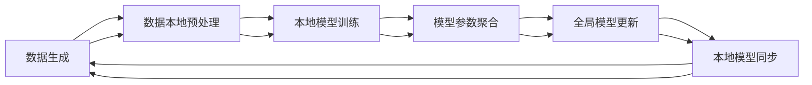

                 

# 联邦学习在金融行业的实践与前景

## 1. 背景介绍

金融行业是一个高度依赖数据的行业，每一个金融决策背后都蕴含着大量的历史和实时数据。传统的集中式数据分析和建模方法往往难以应对海量数据和复杂模型的需求，同时面临着数据隐私和安全等问题。联邦学习作为一种新兴的分布式机器学习方法，能够在不共享原始数据的前提下，协同多个机构进行模型训练，是解决金融数据隐私和安全问题的一个有效手段。本文将系统介绍联邦学习的基本原理和在金融行业的实际应用案例，并展望其未来前景。

## 2. 核心概念与联系

### 2.1 核心概念概述

- **联邦学习**：一种分布式机器学习方法，各参与机构在本地保留数据，仅共享中间模型参数，协作训练全局模型，保护了数据的隐私性和安全性。
- **数据隐私**：在数据共享和交换过程中，保护数据不泄露到未经授权的第三方，满足合规性和安全性的要求。
- **数据安全**：通过技术手段防止数据被非法获取、篡改和破坏，保证数据使用的可靠性和完整性。
- **边缘计算**：将计算任务分布到靠近数据源的本地设备，降低数据传输带宽和时延，提升计算效率和实时性。
- **共识机制**：各参与方在模型参数更新和模型选择过程中达成一致，保证联邦学习过程的公平和透明。

### 2.2 核心概念原理和架构的 Mermaid 流程图



该流程图展示了联邦学习的基本流程：
1. 数据生成：各参与机构生成本地数据。
2. 数据本地预处理：对本地数据进行格式和标注处理。
3. 本地模型训练：各机构在本地训练模型，并计算梯度。
4. 模型参数聚合：各机构将梯度传递给中央服务器进行聚合。
5. 全局模型更新：中央服务器更新全局模型参数。
6. 本地模型同步：各机构同步更新后的全局模型参数。

## 3. 核心算法原理 & 具体操作步骤

### 3.1 算法原理概述

联邦学习通过多节点协作训练模型，各节点本地保留数据，仅在模型参数上传和更新过程中进行通信。其核心思想是将大规模分布式训练任务，转化为各节点本地训练和参数更新的过程，保护了数据隐私，并减少了通信开销。联邦学习的整体流程可以概括为本地训练、参数聚合和全局更新三个步骤。

### 3.2 算法步骤详解

**Step 1: 数据分布与节点划分**

首先，将数据集分成多个部分，分配给不同节点进行本地预处理。节点通常为金融机构、金融机构的数据中心、云计算平台等。

**Step 2: 本地模型训练**

各节点在本地使用训练数据训练模型，更新模型参数。训练过程与传统的本地训练类似，但在每次更新模型参数前，需要先计算局部梯度。

**Step 3: 参数聚合与全局更新**

各节点将计算出的局部梯度上传至中央服务器进行聚合，计算全局梯度。中央服务器使用全局梯度更新全局模型参数，并将更新后的参数同步至各节点。

**Step 4: 模型同步与迭代**

重复执行步骤2和步骤3，直到模型收敛或达到预设的迭代次数。在整个联邦学习过程中，各节点模型参数保持同步，保证各节点使用一致的模型。

### 3.3 算法优缺点

联邦学习的主要优点包括：
1. 保护数据隐私：各节点仅共享模型参数，不泄露原始数据。
2. 降低通信开销：数据不进行集中式传输，仅在参数上传和更新过程中进行通信。
3. 泛化性强：模型在不同节点上的训练数据差异较大，联邦学习能够融合更多数据来源，提升模型泛化能力。
4. 支持边缘计算：各节点本地训练，减少数据传输，提升计算效率和实时性。

其主要缺点包括：
1. 计算开销较大：联邦学习需要同步和聚合多个节点的参数，计算复杂度较高。
2. 收敛速度较慢：由于参数更新过程中涉及多节点通信，收敛速度可能较慢。
3. 共识机制复杂：各节点模型参数的更新和聚合需要达成共识，设计合适的共识机制是关键。
4. 算法复杂度高：联邦学习算法设计复杂，需要处理节点异构性、数据分布不均等问题。

### 3.4 算法应用领域

联邦学习在金融行业有广泛的应用场景，包括但不限于以下领域：

- **信用评分**：金融机构使用用户的历史交易数据、社交网络数据等，通过联邦学习协同训练信用评分模型，提升预测精度。
- **欺诈检测**：各银行和金融机构通过联邦学习协同训练欺诈检测模型，共享异常交易样本和特征，提升检测效率。
- **风险管理**：保险、证券等行业利用联邦学习协同训练风险评估模型，融合不同金融机构的数据，优化风险管理策略。
- **投资组合优化**：通过联邦学习协同训练投资组合优化模型，各机构共享投资数据和策略，提升资产管理效果。
- **金融智能客服**：各金融机构通过联邦学习协同训练智能客服模型，共享客户对话数据，提升服务质量和效率。

## 4. 数学模型和公式 & 详细讲解 & 举例说明

### 4.1 数学模型构建

联邦学习的基本数学模型包括本地模型、全局模型和参数更新规则。假设各节点有 $n$ 个本地数据集 $D_i = \{(x_i, y_i)\}_{i=1}^{n_i}$，其中 $x_i$ 为输入，$y_i$ 为标签。各节点本地训练模型 $M_i$，全局模型为 $M_g$。参数更新规则为：

$$
M_{i+1} = M_i - \eta \nabla_{\theta} L_i(M_i)
$$

其中 $\eta$ 为学习率，$L_i(M_i)$ 为损失函数。

### 4.2 公式推导过程

假设各节点有 $n$ 个本地数据集 $D_i = \{(x_i, y_i)\}_{i=1}^{n_i}$，则损失函数 $L_i$ 可以表示为：

$$
L_i = \frac{1}{n_i} \sum_{(x,y) \in D_i} \ell(M_i(x), y)
$$

全局模型 $M_g$ 由各节点模型 $M_i$ 聚合得到：

$$
M_g = \frac{1}{n} \sum_{i=1}^{n} M_i
$$

假设全局模型的参数为 $\theta$，则全局模型的损失函数为：

$$
L_g = \frac{1}{n} \sum_{i=1}^{n} L_i
$$

参数更新规则可以表示为：

$$
\theta^{t+1} = \theta^t - \frac{\eta}{n} \sum_{i=1}^{n} \nabla_{\theta} L_i
$$

其中 $\nabla_{\theta} L_i$ 为损失函数对模型参数 $\theta$ 的梯度。

### 4.3 案例分析与讲解

以信用评分模型为例，假设银行 $A$ 和 $B$ 分别有 $n_A$ 和 $n_B$ 个用户数据。银行 $A$ 和 $B$ 各自训练本地模型 $M_A$ 和 $M_B$，参数更新规则与上述公式相同。银行 $A$ 和 $B$ 将本地模型参数 $M_A$ 和 $M_B$ 上传至中央服务器进行聚合，更新全局模型 $M_g$。中央服务器使用全局梯度更新全局模型参数，并将更新后的参数同步至各节点。银行 $A$ 和 $B$ 继续训练本地模型，使用新的全局模型参数进行更新。重复上述步骤，直到模型收敛或达到预设的迭代次数。

## 5. 项目实践：代码实例和详细解释说明

### 5.1 开发环境搭建

联邦学习开发环境需要支持分布式计算和数据共享。以下是一个基于 PyTorch 和 Horovod 的联邦学习开发环境搭建流程：

1. 安装 PyTorch 和 Horovod：
```bash
pip install torch torchvision torchaudio
pip install horovod[all]
```

2. 配置 Horovod：
```bash
horovodrun --gpus 0,1,2,3 --nproc-per-node 4 --host 192.168.1.100,192.168.1.101,192.168.1.102,192.168.1.103 python train.py
```

### 5.2 源代码详细实现

以下是使用 PyTorch 和 Horovod 实现联邦信用评分模型的代码：

```python
import torch
import horovod.torch as hvd
from torch import nn, optim

class CreditScoringModel(nn.Module):
    def __init__(self):
        super(CreditScoringModel, self).__init__()
        self.fc1 = nn.Linear(10, 10)
        self.fc2 = nn.Linear(10, 1)

    def forward(self, x):
        x = self.fc1(x)
        x = torch.sigmoid(x)
        x = self.fc2(x)
        return x

def train_epoch(model, data_loader, optimizer):
    model.train()
    for data, target in data_loader:
        data = data.to(hvd.rank())
        target = target.to(hvd.rank())
        optimizer.zero_grad()
        output = model(data)
        loss = nn.BCELoss()(output, target)
        loss.backward()
        optimizer.step()

def main():
    # Initialize Horovod
    hvd.init()

    # Initialize model and optimizer
    model = CreditScoringModel()
    optimizer = optim.Adam(model.parameters(), lr=0.001)
    criterion = nn.BCELoss()

    # Load data
    train_loader = DataLoader(train_dataset, batch_size=64, shuffle=True)

    # Train model
    for epoch in range(100):
        train_epoch(model, train_loader, optimizer)

    # Sync model parameters
    hvd.broadcast_parameters(model.state_dict(), root_rank=0)

if __name__ == '__main__':
    main()
```

### 5.3 代码解读与分析

- `train_epoch` 函数：实现一个训练epoch，对模型进行前向传播、计算损失、反向传播和参数更新。
- `main` 函数：初始化 Horovod、定义模型、优化器和损失函数，加载数据集，循环训练模型，并使用 `hvd.broadcast_parameters` 函数同步模型参数。

## 6. 实际应用场景

### 6.1 信贷风险管理

金融机构在信贷风险管理过程中，需要综合考虑客户的信用记录、交易行为、社会网络等多个维度的数据，通过联邦学习协同训练信用评分模型，可以提升模型的预测精度和泛化能力。银行 $A$ 和 $B$ 分别持有部分客户的信用数据，通过联邦学习协同训练模型，融合多源数据，优化信用评分算法。

### 6.2 欺诈检测

金融机构在欺诈检测过程中，需要收集来自不同渠道的异常交易样本和特征数据。通过联邦学习协同训练欺诈检测模型，可以提升检测模型的准确率和鲁棒性。各银行和金融机构将异常交易样本和特征数据上传至中央服务器进行聚合，训练全局欺诈检测模型，并将更新后的模型参数同步至各节点。各节点使用更新后的全局模型进行欺诈检测。

### 6.3 智能投顾

资产管理公司需要利用投资者的交易数据和市场数据，通过联邦学习协同训练投资组合优化模型，提升投资策略的优化效果。各资产管理公司将投资数据和策略上传至中央服务器进行聚合，训练全局投资组合优化模型，并将更新后的模型参数同步至各节点。各节点使用更新后的全局模型进行投资组合优化。

### 6.4 未来应用展望

随着联邦学习技术的不断发展，其在金融行业的应用前景广阔。未来，联邦学习将向以下几个方向发展：

1. **支持更复杂模型**：联邦学习将支持更复杂的深度学习模型，如卷积神经网络、注意力机制等，提升模型的表达能力和预测效果。
2. **提升计算效率**：联邦学习将采用更高效的计算和通信算法，如模型剪枝、量化、边缘计算等，提高计算效率和实时性。
3. **增强模型泛化**：联邦学习将融合更多不同来源的数据，提升模型的泛化能力和鲁棒性。
4. **支持更多应用场景**：联邦学习将在金融行业的更多场景中得到应用，如智能投顾、保险精算、金融智能客服等。
5. **引入更多创新技术**：联邦学习将与区块链、隐私计算、云计算等前沿技术结合，提升数据安全性和隐私保护水平。

## 7. 工具和资源推荐

### 7.1 学习资源推荐

- **《联邦学习：分布式机器学习算法与系统》**：这是一本深入介绍联邦学习基本概念、算法和系统的书籍，适合深入了解联邦学习的理论和实践。
- **《分布式深度学习》**：由深度学习领域专家撰写，详细讲解分布式深度学习算法和系统，包括联邦学习在内。
- **Coursera上的《Distributed Machine Learning》课程**：由斯坦福大学教授讲解分布式机器学习算法和系统，包括联邦学习在内的众多分布式学习算法。
- **Kaggle上的联邦学习竞赛**：参加联邦学习竞赛，通过实战练习掌握联邦学习技术和应用。

### 7.2 开发工具推荐

- **PyTorch**：基于 Python 的开源深度学习框架，支持分布式计算和联邦学习。
- **Horovod**：分布式深度学习库，支持多 GPU 和多节点训练。
- **TensorFlow**：由 Google 主导的开源深度学习框架，支持分布式计算和联邦学习。
- **FedX**：联邦学习开源平台，支持多节点协同训练和模型管理。

### 7.3 相关论文推荐

- **FedAvg: A Distributed Optimization Algorithm for Machine Learning on Mobile, Cloud and Edge Devices**：提出联邦平均算法，介绍联邦学习的原理和算法细节。
- ** federated learning: Concept and Status**：介绍联邦学习的基本概念、应用和未来趋势。
- ** federated smoothing for federated learning with non-identical data**：研究联邦学习在数据异构性下的优化方法。

## 8. 总结：未来发展趋势与挑战

### 8.1 总结

本文系统介绍了联邦学习的基本原理和在金融行业的实际应用案例。联邦学习通过多节点协作训练模型，保护了数据隐私，降低了通信开销，提升了模型的泛化能力和实时性。联邦学习在金融行业的信贷风险管理、欺诈检测、智能投顾等场景中得到了广泛应用，展示了其强大的应用潜力。未来，联邦学习将在更复杂、高效、安全的方向上不断演进，推动金融科技的发展。

### 8.2 未来发展趋势

未来，联邦学习在金融行业的发展趋势包括：

1. **更复杂模型**：联邦学习将支持更复杂的深度学习模型，如卷积神经网络、注意力机制等，提升模型的表达能力和预测效果。
2. **更高的计算效率**：联邦学习将采用更高效的计算和通信算法，如模型剪枝、量化、边缘计算等，提高计算效率和实时性。
3. **更广泛的融合**：联邦学习将与区块链、隐私计算、云计算等前沿技术结合，提升数据安全性和隐私保护水平。
4. **更强的模型泛化**：联邦学习将融合更多不同来源的数据，提升模型的泛化能力和鲁棒性。

### 8.3 面临的挑战

尽管联邦学习在金融行业取得了一定的进展，但在其推广和应用过程中仍面临以下挑战：

1. **计算开销较大**：联邦学习需要同步和聚合多个节点的参数，计算复杂度较高。
2. **通信开销较大**：节点之间的数据传输和通信开销较大，需要优化算法和硬件支持。
3. **共识机制复杂**：各节点模型参数的更新和聚合需要达成共识，设计合适的共识机制是关键。
4. **数据分布不均**：不同节点之间的数据分布不均，影响联邦学习的效果和公平性。

### 8.4 研究展望

未来，联邦学习的研究方向包括：

1. **高效算法设计**：研究高效、低通信开销的算法，提升联邦学习的计算效率和实时性。
2. **隐私保护技术**：研究更加隐私保护的技术，提升联邦学习的安全性和可扩展性。
3. **模型优化方法**：研究更加高效、鲁棒的模型优化方法，提升联邦学习的泛化能力和预测精度。
4. **应用场景拓展**：研究联邦学习在更多金融行业场景中的应用，如智能投顾、保险精算、金融智能客服等。

## 9. 附录：常见问题与解答

**Q1: 联邦学习与传统的分布式训练方法有什么区别？**

A: 联邦学习和分布式训练的区别在于数据和模型的分布方式。分布式训练通常需要各节点共享部分数据和模型参数，而联邦学习各节点仅共享中间模型参数，不泄露原始数据。

**Q2: 联邦学习如何保护数据隐私？**

A: 联邦学习通过各节点仅上传模型参数和本地梯度，不共享原始数据，保护了数据隐私。

**Q3: 联邦学习在实际应用中如何选择合适的共识机制？**

A: 选择合适的共识机制需要考虑各节点异构性和数据分布不均等因素。如基于拜占庭容错的PBFT算法，能够容忍一定比例的恶意节点，保证联邦学习的公平性和安全性。

**Q4: 联邦学习在金融行业有哪些实际应用场景？**

A: 联邦学习在金融行业的信贷风险管理、欺诈检测、智能投顾、保险精算、金融智能客服等场景中得到了广泛应用，展示了其强大的应用潜力。

---

作者：禅与计算机程序设计艺术 / Zen and the Art of Computer Programming

