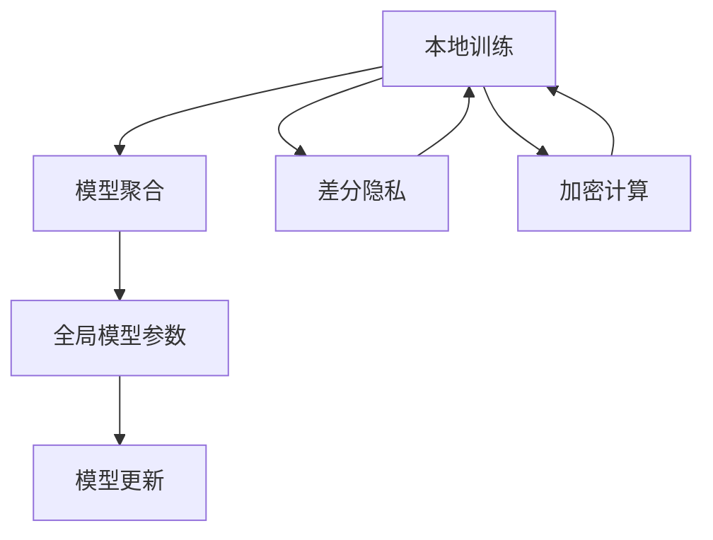

                 

# 联邦学习基本原理与工作机制详解

> 关键词：联邦学习,分布式机器学习,数据隐私保护,模型聚合,隐私计算,协同训练,异构分布,多中心网络,隐私保护,计算资源优化

## 1. 背景介绍

### 1.1 问题由来
随着互联网的普及和智能设备的大量部署，数据生成规模不断扩大，但数据分布往往具有地域和业务特征，呈现出异构化和分散化的趋势。传统的集中式机器学习模型训练方式，面临着数据孤岛、计算瓶颈、隐私泄漏等诸多问题。面对这些挑战，联邦学习应运而生，成为一种高效、安全的分布式机器学习范式。

联邦学习由Google在2015年提出，并逐渐被广泛应用于移动设备、边缘计算、互联网金融等领域。它通过在分布式环境中构建协同训练机制，使得各数据中心能在不共享数据的情况下，联合训练全局最优模型。相比传统集中式训练，联邦学习在保护数据隐私、提升计算效率、提升模型泛化能力等方面具有显著优势。

### 1.2 问题核心关键点
联邦学习的核心思想是：将分散在不同数据中心的本地数据在分布式环境中进行聚合训练，不进行数据迁移，不共享模型权重，同时保护数据隐私。其核心优势包括：
1. 分布式协同训练：充分利用各数据中心的计算资源，提升模型训练速度。
2. 数据隐私保护：各数据中心仅上传本地模型权重，不传输原始数据，保障数据安全。
3. 计算资源优化：通过本地化模型训练，减少网络传输开销，优化计算成本。
4. 模型泛化能力强：多个数据中心联合训练，模型能够更好地捕捉不同数据分布的特征，提升泛化能力。

这些关键优势使得联邦学习在各类分布式应用中具有广泛的应用前景，但也带来诸多挑战，如异构分布、模型收敛、计算复杂度等。

### 1.3 问题研究意义
联邦学习在应对数据孤岛、提升计算效率、保护数据隐私等方面具有重要意义：

1. 数据孤岛问题：联邦学习将数据分布在各个独立的数据中心，通过分布式协同训练来构建全局最优模型，避免了集中式训练中数据孤岛和数据泄露的问题。
2. 计算效率问题：联邦学习通过本地化模型训练和参数聚合，减少了数据传输的带宽和时间成本，提升了模型训练效率。
3. 数据隐私问题：联邦学习不传输原始数据，仅上传模型权重和梯度，避免了数据泄露的风险，保护了用户隐私。
4. 模型泛化能力：联邦学习通过联合多中心网络的数据，训练出的模型具有更强的泛化能力，适应更多业务场景。
5. 隐私保护问题：联邦学习通过差分隐私、加密计算等技术，进一步保障数据隐私，减少潜在的法律和伦理风险。

## 2. 核心概念与联系

### 2.1 核心概念概述

为更好地理解联邦学习的核心概念，本节将介绍几个关键概念：

- 联邦学习(Federated Learning)：一种分布式机器学习范式，各数据中心在本地数据上进行模型训练，并定期通过模型权重或梯度进行参数聚合，共同提升全局模型性能。
- 本地训练(Local Training)：在本地数据集上训练模型，仅上传模型参数，不传输原始数据。
- 模型聚合(Model Aggregation)：各数据中心将本地训练的模型参数进行聚合，形成全局模型参数，提升模型性能。
- 差分隐私(Differential Privacy)：一种隐私保护技术，确保每次模型更新对任何单个样本的贡献不可被识别，从而保护数据隐私。
- 加密计算(Encryption-Based Computation)：利用密码学技术保护模型训练过程中的中间结果，防止敏感信息泄露。
- 多中心网络(Multicenter Network)：由多个数据中心构成的分布式训练网络，每个数据中心负责本地数据的收集、训练和模型参数的上传。
- 计算资源优化(Computation Resource Optimization)：通过本地化训练和聚合，减少网络传输开销，优化计算成本。

这些概念之间的逻辑关系可以通过以下Mermaid流程图来展示：



这个流程图展示了大规模分布式机器学习过程中的关键步骤，及其相互之间的关系：

1. 本地训练：每个数据中心在本地数据上进行模型训练，仅上传模型参数。
2. 差分隐私：在本地训练时对数据进行差分隐私保护，确保训练结果对任何单个样本的贡献不可被识别。
3. 加密计算：对本地训练的中间结果进行加密保护，防止敏感信息泄露。
4. 模型聚合：各数据中心上传模型参数，进行全局模型参数的更新和聚合。
5. 模型更新：全局模型参数在各数据中心之间进行更新和迭代，最终形成全局最优模型。

## 3. 核心算法原理 & 具体操作步骤
### 3.1 算法原理概述

联邦学习通过在分布式环境中构建协同训练机制，实现各数据中心在本地数据上的联合训练，最终形成全局最优模型。其核心思想是：通过模型参数的周期性更新和聚合，提升全局模型的性能。

形式化地，假设全局模型为 $M_{\theta}$，其中 $\theta$ 为模型参数。各数据中心的本地模型为 $M^i_{\theta_i}$，在本地数据集 $D^i$ 上训练得到。联邦学习的优化目标是最小化全局损失函数，即：

$$
\theta^* = \mathop{\arg\min}_{\theta} \mathcal{L}(M_{\theta}, D)
$$

其中 $\mathcal{L}$ 为全局损失函数，$D$ 为全局数据集。联邦学习通常采用梯度下降法进行优化，迭代更新模型参数 $\theta$，最小化全局损失函数。

### 3.2 算法步骤详解

联邦学习的具体步骤如下：

**Step 1: 准备全局模型和本地数据集**
- 初始化全局模型 $M_{\theta_0}$。
- 将数据集 $D$ 划分为若干本地数据集 $D^i=\{(x^i_j, y^i_j)\}_{j=1}^{n_i}$，其中 $n_i$ 为本地数据集大小。

**Step 2: 本地训练与上传梯度**
- 在本地数据集 $D^i$ 上训练本地模型 $M^i_{\theta_i}$，更新模型参数 $\theta_i$。
- 计算全局梯度 $\delta_i = \nabla_{\theta_i} \mathcal{L}_i(M^i_{\theta_i}, D^i)$，将梯度上传到全局模型。

**Step 3: 全局模型聚合**
- 对各数据中心上传的梯度进行聚合，更新全局模型参数 $\theta_{t+1} = \theta_t - \eta \sum_{i=1}^{N} \delta_i$，其中 $\eta$ 为学习率。

**Step 4: 重复迭代**
- 重复执行Step 2和Step 3，直至全局模型收敛。

以上步骤展示了联邦学习的核心过程。实际应用中，还需要考虑模型初始化、学习率调度、聚合策略等细节，以确保全局模型的收敛性和性能。

### 3.3 算法优缺点

联邦学习作为一种分布式机器学习范式，具有以下优点：
1. 数据隐私保护：各数据中心不传输原始数据，仅上传模型参数，确保数据隐私安全。
2. 计算效率高：充分利用各数据中心的计算资源，提升模型训练速度。
3. 模型泛化能力强：通过联合多个数据中心的训练数据，提升模型的泛化能力。
4. 低通信成本：仅上传模型参数，减少网络传输开销，降低通信成本。

但联邦学习也存在一些局限性：
1. 异构分布：各数据中心的计算能力和网络带宽可能差异较大，影响全局模型的收敛性。
2. 模型同步问题：各数据中心的模型参数更新不均衡，导致同步误差。
3. 通信瓶颈：模型参数的周期性上传和下载，可能成为通信瓶颈。
4. 计算复杂度高：涉及多数据中心间的协调和通信，计算复杂度较高。

尽管存在这些局限性，但联邦学习在数据隐私保护、分布式计算、多中心网络等场景中具有重要应用价值。未来相关研究的方向是提高模型收敛速度、优化通信开销、降低计算复杂度等。

### 3.4 算法应用领域

联邦学习作为一种分布式机器学习技术，已被广泛应用于多个领域，包括但不限于：

1. 移动设备优化：通过联合多个设备的数据进行模型训练，优化移动应用性能，提升用户体验。
2. 边缘计算：在边缘设备上进行本地化模型训练，提升计算效率，减少数据传输延迟。
3. 互联网金融：利用联邦学习训练风控模型，减少数据共享风险，提升模型准确性。
4. 智能制造：通过联邦学习训练预测模型，优化生产计划，提升供应链管理水平。
5. 智慧医疗：利用联邦学习训练疾病预测模型，保护患者隐私，提升诊断准确性。
6. 智能交通：通过联邦学习训练交通预测模型，提升交通流量预测和交通管理效率。

以上领域展示了联邦学习的广泛应用前景，各行业通过联邦学习可以实现多中心网络的协同优化，提升整体系统性能和资源利用效率。

## 4. 数学模型和公式 & 详细讲解  
### 4.1 数学模型构建

假设全局模型为 $M_{\theta}$，其中 $\theta$ 为模型参数。各数据中心的本地模型为 $M^i_{\theta_i}$，在本地数据集 $D^i=\{(x^i_j, y^i_j)\}_{j=1}^{n_i}$ 上训练得到。全局损失函数 $\mathcal{L}$ 可表示为：

$$
\mathcal{L}(M_{\theta}, D) = \frac{1}{N}\sum_{i=1}^{N} \mathcal{L}_i(M^i_{\theta_i}, D^i)
$$

其中 $\mathcal{L}_i$ 为本地损失函数，$N$ 为数据中心总数。本地损失函数通常为交叉熵损失、均方误差等标准损失函数。

在联邦学习中，每个数据中心在本地数据集上进行模型训练，计算本地损失函数梯度 $\delta_i = \nabla_{\theta_i} \mathcal{L}_i(M^i_{\theta_i}, D^i)$，然后将梯度 $\delta_i$ 上传到全局模型。全局模型参数更新公式为：

$$
\theta_{t+1} = \theta_t - \eta \sum_{i=1}^{N} \delta_i
$$

其中 $\eta$ 为学习率，$N$ 为数据中心总数。

### 4.2 公式推导过程

以下我们以交叉熵损失函数为例，推导联邦学习的全局模型更新公式。

假设模型在输入 $x$ 上的输出为 $\hat{y}=M_{\theta}(x)$，真实标签为 $y$。本地损失函数 $\mathcal{L}_i$ 为交叉熵损失：

$$
\mathcal{L}_i(M^i_{\theta_i}, D^i) = -\frac{1}{n_i}\sum_{j=1}^{n_i} y^i_j \log M^i_{\theta_i}(x^i_j)
$$

将本地损失函数对模型参数 $\theta_i$ 求导，得到本地梯度：

$$
\delta_i = \nabla_{\theta_i} \mathcal{L}_i(M^i_{\theta_i}, D^i) = -\frac{1}{n_i}\sum_{j=1}^{n_i} (y^i_j - M^i_{\theta_i}(x^i_j)) \frac{\partial M^i_{\theta_i}(x^i_j)}{\partial \theta_i}
$$

假设全局模型在输入 $x$ 上的输出为 $\hat{y}=M_{\theta}(x)$，全局损失函数 $\mathcal{L}(M_{\theta}, D)$ 为交叉熵损失：

$$
\mathcal{L}(M_{\theta}, D) = -\frac{1}{N}\sum_{i=1}^{N} \frac{1}{n_i}\sum_{j=1}^{n_i} y^i_j \log M_{\theta}(x^i_j)
$$

对全局模型参数 $\theta$ 求导，得到全局梯度：

$$
\nabla_{\theta} \mathcal{L}(M_{\theta}, D) = -\frac{1}{N}\sum_{i=1}^{N} \frac{1}{n_i}\sum_{j=1}^{n_i} (y^i_j - M_{\theta}(x^i_j)) \frac{\partial M_{\theta}(x^i_j)}{\partial \theta}
$$

将全局梯度 $\nabla_{\theta} \mathcal{L}(M_{\theta}, D)$ 和本地梯度 $\delta_i$ 联立，得：

$$
\nabla_{\theta} \mathcal{L}(M_{\theta}, D) = -\frac{1}{N}\sum_{i=1}^{N} \delta_i
$$

代入全局模型参数更新公式，得：

$$
\theta_{t+1} = \theta_t - \eta \sum_{i=1}^{N} \delta_i
$$

以上推导展示了联邦学习全局模型参数的更新过程，通过周期性上传本地梯度并进行聚合，实现分布式协同训练。

### 4.3 案例分析与讲解

考虑一个具有两个数据中心 $C_1$ 和 $C_2$ 的联邦学习场景，各数据中心在本地数据集上训练模型 $M^1_{\theta_1}$ 和 $M^2_{\theta_2}$，计算并上传本地梯度 $\delta_1$ 和 $\delta_2$。假设全局模型初始参数为 $\theta_0$，学习率为 $\eta=0.01$，每次聚合上传的梯度大小为 $d=0.1$。

**本地训练：**
- $C_1$ 在本地数据集 $D^1=\{(x^1_1, y^1_1), (x^1_2, y^1_2), (x^1_3, y^1_3)\}$ 上训练模型 $M^1_{\theta_1}$，计算本地梯度 $\delta_1 = -\frac{1}{3}\sum_{j=1}^{3} (y^1_j - M^1_{\theta_1}(x^1_j)) \frac{\partial M^1_{\theta_1}(x^1_j)}{\partial \theta_1}$。
- $C_2$ 在本地数据集 $D^2=\{(x^2_1, y^2_1), (x^2_2, y^2_2), (x^2_3, y^2_3)\}$ 上训练模型 $M^2_{\theta_2}$，计算本地梯度 $\delta_2 = -\frac{1}{3}\sum_{j=1}^{3} (y^2_j - M^2_{\theta_2}(x^2_j)) \frac{\partial M^2_{\theta_2}(x^2_j)}{\partial \theta_2}$。

**全局聚合：**
- 每次迭代上传梯度 $\delta_1 = d$ 和 $\delta_2 = d$，聚合更新全局模型参数：

$$
\theta_{t+1} = \theta_t - \eta (d + d)
$$

**参数更新：**
- 每次迭代更新全局模型参数，直至模型收敛或达到预设轮数。

通过以上案例分析，展示了联邦学习在分布式环境中的协同训练机制，以及全局参数的周期性聚合过程。

## 5. 项目实践：代码实例和详细解释说明
### 5.1 开发环境搭建

在进行联邦学习项目实践前，我们需要准备好开发环境。以下是使用Python进行TensorFlow开发的环境配置流程：

1. 安装Anaconda：从官网下载并安装Anaconda，用于创建独立的Python环境。

2. 创建并激活虚拟环境：
```bash
conda create -n federated-learning python=3.8 
conda activate federated-learning
```

3. 安装TensorFlow：根据CUDA版本，从官网获取对应的安装命令。例如：
```bash
conda install tensorflow tensorflow-gpu=cuda11.1 -c pytorch -c conda-forge
```

4. 安装Federated-Average等联邦学习库：
```bash
pip install federated-average federated-mamlib
```

5. 安装各类工具包：
```bash
pip install numpy pandas scikit-learn matplotlib tqdm jupyter notebook ipython
```

完成上述步骤后，即可在`federated-learning`环境中开始联邦学习实践。

### 5.2 源代码详细实现

下面以联邦学习中常见的模型聚合算法——Federated Averaging为例，给出使用TensorFlow实现联邦学习模型聚合的代码实现。

```python
import tensorflow as tf
from federated_averaging.aggregators import federated_average
from federated_averaging import metrics

# 假设数据中心数量和本地数据集大小
num_clients = 2
num_local_samples = 3

# 全局模型参数
model = tf.keras.Sequential([
    tf.keras.layers.Dense(10, activation='relu'),
    tf.keras.layers.Dense(1)
])

# 设置全局损失函数和优化器
loss_fn = tf.keras.losses.mean_squared_error
optimizer = tf.keras.optimizers.Adam()

# 本地训练和上传梯度
def local_train_and_upload_weights():
    client = tf.keras.Sequential([
        tf.keras.layers.Dense(10, activation='relu'),
        tf.keras.layers.Dense(1)
    ])
    
    for i in range(num_local_samples):
        input_data = [tf.random.normal([1, 1])]
        labels = [tf.random.normal([1, 1])]
        with tf.GradientTape() as tape:
            predictions = client(input_data)
            loss = loss_fn(labels, predictions)
        gradients = tape.gradient(loss, client.trainable_variables)
        client.trainable_variables.assign_sub(gradients * 0.1)
    
    weights = client.trainable_variables
    client.weights.set_weights(model.get_weights())
    
    return weights

# 全局模型聚合
def global_model_averaging(weights):
    model.set_weights(federated_average.aggregate(weights))

# 训练过程
epochs = 10
for epoch in range(epochs):
    weights = [local_train_and_upload_weights() for _ in range(num_clients)]
    global_model_averaging(weights)
    train_loss = metrics.mean_squared_error(model.predict(tf.random.normal([1, 1])), tf.random.normal([1, 1]))
    print(f"Epoch {epoch+1}, train loss: {train_loss:.3f}")
```

以上代码展示了联邦学习在模型聚合算法Federated Averaging中的基本实现流程。可以看到，TensorFlow提供了丰富的分布式计算和优化工具，可以方便地进行联邦学习开发。

### 5.3 代码解读与分析

让我们再详细解读一下关键代码的实现细节：

**局部训练函数：**
- 定义本地数据集大小和数据中心数量，并初始化全局模型。
- 定义本地模型的结构、损失函数和优化器。
- 在本地数据集上进行模型训练，计算本地梯度，并上传模型权重到全局模型。
- 返回上传后的模型权重。

**全局聚合函数：**
- 使用Federated Averaging算法，将上传的模型权重进行聚合更新，更新全局模型参数。

**训练流程：**
- 定义训练轮数，开始循环迭代。
- 在每个数据中心上执行本地训练和模型上传。
- 将上传的模型权重进行全局聚合，更新全局模型参数。
- 计算并打印训练损失。

可以看到，TensorFlow提供了便捷的分布式计算工具，使得联邦学习模型的开发和部署变得相对简单。

当然，工业级的系统实现还需考虑更多因素，如模型保存和部署、超参数的自动搜索、更灵活的任务适配层等。但核心的联邦学习范式基本与此类似。

## 6. 实际应用场景
### 6.1 智能设备优化

联邦学习在智能设备优化方面具有重要应用前景。由于智能设备数量众多，分布广泛，集中式训练难以满足计算需求。通过联邦学习，各设备可以在本地进行模型训练，并将模型参数上传到云端进行聚合优化，实现全局模型更新，提升设备性能。

在具体应用中，设备制造商可以通过联邦学习训练应用优化模型，提升设备运行效率，降低功耗。运营商可以联合多设备训练网络优化模型，提升网络覆盖和数据传输质量。

### 6.2 边缘计算优化

边缘计算优化是联邦学习的另一个重要应用场景。边缘计算通过将计算任务分布到靠近数据源的设备上进行处理，降低网络传输延迟，提升计算效率。联邦学习通过本地化训练和参数聚合，进一步优化边缘计算性能。

例如，在自动驾驶系统中，边缘计算设备可以通过联邦学习训练车辆感知和决策模型，提升行驶安全和稳定性。在工业物联网(IoT)中，边缘设备可以通过联邦学习训练预测和控制模型，提升生产效率和设备管理水平。

### 6.3 互联网金融风险管理

互联网金融风险管理是大数据和机器学习技术的重要应用场景。由于金融数据具有高度敏感性，集中式训练存在数据隐私和安全风险。通过联邦学习，金融机构可以在本地数据上训练模型，保护用户隐私，提升风险管理能力。

在具体应用中，联邦学习可以用于信用评分模型训练、欺诈检测模型训练等。金融机构可以联合多个客户的数据进行模型训练，提升模型准确性和泛化能力，同时保障客户数据安全。

### 6.4 智能制造生产优化

智能制造生产优化是联邦学习的另一大应用方向。制造业生产环境复杂，数据量巨大，分布广泛。通过联邦学习，工厂可以在本地进行生产数据分析，将模型参数上传到云端进行聚合优化，提升生产效率和资源利用率。

在具体应用中，联邦学习可以用于预测和优化生产计划、质量控制、设备维护等任务。制造企业可以联合多个工厂的数据进行模型训练，提升生产预测精度和资源利用效率。

### 6.5 智慧医疗诊断优化

智慧医疗诊断优化是大数据和人工智能在医疗领域的重要应用方向。由于医疗数据具有高度隐私性，集中式训练存在数据隐私和安全风险。通过联邦学习，医疗机构可以在本地数据上训练模型，保护患者隐私，提升诊断能力。

在具体应用中，联邦学习可以用于疾病预测模型训练、病历分析模型训练等。医疗机构可以联合多个医院的数据进行模型训练，提升诊断准确性和泛化能力，同时保障患者数据安全。

## 7. 工具和资源推荐
### 7.1 学习资源推荐

为了帮助开发者系统掌握联邦学习的理论基础和实践技巧，这里推荐一些优质的学习资源：

1. 《Federated Learning: Concepts and Applications》：由Google Brain团队撰写，全面介绍了联邦学习的核心概念和应用场景。

2. 《Federated Learning in Machine Learning Systems》：Coursera提供的联邦学习课程，涵盖联邦学习的基本原理、分布式训练、隐私保护等核心内容。

3. 《Federated Learning for Smartphones: A Survey》：华为联合NVIDIA撰写的综述论文，全面总结了联邦学习在移动设备上的应用实践。

4. 《Federated Learning: Taxonomy and Beyond》：一项涵盖联邦学习文献综述的论文，详细讨论了联邦学习的分类、应用和挑战。

5. 《Federated Learning: Concepts and Challenges》：一项综合介绍联邦学习基本概念和挑战的论文，适合初学者了解联邦学习的整体框架。

6. 《Federated Learning: Principles and Approaches》：一项介绍联邦学习核心原理和挑战的论文，详细讨论了模型聚合、隐私保护等关键技术。

通过对这些资源的学习实践，相信你一定能够快速掌握联邦学习的精髓，并用于解决实际的分布式机器学习问题。
###  7.2 开发工具推荐

高效的开发离不开优秀的工具支持。以下是几款用于联邦学习开发的常用工具：

1. TensorFlow：Google开发的深度学习框架，支持分布式计算和联邦学习。
2. PyTorch：Facebook开发的深度学习框架，提供了丰富的分布式计算和优化工具。
3. Federated-Average：Google开发的联邦学习库，提供了多种模型聚合算法。
4. Federated-MAML：微软开发的联邦学习库，提供了多种分布式优化算法。
5. Weights & Biases：模型训练的实验跟踪工具，可以记录和可视化模型训练过程中的各项指标。
6. TensorBoard：TensorFlow配套的可视化工具，可实时监测模型训练状态，并提供丰富的图表呈现方式。

合理利用这些工具，可以显著提升联邦学习任务的开发效率，加快创新迭代的步伐。

### 7.3 相关论文推荐

联邦学习作为一种分布式机器学习技术，已经被广泛应用于多个领域，得到了广泛的学术研究。以下是几篇奠基性的相关论文，推荐阅读：

1. A Unified Approach to Privacy-Preserving Deep Learning via Differential Privacy（Google Brain团队）：首次提出联邦学习的概念，并阐述了如何通过差分隐私保护数据隐私。

2. Federated Learning: Concepts and Applications（Google Brain团队）：全面总结了联邦学习的核心概念和应用场景，提出了联邦学习的多种变体。

3. Federated Learning in Edge IoT Computing: State-of-the-Art, Applications and Challenges（华为联合NVIDIA）：总结了联邦学习在边缘计算中的应用，并讨论了联邦学习的多种挑战。

4. A Survey on Federated Learning（Microsoft）：总结了联邦学习的多种分类和算法，提供了联邦学习的详细分类框架。

5. A Survey on Federated Learning for Wireless Networks（无线通信领域）：总结了联邦学习在无线通信领域的应用，并讨论了联邦学习的多种应用场景。

这些论文代表了大规模分布式机器学习的发展脉络。通过学习这些前沿成果，可以帮助研究者把握学科前进方向，激发更多的创新灵感。

## 8. 总结：未来发展趋势与挑战

### 8.1 总结

本文对联邦学习的核心概念和应用机制进行了全面系统的介绍。首先阐述了联邦学习的背景和核心思想，明确了其在不共享数据的情况下，通过分布式协同训练提升模型性能的特点。其次，从原理到实践，详细讲解了联邦学习的数学模型和关键步骤，给出了联邦学习任务开发的完整代码实例。同时，本文还广泛探讨了联邦学习在智能设备优化、边缘计算优化、互联网金融风险管理等多个领域的应用前景，展示了联邦学习的广泛应用价值。

通过本文的系统梳理，可以看到，联邦学习在应对数据孤岛、提升计算效率、保护数据隐私等方面具有重要意义。尽管存在一些技术挑战，但其应用前景广阔，将在更多分布式计算和隐私保护场景中发挥重要作用。

### 8.2 未来发展趋势

展望未来，联邦学习将呈现以下几个发展趋势：

1. 数据融合与聚合：未来的联邦学习将更加注重数据融合与聚合，通过更高效的数据传递和更精准的模型更新，提升全局模型的泛化能力。
2. 隐私保护与差分隐私：联邦学习将进一步研究差分隐私算法，保护数据隐私，防止模型参数泄露。
3. 异构分布与优化：联邦学习将更加关注异构分布带来的优化问题，通过分布式优化算法和模型聚合策略，提升全局模型的收敛性和性能。
4. 联邦学习与区块链：联邦学习与区块链技术的结合，将进一步提升数据安全和模型隐私保护能力。
5. 联邦学习与云计算：联邦学习与云计算的结合，将提升模型训练的计算效率和资源利用率。
6. 联邦学习与边缘计算：联邦学习与边缘计算的结合，将提升边缘设备的数据处理能力和本地模型训练效率。

以上趋势凸显了联邦学习在分布式计算和隐私保护领域的重要地位，各领域通过联邦学习可以实现多中心网络的协同优化，提升整体系统性能和资源利用效率。

### 8.3 面临的挑战

尽管联邦学习在数据隐私保护、分布式计算、多中心网络等场景中具有重要应用价值，但其也面临诸多挑战：

1. 数据孤岛问题：各数据中心的数据分布不均衡，难以高效进行联邦学习。
2. 通信瓶颈：联邦学习需要频繁的数据传输，通信带宽可能成为瓶颈。
3. 计算复杂度高：涉及多数据中心间的协调和通信，计算复杂度较高。
4. 模型同步问题：各数据中心的模型参数更新不均衡，导致同步误差。
5. 隐私保护问题：差分隐私等隐私保护技术需要高效的计算支持，难以应用于大规模数据集。
6. 模型收敛问题：异构分布的数据中心可能影响全局模型的收敛性。

尽管存在这些挑战，但联邦学习在数据隐私保护、分布式计算、多中心网络等场景中具有重要应用价值。未来相关研究的方向是提高模型收敛速度、优化通信开销、降低计算复杂度等。

### 8.4 研究展望

面对联邦学习所面临的诸多挑战，未来的研究需要在以下几个方面寻求新的突破：

1. 高效数据融合与聚合：通过更高效的数据传递和更精准的模型更新，提升全局模型的泛化能力。
2. 差分隐私与隐私保护：进一步研究差分隐私算法，保护数据隐私，防止模型参数泄露。
3. 异构分布与优化：研究分布式优化算法和模型聚合策略，提升全局模型的收敛性和性能。
4. 联邦学习与区块链：将联邦学习与区块链技术结合，提升数据安全和模型隐私保护能力。
5. 联邦学习与云计算：结合联邦学习和云计算，提升模型训练的计算效率和资源利用率。
6. 联邦学习与边缘计算：结合联邦学习和边缘计算，提升边缘设备的数据处理能力和本地模型训练效率。

这些研究方向的探索，必将引领联邦学习技术迈向更高的台阶，为分布式计算和隐私保护带来新的突破。未来，联邦学习必将在更多分布式计算和隐私保护场景中发挥重要作用，推动人工智能技术在各领域的规模化落地。

## 9. 附录：常见问题与解答

**Q1：联邦学习与集中式训练有何区别？**

A: 联邦学习与集中式训练的最大区别在于数据传输和模型参数的同步方式。在集中式训练中，数据集和模型参数全部集中存储在中心服务器上，所有计算都在中心服务器上进行。而联邦学习则通过各数据中心本地进行模型训练，仅上传模型参数或梯度，不共享原始数据，保护数据隐私。

**Q2：联邦学习如何保障数据隐私？**

A: 联邦学习通过差分隐私和加密计算等技术保障数据隐私。差分隐私通过在模型更新中加入噪声，确保每次模型更新对任何单个样本的贡献不可被识别。加密计算则通过密码学技术保护模型训练过程中的中间结果，防止敏感信息泄露。

**Q3：联邦学习需要大量的通信开销吗？**

A: 联邦学习确实需要频繁的数据传输，但通过优化数据传递方式和聚合算法，可以显著降低通信开销。例如，Federated Averaging算法通过聚合多个数据中心的模型参数，减少每次数据传输的大小，提升通信效率。

**Q4：联邦学习是否适用于所有任务？**

A: 联邦学习适用于分布式计算和隐私保护场景，如移动设备优化、边缘计算优化、互联网金融风险管理、智能制造生产优化等。但对于需要大量集中数据计算的任务，如图像识别、视频分析等，集中式训练可能更有效。

**Q5：联邦学习如何克服异构分布问题？**

A: 联邦学习通过分布式优化算法和模型聚合策略，克服异构分布问题。例如，Federated Averaging算法通过加权聚合模型参数，确保每个数据中心的贡献都得到充分考虑，提升全局模型的收敛性和性能。

通过这些常见问题的解答，相信你对联邦学习的核心概念和应用机制有了更深入的理解。联邦学习作为分布式机器学习的重要范式，将在更多领域展现出广泛的应用价值和重要的研究意义。

