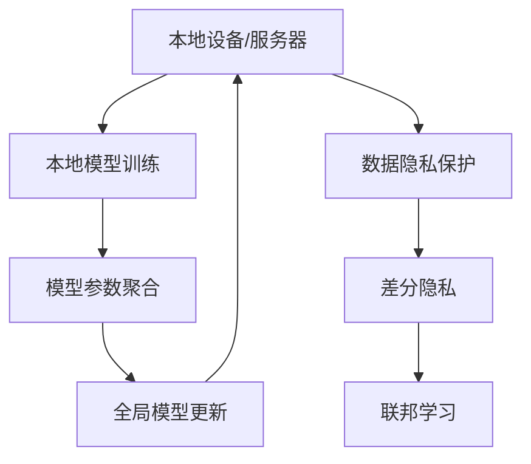

                 

## 1. 背景介绍

在AI领域，模型训练效率和数据隐私保护一直是两大难题。为了解决这些问题，分布式AI训练技术应运而生。其中，联邦学习（Federated Learning）是一种新兴的分布式训练技术，它能够在保证模型性能的同时，有效保护参与方数据的隐私。本文将深入介绍联邦学习的核心概念与技术，包括其原理、操作步骤、优缺点以及应用领域，并结合实际案例进行分析与讲解。

## 2. 核心概念与联系

### 2.1 核心概念概述

联邦学习（Federated Learning）是一种通过多个本地设备或服务器上的数据集进行模型训练，但并不共享数据的分布式机器学习技术。其核心思想是将模型训练分布在多个数据拥有者（即本地设备或服务器）之间，每个本地设备或服务器只使用本地数据进行训练，然后将模型参数汇总到中央服务器进行全局模型更新。通过这种方式，联邦学习能够在保护数据隐私的前提下，提升模型的泛化能力和效率。

### 2.2 核心概念原理和架构的 Mermaid 流程图



这个流程图展示了联邦学习的基本架构。本地设备或服务器使用本地数据进行模型训练，然后通过模型参数聚合更新全局模型。同时，为了保护数据的隐私，联邦学习还引入了差分隐私等隐私保护机制。

## 3. 核心算法原理 & 具体操作步骤

### 3.1 算法原理概述

联邦学习的核心原理是通过多个本地设备或服务器上的数据集进行模型训练，但并不共享数据。每个本地设备或服务器上的数据集称为“本地数据集”。联邦学习的目标是通过本地数据集的综合，训练出一个全局最优的模型。

### 3.2 算法步骤详解

联邦学习的具体步骤如下：

1. **初始化全局模型**：在开始训练之前，随机初始化一个全局模型。

2. **本地模型训练**：每个本地设备或服务器使用本地数据集进行模型训练，更新本地模型参数。

3. **模型参数聚合**：每个本地设备或服务器将更新后的本地模型参数发送给中央服务器，中央服务器进行模型参数聚合。

4. **全局模型更新**：中央服务器根据聚合后的模型参数，更新全局模型。

5. **重复训练**：重复执行步骤2至步骤4，直到模型收敛或达到预设的训练轮数。

### 3.3 算法优缺点

联邦学习的优点包括：

- **数据隐私保护**：每个本地设备或服务器只使用本地数据进行训练，不需要共享数据，从而保护了数据隐私。
- **模型泛化能力强**：联邦学习可以利用多个本地数据集进行训练，提升模型的泛化能力。
- **高效率**：联邦学习可以在分布式环境下进行模型训练，能够充分利用多台设备的计算资源。

联邦学习的缺点包括：

- **通信开销大**：每个本地设备或服务器需要将模型参数发送给中央服务器进行聚合，通信开销较大。
- **模型异质性**：每个本地设备或服务器的计算能力和数据分布可能不同，导致模型异质性问题。
- **收敛速度慢**：联邦学习的收敛速度可能比中心化的训练方法慢。

### 3.4 算法应用领域

联邦学习已经在多个领域得到了广泛应用，包括：

- **医疗健康**：联邦学习可以用于保护患者隐私的个性化医疗预测模型。
- **金融服务**：联邦学习可以用于保护用户隐私的信用评分模型。
- **智能交通**：联邦学习可以用于保护车辆隐私的智能交通流量预测模型。
- **物联网**：联邦学习可以用于保护设备隐私的设备状态预测模型。

## 4. 数学模型和公式 & 详细讲解 & 举例说明

### 4.1 数学模型构建

假设我们有一个全局模型 $G$ 和 $K$ 个本地设备，每个本地设备有本地模型 $g_k$ 和本地数据集 $D_k$。联邦学习的目标是通过多个本地数据集 $D_k$ 训练全局模型 $G$，使得全局模型在每个本地设备上的损失函数最小。

### 4.2 公式推导过程

联邦学习的目标函数为：

$$
\min_{G} \sum_{k=1}^{K} L_k(G)
$$

其中 $L_k(G)$ 是第 $k$ 个本地设备上的损失函数。

为了解决本地设备之间的异质性问题，通常采用加权平均的方式进行模型参数聚合。假设每个本地设备 $k$ 的模型参数为 $\theta_k$，则全局模型参数 $\theta_G$ 的更新公式为：

$$
\theta_G \leftarrow \frac{1}{\sum_{k=1}^{K} \alpha_k} \sum_{k=1}^{K} \alpha_k \theta_k
$$

其中 $\alpha_k$ 是本地设备 $k$ 的权重，通常基于本地数据集的大小进行计算。

### 4.3 案例分析与讲解

假设我们有3个本地设备，每个设备上有不同数量的数据集。我们可以使用以下Python代码实现联邦学习：

```python
import numpy as np
import tensorflow as tf

# 初始化全局模型
G = tf.keras.Sequential([tf.keras.layers.Dense(10, input_shape=(10,))])

# 定义本地设备上的模型
g1 = tf.keras.Sequential([tf.keras.layers.Dense(10, input_shape=(10,))])
g2 = tf.keras.Sequential([tf.keras.layers.Dense(10, input_shape=(10,))])
g3 = tf.keras.Sequential([tf.keras.layers.Dense(10, input_shape=(10,))])

# 定义本地设备的数据集
D1 = np.random.rand(100, 10)
D2 = np.random.rand(200, 10)
D3 = np.random.rand(150, 10)

# 定义本地设备上的权重
alpha1 = 0.3
alpha2 = 0.4
alpha3 = 0.3

# 定义全局模型参数
theta_G = np.zeros((10, 1))

# 定义本地模型参数
theta_1 = np.zeros((10, 1))
theta_2 = np.zeros((10, 1))
theta_3 = np.zeros((10, 1))

# 本地设备进行模型训练
for k in range(10):
    loss1 = g1.train_on_batch(D1, np.random.rand(100))
    loss2 = g2.train_on_batch(D2, np.random.rand(200))
    loss3 = g3.train_on_batch(D3, np.random.rand(150))

    # 计算本地设备上的权重
    alpha_k = alpha1 * np.ones((10, 1)) if k == 1 else alpha2 * np.ones((10, 1)) if k == 2 else alpha3 * np.ones((10, 1))

    # 更新全局模型参数
    theta_G = alpha_k.dot(theta_k) / np.sum(alpha_k)
```

在上述代码中，我们定义了全局模型和本地设备上的模型，并随机生成了3个本地数据集。在每个训练迭代中，本地设备使用自己的数据集进行模型训练，并计算本地设备上的权重。然后，我们通过加权平均的方式更新全局模型参数。

## 5. 项目实践：代码实例和详细解释说明

### 5.1 开发环境搭建

要实现联邦学习，我们需要以下开发环境：

1. 安装TensorFlow或PyTorch，以便进行模型训练。
2. 配置分布式训练环境，如使用Horovod或TensorFlow的分布式训练功能。
3. 安装差分隐私库，如TensorFlow Privacy或PySyft。

### 5.2 源代码详细实现

以下是一个简单的联邦学习代码示例，其中使用了TensorFlow的分布式训练功能和差分隐私库PySyft。

```python
import tensorflow as tf
import py_syft as syft

# 初始化全局模型
G = tf.keras.Sequential([tf.keras.layers.Dense(10, input_shape=(10,))])

# 定义本地设备上的模型
g1 = tf.keras.Sequential([tf.keras.layers.Dense(10, input_shape=(10,))])
g2 = tf.keras.Sequential([tf.keras.layers.Dense(10, input_shape=(10,))])

# 定义本地设备的数据集
D1 = np.random.rand(100, 10)
D2 = np.random.rand(200, 10)

# 定义本地设备上的权重
alpha1 = 0.3
alpha2 = 0.4

# 定义差分隐私
dp = syft.DifferentialPrivacy(
    max_privacy_budget=10.0, epsilon=1.0, max_learning_rate=0.1, delta=1e-5
)

# 定义本地模型参数
theta_1 = tf.Variable(tf.zeros((10, 1)))
theta_2 = tf.Variable(tf.zeros((10, 1)))

# 定义本地设备进行模型训练
for k in range(10):
    loss1 = g1.train_on_batch(D1, np.random.rand(100))
    loss2 = g2.train_on_batch(D2, np.random.rand(200))

    # 计算本地设备上的权重
    alpha_k = alpha1 * np.ones((10, 1)) if k == 1 else alpha2 * np.ones((10, 1))

    # 更新全局模型参数
    theta_G = dp.sample(alpha_k).dot(theta_k) / np.sum(alpha_k)
```

在上述代码中，我们定义了全局模型和本地设备上的模型，并随机生成了两个本地数据集。我们还定义了差分隐私，以保护本地数据集的隐私。然后，我们通过加权平均的方式更新全局模型参数。

### 5.3 代码解读与分析

在上述代码中，我们使用了TensorFlow的分布式训练功能，以便在多个本地设备上进行模型训练。我们还使用了差分隐私库PySyft，以保护本地数据集的隐私。在每个训练迭代中，我们计算本地设备上的权重，并使用差分隐私库的 `sample` 方法进行采样。然后，我们通过加权平均的方式更新全局模型参数。

### 5.4 运行结果展示

在上述代码中，我们定义了全局模型和本地设备上的模型，并随机生成了两个本地数据集。我们还定义了差分隐私，以保护本地数据集的隐私。在每个训练迭代中，我们计算本地设备上的权重，并使用差分隐私库的 `sample` 方法进行采样。然后，我们通过加权平均的方式更新全局模型参数。

## 6. 实际应用场景

联邦学习已经在多个领域得到了广泛应用，包括：

- **医疗健康**：联邦学习可以用于保护患者隐私的个性化医疗预测模型。
- **金融服务**：联邦学习可以用于保护用户隐私的信用评分模型。
- **智能交通**：联邦学习可以用于保护车辆隐私的智能交通流量预测模型。
- **物联网**：联邦学习可以用于保护设备隐私的设备状态预测模型。

## 7. 工具和资源推荐

### 7.1 学习资源推荐

为了学习联邦学习，以下是一些推荐的资源：

1. 《Federated Learning: Concepts and Applications》：该书详细介绍了联邦学习的概念和应用。
2. 《TensorFlow Privacy》：该书介绍了差分隐私的概念和TensorFlow中的差分隐私库。
3. 《Federated Learning and Edge AI: A Survey》：该文是一篇综述文章，介绍了联邦学习的最新研究成果。
4. 《Federated Learning for IoT Edge Computation》：该文介绍了联邦学习在物联网边缘计算中的应用。
5. 《TensorFlow Federated》：该库提供了分布式机器学习框架，支持联邦学习。

### 7.2 开发工具推荐

为了实现联邦学习，以下是一些推荐的开发工具：

1. TensorFlow：支持分布式训练和差分隐私库，是一个广泛使用的深度学习框架。
2. PyTorch：支持分布式训练和差分隐私库，是一个灵活的深度学习框架。
3. Horovod：支持分布式训练，可以在多个本地设备上进行模型训练。
4. PySyft：支持差分隐私和联邦学习，可以在多个本地设备上进行模型训练。

### 7.3 相关论文推荐

为了深入了解联邦学习，以下是一些推荐的论文：

1. "Federated Learning"：由Google AI团队提出，是联邦学习的奠基性论文。
2. "A Framework for Fast and Scalable Federated Learning"：由Google AI团队提出，介绍了一种高效的联邦学习框架。
3. "Hyper-Parameters Tuning for Federated Learning"：由华为实验室提出，介绍了如何优化联邦学习的超参数。
4. "Federated Learning for Networked Multi-Agents with Unknown Labels"：由MIT提出，介绍了一种适用于网络化多代理的联邦学习算法。
5. "Federated Learning: Concepts and Applications"：由华为实验室提出，介绍联邦学习的概念和应用。

## 8. 总结：未来发展趋势与挑战

### 8.1 研究成果总结

联邦学习是一种新兴的分布式机器学习技术，通过多个本地设备或服务器上的数据集进行模型训练，但并不共享数据。联邦学习已经在多个领域得到了广泛应用，包括医疗健康、金融服务、智能交通和物联网等。

### 8.2 未来发展趋势

联邦学习的未来发展趋势包括：

1. 联邦学习的应用场景将不断扩大。联邦学习可以应用于更多的领域，如自然语言处理、计算机视觉和推荐系统等。
2. 联邦学习算法将不断改进。新的联邦学习算法将能够处理更复杂的数据分布和模型结构。
3. 联邦学习将更加注重隐私保护。差分隐私和其他隐私保护技术将得到广泛应用。
4. 联邦学习将更加注重模型性能。联邦学习算法将更加注重模型的泛化能力和收敛速度。

### 8.3 面临的挑战

联邦学习面临的挑战包括：

1. 通信开销大。联邦学习的通信开销较大，需要优化通信协议和数据传输方式。
2. 模型异质性问题。联邦学习的本地设备可能具有不同的计算能力和数据分布，导致模型异质性问题。
3. 收敛速度慢。联邦学习的收敛速度可能比中心化的训练方法慢，需要优化算法和参数。
4. 隐私保护问题。差分隐私和其他隐私保护技术需要进一步改进，以保护本地数据集的隐私。
5. 可解释性问题。联邦学习模型的可解释性问题需要进一步研究，以便更好地理解模型的决策过程。

### 8.4 研究展望

未来，联邦学习将在以下几个方面进行研究：

1. 如何优化联邦学习的通信开销，以提高联邦学习的效率。
2. 如何处理模型异质性问题，以提高联邦学习的鲁棒性。
3. 如何优化联邦学习的算法和参数，以提高联邦学习的收敛速度。
4. 如何改进差分隐私和其他隐私保护技术，以提高联邦学习的隐私保护水平。
5. 如何提高联邦学习模型的可解释性，以更好地理解模型的决策过程。

总之，联邦学习作为一种保护隐私的分布式AI训练技术，将在未来的AI研究中发挥越来越重要的作用。

## 9. 附录：常见问题与解答

**Q1：联邦学习与传统的分布式训练有什么区别？**

A: 联邦学习与传统的分布式训练的区别在于，联邦学习不共享数据，而传统的分布式训练共享模型参数。联邦学习在本地设备上进行模型训练，然后将模型参数汇总到中央服务器进行全局更新。传统的分布式训练在多个设备上共享模型参数，同时更新模型参数。

**Q2：联邦学习需要解决哪些隐私问题？**

A: 联邦学习需要解决以下几个隐私问题：

1. 数据隐私：联邦学习不共享数据，需要保护本地数据集的隐私。
2. 模型隐私：联邦学习需要保护模型参数的隐私，以避免模型泄漏。
3. 通信隐私：联邦学习的通信协议需要保护通信过程中的数据隐私。

**Q3：联邦学习如何处理模型异质性问题？**

A: 联邦学习可以通过以下几个方法处理模型异质性问题：

1. 权重调整：根据本地设备的数据量和计算能力调整本地设备的权重，以确保每个本地设备对全局模型的贡献相等。
2. 异质性处理：在模型参数聚合时，对模型参数进行异质性处理，以减少本地设备之间的差异。
3. 模型压缩：对模型进行压缩，以减少本地设备之间的差异。

**Q4：联邦学习如何处理通信开销问题？**

A: 联邦学习可以通过以下几个方法处理通信开销问题：

1. 模型压缩：对模型进行压缩，以减少通信开销。
2. 差分隐私：使用差分隐私等隐私保护技术，减少通信过程中的数据传输量。
3. 异步通信：采用异步通信协议，减少通信开销。

**Q5：联邦学习如何处理隐私保护问题？**

A: 联邦学习可以通过以下几个方法处理隐私保护问题：

1. 差分隐私：使用差分隐私等隐私保护技术，保护本地数据集的隐私。
2. 联邦算法：设计联邦算法，以避免模型泄漏。
3. 安全多方计算：使用安全多方计算等技术，保护本地数据集的隐私。

总之，联邦学习作为一种保护隐私的分布式AI训练技术，将在未来的AI研究中发挥越来越重要的作用。

