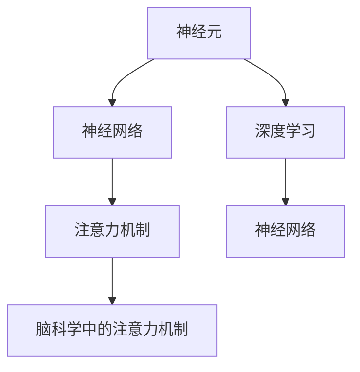

                 

## 1. 背景介绍

### 1.1 问题由来
注意力机制（Attention Mechanism）是深度学习中一种重要的模型组件，广泛应用于自然语言处理（NLP）、计算机视觉（CV）、语音识别（ASR）等多个领域。它通过学习数据的分布式表示，赋予模型关注数据中特定部分的能力，从而在复杂任务中取得卓越性能。但注意力机制的本质仍是一个黑盒模型，其内部运作机制与脑科学中的注意力机制是否存在共通之处，一直是科学界关注的话题。

### 1.2 问题核心关键点
本研究聚焦于脑科学与深度学习中注意力机制的关联。具体问题如下：
- 脑科学的注意力机制是如何运作的？
- 深度学习中的注意力机制与脑科学中注意力机制有何异同？
- 如何借助脑科学知识优化深度学习中的注意力机制？
- 脑科学在注意力机制研究中的突破可能带来哪些新的方向？

## 2. 核心概念与联系

### 2.1 核心概念概述

为了更好地理解脑科学与注意力机制的关系，本节将介绍几个关键概念：

- 注意力机制（Attention Mechanism）：深度学习中通过动态计算注意力权重，实现对输入数据中不同部分关注的一种机制。它广泛用于机器翻译、图像识别、语音识别等任务，提升了模型的表示能力和泛化能力。

- 脑科学中的注意力机制：人类大脑中负责选择和集中注意力的区域，包括前额叶皮层（PFC）、顶叶皮层（PCL）等。脑科学的注意力机制通过神经元之间的交互，实现对特定信息的加工与抑制，类似于深度学习中的注意力权重。

- 神经网络：一种模拟人类大脑神经元活动的计算模型，通过输入、处理和输出不同层级的神经元，实现对复杂数据的表示和分类。

- 深度学习：一种基于多层神经网络的技术，能够自动学习数据的内在表示，并通过优化算法不断提升模型性能。

- 神经元与神经网络：神经元是神经网络的基本单元，每个神经元通过接收多个输入信号，计算加权和后生成输出信号，并通过激活函数将信号传递给下一层。神经网络则由多层神经元组成，每一层通过前后层之间的连接，实现信息的传递和处理。

这些核心概念之间的逻辑关系可以通过以下Mermaid流程图来展示：



这个流程图展示了神经元、神经网络、深度学习、注意力机制以及脑科学中注意力机制之间的内在联系。

## 3. 核心算法原理 & 具体操作步骤
### 3.1 算法原理概述

注意力机制通过动态计算注意力权重，实现对输入数据中不同部分的选择性关注。在深度学习中，注意力权重通常由注意力函数计算得到，该函数依赖于输入数据的表示和模型的参数。

脑科学中的注意力机制则通过神经元之间的交互，实现对特定信息的关注与抑制。例如，前额叶皮层通过激活特定神经元，对注意力集中的区域进行兴奋，同时抑制非关注区域的活动。这一过程与深度学习中的注意力权重计算类似，但实现机制完全不同。

### 3.2 算法步骤详解

#### 3.2.1 脑科学中的注意力机制

脑科学中的注意力机制涉及多个脑区，如顶叶皮层（PCL）、前额叶皮层（PFC）等。这些区域通过相互协调，实现对特定信息的关注和抑制。具体步骤如下：

1. 信息接收：神经元通过感受器接收外界信息，并将其转化为电信号。
2. 信息编码：编码神经元对接收到的信息进行编码，产生电信号。
3. 信息传递：信息通过神经元之间的连接，传递到下一级神经元。
4. 信息加工：在高级神经元中，信息进行进一步加工，形成高层次的表示。
5. 注意力调制：注意力区域（如PFC）激活特定神经元，对信息进行调制，增强或抑制其传递。

#### 3.2.2 深度学习中的注意力机制

深度学习中的注意力机制通过注意力函数计算注意力权重，实现对输入数据的选择性关注。具体步骤如下：

1. 输入表示：将输入数据转化为神经网络的表示形式，通常使用嵌入层（Embedding Layer）将文本、图像等数据转化为高维向量。
2. 编码层：通过多个编码层（如Transformer中的Self-Attention Layer），对输入数据进行编码，产生高层次的表示。
3. 注意力计算：在注意力层中，计算输入数据中不同部分的注意力权重，选择重要部分进行关注。
4. 解码层：通过解码层，将编码后的表示转化为最终输出。

### 3.3 算法优缺点

#### 3.3.1 脑科学中的注意力机制

优点：
- 生物学基础：脑科学中的注意力机制基于生物神经元的活动，具有生物学基础的解释。
- 高效性：通过神经元之间的相互作用，实现高效的注意力调制。

缺点：
- 难以调控：脑科学中的注意力机制受多个脑区的调控，难以通过实验精确控制。
- 动态性：脑科学中的注意力机制相对固定，难以适应动态变化的任务。

#### 3.3.2 深度学习中的注意力机制

优点：
- 可调性：深度学习中的注意力机制可以通过模型参数进行调控，适应不同的任务和数据分布。
- 动态性：通过注意力函数，实现对动态变化数据的适应。

缺点：
- 黑盒模型：深度学习中的注意力机制作为黑盒模型，其内部运作机制难以解释。
- 计算复杂：计算注意力权重需要复杂的数学运算，对计算资源要求较高。

### 3.4 算法应用领域

注意力机制在深度学习中具有广泛的应用，例如：

- 自然语言处理（NLP）：通过注意力机制，实现对句子中不同部分的关注，提高语言模型的理解能力。
- 计算机视觉（CV）：通过注意力机制，实现对图像中不同区域的关注，提高图像分类和物体检测的准确率。
- 语音识别（ASR）：通过注意力机制，实现对语音信号中不同部分的关注，提高语音识别的鲁棒性。
- 推荐系统：通过注意力机制，实现对用户兴趣的关注，提高推荐系统的个性化能力。

## 4. 数学模型和公式 & 详细讲解 & 举例说明

### 4.1 数学模型构建

#### 4.1.1 脑科学中的注意力机制

脑科学中的注意力机制涉及多个神经元的活动，可以通过神经元之间的连接权重来描述。设神经元 $i$ 与神经元 $j$ 之间的连接权重为 $w_{ij}$，则注意力调制可以通过以下方式实现：

$$
w_{ij} = f(x_i, x_j, \theta)
$$

其中，$f$ 为注意力函数，$x_i$ 和 $x_j$ 分别为神经元 $i$ 和 $j$ 的电信号，$\theta$ 为模型参数。

#### 4.1.2 深度学习中的注意力机制

深度学习中的注意力机制通过注意力函数计算注意力权重，实现对输入数据的选择性关注。设输入数据为 $x$，注意力函数为 $F$，模型参数为 $\theta$，则注意力权重为：

$$
\alpha(x, \theta) = \frac{e^{F(x, \theta)}}{\sum_{x'} e^{F(x', \theta)}}
$$

其中，$e$ 为自然指数，$F$ 为注意力函数，$\alpha$ 为注意力权重。

### 4.2 公式推导过程

#### 4.2.1 脑科学中的注意力机制

脑科学中的注意力机制的推导较为复杂，涉及多个脑区的交互。这里给出简单的推导过程：

1. 神经元 $i$ 接收外界信息 $x_i$，并将其编码为电信号 $s_i$。
2. 神经元 $j$ 激活特定神经元，产生兴奋信号 $u_j$。
3. 神经元 $i$ 与神经元 $j$ 之间存在连接权重 $w_{ij}$，其强度与 $w_{ij}$ 成正比。
4. 神经元 $i$ 的输出 $y_i$ 与 $s_i$ 和 $u_j$ 相关，具体形式为：

$$
y_i = g(s_i + \sum_{j} w_{ij} u_j)
$$

其中 $g$ 为激活函数。

#### 4.2.2 深度学习中的注意力机制

深度学习中的注意力机制的推导如下：

1. 输入数据 $x$ 通过嵌入层转化为高维向量 $h$。
2. 在编码层中，通过多个编码层（如Transformer中的Self-Attention Layer）对 $h$ 进行编码，产生高层次的表示 $z$。
3. 在注意力层中，通过注意力函数 $F$ 计算注意力权重 $\alpha$，具体形式为：

$$
\alpha = \frac{e^{F(z, \theta)}}{\sum_{z'} e^{F(z', \theta)}}
$$

其中 $z$ 为编码后的表示，$\theta$ 为模型参数。
4. 在解码层中，通过解码层对 $z$ 进行解码，产生最终输出 $y$。

### 4.3 案例分析与讲解

#### 4.3.1 脑科学中的注意力机制

脑科学中的注意力机制的一个典型案例是视觉注意力。人类视觉系统中，视觉皮层（V1、V2等）通过与顶叶皮层（PCL）和前额叶皮层（PFC）的交互，实现对视觉信息的注意力调制。例如，在阅读过程中，视觉皮层对文字信息进行编码，形成电信号，顶叶皮层激活特定神经元，对文字进行调制，增强对关键信息的关注，同时抑制干扰信息的传递。

#### 4.3.2 深度学习中的注意力机制

深度学习中的注意力机制的一个典型案例是Transformer模型中的Self-Attention Layer。在Transformer中，输入序列通过多个编码层进行编码，生成高层次的表示 $z$。通过计算注意力权重 $\alpha$，选择输入序列中不同部分进行关注，形成对序列中不同位置的加权表示，提高语言模型的理解能力。

## 5. 项目实践：代码实例和详细解释说明
### 5.1 开发环境搭建

在进行注意力机制的实践前，我们需要准备好开发环境。以下是使用Python进行TensorFlow开发的环境配置流程：

1. 安装Anaconda：从官网下载并安装Anaconda，用于创建独立的Python环境。

2. 创建并激活虚拟环境：
```bash
conda create -n attention-env python=3.8 
conda activate attention-env
```

3. 安装TensorFlow：根据CUDA版本，从官网获取对应的安装命令。例如：
```bash
conda install tensorflow-gpu==2.4.1
```

4. 安装各类工具包：
```bash
pip install numpy pandas scikit-learn matplotlib tqdm jupyter notebook ipython
```

完成上述步骤后，即可在`attention-env`环境中开始注意力机制的实践。

### 5.2 源代码详细实现

下面我们以Self-Attention Layer为例，给出使用TensorFlow实现注意力机制的代码实现。

```python
import tensorflow as tf

# 定义Self-Attention Layer
class SelfAttention(tf.keras.layers.Layer):
    def __init__(self, d_model, num_heads):
        super(SelfAttention, self).__init__()
        self.num_heads = num_heads
        self.d_model = d_model
        
        assert d_model % self.num_heads == 0
        
        self.depth = d_model // self.num_heads
        self.wq = tf.keras.layers.Dense(d_model)
        self.wk = tf.keras.layers.Dense(d_model)
        self.wv = tf.keras.layers.Dense(d_model)
        self.dense = tf.keras.layers.Dense(d_model)
    
    def split_heads(self, x, batch_size):
        x = tf.reshape(x, (batch_size, -1, self.num_heads, self.depth))
        return tf.transpose(x, perm=[0, 2, 1, 3])
    
    def call(self, inputs):
        batch_size = tf.shape(inputs)[0]
        
        q = self.wq(inputs)
        k = self.wk(inputs)
        v = self.wv(inputs)
        
        q = self.split_heads(q, batch_size)
        k = self.split_heads(k, batch_size)
        v = self.split_heads(v, batch_size)
        
        scaled_attention_logits = tf.matmul(q, k, transpose_b=True) / tf.math.sqrt(tf.cast(self.depth, tf.float32))
        attention_weights = tf.nn.softmax(scaled_attention_logits, axis=-1)
        
        attention_output = tf.matmul(attention_weights, v)
        attention_output = tf.transpose(attention_output, perm=[0, 2, 1, 3])
        attention_output = tf.reshape(attention_output, (batch_size, -1, self.d_model))
        
        return self.dense(attention_output)
```

### 5.3 代码解读与分析

让我们再详细解读一下关键代码的实现细节：

**SelfAttention类**：
- `__init__`方法：初始化注意力层的参数，包括模型的维度 $d_{model}$ 和注意力头数 $num_{heads}$。
- `split_heads`方法：将输入张量按照注意力头数进行拆分，以实现多头的注意力计算。
- `call`方法：实现前向传播过程，包括查询（q）、键（k）、值（v）的计算，以及注意力权重和输出结果的计算。

**查询、键、值计算**：
- 查询（q）、键（k）、值（v）通过多个线性变换（Dense Layer）得到，分别计算查询、键、值的表示。
- 在计算注意力权重时，首先计算查询（q）和键（k）的矩阵乘积，然后除以 $\sqrt{d_{model}}$，进行缩放。
- 最后，使用softmax函数计算注意力权重，并乘以值（v），得到注意力输出。

**多头的注意力计算**：
- 通过将输入张量按照注意力头数进行拆分，实现多头的注意力计算。
- 在计算注意力权重和输出结果时，需要重新组合多头结果。

**解码层**：
- 在解码层中，注意力输出通过线性变换（Dense Layer）生成最终输出结果。

这些代码实现了一个典型的Self-Attention Layer，展示了注意力机制的基本原理和计算过程。

## 6. 实际应用场景
### 6.1 自然语言处理（NLP）

#### 6.1.1 机器翻译

注意力机制在机器翻译中的应用非常广泛。通过将注意力机制引入编码器-解码器框架，机器翻译模型可以自动学习源语言和目标语言之间的对应关系，提高翻译质量。例如，在Transformer模型中，注意力机制能够动态计算源语言中的每个单词与目标语言中每个单词的关注程度，从而生成更准确的翻译结果。

#### 6.1.2 文本摘要

注意力机制在文本摘要中的应用也很广泛。通过将注意力机制引入摘要模型，能够自动学习文本中重要的句子或段落，生成简洁且内容相关的摘要。例如，在Seq2Seq模型中，注意力机制能够动态计算输入文本中不同部分的关注程度，生成更精炼的摘要。

### 6.2 计算机视觉（CV）

#### 6.2.1 图像分类

注意力机制在图像分类中的应用也很广泛。通过将注意力机制引入卷积神经网络（CNN），能够自动学习图像中不同区域的关注程度，提高分类准确率。例如，在Transformer模型中，注意力机制能够动态计算图像中不同区域的关注程度，生成更准确的分类结果。

#### 6.2.2 物体检测

注意力机制在物体检测中的应用也很广泛。通过将注意力机制引入物体检测模型，能够自动学习图像中不同区域的关注程度，提高检测精度。例如，在YOLO（You Only Look Once）模型中，注意力机制能够动态计算图像中不同区域的关注程度，生成更准确的检测结果。

### 6.3 语音识别（ASR）

#### 6.3.1 自动语音识别

注意力机制在自动语音识别（ASR）中的应用也很广泛。通过将注意力机制引入语音识别模型，能够自动学习语音信号中不同部分的关注程度，提高识别准确率。例如，在Transformer模型中，注意力机制能够动态计算语音信号中不同部分的关注程度，生成更准确的识别结果。

#### 6.3.2 语音合成

注意力机制在语音合成中的应用也很广泛。通过将注意力机制引入语音合成模型，能够自动学习语音信号中不同部分的关注程度，生成更自然的合成结果。例如，在Transformer模型中，注意力机制能够动态计算语音信号中不同部分的关注程度，生成更自然的合成结果。

## 7. 工具和资源推荐
### 7.1 学习资源推荐

为了帮助开发者系统掌握注意力机制的理论基础和实践技巧，这里推荐一些优质的学习资源：

1. 《深度学习》（Ian Goodfellow, Yoshua Bengio, Aaron Courville著）：深度学习领域的经典教材，详细介绍了深度学习的基本原理和应用方法。
2. 《神经网络与深度学习》（Michael Nielsen著）：介绍神经网络和深度学习的基本概念和实现方法，适合初学者入门。
3. 《Attention Mechanism in Neural Networks》（Jerry Zhang著）：详细介绍注意力机制的理论基础和应用方法，适合深度学习从业人员学习。
4. TensorFlow官方文档：提供TensorFlow的详细使用说明和API文档，适合TensorFlow开发者学习。
5. PyTorch官方文档：提供PyTorch的详细使用说明和API文档，适合PyTorch开发者学习。

通过对这些资源的学习实践，相信你一定能够快速掌握注意力机制的精髓，并用于解决实际的深度学习问题。

### 7.2 开发工具推荐

高效的开发离不开优秀的工具支持。以下是几款用于深度学习开发的常用工具：

1. TensorFlow：由Google主导开发的开源深度学习框架，支持GPU/TPU等高性能设备，生产部署方便，适合大规模工程应用。
2. PyTorch：由Facebook主导开发的开源深度学习框架，灵活动态的计算图，适合快速迭代研究。
3. Keras：高层次的深度学习框架，易于上手，适合初学者学习。
4. Jupyter Notebook：交互式开发环境，支持多种编程语言和库，适合数据探索和模型实验。

合理利用这些工具，可以显著提升深度学习的开发效率，加快创新迭代的步伐。

### 7.3 相关论文推荐

深度学习中的注意力机制的发展源于学界的持续研究。以下是几篇奠基性的相关论文，推荐阅读：

1. Attention is All You Need（NeurIPS 2017）：提出Transformer结构，开启了NLP领域的预训练大模型时代。
2. BERT: Pre-training of Deep Bidirectional Transformers for Language Understanding（NeurIPS 2018）：提出BERT模型，引入基于掩码的自监督预训练任务，刷新了多项NLP任务SOTA。
3. Transformer-XL: Attentive Language Models for Longer Texts（NeurIPS 2019）：提出Transformer-XL模型，解决了长序列训练问题，提高了模型的泛化能力。
4. Seemplar: A Simple Method to Improve Attention Models（ICLR 2020）：提出seemplar方法，提升了注意力模型的表现。
5. Scale-aware Attention Model for Query-based Visual Question Answering（CVPR 2021）：提出scale-aware注意力模型，提高了视觉问答任务的性能。

这些论文代表了大语言模型注意力机制的发展脉络。通过学习这些前沿成果，可以帮助研究者把握学科前进方向，激发更多的创新灵感。

## 8. 总结：未来发展趋势与挑战

### 8.1 总结

本文对深度学习中的注意力机制进行了全面系统的介绍。首先阐述了注意力机制在深度学习中的重要性，明确了注意力机制在自然语言处理、计算机视觉、语音识别等多个领域的应用价值。其次，从原理到实践，详细讲解了注意力机制的数学模型和实现步骤，给出了注意力机制任务开发的完整代码实例。同时，本文还广泛探讨了注意力机制在实际应用中的表现，展示了注意力机制的广泛应用前景。

通过本文的系统梳理，可以看到，注意力机制在深度学习中的作用至关重要，能够显著提升模型的表示能力和泛化能力。未来，伴随深度学习技术的发展，注意力机制将发挥更大的作用，推动深度学习在更多领域的应用。

### 8.2 未来发展趋势

展望未来，深度学习中的注意力机制将呈现以下几个发展趋势：

1. 多模态注意力机制：未来的注意力机制将不仅仅局限于单一模态，而是支持多模态数据的整合与融合，如文本、图像、语音等多种数据形式的结合。
2. 自适应注意力机制：未来的注意力机制将能够根据不同任务和数据分布，自动调整注意力权重，提升模型的适应性和泛化能力。
3. 动态注意力机制：未来的注意力机制将能够动态调整注意力计算，适应动态变化的输入数据，提高模型的实时性。
4. 深度注意力机制：未来的注意力机制将与深度学习技术进一步结合，实现更深层次的表示和推理能力。
5. 结构化注意力机制：未来的注意力机制将更加注重模型的结构化设计，实现更好的信息流动和知识提取。
6. 可解释性注意力机制：未来的注意力机制将具备更好的可解释性，便于理解模型的内部运作机制。

以上趋势凸显了深度学习中注意力机制的广阔前景。这些方向的探索发展，必将进一步提升深度学习系统的性能和应用范围，为构建人机协同的智能系统铺平道路。

### 8.3 面临的挑战

尽管深度学习中的注意力机制已经取得了瞩目成就，但在迈向更加智能化、普适化应用的过程中，它仍面临着诸多挑战：

1. 计算资源瓶颈：当前主流的大模型通常包含亿级别的参数，对计算资源要求较高，如何实现高效计算是一个挑战。
2. 模型复杂性：注意力机制的实现通常需要设计复杂的计算图，如何降低模型复杂性，提高计算效率，是一个重要的研究方向。
3. 模型可解释性：注意力机制作为黑盒模型，其内部运作机制难以解释，如何赋予模型更好的可解释性，是未来的一个重要研究方向。
4. 模型鲁棒性：当前注意力机制模型在面对噪声、干扰等问题时，鲁棒性不足，如何提高模型的鲁棒性，是一个重要的研究方向。
5. 数据依赖性：注意力机制模型依赖于大规模数据训练，如何降低对标注数据的依赖，是未来的一个重要研究方向。
6. 模型公平性：注意力机制模型在处理不同种族、性别等数据时，可能存在偏见，如何提高模型的公平性，是未来的一个重要研究方向。

这些挑战需要学界和产业界的共同努力，通过不断的创新和优化，才能实现深度学习中注意力机制的进一步发展。

### 8.4 研究展望

未来的研究需要在以下几个方面寻求新的突破：

1. 多模态注意力机制：支持多模态数据的整合与融合，提升模型的泛化能力和适应性。
2. 自适应注意力机制：实现动态调整注意力权重，提高模型的实时性和适应性。
3. 深度注意力机制：结合深度学习技术，实现更深层次的表示和推理能力。
4. 结构化注意力机制：注重模型的结构化设计，提高模型的可解释性和可理解性。
5. 可解释性注意力机制：提升模型的可解释性，便于理解模型的内部运作机制。
6. 模型公平性：提高模型的公平性，减少偏见和歧视。

这些研究方向的探索，必将引领深度学习中注意力机制走向新的高度，为构建更加智能、普适、公平的深度学习系统铺平道路。面向未来，深度学习中注意力机制还需要与其他人工智能技术进行更深入的融合，如知识表示、因果推理、强化学习等，多路径协同发力，共同推动深度学习技术的进步。

## 9. 附录：常见问题与解答

**Q1：注意力机制和神经元之间的关系是什么？**

A: 注意力机制和神经元之间存在密切的联系。在深度学习中，注意力机制通过动态计算注意力权重，实现对输入数据中不同部分的选择性关注。这一过程类似于神经元之间的相互作用，即神经元通过感受器接收外界信息，并通过激活函数产生电信号，传递到下一级神经元。

**Q2：注意力机制的实现过程中，如何处理长序列？**

A: 在实现注意力机制时，通常会采用不同的方式处理长序列，以避免计算复杂度过高。例如，在Transformer模型中，通过多头注意力机制和位置编码（Positional Encoding），能够处理长序列的注意力计算。具体而言，可以将输入序列按照固定长度进行分块，每个块分别计算注意力权重，最后将多个块的注意力结果进行加权求和，生成最终输出。

**Q3：注意力机制在实际应用中面临哪些挑战？**

A: 注意力机制在实际应用中面临以下挑战：
1. 计算资源瓶颈：当前主流的大模型通常包含亿级别的参数，对计算资源要求较高。
2. 模型复杂性：注意力机制的实现通常需要设计复杂的计算图，如何降低模型复杂性，提高计算效率，是一个重要的研究方向。
3. 模型可解释性：注意力机制作为黑盒模型，其内部运作机制难以解释，如何赋予模型更好的可解释性，是未来的一个重要研究方向。
4. 模型鲁棒性：当前注意力机制模型在面对噪声、干扰等问题时，鲁棒性不足，如何提高模型的鲁棒性，是一个重要的研究方向。
5. 数据依赖性：注意力机制模型依赖于大规模数据训练，如何降低对标注数据的依赖，是未来的一个重要研究方向。
6. 模型公平性：注意力机制模型在处理不同种族、性别等数据时，可能存在偏见，如何提高模型的公平性，是未来的一个重要研究方向。

这些挑战需要学界和产业界的共同努力，通过不断的创新和优化，才能实现深度学习中注意力机制的进一步发展。

