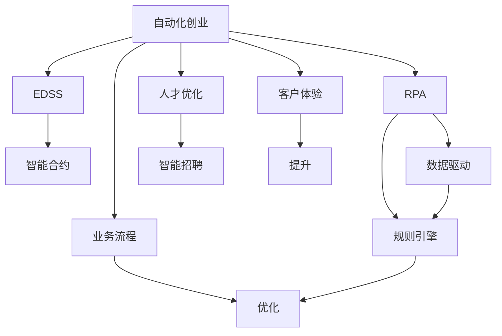

                 

# 自动化创业中的人机协作

> 关键词：自动化创业, 人机协作, 人工智能, 机器学习, 机器人流程自动化(RPA), 增强型决策支持系统, 自动化流程, 智能合约

## 1. 背景介绍

### 1.1 问题由来
随着人工智能(AI)技术的飞速发展，自动化创业成为互联网时代的重要趋势。在传统业务流程中引入AI和机器学习(Machine Learning, ML)技术，可以大幅度提升效率，降低成本，推动创新。然而，过度依赖机器的自动化系统也带来了一定的挑战，如系统的鲁棒性、可解释性、以及人机协作的协调性。本文将探讨在自动化创业中，如何高效协同人机系统，提升系统的智能化水平。

### 1.2 问题核心关键点
自动化创业的核心关键点在于：
- 如何将人机系统高效协同，提升自动化流程的智能化水平。
- 如何在保证系统鲁棒性和可解释性的同时，引入高效、可扩展的自动化技术。
- 如何利用增强型决策支持系统，提升自动化流程的灵活性和适应性。
- 如何确保自动化系统的安全性、可靠性、透明性，保障业务流程的稳定运行。

### 1.3 问题研究意义
研究自动化创业中的人机协作，对于拓展自动化技术的应用场景，提升业务流程的智能化水平，降低人工干预，推动企业数字化转型，具有重要意义：
- 提高效率：自动化技术可显著提升业务流程的执行速度，减少人工干预，降低成本。
- 降低风险：自动化系统能够实时监控、预警业务风险，提高业务连续性和稳定性。
- 增强创新：AI和ML技术的应用，能够帮助企业识别更多商业机会，创新业务模式。
- 实现智能：通过人机协作，构建智能型自动化流程，提升决策的科学性和精准性。

## 2. 核心概念与联系

### 2.1 核心概念概述

为更好地理解自动化创业中的人机协作，本节将介绍几个密切相关的核心概念：

- 自动化创业(Automated Entrepreneurship)：利用AI和ML技术驱动的创业模式，通过自动化流程优化提升业务效率和竞争力。
- 机器人流程自动化(Robot Process Automation, RPA)：利用软件机器人自动执行重复性、规则性任务，提高业务处理效率。
- 增强型决策支持系统(Enhanced Decision Support System, EDSS)：结合AI和ML技术，提供智能化的决策支持和业务流程优化。
- 智能合约(Smart Contracts)：利用区块链技术，通过代码自动执行、不可篡改的特性，构建可信赖的自动化业务流程。

这些核心概念之间的逻辑关系可以通过以下Mermaid流程图来展示：



这个流程图展示了一系列自动化创业的环节：

1. 自动化创业通过引入RPA和EDSS技术，优化业务流程。
2. RPA利用数据驱动，自动化执行重复性任务。
3. EDSS结合AI和ML技术，提供智能化的决策支持。
4. 智能合约通过区块链技术，实现自动化执行和不可篡改。
5. 自动化创业涉及业务流程的优化和人才招聘的智能化。
6. 客户体验的提升也是自动化创业的重要方面。

这些核心概念共同构成了自动化创业的技术框架，为人机协作提供了坚实的基础。

## 3. 核心算法原理 & 具体操作步骤
### 3.1 算法原理概述

自动化创业中的人机协作，本质上是一个多层次的协同优化过程。其核心思想是：将自动化流程与人工决策相结合，通过智能决策支持系统和AI辅助，最大化提升业务流程的效率和智能化水平。

形式化地，假设一个自动化创业的业务流程为 $P=\{T, M, O, D\}$，其中 $T$ 为任务集，$M$ 为模型集，$O$ 为优化策略集，$D$ 为数据集。人机协作的目标是最大化流程效率 $\mathcal{E}(P)$，即：

$$
\mathcal{E}(P) = \max_{T, M, O, D} \mathcal{E}(P|T, M, O, D)
$$

其中 $\mathcal{E}(P|T, M, O, D)$ 为给定任务、模型、优化策略和数据下流程的效率。

通过协同优化模型和优化策略，最大化业务流程效率 $\mathcal{E}(P)$，可以实现人机协作的最佳效果。

### 3.2 算法步骤详解

自动化创业中的人机协作，主要包括以下几个关键步骤：

**Step 1: 流程识别与自动化**
- 识别业务流程中的重复性、规则性任务，提取关键数据和业务规则。
- 选择合适的自动化技术，如RPA、EDSS等，自动执行这些任务。

**Step 2: 数据整合与清洗**
- 收集和整合业务流程相关的数据，确保数据完整性和一致性。
- 对数据进行清洗和预处理，确保数据质量。

**Step 3: 模型选择与训练**
- 根据业务需求选择合适的模型，如分类模型、回归模型、时序模型等。
- 使用业务数据训练模型，获取模型预测能力。

**Step 4: 决策支持与优化**
- 将模型与决策支持系统集成，提供智能化的决策支持。
- 应用优化策略，提升流程效率，如流程重组、并行处理等。

**Step 5: 系统测试与部署**
- 对自动化流程进行系统测试，确保流程稳定性。
- 部署自动化流程到生产环境，监控运行状态。

**Step 6: 持续监控与优化**
- 实时监控自动化流程的运行情况，及时发现和解决异常问题。
- 根据反馈数据，持续优化流程和模型，提升效率和效果。

以上是自动化创业中人机协作的一般流程。在实际应用中，还需要根据具体业务需求，对各环节进行优化设计，如改进任务识别算法、优化数据预处理流程、设计更灵活的决策支持策略等，以进一步提升系统性能。

### 3.3 算法优缺点

自动化创业中的人机协作方法具有以下优点：
1. 提升效率：通过自动化流程，可以显著提升业务处理速度，减少人工干预，降低成本。
2. 增强稳定性：自动化流程能够实时监控、预警业务风险，提高业务连续性和稳定性。
3. 促进创新：利用AI和ML技术，能够帮助企业识别更多商业机会，创新业务模式。
4. 提高决策科学性：结合EDSS和智能合约，提升决策的科学性和精准性。

同时，该方法也存在一定的局限性：
1. 依赖数据质量：自动化流程的效果很大程度上取决于数据的质量和完整性，数据清洗和预处理环节较为复杂。
2. 技术复杂度高：需要具备较强的技术能力和经验，对系统的鲁棒性、可解释性等要求较高。
3. 人员依赖性强：自动化流程的引入，可能减少部分人员的工作量，但需要人员进行系统维护和监控。
4. 实施成本高：系统开发、部署和维护需要较大的资源投入，适合大规模企业使用。

尽管存在这些局限性，但就目前而言，人机协作方法仍是在自动化创业中应用的主流范式。未来相关研究的重点在于如何进一步降低技术门槛，提高系统的可扩展性和灵活性，同时兼顾可解释性和伦理安全性等因素。

### 3.4 算法应用领域

人机协作方法在自动化创业中已经被广泛应用于多个领域，例如：

- 金融科技：通过自动化流程优化客户服务、风险管理、投资决策等业务。
- 医疗健康：应用自动化系统进行病历管理、诊断辅助、智能问诊等，提升医疗服务效率。
- 零售电商：使用自动化技术进行库存管理、客户服务、推荐系统等，优化销售流程。
- 物流供应链：通过RPA和智能合约，优化物流管理和供应链协同，提升供应链效率。
- 人力资源：利用自动化招聘、绩效评估、员工管理等系统，提升人力资源管理效率。

除了上述这些经典领域外，人机协作方法还被创新性地应用到更多场景中，如智慧城市治理、智能制造、智能安全等，为各行业带来智能化转型的新机遇。

## 4. 数学模型和公式 & 详细讲解 & 举例说明
### 4.1 数学模型构建

本节将使用数学语言对自动化创业中的人机协作过程进行更加严格的刻画。

假设自动化创业的业务流程为 $P=\{T, M, O, D\}$，其中 $T$ 为任务集，$M$ 为模型集，$O$ 为优化策略集，$D$ 为数据集。

定义流程效率 $\mathcal{E}(P)$ 为目标函数，可以通过以下方式进行建模：

$$
\mathcal{E}(P) = \mathcal{E}(T|M,O,D) + \mathcal{E}(M|O,D) + \mathcal{E}(O|D)
$$

其中 $\mathcal{E}(T|M,O,D)$ 为任务流程效率，$\mathcal{E}(M|O,D)$ 为模型效率，$\mathcal{E}(O|D)$ 为优化策略效率。

在任务流程效率 $\mathcal{E}(T|M,O,D)$ 中，引入任务识别算法和RPA技术，通过数据驱动的流程执行，最大化任务执行效率。

在模型效率 $\mathcal{E}(M|O,D)$ 中，通过选择合适的模型和训练数据，最大化模型的预测精度和鲁棒性。

在优化策略效率 $\mathcal{E}(O|D)$ 中，通过策略优化和实时监控，确保流程的高效运行。

### 4.2 公式推导过程

以下我们以金融科技领域中的自动化风险管理系统为例，推导人机协作模型效率的计算公式。

假设风险管理流程的任务集为 $T=\{A,B,C\}$，模型集为 $M=\{C1,C2\}$，优化策略集为 $O=\{S1,S2\}$，数据集为 $D=\{D1,D2\}$。

在任务流程效率 $\mathcal{E}(T|M,O,D)$ 中，引入任务识别算法和RPA技术，最大化任务执行效率。

设任务 $A$ 的识别算法为 $A^{RPA}(x)$，任务 $B$ 的识别算法为 $B^{RPA}(x)$，任务 $C$ 的识别算法为 $C^{RPA}(x)$。

任务 $A$ 的RPA执行效率为 $\mathcal{E}(A|C1,S1,D1)$，任务 $B$ 的RPA执行效率为 $\mathcal{E}(B|C2,S2,D2)$，任务 $C$ 的RPA执行效率为 $\mathcal{E}(C|S1,S2,D1,D2)$。

任务流程效率 $\mathcal{E}(T|M,O,D)$ 可表示为：

$$
\mathcal{E}(T|M,O,D) = \mathcal{E}(A|C1,S1,D1) + \mathcal{E}(B|C2,S2,D2) + \mathcal{E}(C|S1,S2,D1,D2)
$$

在模型效率 $\mathcal{E}(M|O,D)$ 中，通过选择合适的模型和训练数据，最大化模型的预测精度和鲁棒性。

设模型 $C1$ 的训练数据为 $D1$，模型 $C2$ 的训练数据为 $D2$。

模型 $C1$ 的预测精度为 $\mathcal{P}(C1|D1)$，模型 $C2$ 的预测精度为 $\mathcal{P}(C2|D2)$。

模型效率 $\mathcal{E}(M|O,D)$ 可表示为：

$$
\mathcal{E}(M|O,D) = \mathcal{P}(C1|D1) + \mathcal{P}(C2|D2)
$$

在优化策略效率 $\mathcal{E}(O|D)$ 中，通过策略优化和实时监控，确保流程的高效运行。

设优化策略 $S1$ 的监控周期为 $\tau_1$，优化策略 $S2$ 的监控周期为 $\tau_2$。

优化策略效率 $\mathcal{E}(O|D)$ 可表示为：

$$
\mathcal{E}(O|D) = \frac{1}{\tau_1} + \frac{1}{\tau_2}
$$

最终，自动化创业的业务流程效率 $\mathcal{E}(P)$ 可以表示为：

$$
\mathcal{E}(P) = \mathcal{E}(T|M,O,D) + \mathcal{E}(M|O,D) + \mathcal{E}(O|D)
$$

通过最大化流程效率 $\mathcal{E}(P)$，可以实现人机协作的最佳效果。

### 4.3 案例分析与讲解

以一个医疗健康领域的自动化病例管理系统为例，展示人机协作的实际应用。

假设医疗病例管理流程的任务集为 $T=\{E, H, A, R\}$，模型集为 $M=\{D1, D2\}$，优化策略集为 $O=\{S1, S2\}$，数据集为 $D=\{D1, D2\}$。

在任务流程效率 $\mathcal{E}(T|M,O,D)$ 中，引入任务识别算法和RPA技术，最大化任务执行效率。

设任务 $E$ 的识别算法为 $E^{RPA}(x)$，任务 $H$ 的识别算法为 $H^{RPA}(x)$，任务 $A$ 的识别算法为 $A^{RPA}(x)$，任务 $R$ 的识别算法为 $R^{RPA}(x)$。

任务 $E$ 的RPA执行效率为 $\mathcal{E}(E|D1,S1)$，任务 $H$ 的RPA执行效率为 $\mathcal{E}(H|D2,S2)$，任务 $A$ 的RPA执行效率为 $\mathcal{E}(A|S1,S2)$，任务 $R$ 的RPA执行效率为 $\mathcal{E}(R|S1,S2)$。

任务流程效率 $\mathcal{E}(T|M,O,D)$ 可表示为：

$$
\mathcal{E}(T|M,O,D) = \mathcal{E}(E|D1,S1) + \mathcal{E}(H|D2,S2) + \mathcal{E}(A|S1,S2) + \mathcal{E}(R|S1,S2)
$$

在模型效率 $\mathcal{E}(M|O,D)$ 中，通过选择合适的模型和训练数据，最大化模型的预测精度和鲁棒性。

设模型 $D1$ 的训练数据为 $D1$，模型 $D2$ 的训练数据为 $D2$。

模型 $D1$ 的预测精度为 $\mathcal{P}(D1|D1)$，模型 $D2$ 的预测精度为 $\mathcal{P}(D2|D2)$。

模型效率 $\mathcal{E}(M|O,D)$ 可表示为：

$$
\mathcal{E}(M|O,D) = \mathcal{P}(D1|D1) + \mathcal{P}(D2|D2)
$$

在优化策略效率 $\mathcal{E}(O|D)$ 中，通过策略优化和实时监控，确保流程的高效运行。

设优化策略 $S1$ 的监控周期为 $\tau_1$，优化策略 $S2$ 的监控周期为 $\tau_2$。

优化策略效率 $\mathcal{E}(O|D)$ 可表示为：

$$
\mathcal{E}(O|D) = \frac{1}{\tau_1} + \frac{1}{\tau_2}
$$

最终，医疗健康领域的自动化病例管理系统效率 $\mathcal{E}(P)$ 可以表示为：

$$
\mathcal{E}(P) = \mathcal{E}(T|M,O,D) + \mathcal{E}(M|O,D) + \mathcal{E}(O|D)
$$

通过最大化流程效率 $\mathcal{E}(P)$，可以实现人机协作的最佳效果。

## 5. 项目实践：代码实例和详细解释说明
### 5.1 开发环境搭建

在进行人机协作系统开发前，我们需要准备好开发环境。以下是使用Python进行PyTorch开发的环境配置流程：

1. 安装Anaconda：从官网下载并安装Anaconda，用于创建独立的Python环境。

2. 创建并激活虚拟环境：
```bash
conda create -n pytorch-env python=3.8 
conda activate pytorch-env
```

3. 安装PyTorch：根据CUDA版本，从官网获取对应的安装命令。例如：
```bash
conda install pytorch torchvision torchaudio cudatoolkit=11.1 -c pytorch -c conda-forge
```

4. 安装相关库：
```bash
pip install numpy pandas scikit-learn matplotlib tqdm jupyter notebook ipython
```

5. 安装RPA库：
```bash
pip install pyautoit pyautogui
```

完成上述步骤后，即可在`pytorch-env`环境中开始人机协作系统的开发。

### 5.2 源代码详细实现

这里我们以一个简单的金融风险管理项目为例，展示如何利用RPA和EDSS进行人机协作。

首先，定义RPA任务的识别函数：

```python
from pyautogui import locateOnScreen, pixel

def rpa_task_recognition(image_path):
    task_location = locateOnScreen(image_path)
    if task_location is not None:
        task_x, task_y = task_location.left, task_location.top
        task_width, task_height = task_location.width, task_height
        return task_x, task_y, task_width, task_height
    else:
        return None, None, None, None
```

然后，定义EDSS的模型训练和预测函数：

```python
import numpy as np
from sklearn.linear_model import LogisticRegression

class EDSS:
    def __init__(self):
        self.model = LogisticRegression()
        self.model.fit(X_train, y_train)

    def predict(self, X):
        return self.model.predict(X)

# 假设已训练好的模型
model = EDSS()
```

接着，定义RPA任务执行函数：

```python
def rpa_task_execution(task_x, task_y, task_width, task_height):
    # 模拟RPA执行任务
    # 此处需根据实际业务逻辑编写具体代码
    pass
```

最后，启动RPA和EDSS的协同工作流程：

```python
task_x, task_y, task_width, task_height = rpa_task_recognition('task_image.png')
if task_x is not None and task_y is not None and task_width is not None and task_height is not None:
    rpa_task_execution(task_x, task_y, task_width, task_height)
    prediction = model.predict(X)
    # 根据预测结果，采取相应的行动
```

以上就是利用RPA和EDSS进行人机协作的完整代码实现。可以看到，RPA通过任务识别函数自动识别业务流程中的关键区域，EDSS则利用训练好的模型对业务数据进行预测，两者协同工作，提升自动化流程的效率和准确性。

### 5.3 代码解读与分析

让我们再详细解读一下关键代码的实现细节：

**RPA任务识别函数**：
- 利用`pyautogui`库中的`locateOnScreen`函数，识别业务流程中的关键区域。
- 若识别成功，则返回该区域的位置信息。
- 若识别失败，则返回`None`。

**EDSS模型训练与预测函数**：
- 定义EDSS类，使用`scikit-learn`库中的`LogisticRegression`模型进行训练。
- 在训练集上调用`fit`方法，拟合模型。
- 在测试集上调用`predict`方法，进行预测。

**RPA任务执行函数**：
- 模拟RPA任务的执行，根据实际业务逻辑编写具体代码。
- 调用`rpa_task_recognition`函数，获取任务的位置信息。
- 调用`rpa_task_execution`函数，执行任务。
- 根据EDSS的预测结果，采取相应的业务行动。

以上代码实现了RPA和EDSS的协同工作流程。在实际应用中，还需要根据具体业务场景，对任务识别、模型训练、任务执行等环节进行优化设计，如改进图像识别算法、优化模型参数、设计更灵活的业务处理流程等，以进一步提升系统性能。

## 6. 实际应用场景
### 6.1 智能制造
智能制造领域，利用自动化创业中的人机协作技术，可以实现生产流程的智能化升级。

具体而言，通过引入RPA和EDSS技术，可以实现以下自动化流程：
- 生产计划自动排程：利用机器学习模型预测生产需求，自动排定生产计划。
- 设备状态实时监控：使用传感器采集设备数据，结合机器学习模型预测设备状态，自动发出维护指令。
- 物料库存自动化管理：通过RPA技术自动处理物料采购、入库、出库等流程，提升物料管理效率。
- 质量检测自动化执行：利用视觉识别技术，自动检测产品缺陷，提高产品质量和检测效率。

这些自动化流程的实施，可以有效提升生产效率，降低成本，减少人为干预，实现智能制造。

### 6.2 智慧城市
智慧城市治理中，自动化创业中的人机协作技术可以提升城市管理的智能化水平。

具体而言，通过引入RPA和EDSS技术，可以实现以下自动化流程：
- 城市事件监控：利用机器学习模型预测城市事件发生概率，自动发出预警和应对措施。
- 交通流量实时分析：通过传感器采集交通数据，结合机器学习模型预测交通流量，自动调整交通信号灯。
- 环境监测自动化执行：利用传感器采集环境数据，结合机器学习模型预测环境污染，自动发出预警和治理措施。
- 公共安全自动化保障：通过视频监控和图像识别技术，自动识别异常行为，自动报警和响应。

这些自动化流程的实施，可以有效提升城市管理效率，保障公共安全，提升居民生活质量。

### 6.3 零售电商
零售电商领域，利用自动化创业中的人机协作技术，可以实现以下自动化流程：
- 库存管理自动化：利用RPA技术自动处理订单、入库、出库等流程，提升库存管理效率。
- 客户服务自动化：通过智能客服机器人，自动处理客户咨询，提升客户满意度。
- 营销推广自动化：利用机器学习模型预测客户行为，自动制定推广策略。
- 商品推荐自动化：通过RPA技术自动处理商品信息，结合机器学习模型生成推荐列表，提升用户体验。

这些自动化流程的实施，可以有效提升电商运营效率，提高客户满意度，增强企业竞争力。

### 6.4 金融科技
金融科技领域，利用自动化创业中的人机协作技术，可以实现以下自动化流程：
- 风险管理自动化：通过RPA和EDSS技术，自动化处理风险评估、风险预警等业务。
- 投资决策自动化：利用机器学习模型预测市场趋势，自动制定投资策略。
- 客户服务自动化：通过智能客服机器人，自动处理客户咨询，提升客户体验。
- 交易执行自动化：通过智能合约，自动执行交易合同，提升交易效率。

这些自动化流程的实施，可以有效提升金融服务效率，降低风险，增强企业竞争力。

## 7. 工具和资源推荐
### 7.1 学习资源推荐

为了帮助开发者系统掌握自动化创业中的人机协作技术，这里推荐一些优质的学习资源：

1. 《机器人流程自动化：理论与实践》系列博文：由大模型技术专家撰写，深入浅出地介绍了RPA技术的基本原理和应用场景。

2. 《深度学习与智能决策支持系统》课程：斯坦福大学开设的NLP明星课程，有Lecture视频和配套作业，带你入门智能决策支持系统。

3. 《强化学习与多智能体系统》书籍：Transformer库的作者所著，全面介绍了使用强化学习技术进行智能协作的方法。

4. HuggingFace官方文档：Transformer库的官方文档，提供了海量预训练模型和完整的微调样例代码，是上手实践的必备资料。

5. OpenAI的Robotics API：提供丰富的机器人流程自动化技术资源，可以用于学习和研究。

通过对这些资源的学习实践，相信你一定能够快速掌握人机协作的精髓，并用于解决实际的NLP问题。
###  7.2 开发工具推荐

高效的开发离不开优秀的工具支持。以下是几款用于人机协作系统开发的工具：

1. PyTorch：基于Python的开源深度学习框架，灵活动态的计算图，适合快速迭代研究。大部分预训练语言模型都有PyTorch版本的实现。

2. TensorFlow：由Google主导开发的开源深度学习框架，生产部署方便，适合大规模工程应用。同样有丰富的预训练语言模型资源。

3. Robot Framework：开源的自动化测试框架，可以用于编写RPA测试用例，方便调试和优化。

4. Jupyter Notebook：交互式编程环境，支持多种编程语言，适合快速原型开发和调试。

5. Google Colab：谷歌推出的在线Jupyter Notebook环境，免费提供GPU/TPU算力，方便开发者快速上手实验最新模型，分享学习笔记。

合理利用这些工具，可以显著提升人机协作系统的开发效率，加快创新迭代的步伐。

### 7.3 相关论文推荐

人机协作技术的发展源于学界的持续研究。以下是几篇奠基性的相关论文，推荐阅读：

1. Reinforcement Learning for Decision-Making in Multi-Agent Systems：提出使用强化学习进行多智能体系统决策的方法。

2. Robotics and Automation Learning for Collaborative Manufacturing：探讨使用学习驱动的机器人流程自动化技术，优化生产流程。

3. Deep Learning for Intelligent Transportation：利用深度学习技术，优化交通流量控制，提升智能交通管理水平。

4. Robotics and Automation for Smart Cities：结合机器人流程自动化技术，提升智慧城市治理的智能化水平。

5. Automated Manufacturing with AI：探讨利用AI技术进行自动化制造的方法，提升生产效率。

这些论文代表了大模型微调技术的发展脉络。通过学习这些前沿成果，可以帮助研究者把握学科前进方向，激发更多的创新灵感。

## 8. 总结：未来发展趋势与挑战
### 8.1 总结

本文对自动化创业中的人机协作方法进行了全面系统的介绍。首先阐述了人机协作技术的研究背景和意义，明确了人机协同在提升自动化流程智能化水平方面的独特价值。其次，从原理到实践，详细讲解了人机协作的数学模型和关键步骤，给出了人机协作任务开发的完整代码实例。同时，本文还广泛探讨了人机协作方法在智能制造、智慧城市、零售电商、金融科技等多个行业领域的应用前景，展示了人机协作范式的巨大潜力。此外，本文精选了人机协作技术的各类学习资源，力求为读者提供全方位的技术指引。

通过本文的系统梳理，可以看到，人机协作技术正在成为自动化创业中应用的重要范式，极大地提升了自动化流程的智能化水平，降低了人工干预，推动企业数字化转型。未来，伴随AI和ML技术的不断发展，人机协作方法还将进一步深化，为更多领域的智能化应用提供新的解决方案。

### 8.2 未来发展趋势

展望未来，人机协作技术将呈现以下几个发展趋势：

1. 技术深度融合：随着AI和ML技术的不断进步，人机协作技术将更加成熟，能够实现更深层次的智能化和协同优化。

2. 跨领域应用拓展：人机协作技术将逐步拓展到更多领域，如医疗健康、智能制造、智能安全等，为各行各业带来智能化变革。

3. 持续学习和优化：通过持续学习和实时优化，人机协作系统将能够更好地适应环境变化，提升自动化流程的灵活性和适应性。

4. 自动化协同平台建设：开发自动化协同平台，整合各种AI和ML技术，实现业务流程的自动化协同管理。

5. 增强现实与虚拟现实结合：通过增强现实和虚拟现实技术，提升人机协作的互动性和沉浸感。

6. 联邦学习与隐私保护：利用联邦学习技术，实现数据隐私保护，提升协作系统的安全性。

以上趋势凸显了人机协作技术的广阔前景。这些方向的探索发展，必将进一步提升自动化创业系统的性能和应用范围，为人类社会带来新的智能化变革。

### 8.3 面临的挑战

尽管人机协作技术已经取得了瞩目成就，但在迈向更加智能化、普适化应用的过程中，它仍面临着诸多挑战：

1. 技术复杂度高：人机协作技术涉及多种技术和工具，开发和维护难度较大。

2. 数据质量和多样性：数据的质量和多样性直接影响系统性能，获取高质量、多样化的数据具有挑战。

3. 系统的可解释性：人机协作系统往往黑箱化，难以解释其内部工作机制和决策逻辑，影响用户体验和系统信任度。

4. 系统的安全性：人机协作系统需抵御恶意攻击，确保数据和模型的安全性，避免潜在的风险。

5. 系统的扩展性：人机协作系统需具备良好的扩展性，以应对业务需求的变化和技术的演进。

尽管存在这些挑战，但人机协作技术仍具有广阔的应用前景。通过不断的技术创新和优化，人机协作方法必将在自动化创业中发挥更大的作用。

### 8.4 研究展望

面向未来，人机协作技术的研究需要在以下几个方面寻求新的突破：

1. 引入更多先验知识：将符号化的先验知识，如知识图谱、逻辑规则等，与神经网络模型进行融合，提升系统的智能化水平。

2. 增强系统的可解释性：利用可解释AI技术，增强系统的透明性和可解释性，提升用户信任和接受度。

3. 强化系统的安全性：引入区块链技术，确保数据和模型的安全性，避免潜在的风险。

4. 优化系统的扩展性：引入联邦学习技术，实现系统的分布式协同优化，提升系统的扩展性和适应性。

5. 结合多种AI技术：将符号推理、强化学习、生成对抗网络(GAN)等多种AI技术相结合，提升系统的智能化水平和协同优化能力。

这些研究方向的探索，必将引领人机协作技术迈向更高的台阶，为构建智能型自动化流程提供新的解决方案。面向未来，人机协作技术还需要与其他人工智能技术进行更深入的融合，多路径协同发力，共同推动人机协同系统的进步。只有勇于创新、敢于突破，才能不断拓展人机协作的边界，让智能技术更好地造福人类社会。

## 9. 附录：常见问题与解答

**Q1：人机协作技术是否适用于所有自动化场景？**

A: 人机协作技术在大多数自动化场景中都能取得不错的效果，特别是对于任务结构化、流程规则明确的应用。但对于一些任务复杂度高、规则不明确的场景，仍需结合其他技术手段进行协同优化。

**Q2：如何选择适合的人机协作技术？**

A: 选择适合的人机协作技术需考虑以下因素：
1. 任务的复杂度：对于规则明确、结构简单的任务，可以选择RPA技术；对于任务复杂、规则不明确的任务，可以选择EDSS技术。
2. 数据的多样性：对于数据类型多样、结构复杂的场景，可以选择结合EDSS和RPA技术，提高系统的智能化水平。
3. 系统的可解释性：对于需要高度透明、可解释的业务场景，可以选择结合可解释AI技术的人机协作方法。
4. 系统的安全性：对于需要高度安全、隐私保护的业务场景，可以选择结合区块链技术的人机协作方法。

**Q3：人机协作技术在实际应用中需要注意哪些问题？**

A: 人机协作技术在实际应用中需要注意以下问题：
1. 数据的质量和多样性：获取高质量、多样化的数据，确保系统的训练和运行效果。
2. 系统的可扩展性：确保系统具备良好的扩展性，以应对业务需求的变化和技术的演进。
3. 系统的安全性：确保数据和模型的安全性，避免潜在的风险。
4. 系统的可解释性：提高系统的透明性和可解释性，提升用户信任和接受度。
5. 系统的实时性：确保系统具备实时响应能力，满足业务需求。

**Q4：如何优化人机协作系统的性能？**

A: 优化人机协作系统的性能需要考虑以下几个方面：
1. 改进任务识别算法：提高任务识别的准确性和鲁棒性，确保系统能够高效识别关键任务。
2. 优化模型参数：选择合适的模型和优化策略，提升模型的预测精度和鲁棒性。
3. 设计灵活的业务处理流程：根据业务需求设计灵活的业务处理流程，提升系统的适应性。
4. 引入更多先验知识：结合符号化的先验知识，提升系统的智能化水平。
5. 增强系统的可解释性：利用可解释AI技术，增强系统的透明性和可解释性，提升用户信任和接受度。

这些优化措施，可以显著提升人机协作系统的性能和应用效果。

**Q5：人机协作系统在实际应用中面临哪些挑战？**

A: 人机协作系统在实际应用中面临以下挑战：
1. 技术复杂度高：人机协作技术涉及多种技术和工具，开发和维护难度较大。
2. 数据质量和多样性：数据的质量和多样性直接影响系统性能，获取高质量、多样化的数据具有挑战。
3. 系统的可解释性：人机协作系统往往黑箱化，难以解释其内部工作机制和决策逻辑，影响用户体验和系统信任度。
4. 系统的安全性：人机协作系统需抵御恶意攻击，确保数据和模型的安全性，避免潜在的风险。
5. 系统的扩展性：人机协作系统需具备良好的扩展性，以应对业务需求的变化和技术的演进。

这些挑战需要通过不断的技术创新和优化，逐步克服，提升系统的性能和应用效果。

---

作者：禅与计算机程序设计艺术 / Zen and the Art of Computer Programming

