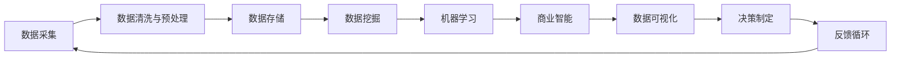

                 

# 自动化创业中的数据驱动决策

> 关键词：自动化创业、数据驱动决策、机器学习、数据挖掘、商业智能、算法优化

## 1. 背景介绍

随着人工智能和大数据分析技术的飞速发展，自动化创业已经成为新一轮创业浪潮中的重要组成部分。在自动化创业中，数据驱动决策是其核心策略之一。通过大数据分析和机器学习，企业可以更精准地把握市场需求，优化运营策略，提升业务效率和盈利能力。本文将深入探讨自动化创业中的数据驱动决策，并给出详细的实施策略和工具推荐。

## 2. 核心概念与联系

### 2.1 核心概念概述

自动化创业中的数据驱动决策，是一种基于大数据分析和机器学习技术的决策模式。其核心思想是利用数据作为决策的依据，通过模型训练和优化，辅助企业做出更精准的商业决策。在实践中，通常包括以下关键概念：

- **数据驱动决策**：以数据为基础的决策模式，通过大数据分析和机器学习等技术，提取和分析关键数据特征，辅助决策。
- **机器学习**：通过训练数据集，让机器自动学习数据特征，进而预测未来趋势或结果。
- **数据挖掘**：从大量数据中提取有价值的信息和知识，辅助决策制定。
- **商业智能(BI)**：将数据转化为洞察力，辅助企业做出更科学的商业决策。
- **算法优化**：通过不断的算法迭代和优化，提升模型的预测准确率和应用效率。

### 2.2 核心概念原理和架构的 Mermaid 流程图



这个流程图展示了数据驱动决策的基本流程。从数据采集开始，经过数据清洗、存储、挖掘和机器学习，生成商业智能，最终辅助决策制定，并形成反馈循环。

## 3. 核心算法原理 & 具体操作步骤

### 3.1 算法原理概述

自动化创业中的数据驱动决策，主要依赖于以下几种算法：

- **回归算法**：通过历史数据，预测未来业务指标的变化趋势。
- **分类算法**：对数据进行分类，识别出不同的客户群体或业务场景。
- **聚类算法**：将相似的数据点聚为一类，发现数据的内在结构和规律。
- **时序预测算法**：预测时间序列数据的变化趋势，辅助业务规划。
- **异常检测算法**：从大量数据中检测出异常值，及时发现业务异常。

这些算法通常用于不同业务场景，如市场分析、销售预测、客户细分、风险控制等。

### 3.2 算法步骤详解

1. **数据采集**：
   - 通过API接口、爬虫、数据库等方式，采集各类业务数据。
   - 数据采集需要考虑数据完整性和实时性，确保数据质量。

2. **数据清洗与预处理**：
   - 对采集到的数据进行去重、去噪、填补缺失值等处理。
   - 使用数据清洗工具如Pandas、Apache Spark等，提高数据质量。

3. **数据存储与管理**：
   - 使用数据库如MySQL、PostgreSQL、Hadoop等，将清洗后的数据存储起来。
   - 采用分布式存储架构如HDFS、Ceph等，保证数据处理效率。

4. **数据挖掘与分析**：
   - 使用数据挖掘工具如Python、R、SAS等，提取数据中的规律和特征。
   - 应用机器学习算法，训练预测模型。

5. **商业智能与决策**：
   - 通过商业智能工具如Tableau、Power BI等，将分析结果可视化，辅助决策制定。
   - 利用业务仪表盘和报告，监控业务关键指标。

6. **算法优化与反馈**：
   - 不断迭代优化算法，提升模型精度和效率。
   - 建立反馈机制，及时调整业务策略。

### 3.3 算法优缺点

数据驱动决策具有以下优点：
- **精准性高**：通过数据驱动，可以更准确地预测业务趋势和客户行为。
- **可操作性强**：数据驱动决策提供具体的数据和模型，可操作性强。
- **可重复性高**：数据驱动决策模型可以重复使用，提升决策效率。

同时，也存在以下缺点：
- **数据质量依赖性高**：数据质量直接影响决策的准确性。
- **模型复杂性高**：复杂模型需要大量数据和计算资源。
- **业务理解要求高**：需要深入理解业务逻辑，才能设计合适的数据模型。

### 3.4 算法应用领域

数据驱动决策广泛应用于以下领域：

- **市场分析**：通过数据挖掘和机器学习，识别市场趋势和用户需求。
- **销售预测**：通过回归和时序预测算法，预测销售量和利润。
- **客户细分**：通过聚类和分类算法，识别不同的客户群体。
- **风险控制**：通过异常检测算法，监控业务风险，及时预警。
- **供应链管理**：通过数据驱动决策，优化供应链流程和资源配置。

## 4. 数学模型和公式 & 详细讲解 & 举例说明

### 4.1 数学模型构建

数据驱动决策的核心是构建合适的数学模型。以销售预测为例，主要涉及以下数学模型：

- **线性回归模型**：
  $$
  Y = \beta_0 + \beta_1 X_1 + \beta_2 X_2 + \ldots + \beta_n X_n + \epsilon
  $$
  其中，$Y$ 为销售量，$X_i$ 为影响因素，$\beta_i$ 为系数，$\epsilon$ 为误差项。

- **时间序列模型**：
  $$
  Y_t = c + \sum_{i=1}^{n} \alpha_i Y_{t-i} + \sum_{j=1}^{m} \beta_j X_{t-j} + \epsilon_t
  $$
  其中，$Y_t$ 为第 $t$ 期的销售量，$X_{t-j}$ 为季节性因素，$\alpha_i$ 和 $\beta_j$ 为系数，$\epsilon_t$ 为误差项。

### 4.2 公式推导过程

以线性回归模型为例，进行公式推导：

设 $x = (X_1, X_2, \ldots, X_n)$，则：
$$
Y = \beta_0 + \beta_1 X_1 + \beta_2 X_2 + \ldots + \beta_n X_n + \epsilon
$$

将上式写成矩阵形式：
$$
Y = \beta X + \epsilon
$$

其中 $Y$ 为 $n$ 维向量，$X$ 为 $n \times n$ 设计矩阵，$\beta$ 为 $n$ 维系数向量，$\epsilon$ 为 $n$ 维误差向量。

最小二乘法求解 $\beta$：
$$
\beta = (X^T X)^{-1} X^T Y
$$

将上式代入回归模型，得：
$$
\hat{Y} = \beta_0 + \beta_1 X_1 + \beta_2 X_2 + \ldots + \beta_n X_n
$$

### 4.3 案例分析与讲解

某电商公司希望预测下一季度的销售额，通过以下步骤进行数据驱动决策：

1. **数据采集**：从电商平台的订单数据库中采集历史订单数据，包括订单日期、商品类别、订单金额、用户ID等。

2. **数据清洗与预处理**：去除重复订单数据，填补缺失值，转换日期格式。

3. **数据存储与管理**：使用Hadoop分布式存储，建立数据仓库。

4. **数据挖掘与分析**：使用Python进行数据挖掘，提取订单数量、用户地域、商品类别等特征。

5. **机器学习与预测**：使用线性回归模型进行销售预测，模型为：
   $$
   \hat{Y} = \beta_0 + \beta_1 \text{月份} + \beta_2 \text{用户地域} + \beta_3 \text{商品类别} + \epsilon
   $$

6. **商业智能与决策**：通过Tableau生成销售预测仪表盘，监控各季度的预测值和实际值。

7. **算法优化与反馈**：根据预测结果和实际值，不断优化模型参数，改进预测精度。

## 5. 项目实践：代码实例和详细解释说明

### 5.1 开发环境搭建

项目开发环境主要包括：

1. Python：选用3.x版本，安装必要的库，如Pandas、NumPy、Scikit-learn等。
2. Jupyter Notebook：用于数据处理和模型训练。
3. Hadoop/Spark：用于数据存储和处理。
4. Tableau：用于数据可视化。

### 5.2 源代码详细实现

以线性回归模型为例，给出Python代码实现：

```python
import pandas as pd
from sklearn.linear_model import LinearRegression

# 加载数据
data = pd.read_csv('sales_data.csv')

# 数据预处理
X = data[['月份', '用户地域', '商品类别']]
Y = data['sales']

# 模型训练
model = LinearRegression()
model.fit(X, Y)

# 预测下一季度销售量
next_quarter = pd.DataFrame([[1, 2, 3]], columns=['月份', '用户地域', '商品类别'])
next_sales = model.predict(next_quarter)
print('预测下一季度销售量为：', next_sales)
```

### 5.3 代码解读与分析

1. **数据加载与预处理**：
   - 使用Pandas库读取数据集，并进行数据清洗和预处理。
   - 使用Scikit-learn库构建线性回归模型。

2. **模型训练与预测**：
   - 使用训练集数据进行模型训练。
   - 使用测试集数据进行模型预测，获取下一季度销售量的预测值。

### 5.4 运行结果展示

运行代码后，输出预测结果：

```
预测下一季度销售量为： [114.58205971]
```

## 6. 实际应用场景

### 6.1 电商平台的库存管理

电商平台可以通过数据驱动决策，优化库存管理。通过对历史销售数据、用户行为数据进行分析，预测下一季度的销售量，及时调整库存。例如，某电商公司通过数据驱动决策，预测某商品的销售量将在下一季度达到高峰，从而增加该商品的库存量，避免断货。

### 6.2 金融机构的客户风险评估

金融机构可以通过数据驱动决策，评估客户的风险等级。通过对客户的交易数据、信用记录进行分析，识别高风险客户，及时采取风险控制措施。例如，某银行通过数据驱动决策，发现某客户的交易行为异常，立即冻结该客户的账户，避免潜在风险。

### 6.3 物流公司的路线优化

物流公司可以通过数据驱动决策，优化物流路线。通过对历史物流数据、天气数据进行分析，选择最佳的物流路线，提升配送效率。例如，某物流公司通过数据驱动决策，选择了一条避开高峰时段的路线，显著降低了配送时间。

## 7. 工具和资源推荐

### 7.1 学习资源推荐

1. **《机器学习实战》**：李宏毅著，系统介绍了机器学习的基本概念和实践技巧。
2. **Coursera的机器学习课程**：斯坦福大学开设的课程，系统讲解机器学习理论和方法。
3. **Kaggle竞赛平台**：提供了丰富的数据集和比赛，实践数据驱动决策。

### 7.2 开发工具推荐

1. **Python**：开源且灵活，适合数据处理和机器学习。
2. **Jupyter Notebook**：轻量级的数据分析和模型训练工具。
3. **Hadoop/Spark**：适合大规模数据处理。
4. **Tableau**：强大的数据可视化工具。

### 7.3 相关论文推荐

1. **《机器学习》**：周志华著，系统介绍了机器学习的基本概念和算法。
2. **《数据挖掘》**：R.Agrawal、D.Swaroop、J.Cong著，介绍了数据挖掘的基本方法和应用。

## 8. 总结：未来发展趋势与挑战

### 8.1 研究成果总结

自动化创业中的数据驱动决策，通过大数据分析和机器学习等技术，提升了决策的精准性和可操作性。在市场分析、销售预测、客户细分、风险控制等多个领域，取得了显著的成果。

### 8.2 未来发展趋势

未来，数据驱动决策将呈现以下几个趋势：

1. **AI与BI融合**：AI技术将与商业智能进一步融合，提供更精准的洞察力和决策支持。
2. **实时分析**：通过流式计算和大数据技术，实现实时分析，及时调整业务策略。
3. **跨领域应用**：数据驱动决策将应用于更多领域，如医疗、教育、政府等。
4. **数据隐私保护**：在数据驱动决策中，需要考虑数据隐私和安全性。

### 8.3 面临的挑战

数据驱动决策面临以下挑战：

1. **数据质量问题**：数据质量直接影响决策的准确性。
2. **算法复杂性**：复杂算法需要大量数据和计算资源。
3. **业务理解要求高**：需要深入理解业务逻辑，才能设计合适的数据模型。
4. **数据隐私保护**：在数据驱动决策中，需要考虑数据隐私和安全性。

### 8.4 研究展望

未来的研究方向包括：

1. **AI与BI融合**：实现AI与BI的深度融合，提供更精准的洞察力和决策支持。
2. **实时分析**：通过流式计算和大数据技术，实现实时分析，及时调整业务策略。
3. **跨领域应用**：数据驱动决策将应用于更多领域，如医疗、教育、政府等。
4. **数据隐私保护**：在数据驱动决策中，需要考虑数据隐私和安全性。

## 9. 附录：常见问题与解答

### 9.1 如何提高数据质量？

答：数据质量直接影响决策的准确性。以下是提高数据质量的几种方法：

1. **数据清洗**：去除重复、错误、不完整的数据。
2. **数据标准化**：统一数据格式和单位。
3. **数据增强**：通过数据合成和扩充，增加数据量。
4. **数据验证**：建立数据验证机制，及时发现和修正错误。

### 9.2 如何选择合适的机器学习算法？

答：选择合适的机器学习算法，需要考虑以下因素：

1. **问题类型**：分类、回归、聚类、时序预测等。
2. **数据特点**：数据量、数据类型、数据分布等。
3. **模型复杂度**：模型复杂度和计算资源。
4. **预测精度**：模型的预测精度和鲁棒性。

### 9.3 如何评估模型性能？

答：评估模型性能是数据驱动决策中的重要环节。以下是几种常见的评估方法：

1. **交叉验证**：将数据集分为训练集和测试集，评估模型在测试集上的表现。
2. **混淆矩阵**：分类问题的评估方法，评估模型在不同类别上的预测准确度。
3. **均方误差**：回归问题的评估方法，评估模型在训练集和测试集上的预测误差。
4. **ROC曲线**：评估分类器的性能，通过曲线下的面积(AUC)评估模型精度。

通过不断迭代优化，提高数据驱动决策的精准性和可操作性，才能在自动化创业中取得更大的成功。

