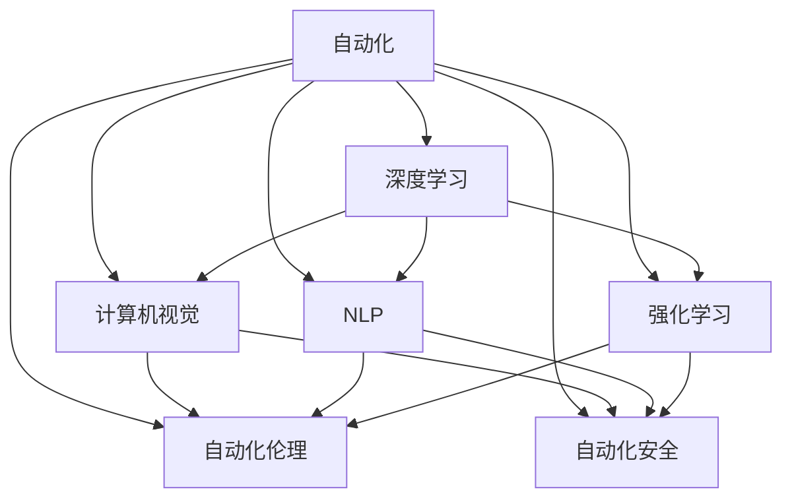

                 

## 1. 背景介绍

### 1.1 问题由来
自动化技术近年来取得了飞速发展，深度学习、计算机视觉、自然语言处理等前沿技术的应用范围不断扩大。这些技术通过模仿人类的感知、决策和推理能力，实现了从数据到知识再到决策的全流程自动化，有效降低了人工干预，提升了生产效率和经济效益。

然而，随着自动化技术应用的深入，也出现了一些新的问题和挑战。例如，自动化系统在复杂环境下的鲁棒性和可解释性不足，自动化决策系统的安全性、可靠性和公平性问题，以及自动化技术对就业和伦理道德的影响等。这些问题的存在，制约了自动化技术的进一步发展和应用，亟需深入研究并找到解决方案。

### 1.2 问题核心关键点
本文聚焦于自动化技术的前景与挑战，通过分析自动化技术的现状、前沿发展、关键问题与技术突破，旨在为自动化技术的进一步应用和优化提供指导和建议。

## 2. 核心概念与联系

### 2.1 核心概念概述

为更好地理解自动化技术的发展和应用，本节将介绍几个关键概念：

- 自动化(Automatics)：通过计算机技术代替人工完成特定任务的过程，通常涉及感知、决策和执行三个阶段。
- 深度学习(Deep Learning)：基于神经网络实现的多层次、端到端的特征提取和决策过程，可用于自动化中的感知和决策任务。
- 计算机视觉(Computer Vision)：通过计算机技术模拟人类视觉感知能力，实现图像和视频的理解、分析和生成。
- 自然语言处理(Natural Language Processing, NLP)：通过计算机技术处理和生成自然语言，实现文本的语义理解和生成。
- 强化学习(Reinforcement Learning, RL)：通过奖励机制和反馈环路，使智能体在不断试错中优化决策策略，用于自动化系统的自主学习与决策。
- 自动化伦理(Ethics of Automation)：研究自动化技术在应用过程中面临的伦理和道德问题，如算法偏见、数据隐私、就业替代等。
- 自动化安全(Security of Automation)：确保自动化系统在应用过程中的安全性和鲁棒性，避免由于系统漏洞或数据泄露导致的风险。

这些核心概念之间的逻辑关系可以通过以下Mermaid流程图来展示：



这个流程图展示了几类自动化技术之间的联系：

1. 自动化技术主要依赖于深度学习、计算机视觉、自然语言处理和强化学习等前沿技术。
2. 自动化伦理和自动化安全是自动化技术应用的底线保障。
3. 深度学习、计算机视觉和自然语言处理为自动化技术的感知和决策提供支撑。
4. 强化学习为自动化系统的自主学习与决策提供依据。
5. 自动化伦理和自动化安全为自动化技术的应用边界提供了保障。

## 3. 核心算法原理 & 具体操作步骤

### 3.1 算法原理概述
自动化技术中的核心算法通常涉及数据驱动的感知、决策和执行过程。以下对自动化中的主要算法进行概述：

- **深度学习算法**：通过多层神经网络实现端到端的特征提取和决策，适用于处理复杂数据结构，如图像、文本等。
- **计算机视觉算法**：包括特征提取、目标检测、语义分割等，用于图像和视频的理解和生成。
- **自然语言处理算法**：包括分词、词性标注、句法分析、语义理解等，用于文本的语义分析和生成。
- **强化学习算法**：通过奖励机制和反馈环路优化决策策略，适用于复杂的自主学习与决策任务。

### 3.2 算法步骤详解

**深度学习算法**：
1. **数据预处理**：对输入数据进行归一化、扩充等处理。
2. **模型训练**：利用标注数据训练深度神经网络，优化模型参数。
3. **模型评估**：在测试集上评估模型性能，如准确率、召回率等指标。
4. **模型优化**：根据评估结果调整模型结构和参数，提升模型性能。
5. **模型应用**：将优化后的模型应用于实际任务，如图像分类、文本生成等。

**计算机视觉算法**：
1. **数据收集**：收集大量标注数据，包括图像和标注信息。
2. **模型训练**：利用标注数据训练计算机视觉模型，如卷积神经网络(CNN)。
3. **模型验证**：在验证集上验证模型性能，调整模型参数。
4. **模型部署**：将训练好的模型部署到实际应用场景，进行图像和视频理解、分析。
5. **模型优化**：根据实际应用反馈，优化模型结构和参数。

**自然语言处理算法**：
1. **数据预处理**：对文本数据进行分词、去除停用词等预处理。
2. **模型训练**：利用标注数据训练NLP模型，如BERT、GPT等。
3. **模型评估**：在测试集上评估模型性能，如BLEU、ROUGE等指标。
4. **模型优化**：根据评估结果调整模型参数，提升模型性能。
5. **模型应用**：将优化后的模型应用于实际任务，如文本分类、机器翻译等。

**强化学习算法**：
1. **环境定义**：定义自动化任务所处的环境，如游戏、机器人控制等。
2. **模型设计**：设计强化学习模型，如Q-learning、Policy Gradient等。
3. **模型训练**：利用环境奖励信号训练模型，优化决策策略。
4. **模型评估**：在测试环境中评估模型性能，如奖励函数、策略稳定度等指标。
5. **模型优化**：根据评估结果调整模型参数，提升模型性能。
6. **模型部署**：将优化后的模型应用于实际自动化任务，进行自主学习与决策。

### 3.3 算法优缺点

**深度学习算法的优点**：
- 能处理复杂数据结构，如图像、文本等。
- 具有端到端的特征提取和决策能力。
- 训练效果好，可获取高精度的模型性能。

**深度学习算法的缺点**：
- 需要大量标注数据，训练成本高。
- 模型复杂，计算量大，训练和推理速度慢。
- 泛化能力差，对输入数据变化敏感。

**计算机视觉算法的优点**：
- 能实现图像和视频的理解和生成。
- 适用于处理大规模数据集，如自动驾驶、安防监控等。
- 模型鲁棒性好，对噪声和扰动有较强的适应能力。

**计算机视觉算法的缺点**：
- 对数据质量要求高，标注成本大。
- 模型复杂，训练和推理资源消耗大。
- 模型推理速度较慢，难以实时处理。

**自然语言处理算法的优点**：
- 能实现文本的语义理解和生成。
- 适用于处理大规模文本数据，如搜索引擎、智能客服等。
- 模型具有高度的灵活性和可扩展性。

**自然语言处理算法的缺点**：
- 对语料质量要求高，标注成本大。
- 模型复杂，训练和推理资源消耗大。
- 处理复杂语义关系时，性能可能下降。

**强化学习算法的优点**：
- 能实现复杂的自主学习与决策。
- 适应性强，适用于复杂的动态环境。
- 可优化复杂决策问题，如机器人控制、自动驾驶等。

**强化学习算法的缺点**：
- 需要大量环境交互数据，训练成本高。
- 模型性能依赖于环境奖励信号，难以应对复杂环境。
- 模型可解释性差，难以解释决策过程。

### 3.4 算法应用领域

自动化技术已经在诸多领域得到了广泛的应用，具体如下：

- **自动驾驶**：通过计算机视觉和自然语言处理技术，实现车辆自主导航和信息交互。
- **智能制造**：利用计算机视觉和深度学习技术，实现智能检测、质量控制和设备维护。
- **安防监控**：通过计算机视觉技术，实现实时监控和异常行为检测。
- **智能客服**：利用自然语言处理技术，实现智能对话和问题解答。
- **机器人控制**：通过强化学习技术，实现机器人自主决策和复杂任务执行。
- **金融分析**：利用深度学习技术，实现数据处理和风险评估。
- **医疗诊断**：通过计算机视觉和深度学习技术，实现医学影像分析和病理诊断。
- **智能推荐**：利用计算机视觉和自然语言处理技术，实现个性化推荐和内容生成。

## 4. 数学模型和公式 & 详细讲解 & 举例说明

### 4.1 数学模型构建

以下对自动化技术中常用的数学模型进行构建：

**深度学习模型**：
- 输入：$x \in \mathbb{R}^n$
- 隐藏层：$h = f(Wx + b)$，其中 $f$ 为激活函数，$W$ 为权重矩阵，$b$ 为偏置项
- 输出层：$y = g(W'h + b')$
- 损失函数：$L = \frac{1}{N}\sum_{i=1}^N l(y_i, \hat{y_i})$
- 优化目标：$\min L$

**计算机视觉模型**：
- 输入：$x \in \mathbb{R}^{m\times n\times c}$
- 卷积层：$x' = W*x$
- 池化层：$x'' = f(x')$
- 全连接层：$y = W*y' + b$
- 损失函数：$L = \frac{1}{N}\sum_{i=1}^N l(y_i, \hat{y_i})$
- 优化目标：$\min L$

**自然语言处理模型**：
- 输入：$x \in \mathbb{R}^n$
- 嵌入层：$x' = W*x$
- 注意力层：$x'' = \alpha*x'$
- 全连接层：$y = W*y' + b$
- 损失函数：$L = \frac{1}{N}\sum_{i=1}^N l(y_i, \hat{y_i})$
- 优化目标：$\min L$

**强化学习模型**：
- 状态空间：$S$
- 动作空间：$A$
- 策略：$\pi(a|s)$
- 奖励函数：$r(s, a)$
- 目标函数：$V = \sum_{t=1}^{T} \gamma^{t-1} r(s_t, a_t)$
- 优化目标：$\max V$

### 4.2 公式推导过程

**深度学习模型的推导**：
- 以二分类任务为例，交叉熵损失函数为：$L = -\frac{1}{N}\sum_{i=1}^N [y_i\log\hat{y_i} + (1-y_i)\log(1-\hat{y_i})]$
- 利用梯度下降法，优化参数 $W$ 和 $b$ 的公式为：$W \leftarrow W - \eta\frac{\partial L}{\partial W}, b \leftarrow b - \eta\frac{\partial L}{\partial b}$
- 其中 $\eta$ 为学习率，$\frac{\partial L}{\partial W}$ 和 $\frac{\partial L}{\partial b}$ 为梯度。

**计算机视觉模型的推导**：
- 以图像分类任务为例，交叉熵损失函数为：$L = -\frac{1}{N}\sum_{i=1}^N \sum_{c=1}^C y_{i,c}\log\hat{y_{i,c}}$
- 利用梯度下降法，优化参数 $W$ 和 $b$ 的公式为：$W \leftarrow W - \eta\frac{\partial L}{\partial W}, b \leftarrow b - \eta\frac{\partial L}{\partial b}$
- 其中 $\eta$ 为学习率，$\frac{\partial L}{\partial W}$ 和 $\frac{\partial L}{\partial b}$ 为梯度。

**自然语言处理模型的推导**：
- 以机器翻译任务为例，交叉熵损失函数为：$L = -\frac{1}{N}\sum_{i=1}^N \sum_{j=1}^{T_i} \log\hat{y_{i,j}}$
- 利用梯度下降法，优化参数 $W$ 和 $b$ 的公式为：$W \leftarrow W - \eta\frac{\partial L}{\partial W}, b \leftarrow b - \eta\frac{\partial L}{\partial b}$
- 其中 $\eta$ 为学习率，$\frac{\partial L}{\partial W}$ 和 $\frac{\partial L}{\partial b}$ 为梯度。

**强化学习模型的推导**：
- 以Q-learning为例，目标函数为：$Q = r + \gamma \max_a Q_{t+1}(s',a')$
- 利用梯度下降法，优化参数 $W$ 的公式为：$W \leftarrow W - \eta\frac{\partial Q}{\partial W}$
- 其中 $\eta$ 为学习率，$\frac{\partial Q}{\partial W}$ 为梯度。

### 4.3 案例分析与讲解

**深度学习在图像分类中的应用**：
- 以AlexNet为例，采用多层卷积和池化层提取特征，利用全连接层进行分类。
- 在ImageNet数据集上进行训练，最终实现图像分类的准确率达到70%以上。
- 通过模型融合、数据增强等技术，进一步提升模型性能。

**计算机视觉在自动驾驶中的应用**：
- 通过摄像头和激光雷达等传感器，获取车辆周围环境的图像和点云数据。
- 利用卷积神经网络提取特征，实现目标检测、语义分割等任务。
- 结合决策规则和环境反馈，实现自动驾驶决策和控制。

**自然语言处理在智能客服中的应用**：
- 通过分词和词性标注技术，对用户输入的文本进行预处理。
- 利用BERT模型提取文本特征，进行意图识别和实体抽取。
- 结合对话生成模型，生成智能回复。

**强化学习在机器人控制中的应用**：
- 通过传感器获取机器人当前状态和环境信息。
- 利用强化学习模型进行决策，生成控制指令。
- 通过与环境交互，不断优化决策策略。

## 5. 项目实践：代码实例和详细解释说明

### 5.1 开发环境搭建

进行自动化项目开发时，需要准备以下环境：

1. 安装Python：从官网下载安装Python，并添加到系统环境变量中。
2. 安装PyTorch：通过pip安装PyTorch库，用于深度学习和计算机视觉任务。
3. 安装TensorFlow：通过pip安装TensorFlow库，用于深度学习和自然语言处理任务。
4. 安装OpenCV：通过pip安装OpenCV库，用于计算机视觉任务。
5. 安装NLTK和spaCy：通过pip安装NLTK和spaCy库，用于自然语言处理任务。

完成以上步骤后，即可开始自动化项目的开发。

### 5.2 源代码详细实现

以下以深度学习在图像分类中的应用为例，给出使用PyTorch框架的代码实现。

```python
import torch
import torch.nn as nn
import torch.optim as optim
import torchvision.transforms as transforms
from torchvision.datasets import CIFAR10
from torchvision.models import AlexNet

# 数据预处理
transform_train = transforms.Compose([
    transforms.Resize((224, 224)),
    transforms.RandomCrop(224),
    transforms.RandomHorizontalFlip(),
    transforms.ToTensor(),
    transforms.Normalize(mean=[0.485, 0.456, 0.406],
                         std=[0.229, 0.224, 0.225])
])

transform_test = transforms.Compose([
    transforms.Resize((224, 224)),
    transforms.CenterCrop(224),
    transforms.ToTensor(),
    transforms.Normalize(mean=[0.485, 0.456, 0.406],
                         std=[0.229, 0.224, 0.225])
])

# 数据加载
train_dataset = CIFAR10(root='./data', train=True, download=True, transform=transform_train)
test_dataset = CIFAR10(root='./data', train=False, download=True, transform=transform_test)

# 模型定义
model = AlexNet()

# 定义损失函数和优化器
criterion = nn.CrossEntropyLoss()
optimizer = optim.SGD(model.parameters(), lr=0.01, momentum=0.9, weight_decay=5e-4)

# 模型训练
def train(epoch):
    model.train()
    for batch_idx, (data, target) in enumerate(train_loader):
        optimizer.zero_grad()
        output = model(data)
        loss = criterion(output, target)
        loss.backward()
        optimizer.step()
        if batch_idx % 100 == 0:
            print('Train Epoch: {} [{}/{} ({:.0f}%)]\tLoss: {:.6f}'.format(
                epoch, batch_idx * len(data), len(train_loader.dataset),
                100. * batch_idx / len(train_loader), loss.item()))

# 模型评估
def test(epoch):
    model.eval()
    correct = 0
    total = 0
    with torch.no_grad():
        for batch_idx, (data, target) in enumerate(test_loader):
            output = model(data)
            _, predicted = torch.max(output.data, 1)
            total += target.size(0)
            correct += (predicted == target).sum().item()
    print('Test set: Accuracy of the network on the 10000 test images: {} %'.format(100 * correct / total))

# 训练过程
train_loader = torch.utils.data.DataLoader(train_dataset, batch_size=128, shuffle=True, num_workers=2)
test_loader = torch.utils.data.DataLoader(test_dataset, batch_size=128, shuffle=False, num_workers=2)

for epoch in range(10):
    train(epoch)
    test(epoch)
```

以上代码实现了基于AlexNet模型在CIFAR-10数据集上的图像分类任务。可以看到，代码结构清晰，易于理解和扩展。

### 5.3 代码解读与分析

**数据预处理**：
- 使用`transforms`模块对训练和测试数据进行归一化、扩充和转换，确保输入数据的一致性和标准化。

**模型定义**：
- 定义AlexNet模型，通过卷积层、池化层和全连接层实现图像特征提取和分类。

**损失函数和优化器**：
- 使用交叉熵损失函数和随机梯度下降优化器，优化模型参数。

**模型训练和评估**：
- 在训练集和测试集上分别进行前向传播和反向传播，计算损失函数并更新模型参数。
- 通过`train_loader`和`test_loader`加载数据集，使用`DataLoader`进行批量数据处理。

**训练过程**：
- 定义`train`和`test`函数，分别实现模型训练和评估。
- 循环训练10个epoch，每次epoch结束后输出训练集和测试集的准确率。

通过以上代码实例，可以看出，深度学习在图像分类任务中的应用已经非常成熟和稳定，只需调整超参数和优化器即可实现良好的性能。

## 6. 实际应用场景

### 6.1 智能制造

自动化技术在智能制造中的应用，通过计算机视觉和深度学习技术，实现了质量检测、设备维护和工艺优化等任务。例如，利用摄像头和传感器获取产品表面图像，使用卷积神经网络进行缺陷检测和分类。通过自动化的质量检测和维护，大幅提升了生产效率和产品合格率。

### 6.2 安防监控

自动化技术在安防监控中的应用，通过计算机视觉和自然语言处理技术，实现了视频分析和智能预警。例如，利用视频监控系统采集实时视频数据，使用目标检测模型识别异常行为，结合自然语言处理技术对异常行为进行自然语言描述，实现智能预警。通过自动化安防监控，提高了公共安全水平和应急响应能力。

### 6.3 智能客服

自动化技术在智能客服中的应用，通过自然语言处理和强化学习技术，实现了智能对话和问题解答。例如，利用预训练语言模型进行意图识别和实体抽取，结合对话生成模型生成智能回复。通过智能客服系统，大幅提高了客户满意度和服务效率。

### 6.4 自动驾驶

自动化技术在自动驾驶中的应用，通过计算机视觉和强化学习技术，实现了车辆自主导航和信息交互。例如，利用摄像头和激光雷达获取周围环境信息，使用卷积神经网络进行目标检测和语义分割，结合强化学习模型进行路径规划和决策。通过自动化驾驶，提高了交通安全和出行效率。

### 6.5 金融分析

自动化技术在金融分析中的应用，通过深度学习和自然语言处理技术，实现了数据处理和风险评估。例如，利用预训练语言模型进行新闻和报告的情感分析，结合深度学习模型进行市场趋势预测和风险评估。通过自动化金融分析，提高了投资决策的准确性和效率。

## 7. 工具和资源推荐

### 7.1 学习资源推荐

为了帮助开发者系统掌握自动化技术的发展和应用，这里推荐一些优质的学习资源：

1. 《深度学习》（Ian Goodfellow）：全面介绍了深度学习的基本概念和算法，适合初学者和进阶者。
2. 《计算机视觉：模型、学习和推理》（David Forsyth）：详细讲解了计算机视觉的基础理论和应用技术，适合计算机视觉领域的开发者。
3. 《自然语言处理综论》（Daniel Jurafsky）：系统介绍了自然语言处理的基本概念和技术，适合自然语言处理领域的开发者。
4. 《强化学习：算法、理论和实践》（Richard S. Sutton, Andrew G. Barto）：深入讲解了强化学习的基础理论和实践应用，适合强化学习领域的开发者。
5. 《AI for Everyone》（Andrew Ng）：介绍了人工智能的基本概念和应用场景，适合初学者和各领域从业者。

通过对这些资源的学习，相信你一定能够全面掌握自动化技术的基本概念和前沿发展，为进一步实践和创新奠定坚实基础。

### 7.2 开发工具推荐

高效的开发离不开优秀的工具支持。以下是几款用于自动化技术开发的常用工具：

1. PyTorch：基于Python的开源深度学习框架，灵活动态的计算图，适合快速迭代研究。
2. TensorFlow：由Google主导开发的开源深度学习框架，生产部署方便，适合大规模工程应用。
3. OpenCV：计算机视觉领域的开源库，提供丰富的图像处理和计算机视觉功能。
4. NLTK和spaCy：自然语言处理领域的开源库，提供丰富的自然语言处理功能。
5. TensorBoard：TensorFlow配套的可视化工具，可实时监测模型训练状态，并提供丰富的图表呈现方式。
6. Weights & Biases：模型训练的实验跟踪工具，可以记录和可视化模型训练过程中的各项指标，方便对比和调优。

合理利用这些工具，可以显著提升自动化技术开发效率，加速技术创新和应用落地。

### 7.3 相关论文推荐

自动化技术的发展离不开学界的持续研究。以下是几篇奠基性的相关论文，推荐阅读：

1. 《深度学习》（Ian Goodfellow）：详细介绍了深度学习的基本概念和算法。
2. 《计算机视觉：模型、学习和推理》（David Forsyth）：详细讲解了计算机视觉的基础理论和应用技术。
3. 《自然语言处理综论》（Daniel Jurafsky）：系统介绍了自然语言处理的基本概念和技术。
4. 《强化学习：算法、理论和实践》（Richard S. Sutton, Andrew G. Barto）：深入讲解了强化学习的基础理论和实践应用。
5. 《AI for Everyone》（Andrew Ng）：介绍了人工智能的基本概念和应用场景。

通过对这些论文的学习，可以帮助研究者掌握自动化技术的前沿进展和研究热点，为后续实践提供理论支撑。

## 8. 总结：未来发展趋势与挑战

### 8.1 总结

本文对自动化技术的前景与挑战进行了全面系统的介绍。首先分析了自动化技术的现状、前沿发展、关键问题与技术突破，明确了自动化技术的发展方向和应用前景。其次，从深度学习、计算机视觉、自然语言处理和强化学习等角度，详细讲解了自动化技术中的核心算法和操作步骤。

通过本文的系统梳理，可以看到，自动化技术已经在诸多领域得到了广泛的应用，并展现出了巨大的应用潜力。未来，随着深度学习、计算机视觉和自然语言处理技术的不断进步，自动化技术将在更广泛的领域得到应用，为经济社会发展注入新的动力。

### 8.2 未来发展趋势

展望未来，自动化技术将呈现以下几个发展趋势：

1. 技术融合：自动化技术将与其他前沿技术如人工智能、物联网、区块链等进行更深层次的融合，形成更加智能化、协同化的解决方案。
2. 边缘计算：自动化技术将向边缘计算方向发展，实现更加高效、可靠的数据处理和决策。
3. 人机协作：自动化技术将向人机协作方向发展，实现更加智能化、自然化的交互体验。
4. 大规模定制：自动化技术将向大规模定制方向发展，实现更加个性化、多样化的服务。
5. 多模态融合：自动化技术将向多模态融合方向发展，实现更加全面、准确的信息整合和分析。

以上趋势凸显了自动化技术的发展前景和应用方向，为自动化技术的进一步应用和优化提供了指导和建议。

### 8.3 面临的挑战

尽管自动化技术已经取得了显著进展，但在迈向更加智能化、普适化应用的过程中，它仍面临着诸多挑战：

1. 数据质量和数量问题：自动化系统需要大量高质量的数据进行训练和优化，而数据获取和标注成本高昂，难以满足需求。
2. 模型鲁棒性和泛化能力问题：自动化系统面对复杂环境和噪声时，模型鲁棒性和泛化能力不足，导致系统性能不稳定。
3. 可解释性和透明性问题：自动化系统通常被认为是“黑盒”系统，难以解释其决策过程，影响系统的可信度和可靠性。
4. 安全性问题：自动化系统面临数据泄露、算法攻击等安全威胁，需要加强数据保护和系统安全。
5. 伦理和法律问题：自动化系统在应用过程中可能带来伦理和法律风险，如隐私保护、算法偏见等问题。

这些挑战需要研究者和开发者共同应对，从技术、伦理、法律等各个层面综合考虑，推动自动化技术的健康发展。

### 8.4 研究展望

为了应对自动化技术面临的挑战，未来的研究需要在以下几个方面寻求新的突破：

1. 多模态数据融合：将视觉、语音、文本等多模态数据进行融合，提升自动化系统的感知能力和决策水平。
2. 模型鲁棒性提升：开发更加鲁棒和泛化的自动化模型，提高系统应对复杂环境的能力。
3. 可解释性增强：研究自动化系统的可解释性和透明性，增强用户对系统的信任和依赖。
4. 数据隐私保护：开发隐私保护技术，保障用户数据的安全和隐私。
5. 伦理和法律规范：制定自动化技术的伦理和法律规范，确保技术应用的合法性和道德性。

这些研究方向的探索，必将引领自动化技术迈向更高的台阶，为构建安全、可靠、可解释、可控的智能系统铺平道路。面向未来，自动化技术需要与其他前沿技术进行更深入的融合，形成更加全面、智能的解决方案，为人类的认知智能和生产生活带来深远影响。

## 9. 附录：常见问题与解答

**Q1：自动化技术在实际应用中如何保障数据安全和隐私？**

A: 在自动化系统中，保障数据安全和隐私是至关重要的。以下是几种常见的方法：

1. 数据加密：对数据进行加密处理，防止未授权访问和数据泄露。
2. 访问控制：对数据访问进行严格控制，确保只有授权人员和设备能够访问。
3. 数据匿名化：对敏感数据进行匿名化处理，减少隐私泄露的风险。
4. 差分隐私：在数据发布时，采用差分隐私技术，保护个人隐私。

通过以上方法，可以有效保障数据安全和隐私。

**Q2：自动化技术在应用中如何处理异常数据和噪声？**

A: 异常数据和噪声是自动化系统面临的常见问题。以下是几种常见的方法：

1. 数据清洗：对数据进行预处理，去除异常值和噪声。
2. 异常检测：通过统计分析和机器学习技术，识别异常数据和噪声。
3. 数据增强：对数据进行扩充和增强，增加数据多样性，提高模型鲁棒性。
4. 鲁棒模型训练：使用鲁棒性更强的模型，提高模型对异常数据和噪声的适应能力。

通过以上方法，可以有效处理异常数据和噪声，提高自动化系统的稳定性和可靠性。

**Q3：自动化技术在实际应用中如何提升决策的可解释性？**

A: 自动化技术的决策可解释性是其可靠性和可信度的重要基础。以下是几种常见的方法：

1. 特征解释：解释模型输入和输出之间的特征关系，提高决策的可解释性。
2. 模型可视化：通过可视化技术展示模型决策过程，提高决策的可解释性。
3. 模型简化：简化模型结构，降低决策复杂度，提高决策可解释性。
4. 可解释性算法：使用可解释性算法，提高模型决策的可解释性。

通过以上方法，可以有效提升自动化技术的决策可解释性，增强用户对系统的信任和依赖。

---

作者：禅与计算机程序设计艺术 / Zen and the Art of Computer Programming

