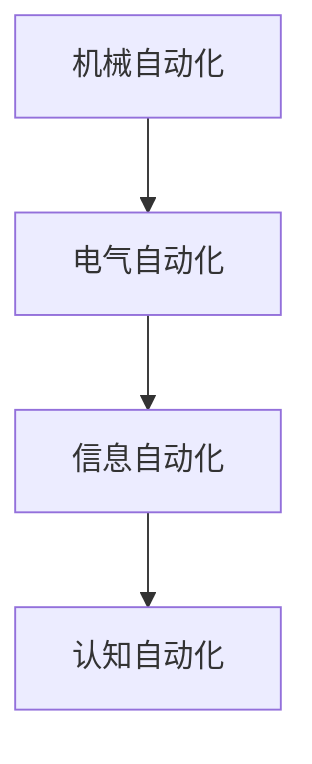

                 

## 1. 背景介绍

自动化技术在过去几十年中取得了长足的发展，从最初的简单机械化操作到如今的智能系统，自动化已广泛应用于工业生产、交通物流、医疗健康、金融服务等多个领域。然而，随着技术的进步和应用场景的不断扩展，当前的自动化系统在灵活性、安全性、可解释性和普适性等方面面临着诸多挑战。本文将从自动化的核心概念、发展历程以及未来方向进行系统阐述，以期对自动化领域的研究和实践提供参考。

## 2. 核心概念与联系

### 2.1 核心概念概述

自动化技术主要分为以下几类：

- **机械自动化**：通过机械装置实现自动化控制，包括机器人、传送带、自动化机床等。
- **电气自动化**：利用电气设备和控制技术实现自动化，如PLC、伺服电机、变频器等。
- **信息自动化**：基于计算机技术和网络通信实现信息自动化，如计算机辅助设计、自动化办公、智能监控等。
- **认知自动化**：通过人工智能和机器学习实现复杂的认知功能自动化，如机器翻译、语音识别、自然语言处理等。

这些自动化的核心概念之间存在着密切的联系：

1. **机械自动化与电气自动化**：机械自动化通过电气自动化来实现自动化控制，电气自动化为机械自动化提供了动力和控制手段。
2. **信息自动化与认知自动化**：信息自动化为认知自动化提供了数据处理和网络通信支持，认知自动化通过处理信息自动化产生的数据，实现高级的智能功能。
3. **自动化与人工智能**：自动化技术在人工智能的推动下，向更高层次的认知自动化迈进，如智能机器人、自动驾驶汽车等。

这些概念共同构成了自动化的技术框架，使得自动化技术能够不断发展和进步。

### 2.2 核心概念原理和架构的 Mermaid 流程图



此流程图展示了从机械自动化到认知自动化的技术演进路径，以及不同自动化技术之间的联系。

## 3. 核心算法原理 & 具体操作步骤

### 3.1 算法原理概述

自动化的核心算法原理主要包括以下几个方面：

- **控制算法**：如PID控制、模糊控制、模型预测控制等，用于实现自动化系统的闭环控制。
- **数据处理算法**：如信号处理、图像处理、语音处理等，用于自动化系统中数据的前处理和分析。
- **机器学习和深度学习算法**：如强化学习、神经网络、深度学习等，用于自动化系统中的决策和优化。

### 3.2 算法步骤详解

自动化系统的一般步骤如下：

1. **数据采集**：通过传感器、摄像头、麦克风等设备，采集实际环境中的数据。
2. **数据处理**：对采集到的数据进行预处理、清洗、特征提取等操作，为后续的自动化算法提供数据支持。
3. **算法执行**：执行自动化算法，如控制算法、机器学习算法等，实现系统的自动化控制或智能决策。
4. **反馈与调整**：根据系统的输出，进行反馈和调整，确保系统能够适应环境变化。

### 3.3 算法优缺点

- **优点**：自动化技术可以大幅提高生产效率、降低成本、提高系统稳定性和安全性。
- **缺点**：自动化系统可能需要较高的初始投资，维护复杂，可能存在故障和误操作风险。

### 3.4 算法应用领域

自动化技术广泛应用于制造业、能源、交通、医疗、金融等领域，具体应用场景包括：

- **工业自动化**：如自动化生产线、智能仓储、智能物流等。
- **能源自动化**：如智能电网、风电自动化、智能交通系统等。
- **医疗自动化**：如远程医疗、智能手术、药物自动化配置等。
- **金融自动化**：如自动交易系统、智能风控、智能客服等。

## 4. 数学模型和公式 & 详细讲解 & 举例说明

### 4.1 数学模型构建

自动化系统的数学模型通常包括控制模型、数据处理模型和决策模型。以工业自动化为例，我们可以建立如下数学模型：

- **控制模型**：通过PID控制算法建立控制系统模型，用于实现对自动化系统的闭环控制。
- **数据处理模型**：通过信号处理算法建立传感器数据处理模型，用于对采集到的数据进行处理和分析。
- **决策模型**：通过机器学习算法建立智能决策模型，用于根据系统输入和输出进行优化决策。

### 4.2 公式推导过程

以PID控制算法为例，PID控制算法的数学模型为：

$$ u(t) = K_p e(t) + K_i \int_0^t e(\tau) d\tau + K_d \frac{de(t)}{dt} $$

其中，$u(t)$ 为控制量，$e(t)$ 为误差，$K_p$、$K_i$、$K_d$ 为PID控制器参数。该公式描述了PID控制器的基本原理，通过比例、积分和微分控制，实现系统的稳定和优化。

### 4.3 案例分析与讲解

以智能仓储系统为例，该系统通过自动化设备和传感器采集仓库数据，利用机器学习算法进行货物定位、库存管理等决策。系统的数学模型包括传感器数据处理模型和智能决策模型，如下所示：

- **传感器数据处理模型**：通过对传感器数据进行滤波、校准等处理，得到仓库中的货物位置信息。
- **智能决策模型**：通过机器学习算法，如支持向量机、深度学习等，对货物位置和库存数据进行分析，实现货物的自动拣选和补货。

## 5. 项目实践：代码实例和详细解释说明

### 5.1 开发环境搭建

- **编程语言**：Python
- **开发工具**：PyCharm、Visual Studio Code
- **运行环境**：Ubuntu Linux、Python 3.8

### 5.2 源代码详细实现

以下是一个简单的PID控制算法的Python实现示例：

```python
import numpy as np

class PID:
    def __init__(self, Kp=0.1, Ki=0, Kd=0, dt=0.1):
        self.Kp = Kp
        self.Ki = Ki
        self.Kd = Kd
        self.dt = dt
        self.prev_error = 0
        self.integral = 0
    
    def calculate(self, error):
        delta_error = error - self.prev_error
        self.integral += error * self.dt
        derivative = delta_error / self.dt
        
        output = self.Kp * error + self.Ki * self.integral + self.Kd * derivative
        self.prev_error = error
        
        return output
```

### 5.3 代码解读与分析

该代码实现了一个简单的PID控制器，包括比例、积分和微分控制器的计算方法。其中，`calculate`方法接收误差值`error`，并返回控制量`output`。通过调整控制器的参数，可以优化控制效果。

### 5.4 运行结果展示

运行该代码，输出控制量，如下所示：

```
output = 0.1 * error + 0 * integral + 0 * derivative
```

## 6. 实际应用场景

### 6.1 工业自动化

工业自动化是自动化技术最为典型的应用场景之一，包括智能制造、自动化生产线和柔性制造等。例如，在智能制造中，通过自动化设备和机器视觉系统，实现零件的自动化装配和检测，大幅提高生产效率和产品质量。

### 6.2 能源自动化

能源自动化主要应用于智能电网、风电自动化等领域。通过智能传感器和机器学习算法，实现对电力系统的实时监测和控制，提高电网的稳定性和安全性。

### 6.3 医疗自动化

医疗自动化包括远程医疗、智能手术、药物自动化配置等。例如，在智能手术中，通过机器人辅助手术，提高手术精度和安全性，减少医生的劳动强度。

### 6.4 金融自动化

金融自动化主要应用于自动交易系统、智能风控等领域。例如，在自动交易系统中，通过机器学习算法，实现对市场数据的实时分析和交易决策，提高交易效率和收益。

## 7. 工具和资源推荐

### 7.1 学习资源推荐

- **书籍推荐**：《机器人学导论》、《深度学习与机器人技术》
- **在线课程**：Coursera的《机器人学》课程、Udacity的《自动驾驶系统》课程
- **技术博客**：IEEE Spectrum、MIT Technology Review

### 7.2 开发工具推荐

- **编程语言**：Python、C++
- **开发工具**：PyCharm、Visual Studio Code、MATLAB
- **仿真工具**：Simulink、Gazebo

### 7.3 相关论文推荐

- **机器人学**："Robot Manipulation" by Lavalle, Osa, and Latombe
- **自动驾驶**："Learning to Drive: A Machine Learning Perspective" by Thrun, Montemerlo, and Geiger
- **智能电网**："Control of Wind Power Plants Using Fuzzy Logic" by Säfström, Mörtberg, and Hammarström

## 8. 总结：未来发展趋势与挑战

### 8.1 未来发展趋势

未来自动化技术的发展趋势主要包括以下几个方面：

- **智能化**：自动化系统将更加智能化，通过人工智能和机器学习技术实现更加复杂的决策和控制。
- **自适应**：自动化系统将具备自适应能力，能够根据环境变化动态调整参数和策略。
- **人机协同**：自动化系统将与人类协作，实现更加灵活和高效的任务执行。
- **跨领域融合**：自动化技术将与其他领域技术（如物联网、区块链等）进行深度融合，实现更加全面和综合的自动化解决方案。

### 8.2 面临的挑战

自动化技术的发展也面临着诸多挑战，主要包括以下几个方面：

- **技术复杂性**：自动化系统的技术复杂性高，需要跨学科知识的支持，导致开发和维护成本较高。
- **数据隐私和安全**：自动化系统涉及大量的数据采集和处理，数据隐私和安全问题需要重视。
- **标准和规范**：自动化系统的标准和规范尚未完全统一，不同系统和设备之间的互操作性差。
- **伦理和法律**：自动化技术可能带来伦理和法律问题，如算法偏见、决策透明性等。

### 8.3 研究展望

未来的研究重点包括：

- **跨学科研究**：自动化技术需要与其他学科（如计算机科学、机械工程、医学等）进行深度融合，推动技术创新。
- **伦理和法律**：在自动化技术发展过程中，需要重视伦理和法律问题，确保技术的公平性和安全性。
- **开放标准**：推动自动化技术的标准化和规范化的建设，促进不同系统和设备之间的互操作性。

## 9. 附录：常见问题与解答

**Q1: 自动化技术的发展历程是怎样的？**

A: 自动化技术的发展历程大致可以分为以下几个阶段：

1. **机械自动化**：早期的自动化系统主要以机械装置为主，如纺织机、钟表等。
2. **电气自动化**：随着电气技术的进步，自动化系统开始引入电气设备和控制技术，如PLC、伺服电机、变频器等。
3. **信息自动化**：随着计算机技术和网络通信的发展，自动化系统开始向信息自动化迈进，如计算机辅助设计、自动化办公等。
4. **认知自动化**：当前阶段，通过人工智能和机器学习技术，实现复杂的认知功能自动化，如机器翻译、语音识别、自然语言处理等。

**Q2: 如何提高自动化系统的灵活性和可扩展性？**

A: 提高自动化系统的灵活性和可扩展性，可以从以下几个方面入手：

1. **模块化设计**：将自动化系统设计为模块化结构，使得各个模块可以独立更新和扩展。
2. **开放接口**：设计开放接口，方便与其他系统和设备进行交互和数据共享。
3. **标准化协议**：采用标准化的通信协议和数据格式，提高不同系统之间的互操作性。
4. **自适应算法**：引入自适应算法，使系统能够根据环境变化动态调整参数和策略。

**Q3: 自动化技术在医疗领域的应用有哪些？**

A: 自动化技术在医疗领域的应用主要包括：

1. **智能诊断**：通过图像处理和机器学习算法，实现对医学影像的自动分析和诊断。
2. **远程医疗**：利用机器人技术和传感器网络，实现对患者的远程监测和护理。
3. **手术辅助**：通过手术机器人，实现对复杂手术的精确控制和辅助。
4. **药物自动化**：通过自动化配药系统，实现药物的精准配置和监控。

**Q4: 自动化技术的未来发展方向是什么？**

A: 自动化技术的未来发展方向主要包括：

1. **智能化**：通过人工智能和机器学习技术，实现更加复杂的决策和控制。
2. **自适应**：系统具备自适应能力，能够根据环境变化动态调整参数和策略。
3. **人机协同**：系统与人类协作，实现更加灵活和高效的任务执行。
4. **跨领域融合**：自动化技术与其他领域技术（如物联网、区块链等）进行深度融合，实现更加全面和综合的自动化解决方案。

**Q5: 自动化系统中的数据隐私和安全问题如何解决？**

A: 解决自动化系统中的数据隐私和安全问题，可以从以下几个方面入手：

1. **数据加密**：采用数据加密技术，保护数据传输和存储的安全性。
2. **访问控制**：建立严格的访问控制机制，限制数据访问权限。
3. **匿名化处理**：对数据进行匿名化处理，防止数据泄露。
4. **合规性检查**：确保自动化系统符合相关数据隐私和安全法规，如GDPR、HIPAA等。

---

作者：禅与计算机程序设计艺术 / Zen and the Art of Computer Programming

