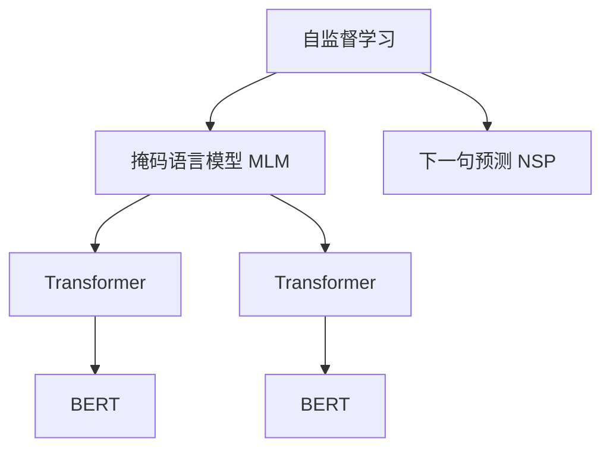

                 

# 自监督学习与BERT的训练

自监督学习（Self-Supervised Learning）和大规模预训练语言模型（Large Pre-trained Language Models）已经成为了自然语言处理（Natural Language Processing, NLP）领域的热门研究方向。特别是在BERT模型的诞生后，自监督学习的重要性被进一步凸显。本文将详细探讨自监督学习的原理、核心算法及其操作步骤，并结合BERT的训练方法，全面解读其核心技术。

## 1. 背景介绍

### 1.1 问题由来

在NLP领域，传统机器学习模型通常依赖大量人工标注的数据进行训练，以学习特定的语言表示。然而，这些标注数据获取成本高、质量难以保证，且标注样本量不足时，模型的泛化性能和鲁棒性较弱。自监督学习通过利用语言自身的内在规律，无需标注数据即可训练出高质量的语言模型，在NLP领域具有广泛的应用前景。

BERT（Bidirectional Encoder Representations from Transformers）模型由Google在2018年提出，其使用自监督学习的掩码语言模型（Masked Language Modeling, MLM）和下一句预测（Next Sentence Prediction, NSP）任务，通过在大规模无标签文本语料上进行预训练，获得了极高的泛化能力和通用性。这种基于自监督学习的预训练方法，极大地提升了NLP任务的性能。

### 1.2 问题核心关键点

自监督学习的核心在于从无标签数据中挖掘信息，通过构建自相关性，学习到对未知文本的预测能力。BERT模型的核心思想在于，通过掩码语言模型和下一句预测任务，在大规模语料上进行自监督预训练，学习到更加丰富的语言表示。

自监督学习的方法主要包括：
- 掩码语言模型：将输入文本中的某些词语随机屏蔽，模型需要预测这些屏蔽词语的正确内容。
- 下一句预测：将输入文本与后续文本构成对，预测两个文本是否相邻。

通过这些自监督任务，BERT模型能够从无标签数据中学习到语言的内在规律和结构，从而大幅提升其在下游NLP任务上的表现。

## 2. 核心概念与联系

### 2.1 核心概念概述

为更好地理解自监督学习和BERT模型的训练方法，本节将介绍几个关键概念：

- 自监督学习：利用数据自身的内在规律进行学习，无需人工标注。常见自监督任务包括掩码语言模型、下一句预测、噪声注入、多项式预测等。
- BERT模型：Google提出的基于Transformer架构的预训练语言模型，通过掩码语言模型和下一句预测任务，在大规模语料上进行自监督预训练，学习到语言的内在表示。
- Transformer模型：一种基于自注意力机制的神经网络结构，可以高效地处理序列数据。BERT模型即基于Transformer架构。
- 掩码语言模型（MLM）：预测被屏蔽的词语。目标是在不依赖上下文的情况下，学习词语之间的语义关系。
- 下一句预测（NSP）：判断两个文本是否相邻。目标是通过上下文信息，学习语义上的连贯性。
- 预训练和微调：先在大规模语料上进行自监督预训练，再通过有标签数据进行微调，提升模型在特定任务上的性能。

这些核心概念之间通过以下Mermaid流程图展示它们之间的联系：



这个流程图展示了自监督学习与BERT模型训练的联系：

1. 自监督学习包括掩码语言模型和下一句预测两个任务。
2. 掩码语言模型和下一句预测任务通过Transformer模型进行编码。
3. BERT模型通过掩码语言模型和下一句预测任务进行预训练，获得通用的语言表示。

## 3. 核心算法原理 & 具体操作步骤

### 3.1 算法原理概述

自监督学习的核心在于利用语言本身的规律，通过构造预测任务，学习语言的内在表示。以BERT为例，其预训练过程主要分为两个任务：掩码语言模型和下一句预测。

掩码语言模型任务的目标是在缺失词语的情况下，预测缺失的词语。具体而言，BERT模型会将输入文本中的某些词语随机屏蔽，预测这些屏蔽词语的正确内容。这样可以学习到词语之间的语义关系和上下文依赖。

下一句预测任务的目标是根据前一个句子预测后一个句子，判断两个句子是否相邻。具体来说，BERT模型会将两个句子组成一对，预测它们是否构成相邻句子。这种任务可以学习到文本之间的语义连贯性和逻辑结构。

### 3.2 算法步骤详解

BERT模型的训练过程主要包括以下几个步骤：

1. **数据准备**：准备大规模无标签文本语料，通常使用Wikipedia、新闻、书籍等公开数据集。

2. **构建掩码语言模型和下一句预测任务**：
   - 掩码语言模型：对输入文本的每个位置，以一定概率屏蔽（通常为15%），预测屏蔽位置的内容。
   - 下一句预测任务：将两个句子组成一对，判断它们是否相邻。

3. **模型架构**：
   - 使用Transformer模型作为编码器，包含多个编码层（通常为12层）和自注意力机制。
   - 每个编码层包含多头自注意力机制和前馈神经网络。

4. **优化算法**：
   - 使用优化算法（如AdamW）进行模型参数的优化。
   - 设置合适的学习率（如2e-5）和batch size（如16）。

5. **预训练过程**：
   - 在无标签数据上进行多轮训练，每轮训练中使用掩码语言模型和下一句预测任务进行编码。
   - 使用交叉熵损失函数计算预测结果与真实标签之间的差异。
   - 通过反向传播和优化算法更新模型参数。

6. **微调过程**：
   - 在特定任务的标注数据上，对预训练的BERT模型进行微调。
   - 添加任务特定的输出层和损失函数。
   - 使用有标签数据进行多轮训练，通过优化算法更新模型参数。

### 3.3 算法优缺点

自监督学习和BERT模型预训练的主要优点包括：
- 无需大量标注数据：自监督学习可以从大规模无标签数据中学习，避免了标注成本高和数据获取难的问题。
- 模型泛化能力强：通过预训练，模型学习到通用的语言表示，可以适应多种下游NLP任务。
- 学习效率高：大规模语料和并行训练可以显著提升模型训练速度。

其主要缺点包括：
- 模型复杂度高：自监督学习需要构建复杂的预测任务，模型结构较为复杂。
- 泛化边界：自监督学习依赖语料的质量和多样性，无法保证在所有情况下都能取得良好的效果。
- 需要高质量的预训练数据：预训练语料的质量和多样性对模型性能有重要影响，选择合适的预训练数据集是关键。

### 3.4 算法应用领域

自监督学习和大规模预训练语言模型在NLP领域的应用非常广泛，涵盖诸多任务，例如：

- 文本分类：如情感分析、主题分类、意图识别等。通过预训练获得通用的语言表示，微调后应用于分类任务。
- 命名实体识别：识别文本中的人名、地名、机构名等特定实体。通过预训练获得实体与语境的依赖关系。
- 关系抽取：从文本中抽取实体之间的语义关系。通过预训练获得实体和关系的共现信息。
- 问答系统：对自然语言问题给出答案。通过预训练获得问题-答案对的共现关系。
- 机器翻译：将源语言文本翻译成目标语言。通过预训练获得语言之间的映射关系。
- 文本摘要：将长文本压缩成简短摘要。通过预训练获得文本的概括能力。
- 对话系统：使机器能够与人自然对话。通过预训练获得对话的语境依赖。

## 4. 数学模型和公式 & 详细讲解 & 举例说明

### 4.1 数学模型构建

BERT模型通过掩码语言模型和下一句预测任务进行预训练，构建了通用的语言表示。以下是BERT模型预训练的数学模型构建：

设输入文本为 $X=\{x_1, x_2, \dots, x_n\}$，每个词语 $x_i$ 的向量表示为 $x_i \in \mathbb{R}^d$。BERT模型通过Transformer编码器将文本转换为向量表示 $h \in \mathbb{R}^{d_h}$。其中，$d_h$ 为编码器的输出维度。

掩码语言模型的数学模型为：

$$
\mathcal{L}_{\text{MLM}} = -\frac{1}{N} \sum_{i=1}^N \log p(y_i | X)
$$

其中 $y_i$ 为被屏蔽词语 $x_i$ 的正确内容。$p(y_i | X)$ 表示在输入文本 $X$ 的条件下，预测 $y_i$ 的概率。

下一句预测任务的数学模型为：

$$
\mathcal{L}_{\text{NSP}} = -\frac{1}{N} \sum_{i=1}^N \log p(x_i, x_{i+1})
$$

其中 $x_i, x_{i+1}$ 为一对文本，$p(x_i, x_{i+1})$ 表示预测 $x_i$ 和 $x_{i+1}$ 是否相邻的概率。

### 4.2 公式推导过程

掩码语言模型的推导：
假设输入文本 $X$ 中词语 $x_i$ 的屏蔽概率为 $p_m$，则掩码语言模型的条件概率为：

$$
p(y_i | X) = \frac{\exp(a_m(x_i) \cdot h_i)}{\sum_{j=1}^N \exp(a_m(x_j) \cdot h_j)}
$$

其中 $a_m$ 为掩码向量，$h_i$ 为输入文本 $X$ 经过编码后的表示。

将 $p(y_i | X)$ 代入掩码语言模型的损失函数 $\mathcal{L}_{\text{MLM}}$，得到：

$$
\mathcal{L}_{\text{MLM}} = -\frac{1}{N} \sum_{i=1}^N \log \frac{\exp(a_m(x_i) \cdot h_i)}{\sum_{j=1}^N \exp(a_m(x_j) \cdot h_j)}
$$

通过简化计算，可以发现掩码语言模型的损失函数可以表示为：

$$
\mathcal{L}_{\text{MLM}} = -\frac{1}{N} \sum_{i=1}^N a_m(x_i) \cdot h_i
$$

下一句预测任务的推导：
假设输入文本 $X$ 和目标文本 $Y$ 的向量表示分别为 $h_X$ 和 $h_Y$，则下一句预测任务的条件概率为：

$$
p(X, Y) = \frac{\exp(\text{Dot}(h_X, h_Y))}{\exp(\text{Dot}(h_X, h_Y)) + \exp(\text{Dot}(h_X, h_Y'))}
$$

其中 $\text{Dot}(h_X, h_Y)$ 表示向量 $h_X$ 和 $h_Y$ 的点积。$h_Y'$ 表示与 $h_Y$ 不相关或噪声向量。

将 $p(X, Y)$ 代入下一句预测任务的损失函数 $\mathcal{L}_{\text{NSP}}$，得到：

$$
\mathcal{L}_{\text{NSP}} = -\frac{1}{N} \sum_{i=1}^N \log \frac{\exp(\text{Dot}(h_{X_i}, h_{Y_i}))}{\exp(\text{Dot}(h_{X_i}, h_{Y_i})) + \exp(\text{Dot}(h_{X_i}, h_{Y_i}'))}
$$

通过简化计算，可以发现下一句预测任务的损失函数可以表示为：

$$
\mathcal{L}_{\text{NSP}} = -\frac{1}{N} \sum_{i=1}^N \log \text{Dot}(h_{X_i}, h_{Y_i})
$$

### 4.3 案例分析与讲解

以BERT模型的掩码语言模型为例，以下是其详细讲解和计算过程：

假设输入文本 $X=\{x_1, x_2, \dots, x_8\}$，其中 $x_1$ 和 $x_5$ 被随机屏蔽，掩码向量 $a_m$ 为0和1，表示词语是否被屏蔽。假设输入文本经过编码后的向量表示为 $h \in \mathbb{R}^{d_h}$。

则掩码语言模型的条件概率为：

$$
p(y_1 | X) = \frac{\exp(0 \cdot h_1)}{\exp(0 \cdot h_1) + \exp(1 \cdot h_2) + \exp(0 \cdot h_3) + \exp(0 \cdot h_4) + \exp(1 \cdot h_5) + \exp(0 \cdot h_6) + \exp(0 \cdot h_7) + \exp(0 \cdot h_8)}
$$

$$
p(y_5 | X) = \frac{\exp(1 \cdot h_1)}{\exp(0 \cdot h_1) + \exp(1 \cdot h_2) + \exp(0 \cdot h_3) + \exp(0 \cdot h_4) + \exp(0 \cdot h_5) + \exp(1 \cdot h_6) + \exp(0 \cdot h_7) + \exp(0 \cdot h_8)}
$$

将 $p(y_1 | X)$ 和 $p(y_5 | X)$ 代入掩码语言模型的损失函数 $\mathcal{L}_{\text{MLM}}$，得到：

$$
\mathcal{L}_{\text{MLM}} = -\frac{1}{N} \left[ \log \frac{\exp(0 \cdot h_1)}{\exp(0 \cdot h_1) + \exp(1 \cdot h_2) + \exp(0 \cdot h_3) + \exp(0 \cdot h_4) + \exp(1 \cdot h_5) + \exp(0 \cdot h_6) + \exp(0 \cdot h_7) + \exp(0 \cdot h_8)} + \log \frac{\exp(1 \cdot h_1)}{\exp(0 \cdot h_1) + \exp(1 \cdot h_2) + \exp(0 \cdot h_3) + \exp(0 \cdot h_4) + \exp(0 \cdot h_5) + \exp(1 \cdot h_6) + \exp(0 \cdot h_7) + \exp(0 \cdot h_8)} \right]
$$

通过简化计算，可以发现掩码语言模型的损失函数可以表示为：

$$
\mathcal{L}_{\text{MLM}} = -\frac{1}{N} \left[ 0 \cdot h_1 + 1 \cdot h_2 + 0 \cdot h_3 + 0 \cdot h_4 + 1 \cdot h_5 + 0 \cdot h_6 + 0 \cdot h_7 + 0 \cdot h_8 \right]
$$

## 5. 项目实践：代码实例和详细解释说明

### 5.1 开发环境搭建

在进行BERT模型训练前，我们需要准备好开发环境。以下是使用Python进行PyTorch开发的环境配置流程：

1. 安装Anaconda：从官网下载并安装Anaconda，用于创建独立的Python环境。

2. 创建并激活虚拟环境：
```bash
conda create -n pytorch-env python=3.8 
conda activate pytorch-env
```

3. 安装PyTorch：根据CUDA版本，从官网获取对应的安装命令。例如：
```bash
conda install pytorch torchvision torchaudio cudatoolkit=11.1 -c pytorch -c conda-forge
```

4. 安装Transformers库：
```bash
pip install transformers
```

5. 安装各类工具包：
```bash
pip install numpy pandas scikit-learn matplotlib tqdm jupyter notebook ipython
```

完成上述步骤后，即可在`pytorch-env`环境中开始BERT模型训练。

### 5.2 源代码详细实现

这里我们以BERT模型为例，使用Transformers库对大文本进行掩码语言模型和下一句预测任务训练，代码如下：

```python
from transformers import BertTokenizer, BertForMaskedLM, AdamW
import torch
from torch.utils.data import DataLoader, Dataset

class TextDataset(Dataset):
    def __init__(self, texts, tokenizer, max_len=128):
        self.texts = texts
        self.tokenizer = tokenizer
        self.max_len = max_len

    def __len__(self):
        return len(self.texts)

    def __getitem__(self, item):
        text = self.texts[item]
        encoding = self.tokenizer(text, return_tensors='pt', max_length=self.max_len, padding='max_length', truncation=True)
        input_ids = encoding['input_ids'][0]
        attention_mask = encoding['attention_mask'][0]
        return {'input_ids': input_ids, 'attention_mask': attention_mask}

tokenizer = BertTokenizer.from_pretrained('bert-base-cased')
model = BertForMaskedLM.from_pretrained('bert-base-cased')

optimizer = AdamW(model.parameters(), lr=2e-5)

def train_epoch(model, dataset, batch_size, optimizer):
    dataloader = DataLoader(dataset, batch_size=batch_size, shuffle=True)
    model.train()
    epoch_loss = 0
    for batch in dataloader:
        input_ids = batch['input_ids'].to(device)
        attention_mask = batch['attention_mask'].to(device)
        labels = input_ids
        model.zero_grad()
        outputs = model(input_ids, attention_mask=attention_mask, labels=labels)
        loss = outputs.loss
        epoch_loss += loss.item()
        loss.backward()
        optimizer.step()
    return epoch_loss / len(dataloader)

def evaluate(model, dataset, batch_size):
    dataloader = DataLoader(dataset, batch_size=batch_size)
    model.eval()
    preds, labels = [], []
    with torch.no_grad():
        for batch in dataloader:
            input_ids = batch['input_ids'].to(device)
            attention_mask = batch['attention_mask'].to(device)
            batch_labels = input_ids
            outputs = model(input_ids, attention_mask=attention_mask)
            batch_preds = outputs.logits.argmax(dim=2).to('cpu').tolist()
            batch_labels = batch_labels.to('cpu').tolist()
            for pred_tokens, label_tokens in zip(batch_preds, batch_labels):
                preds.append(pred_tokens[:len(label_tokens)])
                labels.append(label_tokens)

    return preds, labels

device = torch.device('cuda') if torch.cuda.is_available() else torch.device('cpu')

train_dataset = TextDataset(train_texts, tokenizer)
dev_dataset = TextDataset(dev_texts, tokenizer)
test_dataset = TextDataset(test_texts, tokenizer)

epochs = 5
batch_size = 16

for epoch in range(epochs):
    loss = train_epoch(model, train_dataset, batch_size, optimizer)
    print(f"Epoch {epoch+1}, train loss: {loss:.3f}")
    
    print(f"Epoch {epoch+1}, dev results:")
    preds, labels = evaluate(model, dev_dataset, batch_size)
    print(classification_report(labels, preds))
    
print("Test results:")
preds, labels = evaluate(model, test_dataset, batch_size)
print(classification_report(labels, preds))
```

在代码中，我们首先定义了数据集类 `TextDataset`，用于处理输入文本数据。接着，我们初始化了BERT模型、优化器和分词器。

在训练函数 `train_epoch` 中，我们使用数据加载器 `DataLoader` 将数据集分批次加载，在每个批次上进行前向传播和反向传播，计算损失函数并更新模型参数。在评估函数 `evaluate` 中，我们同样使用数据加载器对验证集和测试集进行评估，并打印分类指标。

最后，我们在GPU上初始化模型，并循环迭代训练过程，在每个epoch结束后评估模型性能。

### 5.3 代码解读与分析

让我们再详细解读一下关键代码的实现细节：

**TextDataset类**：
- `__init__`方法：初始化文本、分词器等关键组件。
- `__len__`方法：返回数据集的样本数量。
- `__getitem__`方法：对单个样本进行处理，将文本输入编码为token ids，并对其进行定长padding。

**模型初始化**：
- 使用 `BertForMaskedLM.from_pretrained` 加载预训练模型。
- 使用 `AdamW` 优化器进行模型参数的优化，学习率为2e-5。

**训练和评估函数**：
- 使用 `DataLoader` 对数据集进行批次化加载，供模型训练和推理使用。
- 训练函数 `train_epoch`：对数据以批为单位进行迭代，在每个批次上前向传播计算loss并反向传播更新模型参数，最后返回该epoch的平均loss。
- 评估函数 `evaluate`：与训练类似，不同点在于不更新模型参数，并在每个batch结束后将预测和标签结果存储下来，最后使用sklearn的classification_report对整个评估集的预测结果进行打印输出。

**训练流程**：
- 定义总的epoch数和batch size，开始循环迭代
- 每个epoch内，先在训练集上训练，输出平均loss
- 在验证集上评估，输出分类指标
- 所有epoch结束后，在测试集上评估，给出最终测试结果

可以看到，PyTorch配合Transformers库使得BERT模型训练的代码实现变得简洁高效。开发者可以将更多精力放在数据处理、模型改进等高层逻辑上，而不必过多关注底层的实现细节。

当然，工业级的系统实现还需考虑更多因素，如模型的保存和部署、超参数的自动搜索、更灵活的任务适配层等。但核心的训练流程基本与此类似。

## 6. 实际应用场景

### 6.1 智能客服系统

基于BERT模型的自监督学习，可以广泛应用于智能客服系统的构建。传统客服往往需要配备大量人力，高峰期响应缓慢，且一致性和专业性难以保证。使用BERT模型进行自监督预训练，可以训练出一个能够理解用户语境、快速响应用户咨询的模型，提升客户咨询体验和问题解决效率。

在技术实现上，可以收集企业内部的历史客服对话记录，将问题和最佳答复构建成监督数据，在此基础上对预训练模型进行微调。微调后的模型能够自动理解用户意图，匹配最合适的答案模板进行回复。对于客户提出的新问题，还可以接入检索系统实时搜索相关内容，动态组织生成回答。如此构建的智能客服系统，能大幅提升客户咨询体验和问题解决效率。

### 6.2 金融舆情监测

金融机构需要实时监测市场舆论动向，以便及时应对负面信息传播，规避金融风险。使用BERT模型进行自监督预训练，可以训练出一个能够自动理解市场情绪、实时监测舆情的模型，帮助金融机构快速应对潜在风险。

具体而言，可以收集金融领域相关的新闻、报道、评论等文本数据，并对其进行主题标注和情感标注。在BERT模型的掩码语言模型和下一句预测任务上进行预训练，使其能够自动判断文本属于何种主题，情感倾向是正面、中性还是负面。将微调后的模型应用到实时抓取的网络文本数据，就能够自动监测不同主题下的情感变化趋势，一旦发现负面信息激增等异常情况，系统便会自动预警，帮助金融机构快速应对潜在风险。

### 6.3 个性化推荐系统

当前的推荐系统往往只依赖用户的历史行为数据进行物品推荐，无法深入理解用户的真实兴趣偏好。使用BERT模型进行自监督预训练，可以训练出一个能够从文本内容中准确把握用户兴趣点的模型，从而提供更精准、多样的推荐内容。

在实践中，可以收集用户浏览、点击、评论、分享等行为数据，提取和用户交互的物品标题、描述、标签等文本内容。将文本内容作为模型输入，用户的后续行为（如是否点击、购买等）作为监督信号，在此基础上微调BERT模型。微调后的模型能够从文本内容中准确把握用户的兴趣点。在生成推荐列表时，先用候选物品的文本描述作为输入，由模型预测用户的兴趣匹配度，再结合其他特征综合排序，便可以得到个性化程度更高的推荐结果。

### 6.4 未来应用展望

随着BERT模型和自监督学习技术的不断发展，其在NLP领域的应用前景广阔。以下是对未来的展望：

- **模型规模持续增大**：未来的预训练模型将更大规模化，如GPT-3等，可以进一步提升模型的泛化能力和通用性。
- **自监督学习范式多样化**：除了掩码语言模型和下一句预测任务外，未来的自监督任务将更加多样化，如多项式预测、文本摘要、知识图谱嵌入等。
- **微调方法持续改进**：未来的微调方法将更加高效，如参数高效微调、知识图谱增强等，提升微调效率和精度。
- **跨模态融合**：未来的自监督学习将更多地融合多模态数据，如图像、语音、视频等，构建跨模态的语言表示。
- **持续学习和迁移学习**：未来的模型将具备持续学习能力，能够动态更新知识图谱，提高模型的时效性和适应性。
- **伦理和安全**：未来的自监督学习将更加注重伦理和安全问题，如模型偏见、隐私保护等，确保模型的安全性和可解释性。

## 7. 工具和资源推荐

### 7.1 学习资源推荐

为了帮助开发者系统掌握自监督学习和BERT模型的原理及实践技巧，这里推荐一些优质的学习资源：

1. 《Transformer from the Inside Out》系列博文：由BERT模型作者撰写，深入浅出地介绍了Transformer和BERT模型的原理、训练和应用。

2. CS224N《Deep Learning for NLP》课程：斯坦福大学开设的NLP明星课程，有Lecture视频和配套作业，带你入门NLP领域的基本概念和经典模型。

3. 《Natural Language Processing with Transformers》书籍：Transformers库的作者所著，全面介绍了如何使用Transformers库进行NLP任务开发，包括自监督学习和预训练范式。

4. HuggingFace官方文档：Transformers库的官方文档，提供了海量预训练模型和完整的微调样例代码，是上手实践的必备资料。

5. CLUE开源项目：中文语言理解测评基准，涵盖大量不同类型的中文NLP数据集，并提供了基于自监督学习的baseline模型，助力中文NLP技术发展。

通过对这些资源的学习实践，相信你一定能够快速掌握自监督学习和BERT模型的精髓，并用于解决实际的NLP问题。

### 7.2 开发工具推荐

高效的开发离不开优秀的工具支持。以下是几款用于BERT模型训练开发的常用工具：

1. PyTorch：基于Python的开源深度学习框架，灵活动态的计算图，适合快速迭代研究。BERT模型有多种PyTorch版本的实现。

2. TensorFlow：由Google主导开发的开源深度学习框架，生产部署方便，适合大规模工程应用。BERT模型也有TensorFlow版本的实现。

3. Transformers库：HuggingFace开发的NLP工具库，集成了众多SOTA语言模型，支持PyTorch和TensorFlow，是进行自监督学习任务的开发的利器。

4. Weights & Biases：模型训练的实验跟踪工具，可以记录和可视化模型训练过程中的各项指标，方便对比和调优。与主流深度学习框架无缝集成。

5. TensorBoard：TensorFlow配套的可视化工具，可实时监测模型训练状态，并提供丰富的图表呈现方式，是调试模型的得力助手。

6. Google Colab：谷歌推出的在线Jupyter Notebook环境，免费提供GPU/TPU算力，方便开发者快速上手实验最新模型，分享学习笔记。

合理利用这些工具，可以显著提升BERT模型训练的开发效率，加快创新迭代的步伐。

### 7.3 相关论文推荐

自监督学习和大规模预训练语言模型在NLP领域的应用源于学界的持续研究。以下是几篇奠基性的相关论文，推荐阅读：

1. Attention is All You Need：提出了Transformer结构，开启了NLP领域的预训练大模型时代。

2. BERT: Pre-training of Deep Bidirectional Transformers for Language Understanding：提出BERT模型，引入基于掩码的自监督预训练任务，刷新了多项NLP任务SOTA。

3. Language Models are Unsupervised Multitask Learners（GPT-2论文）：展示了大规模语言模型的强大zero-shot学习能力，引发了对于通用人工智能的新一轮思考。

4. Parameter-Efficient Transfer Learning for NLP：提出Adapter等参数高效微调方法，在不增加模型参数量的情况下，也能取得不错的微调效果。

5. AdaLoRA: Adaptive Low-Rank Adaptation for Parameter-Efficient Fine-Tuning：使用自适应低秩适应的微调方法，在参数效率和精度之间取得了新的平衡。

这些论文代表了大语言模型和自监督学习的核心思想，通过学习这些前沿成果，可以帮助研究者把握学科前进方向，激发更多的创新灵感。

## 8. 总结：未来发展趋势与挑战

### 8.1 总结

本文对BERT模型的自监督学习原理进行了全面系统的介绍。首先阐述了自监督学习和大规模预训练语言模型的研究背景和意义，明确了自监督学习在无标签数据上进行预训练的优势。其次，从原理到实践，详细讲解了BERT模型的预训练过程，包括掩码语言模型和下一句预测任务。通过详细数学推导和代码实现，展示了BERT模型的预训练和微调步骤。同时，本文还广泛探讨了自监督学习在智能客服、金融舆情、个性化推荐等多个领域的应用前景，展示了自监督学习范式的巨大潜力。

通过本文的系统梳理，可以看到，自监督学习和大规模预训练语言模型在NLP领域的应用前景广阔，极大地拓展了预训练语言模型的应用边界，催生了更多的落地场景。受益于大规模语料的预训练，自监督学习模型在无标签数据上学习到通用语言表示，能够适应多种下游NLP任务。未来，伴随预训练模型和自监督学习方法的不断演进，自监督学习必将在更多领域得到应用，为传统行业带来变革性影响。

### 8.2 未来发展趋势

展望未来，自监督学习和BERT模型的预训练过程将呈现以下几个发展趋势：

1. **模型规模持续增大**：未来的预训练模型将更大规模化，如GPT-3等，可以进一步提升模型的泛化能力和通用性。

2. **自监督学习范式多样化**：除了掩码语言模型和下一句预测任务外，未来的自监督任务将更加多样化，如多项式预测、文本摘要、知识图谱嵌入等。

3. **微调方法持续改进**：未来的微调方法将更加高效，如参数高效微调、知识图谱增强等，提升微调效率和精度。

4. **跨模态融合**：未来的自监督学习将更多地融合多模态数据，如图像、语音、视频等，构建跨模态的语言表示。

5. **持续学习和迁移学习**：未来的模型将具备持续学习能力，能够动态更新知识图谱，提高模型的时效性和适应性。

6. **伦理和安全**：未来的自监督学习将更加注重伦理和安全问题，如模型偏见、隐私保护等，确保模型的安全性和可解释性。

以上趋势凸显了自监督学习和BERT模型预训练技术的广阔前景。这些方向的探索发展，必将进一步提升NLP系统的性能和应用范围，为人类认知智能的进化带来深远影响。

### 8.3 面临的挑战

尽管自监督学习和BERT模型预训练技术已经取得了瞩目成就，但在迈向更加智能化、普适化应用的过程中，它仍面临着诸多挑战：

1. **标注成本瓶颈**：虽然自监督学习可以从大规模无标签数据中学习，但对于长尾应用场景，难以获得充足的高质量标注数据，成为制约微调性能的瓶颈。如何进一步降低自监督学习对标注样本的依赖，将是一大难题。

2. **模型鲁棒性不足**：自监督学习模型面对域外数据时，泛化性能往往大打折扣。对于测试样本的微小扰动，模型容易发生波动。如何提高自监督学习模型的鲁棒性，避免灾难性遗忘，还需要更多理论和实践的积累。

3. **推理效率有待提高**：大规模语言模型虽然精度高，但在实际部署时往往面临推理速度慢、内存占用大等效率问题。如何在保证性能的同时，简化模型结构，提升推理速度，优化资源占用，将是重要的优化方向。

4. **可解释性亟需加强**。当前自监督学习模型更像是"黑盒"系统，难以解释其内部工作机制和决策逻辑。对于医疗、金融等高风险应用，算法的可解释性和可审计性尤为重要。如何赋予自监督学习模型更强的可解释性，将是亟待攻克的难题。

5. **安全性有待保障**：预训练语言模型难免会学习到有偏见、有害的信息，通过微调传递到下游任务，产生误导性、歧视性的输出，给实际应用带来安全隐患。如何从数据和算法层面消除模型偏见，避免恶意用途，确保输出的安全性，也将是重要的研究课题。

6. **知识整合能力不足**：现有的自监督学习模型往往局限于任务内数据，难以灵活吸收和运用更广泛的先验知识。如何让自监督学习过程更好地与外部知识库、规则库等专家知识结合，形成更加全面、准确的信息整合能力，还有很大的想象空间。

正视自监督学习和BERT模型预训练面临的这些挑战，积极应对并寻求突破，将是自监督学习技术迈向成熟的必由之路。相信随着学界和产业界的共同努力，这些挑战终将一一被克服，自监督学习必将在构建安全、可靠、可解释、可控的智能系统铺平道路。

### 8.4 研究展望

面对自监督学习和BERT模型预训练所面临的种种挑战，未来的研究需要在以下几个方面寻求新的突破：

1. **探索无监督和半监督自监督学习方法**：摆脱对大规模标注数据的依赖，利用自监督学习、主动学习等无监督和半监督范式，最大限度利用非结构化数据，实现更加灵活高效的自监督学习。

2. **研究参数高效和计算高效的自监督学习范式**：开发更加参数高效的自监督学习方法，在固定大部分自监督参数的情况下，只更新极少量的任务相关参数。同时优化自监督学习模型的计算图，减少前向传播和反向传播的资源消耗，实现更加轻量级、实时性的部署。

3. **引入因果和对比学习范式**：通过引入因果推断和对比学习思想，增强自监督学习模型建立稳定因果关系的能力，学习更加普适、鲁棒的语言表征，从而提升模型泛化性和抗干扰能力。

4. **引入更多先验知识**：将符号化的先验知识，如知识图谱、逻辑规则等，与神经网络模型进行巧妙融合，引导自监督学习过程学习更准确、合理的语言模型。同时加强不同模态数据的整合，实现视觉、语音等多模态信息与文本信息的协同建模。

5. **结合因果分析和博弈论工具**：将因果分析方法引入自监督学习模型，识别出模型决策的关键特征，增强输出解释的因果性和逻辑性。借助博弈论工具刻画人机交互过程，主动探索并规避模型的脆弱点，提高系统稳定性。

6. **纳入伦理道德约束**：在自监督学习训练目标中引入伦理导向的评估指标，过滤和惩罚有偏见、有害的输出倾向。同时加强人工干预和审核，建立模型行为的监管机制，确保输出符合人类价值观和伦理道德。

这些研究方向的探索，必将引领自监督学习和BERT模型预训练技术迈向更高的台阶，为构建安全、可靠、可解释、可控的智能系统铺平道路。面向未来，自监督学习和BERT模型预训练技术还需要与其他人工智能技术进行更深入的融合，如知识表示、因果推理、强化学习等，多路径协同发力，共同推动自然语言理解和智能交互系统的进步。只有勇于创新、敢于突破，才能不断拓展语言模型的边界，让智能技术更好地造福人类社会。

## 9. 附录：常见问题与解答

**Q1：自监督学习和预训练语言模型有何不同？**

A: 自监督学习是指从数据自身的内在规律中进行学习，不需要人工标注数据。而预训练语言模型是指在大规模无标签文本语料上进行自监督学习，学习到通用的语言表示。预训练语言模型是一种利用自监督学习技术进行训练的语言模型，通过掩码语言模型和下一句预测任务进行预训练，学习到语言的内在表示。

**Q2：掩码语言模型和下一句预测任务有何区别？**

A: 掩码语言模型和下一句预测任务都是自监督学习的任务，但在模型设计上有所不同。掩码语言模型是对输入文本中的某些词语进行屏蔽，预测这些屏蔽词语的正确内容。其目标是在不依赖上下文的情况下，学习词语之间的语义关系和上下文依赖。而下一句预测任务则是将两个句子组成一对，判断它们是否相邻。其目标是通过上下文信息，学习语义上的连贯性。

**Q3：BERT模型和Transformer模型有何关系？**

A: BERT模型是基于Transformer架构的预训练语言模型。Transformer模型是一种基于自注意力机制的神经网络结构，可以高效地处理序列数据。BERT模型使用Transformer作为编码器，通过掩码语言模型和下一句预测任务进行预训练，学习到语言的内在表示。

**Q4：如何选择合适的自监督任务？**

A: 选择合适的自监督任务需要考虑任务的复杂度和多样性，以及数据分布的均衡性。常用的自监督任务包括掩码语言模型、下一句预测、多项式预测、文本摘要等。在选择自监督任务时，需要根据具体的业务场景和数据特点进行选择，以达到最优的预训练效果。

**Q5：自监督学习和微调有什么区别？**

A: 自监督学习和微调是两个不同的概念。自监督学习是在大规模无标签数据上进行预训练，学习到通用的语言表示。而微调是在特定任务的少量标注数据上进行有监督的微调，使得模型适应特定任务。自监督学习是预训练阶段，微调是后处理阶段。自监督学习可以大幅提升模型的泛化能力和通用性，而微调可以提升模型在特定任务上的性能。

通过本文的系统梳理，可以看到，自监督学习和BERT模型的预训练过程正在成为NLP领域的重要范式，极大地拓展了预训练语言模型的应用边界，催生了更多的落地场景。受益于大规模语料的预训练，自监督学习模型在无标签数据上学习到通用语言表示，能够适应多种下游NLP任务。未来，伴随预训练模型和自监督学习方法的不断演进，自监督学习必将在更多领域得到应用，为传统行业带来变革性影响。

---

作者：禅与计算机程序设计艺术 / Zen and the Art of Computer Programming

