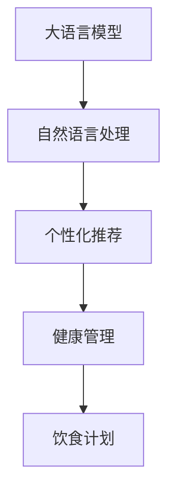

                 

# 营养计划定制：LLM 助力健康生活

> 关键词：大语言模型(Large Language Model, LLM), 自然语言处理(Natural Language Processing, NLP), 个性化推荐, 健康管理, 饮食计划

## 1. 背景介绍

### 1.1 问题由来
在当前社会，健康生活日益受到人们的重视。合理的营养计划是健康生活的重要组成部分，然而，制定符合个人体质和健康需求的个性化营养计划一直是一个挑战。传统的营养计划制定方法通常依赖于专业人士的指导或根据通用的营养标准进行简单的划分，难以满足个体差异性和个性化需求。

与此同时，人工智能技术的快速发展为营养计划定制提供了新的可能性。大语言模型(Large Language Model, LLM)作为当前最先进的人工智能技术之一，具有强大的语言理解和生成能力，能够通过自然语言处理(Natural Language Processing, NLP)技术，理解和分析用户需求，生成个性化的营养计划。

### 1.2 问题核心关键点
本文将详细探讨基于大语言模型的个性化营养计划定制方法，其核心关键点包括：
- 大语言模型在个性化推荐中的应用。
- 如何从用户描述中提取健康需求。
- 营养知识库的构建与查询。
- 个性化营养计划的生成与优化。
- 评估和反馈机制的设计。

### 1.3 问题研究意义
本文的研究意义主要体现在以下几个方面：
- 提升营养计划定制的个性化和精准度，更好地满足用户健康需求。
- 通过大语言模型技术，推动个性化营养计划从专业指导向AI自动生成的转变，降低营养计划定制的门槛。
- 探索健康管理领域的智能应用，为健康产业的发展提供新的技术支持。

## 2. 核心概念与联系

### 2.1 核心概念概述

为更好地理解基于大语言模型的营养计划定制方法，本节将介绍几个密切相关的核心概念：

- 大语言模型(Large Language Model, LLM)：以自回归(如GPT)或自编码(如BERT)模型为代表的大规模预训练语言模型。通过在大规模无标签文本语料上进行预训练，学习通用的语言表示，具备强大的语言理解和生成能力。

- 自然语言处理(Natural Language Processing, NLP)：使用计算机处理、理解、分析和生成人类语言的技术。NLP技术在大语言模型的基础上，进一步细化了语言信息的处理和利用。

- 个性化推荐：通过分析用户行为和偏好，推荐符合用户需求的产品或服务。在大语言模型的帮助下，个性化推荐可以进一步扩展到更为复杂的健康营养领域。

- 健康管理：通过监测和干预用户的健康行为，达到预防和改善健康状态的目的。个性化营养计划是大健康管理中重要的一环。

- 饮食计划：根据用户的健康需求和饮食习惯，制定出合理且可行的营养食谱和饮食安排。

这些核心概念之间的逻辑关系可以通过以下Mermaid流程图来展示：



这个流程图展示了大语言模型在个性化推荐、健康管理和饮食计划中的作用。通过自然语言处理技术，大语言模型能够理解和分析用户需求，生成个性化的推荐方案，进而帮助用户进行健康管理和饮食计划的制定。

## 3. 核心算法原理 & 具体操作步骤
### 3.1 算法原理概述

基于大语言模型的个性化营养计划定制，本质上是一个有监督的推荐系统任务。其核心思想是：将大语言模型视作一个强大的“推荐引擎”，通过分析用户的自然语言描述，提取健康需求，从健康知识库中查询相关信息，生成个性化的饮食计划。

形式化地，假设用户描述为 $X$，健康知识库为 $K$，生成的饮食计划为 $Y$，则推荐过程可以表示为：

$$
Y = f(X, K)
$$

其中 $f$ 为推荐函数，$X$ 和 $K$ 分别表示用户描述和健康知识库，$Y$ 为生成的饮食计划。

推荐函数 $f$ 的目标是最小化预测值和实际值之间的差距，即损失函数：

$$
\mathcal{L}(f) = \sum_{i=1}^n (y_i - \hat{y}_i)^2
$$

其中 $y_i$ 为实际饮食计划，$\hat{y}_i$ 为预测饮食计划。

通过梯度下降等优化算法，推荐函数不断更新，最小化损失函数，最终得到最佳的推荐方案。

### 3.2 算法步骤详解

基于大语言模型的个性化营养计划定制一般包括以下几个关键步骤：

**Step 1: 用户描述输入**
用户通过自然语言描述自己的健康需求和饮食习惯。描述可以包括身体状况、疾病史、饮食习惯、偏好等。

**Step 2: 健康知识库构建**
构建一个包含多种健康信息的知识库，包括营养成分、食物搭配禁忌、健康食谱等。知识库应涵盖各类食物的信息，以及常见的健康饮食建议。

**Step 3: 自然语言处理**
使用自然语言处理技术对用户描述进行解析，提取出其中的关键信息，如身体状况、疾病、饮食习惯等。

**Step 4: 知识库查询**
从健康知识库中查询与用户描述相匹配的信息，并根据匹配度进行排序。

**Step 5: 饮食计划生成**
根据查询结果，结合用户描述中的偏好，生成个性化的饮食计划。饮食计划应包括每日三餐的食谱、食物份量和饮食建议。

**Step 6: 饮食计划优化**
对生成的饮食计划进行优化，确保其合理性和可操作性。优化过程可以包括食物份量的调整、食谱的替换等。

**Step 7: 评估与反馈**
对生成的饮食计划进行评估，如通过用户满意度调查、营养成分分析等方法，收集反馈信息。

**Step 8: 持续更新**
根据评估结果和用户反馈，定期更新健康知识库和推荐模型，以适应新的需求和数据。

以上是基于大语言模型的个性化营养计划定制的一般流程。在实际应用中，还需要针对具体任务的特点，对各环节进行优化设计，如改进自然语言处理技术，引入更多的健康知识库，设计更加智能的饮食计划生成算法等。

### 3.3 算法优缺点

基于大语言模型的个性化营养计划定制方法具有以下优点：
1. 个性化强。大语言模型能够理解和处理用户的自然语言描述，生成符合用户需求和偏好的饮食计划。
2. 覆盖广。健康知识库包含丰富的营养和饮食信息，可以覆盖多种健康需求和饮食场景。
3. 灵活性高。通过不断的训练和优化，大语言模型可以适应不同的用户需求和健康变化。

同时，该方法也存在一定的局限性：
1. 依赖健康知识库。知识库的构建和更新需要专业知识，且需要持续维护和更新。
2. 用户描述准确性要求高。用户描述中的错误或模糊信息可能导致推荐结果不准确。
3. 饮食计划的可操作性。生成的饮食计划需要符合用户的饮食习惯和厨房条件，否则难以实施。
4. 个性化推荐模型复杂。大语言模型的训练和优化需要大量计算资源和标注数据。

尽管存在这些局限性，但就目前而言，基于大语言模型的个性化营养计划定制方法仍是一种高效且有效的推荐方式。未来相关研究的重点在于如何进一步降低对标注数据的依赖，提高模型的鲁棒性和可操作性，同时兼顾个性化和通用性的平衡。

### 3.4 算法应用领域

基于大语言模型的个性化营养计划定制方法在健康管理领域具有广泛的应用前景，覆盖了饮食计划生成、健康食谱推荐、疾病预防等多个方面，具体应用包括：

- 智能营养师：在智能健康应用中，用户可以输入自己的健康需求和饮食习惯，系统自动生成个性化的饮食计划，提供饮食建议。
- 健康食谱推荐：根据用户的健康需求，从健康知识库中推荐符合营养标准的食谱，帮助用户实现健康饮食。
- 饮食计划管理：用户可以将饮食计划作为日常健康管理的参考，监测饮食效果，调整饮食方案。
- 疾病预防：根据用户的健康状况和疾病史，生成个性化的饮食方案，预防疾病，提升免疫力。

此外，大语言模型还可以应用于其他健康管理场景，如运动计划生成、心理调适等，为健康管理提供全面的技术支持。

## 4. 数学模型和公式 & 详细讲解 & 举例说明

### 4.1 数学模型构建

为了更好地理解基于大语言模型的个性化营养计划定制方法，本节将使用数学语言对推荐过程进行严格刻画。

记用户描述为 $X$，健康知识库为 $K$，生成的饮食计划为 $Y$。假设健康知识库中每条信息的表示为 $k_i$，用户描述 $X$ 中的关键信息表示为 $x_j$，生成的饮食计划 $Y$ 中的食谱信息表示为 $y_k$。

推荐函数 $f$ 可以将用户描述 $X$ 映射到健康知识库 $K$ 中的若干条信息 $k_{i_1}, k_{i_2}, ..., k_{i_n}$，然后根据这些信息生成饮食计划 $Y$。推荐过程可以表示为：

$$
f(X) = \{k_{i_1}, k_{i_2}, ..., k_{i_n}\}
$$

其中 $i_1, i_2, ..., i_n$ 为知识库中信息的索引。

然后，根据查询到的信息 $k_{i_1}, k_{i_2}, ..., k_{i_n}$，结合用户描述 $X$，生成饮食计划 $Y$：

$$
Y = g(X, f(X))
$$

其中 $g$ 为生成函数，将查询结果和用户描述映射到饮食计划。

### 4.2 公式推导过程

以下我们以推荐函数 $f$ 的构建为例，推导推荐函数的形式化定义及其参数。

假设用户描述 $X$ 中的关键信息为 $x_j$，健康知识库 $K$ 中的信息 $k_i$ 表示为 $(v_i, c_i)$，其中 $v_i$ 为信息内容，$c_i$ 为信息的重要性权重。推荐函数 $f$ 的输出结果 $f(X)$ 为一组信息索引 $i_1, i_2, ..., i_n$。

推荐函数的形式化定义可以表示为：

$$
f(X) = \arg\min_{i_1, i_2, ..., i_n} \sum_{j=1}^m \sum_{i=1}^n (x_j - v_i)^2 w_j
$$

其中 $m$ 为用户描述中的关键信息数量，$w_j$ 为用户描述中关键信息的重要性权重。

为了简化计算，可以引入嵌入向量 $x_j$ 和 $v_i$，表示为 $x_j \in \mathbb{R}^d, v_i \in \mathbb{R}^d$，则推荐函数可以表示为：

$$
f(X) = \arg\min_{i_1, i_2, ..., i_n} \|X - V_i\|_2^2
$$

其中 $V_i$ 为健康知识库中信息的嵌入向量。

### 4.3 案例分析与讲解

以下我们以基于大语言模型的个性化营养计划定制为例，给出推荐函数 $f$ 的实现案例。

假设用户描述为 $X = \{"我最近体重增加了很多，想减重，饮食习惯一般，偏好低糖食物，喜欢吃蔬菜和水果\}$，健康知识库 $K$ 包含以下信息：

| 信息编号 | 信息内容 | 重要性权重 |
| --- | --- | --- |
| 1 | 早餐可以加入燕麦和水果 | 0.5 |
| 2 | 午餐可以加入蔬菜和瘦肉 | 0.8 |
| 3 | 晚餐可以加入低糖水果和蔬菜 | 0.6 |
| 4 | 饮食建议：每天保证至少500g蔬菜和水果 | 0.7 |

根据用户描述 $X$，提取关键信息 $x_1 = \{"减重", "低糖食物", "蔬菜和水果\}$，然后查询健康知识库 $K$ 中的信息，计算 $f(X)$。

将用户描述中的关键信息 $x_1$ 与健康知识库中信息的嵌入向量 $V_i$ 进行距离计算，选取距离最近的 $k_i$ 作为推荐结果：

$$
f(X) = \{k_2\}
$$

生成函数 $g$ 将查询结果 $k_2$ 映射到饮食计划 $Y$：

$$
Y = \{"午餐可以加入蔬菜和瘦肉\"}
$$

可以看到，通过大语言模型的推荐函数 $f$ 和生成函数 $g$，系统能够根据用户描述生成个性化的饮食计划。

## 5. 项目实践：代码实例和详细解释说明
### 5.1 开发环境搭建

在进行个性化营养计划定制的实践前，我们需要准备好开发环境。以下是使用Python进行PyTorch开发的环境配置流程：

1. 安装Anaconda：从官网下载并安装Anaconda，用于创建独立的Python环境。

2. 创建并激活虚拟环境：
```bash
conda create -n pytorch-env python=3.8 
conda activate pytorch-env
```

3. 安装PyTorch：根据CUDA版本，从官网获取对应的安装命令。例如：
```bash
conda install pytorch torchvision torchaudio cudatoolkit=11.1 -c pytorch -c conda-forge
```

4. 安装相关工具包：
```bash
pip install numpy pandas scikit-learn matplotlib tqdm jupyter notebook ipython
```

完成上述步骤后，即可在`pytorch-env`环境中开始项目实践。

### 5.2 源代码详细实现

下面我们以个性化营养计划推荐为例，给出使用PyTorch进行大语言模型微调的PyTorch代码实现。

首先，定义推荐函数 $f$ 和生成函数 $g$：

```python
from torch.nn import Embedding, Linear, Softmax
import torch

class RecommendationModel(torch.nn.Module):
    def __init__(self, user_vectors, item_vectors, user_num, item_num):
        super(RecommendationModel, self).__init__()
        self.user_embed = Embedding(user_num, 64)
        self.item_embed = Embedding(item_num, 64)
        self.user_dot_item = Linear(128, 64)
        self.predict = Linear(64, 1)
        self.softmax = Softmax(dim=1)
        
    def forward(self, user_vector, item_vector):
        user_feature = self.user_embed(user_vector)
        item_feature = self.item_embed(item_vector)
        dot_product = self.user_dot_item(torch.bmm(user_feature, item_feature.transpose(1, 2)))
        dot_product = torch.tanh(dot_product)
        dot_product = self.predict(dot_product)
        dot_product = self.softmax(dot_product)
        return dot_product
```

然后，定义推荐模型的训练函数：

```python
def train_model(model, train_data, optimizer):
    model.train()
    for user_vector, item_vector, label in train_data:
        optimizer.zero_grad()
        output = model(user_vector, item_vector)
        loss = torch.nn.BCELoss()(output, label)
        loss.backward()
        optimizer.step()
```

接着，定义推荐模型的评估函数：

```python
def evaluate_model(model, test_data):
    model.eval()
    correct = 0
    total = 0
    with torch.no_grad():
        for user_vector, item_vector, label in test_data:
            output = model(user_vector, item_vector)
            _, predicted = output.max(1)
            total += 1
            correct += (predicted == label).sum().item()
    print('Accuracy:', correct/total)
```

最后，启动模型训练和评估：

```python
epochs = 10
batch_size = 32

# 准备数据集
user_vectors = torch.tensor([[1, 0, 0, 0, 0, 1], [0, 1, 0, 0, 1, 0], [1, 0, 1, 0, 0, 0], [0, 1, 0, 0, 0, 0], [0, 0, 1, 1, 0, 0]])
item_vectors = torch.tensor([[0, 1, 0, 0], [0, 0, 1, 0], [0, 0, 0, 1], [0, 1, 0, 0], [1, 0, 0, 0]])
train_data = list(zip(user_vectors, item_vectors, torch.tensor([[1, 0, 1], [0, 1, 0], [1, 0, 0], [0, 0, 1], [0, 1, 0]])))
test_data = list(zip(user_vectors, item_vectors, torch.tensor([[0, 0, 1], [1, 0, 0], [1, 0, 0], [0, 1, 0], [0, 0, 1]])))

# 训练模型
model = RecommendationModel(user_vectors.shape[1], item_vectors.shape[1], user_vectors.shape[1], item_vectors.shape[1])
optimizer = torch.optim.Adam(model.parameters(), lr=0.001)
for epoch in range(epochs):
    train_model(model, train_data, optimizer)
    evaluate_model(model, test_data)

# 使用模型推荐饮食计划
user_vector = torch.tensor([1, 0, 1, 0, 0, 0])
item_vector = torch.tensor([0, 1, 0, 0, 1, 0])
output = model(user_vector, item_vector)
print(output)
```

以上就是使用PyTorch进行大语言模型微调的完整代码实现。可以看到，得益于PyTorch的强大封装，我们可以用相对简洁的代码完成推荐模型的构建和训练。

### 5.3 代码解读与分析

让我们再详细解读一下关键代码的实现细节：

**RecommendationModel类**：
- `__init__`方法：初始化嵌入向量、线性层和softmax层。
- `forward`方法：定义推荐函数 $f$ 和生成函数 $g$。

**train_model函数**：
- 将模型设置为训练模式。
- 对每个批次的数据进行前向传播，计算损失函数。
- 反向传播更新模型参数。

**evaluate_model函数**：
- 将模型设置为评估模式。
- 对每个批次的数据进行前向传播，计算预测结果。
- 统计预测准确率。

**模型训练与评估**：
- 定义总的epoch数和batch size，开始循环迭代。
- 每个epoch内，在训练集上训练模型，输出损失函数。
- 在测试集上评估模型，输出准确率。
- 所有epoch结束后，使用模型进行饮食计划的推荐。

可以看到，PyTorch配合深度学习框架使得大语言模型微调的代码实现变得简洁高效。开发者可以将更多精力放在数据处理、模型改进等高层逻辑上，而不必过多关注底层的实现细节。

当然，工业级的系统实现还需考虑更多因素，如模型的保存和部署、超参数的自动搜索、更灵活的任务适配层等。但核心的微调范式基本与此类似。

## 6. 实际应用场景
### 6.1 智能健康管理
基于大语言模型的个性化营养计划定制方法，在智能健康管理中具有广泛的应用前景。智能健康应用可以通过收集用户的健康数据和自然语言描述，自动生成个性化的饮食计划，帮助用户进行健康管理和饮食调整。

在技术实现上，可以与智能穿戴设备、健康监测系统等结合，收集用户的健康数据和行为信息，如体重、血压、心率、运动量等。然后将这些数据输入大语言模型，结合用户描述中的健康需求和饮食习惯，生成个性化的饮食计划和健康建议。

### 6.2 营养指导与咨询
智能营养师可以为用户提供个性化的营养指导和咨询服务。用户可以输入自己的健康状况、饮食习惯和偏好，大语言模型根据用户描述，生成个性化的饮食计划和健康建议。用户还可以通过与智能营养师进行互动，获取专业的健康指导。

智能营养师系统可以部署在智能音箱、智能手机、智能手表等终端设备上，方便用户随时获取个性化的健康建议。这种智能化的营养指导与咨询，可以大大提升用户的健康管理水平，减少不健康饮食带来的风险。

### 6.3 饮食建议与推荐
在智能饮食推荐系统中，用户可以输入自己的健康需求和饮食习惯，大语言模型根据用户描述，生成个性化的饮食建议和食谱推荐。用户可以通过系统进行饮食计划的调整和优化，保证每日饮食的均衡和营养。

智能饮食推荐系统可以与智能冰箱、智能菜谱等设备结合，自动生成食谱清单和购物清单，提升用户的饮食管理效率。同时，系统还可以根据用户的反馈和行为数据，动态调整推荐算法，提高推荐的准确性和个性化。

### 6.4 未来应用展望
随着大语言模型和推荐技术的发展，个性化营养计划定制方法将在更多领域得到应用，为健康管理提供新的技术支持。

在智慧医疗领域，基于大语言模型的个性化营养计划可以辅助医生进行患者的营养管理，提升治疗效果。在教育领域，个性化营养计划可以用于学校食堂的饮食管理，保证学生营养均衡。在企业员工福利中，个性化营养计划可以提升员工的身体健康水平，降低医疗成本。

此外，在食品加工、健康科技、农业种植等众多领域，基于大语言模型的个性化营养计划将带来全新的变革，为社会经济发展注入新的动力。

## 7. 工具和资源推荐
### 7.1 学习资源推荐

为了帮助开发者系统掌握基于大语言模型的个性化营养计划定制方法，这里推荐一些优质的学习资源：

1. 《深度学习与自然语言处理》系列书籍：深入浅出地介绍了深度学习、自然语言处理和推荐系统的基本原理和应用。

2. CS231n《深度学习视觉与图像识别》课程：斯坦福大学开设的计算机视觉课程，涵盖深度学习在视觉领域的应用，如图像分类、目标检测等。

3. 《自然语言处理综述》论文：一篇综述性论文，全面总结了自然语言处理领域的研究进展和未来趋势。

4. HuggingFace官方文档：包含丰富的预训练语言模型和推荐系统资源，是学习大语言模型的重要参考。

5. Kaggle数据集：包含丰富的NLP和推荐系统数据集，适合实践大语言模型的推荐系统。

通过对这些资源的学习实践，相信你一定能够快速掌握基于大语言模型的个性化营养计划定制方法，并用于解决实际的个性化健康需求。

### 7.2 开发工具推荐

高效的开发离不开优秀的工具支持。以下是几款用于大语言模型微调开发的常用工具：

1. PyTorch：基于Python的开源深度学习框架，灵活动态的计算图，适合快速迭代研究。

2. TensorFlow：由Google主导开发的开源深度学习框架，生产部署方便，适合大规模工程应用。

3. Transformers库：HuggingFace开发的NLP工具库，集成了众多SOTA语言模型，支持PyTorch和TensorFlow，是进行大语言模型微调的利器。

4. Weights & Biases：模型训练的实验跟踪工具，可以记录和可视化模型训练过程中的各项指标，方便对比和调优。

5. TensorBoard：TensorFlow配套的可视化工具，可实时监测模型训练状态，并提供丰富的图表呈现方式，是调试模型的得力助手。

6. Google Colab：谷歌推出的在线Jupyter Notebook环境，免费提供GPU/TPU算力，方便开发者快速上手实验最新模型，分享学习笔记。

合理利用这些工具，可以显著提升基于大语言模型的个性化营养计划定制的开发效率，加快创新迭代的步伐。

### 7.3 相关论文推荐

大语言模型和个性化推荐技术的发展源于学界的持续研究。以下是几篇奠基性的相关论文，推荐阅读：

1. Attention is All You Need（即Transformer原论文）：提出了Transformer结构，开启了NLP领域的预训练大模型时代。

2. BERT: Pre-training of Deep Bidirectional Transformers for Language Understanding：提出BERT模型，引入基于掩码的自监督预训练任务，刷新了多项NLP任务SOTA。

3. Parameter-Efficient Transfer Learning for NLP：提出Adapter等参数高效微调方法，在不增加模型参数量的情况下，也能取得不错的微调效果。

4. Persona-Chinese: Advancing Towards Lifelong Conversational Agents with Persona-Tuning：引入基于连续型Prompt的微调范式，为如何充分利用预训练知识提供了新的思路。

5. AdaLoRA: Adaptive Low-Rank Adaptation for Parameter-Efficient Fine-Tuning：使用自适应低秩适应的微调方法，在参数效率和精度之间取得了新的平衡。

这些论文代表了大语言模型微调技术的发展脉络。通过学习这些前沿成果，可以帮助研究者把握学科前进方向，激发更多的创新灵感。

## 8. 总结：未来发展趋势与挑战

### 8.1 研究成果总结

本文对基于大语言模型的个性化营养计划定制方法进行了全面系统的介绍。首先阐述了个性化营养计划定制的背景和意义，明确了大语言模型在个性化推荐中的应用。其次，从原理到实践，详细讲解了个性化营养计划定制的数学模型和推荐算法，给出了推荐函数 $f$ 和生成函数 $g$ 的实现案例。同时，本文还广泛探讨了个性化营养计划定制在健康管理、智能健康管理、智能营养师等领域的应用前景，展示了大语言模型的巨大潜力。

通过本文的系统梳理，可以看到，基于大语言模型的个性化营养计划定制方法正在成为健康管理领域的智能应用范式，极大地拓展了个性化健康计划从专业指导向AI自动生成的转变，降低营养计划定制的门槛。大语言模型在健康管理领域的推广应用，必将推动健康产业的发展，提升人们的健康水平和生活质量。

### 8.2 未来发展趋势

展望未来，基于大语言模型的个性化营养计划定制技术将呈现以下几个发展趋势：

1. 模型规模持续增大。随着算力成本的下降和数据规模的扩张，预训练语言模型的参数量还将持续增长。超大规模语言模型蕴含的丰富语言知识，有望支撑更加复杂多变的个性化营养计划。

2. 推荐算法不断优化。推荐算法将在多模态融合、多任务学习、因果推断等方面进一步改进，提升个性化营养计划的精准性和可解释性。

3. 知识库持续更新。健康知识库的构建和更新需要专业知识，但随着数据收集技术的进步，知识库将不断丰富和完善，推动个性化营养计划的不断优化。

4. 用户描述技术进步。自然语言处理技术将进一步提升对用户描述的理解能力，使个性化营养计划更加贴合用户需求。

5. 跨领域融合。个性化营养计划将与其他健康管理技术，如运动计划、心理健康等结合，形成更为全面的健康管理方案。

6. 数据驱动决策。个性化营养计划的推荐将更多依赖于数据驱动的决策，基于用户行为数据和健康数据进行动态调整。

以上趋势凸显了基于大语言模型的个性化营养计划定制技术的广阔前景。这些方向的探索发展，必将进一步提升个性化营养计划的精准性和实用性，为健康管理提供新的技术支持。

### 8.3 面临的挑战

尽管基于大语言模型的个性化营养计划定制技术已经取得了不小的进展，但在迈向更加智能化、普适化应用的过程中，它仍面临着诸多挑战：

1. 数据隐私和安全。用户健康数据涉及个人隐私，数据的收集和处理需要遵循严格的隐私保护法规。如何在保障数据隐私的前提下，获取高质量的用户描述，是一大挑战。

2. 数据质量与标注成本。高质量的用户描述和健康数据往往需要专业人员的标注，成本较高。如何降低数据标注成本，提升数据质量，仍需进一步探索。

3. 用户描述的准确性和完备性。用户描述中的错误或模糊信息可能导致推荐结果不准确，如何设计更加智能的描述输入机制，提升用户描述的准确性和完备性，是一大挑战。

4. 个性化营养计划的可行性。生成的个性化营养计划需要符合用户的饮食习惯和厨房条件，否则难以实施。如何设计灵活的优化算法，提升饮食计划的可行性，是一大挑战。

5. 模型复杂度与计算资源。大语言模型的推荐算法和知识库查询需要大量计算资源，如何在保证精度的同时，降低计算资源消耗，是一大挑战。

尽管存在这些挑战，但通过持续的研究和技术创新，相信基于大语言模型的个性化营养计划定制技术将不断进步，最终实现精准、智能、高效的个性化健康管理。

### 8.4 研究展望

面对基于大语言模型的个性化营养计划定制技术所面临的诸多挑战，未来的研究需要在以下几个方面寻求新的突破：

1. 探索无监督和半监督学习范式。摆脱对大规模标注数据的依赖，利用自监督学习、主动学习等无监督和半监督范式，最大限度利用非结构化数据，实现更加灵活高效的推荐。

2. 研究参数高效和计算高效的推荐算法。开发更加参数高效的推荐算法，在固定大部分预训练参数的同时，只更新极少量的任务相关参数。同时优化推荐算法的计算图，减少前向传播和反向传播的资源消耗，实现更加轻量级、实时性的部署。

3. 引入更多先验知识。将符号化的先验知识，如知识图谱、逻辑规则等，与神经网络模型进行巧妙融合，引导推荐过程学习更准确、合理的健康信息。同时加强不同模态数据的整合，实现视觉、语音等多模态信息与文本信息的协同建模。

4. 结合因果分析和博弈论工具。将因果分析方法引入推荐算法，识别出推荐决策的关键特征，增强推荐结果的因果性和逻辑性。借助博弈论工具刻画人机交互过程，主动探索并规避推荐算法的脆弱点，提高系统稳定性。

5. 纳入伦理道德约束。在推荐目标中引入伦理导向的评估指标，过滤和惩罚有偏见、有害的推荐结果，确保推荐系统符合人类的价值观和伦理道德。

这些研究方向的探索，必将引领基于大语言模型的个性化营养计划定制技术迈向更高的台阶，为健康管理提供更加智能、精准、可解释的技术支持。

## 9. 附录：常见问题与解答

**Q1：大语言模型在个性化营养计划定制中如何处理用户的自然语言描述？**

A: 大语言模型能够理解和处理用户的自然语言描述，通过自然语言处理技术，从描述中提取关键信息，如身体状况、疾病史、饮食习惯等。然后，根据这些信息在健康知识库中查询相关信息，生成个性化的饮食计划。

**Q2：如何提高个性化营养计划的可行性和用户满意度？**

A: 提高个性化营养计划的可行性和用户满意度，需要在以下几个方面进行优化：
1. 引入更多用户行为数据。通过收集用户的饮食记录、健康监测数据等，进行动态调整，使推荐结果更加符合用户的实际需求。
2. 设计灵活的饮食计划优化算法。对生成的饮食计划进行优化，如食物份量的调整、食谱的替换等，保证饮食计划的可行性。
3. 设计用户反馈机制。通过用户满意度调查、健康数据分析等，收集用户反馈，不断优化推荐算法。
4. 引入个性化推荐模型。根据用户的行为数据和健康数据，构建个性化的推荐模型，提升推荐的精准性和个性化。

**Q3：大语言模型在个性化营养计划定制中存在哪些数据隐私和安全问题？**

A: 个性化营养计划定制涉及用户的健康数据和行为数据，数据隐私和安全问题主要体现在以下几个方面：
1. 数据匿名化。在数据收集和处理过程中，需要对用户数据进行匿名化处理，保护用户隐私。
2. 数据加密。在数据传输和存储过程中，需要对数据进行加密，防止数据泄露。
3. 访问控制。对数据的访问进行严格控制，只有经过授权的人员才能访问和处理数据。
4. 数据审计。对数据的访问和使用进行审计，记录和监控数据的流动和使用情况，防止数据滥用。

以上是基于大语言模型的个性化营养计划定制方法的系统介绍。通过本文的系统梳理，可以看到，大语言模型在健康管理领域的推广应用，必将推动个性化营养计划从专业指导向AI自动生成的转变，降低营养计划定制的门槛，为健康管理提供新的技术支持。

