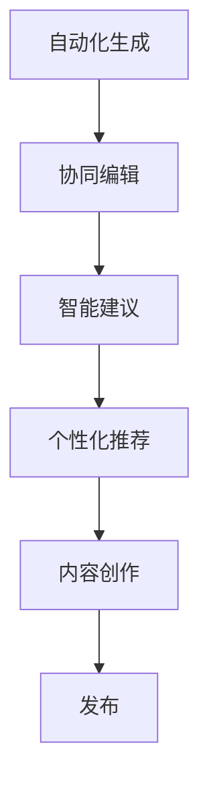

                 

## 1. 背景介绍

### 1.1 问题由来
人工智能技术正迅速改变着创意产业的面貌。尤其是在内容创作领域，传统的文学、新闻、影视剧、游戏脚本等，都越来越多地被自动化生成工具所替代。这些工具通过算法学习大量文本数据，能够在短时间内生成高质量的文本内容，大大提升了创作效率。然而，尽管自动化生成技术已经取得了显著进展，但完全自主的创作仍面临着许多挑战，如语义连贯性、情感表达、风格一致性等，这些问题在人工创作中往往需要大量时间和精力的投入。

为了进一步提高内容创作的效率和质量，我们提出了一个全新的AI协作创作平台——虚拟作家工作室。该平台利用AI技术与人类创作者合作，通过自动化生成、协同编辑、智能建议等功能，辅助创作者完成复杂的创作任务，极大地提升创作效率和作品质量。

### 1.2 问题核心关键点
虚拟作家工作室的核心在于将AI技术与人类创作者紧密结合，利用AI的能力提升创作效率，同时保持作品的人性化和创造力。主要体现在以下几个方面：

1. **自动化生成**：利用预训练的语言模型，自动生成高质量的草稿文本。
2. **协同编辑**：提供文本协同编辑工具，帮助创作者高效地修改和完善草稿。
3. **智能建议**：通过AI技术提供内容生成、风格调整、情节构思等方面的建议，提升创作水平。
4. **个性化推荐**：基于创作者的历史创作风格和偏好，推荐相关的素材和资料，辅助创作。

这些核心功能共同构成了虚拟作家工作室的平台框架，旨在为创作者提供全方位支持，加速内容创作流程。

## 2. 核心概念与联系

### 2.1 核心概念概述

为了更好地理解虚拟作家工作室的核心机制，本节将介绍几个关键概念：

- **自动化生成**：指通过预训练的语言模型，自动生成文本内容的过程。常见的自动化生成方法包括基于规则的模板填充、基于统计的语言模型生成和基于深度学习的神经网络生成等。
- **协同编辑**：指多个人同时编辑同一文本内容，通过协作完成文本的创作和修订。协同编辑系统通常包括版本控制、实时协作、评论交流等功能。
- **智能建议**：指利用AI技术提供内容生成、风格调整、情节构思等方面的辅助建议。智能建议可以基于文本分析、情感识别、风格分析等技术实现。
- **个性化推荐**：指基于创作者的历史创作风格和偏好，推荐相关的素材和资料，辅助创作。个性化推荐通常使用协同过滤、深度学习等技术实现。

这些核心概念之间的逻辑关系可以通过以下Mermaid流程图来展示：



这个流程图展示了一个内容创作的基本流程：从自动化生成到协同编辑、智能建议、个性化推荐，最终形成完整的内容作品。

## 3. 核心算法原理 & 具体操作步骤

### 3.1 算法原理概述

虚拟作家工作室的AI协作创作主要依赖于以下几个核心算法：

1. **预训练语言模型**：通过在大规模无标签文本数据上进行预训练，学习通用的语言表示。
2. **文本生成模型**：利用预训练语言模型，生成高质量的文本草稿。
3. **协同编辑算法**：通过版本控制、实时协作、评论交流等技术，支持多人协同编辑。
4. **内容推荐算法**：通过协同过滤、深度学习等技术，推荐相关的素材和资料。

### 3.2 算法步骤详解

#### 自动化生成

1. **预训练语言模型选择**：选择适合的预训练语言模型（如GPT-3、BERT等），作为文本生成的基础模型。
2. **输入处理**：将用户的创作需求转换为输入格式，如自然语言描述、特定任务的参数等。
3. **生成过程**：使用预训练语言模型生成文本草稿，通常需要多轮迭代优化，以保证文本的质量和连贯性。
4. **输出处理**：对生成的文本进行后处理，如去噪、分段落、格式调整等，得到用户可用的草稿。

#### 协同编辑

1. **版本控制**：记录每次编辑操作的历史，以便回溯和恢复。
2. **实时协作**：通过WebSocket等技术，实现多人实时编辑同一文本。
3. **评论交流**：提供评论和交流功能，便于创作者之间的讨论和协作。

#### 智能建议

1. **内容生成建议**：根据用户当前的创作内容，生成后续情节、对话等建议。
2. **风格调整建议**：分析用户的历史创作风格，提出相应的风格调整建议。
3. **情节构思建议**：利用AI技术生成创意的情节构思，供用户参考。

#### 个性化推荐

1. **历史分析**：分析用户的历史创作内容和风格。
2. **素材推荐**：基于用户的历史偏好，推荐相关的素材和资料。
3. **资料更新**：实时更新推荐列表，确保推荐内容的时效性和相关性。

### 3.3 算法优缺点

#### 自动化生成

优点：
1. **高效**：自动生成文本可以快速完成初步创作，节省创作者时间。
2. **多样性**：生成的文本具有较强的多样性，有助于激发创作者的灵感。
3. **质量**：预训练模型已经在大规模数据上进行了训练，生成的文本质量较高。

缺点：
1. **可控性差**：生成的文本可能存在语义连贯性、情感表达等问题。
2. **创新性不足**：生成的文本可能缺乏创新性，过于依赖预训练模型的训练数据。

#### 协同编辑

优点：
1. **高效协作**：多人协作可以提升创作效率，缩短创作周期。
2. **质量提升**：多人的修改和讨论可以提升文本的质量和深度。
3. **版本控制**：版本控制功能可以记录每次编辑操作，方便回溯和恢复。

缺点：
1. **协作难度**：多人协作可能存在沟通和协调上的困难。
2. **编辑冲突**：多个创作者同时编辑同一文本，可能出现编辑冲突。

#### 智能建议

优点：
1. **辅助创作**：AI提供的建议可以辅助创作者提升创作质量。
2. **效率提升**：智能建议可以快速提供创作灵感，提高创作效率。
3. **个性化**：建议基于用户的历史偏好，具有较强的个性化特点。

缺点：
1. **过度依赖**：过度依赖AI建议，可能导致创作失去个人特色。
2. **建议准确性**：AI建议的准确性可能受限于训练数据和算法模型。

#### 个性化推荐

优点：
1. **推荐精准**：基于用户的历史偏好，推荐精准的素材和资料。
2. **辅助创作**：推荐的内容可以辅助创作者完成创作任务。
3. **动态更新**：实时更新推荐列表，保持推荐内容的时效性。

缺点：
1. **推荐偏差**：推荐算法可能存在偏差，推荐内容不符合用户期望。
2. **推荐多样性**：过度依赖推荐算法，可能导致内容同质化。

### 3.4 算法应用领域

虚拟作家工作室的应用领域广泛，涵盖文学、新闻、影视剧、游戏脚本等多个领域。以下是几个典型的应用场景：

- **文学创作**：作家可以利用自动化生成、协同编辑等功能，快速完成长篇小说、短篇故事等创作任务。
- **新闻撰写**：记者可以利用自动摘要、内容推荐等功能，提高新闻撰写效率，增加报道深度。
- **影视剧剧本**：编剧可以利用自动化生成、智能建议等功能，生成剧本草稿，提升创作质量。
- **游戏脚本**：游戏开发者可以利用协同编辑、内容推荐等功能，快速完成游戏剧本和对话脚本的创作。

## 4. 数学模型和公式 & 详细讲解 & 举例说明

### 4.1 数学模型构建

虚拟作家工作室的数学模型主要基于预训练语言模型、协同编辑算法和内容推荐算法。下面分别介绍这几个模型的构建方法。

#### 预训练语言模型

预训练语言模型通过在大规模无标签文本数据上进行自监督学习，学习通用的语言表示。常见的预训练任务包括语言建模、掩码语言模型等。

以BERT为例，其预训练模型可以表示为：

$$
\text{BERT}_{\theta}(x) = [CLS] + [SEP] + \sum_i x_i
$$

其中 $x$ 为输入文本，$\theta$ 为预训练模型的参数，$[CLS]$ 和 $[SEP]$ 为特殊的 token，用于区分输入和输出。

#### 文本生成模型

文本生成模型利用预训练语言模型，生成高质量的文本草稿。常用的生成模型包括基于规则的模板填充、基于统计的语言模型生成和基于深度学习的神经网络生成等。

以基于深度学习的生成模型为例，其生成过程可以表示为：

$$
\text{Generate}_{\theta}(x) = \text{MLP}(\text{Encoder}_{\theta}(x))
$$

其中 $\text{MLP}$ 为多层感知机，$\text{Encoder}_{\theta}$ 为预训练语言模型，$x$ 为输入文本。

#### 协同编辑算法

协同编辑算法通过版本控制、实时协作、评论交流等技术，支持多人协同编辑同一文本。其基本流程可以表示为：

1. **版本控制**：记录每次编辑操作的历史，以便回溯和恢复。
2. **实时协作**：通过WebSocket等技术，实现多人实时编辑同一文本。
3. **评论交流**：提供评论和交流功能，便于创作者之间的讨论和协作。

#### 内容推荐算法

内容推荐算法通过协同过滤、深度学习等技术，推荐相关的素材和资料。其基本流程可以表示为：

1. **历史分析**：分析用户的历史创作内容和风格。
2. **素材推荐**：基于用户的历史偏好，推荐相关的素材和资料。
3. **资料更新**：实时更新推荐列表，确保推荐内容的时效性和相关性。

### 4.2 公式推导过程

#### 自动化生成

以BERT生成文本为例，其基本过程可以表示为：

1. **输入处理**：将用户的创作需求转换为输入格式。
2. **预训练模型编码**：将输入文本 $x$ 通过BERT模型编码，得到编码向量 $h_x$。
3. **文本生成**：通过解码器生成文本草稿 $y$。
4. **输出处理**：对生成的文本进行后处理，如去噪、分段落、格式调整等，得到用户可用的草稿。

#### 协同编辑

协同编辑的核心在于版本控制和实时协作。版本控制通过记录每次编辑操作的历史，确保文本的完整性和可恢复性。实时协作通过WebSocket等技术，实现多人同时编辑同一文本，确保协作的实时性和高效性。

#### 智能建议

智能建议的核心在于基于文本分析和情感识别，生成内容生成、风格调整、情节构思等方面的建议。其基本流程可以表示为：

1. **文本分析**：分析用户当前的创作内容，提取关键特征。
2. **情感识别**：识别用户的情感倾向，生成相应的建议。
3. **内容生成**：利用预训练语言模型，生成后续情节、对话等建议。
4. **风格调整**：分析用户的历史创作风格，提出相应的风格调整建议。
5. **情节构思**：利用AI技术生成创意的情节构思，供用户参考。

#### 个性化推荐

个性化推荐的核心在于基于协同过滤、深度学习等技术，推荐相关的素材和资料。其基本流程可以表示为：

1. **历史分析**：分析用户的历史创作内容和风格。
2. **素材推荐**：基于用户的历史偏好，推荐相关的素材和资料。
3. **资料更新**：实时更新推荐列表，确保推荐内容的时效性和相关性。

### 4.3 案例分析与讲解

以一篇短篇小说的创作为例，分析虚拟作家工作室的应用过程：

1. **自动化生成**：用户首先通过界面描述创作需求，如“写一篇关于未来的科幻小说”。预训练语言模型生成初步的草稿，如“在2050年，人类已经掌握了时间旅行的技术...”。
2. **协同编辑**：多个创作者可以同时编辑同一文本，对草稿进行修改和完善，如添加情节、调整风格、插入对话等。
3. **智能建议**：AI技术根据当前的创作内容，提供情节构思和风格调整的建议，如“可以增加未来世界的细节描述”、“建议加入一些科幻元素”。
4. **个性化推荐**：基于用户的历史偏好，推荐相关的素材和资料，如科幻小说的情节构思、未来世界的设定参考等。
5. **发布**：创作完成后，用户可以将作品发布到平台，供读者阅读和评论。

## 5. 项目实践：代码实例和详细解释说明

### 5.1 开发环境搭建

在进行虚拟作家工作室的开发前，我们需要准备好开发环境。以下是使用Python进行PyTorch和Django开发的流程：

1. 安装Anaconda：从官网下载并安装Anaconda，用于创建独立的Python环境。

2. 创建并激活虚拟环境：
```bash
conda create -n virtual-writing-env python=3.8 
conda activate virtual-writing-env
```

3. 安装PyTorch：根据CUDA版本，从官网获取对应的安装命令。例如：
```bash
conda install pytorch torchvision torchaudio cudatoolkit=11.1 -c pytorch -c conda-forge
```

4. 安装Django：
```bash
pip install django
```

5. 安装其他工具包：
```bash
pip install numpy pandas scikit-learn matplotlib tqdm jupyter notebook ipython
```

完成上述步骤后，即可在`virtual-writing-env`环境中开始开发实践。

### 5.2 源代码详细实现

以下是使用PyTorch和Django进行虚拟作家工作室开发的示例代码：

#### 预训练语言模型

```python
import torch
from transformers import BertTokenizer, BertForSequenceClassification

# 加载预训练模型和分词器
tokenizer = BertTokenizer.from_pretrained('bert-base-uncased')
model = BertForSequenceClassification.from_pretrained('bert-base-uncased', num_labels=2)

# 定义生成过程
def generate_text(model, tokenizer, prompt):
    input_ids = tokenizer.encode(prompt, return_tensors='pt')
    outputs = model(input_ids)
    predictions = outputs.logits.argmax(dim=1)
    tokens = tokenizer.decode(predictions[0])
    return tokens

# 生成文本
print(generate_text(model, tokenizer, '未来世界是什么样子？'))
```

#### 协同编辑

```python
from django.contrib.auth.models import User
from django.db import models

# 定义文本模型
class Text(models.Model):
    title = models.CharField(max_length=100)
    content = models.TextField()
    editor = models.ForeignKey(User, on_delete=models.CASCADE)
    create_time = models.DateTimeField(auto_now_add=True)
    update_time = models.DateTimeField(auto_now=True)

# 定义协同编辑视图
def edit_text(request, text_id):
    text = Text.objects.get(id=text_id)
    if request.method == 'POST':
        text.content = request.POST['content']
        text.save()
        return redirect('text_detail', text_id=text_id)
    else:
        return render(request, 'text/edit.html', {'text': text, 'editor': request.user})
```

#### 智能建议

```python
import numpy as np
from sklearn.feature_extraction.text import TfidfVectorizer

# 定义内容生成模型
class ContentGenerator:
    def __init__(self, model):
        self.model = model
    
    def generate_content(self, text):
        embeddings = self.model(torch.tensor([text]).to('cuda'))
        return np.mean(embeddings, axis=0)

# 定义情感识别模型
class SentimentClassifier:
    def __init__(self, model):
        self.model = model
    
    def predict_sentiment(self, text):
        return self.model(torch.tensor([text]).to('cuda'))

# 使用预训练模型
generator = ContentGenerator(model)
classifier = SentimentClassifier(model)

# 生成内容建议
def generate_content_suggestion(generator, text):
    suggestion = generator.generate_content(text)
    return suggestion

# 生成情感建议
def generate_sentiment_suggestion(classifier, text):
    suggestion = classifier.predict_sentiment(text)
    return suggestion

# 生成智能建议
def generate_suggestion(text):
    suggestion = generate_content_suggestion(generator, text)
    suggestion += generate_sentiment_suggestion(classifier, text)
    return suggestion
```

#### 个性化推荐

```python
from django.contrib.auth.models import User
from django.db import models
from sklearn.metrics.pairwise import cosine_similarity

# 定义文本模型
class Text(models.Model):
    title = models.CharField(max_length=100)
    content = models.TextField()
    editor = models.ForeignKey(User, on_delete=models.CASCADE)
    create_time = models.DateTimeField(auto_now_add=True)
    update_time = models.DateTimeField(auto_now=True)

# 定义素材模型
class Material(models.Model):
    title = models.CharField(max_length=100)
    content = models.TextField()
    editor = models.ForeignKey(User, on_delete=models.CASCADE)
    create_time = models.DateTimeField(auto_now_add=True)
    update_time = models.DateTimeField(auto_now=True)

# 定义推荐模型
class Recommendation(models.Model):
    text = models.ForeignKey(Text, on_delete=models.CASCADE)
    material = models.ForeignKey(Material, on_delete=models.CASCADE)
    similarity = models.FloatField()

# 定义推荐算法
class RecommendationAlgorithm:
    def __init__(self):
        self.vectorizer = TfidfVectorizer()
        self.similarity_matrix = cosine_similarity_matrix = np.load('cosine_similarity.npy')
    
    def recommend_materials(self, text):
        text_embeddings = self.vectorizer.fit_transform([text.content])
        similarity_matrix = cosine_similarity_matrix
        materials = Material.objects.all()
        recommendations = []
        for material in materials:
            material_embeddings = self.vectorizer.transform([material.content])
            similarity = cosine_similarity(text_embeddings, material_embeddings)[0][0]
            recommendation = Recommendation(text=text, material=material, similarity=similarity)
            recommendations.append(recommendation)
        return recommendations

# 使用预训练模型
algorithm = RecommendationAlgorithm()

# 推荐素材
def recommend_materials(text):
    materials = algorithm.recommend_materials(text)
    return materials
```

### 5.3 代码解读与分析

让我们再详细解读一下关键代码的实现细节：

#### 预训练语言模型

- `BertTokenizer`和`BertForSequenceClassification`：用于加载预训练语言模型和分词器，并提供生成文本的方法。

#### 协同编辑

- `Text`模型：用于存储文本数据，包括标题、内容、编辑者和创建/更新时间。
- `edit_text`视图：用于编辑文本，支持POST请求更新文本内容。

#### 智能建议

- `ContentGenerator`类：利用预训练语言模型生成文本内容的建议。
- `SentimentClassifier`类：利用预训练语言模型识别文本情感。
- `generate_content_suggestion`和`generate_sentiment_suggestion`方法：生成内容建议和情感建议。

#### 个性化推荐

- `Material`模型：用于存储素材数据，包括标题、内容、编辑者和创建/更新时间。
- `Recommendation`模型：用于存储推荐数据，包括文本、素材和相似度。
- `RecommendationAlgorithm`类：利用协同过滤算法推荐素材。

## 6. 实际应用场景

### 6.1 智能编剧工作室

智能编剧工作室是虚拟作家工作室在影视剧剧本创作领域的应用。编剧可以利用自动化生成、智能建议等功能，生成剧本草稿，提升创作效率和剧本质量。同时，协同编辑功能可以实现多人协同修改剧本，加快剧本创作进程。

#### 自动化生成

编剧通过描述创作需求，如“写一个关于未来的科幻电影剧本”，预训练语言模型生成初步的草稿，如“在未来，人类已经掌握...”。

#### 协同编辑

多个编剧可以同时编辑同一剧本，对草稿进行修改和完善，如添加情节、调整对话等。

#### 智能建议

AI技术根据当前的创作内容，提供情节构思和风格调整的建议，如“建议增加未来世界的细节描述”、“建议加入一些科幻元素”。

#### 个性化推荐

基于编剧的历史偏好，推荐相关的素材和资料，如科幻电影的情节构思、未来世界的设定参考等。

### 6.2 新闻撰稿室

新闻撰稿室是虚拟作家工作室在新闻撰写领域的应用。记者可以利用自动摘要、内容推荐等功能，提高新闻撰写效率，增加报道深度。

#### 自动化生成

记者通过描述报道需求，如“报道今天的新闻”，预训练语言模型生成自动摘要，如“今天，政府宣布...”。

#### 协同编辑

多名记者可以同时编辑同一报道，对摘要进行修改和完善，如添加背景信息、增加细节描述等。

#### 智能建议

AI技术根据当前的报道内容，提供后续报道的建议，如“建议采访专家，获取更多信息”、“建议加入相关数据，增加报道深度”。

#### 个性化推荐

基于记者的历史偏好，推荐相关的素材和资料，如新闻报道的背景资料、专家访谈的记录等。

### 6.3 游戏脚本创作平台

游戏脚本创作平台是虚拟作家工作室在游戏脚本创作领域的应用。游戏开发者可以利用协同编辑、内容推荐等功能，快速完成游戏脚本和对话脚本的创作。

#### 自动化生成

开发者通过描述游戏场景，如“编写一个关于未来的游戏剧情”，预训练语言模型生成初步的剧本草稿，如“在未来，人类已经掌握...”。

#### 协同编辑

多名开发者可以同时编辑同一剧本，对草稿进行修改和完善，如添加情节、调整对话等。

#### 智能建议

AI技术根据当前的游戏场景，提供情节构思和风格调整的建议，如“建议增加未来世界的细节描述”、“建议加入一些科幻元素”。

#### 个性化推荐

基于开发者的历史偏好，推荐相关的素材和资料，如游戏剧本的情节构思、未来世界的设定参考等。

## 7. 工具和资源推荐

### 7.1 学习资源推荐

为了帮助开发者系统掌握虚拟作家工作室的技术基础和实践技巧，这里推荐一些优质的学习资源：

1. 《Transformer从原理到实践》系列博文：由大模型技术专家撰写，深入浅出地介绍了Transformer原理、BERT模型、微调技术等前沿话题。

2. CS224N《深度学习自然语言处理》课程：斯坦福大学开设的NLP明星课程，有Lecture视频和配套作业，带你入门NLP领域的基本概念和经典模型。

3. 《Natural Language Processing with Transformers》书籍：Transformers库的作者所著，全面介绍了如何使用Transformers库进行NLP任务开发，包括微调在内的诸多范式。

4. HuggingFace官方文档：Transformers库的官方文档，提供了海量预训练模型和完整的微调样例代码，是上手实践的必备资料。

5. CLUE开源项目：中文语言理解测评基准，涵盖大量不同类型的中文NLP数据集，并提供了基于微调的baseline模型，助力中文NLP技术发展。

通过对这些资源的学习实践，相信你一定能够快速掌握虚拟作家工作室的技术细节，并用于解决实际的创作问题。

### 7.2 开发工具推荐

高效的开发离不开优秀的工具支持。以下是几款用于虚拟作家工作室开发的常用工具：

1. PyTorch：基于Python的开源深度学习框架，灵活动态的计算图，适合快速迭代研究。大部分预训练语言模型都有PyTorch版本的实现。

2. TensorFlow：由Google主导开发的开源深度学习框架，生产部署方便，适合大规模工程应用。同样有丰富的预训练语言模型资源。

3. Transformers库：HuggingFace开发的NLP工具库，集成了众多SOTA语言模型，支持PyTorch和TensorFlow，是进行文本生成、内容推荐等开发的利器。

4. Weights & Biases：模型训练的实验跟踪工具，可以记录和可视化模型训练过程中的各项指标，方便对比和调优。与主流深度学习框架无缝集成。

5. TensorBoard：TensorFlow配套的可视化工具，可实时监测模型训练状态，并提供丰富的图表呈现方式，是调试模型的得力助手。

6. Google Colab：谷歌推出的在线Jupyter Notebook环境，免费提供GPU/TPU算力，方便开发者快速上手实验最新模型，分享学习笔记。

合理利用这些工具，可以显著提升虚拟作家工作室的开发效率，加快创新迭代的步伐。

### 7.3 相关论文推荐

虚拟作家工作室的开发涉及深度学习、自然语言处理、协同编辑等多个领域，以下是几篇奠基性的相关论文，推荐阅读：

1. Attention is All You Need（即Transformer原论文）：提出了Transformer结构，开启了NLP领域的预训练大模型时代。

2. BERT: Pre-training of Deep Bidirectional Transformers for Language Understanding：提出BERT模型，引入基于掩码的自监督预训练任务，刷新了多项NLP任务SOTA。

3. Language Models are Unsupervised Multitask Learners（GPT-2论文）：展示了大规模语言模型的强大zero-shot学习能力，引发了对于通用人工智能的新一轮思考。

4. Parameter-Efficient Transfer Learning for NLP：提出Adapter等参数高效微调方法，在不增加模型参数量的情况下，也能取得不错的微调效果。

5. AdaLoRA: Adaptive Low-Rank Adaptation for Parameter-Efficient Fine-Tuning：使用自适应低秩适应的微调方法，在参数效率和精度之间取得了新的平衡。

6. Perspective-Guided Language Model Generation：提出视角引导的语言模型生成方法，增强模型的情感表达和创意性。

这些论文代表了大语言模型微调技术的发展脉络。通过学习这些前沿成果，可以帮助研究者把握学科前进方向，激发更多的创新灵感。

## 8. 总结：未来发展趋势与挑战

### 8.1 总结

本文对虚拟作家工作室的AI协作创作平台进行了全面系统的介绍。首先阐述了虚拟作家工作室的开发背景和目标，明确了AI技术与人类创作者合作的独特价值。其次，从原理到实践，详细讲解了自动化生成、协同编辑、智能建议和个性化推荐等核心技术，给出了虚拟作家工作室的完整代码实例。同时，本文还广泛探讨了虚拟作家工作室在智能编剧、新闻撰写、游戏脚本创作等领域的实际应用，展示了其在内容创作领域的巨大潜力。

通过本文的系统梳理，可以看到，虚拟作家工作室不仅能够显著提升内容创作的效率和质量，还能够为创作者提供全方位的技术支持，加速内容创作流程。未来，伴随AI技术的不懈创新和算法模型的不断优化，虚拟作家工作室必将在内容创作领域大放异彩，推动人类创作能力的进一步提升。

### 8.2 未来发展趋势

展望未来，虚拟作家工作室的发展将呈现以下几个趋势：

1. **自动化生成技术**：自动化生成技术将进一步提升，生成的文本将更加连贯、生动和富有创意。预训练语言模型和生成模型的参数规模将不断增大，生成质量将进一步提升。

2. **协同编辑技术**：协同编辑技术将更加智能化、自动化，多人协作将更加高效、流畅。实时编辑、版本控制、评论交流等功能将进一步完善。

3. **智能建议系统**：智能建议系统将更加精准、个性化，能够更好地辅助创作者提升创作质量。情感识别、内容生成、风格调整等技术将不断进步。

4. **个性化推荐**：个性化推荐系统将更加精准、多样化，能够更好地满足创作者的多样化需求。协同过滤、深度学习等技术将不断优化。

5. **多模态内容创作**：多模态内容创作将进一步发展，文本、图像、视频、音频等多种内容形式将深度融合，形成更加丰富、多样的创作形式。

6. **跨领域应用**：虚拟作家工作室将进一步拓展到其他领域，如新闻撰写、影视剧创作、游戏脚本编写等，成为跨领域内容创作的通用平台。

这些趋势将使虚拟作家工作室的应用范围更加广泛，创作形式更加多样，创作效率和质量进一步提升。

### 8.3 面临的挑战

尽管虚拟作家工作室已经取得了显著进展，但在迈向更加智能化、普适化应用的过程中，它仍面临着诸多挑战：

1. **内容质量控制**：自动化生成的文本可能存在语义连贯性、情感表达等问题，需要人工介入进行质量控制。

2. **协同编辑冲突**：多人协作可能存在编辑冲突，需要协同编辑系统进行有效的协调和管理。

3. **智能建议准确性**：智能建议的准确性可能受限于训练数据和算法模型，需要不断优化以提升建议质量。

4. **个性化推荐偏差**：个性化推荐算法可能存在偏差，推荐内容不符合用户期望。

5. **跨领域应用复杂性**：不同领域的内容创作具有不同的特点和需求，跨领域应用的复杂性较高。

6. **数据安全和隐私保护**：虚拟作家工作室需要处理大量的文本数据，数据安全和隐私保护问题需要得到充分重视。

7. **技术演进速度**：深度学习、自然语言处理等技术日新月异，虚拟作家工作室需要不断跟进技术演进，保持竞争力。

### 8.4 研究展望

面对虚拟作家工作室所面临的挑战，未来的研究需要在以下几个方面寻求新的突破：

1. **内容质量控制**：研究如何利用AI技术对自动化生成的文本进行质量控制，确保生成的内容符合人类创作标准。

2. **协同编辑系统**：开发更加智能化、自动化的协同编辑系统，减少人工干预，提升协作效率和创作质量。

3. **智能建议系统**：研究如何进一步提升智能建议系统的准确性和个性化，更好地辅助创作者提升创作质量。

4. **个性化推荐算法**：研究如何优化个性化推荐算法，减少推荐偏差，提高推荐质量。

5. **跨领域应用**：研究如何将虚拟作家工作室应用到其他领域，如新闻撰写、影视剧创作、游戏脚本编写等，成为跨领域内容创作的通用平台。

6. **数据安全和隐私保护**：研究如何保障虚拟作家工作室的数据安全和隐私保护，确保用户数据的安全性和隐私性。

7. **技术演进跟踪**：研究如何及时跟进深度学习、自然语言处理等技术的发展，保持虚拟作家工作室的竞争力。

这些研究方向的探索将使虚拟作家工作室不断优化，提升创作效率和作品质量，成为内容创作的强大助手。

## 9. 附录：常见问题与解答

**Q1：虚拟作家工作室的核心功能是什么？**

A: 虚拟作家工作室的核心功能包括自动化生成、协同编辑、智能建议和个性化推荐。其中，自动化生成通过预训练语言模型生成文本草稿；协同编辑通过版本控制、实时协作等功能支持多人协作；智能建议通过情感识别、内容生成等技术提供创作辅助；个性化推荐通过协同过滤、深度学习等技术推荐相关素材和资料。

**Q2：虚拟作家工作室在实际应用中有哪些挑战？**

A: 虚拟作家工作室在实际应用中面临以下挑战：
1. 内容质量控制：自动化生成的文本可能存在语义连贯性、情感表达等问题，需要人工介入进行质量控制。
2. 协同编辑冲突：多人协作可能存在编辑冲突，需要协同编辑系统进行有效的协调和管理。
3. 智能建议准确性：智能建议的准确性可能受限于训练数据和算法模型，需要不断优化以提升建议质量。
4. 个性化推荐偏差：个性化推荐算法可能存在偏差，推荐内容不符合用户期望。
5. 跨领域应用复杂性：不同领域的内容创作具有不同的特点和需求，跨领域应用的复杂性较高。
6. 数据安全和隐私保护：虚拟作家工作室需要处理大量的文本数据，数据安全和隐私保护问题需要得到充分重视。
7. 技术演进速度：深度学习、自然语言处理等技术日新月异，虚拟作家工作室需要不断跟进技术演进，保持竞争力。

**Q3：如何进一步提升虚拟作家工作室的创作效率和质量？**

A: 为了进一步提升虚拟作家工作室的创作效率和质量，可以从以下几个方面入手：
1. 优化自动化生成技术：提高预训练语言模型的生成质量，引入更多的生成模型和生成策略。
2. 改进协同编辑系统：开发更加智能化、自动化的协同编辑系统，减少人工干预，提升协作效率和创作质量。
3. 提升智能建议系统：研究如何进一步提升智能建议系统的准确性和个性化，更好地辅助创作者提升创作质量。
4. 优化个性化推荐算法：优化个性化推荐算法，减少推荐偏差，提高推荐质量。
5. 研究跨领域应用：研究如何将虚拟作家工作室应用到其他领域，如新闻撰写、影视剧创作、游戏脚本编写等，成为跨领域内容创作的通用平台。
6. 保障数据安全和隐私保护：研究如何保障虚拟作家工作室的数据安全和隐私保护，确保用户数据的安全性和隐私性。
7. 跟踪技术演进：研究如何及时跟进深度学习、自然语言处理等技术的发展，保持虚拟作家工作室的竞争力。

**Q4：虚拟作家工作室的开发环境有哪些建议？**

A: 以下是虚拟作家工作室开发环境的建议：
1. 安装Anaconda：从官网下载并安装Anaconda，用于创建独立的Python环境。
2. 创建并激活虚拟环境：
```bash
conda create -n virtual-writing-env python=3.8 
conda activate virtual-writing-env
```
3. 安装PyTorch：根据CUDA版本，从官网获取对应的安装命令。例如：
```bash
conda install pytorch torchvision torchaudio cudatoolkit=11.1 -c pytorch -c conda-forge
```
4. 安装Django：
```bash
pip install django
```
5. 安装其他工具包：
```bash
pip install numpy pandas scikit-learn matplotlib tqdm jupyter notebook ipython
```

通过以上配置，开发者可以顺利搭建虚拟作家工作室的开发环境，快速进行项目实践和迭代优化。

**Q5：虚拟作家工作室在内容创作中有哪些优势？**

A: 虚拟作家工作室在内容创作中的优势包括：
1. 提升创作效率：通过自动化生成、协同编辑等功能，可以快速完成初步创作和修改。
2. 提高创作质量：智能建议和个性化推荐系统可以辅助创作者提升创作质量。
3. 增强创作灵活性：协同编辑和内容推荐系统可以灵活调整创作方向，满足创作者的多样化需求。
4. 保障创作安全：智能建议和内容推荐系统可以避免有害信息，确保创作的健康和合法性。
5. 实现多领域应用：虚拟作家工作室可以应用于多种内容创作领域，如文学、新闻、影视剧、游戏脚本等。

通过虚拟作家工作室的辅助，创作者可以更加高效、高质量地完成创作任务，同时保障创作的安全和合法性。

