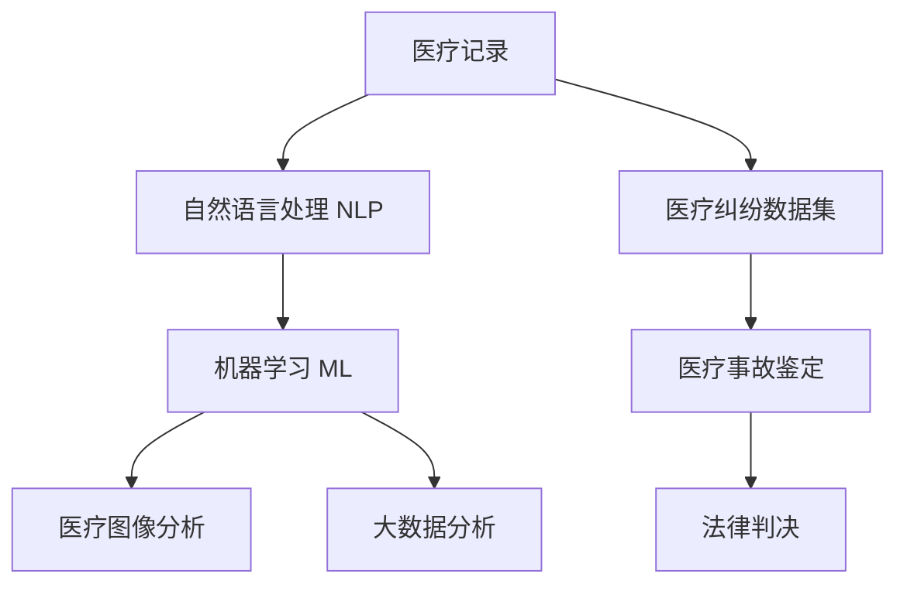

                 

# 虚拟医疗事故鉴定:数字化医疗纠纷的技术分析方法

> 关键词：虚拟医疗事故鉴定, 数字化医疗纠纷, 人工智能(AI), 自然语言处理(NLP), 医疗图像分析, 机器学习(ML), 医疗记录分析, 大数据(Big Data)

## 1. 背景介绍

### 1.1 问题由来
近年来，医疗纠纷案件逐年增加，且涉及金额巨大，严重影响医疗行业的发展。许多医疗纠纷的根本原因是医疗行为的专业性和复杂性，使得患者和家属对医疗服务存在不满和疑虑，导致纠纷频发。

医疗纠纷鉴定是解决这类问题的关键手段，但传统的方法依赖于经验丰富的专家进行手工判断，耗时耗力且容易受到主观因素的影响。而数字化医疗纠纷技术分析方法，利用人工智能和大数据技术，能够更加高效、客观地进行医疗事故鉴定，为司法和医疗行业提供科学依据。

### 1.2 问题核心关键点
数字化医疗纠纷技术分析方法的核心关键点包括：
- 数据采集与预处理：从电子病历、医疗影像、实验室检查等多种数据源收集医疗纠纷相关数据。
- 自然语言处理(NLP)：对医疗记录进行文本分析，提取关键信息和文本结构。
- 机器学习(ML)：利用机器学习算法进行模式识别和预测，自动生成医疗事故鉴定的初步结论。
- 医疗图像分析：使用深度学习算法对医疗影像进行解析，辅助医生进行诊断和治疗。
- 大数据分析：对海量医疗数据进行统计分析和趋势预测，发现潜在风险点。

### 1.3 问题研究意义
数字化医疗纠纷技术分析方法的研究意义在于：
- 提高医疗事故鉴定的效率和准确性，缩短纠纷处理时间，降低成本。
- 提供科学、客观的医疗纠纷判断依据，减少纠纷中的主观偏见和不确定性。
- 辅助医疗机构发现管理漏洞和风险点，提升医疗质量和安全。
- 为法律机构提供可靠的医疗事故鉴定技术支持，增强司法判决的科学性。

## 2. 核心概念与联系

### 2.1 核心概念概述

为更好地理解数字化医疗纠纷技术分析方法，本节将介绍几个关键概念：

- 数字化医疗纠纷分析：利用人工智能和大数据分析技术，对医疗纠纷案件进行自动化的分析和处理，生成初步的医疗事故鉴定结论。
- 自然语言处理(NLP)：通过对医疗记录文本进行分析和处理，提取关键信息和结构，辅助医疗事故鉴定。
- 机器学习(ML)：利用历史数据和算法模型，对医疗纠纷进行模式识别和预测，自动生成医疗事故鉴定的初步结论。
- 医疗图像分析：通过深度学习算法解析医疗影像，辅助医生进行诊断和治疗，从而减少误诊和漏诊。
- 大数据分析：对海量医疗数据进行统计分析和趋势预测，发现潜在的医疗风险点和管理漏洞。

这些关键概念之间存在紧密联系，共同构成了数字化医疗纠纷技术分析方法的基本框架。

### 2.2 核心概念原理和架构的 Mermaid 流程图



这个流程图展示了数字化医疗纠纷技术分析方法的核心概念和它们之间的关系：

1. 从医疗记录中提取信息，并对其进行预处理。
2. 利用自然语言处理技术，提取关键信息和文本结构。
3. 通过机器学习算法，进行模式识别和预测，自动生成医疗事故鉴定的初步结论。
4. 对医疗影像进行分析，辅助医生进行诊断和治疗。
5. 对海量医疗数据进行统计分析和趋势预测，发现潜在的医疗风险点。
6. 结合所有分析结果，进行医疗事故鉴定。
7. 最终将鉴定结果提供给法律机构，作为司法判决的依据。

## 3. 核心算法原理 & 具体操作步骤
### 3.1 算法原理概述

数字化医疗纠纷技术分析方法的核心算法原理主要包括以下几个方面：

1. 自然语言处理(NLP)：通过文本预处理、分词、命名实体识别、句法分析等技术，从医疗记录中提取关键信息，并构建文本结构。
2. 机器学习(ML)：利用分类、回归、聚类等算法，对医疗纠纷进行模式识别和预测，自动生成医疗事故鉴定的初步结论。
3. 医疗图像分析：使用深度学习算法，对医疗影像进行解析，辅助医生进行诊断和治疗。
4. 大数据分析：对医疗数据进行统计分析和趋势预测，发现潜在的医疗风险点和管理漏洞。

这些算法相互配合，共同完成医疗纠纷的数字化技术分析。

### 3.2 算法步骤详解

数字化医疗纠纷技术分析方法的具体操作步骤如下：

1. **数据采集与预处理**：从电子病历、医疗影像、实验室检查等多种数据源收集医疗纠纷相关数据。对数据进行清洗、标注、标准化处理，确保数据的质量和一致性。

2. **自然语言处理(NLP)**：
   - 文本预处理：去除停用词、标点符号等无用信息，进行文本标准化处理。
   - 分词：将文本进行分词处理，以便进行后续的命名实体识别和句法分析。
   - 命名实体识别(NER)：识别文本中的实体，如人名、地名、机构名等。
   - 句法分析：分析句子的语法结构和依存关系，提取关键信息。

3. **机器学习(ML)**：
   - 特征提取：从预处理后的文本中提取特征向量，用于训练和测试机器学习模型。
   - 模型训练：利用历史数据和机器学习算法，训练分类、回归、聚类等模型。
   - 预测分析：对新的医疗纠纷数据进行预测，生成医疗事故鉴定的初步结论。

4. **医疗图像分析**：
   - 图像预处理：对医疗影像进行预处理，包括降噪、归一化等操作。
   - 特征提取：提取影像的特征向量，如边缘、纹理等。
   - 模型训练：使用深度学习算法训练分类、回归等模型。
   - 图像分析：对新的医疗影像进行分析，辅助医生进行诊断和治疗。

5. **大数据分析**：
   - 数据收集：从医疗数据仓库收集海量医疗数据。
   - 数据清洗：处理缺失值、异常值等数据问题，确保数据质量。
   - 统计分析：对医疗数据进行统计分析，发现潜在的医疗风险点和管理漏洞。
   - 趋势预测：利用机器学习算法进行趋势预测，发现潜在的医疗风险点和管理漏洞。

6. **医疗事故鉴定**：
   - 综合分析：结合NLP、ML、医疗图像分析和大数据分析的结果，进行综合分析。
   - 初步结论：生成医疗事故鉴定的初步结论，作为司法和医疗机构的重要参考。
   - 反馈优化：根据司法和医疗机构的反馈，不断优化算法模型和分析方法。

### 3.3 算法优缺点

数字化医疗纠纷技术分析方法具有以下优点：
1. 高效性：利用自动化技术，可以快速处理大量医疗纠纷数据，缩短纠纷处理时间。
2. 客观性：通过算法模型进行客观分析，减少主观偏见和不确定性。
3. 可解释性：算法模型可以输出详细的分析过程和结论，便于理解和解释。
4. 可扩展性：可以针对不同医疗纠纷场景，构建不同的算法模型和分析方法。

同时，该方法也存在以下缺点：
1. 数据依赖性：算法效果依赖于高质量的医疗数据，数据获取和处理成本较高。
2. 模型复杂性：算法模型较为复杂，需要较高的技术门槛和计算资源。
3. 误差率：由于医疗数据的复杂性和多样性，算法模型可能存在一定的误差率。
4. 隐私问题：医疗数据涉及个人隐私，数据的收集、处理和存储需要严格遵守法律法规。

### 3.4 算法应用领域

数字化医疗纠纷技术分析方法主要应用于以下几个领域：

1. **医疗事故鉴定**：通过对医疗记录和影像的分析，自动生成医疗事故鉴定的初步结论，辅助司法和医疗机构进行决策。
2. **医疗质量评估**：利用大数据分析技术，发现医疗质量管理的漏洞和风险点，提升医疗服务质量。
3. **医疗纠纷预防**：通过分析医疗纠纷的历史数据，预测潜在的纠纷风险，提前采取预防措施。
4. **远程医疗辅助**：结合自然语言处理和医疗图像分析技术，辅助远程医疗诊断和治疗，提高医疗服务的覆盖面和效率。
5. **医疗资源优化**：利用大数据分析技术，优化医疗资源的配置和使用，提高医疗服务的效率和质量。

这些领域展示了数字化医疗纠纷技术分析方法在医疗行业的广泛应用前景。

## 4. 数学模型和公式 & 详细讲解 & 举例说明

### 4.1 数学模型构建

数字化医疗纠纷技术分析方法涉及到多个数学模型，以下是其中几个重要的模型：

1. **自然语言处理(NLP)模型**：利用文本预处理、分词、命名实体识别、句法分析等技术，构建文本结构，提取关键信息。

2. **机器学习(ML)模型**：利用分类、回归、聚类等算法，进行模式识别和预测，生成医疗事故鉴定的初步结论。

3. **医疗图像分析模型**：利用深度学习算法，对医疗影像进行解析，辅助医生进行诊断和治疗。

4. **大数据分析模型**：利用统计分析和趋势预测等技术，发现潜在的医疗风险点和管理漏洞。

这些模型之间相互配合，共同完成医疗纠纷的数字化技术分析。

### 4.2 公式推导过程

以下以自然语言处理(NLP)和机器学习(ML)为例，详细讲解它们的数学模型和公式推导过程。

**自然语言处理(NLP)模型**：

假设医疗记录文本为 $T=\{t_1, t_2, \cdots, t_n\}$，其中 $t_i$ 表示第 $i$ 个文本记录。首先进行文本预处理和分词处理，得到词向量表示 $V=\{v_1, v_2, \cdots, v_m\}$，其中 $v_j$ 表示第 $j$ 个词向量。然后通过命名实体识别(NER)和句法分析，提取关键信息和文本结构。最后，利用文本表示模型将词向量转化为文本表示 $H=\{h_1, h_2, \cdots, h_n\}$，其中 $h_i$ 表示第 $i$ 个文本的表示向量。

**机器学习(ML)模型**：

假设医疗纠纷数据集为 $D=\{(x_i, y_i)\}_{i=1}^N$，其中 $x_i$ 表示第 $i$ 个医疗纠纷的特征向量，$y_i$ 表示对应的标签。利用分类算法进行训练，得到分类模型 $f(x)$，用于预测新的医疗纠纷数据。分类模型的目标是最小化交叉熵损失函数：

$$
\mathcal{L}(f) = \frac{1}{N} \sum_{i=1}^N -y_i\log f(x_i) - (1-y_i)\log (1-f(x_i))
$$

其中 $f(x_i)$ 表示模型对第 $i$ 个医疗纠纷的预测结果，$y_i$ 表示对应的标签。

### 4.3 案例分析与讲解

以医疗记录文本分析为例，详细讲解数字化医疗纠纷技术分析方法的案例分析过程：

假设有一份医疗记录文本 $T$，需要从中提取关键信息，并生成医疗事故鉴定的初步结论。首先，对文本进行预处理和分词处理，得到词向量表示 $V=\{v_1, v_2, \cdots, v_m\}$。然后，利用命名实体识别(NER)技术，识别出文本中的实体，如人名、地名、机构名等。接着，通过句法分析，分析句子的语法结构和依存关系，提取关键信息。最后，利用文本表示模型将词向量转化为文本表示 $H=\{h_1, h_2, \cdots, h_n\}$，生成医疗事故鉴定的初步结论。

## 5. 项目实践：代码实例和详细解释说明

### 5.1 开发环境搭建

在进行数字化医疗纠纷技术分析方法实践前，我们需要准备好开发环境。以下是使用Python进行PyTorch开发的环境配置流程：

1. 安装Anaconda：从官网下载并安装Anaconda，用于创建独立的Python环境。

2. 创建并激活虚拟环境：
```bash
conda create -n medical-env python=3.8 
conda activate medical-env
```

3. 安装PyTorch：根据CUDA版本，从官网获取对应的安装命令。例如：
```bash
conda install pytorch torchvision torchaudio cudatoolkit=11.1 -c pytorch -c conda-forge
```

4. 安装TensorFlow：从官网下载并安装TensorFlow，用于深度学习算法的实现。

5. 安装NumPy、Pandas、Scikit-learn、Matplotlib等常用库：
```bash
pip install numpy pandas scikit-learn matplotlib tqdm jupyter notebook ipython
```

完成上述步骤后，即可在`medical-env`环境中开始实践。

### 5.2 源代码详细实现

我们以医疗记录文本分析和机器学习模型训练为例，给出使用PyTorch进行数字化医疗纠纷技术分析的代码实现。

```python
import torch
import torch.nn as nn
import torch.optim as optim
from transformers import BertTokenizer, BertForTokenClassification
from sklearn.metrics import accuracy_score, f1_score, precision_score, recall_score

class MedicalRecord(nn.Module):
    def __init__(self, n_labels):
        super(MedicalRecord, self).__init__()
        self.bert = BertForTokenClassification.from_pretrained('bert-base-cased', num_labels=n_labels)
        self.classifier = nn.Linear(768, n_labels)
        
    def forward(self, input_ids, attention_mask):
        outputs = self.bert(input_ids, attention_mask=attention_mask)
        pooled_output = outputs.pooler_output
        logits = self.classifier(pooled_output)
        return logits

# 数据准备
tokenizer = BertTokenizer.from_pretrained('bert-base-cased')
train_dataset = ...
dev_dataset = ...
test_dataset = ...

# 模型定义
model = MedicalRecord(num_labels=n_labels)
criterion = nn.CrossEntropyLoss()
optimizer = optim.Adam(model.parameters(), lr=2e-5)

# 训练过程
def train_epoch(model, dataset, batch_size, optimizer, criterion):
    dataloader = DataLoader(dataset, batch_size=batch_size, shuffle=True)
    model.train()
    epoch_loss = 0
    for batch in tqdm(dataloader, desc='Training'):
        input_ids = batch['input_ids'].to(device)
        attention_mask = batch['attention_mask'].to(device)
        labels = batch['labels'].to(device)
        model.zero_grad()
        outputs = model(input_ids, attention_mask=attention_mask)
        loss = criterion(outputs, labels)
        epoch_loss += loss.item()
        loss.backward()
        optimizer.step()
    return epoch_loss / len(dataloader)

# 评估过程
def evaluate(model, dataset, batch_size, criterion):
    dataloader = DataLoader(dataset, batch_size=batch_size)
    model.eval()
    preds, labels = [], []
    with torch.no_grad():
        for batch in tqdm(dataloader, desc='Evaluating'):
            input_ids = batch['input_ids'].to(device)
            attention_mask = batch['attention_mask'].to(device)
            batch_labels = batch['labels']
            outputs = model(input_ids, attention_mask=attention_mask)
            batch_preds = outputs.argmax(dim=2).to('cpu').tolist()
            batch_labels = batch_labels.to('cpu').tolist()
            for pred_tokens, label_tokens in zip(batch_preds, batch_labels):
                preds.append(pred_tokens[:len(label_tokens)])
                labels.append(label_tokens)
                
    print('Accuracy: {:.2f}%'.format(accuracy_score(labels, preds)))
    print('Precision: {:.2f}%'.format(precision_score(labels, preds)))
    print('Recall: {:.2f}%'.format(recall_score(labels, preds)))
    print('F1 Score: {:.2f}%'.format(f1_score(labels, preds)))

# 训练和评估
epochs = 5
batch_size = 16

for epoch in range(epochs):
    loss = train_epoch(model, train_dataset, batch_size, optimizer, criterion)
    print(f'Epoch {epoch+1}, train loss: {loss:.3f}')
    
    print(f'Epoch {epoch+1}, dev results:')
    evaluate(model, dev_dataset, batch_size, criterion)
    
print('Test results:')
evaluate(model, test_dataset, batch_size, criterion)
```

### 5.3 代码解读与分析

让我们再详细解读一下关键代码的实现细节：

**MedicalRecord类**：
- `__init__`方法：定义模型结构，包括BERT分类器和一个线性分类器。
- `forward`方法：对输入进行前向传播，输出模型的预测结果。

**数据准备**：
- 定义BERT tokenizer，用于将文本转化为词向量表示。
- 创建训练集、验证集和测试集，用于模型的训练和评估。

**模型定义**：
- 定义MedicalRecord类，继承nn.Module，包含BERT分类器和线性分类器。
- 定义损失函数和优化器，用于训练模型的参数。

**训练过程**：
- 使用PyTorch的DataLoader对数据集进行批次化加载。
- 在每个批次上进行前向传播和反向传播，更新模型参数。
- 在验证集上评估模型的性能，打印输出训练损失和评估指标。

**评估过程**：
- 与训练过程类似，但在评估时关闭梯度计算，避免对模型参数的影响。
- 在测试集上评估模型的性能，打印输出评估指标。

通过以上代码，我们可以实现使用BERT模型对医疗记录文本进行分类，并生成医疗事故鉴定的初步结论。

## 6. 实际应用场景

### 6.1 医疗事故鉴定

数字化医疗纠纷技术分析方法在医疗事故鉴定中的应用，可以显著提高鉴定的效率和准确性。通过分析医疗记录和影像，自动生成医疗事故鉴定的初步结论，帮助司法和医疗机构进行决策。

以医疗记录文本分析为例，对文本进行预处理和分词处理，提取关键信息，利用文本表示模型生成文本表示，通过分类算法生成医疗事故鉴定的初步结论。在司法和医疗机构评审时，可以提供可靠的依据。

### 6.2 医疗质量评估

数字化医疗纠纷技术分析方法可以用于医疗质量评估，发现医疗质量管理的漏洞和风险点，提升医疗服务质量。通过大数据分析技术，对海量医疗数据进行统计分析，发现潜在的医疗风险点和管理漏洞，帮助医疗机构进行质量管理和改进。

以医疗记录文本分析为例，对医疗记录进行预处理和分词处理，提取关键信息，利用文本表示模型生成文本表示，通过分类算法生成医疗事故鉴定的初步结论。在医疗质量评估中，可以提供可靠的数据支持。

### 6.3 医疗纠纷预防

数字化医疗纠纷技术分析方法可以用于医疗纠纷预防，通过分析医疗纠纷的历史数据，预测潜在的纠纷风险，提前采取预防措施。通过大数据分析技术，对医疗数据进行统计分析，发现潜在的医疗风险点和管理漏洞，帮助医疗机构进行风险预警和预防。

以医疗记录文本分析为例，对医疗记录进行预处理和分词处理，提取关键信息，利用文本表示模型生成文本表示，通过分类算法生成医疗事故鉴定的初步结论。在医疗纠纷预防中，可以提供可靠的数据支持。

### 6.4 未来应用展望

随着数字化医疗纠纷技术分析方法的不断进步，其在医疗行业的应用前景将更加广阔：

1. **智能化诊断**：结合自然语言处理和医疗图像分析技术，辅助医生进行智能化诊断和治疗，提高医疗服务的质量和效率。
2. **远程医疗辅助**：利用数字化医疗纠纷技术分析方法，辅助远程医疗诊断和治疗，提高医疗服务的覆盖面和效率。
3. **医疗资源优化**：利用大数据分析技术，优化医疗资源的配置和使用，提高医疗服务的效率和质量。
4. **医疗风险预警**：通过大数据分析技术，对医疗数据进行统计分析，发现潜在的医疗风险点和管理漏洞，帮助医疗机构进行风险预警和预防。

## 7. 工具和资源推荐

### 7.1 学习资源推荐

为了帮助开发者系统掌握数字化医疗纠纷技术分析的理论基础和实践技巧，这里推荐一些优质的学习资源：

1. 《深度学习》课程：由斯坦福大学开设，涵盖深度学习的基本概念和经典模型，适合初学者入门。
2. 《自然语言处理》课程：由Coursera和UCLA联合开设，涵盖NLP的基本概念和经典模型，适合NLP方向的学习者。
3. 《医疗数据分析》书籍：系统讲解医疗数据分析的方法和技术，适合医疗数据分析方向的学习者。
4. 《TensorFlow实战指南》书籍：详细讲解TensorFlow的使用方法和实践技巧，适合TensorFlow方向的学习者。
5. 《Python数据科学手册》书籍：系统讲解Python在数据科学中的应用，适合数据科学方向的学习者。

通过对这些资源的学习实践，相信你一定能够快速掌握数字化医疗纠纷技术分析的精髓，并用于解决实际的医疗纠纷问题。

### 7.2 开发工具推荐

高效的开发离不开优秀的工具支持。以下是几款用于数字化医疗纠纷技术分析开发的常用工具：

1. PyTorch：基于Python的开源深度学习框架，灵活动态的计算图，适合快速迭代研究。大部分深度学习模型都有PyTorch版本的实现。
2. TensorFlow：由Google主导开发的开源深度学习框架，生产部署方便，适合大规模工程应用。同样有丰富的深度学习模型资源。
3. Scikit-learn：Python科学计算库，包含多种机器学习算法和工具，适合数据科学和机器学习方向的学习者。
4. Pandas：Python数据处理库，用于数据清洗和预处理，适合数据科学方向的学习者。
5. Jupyter Notebook：交互式的编程环境，支持Python、R、Scala等多种语言，适合数据科学和机器学习方向的学习者。

合理利用这些工具，可以显著提升数字化医疗纠纷技术分析的开发效率，加快创新迭代的步伐。

### 7.3 相关论文推荐

数字化医疗纠纷技术分析技术的研究源于学界的持续研究。以下是几篇奠基性的相关论文，推荐阅读：

1. Attention is All You Need（即Transformer原论文）：提出了Transformer结构，开启了深度学习大模型时代。
2. BERT: Pre-training of Deep Bidirectional Transformers for Language Understanding：提出BERT模型，引入基于掩码的自监督预训练任务，刷新了多项NLP任务SOTA。
3. Attention is All You Need（即BERT论文）：提出了BERT模型，引入基于掩码的自监督预训练任务，刷新了多项NLP任务SOTA。
4. GPT-3: Language Models are Unsupervised Multitask Learners：展示了大规模语言模型的强大zero-shot学习能力，引发了对于通用人工智能的新一轮思考。
5. SpanBERT: A New Sentence-Level Pretrained Model for Comprehension：提出SpanBERT模型，用于解决文本理解的语义表示问题。

这些论文代表了大语言模型技术的发展脉络。通过学习这些前沿成果，可以帮助研究者把握学科前进方向，激发更多的创新灵感。

## 8. 总结：未来发展趋势与挑战

### 8.1 总结

本文对数字化医疗纠纷技术分析方法进行了全面系统的介绍。首先阐述了医疗纠纷的根本原因和数字化技术分析的必要性，明确了数字化技术分析在医疗行业的重要价值。其次，从原理到实践，详细讲解了数字化医疗纠纷技术分析方法的数学模型和核心步骤，给出了代码实现实例。同时，本文还广泛探讨了数字化医疗纠纷技术分析方法在医疗事故鉴定、医疗质量评估、医疗纠纷预防等多个领域的应用前景。

通过本文的系统梳理，可以看到，数字化医疗纠纷技术分析方法正在成为医疗行业的重要工具，极大地提升了医疗纠纷鉴定的效率和准确性，为医疗纠纷处理提供了科学依据。未来，伴随技术的不断进步，数字化医疗纠纷技术分析方法必将在医疗行业得到更广泛的应用，推动医疗行业的数字化转型升级。

### 8.2 未来发展趋势

展望未来，数字化医疗纠纷技术分析方法将呈现以下几个发展趋势：

1. **智能化诊断**：结合自然语言处理和医疗图像分析技术，辅助医生进行智能化诊断和治疗，提高医疗服务的质量和效率。
2. **远程医疗辅助**：利用数字化医疗纠纷技术分析方法，辅助远程医疗诊断和治疗，提高医疗服务的覆盖面和效率。
3. **医疗资源优化**：利用大数据分析技术，优化医疗资源的配置和使用，提高医疗服务的效率和质量。
4. **医疗风险预警**：通过大数据分析技术，对医疗数据进行统计分析，发现潜在的医疗风险点和管理漏洞，帮助医疗机构进行风险预警和预防。

### 8.3 面临的挑战

尽管数字化医疗纠纷技术分析方法已经取得了显著成就，但在迈向更加智能化、普适化应用的过程中，仍面临以下挑战：

1. **数据依赖性**：算法效果依赖于高质量的医疗数据，数据获取和处理成本较高。
2. **模型复杂性**：算法模型较为复杂，需要较高的技术门槛和计算资源。
3. **误差率**：由于医疗数据的复杂性和多样性，算法模型可能存在一定的误差率。
4. **隐私问题**：医疗数据涉及个人隐私，数据的收集、处理和存储需要严格遵守法律法规。

### 8.4 研究展望

面对数字化医疗纠纷技术分析方法所面临的挑战，未来的研究需要在以下几个方面寻求新的突破：

1. **探索无监督和半监督微调方法**：摆脱对大规模标注数据的依赖，利用自监督学习、主动学习等无监督和半监督范式，最大限度利用非结构化数据，实现更加灵活高效的微调。
2. **研究参数高效和计算高效的微调范式**：开发更加参数高效的微调方法，在固定大部分预训练参数的同时，只更新极少量的任务相关参数。同时优化微调模型的计算图，减少前向传播和反向传播的资源消耗，实现更加轻量级、实时性的部署。
3. **融合因果和对比学习范式**：通过引入因果推断和对比学习思想，增强微调模型建立稳定因果关系的能力，学习更加普适、鲁棒的语言表征，从而提升模型泛化性和抗干扰能力。
4. **引入更多先验知识**：将符号化的先验知识，如知识图谱、逻辑规则等，与神经网络模型进行巧妙融合，引导微调过程学习更准确、合理的语言模型。同时加强不同模态数据的整合，实现视觉、语音等多模态信息与文本信息的协同建模。
5. **结合因果分析和博弈论工具**：将因果分析方法引入微调模型，识别出模型决策的关键特征，增强输出解释的因果性和逻辑性。借助博弈论工具刻画人机交互过程，主动探索并规避模型的脆弱点，提高系统稳定性。
6. **纳入伦理道德约束**：在模型训练目标中引入伦理导向的评估指标，过滤和惩罚有偏见、有害的输出倾向。同时加强人工干预和审核，建立模型行为的监管机制，确保输出符合人类价值观和伦理道德。

这些研究方向的探索，必将引领数字化医疗纠纷技术分析方法迈向更高的台阶，为构建安全、可靠、可解释、可控的智能系统铺平道路。面向未来，数字化医疗纠纷技术分析方法还需要与其他人工智能技术进行更深入的融合，如知识表示、因果推理、强化学习等，多路径协同发力，共同推动自然语言理解和智能交互系统的进步。只有勇于创新、敢于突破，才能不断拓展语言模型的边界，让智能技术更好地造福人类社会。

## 9. 附录：常见问题与解答

**Q1：数字化医疗纠纷技术分析方法是否适用于所有医疗纠纷场景？**

A: 数字化医疗纠纷技术分析方法在大多数医疗纠纷场景中都能取得不错的效果，特别是对于数据量较大的任务。但对于一些特定领域的医疗纠纷，如罕见病、遗传病等，由于数据量较小，可能存在一定的误差率。此时需要进行针对性的数据处理和模型优化，以提高精度。

**Q2：如何进行医疗数据的预处理和清洗？**

A: 医疗数据的预处理和清洗是数字化医疗纠纷技术分析方法的重要步骤。具体步骤如下：

1. 数据清洗：处理缺失值、异常值等数据问题，确保数据质量。可以使用Python中的Pandas库进行数据清洗和预处理。
2. 数据标注：为医疗数据添加标注信息，如疾病名称、治疗方案等，以便于后续的机器学习模型训练。
3. 数据标准化：对数据进行标准化处理，如归一化、标准化等，确保数据的一致性和可比性。

**Q3：如何评估数字化医疗纠纷技术分析方法的效果？**

A: 数字化医疗纠纷技术分析方法的效果评估可以从以下几个方面进行：

1. 准确率：评估模型在医疗纠纷识别和分类的准确率，通过比较模型预测结果与真实标签的匹配度，评估模型性能。
2. 召回率：评估模型对所有真实纠纷的识别能力，通过比较模型识别出的纠纷数量与真实纠纷数量的比例，评估模型性能。
3. F1 Score：综合考虑准确率和召回率，评估模型的综合性能。

**Q4：在医疗纠纷鉴定中，如何平衡模型准确率和效率？**

A: 在医疗纠纷鉴定中，模型的准确率和效率需要平衡。具体方法包括：

1. 选择合适的模型：选择适合于医疗纠纷鉴定的模型，如分类模型、回归模型等。
2. 调整模型参数：通过调整模型的超参数，如学习率、批量大小等，优化模型性能和训练效率。
3. 数据增强：通过数据增强技术，如回译、近义替换等，增加训练集的多样性，提高模型的泛化能力。
4. 模型裁剪：对模型进行裁剪，去除不必要的层和参数，减小模型尺寸，提高推理速度。
5. 量化加速：将浮点模型转为定点模型，压缩存储空间，提高计算效率。

**Q5：如何确保数字化医疗纠纷技术分析方法的安全性和隐私保护？**

A: 数字化医疗纠纷技术分析方法的安全性和隐私保护需要严格遵守法律法规，具体方法包括：

1. 数据匿名化：对医疗数据进行匿名化处理，确保数据的安全性和隐私保护。
2. 数据加密：对医疗数据进行加密处理，防止数据泄露。
3. 访问控制：严格控制数据的访问权限，确保只有授权人员可以访问医疗数据。
4. 合规审查：对医疗数据的收集、处理和存储进行合规审查，确保符合相关法律法规。

通过以上方法，可以确保数字化医疗纠纷技术分析方法的安全性和隐私保护，防止数据泄露和滥用。

---

作者：禅与计算机程序设计艺术 / Zen and the Art of Computer Programming

