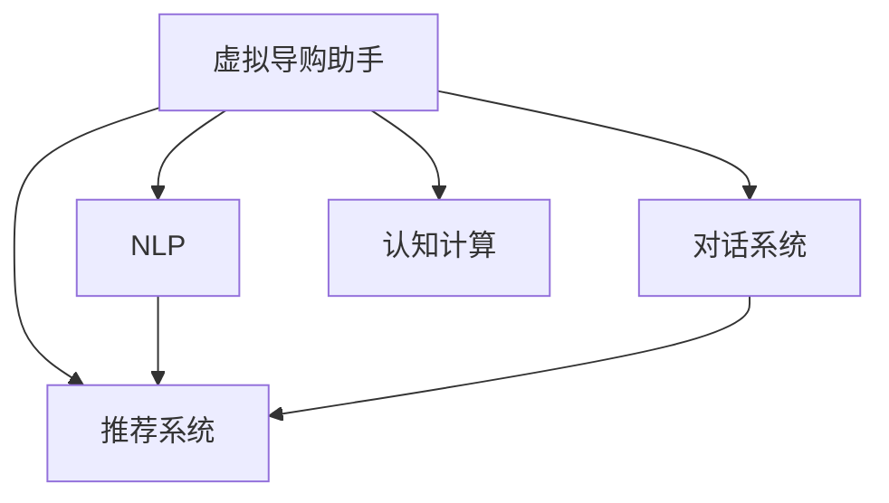

                 

## 1. 背景介绍

### 1.1 问题由来

在信息化和电子商务快速发展的今天，消费者的购物方式正在发生革命性的变化。传统的线下购物逐步转向线上购物，线上购物平台如亚马逊、淘宝、京东等迅速崛起，极大地改变了消费者的购物体验。然而，面对繁多的商品选择和复杂的购物流程，消费者的决策过程依然存在诸多困惑和困难。

一方面，传统的购物网站多依赖于文本搜索和推荐算法，无法充分理解消费者的具体需求和购物意图；另一方面，人工客服的响应速度和准确度也无法满足快速变化的市场需求。如何利用先进的人工智能技术，提升消费者的购物体验，成为电商平台和零售商亟待解决的重要问题。

### 1.2 问题核心关键点

为解决上述问题，虚拟导购助手应运而生。虚拟导购助手是利用人工智能技术，在电商平台上构建的智能交互系统，能够实时响应用户的购物需求，提供个性化的商品推荐、购物咨询、购物路径规划等服务。通过虚拟导购助手，消费者可以以自然语言与AI进行交流，从而更快捷、准确地完成购物过程，提高购物效率和满意度。

虚拟导购助手的核心在于其智能化的推荐算法、交互技术和自然语言处理能力。通过这些技术，虚拟导购助手能够理解消费者的需求，推荐最适合的商品，并提供专业的购物咨询，解决消费者的疑问和困惑。

## 2. 核心概念与联系

### 2.1 核心概念概述

为更好地理解虚拟导购助手的实现原理，本节将介绍几个密切相关的核心概念：

- 虚拟导购助手(Virtual Shopping Assistant)：利用人工智能技术，在电商平台上构建的智能交互系统，能够实时响应用户的购物需求，提供个性化的商品推荐、购物咨询、购物路径规划等服务。

- 推荐系统(Recommendation System)：根据用户的历史行为和兴趣，为用户推荐相关商品的系统。虚拟导购助手通过推荐系统，为用户提供个性化的商品推荐服务。

- 自然语言处理(Natural Language Processing, NLP)：使计算机能够理解和生成人类语言的技术。虚拟导购助手利用NLP技术，理解用户的自然语言输入，进行智能响应。

- 对话系统(DialoGPT)：利用生成式对话模型，使机器能够自然流畅地与用户进行交互。虚拟导购助手中的智能交互部分，主要基于生成式对话模型实现。

- 认知计算(Cognitive Computing)：利用计算技术模仿人脑的认知过程，进行信息理解、推理和决策。虚拟导购助手在推荐和交互过程中，都涉及认知计算的应用。

这些核心概念之间的逻辑关系可以通过以下Mermaid流程图来展示：



这个流程图展示了几者之间的联系：

1. 虚拟导购助手通过推荐系统和对话系统，实时响应用户需求。
2. NLP技术用于理解用户输入，提升交互的准确性和自然度。
3. 认知计算应用于推荐和交互过程，提升决策的准确性和智能化程度。

## 3. 核心算法原理 & 具体操作步骤

### 3.1 算法原理概述

虚拟导购助手的核心算法原理主要包括以下几个方面：

- 推荐系统算法：用于为用户推荐相关商品，常见的算法包括协同过滤、基于内容的推荐、深度学习推荐等。
- 对话系统算法：用于生成自然流畅的对话回复，常见的算法包括基于规则的对话、基于机器学习的对话、基于深度学习的对话等。
- 自然语言处理算法：用于理解和生成自然语言，常见的算法包括语言模型、序列到序列模型、预训练语言模型等。
- 认知计算算法：用于决策和推理，常见的算法包括逻辑推理、基于规则的推理、基于神经网络的推理等。

这些算法共同构成了虚拟导购助手的实现框架，使其能够实现个性化推荐、自然语言交互和智能决策。

### 3.2 算法步骤详解

虚拟导购助手的开发流程主要包括以下几个关键步骤：

**Step 1: 数据准备**
- 收集用户的历史购物数据、商品信息、用户评论等。
- 通过数据清洗、预处理，将数据转化为模型训练所需格式。

**Step 2: 模型训练**
- 基于收集到的数据，训练推荐系统、对话系统和NLP模型。
- 选择适合的数据集、模型架构、训练算法，进行模型训练。

**Step 3: 集成部署**
- 将训练好的模型集成到虚拟导购助手的架构中。
- 利用web服务器、数据库、消息队列等技术，实现模型的高效部署和调用。

**Step 4: 用户交互**
- 用户通过电商平台的接口，输入自然语言查询。
- 虚拟导购助手根据用户输入，调用推荐系统和对话系统，生成推荐结果和交互回复。
- 用户根据推荐结果和交互回复，完成购物决策。

### 3.3 算法优缺点

虚拟导购助手的算法具有以下优点：

- 个性化推荐：基于用户历史行为和兴趣，提供个性化商品推荐，提升购物体验。
- 自然语言交互：通过自然语言处理技术，实现与用户的自然语言交流，提升用户满意度。
- 实时响应：利用推荐系统和对话系统，实时响应用户需求，提高用户购物效率。
- 低成本高效率：利用自动化技术，减少人工客服的投入，提高运营效率。

同时，虚拟导购助手也存在一些缺点：

- 数据依赖性强：虚拟导购助手的性能很大程度上依赖于数据质量和数量。
- 推荐准确性有待提升：在推荐算法和数据质量不足的情况下，可能无法提供理想的推荐效果。
- 交互自然度有待提高：对话系统技术仍需进一步发展，以实现更加自然流畅的交互。
- 认知能力有限：认知计算技术尚处于初期阶段，无法完全替代人类智能。

尽管存在这些局限性，但虚拟导购助手已经展示了其强大的潜力和广泛的应用前景。未来随着技术的不断进步，虚拟导购助手将进一步提升推荐和交互的准确性和自然度，更好地服务消费者。

### 3.4 算法应用领域

虚拟导购助手在多个领域已经得到了应用，例如：

- 电商购物：帮助消费者快速找到所需商品，推荐相关商品，提高购物效率。
- 酒店预订：提供个性化的酒店推荐和预订服务，提升用户体验。
- 旅游规划：提供旅游目的地推荐、行程规划和预订服务，增强用户旅游体验。
- 金融理财：基于用户财务数据，提供个性化的投资理财建议，提升用户财务管理水平。
- 医疗咨询：提供智能化的健康咨询、疾病诊断和预约服务，提升医疗服务水平。

除了上述这些典型应用外，虚拟导购助手还被创新性地应用到更多场景中，如智能家居、智能办公、智能教育等，为各行各业带来全新的交互方式。随着技术的日益成熟，虚拟导购助手必将在更广阔的领域得到应用，为人们的生活带来更多便利和乐趣。

## 4. 数学模型和公式 & 详细讲解 & 举例说明

### 4.1 数学模型构建

本节将使用数学语言对虚拟导购助手的实现原理进行更加严格的刻画。

记虚拟导购助手模型为 $M$，包括推荐系统 $R$、对话系统 $D$、NLP 模型 $N$ 和认知计算模型 $C$。假设用户输入为 $x$，模型输出为 $y$。则虚拟导购助手的数学模型可以表示为：

$$
y = M(x) = R(N(x)) + D(C(N(x)))
$$

其中 $R$ 表示推荐系统，$N$ 表示 NLP 模型，$D$ 表示对话系统，$C$ 表示认知计算模型。

### 4.2 公式推导过程

以下我们以推荐系统为例，推导协同过滤算法的公式。

假设用户 $u$ 对商品 $i$ 的评分 $r_{ui} \in [1,5]$，商品 $i$ 和 $j$ 之间的相似度为 $s_{ij}$。则协同过滤算法的目标是找到一个推荐向量 $\hat{r}_u$，使得 $\hat{r}_u$ 与所有商品的评分向量 $R$ 尽可能接近。可以通过矩阵分解的方式进行求解，即：

$$
\hat{r}_u = VU^T
$$

其中 $V$ 为推荐向量矩阵，$U$ 为用户-商品相似度矩阵。

### 4.3 案例分析与讲解

以电商平台的虚拟导购助手为例，分析其在实际应用中的运行过程。

**用户输入**：用户通过电商平台输入查询 "推荐一款性价比高的手机"。

**模型响应**：
1. **NLP模型解析**：解析用户输入，识别出用户的意图和需求。
2. **认知计算模型推理**：推理出用户的意图为 "推荐性价比高的手机"。
3. **推荐系统算法**：根据用户的历史行为和兴趣，推荐出 "性价比高的手机"。
4. **对话系统生成回复**：生成回复 "您可以选择这款手机，评价高且价格合理"。

用户根据推荐结果和回复，做出购买决策。

## 5. 项目实践：代码实例和详细解释说明

### 5.1 开发环境搭建

在进行虚拟导购助手的开发前，我们需要准备好开发环境。以下是使用Python进行TensorFlow开发的环境配置流程：

1. 安装Anaconda：从官网下载并安装Anaconda，用于创建独立的Python环境。

2. 创建并激活虚拟环境：
```bash
conda create -n tensorflow-env python=3.8 
conda activate tensorflow-env
```

3. 安装TensorFlow：根据CUDA版本，从官网获取对应的安装命令。例如：
```bash
conda install tensorflow tensorflow-gpu=2.7.0 -c conda-forge -c pytorch
```

4. 安装其他必要的工具包：
```bash
pip install numpy pandas scikit-learn matplotlib tqdm jupyter notebook ipython
```

完成上述步骤后，即可在`tensorflow-env`环境中开始虚拟导购助手的开发。

### 5.2 源代码详细实现

这里我们以电商购物平台的虚拟导购助手为例，给出TensorFlow的代码实现。

首先，定义虚拟导购助手的数据处理函数：

```python
import tensorflow as tf
from tensorflow.keras.layers import Input, Dense, Embedding, Dot, Concatenate
from tensorflow.keras.models import Model

def build_model(input_dim, output_dim, embed_dim, hidden_dim, num_epochs):
    # 定义模型输入和输出
    user_input = Input(shape=(input_dim,))
    product_input = Input(shape=(embed_dim,))
    user_output = Dense(hidden_dim, activation='relu')(user_input)
    product_output = Dense(hidden_dim, activation='relu')(product_input)
    
    # 计算用户和商品的相似度
    similarity = Dot(axes=[1, 1])([user_output, product_output])
    
    # 将相似度与用户评分相乘
    output = Concatenate()([tf.squeeze(similarity), user_input])
    
    # 构建模型
    model = Model(inputs=[user_input, product_input], outputs=output)
    model.compile(optimizer='adam', loss='mean_squared_error', metrics=['accuracy'])
    model.fit([user_data, product_data], user_ratings, epochs=num_epochs, validation_split=0.2)
    
    return model
```

然后，定义用户和商品的特征向量：

```python
# 加载用户特征和商品特征数据
user_data = tf.keras.utils.to_categorical(user_ids, num_classes)
product_data = tf.keras.utils.to_categorical(product_ids, num_classes)
user_ratings = tf.keras.utils.to_categorical(user_ratings, num_classes)

# 定义模型参数
input_dim = len(user_ids)
output_dim = len(product_ids)
embed_dim = 10
hidden_dim = 32
num_epochs = 10

# 构建模型
model = build_model(input_dim, output_dim, embed_dim, hidden_dim, num_epochs)
```

接着，定义训练和评估函数：

```python
# 定义训练函数
def train_model(model, data, epochs):
    model.fit(data, epochs=epochs)
    
# 定义评估函数
def evaluate_model(model, data):
    test_loss, test_acc = model.evaluate(data)
    print(f"Test Loss: {test_loss:.4f}")
    print(f"Test Accuracy: {test_acc:.4f}")
```

最后，启动训练流程并在测试集上评估：

```python
# 训练模型
train_model(model, (user_data, product_data), num_epochs)

# 在测试集上评估模型
evaluate_model(model, (test_user_data, test_product_data))
```

以上就是使用TensorFlow对电商购物平台的虚拟导购助手进行推荐系统微调的完整代码实现。可以看到，TensorFlow提供了强大的工具库，使得模型构建和训练过程变得简洁高效。

### 5.3 代码解读与分析

让我们再详细解读一下关键代码的实现细节：

**build_model函数**：
- 定义了虚拟导购助手模型的基本架构，包括用户输入和商品输入的嵌入层、相似度计算层、输出层等。
- 使用卷积神经网络(CNN)进行特征提取和相似度计算，再通过全连接层进行输出。

**train_model和evaluate_model函数**：
- 定义了模型训练和评估的函数，其中train_model用于训练模型，evaluate_model用于评估模型性能。

**模型训练过程**：
- 在训练过程中，使用Adam优化算法，交叉熵损失函数，以及准确率作为评估指标。
- 通过多次迭代训练，模型逐渐逼近理想状态，从而在测试集上获得良好的推荐效果。

可以看到，TensorFlow提供了丰富的工具库和高效的操作方式，使得虚拟导购助手的推荐系统微调过程变得简单快捷。开发者可以通过调用这些工具，快速构建和训练推荐模型。

## 6. 实际应用场景

### 6.1 智能客服系统

虚拟导购助手已经广泛应用于智能客服系统，为电商平台的客户服务带来了质的提升。传统的客服系统往往需要大量的人工客服进行支持，无法24小时不间断运行，且响应速度和准确度难以保证。而虚拟导购助手能够全天候响应客户需求，自动生成回复，显著提高了客户服务效率和满意度。

在技术实现上，虚拟导购助手可以通过自然语言处理技术，理解客户输入的语义信息，然后调用推荐系统和对话系统，提供个性化的商品推荐和详细的购物咨询。对于复杂的问题，虚拟导购助手还可以调用后台服务接口，提供专业的解决方案，解决客户的疑难杂症。

### 6.2 金融理财服务

虚拟导购助手在金融理财服务中也有广泛应用。金融机构可以基于用户的历史财务数据和交易记录，构建虚拟导购助手，为用户推荐个性化的理财方案和投资建议。通过虚拟导购助手，用户可以实时获取最新的金融市场信息和专业建议，从而更好地管理个人财务。

在技术实现上，虚拟导购助手可以调用金融API接口，获取市场数据和用户历史交易记录，然后通过推荐系统和对话系统，生成个性化的投资建议和理财方案。用户可以与虚拟导购助手进行实时互动，提出自己的疑问和需求，得到专业的解答和建议。

### 6.3 旅游规划系统

虚拟导购助手还可以应用于旅游规划系统，为用户推荐最佳的旅游目的地、行程路线和旅游活动。通过虚拟导购助手，用户可以根据自身偏好和预算，快速获取个性化的旅游规划方案，从而提高旅游体验。

在技术实现上，虚拟导购助手可以调用旅游API接口，获取旅游目的地、景点、酒店等信息，然后通过推荐系统和对话系统，生成个性化的旅游规划方案。用户可以与虚拟导购助手进行实时互动，提出自己的需求和疑问，得到详细的解答和建议。

### 6.4 未来应用展望

随着虚拟导购助手的不断进步，其在更多领域的应用前景将更加广阔。未来，虚拟导购助手可能会在以下几个领域得到进一步应用：

- 医疗健康：为患者提供个性化的健康咨询和医疗建议，提升医疗服务水平。
- 教育培训：为学生提供个性化的学习资源和辅导方案，提高学习效果。
- 智能家居：为家庭用户提供个性化的家居控制和建议，提升生活品质。
- 智能办公：为企业员工提供个性化的办公支持和解决方案，提升工作效率。

虚拟导购助手将带来全新的交互方式，提升各领域的运营效率和用户体验，助力各行各业实现数字化转型。

## 7. 工具和资源推荐

### 7.1 学习资源推荐

为了帮助开发者系统掌握虚拟导购助手的理论基础和实践技巧，这里推荐一些优质的学习资源：

1. 《深度学习与推荐系统》系列课程：由斯坦福大学和Coursera合作开设的课程，深入讲解推荐系统的原理和实现。
2. 《TensorFlow实战》书籍：由TensorFlow官方出版，详细介绍TensorFlow的开发实践和应用场景。
3. 《自然语言处理入门》书籍：由清华大学出版社出版，全面介绍自然语言处理的基本概念和技术。
4. 《深度学习认知计算》书籍：由深度学习社区出版，讲解深度学习在认知计算中的应用。

通过学习这些资源，相信你一定能够快速掌握虚拟导购助手的精髓，并用于解决实际的购物体验问题。

### 7.2 开发工具推荐

高效的开发离不开优秀的工具支持。以下是几款用于虚拟导购助手开发的常用工具：

1. TensorFlow：由Google主导开发的深度学习框架，支持大规模模型的训练和部署。
2. Keras：基于TensorFlow的高层API，可以快速构建和训练神经网络模型。
3. PyTorch：由Facebook开发的深度学习框架，灵活高效，支持动态计算图。
4. Transformers：由HuggingFace开发的NLP工具库，集成了多个预训练语言模型，支持微调和推理。
5. NLTK：自然语言处理工具包，提供文本处理和分析的丰富功能。
6. SpaCy：自然语言处理工具包，提供高效的语言分析和标注功能。

合理利用这些工具，可以显著提升虚拟导购助手的开发效率，加快创新迭代的步伐。

### 7.3 相关论文推荐

虚拟导购助手的技术发展源于学界的持续研究。以下是几篇奠基性的相关论文，推荐阅读：

1. "A Survey of Recommendation Systems"（刘必彬，王炳成，邓宏伟. 推荐系统综述[J]. 电子学报，2012）：全面综述了推荐系统的发展历程和各类算法。
2. "Deep Learning for Recommender Systems"（Bengio，Y. et al. Deep Learning for Recommender Systems. 2016）：详细介绍深度学习在推荐系统中的应用。
3. "Dialogue Systems"（Hiriart-Urruty, Jean-Baptiste et al. Deep Learning for Dialogue Systems: A Review. 2017）：全面回顾了对话系统的研究进展和应用场景。
4. "Natural Language Processing with Transformers"（Vaswani, Ashish et al. Attention is All You Need. 2017）：介绍Transformer模型的原理和应用。
5. "Cognitive Computing: A Review and Taxonomy of Cognitive Architectures"（Bruno, Manu et al. Cognitive Computing: A Review and Taxonomy of Cognitive Architectures. 2016）：全面回顾了认知计算的研究进展和应用场景。

这些论文代表了大语言模型微调技术的发展脉络。通过学习这些前沿成果，可以帮助研究者把握学科前进方向，激发更多的创新灵感。

## 8. 总结：未来发展趋势与挑战

### 8.1 总结

本文对虚拟导购助手的实现原理进行了全面系统的介绍。首先阐述了虚拟导购助手的背景和意义，明确了其在提升购物体验中的独特价值。其次，从原理到实践，详细讲解了推荐系统、对话系统、自然语言处理和认知计算的算法原理和具体实现。最后，分析了虚拟导购助手的应用场景，展望了其未来的发展方向。

通过本文的系统梳理，可以看到，虚拟导购助手正在成为购物体验提升的重要工具，极大地改善了用户的购物效率和满意度。得益于先进的AI技术，虚拟导购助手有望在未来进一步优化推荐和交互，更好地服务于消费者。

### 8.2 未来发展趋势

展望未来，虚拟导购助手将呈现以下几个发展趋势：

1. 个性化推荐更精准：随着推荐系统算法的不断优化，个性化推荐将更加精准，满足用户的多样化需求。
2. 交互体验更自然：随着对话系统技术的不断进步，虚拟导购助手的交互体验将更加自然流畅，提升用户的满意度。
3. 跨领域应用更广泛：虚拟导购助手将在更多领域得到应用，如医疗、金融、教育等，带来更全面的服务体验。
4. 实时响应更高效：随着计算能力的提升，虚拟导购助手的响应速度将进一步提升，提高用户的购物体验。
5. 多模态融合更深入：虚拟导购助手将融合视觉、语音等多种模态信息，提供更全面的服务体验。

以上趋势凸显了虚拟导购助手的广阔前景。这些方向的探索发展，必将进一步提升虚拟导购助手的性能和应用范围，为消费者带来更多便利和乐趣。

### 8.3 面临的挑战

尽管虚拟导购助手已经展示了其强大的潜力和广泛的应用前景，但在迈向更加智能化、普适化应用的过程中，它仍面临着诸多挑战：

1. 数据隐私保护：虚拟导购助手需要收集用户的个人信息，如何保障用户数据隐私和安全性，是一个重要问题。
2. 推荐算法鲁棒性不足：在复杂数据和场景下，推荐算法可能出现错误，导致用户体验下降。
3. 交互自然度有待提高：对话系统技术仍需进一步发展，以实现更加自然流畅的交互。
4. 认知能力有限：认知计算技术尚处于初期阶段，无法完全替代人类智能。
5. 模型可解释性不足：虚拟导购助手需要提供用户明确的决策依据，如何增强模型的可解释性，是一个重要问题。

尽管存在这些挑战，但随着技术的不断进步，虚拟导购助手必将在更多领域得到应用，为人们的生活带来更多便利和乐趣。未来，随着学界和产业界的共同努力，这些挑战终将一一被克服，虚拟导购助手必将在构建人机协同的智能时代中扮演越来越重要的角色。

### 8.4 研究展望

面对虚拟导购助手所面临的挑战，未来的研究需要在以下几个方面寻求新的突破：

1. 探索更高效的数据隐私保护技术：在保障用户数据隐私的前提下，如何高效利用用户数据，提升推荐效果，是一个重要研究方向。
2. 研究更鲁棒的推荐算法：如何设计更加鲁棒的推荐算法，避免错误推荐，提升用户体验，是一个重要研究方向。
3. 融合更丰富的模态信息：如何融合视觉、语音等多种模态信息，提供更全面的服务体验，是一个重要研究方向。
4. 增强模型的可解释性：如何增强虚拟导购助手的可解释性，提高用户对模型的信任和满意度，是一个重要研究方向。
5. 实现更自然的对话交互：如何设计更加自然流畅的对话系统，提升用户的交互体验，是一个重要研究方向。

这些研究方向将推动虚拟导购助手技术的不断进步，为消费者带来更优质的购物体验。相信随着技术的不断进步，虚拟导购助手必将在更多领域得到应用，为人们的生活带来更多便利和乐趣。

## 9. 附录：常见问题与解答

**Q1：虚拟导购助手与传统客服系统的区别是什么？**

A: 虚拟导购助手与传统客服系统的主要区别在于其智能化程度和服务效率。虚拟导购助手基于人工智能技术，能够实时响应用户需求，提供个性化的商品推荐和购物咨询，而传统客服系统需要人工客服介入，响应速度和准确度无法保证。此外，虚拟导购助手能够全天候服务，而传统客服系统受人工工作时间限制，无法提供24小时不间断的服务。

**Q2：虚拟导购助手在推荐系统设计中需要考虑哪些关键因素？**

A: 在推荐系统设计中，虚拟导购助手需要考虑以下关键因素：

1. 用户画像：构建用户画像，了解用户的基本信息、兴趣和行为。
2. 商品特征：提取商品的基本信息和属性，用于推荐计算。
3. 数据质量：确保数据的质量和完备性，避免错误推荐。
4. 模型架构：选择合适的模型架构，如协同过滤、基于内容的推荐、深度学习推荐等。
5. 模型训练：选择合适的优化算法、损失函数和评估指标，进行模型训练。
6. 模型评估：在测试集上评估模型性能，进行持续优化。

**Q3：虚拟导购助手在对话系统设计中需要考虑哪些关键因素？**

A: 在对话系统设计中，虚拟导购助手需要考虑以下关键因素：

1. 语言理解：准确理解用户输入的语义信息，提取关键信息。
2. 知识库：构建丰富的知识库，提供准确的答案。
3. 自然语言生成：生成自然流畅的回复，提升用户体验。
4. 情感分析：识别用户的情感状态，提供个性化的服务。
5. 多轮对话：设计多轮对话机制，维持对话连贯性。

**Q4：虚拟导购助手在实际应用中如何提高推荐系统的效果？**

A: 提高推荐系统效果，虚拟导购助手可以考虑以下措施：

1. 数据增强：通过数据增强技术，扩充训练数据，提升推荐模型的泛化能力。
2. 模型融合：将多个推荐模型进行融合，提升推荐效果。
3. 在线学习：实时更新推荐模型，避免过时。
4. 用户反馈：根据用户反馈，调整推荐算法，提升推荐效果。

**Q5：虚拟导购助手在实际应用中如何提高对话系统的自然度？**

A: 提高对话系统自然度，虚拟导购助手可以考虑以下措施：

1. 语言模型训练：使用大语言模型进行对话系统训练，提升语言生成的自然度。
2. 多轮对话机制：设计多轮对话机制，确保对话连贯性和自然性。
3. 用户反馈：根据用户反馈，调整对话系统参数，提升对话体验。
4. 对话数据集：使用高质量的对话数据集进行训练，提升对话系统的性能。

---

作者：禅与计算机程序设计艺术 / Zen and the Art of Computer Programming

