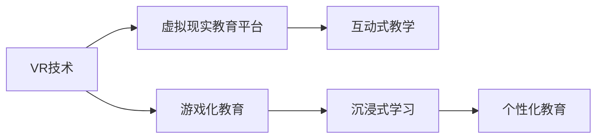

                 

# 虚拟现实儿童教育创业：寓教于乐的沉浸式学习

## 1. 背景介绍

### 1.1 问题由来

随着科技的飞速发展，虚拟现实(VR)技术日益成熟，广泛应用于游戏、影视、军事训练等领域。其沉浸式、交互性强、沉浸感高的特点，让人们重新认识到了这种技术的潜力。但除了这些“硬核”应用，VR在教育领域，尤其是儿童教育领域的应用，正开始引起更多关注。

传统教育方式以教师讲授为主，存在内容枯燥、互动不足、难以个性化等问题。现代教育技术如多媒体、在线课程虽然有所改善，但仍缺乏身临其境的体验感。而虚拟现实技术以其沉浸式体验、真实感强、互动性强等特点，为儿童教育提供了一种全新的方式。

近年来，越来越多的初创公司涌现，瞄准了虚拟现实儿童教育这一蓝海市场。他们通过构建虚拟现实平台，结合游戏化、互动化教学，使学习过程变得生动有趣，有效提升儿童的学习效果和参与度。

### 1.2 问题核心关键点

本文将从以下几个方面探讨虚拟现实儿童教育创业的可行性：

- 虚拟现实技术如何应用于儿童教育？
- 虚拟现实教育平台如何设计？
- 虚拟现实儿童教育创业的核心算法和架构原理是什么？
- 如何评估虚拟现实教育平台的效果？
- 虚拟现实儿童教育创业的商业模式和未来发展趋势如何？

## 2. 核心概念与联系

### 2.1 核心概念概述

为更好地理解虚拟现实儿童教育创业的原理和实践，本节将介绍几个密切相关的核心概念：

- 虚拟现实(Virtual Reality, VR)：通过计算机技术生成的模拟环境，用户可以沉浸其中，与虚拟世界进行交互。
- 儿童教育(Children's Education)：指对0-12岁儿童进行的早期教育，注重语言、认知、情感等多方面的发展。
- 游戏化教育(Game-Based Learning)：将游戏元素和机制引入教育过程，提升学习动机和效果。
- 互动式教学(Interactive Teaching)：通过互动方式提高教学效果，增强学生的参与感和成就感。
- 沉浸式学习(Immersive Learning)：通过沉浸在虚拟环境中，使学习者获得身临其境的体验感。
- 个性化教育(Personalized Education)：根据每个儿童的特点和需求，提供个性化的学习路径和资源。

这些核心概念之间通过虚拟现实技术紧密联系，共同构成了虚拟现实儿童教育创业的理论基础和实践指南。

### 2.2 核心概念原理和架构的 Mermaid 流程图



这个流程图展示了虚拟现实技术在儿童教育中的应用路径，即通过VR技术实现游戏化、互动化教学，最终达到沉浸式和个性化教育的效果。

## 3. 核心算法原理 & 具体操作步骤

### 3.1 算法原理概述

虚拟现实儿童教育创业的核心算法和架构原理，可以从以下几个方面进行探讨：

- **虚拟现实技术原理**：通过计算机生成三维环境，用户佩戴VR设备，如头显、手柄等，与虚拟世界进行交互。VR技术涵盖了渲染、跟踪、碰撞检测、交互反馈等多个方面。
- **游戏化教育算法**：设计互动性强、趣味性高的游戏，如拼图、解谜、角色扮演等，激发儿童的学习兴趣。
- **互动式教学算法**：根据儿童的反应和反馈，动态调整教学内容和难度，提供个性化指导和反馈。
- **沉浸式学习算法**：通过虚拟现实环境模拟真实场景，如动物世界、太空探险、科学实验等，使儿童在真实情境中学习。
- **个性化教育算法**：通过评估儿童的学习进度、兴趣偏好等数据，为每个儿童定制个性化的学习计划和资源。

### 3.2 算法步骤详解

虚拟现实儿童教育创业的算法步骤如下：

**Step 1: 构建虚拟现实教育平台**

1. 选择合适的VR设备和软件工具，如Oculus Rift、HTC Vive、Unity 3D等。
2. 设计虚拟现实场景，如幼儿园教室、科学实验室、天文馆等，满足教学需求。
3. 开发游戏化教育内容，如识字游戏、数学迷宫、物理实验等，寓教于乐。
4. 设计互动式教学模块，如自适应测验、即时反馈、互动问答等，增强学习效果。
5. 实现个性化教育功能，如学习路径定制、进度跟踪、推荐系统等，满足个性化需求。

**Step 2: 数据采集与分析**

1. 收集儿童在虚拟现实平台上的学习数据，如点击次数、完成时间、答题正确率等。
2. 分析数据，评估学习效果和儿童偏好，优化教学内容和策略。
3. 设计评估指标，如知识掌握度、学习动机、参与度等，量化评估学习效果。

**Step 3: 优化与迭代**

1. 根据评估结果，优化游戏化、互动式、沉浸式和个性化教育算法。
2. 引入机器学习模型，如推荐系统、自适应测验、情感分析等，提升教学效果。
3. 进行A/B测试，对比不同算法和内容的效果，不断迭代改进。

### 3.3 算法优缺点

虚拟现实儿童教育创业的算法具有以下优点：

- **沉浸式体验**：虚拟现实技术提供了沉浸式学习环境，使儿童能够身临其境地体验学习过程。
- **互动性强**：游戏化、互动式教学设计，增强了儿童的学习动机和参与感。
- **个性化教学**：通过个性化教育算法，能够根据每个儿童的特点提供定制化的学习方案。
- **多感官融合**：结合视觉、听觉、触觉等多感官输入，提升了学习效果。

但该算法也存在一些缺点：

- **硬件成本高**：VR设备和技术对硬件要求较高，初期投资成本较大。
- **技术门槛高**：设计和开发虚拟现实平台需要较强的技术和创意能力，难以快速上线。
- **数据隐私问题**：收集和分析儿童学习数据涉及隐私保护，需要严格遵守法律法规。
- **交互限制**：部分儿童在虚拟环境中存在交互恐惧或适应障碍，需要逐步引导和适应。

### 3.4 算法应用领域

虚拟现实儿童教育创业的算法和架构原理，可以应用于以下领域：

- 幼儿园教育：通过虚拟现实平台，模拟课堂、实验、故事等场景，进行知识学习。
- 小学教育：结合虚拟现实和AR技术，提升数学、科学、地理等课程的教学效果。
- 儿童心理健康：利用虚拟现实环境进行情感支持、心理辅导、行为矫正等。
- 家庭互动：开发虚拟现实家庭游戏，增进亲子互动，提升儿童社交能力。

## 4. 数学模型和公式 & 详细讲解 & 举例说明

### 4.1 数学模型构建

虚拟现实儿童教育创业的数学模型主要包括以下几个方面：

- **虚拟现实场景模型**：通过几何、拓扑、物理等数学方法，构建虚拟环境的三维模型。
- **游戏化教育模型**：设计游戏规则和任务，通过数学公式计算得分、进度等。
- **互动式教学模型**：根据儿童的反应和反馈，动态调整教学难度和内容。
- **沉浸式学习模型**：通过数学模型模拟真实场景，如物理定律、生物过程等。
- **个性化教育模型**：通过数学算法分析儿童数据，制定个性化学习方案。

### 4.2 公式推导过程

以下以一个简单的虚拟现实学习场景为例，推导数学模型和公式：

**场景描述**：
- 假设在一个虚拟实验室中，儿童需要通过观察、实验和互动，学习光的反射定律。
- 场景中包含光源、镜面、物体、反射光等元素。

**数学模型**：
- **光源模型**：光源位置为 $(x_0, y_0, z_0)$，强度为 $I_0$。
- **镜面模型**：镜面方程为 $z=ax+by+c$，反射系数为 $k$。
- **物体模型**：物体形状为 $(x_1, y_1, z_1)$，反射系数为 $k_1$。
- **反射光模型**：反射光强度为 $I_r$，计算公式为 $I_r = k_1 \times k \times I_0 \times \cos(\theta)$，其中 $\theta$ 为入射角。

**公式推导**：
1. 光源发出的光束经过镜面反射后，到达物体表面的强度为 $I_1 = I_0 \times k \times \cos(\theta_1)$。
2. 物体表面反射光线到达观察者眼中的强度为 $I_r = k_1 \times k \times I_0 \times \cos(\theta)$。
3. 通过计算反射光强度 $I_r$，计算观察者眼睛接收到反射光强度 $I_{obs}$，得到观察者的视觉体验。

### 4.3 案例分析与讲解

**案例背景**：
- 某虚拟现实儿童教育平台，开发了一款关于光学原理的教育游戏，让儿童通过虚拟实验室，进行光的反射定律学习。

**案例分析**：
1. **场景设计**：构建虚拟实验室，设置光源、镜面、物体等元素，设计交互界面。
2. **游戏规则**：设置实验步骤、任务目标、得分计算等。
3. **互动教学**：实时记录儿童的操作和反馈，动态调整教学难度和内容。
4. **数据分析**：收集儿童的操作数据、答题正确率等，分析学习效果和兴趣偏好。
5. **评估指标**：设计知识掌握度、学习动机、参与度等评估指标，量化评估学习效果。

## 5. 项目实践：代码实例和详细解释说明

### 5.1 开发环境搭建

为了搭建虚拟现实儿童教育平台，我们需要准备以下开发环境：

1. **硬件设备**：VR头显、手柄等设备，支持Unity 3D等开发环境。
2. **软件工具**：Unity 3D、Unity VR SDK、Blender等，用于场景设计和游戏开发。
3. **开发语言**：C#、JavaScript等，支持Unity 3D开发。

### 5.2 源代码详细实现

以下是一个简单的虚拟现实游戏化教育的示例代码，用于实现光的反射定律学习：

```csharp
using UnityEngine;
using UnityEngine.UI;

public class ReflectionGame : MonoBehaviour
{
    public GameObject light;
    public GameObject mirror;
    public GameObject object;
    public Text scoreText;

    void Update()
    {
        // 光源位置和强度
        Vector3 lightPos = light.transform.position;
        float lightIntensity = light.GetComponent<Light>().intensity;

        // 镜面方程和反射系数
        float a = mirror.GetComponent<MeshRenderer>().material.GetFloat("a");
        float b = mirror.GetComponent<MeshRenderer>().material.GetFloat("b");
        float c = mirror.GetComponent<MeshRenderer>().material.GetFloat("c");
        float k = mirror.GetComponent<MeshRenderer>().material.GetFloat("k");

        // 物体位置和反射系数
        Vector3 objPos = object.transform.position;
        float objK = object.GetComponent<MeshRenderer>().material.GetFloat("k1");

        // 反射光强度计算
        float angle = Vector3.Angle(lightPos - objPos, mirror.transform.position - objPos);
        float cosTheta = Mathf.Cos(angle);
        float Ir = objK * k * lightIntensity * cosTheta;

        // 显示分数
        scoreText.text = "得分：" + Ir.ToString();

        // 动画效果
        light.transform.position = objPos;
        mirror.transform.rotation = Quaternion.Euler(0, 0, 45);
        object.transform.Rotate(0, 0, -45);
    }
}
```

### 5.3 代码解读与分析

**代码解读**：
- `ReflectionGame` 类：表示光的反射定律学习的游戏对象。
- `light` 和 `mirror` 和 `object`：分别表示光源、镜面和物体，初始位置由Unity UI工具自动设置。
- `scoreText`：显示儿童得分的文本对象。

**代码分析**：
1. 通过 `light` 和 `mirror` 和 `object` 对象的位置和属性，计算反射光的强度。
2. 根据反射光的强度，实时更新得分文本。
3. 通过动画效果，模拟光源和物体的移动。

### 5.4 运行结果展示

运行上述代码，儿童可以在虚拟实验室中，通过操控光源、镜面和物体，观察光的反射定律，并实时看到得分。这种交互式、沉浸式和游戏化的学习方式，可以显著提升儿童的学习效果和参与度。

## 6. 实际应用场景

### 6.1 幼儿园教育

幼儿园教育是虚拟现实儿童教育创业的重要应用场景。通过虚拟现实平台，可以让儿童在虚拟实验室、游戏和故事中，进行基础认知、语言和社交能力的培养。

**应用场景**：
- 虚拟幼儿园：通过虚拟现实设备，儿童可以体验幼儿园课堂、活动室、户外游戏等场景。
- 游戏化学习：设计识字、数数、拼图等游戏，让儿童在游戏中学习。
- 互动式教学：实时记录儿童的操作和反馈，提供个性化指导和反馈。

### 6.2 小学教育

小学教育是虚拟现实儿童教育创业的另一个重要应用场景。通过虚拟现实和AR技术，可以提升数学、科学、地理等课程的教学效果。

**应用场景**：
- 虚拟实验室：进行科学实验、物理实验等，提升学生的动手能力。
- 虚拟旅行：进行虚拟博物馆、天文馆等旅行，开阔学生的视野。
- 虚拟学习：通过虚拟现实平台，进行语文、英语等课程的学习。

### 6.3 儿童心理健康

虚拟现实儿童教育创业在儿童心理健康领域也具有广泛应用。通过虚拟现实环境进行情感支持、心理辅导、行为矫正等，可以帮助儿童应对心理问题，提升心理健康水平。

**应用场景**：
- 虚拟心理辅导：通过虚拟心理医生，进行心理咨询和辅导。
- 虚拟行为矫正：进行虚拟情景模拟，帮助儿童应对行为问题。
- 虚拟社交支持：通过虚拟朋友和场景，增强儿童的社交能力。

### 6.4 家庭互动

虚拟现实儿童教育创业在家庭互动方面也有重要应用。开发虚拟现实家庭游戏，增进亲子互动，提升儿童的社交能力和认知能力。

**应用场景**：
- 虚拟家庭游戏：如虚拟餐厅、虚拟超市等，增强亲子互动。
- 虚拟玩具：通过虚拟玩具进行互动，提升儿童的认知和社交能力。
- 虚拟学习伙伴：通过虚拟学习伙伴，提升儿童的学习动机和效果。

## 7. 工具和资源推荐

### 7.1 学习资源推荐

为了帮助开发者系统掌握虚拟现实儿童教育创业的理论基础和实践技巧，这里推荐一些优质的学习资源：

1. **《虚拟现实技术基础》**：全面介绍了虚拟现实技术的原理、应用和开发工具。适合初学者入门。
2. **《游戏化学习设计》**：介绍了游戏化学习的设计原则和实践方法，帮助开发有趣且有效的内容。
3. **《交互式教育技术》**：介绍了互动式教学的技术和实践案例，提升教学效果。
4. **《个性化教育》**：介绍了个性化教育的理论和方法，帮助开发个性化学习方案。
5. **《虚拟现实教育平台开发指南》**：介绍了虚拟现实教育平台的开发流程和工具，适合开发者参考。

通过对这些资源的学习实践，相信你一定能够快速掌握虚拟现实儿童教育创业的理论基础和实践技巧，并用于解决实际的NLP问题。

### 7.2 开发工具推荐

为了提高虚拟现实儿童教育创业的开发效率，这里推荐一些常用的开发工具：

1. **Unity 3D**：开源的跨平台游戏引擎，支持VR、AR等多种技术。适合开发虚拟现实教育平台。
2. **Blender**：开源的三维建模软件，支持导入和导出多种格式。适合制作虚拟场景和角色。
3. **Vuforia**：增强现实SDK，支持图像识别和跟踪，适合开发AR应用。
4. **Tiled**：地图编辑器，支持制作交互式游戏地图。适合开发互动式教育内容。

合理利用这些工具，可以显著提升虚拟现实儿童教育创业的开发效率，加快创新迭代的步伐。

### 7.3 相关论文推荐

虚拟现实儿童教育创业的研究始于学界的持续研究。以下是几篇奠基性的相关论文，推荐阅读：

1. **《虚拟现实技术在教育中的应用》**：介绍了虚拟现实技术在教育领域的应用，包括虚拟实验室、虚拟场景等。
2. **《游戏化学习与认知发展》**：探讨了游戏化学习对儿童认知发展的影响，提供了理论依据和实践方法。
3. **《互动式教学与学习效果》**：研究了互动式教学对学生学习效果的影响，提供了量化评估方法。
4. **《个性化教育模型与算法》**：介绍了个性化教育模型的构建方法和应用案例。

这些论文代表了大语言模型微调技术的发展脉络。通过学习这些前沿成果，可以帮助研究者把握学科前进方向，激发更多的创新灵感。

## 8. 总结：未来发展趋势与挑战

### 8.1 总结

本文对虚拟现实儿童教育创业的可行性进行了全面系统的介绍。首先阐述了虚拟现实技术在儿童教育中的应用路径，明确了虚拟现实教育平台的构建方法。其次，从算法原理、操作步骤、优缺点等方面，详细讲解了虚拟现实儿童教育创业的核心算法和架构原理。最后，本文还广泛探讨了虚拟现实儿童教育创业的实际应用场景、学习资源、开发工具和未来发展趋势，为开发者提供了全面的技术指引。

通过本文的系统梳理，可以看到，虚拟现实儿童教育创业具有广阔的应用前景和巨大的市场潜力。虚拟现实技术以其沉浸式体验、互动性强、个性化教学等优势，为儿童教育带来了全新的方式，必将对教育产业产生深远影响。

### 8.2 未来发展趋势

展望未来，虚拟现实儿童教育创业将呈现以下几个发展趋势：

1. **技术进步**：随着硬件设备的进步和软件技术的提升，虚拟现实设备的成本将进一步降低，普及率将大幅提升。
2. **内容创新**：结合最新的教育理论和技术，开发更多有趣且有效的教育内容，提升学习效果。
3. **个性化定制**：通过大数据和人工智能技术，为每个儿童提供个性化的学习方案，满足其独特需求。
4. **多模态融合**：结合虚拟现实、增强现实、混合现实等技术，提供更丰富的交互方式。
5. **跨平台应用**：开发跨平台的虚拟现实教育平台，方便儿童在任何设备上使用。
6. **教育数据分析**：利用大数据和人工智能技术，分析儿童的学习行为和效果，优化教学策略。

### 8.3 面临的挑战

尽管虚拟现实儿童教育创业具有广阔的应用前景，但在迈向更加智能化、普适化应用的过程中，仍面临诸多挑战：

1. **硬件设备**：虚拟现实设备的成本较高，初期投资较大。需要寻找更便宜、更稳定的替代方案。
2. **技术门槛**：开发虚拟现实教育平台需要较强的技术和创意能力，开发周期较长。
3. **数据隐私**：收集和分析儿童学习数据涉及隐私保护，需要严格遵守法律法规。
4. **用户体验**：部分儿童在虚拟环境中存在交互恐惧或适应障碍，需要逐步引导和适应。
5. **内容质量**：需要保证内容的趣味性和教育性，避免内容过于单调或低质量。
6. **推广和营销**：需要有效推广和营销，吸引更多家长和儿童使用。

### 8.4 研究展望

面向未来，虚拟现实儿童教育创业需要进一步探索和优化：

1. **跨学科融合**：结合心理学、教育学、计算机科学等多学科知识，提升教育内容的质量和效果。
2. **人工智能应用**：利用人工智能技术，实现自适应测验、个性化推荐等功能，提升学习效果。
3. **社会实验**：开展大规模的社会实验，评估虚拟现实教育的效果和影响。
4. **跨平台协作**：与其他企业、学校、社区等合作，共同推进虚拟现实教育的发展。
5. **政策支持**：争取政府和教育部门的政策支持，推动虚拟现实教育的标准化和规范化。

总之，虚拟现实儿童教育创业具有广阔的应用前景，但也面临诸多挑战。只有不断优化技术、创新内容、提升用户体验，才能更好地实现其商业价值和社会价值。通过本文的系统梳理，相信虚拟现实儿童教育创业将迎来更加美好的未来。

## 9. 附录：常见问题与解答

**Q1：虚拟现实设备对儿童的健康有影响吗？**

A: 虚拟现实设备对儿童健康的影响是一个复杂的问题，需要综合考虑设备使用时间和使用方式。适度的虚拟现实游戏和互动可以提升儿童的认知和社交能力，但长时间高强度使用可能会对眼睛和认知产生负面影响。建议家长和教师合理控制使用时间，并指导儿童正确使用设备。

**Q2：如何评估虚拟现实教育平台的效果？**

A: 评估虚拟现实教育平台的效果可以从以下几个方面进行：
1. **知识掌握度**：通过考试、测验等方式，评估儿童对知识的掌握程度。
2. **学习动机**：通过问卷调查、行为分析等方式，评估儿童的学习动机和兴趣。
3. **参与度**：通过统计使用数据、行为数据等方式，评估儿童的使用频率和参与度。
4. **社交能力**：通过互动记录、社交分析等方式，评估儿童的社交能力和合作能力。

**Q3：虚拟现实教育平台如何与传统教育结合？**

A: 虚拟现实教育平台可以与传统教育结合，形成互补的混合教育模式：
1. **课堂辅助**：在传统课堂中引入虚拟现实内容，辅助教师进行教学。
2. **课外拓展**：利用虚拟现实平台进行课外学习和互动，增强学习效果。
3. **个性化教学**：根据虚拟现实平台的学习数据，为每个儿童提供个性化的学习方案。

**Q4：虚拟现实教育平台的商业模式如何设计？**

A: 虚拟现实教育平台的商业模式可以包括以下几种：
1. **订阅制**：提供月度或年度订阅服务，收取固定费用。
2. **按需付费**：按次收费，满足偶尔使用需求。
3. **广告投放**：通过平台展示广告，获取广告收入。
4. **合作推广**：与其他教育机构合作，共同推广产品。

**Q5：虚拟现实教育平台如何确保数据隐私和安全？**

A: 虚拟现实教育平台需要采取以下措施确保数据隐私和安全：
1. **数据加密**：对儿童的个人信息和数据进行加密，防止泄露。
2. **访问控制**：设置访问权限，只允许授权人员访问敏感数据。
3. **数据匿名化**：对儿童的个人信息进行匿名化处理，防止识别。
4. **安全审计**：定期进行安全审计，发现和修复安全漏洞。

总之，虚拟现实儿童教育创业具有广阔的应用前景，但也面临诸多挑战。只有不断优化技术、创新内容、提升用户体验，才能更好地实现其商业价值和社会价值。通过本文的系统梳理，相信虚拟现实儿童教育创业将迎来更加美好的未来。

---

作者：禅与计算机程序设计艺术 / Zen and the Art of Computer Programming

