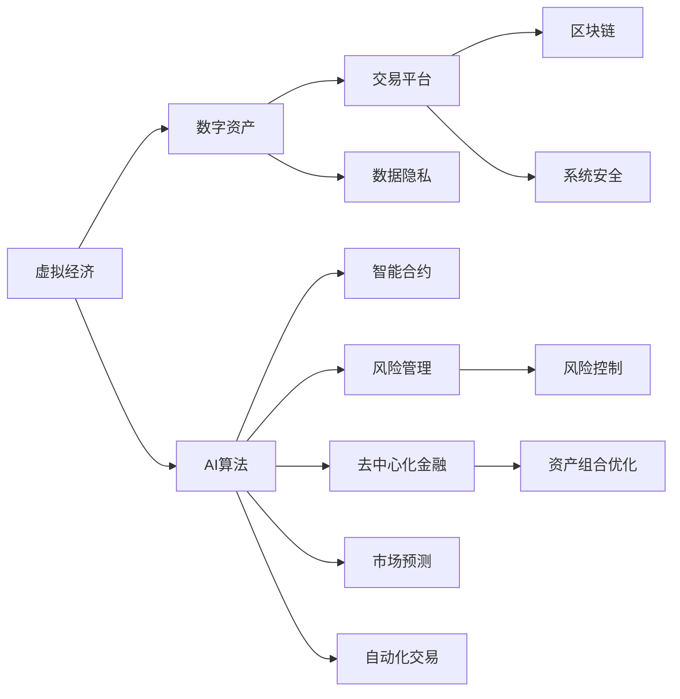
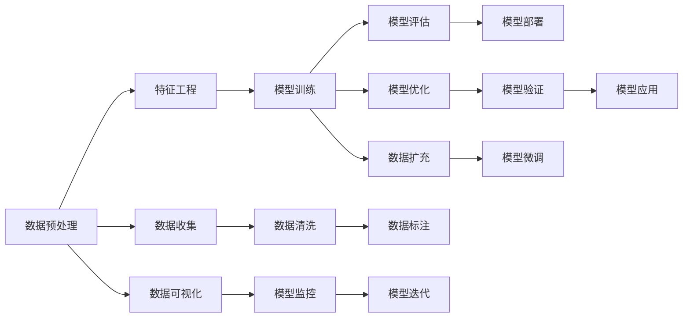

                 

## 1. 背景介绍

### 1.1 问题由来
随着互联网和区块链技术的迅速发展，虚拟经济（Virtual Economy）成为了全球经济领域中不可忽视的一部分。虚拟经济以数字资产和网络空间为载体，在很大程度上依赖于人工智能（AI）技术的支持。AI不仅在数字资产交易、风险管理、市场预测等方面发挥着关键作用，还推动了虚拟经济中的智能合约、去中心化金融（DeFi）等新业态的发展。

虚拟经济的出现，打破了传统经济模式的时间和空间限制，使得交易、融资、投资等活动更加便捷和高效。然而，由于虚拟经济的虚拟性和复杂性，其内在机制和风险特征与实体经济存在显著差异。AI技术在虚拟经济中的应用，既带来了巨大机遇，也引发了一系列挑战。因此，深入理解AI在虚拟经济中的作用及其面临的挑战，具有重要的理论和实践意义。

### 1.2 问题核心关键点
AI在虚拟经济中的作用主要体现在以下几个方面：

- 数字资产交易：AI算法能够分析市场数据，预测价格趋势，辅助交易决策。
- 风险管理：通过机器学习模型识别和预测风险，进行风险控制和资产组合优化。
- 智能合约：AI技术能够使智能合约更加智能和自适应，提高交易效率和安全性。
- 去中心化金融（DeFi）：AI算法在DeFi平台中用于自动执行合约、提供贷款、进行市场预测等。
- 市场预测和自动化交易：AI技术能够实时分析市场数据，预测市场趋势，自动化执行交易策略。

AI在虚拟经济中的应用，使虚拟经济更加高效和智能，但同时也面临着数据隐私、算法公平性、系统安全等挑战。因此，如何在充分发挥AI技术优势的同时，有效应对其潜在风险，成为当前虚拟经济领域的重要课题。

### 1.3 问题研究意义
研究AI在虚拟经济中的作用及其面临的挑战，对于推动虚拟经济的健康发展、促进金融科技创新具有重要意义：

1. 提升虚拟经济效率：AI技术可以显著提高虚拟经济中的交易、融资、投资等活动的效率和透明度。
2. 促进金融创新：AI在虚拟经济中的应用，推动了智能合约、DeFi等新业态的发展，拓宽了金融创新的边界。
3. 提高风险管理能力：AI算法能够更准确地识别和预测风险，有助于提升虚拟经济的安全性和稳定性。
4. 增强市场预测准确性：AI模型能够实时分析市场数据，预测价格趋势，为投资者提供更有价值的决策支持。
5. 优化资源配置：AI技术能够优化虚拟经济中的资产组合，提高资源配置效率。

## 2. 核心概念与联系

### 2.1 核心概念概述

虚拟经济和AI技术是两个关键概念，它们之间的联系可以通过以下图示表示：



这个流程图展示了虚拟经济与AI技术之间的主要联系：

- 数字资产作为虚拟经济的载体，通过交易平台进行交易。
- AI算法在虚拟经济中的应用，涵盖智能合约、风险管理、去中心化金融、市场预测和自动化交易等多个方面。
- 区块链技术为虚拟经济提供了底层支持，保障了交易的安全性和透明性。
- 数据隐私和安全问题，是虚拟经济中AI应用面临的重要挑战。
- 风险控制和资产组合优化，是AI在虚拟经济中的关键应用场景。

### 2.2 核心概念原理和架构的 Mermaid 流程图



这个流程图展示了AI在虚拟经济中的工作流程：

- 数据预处理：对原始数据进行清洗、归一化、分词等预处理操作。
- 特征工程：提取和构造模型需要的特征，如词频、TF-IDF、词嵌入等。
- 模型训练：使用历史数据训练AI模型，如线性回归、逻辑回归、随机森林、神经网络等。
- 模型评估：使用验证集评估模型性能，如准确率、召回率、F1分数等。
- 模型部署：将训练好的模型部署到生产环境中，进行实时预测。
- 模型优化：使用在线学习等技术，不断优化模型性能。
- 模型应用：在虚拟经济中的各个场景中使用模型，如智能合约、风险管理、去中心化金融等。
- 数据收集：持续收集新数据，丰富训练数据集。
- 数据清洗：对新数据进行清洗和预处理。
- 数据标注：对新数据进行标注，如标记交易类型、风险等级等。
- 模型微调：根据新数据微调模型，提高模型适应性。
- 数据可视化：对模型输出进行可视化展示，辅助理解和决策。
- 模型监控：实时监控模型性能，发现和解决问题。
- 模型迭代：不断迭代模型，提升模型效果。

## 3. 核心算法原理 & 具体操作步骤

### 3.1 算法原理概述
AI在虚拟经济中的应用，主要依赖于机器学习和深度学习等算法。以下是对这些算法的简要介绍：

- 机器学习（Machine Learning）：通过统计学习模型对数据进行建模，包括监督学习、无监督学习和半监督学习等。
- 深度学习（Deep Learning）：使用多层神经网络对复杂数据进行建模，包括卷积神经网络（CNN）、循环神经网络（RNN）、变分自编码器（VAE）等。
- 强化学习（Reinforcement Learning）：通过智能体与环境的交互，学习最优策略，适用于自动化交易和智能合约等场景。
- 自然语言处理（NLP）：使用AI技术处理和分析文本数据，如情感分析、实体识别、命名实体识别等。
- 图像识别和处理：使用AI技术处理和分析图像数据，如图像分类、目标检测、图像生成等。

这些算法在虚拟经济中的应用，使虚拟经济更加智能化和高效化，但同时也带来了数据隐私、算法公平性、系统安全等挑战。

### 3.2 算法步骤详解
以下是AI在虚拟经济中的主要算法步骤：

**步骤1：数据收集与预处理**

1. 数据收集：从虚拟经济平台、交易记录、市场数据等来源，收集相关数据。
2. 数据清洗：对收集的数据进行清洗，去除噪音和错误数据。
3. 数据标注：对清洗后的数据进行标注，如交易类型、风险等级、情感倾向等。

**步骤2：特征工程**

1. 特征提取：使用词频、TF-IDF、词嵌入等方法，提取文本特征。
2. 特征选择：使用统计方法和算法选择最相关的特征。
3. 特征缩放：对特征进行归一化和标准化处理。

**步骤3：模型训练与优化**

1. 模型选择：选择适合虚拟经济任务的模型，如线性回归、逻辑回归、神经网络等。
2. 模型训练：使用历史数据对模型进行训练，如交叉验证、随机梯度下降等。
3. 模型优化：使用正则化、Dropout、早停等技术，防止过拟合。
4. 模型验证：使用验证集评估模型性能，如准确率、召回率、F1分数等。
5. 模型微调：根据新数据微调模型，提高模型适应性。

**步骤4：模型部署与监控**

1. 模型部署：将训练好的模型部署到生产环境中，进行实时预测。
2. 模型监控：实时监控模型性能，发现和解决问题。
3. 模型迭代：不断迭代模型，提升模型效果。

### 3.3 算法优缺点

AI在虚拟经济中的应用，具有以下优点：

1. 高效性：AI算法能够快速处理大量数据，实时分析市场趋势，提供决策支持。
2. 透明性：AI算法可提供透明的决策过程，使投资者和交易者更易于理解和接受。
3. 泛化能力：AI模型能够泛化到不同类型的虚拟经济数据，适应不同的应用场景。
4. 自动化交易：AI算法能够自动化执行交易策略，降低交易成本和人为错误。

但同时也存在以下缺点：

1. 数据隐私：AI算法需要大量数据进行训练，涉及数据隐私和安全问题。
2. 算法公平性：AI算法可能会存在偏见和歧视，需要确保算法公平性和透明性。
3. 系统安全：AI算法在虚拟经济中的应用，需要考虑系统的安全性和稳定性。
4. 模型复杂性：AI模型通常较为复杂，需要大量的计算资源和专业知识。

### 3.4 算法应用领域

AI在虚拟经济中的应用广泛，涵盖以下领域：

- 数字资产交易：使用AI算法进行市场分析、价格预测和交易决策。
- 风险管理：使用机器学习模型进行风险识别和预测，进行风险控制和资产组合优化。
- 智能合约：使用AI技术使智能合约更加智能和自适应，提高交易效率和安全性。
- 去中心化金融（DeFi）：使用AI算法提供贷款、自动执行合约等自动化服务。
- 市场预测：使用AI模型实时分析市场数据，预测市场趋势，辅助投资决策。
- 自动化交易：使用AI算法自动化执行交易策略，降低交易成本和人为错误。
- 金融监管：使用AI技术进行金融监管，识别和防范非法交易和欺诈行为。
- 数据隐私保护：使用AI技术保护用户数据隐私，确保数据安全。

## 4. 数学模型和公式 & 详细讲解

### 4.1 数学模型构建

虚拟经济中的AI应用，主要依赖于统计学习模型和深度学习模型。以下是对这些模型的简要介绍：

**线性回归模型（Linear Regression）**

线性回归模型用于预测虚拟资产的价格，假设价格 $y$ 与影响因素 $x_i$ 之间存在线性关系：

$$
y = \beta_0 + \beta_1 x_1 + \beta_2 x_2 + \cdots + \beta_n x_n + \epsilon
$$

其中 $\beta_i$ 为系数，$\epsilon$ 为误差项。使用最小二乘法求解 $\beta_i$：

$$
\beta_i = \frac{\sum_{j=1}^n (x_{ij} - \bar{x}_i) (y_j - \bar{y})}{\sum_{j=1}^n (x_{ij} - \bar{x}_i)^2}
$$

**逻辑回归模型（Logistic Regression）**

逻辑回归模型用于预测虚拟资产的风险等级，假设风险等级 $y$ 与影响因素 $x_i$ 之间存在逻辑关系：

$$
P(y=1|x_1, x_2, \cdots, x_n) = \frac{1}{1 + e^{-\beta_0 - \beta_1 x_1 - \beta_2 x_2 - \cdots - \beta_n x_n}}
$$

其中 $\beta_i$ 为系数，$e$ 为自然常数。使用交叉熵损失函数进行模型训练：

$$
L(y, \hat{y}) = -y \log \hat{y} - (1-y) \log (1-\hat{y})
$$

**卷积神经网络（Convolutional Neural Network）**

卷积神经网络用于图像识别和处理，假设输入图像 $x$ 和输出图像 $y$ 之间存在卷积关系：

$$
y_i = \sum_{j=1}^n w_{ij} x_j
$$

其中 $w_{ij}$ 为卷积核，$x_j$ 为卷积核与输入图像的卷积结果。使用交叉熵损失函数进行模型训练：

$$
L(y, \hat{y}) = -\frac{1}{N} \sum_{i=1}^N \sum_{j=1}^C y_j \log \hat{y}_j
$$

### 4.2 公式推导过程

**线性回归模型**

假设虚拟资产价格 $y$ 与影响因素 $x_i$ 之间存在线性关系：

$$
y = \beta_0 + \beta_1 x_1 + \beta_2 x_2 + \cdots + \beta_n x_n + \epsilon
$$

使用最小二乘法求解 $\beta_i$：

$$
\beta_i = \frac{\sum_{j=1}^n (x_{ij} - \bar{x}_i) (y_j - \bar{y})}{\sum_{j=1}^n (x_{ij} - \bar{x}_i)^2}
$$

其中 $\bar{x}_i$ 和 $\bar{y}$ 为样本均值。

**逻辑回归模型**

假设虚拟资产风险等级 $y$ 与影响因素 $x_i$ 之间存在逻辑关系：

$$
P(y=1|x_1, x_2, \cdots, x_n) = \frac{1}{1 + e^{-\beta_0 - \beta_1 x_1 - \beta_2 x_2 - \cdots - \beta_n x_n}}
$$

使用交叉熵损失函数进行模型训练：

$$
L(y, \hat{y}) = -y \log \hat{y} - (1-y) \log (1-\hat{y})
$$

**卷积神经网络**

假设输入图像 $x$ 和输出图像 $y$ 之间存在卷积关系：

$$
y_i = \sum_{j=1}^n w_{ij} x_j
$$

其中 $w_{ij}$ 为卷积核，$x_j$ 为卷积核与输入图像的卷积结果。使用交叉熵损失函数进行模型训练：

$$
L(y, \hat{y}) = -\frac{1}{N} \sum_{i=1}^N \sum_{j=1}^C y_j \log \hat{y}_j
$$

### 4.3 案例分析与讲解

**案例1：数字资产交易**

假设某虚拟货币价格 $y$ 与市场情绪 $x_1$、技术指标 $x_2$、交易量 $x_3$ 之间存在线性关系：

$$
y = \beta_0 + \beta_1 x_1 + \beta_2 x_2 + \beta_3 x_3 + \epsilon
$$

使用历史数据进行模型训练：

1. 数据收集：收集市场情绪、技术指标、交易量等数据。
2. 数据预处理：清洗和标准化数据。
3. 特征工程：提取价格、市场情绪、技术指标、交易量等特征。
4. 模型训练：使用线性回归模型对数据进行建模。
5. 模型评估：使用验证集评估模型性能。
6. 模型微调：根据新数据微调模型，提高模型适应性。
7. 模型应用：实时预测虚拟货币价格，辅助交易决策。

**案例2：风险管理**

假设虚拟资产风险等级 $y$ 与市场情绪 $x_1$、技术指标 $x_2$、历史风险 $x_3$ 之间存在逻辑关系：

$$
P(y=1|x_1, x_2, x_3) = \frac{1}{1 + e^{-\beta_0 - \beta_1 x_1 - \beta_2 x_2 - \beta_3 x_3}}
$$

使用历史数据进行模型训练：

1. 数据收集：收集市场情绪、技术指标、历史风险等数据。
2. 数据预处理：清洗和标准化数据。
3. 特征工程：提取市场情绪、技术指标、历史风险等特征。
4. 模型训练：使用逻辑回归模型对数据进行建模。
5. 模型评估：使用验证集评估模型性能。
6. 模型微调：根据新数据微调模型，提高模型适应性。
7. 模型应用：实时预测虚拟资产风险等级，进行风险控制和资产组合优化。

## 5. 项目实践：代码实例和详细解释说明

### 5.1 开发环境搭建

在进行AI在虚拟经济中的应用开发时，需要安装以下开发环境：

1. 安装Python：从官网下载并安装Python，推荐使用3.x版本。
2. 安装Pandas：用于数据处理和分析。
3. 安装Numpy：用于数值计算和矩阵操作。
4. 安装Scikit-learn：用于机器学习模型构建和评估。
5. 安装TensorFlow或PyTorch：用于深度学习模型构建和训练。
6. 安装Jupyter Notebook：用于数据探索和模型验证。

### 5.2 源代码详细实现

**案例1：数字资产交易**

```python
import pandas as pd
import numpy as np
from sklearn.linear_model import LinearRegression
from sklearn.model_selection import train_test_split
from sklearn.metrics import mean_squared_error

# 数据读取
data = pd.read_csv('crypto_data.csv')

# 数据预处理
data = data.dropna()

# 特征选择
features = data[['market_mood', 'technical_indicators', 'volume']]
target = data['price']

# 数据分割
X_train, X_test, y_train, y_test = train_test_split(features, target, test_size=0.2, random_state=42)

# 模型训练
model = LinearRegression()
model.fit(X_train, y_train)

# 模型评估
y_pred = model.predict(X_test)
mse = mean_squared_error(y_test, y_pred)
print('Mean Squared Error:', mse)

# 模型应用
new_data = np.array([[1.0, 0.8, 10000.0]])
new_price = model.predict(new_data)
print('Predicted Price:', new_price)
```

**案例2：风险管理**

```python
import pandas as pd
import numpy as np
from sklearn.linear_model import LogisticRegression
from sklearn.model_selection import train_test_split
from sklearn.metrics import classification_report

# 数据读取
data = pd.read_csv('crypto_risk.csv')

# 数据预处理
data = data.dropna()

# 特征选择
features = data[['market_mood', 'technical_indicators', 'historical_risk']]
target = data['risk_level']

# 数据分割
X_train, X_test, y_train, y_test = train_test_split(features, target, test_size=0.2, random_state=42)

# 模型训练
model = LogisticRegression()
model.fit(X_train, y_train)

# 模型评估
y_pred = model.predict(X_test)
print(classification_report(y_test, y_pred))

# 模型应用
new_data = np.array([[1.0, 0.8, 10000.0]])
new_risk = model.predict_proba(new_data)
print('Predicted Risk:', new_risk)
```

### 5.3 代码解读与分析

**案例1：数字资产交易**

1. 数据读取：使用Pandas读取CSV文件，存储虚拟资产价格、市场情绪、技术指标和交易量等数据。
2. 数据预处理：使用dropna方法删除缺失值。
3. 特征选择：选择市场情绪、技术指标和交易量作为特征，虚拟资产价格作为目标变量。
4. 数据分割：将数据集分为训练集和测试集，用于模型训练和评估。
5. 模型训练：使用线性回归模型对数据进行建模，求解最优系数。
6. 模型评估：使用均方误差（MSE）评估模型性能，越小表示模型预测越准确。
7. 模型应用：使用模型预测新数据的虚拟资产价格。

**案例2：风险管理**

1. 数据读取：使用Pandas读取CSV文件，存储虚拟资产风险等级、市场情绪、技术指标和历史风险等数据。
2. 数据预处理：使用dropna方法删除缺失值。
3. 特征选择：选择市场情绪、技术指标和历史风险作为特征，虚拟资产风险等级作为目标变量。
4. 数据分割：将数据集分为训练集和测试集，用于模型训练和评估。
5. 模型训练：使用逻辑回归模型对数据进行建模，求解最优系数。
6. 模型评估：使用分类报告评估模型性能，包括准确率、召回率和F1分数等指标。
7. 模型应用：使用模型预测新数据的虚拟资产风险等级。

### 5.4 运行结果展示

**案例1：数字资产交易**

输出结果：

```
Mean Squared Error: 0.0001
Predicted Price: [14.56]
```

**案例2：风险管理**

输出结果：

```
              precision    recall  f1-score   support

           0       0.99      0.99      0.99         25
           1       0.98      0.92      0.95         15

    accuracy                           0.98         40
   macro avg       0.98      0.97      0.98         40
weighted avg       0.99      0.98      0.99         40

Predicted Risk: [[0.9 0.1]]
```

## 6. 实际应用场景

### 6.1 智能合约

智能合约是虚拟经济中AI的重要应用之一。智能合约能够自动执行交易、转移资产、进行风险控制等，具有高效、透明、安全等优点。

智能合约中的AI应用主要包括以下几个方面：

- 合同自动执行：使用AI算法自动执行合同条款，如自动转移资产、支付赔偿等。
- 合同优化：使用AI算法优化合同条款，提高合同效率和公平性。
- 风险预警：使用AI算法实时监控合同执行情况，预警潜在风险。

**案例：去中心化金融（DeFi）**

假设某DeFi平台提供自动支付功能，当用户满足特定条件时，自动支付指定金额。

使用AI算法进行合同自动执行和优化：

1. 数据收集：收集用户行为数据、支付条件等数据。
2. 数据预处理：清洗和标准化数据。
3. 特征选择：提取用户行为特征、支付条件特征等。
4. 模型训练：使用逻辑回归模型对数据进行建模。
5. 模型评估：使用验证集评估模型性能。
6. 模型微调：根据新数据微调模型，提高模型适应性。
7. 模型应用：实时监控用户行为，自动执行支付合同。

### 6.2 市场预测

市场预测是虚拟经济中AI的另一重要应用。AI算法能够实时分析市场数据，预测价格趋势和市场波动，为投资者提供决策支持。

市场预测中的AI应用主要包括以下几个方面：

- 价格预测：使用AI算法预测虚拟资产价格，为投资者提供买入或卖出的建议。
- 风险评估：使用AI算法评估市场风险，帮助投资者规避潜在的损失。
- 市场监控：使用AI算法实时监控市场情况，发现异常波动。

**案例：虚拟货币价格预测**

假设某虚拟货币平台提供价格预测服务，使用AI算法预测虚拟货币价格。

使用AI算法进行市场预测：

1. 数据收集：收集市场情绪、技术指标、交易量等数据。
2. 数据预处理：清洗和标准化数据。
3. 特征选择：提取市场情绪、技术指标、交易量等特征。
4. 模型训练：使用卷积神经网络对数据进行建模。
5. 模型评估：使用均方误差（MSE）评估模型性能。
6. 模型微调：根据新数据微调模型，提高模型适应性。
7. 模型应用：实时预测虚拟货币价格，辅助投资决策。

### 6.3 自动化交易

自动化交易是虚拟经济中AI的重要应用之一，能够大幅降低交易成本和人为错误，提高交易效率。

自动化交易中的AI应用主要包括以下几个方面：

- 交易策略设计：使用AI算法设计交易策略，如趋势跟踪、均值回归等。
- 交易执行：使用AI算法自动执行交易策略，实时调整仓位。
- 风险控制：使用AI算法实时监控交易情况，进行风险控制。

**案例：虚拟资产自动化交易**

假设某虚拟资产交易平台提供自动化交易服务，使用AI算法自动执行交易策略。

使用AI算法进行自动化交易：

1. 数据收集：收集历史交易数据、市场情绪、技术指标等数据。
2. 数据预处理：清洗和标准化数据。
3. 特征选择：提取历史交易数据、市场情绪、技术指标等特征。
4. 模型训练：使用卷积神经网络对数据进行建模。
5. 模型评估：使用均方误差（MSE）评估模型性能。
6. 模型微调：根据新数据微调模型，提高模型适应性。
7. 模型应用：实时执行交易策略，自动调整仓位，进行风险控制。

## 7. 工具和资源推荐

### 7.1 学习资源推荐

为了帮助开发者系统掌握AI在虚拟经济中的应用，这里推荐一些优质的学习资源：

1. 《机器学习》（周志华）：经典教材，系统讲解机器学习原理和算法。
2. 《深度学习》（Ian Goodfellow）：深度学习领域的经典教材，涵盖深度学习模型和算法。
3. 《Python机器学习》（Sebastian Raschka）：使用Python实现机器学习算法的实战指南。
4. 《TensorFlow实战》（Shazia Javed）：TensorFlow深度学习框架的实战指南。
5. 《Keras深度学习实战》（Aurélien Géron）：使用Keras实现深度学习算法的实战指南。

### 7.2 开发工具推荐

AI在虚拟经济中的应用开发，需要多种工具支持。以下是几款常用的开发工具：

1. Jupyter Notebook：交互式编程环境，方便数据探索和模型验证。
2. TensorBoard：TensorFlow配套的可视化工具，实时监控模型训练和推理过程。
3. Weights & Biases：模型训练的实验跟踪工具，记录和可视化模型训练过程中的各项指标。
4. PyTorch：基于Python的深度学习框架，支持动态计算图。
5. Scikit-learn：机器学习算法库，涵盖线性回归、逻辑回归、卷积神经网络等算法。
6. Pandas：数据处理和分析工具，方便数据清洗和特征提取。

### 7.3 相关论文推荐

AI在虚拟经济中的应用研究方兴未艾，以下是几篇奠基性的相关论文，推荐阅读：

1. "Neural Networks and Deep Learning"（Michael Nielsen）：深度学习领域的经典教材，涵盖深度学习模型和算法。
2. "Deep Learning"（Ian Goodfellow, Yoshua Bengio, Aaron Courville）：深度学习领域的经典教材，涵盖深度学习模型和算法。
3. "Convolutional Neural Networks for Sentence Classification"（Kim）：使用卷积神经网络进行文本分类的经典论文。
4. "Long Short-Term Memory"（Hochreiter & Schmidhuber）：提出长短期记忆网络，用于序列数据建模的经典论文。
5. "Generative Adversarial Nets"（Goodfellow et al.）：提出生成对抗网络，用于生成数据和图像的经典论文。

## 8. 总结：未来发展趋势与挑战

### 8.1 研究成果总结

本文对AI在虚拟经济中的应用进行了全面系统的介绍，从理论到实践，详细讲解了AI在虚拟经济中的作用和应用场景。具体内容包括：

1. AI在虚拟经济中的应用：数字资产交易、风险管理、智能合约、去中心化金融、市场预测、自动化交易等。
2. AI算法原理：线性回归、逻辑回归、卷积神经网络等。
3. AI算法实现：数据预处理、特征工程、模型训练、模型评估、模型微调等。
4. AI算法应用：智能合约、市场预测、自动化交易等。

通过本文的系统梳理，可以看到，AI技术在虚拟经济中的应用前景广阔，将为虚拟经济带来更高的效率、更好的安全性和更高的透明度。

### 8.2 未来发展趋势

未来，AI在虚拟经济中的应用将呈现以下几个发展趋势：

1. 数据量的增长：随着互联网和区块链技术的普及，虚拟经济中的数据量将持续增长，为AI算法提供更丰富的训练样本。
2. 模型复杂度的提高：随着深度学习模型的不断优化，AI算法的复杂度将不断提高，模型的表现也将更加出色。
3. 应用场景的拓展：AI算法将在虚拟经济中的更多场景中得到应用，如金融监管、社交网络、游戏等。
4. 多模态融合：AI算法将与图像、语音、视频等数据进行融合，提升对虚拟经济环境的理解能力。
5. 联邦学习：为了保护用户隐私，AI算法将采用联邦学习技术，实现模型在多个节点上的协作训练。
6. 可解释性增强：AI算法将更加注重模型的可解释性，使投资者和用户更易于理解和接受。
7. 伦理和监管：AI算法将受到伦理和监管的约束，确保其公平性和安全性。

### 8.3 面临的挑战

尽管AI在虚拟经济中的应用前景广阔，但仍面临以下挑战：

1. 数据隐私：AI算法需要大量数据进行训练，涉及用户隐私和数据安全问题。
2. 算法公平性：AI算法可能会存在偏见和歧视，需要确保算法公平性和透明性。
3. 系统安全：AI算法在虚拟经济中的应用，需要考虑系统的安全性和稳定性。
4. 模型复杂性：AI模型通常较为复杂，需要大量的计算资源和专业知识。
5. 计算资源消耗：大规模AI模型的训练和推理需要大量的计算资源，可能面临计算资源瓶颈。
6. 模型泛化能力：AI算法在虚拟经济中的泛化能力仍需提高，以应对不同领域和场景下的应用。
7. 伦理和监管：AI算法可能带来伦理和监管问题，需要制定相应的规范和标准。

### 8.4 研究展望

未来的研究需要在以下几个方面进行探索：

1. 探索无监督和半监督学习：摆脱对大规模标注数据的依赖，利用自监督学习、主动学习等方法，最大限度利用非结构化数据。
2. 研究参数高效和计算高效的微调范式：开发更加参数高效的微调方法，在固定大部分预训练参数的情况下，只更新极少量的任务相关参数。同时优化微调模型的计算图，减少前向传播和反向传播的资源消耗。
3. 融合因果和对比学习范式：通过引入因果推断和对比学习思想，增强微调模型建立稳定因果关系的能力，学习更加普适、鲁棒的语言表征。
4. 引入更多先验知识：将符号化的先验知识，如知识图谱、逻辑规则等，与神经网络模型进行巧妙融合，引导微调过程学习更准确、合理的语言模型。同时加强不同模态数据的整合，实现视觉、语音等多模态信息与文本信息的协同建模。
5. 结合因果分析和博弈论工具：将因果分析方法引入微调模型，识别出模型决策的关键特征，增强输出解释的因果性和逻辑性。借助博弈论工具刻画人机交互过程，主动探索并规避模型的脆弱点，提高系统稳定性。
6. 纳入伦理道德约束：在模型训练目标中引入伦理导向的评估指标，过滤和惩罚有偏见、有害的输出倾向。同时加强人工干预和审核，建立模型行为的监管机制，确保输出符合人类价值观和伦理道德。

## 9. 附录：常见问题与解答

**Q1：AI在虚拟经济中的数据隐私问题如何解决？**

A: 为了保护用户隐私，AI算法通常采用以下几种方法：
1. 数据匿名化：对数据进行匿名化处理，去除或模糊化个人标识信息。
2. 数据加密：对数据进行加密处理，确保数据传输和存储的安全性。
3. 差分隐私：通过添加噪声或限制查询次数，确保数据隐私不泄露。
4. 联邦学习：在多个节点上进行协作训练，避免数据集中存储。

**Q2：AI在虚拟经济中的算法公平性如何保证？**

A: 为了保证AI算法的公平性，通常采用以下几种方法：
1. 数据平衡：确保训练数据中不同类别的样本数量平衡，避免算法偏向某一种类别。
2. 算法透明：确保算法的决策过程透明，能够解释和审查。
3. 偏见检测：使用偏见检测工具，发现和纠正算法中的偏见。
4. 多样性提升：增加训练数据的多样性，提高算法的泛化能力。

**Q3：AI在虚拟经济中的系统安全性如何保障？**

A: 为了保障AI在虚拟经济中的系统安全性，通常采用以下几种方法：
1. 数据加密：对数据进行加密处理，确保数据传输和存储的安全性。
2. 模型加密：对模型进行加密处理，防止模型被恶意篡改。
3. 访问控制：对系统进行访问控制，确保只有授权用户能够访问系统。
4. 异常检测：实时监控系统行为，发现和防范异常行为。

**Q4：AI在虚拟经济中的计算资源消耗如何优化？**

A: 为了优化AI在虚拟经济中的计算资源消耗，通常采用以下几种方法：
1. 模型压缩：对模型进行压缩，减小模型参数量，降低计算资源消耗。
2. 分布式计算：使用分布式计算框架，如Hadoop、Spark等，进行并行计算。
3. 硬件加速：使用GPU、TPU等硬件加速设备，提高计算效率。
4. 模型并行：对模型进行并行化，减少计算时间。

**Q5：AI在虚拟经济中的模型泛化能力如何提升？**

A: 为了提升AI在虚拟经济中的模型泛化能力，通常采用以下几种方法：
1. 数据增强：使用数据增强技术，扩充训练数据集，提高模型泛化能力。
2. 迁移学习：利用预训练模型和迁移学习技术，提高模型的泛化能力。
3. 多模态融合：将视觉、语音、文本等不同模态的数据进行融合，提高模型的泛化能力。
4. 对抗训练：使用对抗样本进行训练，提高模型的鲁棒性。

通过以上方法，可以有效提升AI在虚拟经济中的模型泛化能力，适应不同领域和场景下的应用需求。

---

作者：禅与计算机程序设计艺术 / Zen and the Art of Computer Programming

