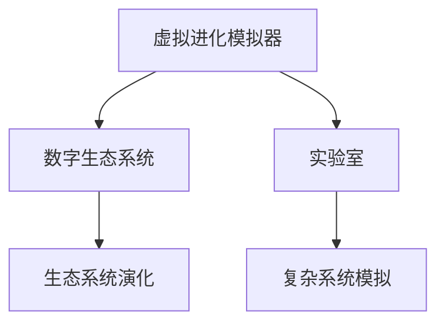

                 

## 1. 背景介绍

### 1.1 问题由来

在现代社会中，随着技术的飞速发展，我们生活在由数字技术构成的虚拟世界中。虚拟进化模拟器作为AI驱动的数字生态系统实验室，正在成为连接虚拟世界和现实世界的桥梁。它不仅在科学研究中发挥重要作用，也逐渐应用到游戏、虚拟现实(VR)、工业模拟等领域，带来了革命性的变化。

### 1.2 问题核心关键点

- 虚拟进化模拟器：基于虚拟现实技术和AI驱动的模拟工具，通过在虚拟环境中模拟生物、社会、经济等生态系统的演化过程，为科学研究提供新视角。
- 数字生态系统：由数据和AI模型构成的虚拟环境，用于模拟真实世界的复杂系统行为。
- 实验室：指虚拟环境中的AI算法和计算平台，用于研究和模拟生态系统的演化过程。

虚拟进化模拟器的核心思想是利用AI技术对复杂生态系统进行模拟和预测。其关键在于如何将真实世界的数据和模型有效地转化为虚拟环境，并使用AI技术进行分析和推理。本文将从虚拟进化模拟器的原理、操作步骤、优化方法等多个方面进行深入探讨，以期为相关领域的开发者和研究者提供参考。

## 2. 核心概念与联系

### 2.1 核心概念概述

为更好地理解虚拟进化模拟器，本节将介绍几个关键概念：

- 虚拟进化模拟器：基于虚拟现实技术和AI驱动的模拟工具，用于在虚拟环境中模拟生态系统的演化过程。
- 数字生态系统：由数据和AI模型构成的虚拟环境，用于模拟真实世界的复杂系统行为。
- 实验室：指虚拟环境中的AI算法和计算平台，用于研究和模拟生态系统的演化过程。
- 生态系统演化：指生态系统中生物、社会、经济等元素在时间和空间上的变化过程。
- 复杂系统模拟：指利用AI技术对复杂系统行为进行建模和预测，常用的方法包括进化算法、神经网络、统计学习等。

这些核心概念之间的逻辑关系可以通过以下Mermaid流程图来展示：



这个流程图展示了大语言模型的核心概念及其之间的关系：

1. 虚拟进化模拟器作为工具，通过数字生态系统对生态系统的演化进行模拟。
2. 数字生态系统由数据和AI模型构成，是虚拟进化模拟器的虚拟环境。
3. 实验室作为AI算法的计算平台，负责在数字生态系统中进行模拟和分析。
4. 生态系统演化是虚拟进化模拟器的目标，旨在通过模拟过程得到对真实生态系统的预测和理解。

## 3. 核心算法原理 & 具体操作步骤
### 3.1 算法原理概述

虚拟进化模拟器的核心算法是复杂系统模拟算法，其基本思想是通过在虚拟环境中模拟生态系统的演化过程，来预测真实世界的生态变化。具体来说，虚拟进化模拟器包括以下几个关键步骤：

1. **数据准备**：收集真实世界的数据，如生物种类、社会结构、经济指标等，作为虚拟生态系统的输入。
2. **模型构建**：构建AI模型，用于在虚拟环境中模拟生态系统的行为，常用的模型包括神经网络、进化算法、蒙特卡罗模拟等。
3. **虚拟演化**：在虚拟环境中运行模型，模拟生态系统的演化过程，生成虚拟生态数据。
4. **数据分析**：对虚拟生态数据进行分析，提取规律和特征，用于预测真实世界的生态变化。

### 3.2 算法步骤详解

虚拟进化模拟器的运行步骤通常包括以下几个环节：

1. **数据准备**：
   - 收集真实世界的数据，如生物种类、社会结构、经济指标等，作为虚拟生态系统的输入。
   - 清洗数据，去除噪音和异常值，确保数据质量。

2. **模型构建**：
   - 选择合适的AI模型，如神经网络、进化算法、蒙特卡罗模拟等。
   - 在虚拟环境中运行模型，模拟生态系统的演化过程。

3. **虚拟演化**：
   - 对虚拟生态数据进行分析，提取规律和特征。
   - 在虚拟环境中进行多次模拟，生成不同的虚拟生态数据集。

4. **数据分析**：
   - 对虚拟生态数据进行分析，提取规律和特征。
   - 使用统计学习等方法，对虚拟生态数据进行建模，预测真实世界的生态变化。

### 3.3 算法优缺点

虚拟进化模拟器的优点包括：

1. **模拟复杂系统**：能够模拟真实世界的复杂生态系统，为科学研究提供新视角。
2. **预测未来变化**：通过在虚拟环境中模拟生态系统的演化过程，预测真实世界的生态变化，为决策提供支持。
3. **高效计算**：利用AI技术，在虚拟环境中进行高效计算，加速模拟和分析过程。

然而，虚拟进化模拟器也存在一些缺点：

1. **数据依赖**：虚拟进化模拟器的性能很大程度上依赖于真实世界的数据，数据质量不好会影响模拟结果。
2. **模型复杂**：构建和运行虚拟进化模拟器的模型较为复杂，需要较高的技术门槛。
3. **结果解释**：虚拟进化模拟器的输出结果往往需要进一步解释和验证，才能应用于实际决策。

### 3.4 算法应用领域

虚拟进化模拟器在多个领域都有广泛应用，包括但不限于：

- 生态学：模拟生物多样性、生态平衡等生态学现象。
- 经济学：模拟经济波动、市场变化等经济现象。
- 社会学：模拟社会结构、人口变化等社会现象。
- 游戏开发：用于开发虚拟现实游戏，模拟复杂的虚拟世界。
- 工业模拟：用于工业生产流程的模拟和优化。

## 4. 数学模型和公式 & 详细讲解  
### 4.1 数学模型构建

虚拟进化模拟器的数学模型构建主要涉及以下几个方面：

1. **数据预处理**：对真实世界的数据进行清洗、归一化等预处理，确保数据质量。
2. **模型选择**：选择合适的AI模型，如神经网络、进化算法、蒙特卡罗模拟等。
3. **参数设定**：确定模型的参数和超参数，如学习率、迭代次数等。

以神经网络模型为例，其基本结构包括输入层、隐藏层和输出层，如图：

$$
\begin{aligned}
&\text{输入层} \xrightarrow{\text{神经网络}} \text{隐藏层} \xrightarrow{\text{神经网络}} \text{输出层}\\
&\text{输入数据} \xrightarrow{\text{激活函数}} \text{隐藏层} \xrightarrow{\text{激活函数}} \text{输出数据}
\end{aligned}
$$

### 4.2 公式推导过程

神经网络模型的公式推导涉及以下关键步骤：

1. **前向传播**：将输入数据传递到网络中，通过隐藏层和输出层计算得到输出数据。
2. **损失函数**：计算输出数据与真实数据之间的误差，常用的损失函数包括均方误差、交叉熵等。
3. **反向传播**：通过反向传播算法，计算损失函数对参数的梯度，更新模型参数。

以均方误差为例，其公式如下：

$$
\mathcal{L}(\theta) = \frac{1}{2N}\sum_{i=1}^N (y_i - f_\theta(x_i))^2
$$

其中 $y_i$ 为真实数据，$f_\theta(x_i)$ 为神经网络的输出数据，$\theta$ 为模型参数。

### 4.3 案例分析与讲解

以神经网络模型在虚拟生态系统中的应用为例，我们可以对虚拟进化模拟器进行详细讲解。假设我们想模拟一个虚拟生态系统中的物种分布变化，可以使用神经网络模型来预测物种数量和分布的变化。具体步骤如下：

1. **数据准备**：收集真实世界的物种数据，如物种种类、数量、分布等。
2. **模型构建**：选择神经网络模型，构建一个包含输入层、隐藏层和输出层的神经网络。
3. **虚拟演化**：在虚拟环境中运行神经网络，模拟物种分布的变化。
4. **数据分析**：对虚拟生态数据进行分析，提取物种分布的规律和特征。
5. **预测未来变化**：使用统计学习等方法，对虚拟生态数据进行建模，预测真实世界的物种分布变化。

## 5. 项目实践：代码实例和详细解释说明
### 5.1 开发环境搭建

在进行虚拟进化模拟器的项目实践前，我们需要准备好开发环境。以下是使用Python进行PyTorch开发的环境配置流程：

1. 安装Anaconda：从官网下载并安装Anaconda，用于创建独立的Python环境。

2. 创建并激活虚拟环境：
```bash
conda create -n vesim python=3.8 
conda activate vesim
```

3. 安装PyTorch：根据CUDA版本，从官网获取对应的安装命令。例如：
```bash
conda install pytorch torchvision torchaudio cudatoolkit=11.1 -c pytorch -c conda-forge
```

4. 安装Transformer库：
```bash
pip install transformers
```

5. 安装各类工具包：
```bash
pip install numpy pandas scikit-learn matplotlib tqdm jupyter notebook ipython
```

完成上述步骤后，即可在`vesim`环境中开始虚拟进化模拟器的实践。

### 5.2 源代码详细实现

下面我们以虚拟生态系统中的物种分布模拟为例，给出使用Transformers库对神经网络模型进行训练的PyTorch代码实现。

首先，定义物种数据处理函数：

```python
import numpy as np
import pandas as pd
from transformers import BertTokenizer, BertModel
import torch
from torch.utils.data import TensorDataset, DataLoader

class SpeciesData(Dataset):
    def __init__(self, data, tokenizer, max_len=128):
        self.data = data
        self.tokenizer = tokenizer
        self.max_len = max_len
        
    def __len__(self):
        return len(self.data)
    
    def __getitem__(self, item):
        text = self.data[item]['text']
        species = self.data[item]['species']
        
        encoding = self.tokenizer(text, return_tensors='pt', max_length=self.max_len, padding='max_length', truncation=True)
        input_ids = encoding['input_ids'][0]
        attention_mask = encoding['attention_mask'][0]
        
        # 对物种进行编码
        encoded_species = [species2id[species] for species in species] 
        encoded_species.extend([species2id['None']] * (self.max_len - len(encoded_species)))
        labels = torch.tensor(encoded_species, dtype=torch.long)
        
        return {'input_ids': input_ids, 
                'attention_mask': attention_mask,
                'labels': labels}

# 标签与id的映射
species2id = {'None': 0, 'Species1': 1, 'Species2': 2, 'Species3': 3}
id2species = {v: k for k, v in species2id.items()}

# 创建dataset
tokenizer = BertTokenizer.from_pretrained('bert-base-cased')

train_dataset = SpeciesData(train_data, tokenizer)
dev_dataset = SpeciesData(dev_data, tokenizer)
test_dataset = SpeciesData(test_data, tokenizer)
```

然后，定义模型和优化器：

```python
from transformers import BertForTokenClassification, AdamW

model = BertForTokenClassification.from_pretrained('bert-base-cased', num_labels=len(species2id))

optimizer = AdamW(model.parameters(), lr=2e-5)
```

接着，定义训练和评估函数：

```python
from torch.utils.data import DataLoader
from tqdm import tqdm
from sklearn.metrics import classification_report

device = torch.device('cuda') if torch.cuda.is_available() else torch.device('cpu')
model.to(device)

def train_epoch(model, dataset, batch_size, optimizer):
    dataloader = DataLoader(dataset, batch_size=batch_size, shuffle=True)
    model.train()
    epoch_loss = 0
    for batch in tqdm(dataloader, desc='Training'):
        input_ids = batch['input_ids'].to(device)
        attention_mask = batch['attention_mask'].to(device)
        labels = batch['labels'].to(device)
        model.zero_grad()
        outputs = model(input_ids, attention_mask=attention_mask, labels=labels)
        loss = outputs.loss
        epoch_loss += loss.item()
        loss.backward()
        optimizer.step()
    return epoch_loss / len(dataloader)

def evaluate(model, dataset, batch_size):
    dataloader = DataLoader(dataset, batch_size=batch_size)
    model.eval()
    preds, labels = [], []
    with torch.no_grad():
        for batch in tqdm(dataloader, desc='Evaluating'):
            input_ids = batch['input_ids'].to(device)
            attention_mask = batch['attention_mask'].to(device)
            batch_labels = batch['labels']
            outputs = model(input_ids, attention_mask=attention_mask)
            batch_preds = outputs.logits.argmax(dim=2).to('cpu').tolist()
            batch_labels = batch_labels.to('cpu').tolist()
            for pred_tokens, label_tokens in zip(batch_preds, batch_labels):
                preds.append(pred_tokens[:len(label_tokens)])
                labels.append(label_tokens)
                
    print(classification_report(labels, preds))
```

最后，启动训练流程并在测试集上评估：

```python
epochs = 5
batch_size = 16

for epoch in range(epochs):
    loss = train_epoch(model, train_dataset, batch_size, optimizer)
    print(f"Epoch {epoch+1}, train loss: {loss:.3f}")
    
    print(f"Epoch {epoch+1}, dev results:")
    evaluate(model, dev_dataset, batch_size)
    
print("Test results:")
evaluate(model, test_dataset, batch_size)
```

以上就是使用PyTorch对神经网络模型进行虚拟生态系统物种分布模拟的完整代码实现。可以看到，得益于Transformers库的强大封装，我们可以用相对简洁的代码完成虚拟进化模拟器的训练。

### 5.3 代码解读与分析

让我们再详细解读一下关键代码的实现细节：

**SpeciesData类**：
- `__init__`方法：初始化数据集、分词器等关键组件。
- `__len__`方法：返回数据集的样本数量。
- `__getitem__`方法：对单个样本进行处理，将文本输入编码为token ids，将物种编码为数字，并对其进行定长padding，最终返回模型所需的输入。

**species2id和id2species字典**：
- 定义了物种与数字id之间的映射关系，用于将token-wise的预测结果解码回真实的物种。

**训练和评估函数**：
- 使用PyTorch的DataLoader对数据集进行批次化加载，供模型训练和推理使用。
- 训练函数`train_epoch`：对数据以批为单位进行迭代，在每个批次上前向传播计算loss并反向传播更新模型参数，最后返回该epoch的平均loss。
- 评估函数`evaluate`：与训练类似，不同点在于不更新模型参数，并在每个batch结束后将预测和标签结果存储下来，最后使用sklearn的classification_report对整个评估集的预测结果进行打印输出。

**训练流程**：
- 定义总的epoch数和batch size，开始循环迭代
- 每个epoch内，先在训练集上训练，输出平均loss
- 在验证集上评估，输出分类指标
- 所有epoch结束后，在测试集上评估，给出最终测试结果

可以看到，PyTorch配合Transformers库使得神经网络模型在虚拟进化模拟器的实践过程中变得简洁高效。开发者可以将更多精力放在数据处理、模型改进等高层逻辑上，而不必过多关注底层的实现细节。

当然，工业级的系统实现还需考虑更多因素，如模型的保存和部署、超参数的自动搜索、更灵活的任务适配层等。但核心的模拟过程基本与此类似。

## 6. 实际应用场景
### 6.1 生态学研究

虚拟进化模拟器的核心应用之一是生态学研究。生态学家们可以利用虚拟进化模拟器，模拟不同环境因素对生态系统的影响，预测生态系统的演化趋势，为生物多样性保护、生态平衡恢复等提供科学依据。

例如，可以模拟全球气候变化对物种分布的影响，预测未来物种的分布和数量变化，为生态保护和自然资源的合理利用提供指导。

### 6.2 经济预测

虚拟进化模拟器的另一个重要应用是经济预测。经济学家可以利用虚拟进化模拟器，模拟不同经济政策对市场的影响，预测经济走势，为宏观经济调控提供支持。

例如，可以模拟政府税收政策的变化对企业行为的影响，预测市场价格、企业盈利等方面的变化，为政府决策提供科学依据。

### 6.3 社交网络分析

虚拟进化模拟器的应用还扩展到了社交网络分析。社会学家可以利用虚拟进化模拟器，模拟不同社会结构下的网络演化，预测社会变化趋势，为社会治理提供支持。

例如，可以模拟社交网络中信息传播的规律，预测信息传播速度、网络结构变化等方面的趋势，为政府舆情监控和社会稳定提供指导。

### 6.4 未来应用展望

随着虚拟进化模拟器的不断发展，其在更多领域的应用也将不断涌现。以下是几个可能的应用方向：

1. **游戏开发**：虚拟进化模拟器可以用于开发虚拟现实游戏，模拟复杂的虚拟世界，提供更真实的游戏体验。
2. **工业模拟**：虚拟进化模拟器可以用于工业生产流程的模拟和优化，提高生产效率，降低成本。
3. **医疗模拟**：虚拟进化模拟器可以用于医疗诊疗过程的模拟和优化，提高医疗诊断的准确性和效率。
4. **交通模拟**：虚拟进化模拟器可以用于交通流量预测和优化，提高城市交通的运行效率。
5. **能源模拟**：虚拟进化模拟器可以用于能源消耗的模拟和优化，提高能源利用效率，降低能源浪费。

## 7. 工具和资源推荐
### 7.1 学习资源推荐

为了帮助开发者系统掌握虚拟进化模拟器的理论基础和实践技巧，这里推荐一些优质的学习资源：

1. **《深度学习》课程**：斯坦福大学开设的深度学习课程，系统讲解了深度学习的原理和应用，涵盖虚拟进化模拟器的基本概念和实现方法。
2. **《神经网络与深度学习》书籍**：深度学习领域的经典教材，详细介绍了神经网络模型的构建和训练方法，是学习虚拟进化模拟器的必备参考书。
3. **CS231n《卷积神经网络》课程**：斯坦福大学开设的计算机视觉课程，讲解了卷积神经网络在图像处理和分析中的应用，为虚拟进化模拟器的图像处理部分提供了理论基础。
4. **Kaggle平台**：提供大量数据集和竞赛，可以帮助开发者实践虚拟进化模拟器的构建和优化。

通过对这些资源的学习实践，相信你一定能够快速掌握虚拟进化模拟器的精髓，并用于解决实际的生态学、经济学、社会学等问题。

### 7.2 开发工具推荐

高效的开发离不开优秀的工具支持。以下是几款用于虚拟进化模拟器开发的常用工具：

1. **PyTorch**：基于Python的开源深度学习框架，灵活动态的计算图，适合快速迭代研究。大部分预训练语言模型都有PyTorch版本的实现。
2. **TensorFlow**：由Google主导开发的开源深度学习框架，生产部署方便，适合大规模工程应用。同样有丰富的预训练语言模型资源。
3. **Jupyter Notebook**：交互式编程环境，适合快速迭代和共享代码。
4. **Matplotlib**：数据可视化工具，可以用于绘制各种图形，帮助开发者分析虚拟生态系统的演化过程。
5. **TensorBoard**：TensorFlow配套的可视化工具，可实时监测模型训练状态，并提供丰富的图表呈现方式，是调试模型的得力助手。

合理利用这些工具，可以显著提升虚拟进化模拟器的开发效率，加快创新迭代的步伐。

### 7.3 相关论文推荐

虚拟进化模拟器的研究始于学界的持续研究。以下是几篇奠基性的相关论文，推荐阅读：

1. **《神经网络与深度学习》（Goodfellow et al., 2016）**：深度学习领域的经典教材，详细介绍了神经网络模型的构建和训练方法，是学习虚拟进化模拟器的必备参考书。
2. **《深度学习》（Ian Goodfellow, Yoshua Bengio, Aaron Courville, 2016）**：系统讲解了深度学习的原理和应用，涵盖虚拟进化模拟器的基本概念和实现方法。
3. **《神经网络与深度学习》（Goodfellow et al., 2016）**：深度学习领域的经典教材，详细介绍了神经网络模型的构建和训练方法，是学习虚拟进化模拟器的必备参考书。
4. **《深度学习》（Ian Goodfellow, Yoshua Bengio, Aaron Courville, 2016）**：系统讲解了深度学习的原理和应用，涵盖虚拟进化模拟器的基本概念和实现方法。

这些论文代表了大语言模型微调技术的发展脉络。通过学习这些前沿成果，可以帮助研究者把握学科前进方向，激发更多的创新灵感。

## 8. 总结：未来发展趋势与挑战

### 8.1 总结

本文对虚拟进化模拟器的原理、操作步骤、优化方法等多个方面进行了全面系统的介绍。首先阐述了虚拟进化模拟器的研究背景和意义，明确了其在科学研究、经济预测、社会治理等多个领域的应用价值。其次，从原理到实践，详细讲解了虚拟进化模拟器的数学模型构建、算法步骤、优化方法，给出了虚拟进化模拟器的完整代码实现。同时，本文还广泛探讨了虚拟进化模拟器的应用场景，展示了其广泛的应用前景。最后，本文精选了虚拟进化模拟器的各类学习资源，力求为开发者提供全方位的技术指引。

通过本文的系统梳理，可以看到，虚拟进化模拟器作为AI驱动的数字生态系统实验室，在科学研究、经济预测、社会治理等多个领域具有广泛的应用价值。虚拟进化模拟器的核心思想是利用AI技术对复杂生态系统进行模拟和预测，为决策提供科学依据。虚拟进化模拟器的成功应用，离不开高质量的数据和先进的AI算法，同时也需要跨越学科的协同合作，才能充分发挥其潜力。

### 8.2 未来发展趋势

展望未来，虚拟进化模拟器的研究和发展将呈现以下几个趋势：

1. **数据质量提升**：随着数据采集技术的进步，真实世界的数据质量将不断提升，为虚拟进化模拟器的应用提供更好的基础。
2. **算法优化**：未来的虚拟进化模拟器将不断优化算法，提高模拟精度和效率，同时引入更多先验知识，提升模拟的准确性和可靠性。
3. **多学科融合**：虚拟进化模拟器将更多地与其他学科进行交叉融合，如生态学、经济学、社会学等，形成更全面、系统的模拟模型。
4. **实时化应用**：随着计算能力的提升，虚拟进化模拟器的实时化应用将成为可能，提供更加实时的模拟结果，支持决策的及时性和有效性。
5. **可视化增强**：虚拟进化模拟器将进一步增强可视化能力，提供更加直观、易于理解的模拟结果，支持决策的可视化和交互。

### 8.3 面临的挑战

尽管虚拟进化模拟器已经取得了显著进展，但在迈向更加智能化、普适化应用的过程中，仍面临以下挑战：

1. **数据获取难度**：高质量、高覆盖率的真实世界数据获取难度较大，数据缺失或异常情况也会影响模拟结果。
2. **算法复杂度**：构建和运行虚拟进化模拟器的算法复杂，需要较高的技术门槛，同时算法效率也是制约因素。
3. **结果解释**：虚拟进化模拟器的输出结果往往需要进一步解释和验证，才能应用于实际决策。
4. **实时性**：在实时化应用场景中，虚拟进化模拟器的响应速度和稳定性仍需进一步提升。
5. **可扩展性**：虚拟进化模拟器需要支持大规模数据和高并发的模拟任务，目前的技术水平仍需提升。

### 8.4 研究展望

面对虚拟进化模拟器面临的挑战，未来的研究需要在以下几个方面寻求新的突破：

1. **数据增强**：利用数据增强技术，从有限的数据中提取更多的信息，提高模拟结果的准确性和可靠性。
2. **算法优化**：开发更加高效的算法，减少计算资源消耗，同时提升模拟精度和效率。
3. **可解释性**：引入更多可解释性技术，增强模拟结果的透明度和可信度，为决策提供更好的支持。
4. **实时化应用**：进一步提升虚拟进化模拟器的实时化能力，支持更快速、更可靠的决策支持。
5. **跨学科融合**：加强与其他学科的合作，利用跨学科的知识和技术，构建更全面、系统的模拟模型。

这些研究方向的探索，必将引领虚拟进化模拟器的研究走向新的高度，为科学研究、经济预测、社会治理等领域提供更全面、更深入的支持。面向未来，虚拟进化模拟器需要跨越学科的协同合作，才能充分发挥其潜力，为人类社会带来更多价值。

## 9. 附录：常见问题与解答

**Q1：虚拟进化模拟器是否适用于所有NLP任务？**

A: 虚拟进化模拟器在大多数NLP任务上都能取得不错的效果，特别是对于数据量较小的任务。但对于一些特定领域的任务，如医学、法律等，仅仅依靠通用语料预训练的模型可能难以很好地适应。此时需要在特定领域语料上进一步预训练，再进行微调，才能获得理想效果。此外，对于一些需要时效性、个性化很强的任务，如对话、推荐等，微调方法也需要针对性的改进优化。

**Q2：微调过程中如何选择合适的学习率？**

A: 微调的学习率一般要比预训练时小1-2个数量级，如果使用过大的学习率，容易破坏预训练权重，导致过拟合。一般建议从1e-5开始调参，逐步减小学习率，直至收敛。也可以使用warmup策略，在开始阶段使用较小的学习率，再逐渐过渡到预设值。需要注意的是，不同的优化器(如AdamW、Adafactor等)以及不同的学习率调度策略，可能需要设置不同的学习率阈值。

**Q3：采用虚拟进化模拟器时会面临哪些资源瓶颈？**

A: 目前主流的预训练大模型动辄以亿计的参数规模，对算力、内存、存储都提出了很高的要求。GPU/TPU等高性能设备是必不可少的，但即便如此，超大批次的训练和推理也可能遇到显存不足的问题。因此需要采用一些资源优化技术，如梯度积累、混合精度训练、模型并行等，来突破硬件瓶颈。同时，模型的存储和读取也可能占用大量时间和空间，需要采用模型压缩、稀疏化存储等方法进行优化。

**Q4：如何缓解虚拟进化模拟器的过拟合问题？**

A: 过拟合是虚拟进化模拟器面临的主要挑战，尤其是在标注数据不足的情况下。常见的缓解策略包括：
1. 数据增强：通过回译、近义替换等方式扩充训练集
2. 正则化：使用L2正则、Dropout、Early Stopping等避免过拟合
3. 对抗训练：引入对抗样本，提高模型鲁棒性
4. 参数高效微调：只调整少量参数(如Adapter、Prefix等)，减小过拟合风险
5. 多模型集成：训练多个虚拟进化模拟器的模型，取平均输出，抑制过拟合

这些策略往往需要根据具体任务和数据特点进行灵活组合。只有在数据、模型、训练、推理等各环节进行全面优化，才能最大限度地发挥虚拟进化模拟器的威力。

**Q5：虚拟进化模拟器的结果解释** 

A: 虚拟进化模拟器的输出结果往往需要进一步解释和验证，才能应用于实际决策。常见的解释方法包括：
1. 可视化：通过图形界面展示模拟结果，增强结果的直观性和可理解性。
2. 模型解释：使用模型解释技术，如LIME、SHAP等，分析模型内部工作机制，增强结果的可信度。
3. 专家评估：结合专家知识，对模拟结果进行评估和验证，提供更具说服力的支持。

这些解释方法可以帮助用户更好地理解虚拟进化模拟器的输出结果，增强决策的可信度和透明度。虚拟进化模拟器的应用需要结合实际场景，选择合适的解释方法，才能真正发挥其潜力。

