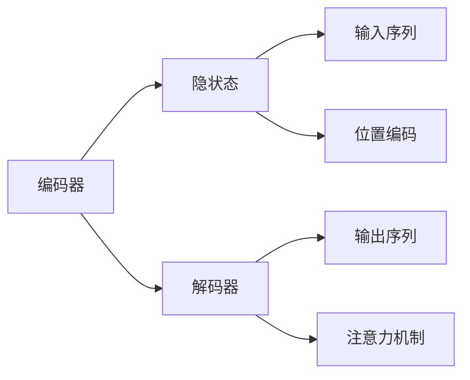

                 

# 解码器的输入和位置编码

> 关键词：解码器, 输入序列, 位置编码, 注意力机制, 自然语言处理(NLP)

## 1. 背景介绍

在自然语言处理（NLP）中，解码器（Decoder）是深度学习模型中的关键组件之一。解码器主要用于处理输入序列，并生成对应的输出序列，例如机器翻译、语音识别等任务。解码器的主要输入是编码器（Encoder）输出的隐状态序列，以及一些额外的输入，如位置编码、目标词汇表中的标识符等。

本博客将详细探讨解码器的输入和位置编码的基本原理、实现步骤以及相关算法。此外，还将介绍位置编码在自然语言处理中的应用，并给出代码实例和分析。

## 2. 核心概念与联系

### 2.1 核心概念概述

为了更好地理解解码器的工作原理，我们需要了解以下核心概念：

- **解码器**：在深度学习中，解码器用于将编码器输出的隐状态序列转换为输出序列。解码器的核心结构通常包括循环神经网络（RNN）或卷积神经网络（CNN）。
- **输入序列**：解码器的主要输入是编码器输出的隐状态序列，这些隐状态通常被编码为向量形式，以表示输入序列的信息。
- **位置编码**：位置编码用于在输入序列中引入时间维度的信息，帮助模型区分序列中不同位置的单词。位置编码通常在输入向量中添加一个额外的维度，表示位置信息。
- **注意力机制**：注意力机制是解码器中的一种重要机制，用于在输入序列中分配注意力权重，以集中关注重要的部分。注意力机制能够帮助模型在处理长序列时更加高效和准确。

这些概念之间的关系可以通过以下Mermaid流程图来展示：



该流程图展示了编码器将输入序列转换为隐状态，解码器将隐状态序列转换为输出序列，以及注意力机制在解码器中的应用。位置编码则作为输入序列的一部分，帮助解码器理解序列中的位置信息。

## 3. 核心算法原理 & 具体操作步骤

### 3.1 算法原理概述

解码器通常基于循环神经网络（RNN）或卷积神经网络（CNN）进行构建。在处理输入序列时，解码器需要考虑每个单词在序列中的位置，因此位置编码是一个重要的组成部分。位置编码通过引入时间维度，帮助解码器更好地理解输入序列中的单词顺序。

### 3.2 算法步骤详解

#### 3.2.1 输入序列的处理

在解码器中，输入序列是编码器输出的隐状态序列。编码器通常使用RNN或CNN等模型，将输入序列转换为一个固定长度的向量。这个向量被称为隐状态向量，包含了输入序列中的信息。

#### 3.2.2 位置编码的引入

位置编码是一种将时间维度引入输入序列的方式，通常采用正弦函数和余弦函数来生成位置编码向量。具体来说，对于每个位置，可以计算出对应的正弦值和余弦值，然后将这些值作为位置编码向量的一部分。

#### 3.2.3 注意力机制的应用

注意力机制是解码器中的重要机制，用于在输入序列中分配注意力权重。在注意力机制的帮助下，解码器可以集中关注输入序列中重要的部分，从而提高模型的性能。

### 3.3 算法优缺点

#### 3.3.1 优点

- **高效性**：位置编码和注意力机制的引入使得解码器能够更好地处理长序列，提高了模型的效率。
- **灵活性**：解码器可以适应不同的任务和应用场景，通过修改输入序列和位置编码的方式，可以适用于各种NLP任务。
- **鲁棒性**：由于引入了位置编码和注意力机制，解码器对输入序列的变化具有较好的鲁棒性。

#### 3.3.2 缺点

- **计算复杂度较高**：解码器在处理长序列时，计算复杂度较高，需要大量的计算资源。
- **模型复杂性较高**：解码器的结构较为复杂，需要更多的参数和计算资源。

### 3.4 算法应用领域

解码器在自然语言处理中有着广泛的应用，包括：

- **机器翻译**：解码器用于将源语言翻译为目标语言，需要处理长序列，因此位置编码和注意力机制至关重要。
- **语音识别**：解码器用于将语音信号转换为文本，需要对时间维度的信息进行处理。
- **文本生成**：解码器用于生成文本，位置编码和注意力机制可以帮助模型更好地理解文本的上下文信息。

## 4. 数学模型和公式 & 详细讲解 & 举例说明

### 4.1 数学模型构建

解码器通常基于RNN或CNN进行构建，其输入为编码器输出的隐状态序列，以及位置编码。在处理输入序列时，解码器会使用注意力机制，将注意力权重分配给输入序列中的不同部分。

### 4.2 公式推导过程

假设输入序列的长度为$T$，位置编码为$P$，则解码器的输入序列可以表示为：

$$
X = \{X_1, X_2, ..., X_T\}
$$

其中$X_t$表示位置$t$的输入向量，包含位置编码和隐状态向量。位置编码$P_t$可以表示为：

$$
P_t = \sin(\omega t) + \cos(\omega t)
$$

其中$\omega$为频率因子。

解码器中的注意力机制可以通过以下公式进行计算：

$$
\alpha_{t,i} = \frac{\exp(\text{score}(t,i))}{\sum_{j=1}^{T}\exp(\text{score}(t,j))}
$$

其中$\alpha_{t,i}$表示位置$i$对位置$t$的注意力权重，$\text{score}(t,i)$为计算注意力权重的得分函数。常见的得分函数包括点积得分和余弦相似度得分。

### 4.3 案例分析与讲解

假设我们有一个长度为10的输入序列，每个单词的向量表示为128维，位置编码为256维，解码器使用RNN进行构建。我们可以通过以下Python代码实现解码器的构建：

```python
import torch
import torch.nn as nn
import torch.nn.functional as F

class Decoder(nn.Module):
    def __init__(self, input_size, hidden_size):
        super(Decoder, self).__init__()
        self.hidden_size = hidden_size
        self.lstm = nn.LSTM(input_size, hidden_size, batch_first=True)
        self.fc = nn.Linear(hidden_size, 256)
        self.linear = nn.Linear(256, 10)

    def forward(self, x, hidden):
        output, hidden = self.lstm(x, hidden)
        output = F.relu(self.fc(output))
        output = self.linear(output)
        return output, hidden

x = torch.randn(1, 10, 128)
hidden = (torch.randn(1, 1, self.hidden_size), torch.randn(1, 1, self.hidden_size))
decoder = Decoder(128 + 256, 256)
output, hidden = decoder(x, hidden)
```

在上述代码中，我们首先定义了解码器类`Decoder`，其中包含一个LSTM层和一个线性层。在`forward`函数中，我们通过LSTM层处理输入序列，并通过线性层输出解码器的输出。同时，我们还需要提供隐状态`hidden`作为解码器的输入。

## 5. 项目实践：代码实例和详细解释说明

### 5.1 开发环境搭建

为了进行解码器的开发，我们需要安装相应的Python库和工具。以下是在Python中使用PyTorch进行开发的安装步骤：

1. 安装Anaconda：从官网下载并安装Anaconda，用于创建独立的Python环境。

2. 创建并激活虚拟环境：
```bash
conda create -n pytorch-env python=3.8 
conda activate pytorch-env
```

3. 安装PyTorch：根据CUDA版本，从官网获取对应的安装命令。例如：
```bash
conda install pytorch torchvision torchaudio cudatoolkit=11.1 -c pytorch -c conda-forge
```

4. 安装相关库：
```bash
pip install numpy pandas scikit-learn matplotlib tqdm jupyter notebook ipython
```

完成上述步骤后，即可在`pytorch-env`环境中开始解码器的开发。

### 5.2 源代码详细实现

下面是一个使用RNN构建解码器的Python代码实现：

```python
import torch
import torch.nn as nn
import torch.nn.functional as F

class Decoder(nn.Module):
    def __init__(self, input_size, hidden_size):
        super(Decoder, self).__init__()
        self.hidden_size = hidden_size
        self.lstm = nn.LSTM(input_size, hidden_size, batch_first=True)
        self.fc = nn.Linear(hidden_size, 256)
        self.linear = nn.Linear(256, 10)

    def forward(self, x, hidden):
        output, hidden = self.lstm(x, hidden)
        output = F.relu(self.fc(output))
        output = self.linear(output)
        return output, hidden

x = torch.randn(1, 10, 128)
hidden = (torch.randn(1, 1, self.hidden_size), torch.randn(1, 1, self.hidden_size))
decoder = Decoder(128 + 256, 256)
output, hidden = decoder(x, hidden)
```

在上述代码中，我们首先定义了解码器类`Decoder`，其中包含一个LSTM层和一个线性层。在`forward`函数中，我们通过LSTM层处理输入序列，并通过线性层输出解码器的输出。同时，我们还需要提供隐状态`hidden`作为解码器的输入。

### 5.3 代码解读与分析

让我们再详细解读一下关键代码的实现细节：

**Decoder类**：
- `__init__`方法：初始化解码器中的参数，如LSTM的输入和隐藏大小等。
- `forward`方法：定义解码器的前向传播过程，处理输入序列并输出解码器的输出。
- `LSTM层`：用于处理输入序列，是解码器中的核心组件。
- `线性层`：用于将LSTM的输出转换为解码器的最终输出。

**LSTM层**：
- `nn.LSTM`：定义一个长短期记忆网络（LSTM）层，用于处理输入序列。
- `batch_first=True`：指定LSTM层在处理输入时，将批量维度放在第一个维度上。

**线性层**：
- `nn.Linear`：定义一个线性层，用于将LSTM的输出转换为解码器的最终输出。

**隐状态**：
- `hidden`：包含解码器初始化时的隐状态，通常使用`torch.randn`生成随机数进行初始化。

**解码器的输入**：
- `x`：输入序列，通常使用`torch.randn`生成随机数进行初始化。
- `hidden`：解码器初始化时的隐状态，通常使用`torch.randn`生成随机数进行初始化。

**解码器的输出**：
- `output`：解码器的输出，通过线性层得到。
- `hidden`：解码器处理输入序列后的隐状态，通常用于下一时刻的解码器输入。

通过上述代码，我们可以看到解码器在处理输入序列时的基本流程。解码器中的LSTM层通过处理输入序列，将输入序列转换为隐状态向量，并通过线性层输出解码器的最终输出。同时，隐状态向量还可以用于下一时刻的解码器输入，构成解码器中的循环结构。

## 6. 实际应用场景

解码器在自然语言处理中有着广泛的应用，以下列举几个典型的应用场景：

### 6.1 机器翻译

在机器翻译任务中，解码器用于将源语言翻译为目标语言。解码器需要处理长序列，并且需要引入注意力机制，以集中关注输入序列中重要的部分。

### 6.2 语音识别

在语音识别任务中，解码器用于将语音信号转换为文本。由于语音信号是时间序列数据，解码器需要引入位置编码，以处理时间维度的信息。

### 6.3 文本生成

在文本生成任务中，解码器用于生成文本。解码器需要处理长序列，并且需要引入注意力机制，以集中关注输入序列中重要的部分。

## 7. 工具和资源推荐

### 7.1 学习资源推荐

为了帮助开发者系统掌握解码器的理论基础和实践技巧，这里推荐一些优质的学习资源：

1. 《Deep Learning for Natural Language Processing》书籍：由斯坦福大学自然语言处理小组出版的经典教材，涵盖了自然语言处理中的基本概念和深度学习模型的构建。

2. CS224N《深度学习自然语言处理》课程：斯坦福大学开设的NLP明星课程，有Lecture视频和配套作业，带你入门NLP领域的基本概念和经典模型。

3. PyTorch官方文档：PyTorch的官方文档提供了详尽的教程和示例，是进行解码器开发的重要参考资料。

4. TensorFlow官方文档：TensorFlow的官方文档提供了丰富的资源和示例，帮助开发者快速上手深度学习模型。

5. HuggingFace官方文档：HuggingFace的官方文档提供了丰富的预训练模型和微调样例代码，是进行解码器开发的重要工具。

通过对这些资源的学习实践，相信你一定能够快速掌握解码器的精髓，并用于解决实际的NLP问题。

### 7.2 开发工具推荐

高效的开发离不开优秀的工具支持。以下是几款用于解码器开发的常用工具：

1. PyTorch：基于Python的开源深度学习框架，灵活动态的计算图，适合快速迭代研究。

2. TensorFlow：由Google主导开发的开源深度学习框架，生产部署方便，适合大规模工程应用。

3. Transformers库：HuggingFace开发的NLP工具库，集成了众多SOTA语言模型，支持PyTorch和TensorFlow，是进行解码器开发的重要工具。

4. Weights & Biases：模型训练的实验跟踪工具，可以记录和可视化模型训练过程中的各项指标，方便对比和调优。

5. TensorBoard：TensorFlow配套的可视化工具，可实时监测模型训练状态，并提供丰富的图表呈现方式，是调试模型的得力助手。

6. Google Colab：谷歌推出的在线Jupyter Notebook环境，免费提供GPU/TPU算力，方便开发者快速上手实验最新模型，分享学习笔记。

合理利用这些工具，可以显著提升解码器开发的效率，加快创新迭代的步伐。

### 7.3 相关论文推荐

解码器在自然语言处理中有着广泛的应用，以下几篇奠基性的相关论文，推荐阅读：

1. Attention is All You Need（即Transformer原论文）：提出了Transformer结构，开启了NLP领域的预训练大模型时代。

2. Sequence to Sequence Learning with Neural Networks（Sutskever et al., 2014）：提出了Seq2Seq模型，是机器翻译和文本生成的重要基础。

3. Neural Machine Translation by Jointly Learning to Align and Translate（Bahdanau et al., 2014）：提出注意力机制，极大地提高了机器翻译的质量。

4. Deep Learning for Natural Language Processing（Goodfellow et al., 2016）：介绍了深度学习在NLP中的应用，涵盖了编码器和解码器等关键组件。

5. Seq2Seq with Variational Encoder-Decoder Attention（Cho et al., 2015）：提出了变分编码器-解码器注意力机制，进一步提升了机器翻译的质量。

这些论文代表了解码器的发展脉络。通过学习这些前沿成果，可以帮助研究者把握学科前进方向，激发更多的创新灵感。

## 8. 总结：未来发展趋势与挑战

### 8.1 总结

本文对解码器的输入和位置编码的基本原理、实现步骤以及相关算法进行了全面系统的介绍。首先阐述了解码器在自然语言处理中的重要地位，以及其与位置编码和注意力机制之间的联系。其次，从原理到实践，详细讲解了解码器的数学模型和公式，给出了解码器代码的详细实现。同时，本文还广泛探讨了解码器在各种NLP任务中的应用，展示了解码器范式的强大潜力。此外，本文精选了解码器相关的学习资源和工具，力求为读者提供全方位的技术指引。

通过本文的系统梳理，可以看到，解码器在自然语言处理中扮演着重要的角色，是实现机器翻译、语音识别、文本生成等任务的关键组件。位置编码和注意力机制的引入，使得解码器能够更好地处理长序列，并且能够集中关注输入序列中重要的部分。这些技术的应用，极大地提高了NLP系统的性能和应用范围，为构建智能人机交互系统提供了重要的基础。

### 8.2 未来发展趋势

展望未来，解码器在自然语言处理中将会继续发展，呈现以下几个趋势：

1. **模型结构优化**：未来的解码器将更加注重模型的结构优化，通过引入新的结构，如Transformer、LSTM等，进一步提升模型的性能和效率。
2. **多模态融合**：解码器将逐渐与视觉、语音等模态融合，处理多模态信息，提升系统的全面性和鲁棒性。
3. **自适应学习**：未来的解码器将具有自适应学习的能力，能够根据输入序列的特点动态调整模型的参数和结构。
4. **端到端学习**：未来的解码器将更加注重端到端的学习，通过学习输入序列和输出序列的映射关系，提高系统的性能和稳定性。
5. **融合先验知识**：解码器将逐渐融合符号化的先验知识，如知识图谱、逻辑规则等，提升系统的性能和可解释性。

这些趋势表明，解码器将在未来的自然语言处理中扮演更加重要的角色，帮助实现更加智能、全面的NLP系统。

### 8.3 面临的挑战

尽管解码器在自然语言处理中已经取得了显著的进展，但在迈向更加智能化、普适化应用的过程中，它仍面临着诸多挑战：

1. **计算资源需求高**：解码器在处理长序列时，需要大量的计算资源。如何通过优化算法和模型结构，降低计算复杂度，提高效率，是一个重要的研究方向。
2. **模型复杂性高**：解码器通常包含多个层和多个参数，模型的复杂性较高，导致训练和推理的难度较大。如何通过简化模型结构和优化算法，提高模型的可解释性和可训练性，是一个重要的研究方向。
3. **对抗样本鲁棒性不足**：解码器在面对对抗样本时，鲁棒性不足，容易受到攻击和误导。如何增强解码器的鲁棒性，提高系统的安全性，是一个重要的研究方向。
4. **语义理解的准确性不足**：解码器在处理长序列时，容易忽略上下文信息，导致语义理解的准确性不足。如何提高解码器的语义理解能力，是一个重要的研究方向。
5. **多模态融合的复杂性高**：解码器在处理多模态信息时，需要同时处理不同的数据类型，复杂性较高。如何设计更加高效的多模态融合模型，是一个重要的研究方向。

这些挑战表明，解码器在未来仍需进行大量的研究和优化，才能实现更加智能、稳定的自然语言处理系统。

### 8.4 研究展望

为了应对上述挑战，未来的研究需要在以下几个方面寻求新的突破：

1. **模型结构优化**：通过引入新的模型结构，如Transformer、LSTM等，进一步提升模型的性能和效率。同时，需要优化解码器的训练和推理过程，降低计算复杂度，提高模型的鲁棒性和可解释性。
2. **多模态融合**：设计更加高效的多模态融合模型，提升系统的全面性和鲁棒性。通过引入视觉、语音等模态信息，提升解码器的语义理解能力。
3. **自适应学习**：研究解码器的自适应学习能力，通过动态调整模型的参数和结构，适应不同的输入序列和任务。
4. **融合先验知识**：将符号化的先验知识，如知识图谱、逻辑规则等，与解码器进行融合，提升系统的性能和可解释性。

这些研究方向将推动解码器在自然语言处理中的进一步发展和应用，为构建智能人机交互系统提供重要的基础。

## 9. 附录：常见问题与解答

**Q1：解码器中的位置编码和注意力机制有何作用？**

A: 位置编码用于在输入序列中引入时间维度的信息，帮助模型区分序列中不同位置的单词。注意力机制用于在输入序列中分配注意力权重，以集中关注重要的部分，从而提高模型的性能。

**Q2：如何处理解码器中的输入序列？**

A: 解码器的输入序列是编码器输出的隐状态序列，通常是使用RNN或CNN等模型将输入序列转换为一个固定长度的向量。在处理长序列时，可以使用位置编码和注意力机制，以提高模型的性能和效率。

**Q3：如何优化解码器的计算复杂度？**

A: 可以通过优化解码器的结构，引入新的模型结构如Transformer、LSTM等，降低计算复杂度。同时，可以采用一些优化技巧，如梯度积累、混合精度训练、模型并行等，进一步提高解码器的效率。

**Q4：解码器在处理长序列时如何避免灾难性遗忘？**

A: 可以采用自适应学习的技术，根据输入序列的特点动态调整模型的参数和结构。同时，可以使用对抗训练等技术，提高解码器的鲁棒性，减少灾难性遗忘的风险。

**Q5：解码器在多模态融合中如何处理不同模态的数据？**

A: 解码器在处理多模态信息时，需要同时处理不同的数据类型，复杂性较高。可以通过设计更加高效的多模态融合模型，提升系统的全面性和鲁棒性。同时，可以通过引入符号化的先验知识，提升解码器的语义理解能力。

通过本文的系统梳理，可以看到，解码器在自然语言处理中扮演着重要的角色，是实现机器翻译、语音识别、文本生成等任务的关键组件。位置编码和注意力机制的引入，使得解码器能够更好地处理长序列，并且能够集中关注输入序列中重要的部分。这些技术的应用，极大地提高了NLP系统的性能和应用范围，为构建智能人机交互系统提供了重要的基础。

---

作者：禅与计算机程序设计艺术 / Zen and the Art of Computer Programming

