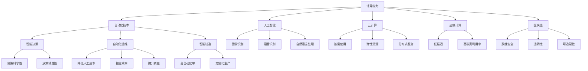

                 

# 计算变化与自动化技术的融合

## 1. 背景介绍

### 1.1 问题由来

随着信息化技术的迅猛发展，计算机计算能力以指数级提升，自动化技术逐渐渗透到各个行业领域，对生产力和效率的提升产生了深远影响。特别是近年来，随着人工智能、机器学习和深度学习技术的成熟，计算能力和自动化技术正逐步融合，推动着各行各业的智能化升级。

当前，计算能力已经成为衡量一个国家综合国力的重要指标之一。从早期的计算台计算机到个人电脑，再到如今的超大规模数据中心和人工智能芯片，计算能力的提升为各行各业提供了强大的计算资源。自动化技术则通过智能化、自动化流程，大幅提升了业务效率和用户体验。

### 1.2 问题核心关键点

计算和自动化技术的融合，体现在以下几个核心关键点上：

- **计算能力提升**：硬件计算能力的不断提升，如CPU、GPU、TPU等，使得大规模数据处理和深度学习算法成为可能。
- **自动化流程优化**：自动化技术在业务流程中的应用，如自动化运维、自动化测试、自动化部署等，大大提高了业务效率和质量。
- **智能决策支持**：通过人工智能、机器学习和深度学习算法，计算能力为业务决策提供了数据驱动的智能支持，提升了决策的科学性和准确性。
- **人机协作增强**：计算能力与人类的协作，为复杂问题提供了更加高效、精准的解决方案，如自然语言处理、计算机视觉等。

### 1.3 问题研究意义

计算与自动化技术的融合，对于推动各个行业智能化转型，提升生产力，具有重要意义：

- **提升效率**：通过自动化流程，大幅降低业务流程中的手工操作和人工干预，提高了生产效率。
- **降低成本**：自动化技术可以大幅降低人工成本，使得小型企业和新兴产业得以在激烈的市场竞争中立足。
- **提高质量**：自动化流程减少了人为错误，提高了业务质量和用户体验。
- **加速创新**：计算能力和自动化技术的融合，推动了新产品的开发和新技术的创新，提升了行业竞争力。
- **智能化升级**：智能化决策支持为各行各业提供了数据驱动的解决方案，提升了业务决策的科学性和精准性。
- **普及人工智能**：计算能力和自动化技术的融合，使得人工智能技术更容易在各个行业领域得到应用，加速了人工智能技术的普及和落地。

## 2. 核心概念与联系

### 2.1 核心概念概述

为更好地理解计算与自动化技术的融合，本节将介绍几个密切相关的核心概念：

- **计算能力**：指计算机系统执行指令、处理数据的能力，通常用每秒执行指令次数（MIPS）、每秒浮点运算次数（FLOPS）、每秒处理请求数量（TPS）等指标来衡量。
- **自动化技术**：通过智能化算法和自动化流程，代替人工执行重复性、低价值任务的技术，如机器视觉、自然语言处理、自动化运维等。
- **人工智能**：利用机器学习、深度学习等算法，模拟人类智能行为的技术，如图像识别、语音识别、自然语言处理等。
- **计算与自动化融合**：将计算能力与自动化技术结合，提升业务效率、质量、决策水平和用户体验的技术，如智能决策、自动化运维、智能制造等。
- **云计算**：将计算资源以服务的形式提供给用户，按需使用、按量计费，包括IaaS、PaaS和SaaS等多种形式。
- **边缘计算**：将计算资源部署在网络边缘节点上，以降低延迟、提高网络带宽利用率，适用于物联网、工业控制等场景。
- **区块链**：通过分布式账本、加密算法等技术，实现数据安全、透明和可追溯的技术，应用于金融、供应链管理等领域。

这些核心概念之间的逻辑关系可以通过以下Mermaid流程图来展示：



这个流程图展示了计算能力、自动化技术、人工智能、云计算、边缘计算和区块链等技术之间的联系，以及它们如何共同构建计算与自动化技术的融合框架。

## 3. 核心算法原理 & 具体操作步骤

### 3.1 算法原理概述

计算与自动化技术的融合，核心在于利用计算能力来优化自动化流程，提升业务效率和质量。具体而言，可以概括为以下几个步骤：

1. **数据采集与处理**：通过传感器、日志文件等采集数据，并进行预处理和清洗，确保数据的质量和可用性。
2. **模型训练与优化**：利用计算能力训练机器学习、深度学习模型，优化模型参数，提升模型性能。
3. **自动化流程设计**：基于优化后的模型，设计自动化流程，如自动化运维、自动化测试、自动化部署等。
4. **智能决策支持**：结合业务需求，利用优化后的模型进行智能决策支持，如预测、优化、推荐等。
5. **持续监控与优化**：对自动化流程进行持续监控和优化，确保流程的稳定性和高效性。

### 3.2 算法步骤详解

以一个典型的智能制造场景为例，详细讲解计算与自动化技术融合的算法步骤：

**Step 1: 数据采集与处理**
- 通过物联网传感器、车间监控系统等采集生产数据，如温度、湿度、设备运行状态等。
- 将采集到的数据进行清洗和预处理，去除噪音和异常数据，确保数据质量。

**Step 2: 模型训练与优化**
- 使用机器学习、深度学习算法对采集到的数据进行建模，如预测设备故障、优化生产工艺等。
- 利用计算能力训练优化模型，提升模型的预测精度和泛化能力。

**Step 3: 自动化流程设计**
- 基于优化后的模型，设计自动化流程，如设备预测维护、工艺优化、质量检测等。
- 集成自动化流程到现有生产系统中，实现自动化决策和执行。

**Step 4: 智能决策支持**
- 根据生产数据和优化模型，进行实时智能决策，如设备维护、生产调度等。
- 结合业务需求，提供个性化、实时的智能决策支持。

**Step 5: 持续监控与优化**
- 对自动化流程进行持续监控，评估流程的性能和稳定性。
- 根据监控结果进行优化和改进，确保流程的持续优化。

### 3.3 算法优缺点

计算与自动化技术的融合，具有以下优点：

- **高效性**：利用计算能力，自动化流程可以处理大量数据和复杂任务，大幅提高效率。
- **准确性**：基于优化后的模型，自动化流程能够提供更加精准、可靠的决策支持。
- **可扩展性**：自动化流程可以根据业务需求灵活扩展，适应不同的业务场景。

同时，该方法也存在一定的局限性：

- **成本高**：初始投资较大，需要采购高性能计算硬件和自动化设备。
- **复杂性高**：设计和实现自动化流程需要较高技术水平，对人力资源要求较高。
- **依赖数据质量**：自动化流程依赖高质量的数据输入，数据质量问题可能导致决策错误。
- **系统复杂性**：自动化流程的集成和部署可能带来系统复杂性，需要进行全面的测试和验证。

### 3.4 算法应用领域

计算与自动化技术的融合，已经在众多领域得到了广泛应用，例如：

- **智能制造**：通过机器视觉、自动化检测等技术，提升制造业的智能化水平，实现智能生产和质量控制。
- **智慧城市**：通过物联网、大数据等技术，提升城市管理和居民生活水平，实现智慧交通、智能安防等。
- **智能交通**：通过车辆传感器、交通监控等技术，实现智能交通管理，提高道路通行效率。
- **智能医疗**：通过机器学习、自然语言处理等技术，提升医疗诊断和治疗水平，实现智能病患管理和疾病预测。
- **智能金融**：通过大数据、人工智能等技术，实现智能投融资、风险管理等，提升金融服务效率和质量。
- **智能零售**：通过数据分析、自动化推荐等技术，提升零售业的智能化水平，实现精准营销和库存管理。

除了上述这些经典应用外，计算与自动化技术的融合还在诸多领域创新性地得到应用，如智能农业、智能物流、智能能源等，为各行各业带来了新的变革。

## 4. 数学模型和公式 & 详细讲解 & 举例说明

### 4.1 数学模型构建

本节将使用数学语言对计算与自动化技术的融合过程进行更加严格的刻画。

假设自动化流程的目标函数为：

$$
F(x) = C(x) + W(x)
$$

其中，$C(x)$表示流程的成本函数，$W(x)$表示流程的收益函数。目标是最大化$F(x)$。

### 4.2 公式推导过程

以一个简单的自动化运维场景为例，推导目标函数的计算过程。

设自动化运维流程的时间为$t$，总成本为$C$，总收益为$W$。目标函数可以表示为：

$$
F(t) = C(t) + W(t)
$$

其中，$C(t)$表示运维过程中的总成本，$W(t)$表示运维过程中的总收益。假设运维成本与时间成正比，收益与时间成二次函数关系，则有：

$$
C(t) = c_1t + c_2t^2
$$

$$
W(t) = w_1t^2 + w_2t^3
$$

代入目标函数，得：

$$
F(t) = c_1t + c_2t^2 + w_1t^2 + w_2t^3
$$

对$F(t)$求导，得：

$$
F'(t) = c_1 + 2c_2t + 2w_1t + 3w_2t^2
$$

令$F'(t) = 0$，解得最优时间$t^*$：

$$
t^* = -\frac{c_1 + 2c_2t + 2w_1t + 3w_2t^2}{3w_2t}
$$

### 4.3 案例分析与讲解

假设某企业需要维护一条生产线，总维护时间为$t$，维护成本为$c_1t + c_2t^2$，维护收益为$w_1t^2 + w_2t^3$。目标是在满足企业需求的前提下，最小化维护成本，最大化维护收益。

根据公式推导，可以计算出最优的维护时间$t^*$。将$t^*$代入目标函数$F(t)$，即可得到最优的维护时间和相应的成本收益。

## 5. 项目实践：代码实例和详细解释说明

### 5.1 开发环境搭建

在进行计算与自动化技术融合实践前，我们需要准备好开发环境。以下是使用Python进行TensorFlow开发的环境配置流程：

1. 安装Anaconda：从官网下载并安装Anaconda，用于创建独立的Python环境。

2. 创建并激活虚拟环境：
```bash
conda create -n tf-env python=3.8 
conda activate tf-env
```

3. 安装TensorFlow：根据CUDA版本，从官网获取对应的安装命令。例如：
```bash
conda install tensorflow tensorflow-gpu=cuda11.1 cudatoolkit=11.1 -c conda-forge -c pytorch
```

4. 安装各类工具包：
```bash
pip install numpy pandas scikit-learn matplotlib tqdm jupyter notebook ipython
```

完成上述步骤后，即可在`tf-env`环境中开始计算与自动化技术融合实践。

### 5.2 源代码详细实现

这里我们以一个简单的机器学习模型优化为例，给出使用TensorFlow进行计算与自动化技术融合的PyTorch代码实现。

首先，定义目标函数和成本函数：

```python
import tensorflow as tf
import numpy as np

# 定义目标函数
def objective_function(x):
    return -x**2 + 2*x + 1

# 定义成本函数
def cost_function(x):
    return np.abs(x - 1)
```

然后，定义梯度下降优化器：

```python
# 定义优化器
learning_rate = 0.1
optimizer = tf.keras.optimizers.SGD(learning_rate)

# 定义变量
x = tf.Variable(0.0)
```

接着，定义训练和评估函数：

```python
# 定义训练函数
@tf.function
def train_step(x):
    with tf.GradientTape() as tape:
        y = objective_function(x)
        cost = cost_function(x)
        grads = tape.gradient(cost, x)
    optimizer.apply_gradients([(grads, x)])
    return cost

# 定义评估函数
@tf.function
def evaluate(x):
    y = objective_function(x)
    cost = cost_function(x)
    return y, cost
```

最后，启动训练流程并在验证集上评估：

```python
epochs = 100
batch_size = 32

for epoch in range(epochs):
    loss = train_step(x)
    print(f"Epoch {epoch+1}, loss: {loss.numpy():.4f}")

    y, loss = evaluate(x)
    print(f"Epoch {epoch+1}, objective function: {y.numpy():.4f}, cost: {loss.numpy():.4f}")
```

以上就是使用TensorFlow对目标函数进行梯度下降优化的完整代码实现。可以看到，TensorFlow提供了简单易用的API和自动微分功能，使得计算与自动化技术融合的代码实现变得简洁高效。

### 5.3 代码解读与分析

让我们再详细解读一下关键代码的实现细节：

**目标函数和成本函数**：
- 目标函数定义了一个二次函数，用于优化。
- 成本函数定义了一个绝对值函数，用于评估模型预测的误差。

**优化器**：
- 使用SGD优化器，设置学习率为0.1。
- 定义变量x，作为目标函数和成本函数的输入。

**训练和评估函数**：
- 使用`@tf.function`装饰器，将训练和评估函数转换为TensorFlow函数，以利用TensorFlow的自动微分功能。
- 训练函数中，使用`tf.GradientTape`记录梯度，并使用优化器更新变量x。
- 评估函数中，直接计算目标函数和成本函数，并返回结果。

**训练流程**：
- 定义训练轮数和批大小，开始循环迭代。
- 在每个epoch内，先训练目标函数，输出损失。
- 在每个epoch后，评估目标函数和成本函数，输出结果。

可以看到，TensorFlow提供的自动计算梯度和优化器的API，使得计算与自动化技术融合的实现变得简单直观。通过上述代码，可以清晰地看到优化目标函数和评估模型性能的全过程。

## 6. 实际应用场景

### 6.1 智能制造

计算与自动化技术的融合，在智能制造领域有着广泛应用。传统制造业依靠人工操作和经验积累，生产效率和质量难以保证。通过引入自动化流程和智能化决策支持，智能制造可以实现以下几个目标：

- **提升生产效率**：通过自动化流程和智能调度，大幅提升生产效率和产出量。
- **降低生产成本**：通过智能化质量控制和故障预测，降低生产成本和废品率。
- **提高产品质量**：通过机器视觉和自动化检测，提升产品质量和一致性。
- **实现个性化生产**：通过智能推荐和柔性生产，实现个性化、定制化生产。

### 6.2 智慧城市

智慧城市建设是计算与自动化技术融合的典型应用场景。通过物联网、大数据、人工智能等技术，智慧城市可以实现以下几个目标：

- **智能交通管理**：通过智能信号灯、智能停车等技术，提升交通流畅度和安全性。
- **智能安防监控**：通过摄像头、传感器等设备，实现实时监控和预警。
- **智能公共服务**：通过数据分析和智能化服务，提升公共服务的效率和质量。
- **绿色能源管理**：通过智能电网、智能家居等技术，实现能源的智能管理和优化。

### 6.3 智能金融

计算与自动化技术在金融领域的应用，也正在逐步深化。通过大数据、机器学习和人工智能等技术，智能金融可以实现以下几个目标：

- **智能投融资**：通过数据分析和智能推荐，提升投融资决策的科学性和精准性。
- **风险管理**：通过机器学习和预测模型，实时监控和管理风险。
- **智能客服**：通过自然语言处理和机器学习，提升客户服务的效率和质量。
- **欺诈检测**：通过异常检测和机器学习模型，识别和防范欺诈行为。

### 6.4 未来应用展望

随着计算能力的不断提升和自动化技术的应用深入，未来计算与自动化技术的融合将带来更多创新应用。

- **无人驾驶**：通过计算能力和大数据，实现智能驾驶和自动导航，提升交通安全性和效率。
- **医疗健康**：通过机器学习和深度学习，提升疾病预测和治疗效果，实现个性化医疗。
- **教育培训**：通过人工智能和大数据分析，提供个性化的学习推荐和智能辅导，提升教育效果。
- **工业仿真**：通过虚拟仿真和自动化技术，实现生产流程的模拟和优化，提升生产效率和质量。

此外，计算与自动化技术的融合还将拓展到更多新兴领域，如智能农业、智能物流、智能能源等，为各行各业带来新的变革和机遇。

## 7. 工具和资源推荐

### 7.1 学习资源推荐

为了帮助开发者系统掌握计算与自动化技术的融合的理论基础和实践技巧，这里推荐一些优质的学习资源：

1. 《深度学习》系列书籍：由多位领域专家编写，系统介绍了深度学习的基本概念、算法和应用。
2. 《TensorFlow实战》系列书籍：由TensorFlow团队编写，详细介绍了TensorFlow的各项功能和应用场景。
3. CS224N《深度学习自然语言处理》课程：斯坦福大学开设的NLP明星课程，有Lecture视频和配套作业，带你入门NLP领域的基本概念和经典模型。
4. 《计算机视觉：算法与应用》书籍：详细介绍了计算机视觉的基本算法和应用场景，涵盖图像处理、目标检测、图像分割等技术。
5. 《机器学习实战》书籍：介绍了机器学习的基本算法和应用，涵盖回归、分类、聚类等技术。

通过对这些资源的学习实践，相信你一定能够快速掌握计算与自动化技术融合的精髓，并用于解决实际的业务问题。

### 7.2 开发工具推荐

高效的开发离不开优秀的工具支持。以下是几款用于计算与自动化技术融合开发的常用工具：

1. TensorFlow：由Google主导开发的开源深度学习框架，生产部署方便，适合大规模工程应用。同样有丰富的预训练语言模型资源。
2. PyTorch：基于Python的开源深度学习框架，灵活动态的计算图，适合快速迭代研究。大部分预训练语言模型都有PyTorch版本的实现。
3. Jupyter Notebook：一个支持编写、共享和运行代码的环境，特别适合数据分析和机器学习开发。
4. Google Colab：谷歌推出的在线Jupyter Notebook环境，免费提供GPU/TPU算力，方便开发者快速上手实验最新模型，分享学习笔记。

合理利用这些工具，可以显著提升计算与自动化技术融合的开发效率，加快创新迭代的步伐。

### 7.3 相关论文推荐

计算与自动化技术的融合源于学界的持续研究。以下是几篇奠基性的相关论文，推荐阅读：

1. TensorFlow: A System for Large-Scale Machine Learning: 由Google团队编写的关于TensorFlow系统的详细介绍，介绍了TensorFlow的设计理念和关键技术。
2. Deep Learning for Natural Language Processing: 介绍了深度学习在自然语言处理中的应用，包括文本分类、情感分析、机器翻译等任务。
3. Object Detection with a Single Neural Network: 介绍了YOLO等目标检测算法的基本原理和应用。
4. Learning to Optimize: 介绍了优化器的设计与优化方法，包括梯度下降、自适应学习率等技术。
5. ImageNet Classification with Deep Convolutional Neural Networks: 介绍了深度卷积神经网络在图像分类任务中的应用，展示了在ImageNet数据集上的SOTA性能。

这些论文代表了大计算与自动化技术融合的发展脉络。通过学习这些前沿成果，可以帮助研究者把握学科前进方向，激发更多的创新灵感。

## 8. 总结：未来发展趋势与挑战

### 8.1 总结

本文对计算与自动化技术的融合进行了全面系统的介绍。首先阐述了计算能力提升和自动化技术优化的研究背景和意义，明确了计算与自动化技术融合在提升业务效率、质量、决策水平和用户体验方面的独特价值。其次，从原理到实践，详细讲解了计算与自动化技术融合的数学模型和关键步骤，给出了计算与自动化技术融合任务开发的完整代码实例。同时，本文还广泛探讨了计算与自动化技术融合在智能制造、智慧城市、智能金融等多个行业领域的应用前景，展示了计算与自动化技术融合的巨大潜力。此外，本文精选了计算与自动化技术融合的学习资源、开发工具和相关论文，力求为读者提供全方位的技术指引。

通过本文的系统梳理，可以看到，计算与自动化技术的融合正在成为各行各业智能化转型的重要推动力，为提高生产力、降低成本、提升用户体验和决策水平带来了深远影响。未来，伴随计算能力的不断提升和自动化技术的应用深入，计算与自动化技术的融合必将在更多领域得到广泛应用，为各行各业带来新的变革和机遇。

### 8.2 未来发展趋势

展望未来，计算与自动化技术的融合将呈现以下几个发展趋势：

1. **计算能力持续提升**：随着AI芯片、量子计算等技术的不断发展，计算能力将持续提升，支持更复杂的计算和自动化流程。
2. **自动化流程智能化**：通过深度学习和自然语言处理等技术，自动化流程将变得更加智能，能够自动学习优化策略，提升决策水平。
3. **跨领域融合加速**：计算与自动化技术的融合将拓展到更多新兴领域，如医疗健康、教育培训、工业仿真等，推动各行各业的智能化转型。
4. **持续监控与优化**：通过智能监控和反馈机制，自动化流程能够实时调整和优化，提升系统的稳定性和性能。
5. **边缘计算与云计算结合**：通过边缘计算和云计算的结合，提升计算和自动化流程的响应速度和数据处理能力。
6. **区块链技术的应用**：通过区块链技术，提升数据的安全性和透明性，为自动化流程提供更可靠的数据基础。

以上趋势凸显了计算与自动化技术的融合正在向更深层次、更广泛领域发展，为各行各业带来更多的创新机遇。

### 8.3 面临的挑战

尽管计算与自动化技术的融合已经取得了瞩目成就，但在迈向更加智能化、普适化应用的过程中，它仍面临着诸多挑战：

1. **高成本**：初始投资较大，需要采购高性能计算硬件和自动化设备，对中小企业来说可能存在成本瓶颈。
2. **技术复杂性**：设计和实现自动化流程需要较高技术水平，对人力资源要求较高。
3. **数据质量问题**：自动化流程依赖高质量的数据输入，数据质量问题可能导致决策错误。
4. **系统复杂性**：自动化流程的集成和部署可能带来系统复杂性，需要进行全面的测试和验证。
5. **伦理与安全问题**：自动化流程可能引入隐私、安全等伦理问题，需要建立完善的法律法规和监管机制。

正视计算与自动化技术融合面临的这些挑战，积极应对并寻求突破，将使计算与自动化技术融合走向成熟。

### 8.4 研究展望

面对计算与自动化技术融合所面临的挑战，未来的研究需要在以下几个方面寻求新的突破：

1. **低成本高效率计算平台**：开发低成本、高效率的计算平台和算法，使得计算与自动化技术融合更加普及。
2. **智能化决策支持**：结合更多先验知识，提升自动化流程的智能化水平，实现更加精准、可靠的决策支持。
3. **跨领域融合应用**：拓展计算与自动化技术融合的应用领域，推动更多行业的智能化转型。
4. **数据质量提升**：通过数据清洗、预处理等技术，提升数据质量，确保自动化流程的准确性和可靠性。
5. **系统复杂性优化**：优化自动化流程的集成和部署，降低系统复杂性，提高可扩展性和稳定性。
6. **伦理与安全保障**：建立完善的法律法规和监管机制，确保自动化流程的伦理和安全性。

这些研究方向的探索，必将引领计算与自动化技术融合技术迈向更高的台阶，为构建安全、可靠、高效、智能的系统奠定基础。面向未来，计算与自动化技术融合还需要与其他技术进行更深入的融合，如人工智能、物联网、区块链等，共同推动各行各业的智能化转型。

## 9. 附录：常见问题与解答

**Q1：计算与自动化技术的融合是否适用于所有行业？**

A: 计算与自动化技术的融合可以应用于大多数行业，尤其是对业务流程复杂、自动化需求高的领域。但对于一些特定领域，如农业、物流等，可能存在技术成熟度不足、成本高等问题，需要进一步研究和优化。

**Q2：如何选择合适的计算与自动化技术融合方案？**

A: 选择计算与自动化技术融合方案需要综合考虑以下几个因素：
1. 业务需求：明确自动化流程的目标和预期效果，选择合适的算法和工具。
2. 数据质量：评估数据的质量和可用性，确保自动化流程的数据基础。
3. 技术成熟度：选择技术成熟度高、可维护性强的解决方案。
4. 成本预算：考虑初始投资和后期运营成本，选择经济实惠的方案。
5. 人力资源：评估人力资源的技术水平和可用性，确保自动化流程的实施和维护。

**Q3：计算与自动化技术融合是否需要大规模数据支持？**

A: 计算与自动化技术融合需要大量数据支持，尤其是在深度学习和自然语言处理等任务中。但可以通过数据增强、数据合成等技术，在一定程度上缓解数据不足的问题。

**Q4：如何避免计算与自动化技术融合中的过拟合问题？**

A: 过拟合是计算与自动化技术融合中常见的挑战，尤其是在深度学习和模型训练中。常见的缓解策略包括：
1. 数据增强：通过回译、近义替换等方式扩充训练集。
2. 正则化技术：使用L2正则、Dropout、Early Stopping等避免过拟合。
3. 对抗训练：加入对抗样本，提高模型鲁棒性。
4. 参数高效微调：只调整少量参数，减小过拟合风险。

这些策略往往需要根据具体任务和数据特点进行灵活组合。只有在数据、模型、训练、推理等各环节进行全面优化，才能最大限度地发挥计算与自动化技术融合的威力。

**Q5：计算与自动化技术融合中的伦理与安全问题如何解决？**

A: 计算与自动化技术融合中的伦理与安全问题需要从数据采集、处理、存储和应用等各个环节进行综合治理。具体措施包括：
1. 数据匿名化：对个人数据进行匿名化处理，保护隐私。
2. 数据加密：采用数据加密技术，保障数据安全。
3. 数据访问控制：限制数据访问权限，防止数据泄露。
4. 透明度与可解释性：提升模型的透明度和可解释性，确保决策过程的公正性。
5. 法规合规：遵守相关法律法规，确保数据和系统的合规性。

通过这些措施，可以有效避免计算与自动化技术融合中的伦理与安全问题，保障用户权益和企业利益。

---

作者：禅与计算机程序设计艺术 / Zen and the Art of Computer Programming

