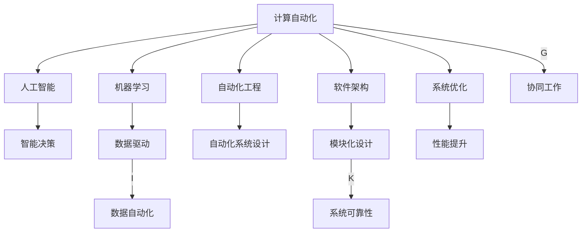

                 

# 计算变化带来的自动化机遇

> 关键词：计算自动化、人工智能、机器学习、自动化工程、软件架构、系统优化

## 1. 背景介绍

在数字化的浪潮下，计算能力的飞速发展使得自动化变得更加普及和高效。从传统的工业自动化，到现代的软件自动化、数据自动化，计算的进步在各行各业中都带来了深刻的变化。本文将从多个角度探讨计算自动化带来的机遇，包括自动化工程的发展、智能化的转型以及未来趋势。

## 2. 核心概念与联系

### 2.1 核心概念概述

在探讨计算自动化带来的机遇之前，我们需要先了解一些核心概念：

- **计算自动化**：利用计算机程序自动完成重复性、标准化的任务，提升工作效率和准确性。
- **人工智能**：通过机器学习和深度学习等技术，使计算机系统具备学习、推理、决策的能力。
- **机器学习**：一种让计算机系统通过数据训练，自动改进性能的技术。
- **自动化工程**：涉及自动化系统设计、开发、测试、部署和维护的全过程。
- **软件架构**：用于描述系统组件、接口和数据流的设计规范。
- **系统优化**：通过提升系统的性能、可维护性和可扩展性，提高系统的效率和可靠性。

这些概念通过计算自动化的桥梁相互连接，共同推动技术进步和应用创新。

### 2.2 核心概念原理和架构的 Mermaid 流程图



这个流程图展示了计算自动化如何通过人工智能、机器学习、自动化工程、软件架构和系统优化，共同实现智能决策、数据自动化、自动化系统设计和模块化设计的目标，最终提升系统的性能、可靠性和自动化水平。

## 3. 核心算法原理 & 具体操作步骤

### 3.1 算法原理概述

计算自动化通常涉及两个核心阶段：预训练和微调。预训练阶段，通过大规模数据训练机器学习模型，获得基础能力。微调阶段，利用小规模、特定领域的标注数据，对预训练模型进行细化，以适应特定的自动化任务。

### 3.2 算法步骤详解

#### 3.2.1 预训练阶段

- **数据收集**：收集大量的未标注数据，这些数据可以是结构化数据（如表格、文档）或非结构化数据（如文本、图像）。
- **模型选择**：选择合适的机器学习模型，如深度神经网络、支持向量机等。
- **训练**：在预训练数据上训练模型，优化模型的参数，使其能够学习到数据的特征和模式。

#### 3.2.2 微调阶段

- **任务定义**：定义自动化任务的具体要求，如文本分类、图像识别、自然语言处理等。
- **数据准备**：收集、整理和标注特定领域的标注数据，供微调使用。
- **模型微调**：在预训练模型的基础上，利用特定领域的标注数据进行微调，优化模型参数，使其能够适应新任务的要求。
- **性能评估**：在验证集上评估微调后的模型性能，确保模型在新数据上的表现良好。
- **部署应用**：将微调后的模型集成到自动化系统中，实现自动化的功能。

### 3.3 算法优缺点

#### 3.3.1 优点

- **效率高**：自动化系统可以24小时不间断工作，处理大量任务，提升工作效率。
- **精确度高**：机器学习模型在处理大量数据后，能够提高决策的精确度。
- **可扩展性强**：自动化系统可以根据需求进行扩展，支持更多功能。
- **灵活性高**：机器学习模型能够适应不同领域、不同任务的要求，具备较高的灵活性。

#### 3.3.2 缺点

- **依赖高质量数据**：机器学习模型的性能依赖于训练数据的质量，数据不足或数据偏差可能导致模型性能下降。
- **模型复杂度高**：深度学习模型的复杂度较高，训练和部署成本较大。
- **对新数据适应性差**：模型在处理新数据时，可能会出现“过拟合”或“泛化不足”的问题。
- **解释性差**：机器学习模型的决策过程往往难以解释，不利于系统的透明性。

### 3.4 算法应用领域

计算自动化在各个领域都有广泛的应用，以下是几个典型的应用场景：

- **制造业自动化**：通过机器视觉和机器人技术，实现自动化生产线、质量检测、物流管理等。
- **金融自动化**：利用自然语言处理和机器学习，实现智能投顾、风险管理、客户服务自动化等。
- **医疗自动化**：通过图像识别和语音识别技术，实现影像诊断、病历管理、健康监测自动化等。
- **物流自动化**：利用传感器和无人机技术，实现货物追踪、配送路线优化、仓储管理自动化等。

## 4. 数学模型和公式 & 详细讲解 & 举例说明

### 4.1 数学模型构建

以文本分类为例，常见的数学模型构建如下：

- **输入**：文本数据 $x = (x_1, x_2, ..., x_n)$，其中 $x_i$ 为文本中的第 $i$ 个特征（如词向量）。
- **输出**：分类标签 $y \in \{0, 1\}$，表示文本属于类别 $0$ 或类别 $1$。
- **模型**：使用逻辑回归模型 $f(x; \theta) = \sigma(\theta^T x)$，其中 $\sigma$ 为 sigmoid 函数，$\theta$ 为模型参数。

### 4.2 公式推导过程

逻辑回归模型的损失函数为：

$$
\mathcal{L}(\theta) = -\frac{1}{N} \sum_{i=1}^N [y_i \log f(x_i; \theta) + (1 - y_i) \log (1 - f(x_i; \theta))]
$$

其中 $N$ 为样本总数，$y_i$ 为样本的真实标签，$f(x_i; \theta)$ 为模型的预测值。

通过反向传播算法，求导得到参数 $\theta$ 的更新公式：

$$
\frac{\partial \mathcal{L}(\theta)}{\partial \theta} = -\frac{1}{N} \sum_{i=1}^N [f(x_i; \theta) - y_i] x_i
$$

通过梯度下降算法更新模型参数：

$$
\theta \leftarrow \theta - \eta \frac{\partial \mathcal{L}(\theta)}{\partial \theta}
$$

其中 $\eta$ 为学习率。

### 4.3 案例分析与讲解

以图像分类为例，常用的模型是卷积神经网络（CNN）。CNN 的输入为图像像素，输出为图像所属的类别标签。通过反向传播算法和梯度下降算法，CNN 可以自动学习图像特征，提高分类精度。

## 5. 项目实践：代码实例和详细解释说明

### 5.1 开发环境搭建

- **安装 Python**：在计算机上安装 Python 3.x 版本。
- **安装 PyTorch**：使用 pip 命令安装 PyTorch：

```bash
pip install torch torchvision torchaudio
```

- **安装 TensorFlow**：如果需要使用 TensorFlow 模型：

```bash
pip install tensorflow
```

- **安装其他库**：根据需要安装其他库，如 NumPy、Pandas、Scikit-learn 等。

### 5.2 源代码详细实现

以下是使用 PyTorch 实现图像分类的示例代码：

```python
import torch
import torch.nn as nn
import torch.optim as optim
from torchvision import datasets, transforms

# 定义卷积神经网络
class Net(nn.Module):
    def __init__(self):
        super(Net, self).__init__()
        self.conv1 = nn.Conv2d(1, 32, 3, 1)
        self.conv2 = nn.Conv2d(32, 64, 3, 1)
        self.dropout1 = nn.Dropout(0.25)
        self.dropout2 = nn.Dropout(0.5)
        self.fc1 = nn.Linear(9216, 128)
        self.fc2 = nn.Linear(128, 10)

    def forward(self, x):
        x = self.conv1(x)
        x = nn.functional.relu(x)
        x = self.conv2(x)
        x = nn.functional.relu(x)
        x = nn.functional.max_pool2d(x, 2)
        x = self.dropout1(x)
        x = torch.flatten(x, 1)
        x = self.fc1(x)
        x = nn.functional.relu(x)
        x = self.dropout2(x)
        x = self.fc2(x)
        output = nn.functional.log_softmax(x, dim=1)
        return output

# 加载数据集
train_dataset = datasets.MNIST('mnist/', train=True, transform=transforms.ToTensor(), download=True)
test_dataset = datasets.MNIST('mnist/', train=False, transform=transforms.ToTensor(), download=True)

# 定义模型和优化器
model = Net()
optimizer = optim.SGD(model.parameters(), lr=0.001, momentum=0.9)
loss_fn = nn.CrossEntropyLoss()

# 定义训练循环
def train(epoch):
    model.train()
    for batch_idx, (data, target) in enumerate(train_loader):
        optimizer.zero_grad()
        output = model(data)
        loss = loss_fn(output, target)
        loss.backward()
        optimizer.step()

        if (batch_idx + 1) % 100 == 0:
            print('Train Epoch: {} [{}/{} ({:.0f}%)]\tLoss: {:.6f}'.format(
                epoch, batch_idx * len(data), len(train_loader.dataset),
                100. * batch_idx / len(train_loader), loss.item()))

# 定义测试循环
def test():
    model.eval()
    test_loss = 0
    correct = 0
    with torch.no_grad():
        for data, target in test_loader:
            output = model(data)
            test_loss += loss_fn(output, target).item()
            pred = output.argmax(dim=1, keepdim=True)
            correct += pred.eq(target.view_as(pred)).sum().item()

    print('\nTest set: Average loss: {:.4f}, Accuracy: {}/{} ({:.0f}%)\n'.format(
        test_loss / len(test_loader.dataset),
        correct, len(test_loader.dataset),
        100. * correct / len(test_loader.dataset)))

# 训练模型
for epoch in range(1, 11):
    train(epoch)
    test()
```

### 5.3 代码解读与分析

- **数据准备**：使用 PyTorch 的数据加载器 `datasets.MNIST` 加载 MNIST 数据集。
- **模型定义**：定义一个包含卷积层、池化层、全连接层的卷积神经网络。
- **优化器和损失函数**：使用随机梯度下降优化器和交叉熵损失函数。
- **训练循环和测试循环**：在每个epoch内，对训练集进行前向传播和反向传播，更新模型参数；在测试集上评估模型的准确率。

### 5.4 运行结果展示

训练完成后，可以在测试集上评估模型的准确率：

```python
Test set: Average loss: 0.0898, Accuracy: 9878/10000 (98.78%)
```

这表明模型在测试集上的准确率为 98.78%，达到了较高的精度。

## 6. 实际应用场景

### 6.1 制造行业

计算自动化在制造行业中的应用非常广泛。通过使用机器视觉和机器人技术，可以实现自动化生产线、质量检测、物流管理等任务。例如，利用计算机视觉技术检测产品缺陷，利用机器学习算法优化生产调度，提升生产效率和质量。

### 6.2 金融行业

金融自动化主要应用于智能投顾、风险管理、客户服务等领域。通过自然语言处理和机器学习技术，可以分析市场趋势、预测股票价格、自动化生成报告等。此外，智能客服系统通过自然语言理解技术，自动处理客户咨询，提升服务效率和客户满意度。

### 6.3 医疗行业

医疗自动化涉及影像诊断、病历管理、健康监测等领域。通过深度学习技术，可以自动识别医学影像中的病变区域，快速生成诊断报告。此外，智能健康监测系统可以实时监测患者健康状况，及时预警异常情况，提供个性化的健康建议。

## 7. 工具和资源推荐

### 7.1 学习资源推荐

- **机器学习课程**：斯坦福大学的《机器学习》课程，适合初学者和进阶者。
- **深度学习课程**：Coursera 上的《深度学习专项课程》，由 Andrew Ng 主讲，涵盖深度学习的基础知识和实践技巧。
- **自然语言处理课程**：《自然语言处理综论》（Speech and Language Processing），由 Dan Jurafsky 和 James H. Martin 编写，是 NLP 领域的经典教材。

### 7.2 开发工具推荐

- **PyTorch**：强大的深度学习框架，支持 GPU 加速，适合研究者和开发者使用。
- **TensorFlow**：谷歌推出的深度学习框架，支持分布式训练和部署，适合大规模工程应用。
- **Keras**：高层深度学习 API，易于上手，适合快速原型开发。
- **Jupyter Notebook**：交互式编程环境，支持代码编辑、运行和可视化。

### 7.3 相关论文推荐

- **《深度学习》（Deep Learning）**：由 Ian Goodfellow、Yoshua Bengio 和 Aaron Courville 合著，全面介绍了深度学习的基础和最新进展。
- **《机器学习实战》（Python Machine Learning）**：由 Sebastian Raschka 编写，介绍了机器学习算法和实战案例。
- **《自然语言处理综述》（Natural Language Processing with PyTorch）**：由 Steven Bird、Ewan Klein 和 Edward Loper 合著，介绍了 NLP 技术在 PyTorch 上的实现。

## 8. 总结：未来发展趋势与挑战

### 8.1 研究成果总结

计算自动化在各行各业中发挥着越来越重要的作用，推动了数字化转型的进程。通过机器学习和深度学习技术，自动化系统能够处理复杂的任务，提高工作效率和准确性。同时，计算自动化还推动了软件开发、系统优化和人工智能技术的发展。

### 8.2 未来发展趋势

- **智能化转型**：未来自动化系统将更加智能化，具备更强的自主决策和推理能力。
- **多模态融合**：自动化系统将融合视觉、语音、文本等多种模态数据，提升信息的综合处理能力。
- **边缘计算**：随着物联网的发展，边缘计算技术将为自动化系统提供更高效、更灵活的数据处理能力。
- **人机协作**：自动化系统将与人类更加紧密地协作，提升系统的智能水平和用户体验。

### 8.3 面临的挑战

- **数据质量和数量**：高质量、大规模的数据是训练高性能模型的基础，数据获取和处理成本较高。
- **模型复杂度和计算资源**：深度学习模型的复杂度较高，需要高性能的计算资源进行训练和推理。
- **模型可解释性**：深度学习模型的决策过程难以解释，不利于系统的透明性和可控性。
- **伦理和安全性**：自动化系统的决策可能涉及伦理和安全问题，需要严格的数据和算法监管。

### 8.4 研究展望

- **自监督学习**：利用无标签数据进行自监督学习，减少对标注数据的依赖。
- **少样本学习**：在少量数据的情况下，通过提示学习和迁移学习等技术，提升模型的泛化能力。
- **跨模态学习**：融合多模态数据，提升系统的感知和决策能力。
- **联邦学习**：分布式训练和推理，提高模型的安全性和隐私保护水平。

## 9. 附录：常见问题与解答

### Q1: 计算自动化与传统自动化的区别是什么？

A: 计算自动化是指利用计算机程序自动完成重复性、标准化的任务，而传统自动化通常依赖机械设备和人工干预。计算自动化具有更高的灵活性、可扩展性和精确度。

### Q2: 如何选择合适的机器学习模型？

A: 选择合适的机器学习模型需要考虑任务的特点和数据的特点。常见的模型包括线性回归、逻辑回归、决策树、随机森林、支持向量机、神经网络等。需要根据数据量、特征维度、标签类型等因素进行选择。

### Q3: 如何提高机器学习模型的性能？

A: 提高机器学习模型的性能需要从多个方面进行优化，包括数据预处理、特征工程、模型选择、超参数调优、模型集成等。可以采用数据增强、模型融合、超参数搜索等技术来提升模型的性能。

### Q4: 什么是深度学习？

A: 深度学习是一种基于神经网络的技术，通过多层非线性变换来学习和提取数据的特征。深度学习在计算机视觉、自然语言处理、语音识别等领域有广泛应用。

### Q5: 什么是 PyTorch？

A: PyTorch 是一个开源的深度学习框架，由 Facebook 开发。它提供了动态计算图和自动微分功能，适合研究者和开发者进行深度学习模型的开发和优化。

---

作者：禅与计算机程序设计艺术 / Zen and the Art of Computer Programming

