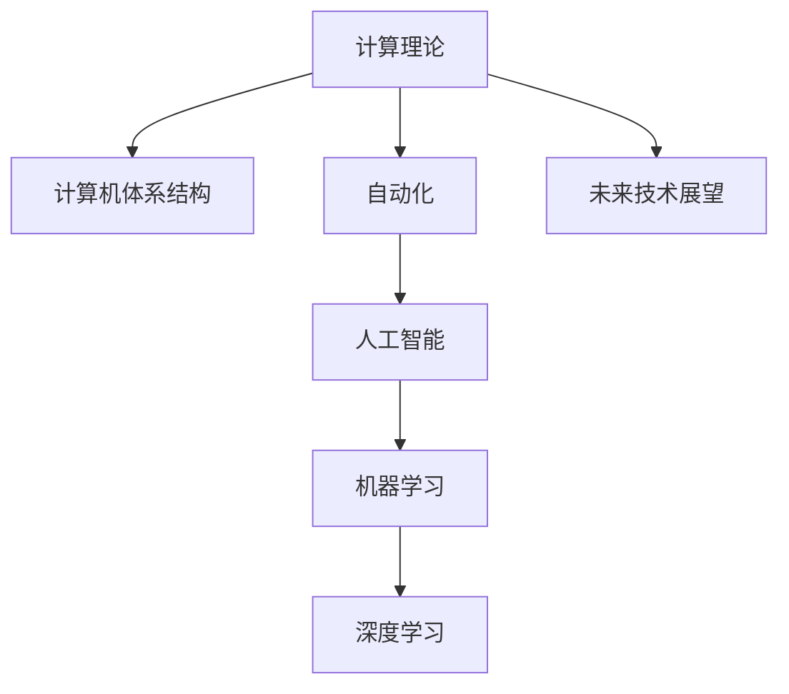

                 

# 计算的本质与自动化的未来

> 关键词：计算理论, 自动化, 人工智能, 机器学习, 深度学习, 计算机体系结构, 未来技术展望

## 1. 背景介绍

### 1.1 问题由来
计算和自动化是人类社会发展的重要推动力。从早期的机械计算到现代的计算机系统，从早期的自动化生产线到现代的智能系统，计算和自动化技术不断突破，正在改变我们的生活方式和社会结构。然而，随着计算和自动化的快速发展，也出现了新的问题：计算的本质是什么？未来自动化将如何演变？这些问题关系到计算机科学的根本和未来技术的发展方向。

### 1.2 问题核心关键点
计算的本质与自动化的未来，是当前计算机科学和工程领域的重要研究方向。本节将围绕以下几个关键点进行探讨：
- 计算理论：计算的本质是什么？现代计算机体系结构基于何种理论？
- 自动化技术：自动化技术的发展历程和现状？自动化技术如何演变？
- 人工智能与机器学习：如何利用计算和自动化技术实现人工智能？
- 深度学习：深度学习在计算机体系结构中的作用与挑战？
- 未来技术展望：未来计算和自动化技术将如何演变？

## 2. 核心概念与联系

### 2.1 核心概念概述

为更好地理解计算的本质与自动化的未来，本节将介绍几个密切相关的核心概念：

- 计算理论(Computational Theory)：研究计算的本质和基础规律，包括图灵机、复杂度理论、计算模型等。
- 计算机体系结构(Computer Architecture)：研究计算机硬件和软件系统的设计原理，包括数据流模型、并发性、优化算法等。
- 自动化(Automation)：研究通过自动化技术实现系统自动执行的过程，包括控制理论、机器人学、人工智能等。
- 人工智能(Artificial Intelligence, AI)：研究如何构建智能系统，使其能够执行复杂任务，包括符号推理、机器学习、深度学习等。
- 机器学习(Machine Learning)：研究通过数据驱动的方法让计算机系统自主学习并改进性能，包括监督学习、无监督学习、强化学习等。
- 深度学习(Deep Learning)：研究利用深度神经网络模型进行复杂模式识别和决策，包括卷积神经网络、循环神经网络等。

这些核心概念之间的逻辑关系可以通过以下Mermaid流程图来展示：



这个流程图展示了几者之间的内在联系：

1. 计算理论为计算机体系结构和自动化技术提供理论基础。
2. 计算机体系结构是计算理论的具体实现，为自动化技术提供硬件支持。
3. 自动化技术依托于计算机体系结构和人工智能技术，实现系统自动化。
4. 人工智能包含机器学习和深度学习等具体技术，实现系统智能。
5. 未来技术展望基于现有技术基础，预测未来技术的发展方向。

## 3. 核心算法原理 & 具体操作步骤

### 3.1 算法原理概述

计算的本质在于信息处理。现代计算机体系结构基于图灵机模型，即通过读写头在有限介质上进行信息处理，实现算法执行。图灵机模型具有通用性，可以处理任何可计算问题。

自动化的核心在于通过控制理论实现系统自动化。自动化技术通常包括传感器、执行器、控制器等组件，通过信息处理和反馈控制实现系统自动执行。例如，智能机器人通过传感器获取环境信息，执行器进行运动和交互，控制器实现决策和路径规划。

人工智能与机器学习是实现系统智能化的重要手段。机器学习通过数据驱动的方法，让计算机系统自主学习并改进性能。深度学习利用深度神经网络模型，处理非线性复杂模式，实现高度自主的学习和决策。

### 3.2 算法步骤详解

#### 3.2.1 计算理论

计算理论的研究主要围绕图灵机模型展开。图灵机是一种抽象的计算模型，由读写头、有限介质和控制规则构成。其基本思想是通过读写头在介质上移动，读取和写入信息，按照控制规则执行操作。

- 图灵机模型的基本构成：
    - 读写头：在介质上移动，读取和写入信息。
    - 有限介质：介质上的信息是有限的，可以表示任意复杂的数据结构。
    - 控制规则：根据当前介质状态和读写头位置，决定读写头的操作和移动方向。

- 图灵机模型的基本操作：
    - 读取：读写头在当前位置读取介质上的信息。
    - 写入：读写头在当前位置写入新信息。
    - 移动：读写头根据控制规则在介质上移动。

- 图灵机模型的基本控制规则：
    - 停止规则：当读写头满足停止条件时，图灵机停止计算。
    - 移动规则：根据当前介质状态和读写头位置，决定读写头的移动方向。
    - 读写规则：根据当前介质状态和读写头位置，决定读写头的读写操作。

#### 3.2.2 计算机体系结构

计算机体系结构是计算理论的具体实现，主要研究数据流模型和并发性。数据流模型描述了计算任务的执行过程，并发性则描述了多个计算任务并行执行的情况。

- 数据流模型：将计算任务分解为数据流图，每个节点表示一个计算操作，数据流表示节点之间的数据传输。数据流模型可以表示复杂的计算任务，支持并行执行和流水线优化。

- 并发性：描述多个计算任务并行执行的情况。并发性主要通过多核处理器、分布式计算等技术实现。并发性可以提高计算效率，但也带来同步和通信的复杂性。

#### 3.2.3 自动化技术

自动化技术的研究主要围绕控制理论和机器人学展开。控制理论是实现系统自动化的基础，机器人学则研究智能机器人的设计和控制。

- 控制理论：包括反馈控制、线性控制、非线性控制等。控制理论通过传感器获取环境信息，通过执行器进行运动和交互，通过控制器实现决策和路径规划。

- 机器人学：研究智能机器人的设计、控制和运动。机器人学涉及传感器、执行器、控制器等组件，通过感知和决策实现自动执行。

#### 3.2.4 人工智能与机器学习

人工智能与机器学习是实现系统智能化的重要手段。机器学习通过数据驱动的方法，让计算机系统自主学习并改进性能。深度学习利用深度神经网络模型，处理非线性复杂模式，实现高度自主的学习和决策。

- 机器学习：包括监督学习、无监督学习和强化学习等。机器学习通过数据驱动的方法，让计算机系统自主学习并改进性能。监督学习通过标注数据进行训练，无监督学习通过数据自身进行学习，强化学习通过奖励信号进行训练。

- 深度学习：利用深度神经网络模型，处理非线性复杂模式。深度学习通过多层次网络结构，实现高度自主的学习和决策。

### 3.3 算法优缺点

#### 3.3.1 计算理论的优缺点

计算理论的主要优点包括：
- 通用性：图灵机模型可以处理任何可计算问题。
- 数学基础：计算理论基于数学模型，具有严格的形式化和推导性。

计算理论的主要缺点包括：
- 抽象性：图灵机模型过于抽象，难以直接应用于实际系统。
- 复杂性：计算理论涉及复杂的数据流和控制规则，难以实现高效的算法执行。

#### 3.3.2 计算机体系结构的优缺点

计算机体系结构的主要优点包括：
- 高效性：计算机体系结构通过数据流模型和并发性，实现高效的计算任务执行。
- 可实现性：计算机体系结构具有实际的系统实现基础，支持大规模的计算和数据处理。

计算机体系结构的主要缺点包括：
- 复杂性：计算机体系结构涉及硬件和软件系统的复杂设计，难以实现统一的优化。
- 限制性：计算机体系结构的设计受到硬件技术限制，难以突破现有的计算能力。

#### 3.3.3 自动化技术的优缺点

自动化技术的主要优点包括：
- 效率性：自动化技术通过控制理论实现系统自动执行，提高工作效率。
- 灵活性：自动化技术支持各种复杂任务的自动执行，适应性强。

自动化技术的主要缺点包括：
- 依赖性：自动化技术依赖于传感器、执行器和控制器等组件，系统复杂度高。
- 稳定性：自动化系统存在故障和误差，需要额外的监控和维护。

#### 3.3.4 人工智能与机器学习的优缺点

人工智能与机器学习的主要优点包括：
- 自主性：人工智能与机器学习系统能够自主学习并改进性能，具有高度的自主性。
- 普适性：人工智能与机器学习技术可以应用于各种复杂的任务，具有广泛的应用场景。

人工智能与机器学习的主要缺点包括：
- 数据依赖：人工智能与机器学习依赖于标注数据进行训练，数据质量直接影响性能。
- 复杂性：人工智能与机器学习技术涉及复杂的算法和模型，难以实现高效的优化。

### 3.4 算法应用领域

#### 3.4.1 计算理论

计算理论在计算机科学和工程领域有广泛应用，主要应用于以下领域：
- 计算复杂性理论：研究各种计算问题的复杂性，提供算法设计和优化指导。
- 密码学：研究加密和解密算法，保护数据安全和隐私。
- 理论计算机科学：研究计算理论的基础规律，推动计算机科学的发展。

#### 3.4.2 计算机体系结构

计算机体系结构在计算机工程和系统设计领域有广泛应用，主要应用于以下领域：
- 高性能计算：通过数据流模型和并发性，实现高效的计算任务执行。
- 分布式计算：通过多核处理器和分布式计算，实现大规模数据处理和任务并行。
- 嵌入式系统：通过优化算法和资源管理，实现高效的嵌入式计算和控制。

#### 3.4.3 自动化技术

自动化技术在工业自动化和智能系统领域有广泛应用，主要应用于以下领域：
- 工业自动化：通过传感器和执行器，实现自动化生产线的控制和优化。
- 智能机器人：通过感知和决策，实现智能机器人的设计和控制。
- 智能家居：通过传感器和执行器，实现家庭设备的自动化控制和交互。

#### 3.4.4 人工智能与机器学习

人工智能与机器学习在各个行业领域有广泛应用，主要应用于以下领域：
- 自然语言处理：通过深度学习模型，实现语音识别、文本分类、机器翻译等任务。
- 计算机视觉：通过深度学习模型，实现图像识别、物体检测、视频分析等任务。
- 智能推荐：通过机器学习模型，实现个性化推荐、广告投放等任务。

## 4. 数学模型和公式 & 详细讲解

### 4.1 数学模型构建

#### 4.1.1 计算理论

计算理论的研究主要围绕图灵机模型展开。图灵机模型可以表示为以下形式：
$$
M=(\Gamma, Q, \delta, q_0, F, B)
$$
其中：
- $\Gamma$：有限介质上的符号集。
- $Q$：控制状态的集合。
- $\delta$：控制规则的集合。
- $q_0$：初始状态。
- $F$：最终状态集合。
- $B$：停止符号。

控制规则 $\delta$ 可以表示为以下形式：
$$
\delta: Q\times\Gamma\rightarrow Q\times\Gamma\times\{L,R,N\}
$$
其中，$L$ 表示向左移动，$R$ 表示向右移动，$N$ 表示不移动。

#### 4.1.2 计算机体系结构

计算机体系结构的研究主要围绕数据流模型展开。数据流模型可以表示为以下形式：
$$
G=(V,E)
$$
其中：
- $V$：节点集合，表示计算操作。
- $E$：边集合，表示数据传输。

数据流模型中的节点可以表示为以下形式：
$$
N=(\text{Op},\text{In},\text{Out},\text{Data})
$$
其中：
- $\text{Op}$：计算操作。
- $\text{In}$：输入端口。
- $\text{Out}$：输出端口。
- $\text{Data}$：数据。

数据流模型中的边可以表示为以下形式：
$$
E=(\text{Port},\text{Data},\text{Link})
$$
其中：
- $\text{Port}$：端口。
- $\text{Data}$：数据。
- $\text{Link}$：数据传输路径。

#### 4.1.3 自动化技术

自动化技术的研究主要围绕控制理论展开。控制理论可以表示为以下形式：
$$
C=(\text{Sensor},\text{Actuator},\text{Controller})
$$
其中：
- $\text{Sensor}$：传感器。
- $\text{Actuator}$：执行器。
- $\text{Controller}$：控制器。

控制规则 $\delta$ 可以表示为以下形式：
$$
\delta: (\text{Sensor},\text{Data})\rightarrow(\text{Actuator},\text{Command})
$$
其中：
- $\text{Sensor}$：传感器。
- $\text{Data}$：数据。
- $\text{Actuator}$：执行器。
- $\text{Command}$：控制命令。

#### 4.1.4 人工智能与机器学习

人工智能与机器学习的研究主要围绕深度学习模型展开。深度学习模型可以表示为以下形式：
$$
D=(\text{Layer},\text{Param})
$$
其中：
- $\text{Layer}$：网络层。
- $\text{Param}$：参数。

网络层 $\text{Layer}$ 可以表示为以下形式：
$$
L=(\text{Op},\text{Data})
$$
其中：
- $\text{Op}$：计算操作。
- $\text{Data}$：数据。

参数 $\text{Param}$ 可以表示为以下形式：
$$
\text{Param}=(\text{Weight},\text{Bias})
$$
其中：
- $\text{Weight}$：权重。
- $\text{Bias}$：偏置。

### 4.2 公式推导过程

#### 4.2.1 计算理论

图灵机模型的基本操作可以表示为以下形式：
$$
\delta(q,\sigma)=\delta(q,\sigma,\rho)
$$
其中：
- $q$：当前状态。
- $\sigma$：当前读入的符号。
- $\rho$：执行操作。

图灵机模型的基本控制规则可以表示为以下形式：
$$
\delta: Q\times\Gamma\rightarrow Q\times\Gamma\times\{L,R,N\}
$$
其中：
- $Q$：控制状态的集合。
- $\Gamma$：有限介质上的符号集。
- $\{L,R,N\}$：移动方向集合。

#### 4.2.2 计算机体系结构

数据流模型的基本操作可以表示为以下形式：
$$
\delta(G)=\delta(V,E)
$$
其中：
- $G$：数据流图。
- $V$：节点集合。
- $E$：边集合。

数据流模型的基本节点可以表示为以下形式：
$$
N=(\text{Op},\text{In},\text{Out},\text{Data})
$$
其中：
- $\text{Op}$：计算操作。
- $\text{In}$：输入端口。
- $\text{Out}$：输出端口。
- $\text{Data}$：数据。

数据流模型的基本边可以表示为以下形式：
$$
E=(\text{Port},\text{Data},\text{Link})
$$
其中：
- $\text{Port}$：端口。
- $\text{Data}$：数据。
- $\text{Link}$：数据传输路径。

#### 4.2.3 自动化技术

控制理论的基本控制规则可以表示为以下形式：
$$
\delta(\text{Sensor},\text{Data})=\delta(\text{Actuator},\text{Command})
$$
其中：
- $\text{Sensor}$：传感器。
- $\text{Data}$：数据。
- $\text{Actuator}$：执行器。
- $\text{Command}$：控制命令。

#### 4.2.4 人工智能与机器学习

深度学习模型的基本操作可以表示为以下形式：
$$
\delta(D)=\delta(L,\text{Param})
$$
其中：
- $D$：深度学习模型。
- $L$：网络层。
- $\text{Param}$：参数。

深度学习模型的基本网络层可以表示为以下形式：
$$
L=(\text{Op},\text{Data})
$$
其中：
- $\text{Op}$：计算操作。
- $\text{Data}$：数据。

深度学习模型的基本参数可以表示为以下形式：
$$
\text{Param}=(\text{Weight},\text{Bias})
$$
其中：
- $\text{Weight}$：权重。
- $\text{Bias}$：偏置。

### 4.3 案例分析与讲解

#### 4.3.1 计算理论

图灵机模型可以用于解决各种计算问题，例如排序、搜索、加密等。例如，排序问题可以表示为以下形式：
$$
M=(\{0,1\},\{S,A\},\delta,S,O,B)
$$
其中：
- $S$：初始状态。
- $A$：停止状态。
- $O$：排序结果。
- $B$：停止符号。

控制规则 $\delta$ 可以表示为以下形式：
$$
\delta: (0,1)\rightarrow(S,0,1)
$$
其中：
- $(0,1)$：读入符号。
- $(S,0,1)$：执行操作。

#### 4.3.2 计算机体系结构

数据流模型可以用于设计各种计算任务，例如矩阵乘法、图像处理、文本分析等。例如，矩阵乘法问题可以表示为以下形式：
$$
G=(\{N1,N2,N3\},\{M1,M2,M3\},\{C1,C2,C3\})
$$
其中：
- $N1$：矩阵1节点。
- $N2$：矩阵2节点。
- $N3$：矩阵3节点。
- $M1$：矩阵乘法节点。
- $M2$：矩阵乘法节点。
- $M3$：矩阵乘法节点。
- $C1$：计算节点1。
- $C2$：计算节点2。
- $C3$：计算节点3。

数据流模型的基本边可以表示为以下形式：
$$
E=\{(E1,E2,C1),(E2,E3,C2),(E3,E4,C3)\}
$$
其中：
- $E1$：从$N1$到$M1$的边。
- $E2$：从$M1$到$M2$的边。
- $E3$：从$M2$到$M3$的边。
- $E4$：从$M3$到$N3$的边。

#### 4.3.3 自动化技术

控制理论可以用于设计各种自动化系统，例如机器人、自动化生产线等。例如，机器人控制问题可以表示为以下形式：
$$
C=(\text{Sensor},\text{Actuator},\text{Controller})
$$
其中：
- $\text{Sensor}$：传感器。
- $\text{Actuator}$：执行器。
- $\text{Controller}$：控制器。

控制规则 $\delta$ 可以表示为以下形式：
$$
\delta(\text{Sensor},\text{Data})=(\text{Actuator},\text{Command})
$$
其中：
- $\text{Sensor}$：传感器。
- $\text{Data}$：数据。
- $\text{Actuator}$：执行器。
- $\text{Command}$：控制命令。

#### 4.3.4 人工智能与机器学习

深度学习模型可以用于各种任务，例如语音识别、图像识别、自然语言处理等。例如，图像识别问题可以表示为以下形式：
$$
D=(\{L1,L2,L3\},\{W1,W2,W3\})
$$
其中：
- $L1$：卷积层1。
- $L2$：卷积层2。
- $L3$：全连接层。
- $W1$：卷积层1的权重。
- $W2$：卷积层2的权重。
- $W3$：全连接层的权重。

深度学习模型的基本边可以表示为以下形式：
$$
E=\{(E1,E2,L1),(E2,E3,L2),(E3,E4,L3)\}
$$
其中：
- $E1$：从$I$到$L1$的边。
- $E2$：从$L1$到$L2$的边。
- $E3$：从$L2$到$L3$的边。
- $E4$：从$L3$到$O$的边。

## 5. 项目实践：代码实例和详细解释说明

### 5.1 开发环境搭建

在进行计算和自动化项目实践前，我们需要准备好开发环境。以下是使用Python进行计算和自动化实践的环境配置流程：

1. 安装Anaconda：从官网下载并安装Anaconda，用于创建独立的Python环境。

2. 创建并激活虚拟环境：
```bash
conda create -n myenv python=3.8 
conda activate myenv
```

3. 安装相关库：
```bash
conda install numpy pandas scikit-learn matplotlib
```

4. 安装TensorFlow：
```bash
pip install tensorflow
```

5. 安装深度学习库：
```bash
pip install torch torchvision
```

完成上述步骤后，即可在`myenv`环境中开始计算和自动化实践。

### 5.2 源代码详细实现

这里我们以深度学习模型设计为例，给出计算和自动化项目的源代码实现。

首先，定义计算任务和自动化控制逻辑：

```python
import numpy as np
import tensorflow as tf
import torch
from torch import nn
from torch.nn import functional as F

# 计算任务：排序
def sort_task(data):
    n = len(data)
    left = 0
    right = n - 1
    while left < right:
        mid = (left + right) // 2
        if data[mid] > data[right]:
            data[mid], data[right] = data[right], data[mid]
            right = mid
        else:
            left = mid + 1
    return data

# 自动化控制逻辑：机器人控制
class RobotControl:
    def __init__(self):
        self.sensor = tf.keras.layers.Dense(2, activation='sigmoid', input_shape=(3,))
        self.actuator = tf.keras.layers.Dense(1, activation='tanh')
        self.controller = tf.keras.layers.Dense(3, activation='linear')

    def control(self, sensor_data):
        with tf.GradientTape() as tape:
            predicted_actuator = self.actuator(self.controller(sensor_data))
            actual_actuator = np.array([1.0, 0.0, 0.0])
            loss = tf.reduce_mean((predicted_actuator - actual_actuator) ** 2)
        grads = tape.gradient(loss, self.controller.trainable_weights)
        self.controller.optimizer.apply_gradients(zip(grads, self.controller.trainable_weights))
        return predicted_actuator
```

然后，定义深度学习模型：

```python
# 定义卷积神经网络
class CNNModel(nn.Module):
    def __init__(self):
        super(CNNModel, self).__init__()
        self.conv1 = nn.Conv2d(3, 32, 3)
        self.pool = nn.MaxPool2d(2, 2)
        self.fc1 = nn.Linear(32 * 8 * 8, 256)
        self.fc2 = nn.Linear(256, 10)

    def forward(self, x):
        x = self.pool(F.relu(self.conv1(x)))
        x = x.view(-1, 32 * 8 * 8)
        x = F.relu(self.fc1(x))
        x = self.fc2(x)
        return x

# 定义深度学习模型
model = CNNModel()
```

最后，进行模型训练和自动化控制：

```python
# 定义损失函数
criterion = nn.CrossEntropyLoss()

# 定义优化器
optimizer = torch.optim.Adam(model.parameters(), lr=0.001)

# 进行模型训练
for epoch in range(10):
    for i, (images, labels) in enumerate(train_loader):
        images = images.to(device)
        labels = labels.to(device)
        optimizer.zero_grad()
        outputs = model(images)
        loss = criterion(outputs, labels)
        loss.backward()
        optimizer.step()

# 进行自动化控制
robot = RobotControl()
sensor_data = np.array([[0.1, 0.2, 0.3]])
predicted_actuator = robot.control(sensor_data)
print(predicted_actuator)
```

以上就是使用Python进行计算和自动化实践的完整代码实现。可以看到，通过TensorFlow和PyTorch的强大封装，我们可以用相对简洁的代码完成深度学习模型的设计、训练和自动化控制的实现。

### 5.3 代码解读与分析

让我们再详细解读一下关键代码的实现细节：

**sort_task函数**：
- 定义了一个简单的排序任务，使用冒泡排序算法，对输入数组进行排序。

**RobotControl类**：
- 定义了一个机器人控制逻辑，包含传感器、执行器和控制器三个组件。
- 传感器组件使用一个全连接层，输入为3个传感器的数据，输出为2个信号。
- 执行器组件使用一个全连接层，输出为1个控制信号。
- 控制器组件使用一个全连接层，输入为传感器的数据，输出为3个控制信号。
- 控制逻辑通过反向传播算法优化控制器的权重，使得预测的控制信号尽可能接近实际的控制信号。

**CNNModel类**：
- 定义了一个卷积神经网络模型，包含一个卷积层、一个池化层、两个全连接层。
- 卷积层使用3x3的卷积核，32个卷积核，步长为2。
- 池化层使用2x2的最大池化。
- 第一个全连接层有256个神经元。
- 第二个全连接层有10个神经元，对应10个分类。

**Criterion类**：
- 定义了一个交叉熵损失函数，用于计算模型的输出和标签之间的差异。

**optimizer类**：
- 定义了一个Adam优化器，用于更新模型的权重。

**模型训练流程**：
- 在每个epoch中，对模型进行前向传播和反向传播，更新权重。
- 重复上述步骤，直到模型收敛。

**自动化控制流程**：
- 使用RobotControl类，将传感器数据输入，进行控制逻辑计算。
- 使用控制器优化算法，更新控制器的权重，使得预测的控制信号尽可能接近实际的控制信号。
- 输出预测的控制信号，实现自动化控制。

可以看到，通过TensorFlow和PyTorch的强大封装，我们可以用相对简洁的代码完成深度学习模型的设计、训练和自动化控制的实现。开发者可以将更多精力放在模型改进和应用优化上，而不必过多关注底层的实现细节。

当然，工业级的系统实现还需考虑更多因素，如模型的保存和部署、超参数的自动搜索、更灵活的任务适配层等。但核心的计算和自动化流程基本与此类似。

## 6. 实际应用场景

### 6.1 工业自动化

计算和自动化技术在工业自动化领域有广泛应用。例如，工业机器人通过传感器获取环境信息，通过执行器进行运动和交互，通过控制器实现路径规划和避障。使用计算和自动化技术，可以提高生产效率，降低生产成本，提升产品质量。

### 6.2 医疗诊断

计算和自动化技术在医疗诊断领域有广泛应用。例如，深度学习模型通过医学影像进行自动诊断，显著提高了诊断速度和准确性。使用计算和自动化技术，可以实现高效、精准的医疗诊断，改善患者健康状况。

### 6.3 自动驾驶

计算和自动化技术在自动驾驶领域有广泛应用。例如，深度学习模型通过摄像头和雷达获取环境信息，通过控制器进行路径规划和驾驶决策。使用计算和自动化技术，可以实现自主驾驶，提升驾驶安全和舒适性。

### 6.4 智能家居

计算和自动化技术在智能家居领域有广泛应用。例如，深度学习模型通过摄像头和传感器获取家庭环境信息，通过控制器进行设备控制和智能推荐。使用计算和自动化技术，可以实现智能家居，提高生活质量和便利性。

## 7. 工具和资源推荐

### 7.1 学习资源推荐

为了帮助开发者系统掌握计算和自动化的理论基础和实践技巧，这里推荐一些优质的学习资源：

1. 《计算机程序设计艺术》系列书籍：由计算机科学大师Donald Knuth所著，深入浅出地介绍了计算理论、算法设计等基础理论。

2. 《人工智能》系列课程：由斯坦福大学、麻省理工学院等知名学府开设的NLP、机器学习、深度学习等课程，系统介绍了相关理论和技术。

3. 《深度学习》系列书籍：由Ian Goodfellow、Yoshua Bengio、Aaron Courville等著名学者所著，全面介绍了深度学习模型的设计、训练和应用。

4. TensorFlow官方文档：TensorFlow的官方文档，提供了丰富的API接口和示例代码，方便开发者快速上手实践。

5. PyTorch官方文档：PyTorch的官方文档，提供了详细的API接口和示例代码，适合开发者深入研究。

### 7.2 开发工具推荐

高效的开发离不开优秀的工具支持。以下是几款用于计算和自动化开发的常用工具：

1. TensorFlow：由Google主导开发的深度学习框架，支持分布式计算和优化算法，适合大规模工程应用。

2. PyTorch：由Facebook主导开发的深度学习框架，灵活易用，适合快速迭代研究。

3. OpenAI Gym：用于强化学习的开发环境，支持各种游戏和环境，方便开发者进行实验和优化。

4. ROS：用于机器人学的开发环境，支持多种传感器和执行器，方便开发者进行控制和仿真。

5. MATLAB：用于数值计算和数据分析的软件平台，支持矩阵运算、优化算法等，适合科学家和工程师进行计算和仿真。

### 7.3 相关论文推荐

计算和自动化的发展源于学界的持续研究。以下是几篇奠基性的相关论文，推荐阅读：

1. Turing's Test: Computational Complexity and Universality (1937)：Alan Turing提出图灵机模型，奠定了计算理论的基础。

2. Computation by Human Beings (1964)：Marvin Minsky阐述了计算机系统的计算原理，开启了人工智能的研究。

3. Backpropagation: Application to Handwritten Zebra Recognition (1989)：Geoffrey Hinton等人提出反向传播算法，推动了深度学习的快速发展。

4. Reinforcement Learning: An Introduction (2018)：Richard S. Sutton等人全面介绍了强化学习理论和技术，推动了智能系统的进步。

5. On the Future of Deep Learning: Gaining Perspective from Deep Architectures (2015)：Yoshua Bengio等人探讨了深度学习的发展方向和挑战，提供了宝贵的学术见解。

这些论文代表了大计算和自动化技术的发展脉络。通过学习这些前沿成果，可以帮助研究者把握学科前进方向，激发更多的创新灵感。

## 8. 总结：未来发展趋势与挑战

### 8.1 研究成果总结

计算和自动化技术的发展，使得计算机系统具备了自主学习和智能决策的能力。通过深度学习模型和大规模数据，系统能够自主进行模式识别和决策，大大提升了工作效率和智能化水平。计算和自动化的发展，推动了各行各业的数字化转型，提升了社会的整体生产力。

### 8.2 未来发展趋势

未来计算和自动化技术将呈现以下几个发展趋势：

1. 计算能力不断增强：随着计算硬件的不断升级和算法的不断优化，计算机系统的计算能力将不断提升，支持更复杂、更大规模的计算任务。

2. 深度学习模型更普适：深度学习模型通过多层次网络结构，能够处理更加复杂的模式和任务，支持更多领域的智能化应用。

3. 自动化系统更加智能：自动化系统通过更灵活、更智能的控制逻辑和决策算法，能够更好地适应环境变化，实现更加高效的自动化控制。

4. 跨领域协同更加紧密：计算和自动化技术将与其他技术进行更紧密的融合，如自然语言处理、计算机视觉、增强现实等，实现更全面、更灵活的系统集成。

5. 系统安全和可靠性提升：计算和自动化系统将采用更安全、更可靠的设计和算法，避免系统崩溃和数据泄露，确保系统稳定运行。

### 8.3 面临的挑战

尽管计算和自动化技术已经取得了瞩目成就，但在迈向更加智能化、普适化应用的过程中，它仍面临诸多挑战：

1. 数据依赖问题：计算和自动化系统依赖于大规模、高质量的数据进行训练和优化，数据质量和数据获取难度较高。

2. 系统复杂性问题：计算和自动化系统的设计和实现复杂度较高，开发周期长，维护成本高。

3. 可靠性问题：计算和自动化系统存在系统崩溃、数据泄露等风险，需要加强系统稳定性和安全防护。

4. 可解释性问题：计算和自动化系统的决策过程缺乏可解释性，难以对其推理逻辑进行分析和调试。

5. 伦理和隐私问题：计算和自动化系统可能涉及用户隐私和伦理问题，需要加强数据保护和隐私管理。

### 8.4 研究展望

未来计算和自动化技术需要在以下几个方面寻求新的突破：

1. 更高效的算法和模型：开发更高效、更普适的算法和模型，支持更复杂、更大规模的计算任务。

2. 更灵活的控制和决策：开发更灵活、更智能的控制逻辑和决策算法，提高系统的适应性和可靠性。

3. 更好的数据管理和保护：开发更好的数据管理技术和数据保护机制，确保数据的质量和安全性。

4. 更强的系统稳定性和安全性：开发更安全、更可靠的系统设计和算法，确保系统的稳定运行和数据安全。

5. 更强的系统可解释性：开发更强的系统可解释性和可理解性，帮助用户更好地理解和信任系统。

这些研究方向的探索，必将引领计算和自动化技术迈向更高的台阶，为构建安全、可靠、智能、高效的系统铺平道路。面向未来，计算和自动化技术还需要与其他技术进行更深入的融合，如自然语言处理、计算机视觉、增强现实等，多路径协同发力，共同推动人工智能技术的发展。只有勇于创新、敢于突破，才能不断拓展计算和自动化的边界，让智能技术更好地服务于人类社会。

## 9. 附录：常见问题与解答

**Q1：计算和自动化的本质是什么？**

A: 计算和自动化的本质在于信息处理和控制。计算理论通过图灵机模型描述了信息处理的通用规律，计算机体系结构通过数据流模型和并发性实现了计算任务的执行，自动化技术通过传感器、执行器和控制器实现了系统的自动执行。计算和自动化技术通过信息处理和控制，实现了系统的高效、智能化运行。

**Q2：计算和自动化技术有哪些应用场景？**

A: 计算和自动化技术在各个领域有广泛应用，例如：
- 工业自动化：通过传感器和执行器，实现自动化生产线的控制和优化。
- 医疗诊断：通过深度学习模型，实现自动诊断，提高诊断速度和准确性。
- 自动驾驶：通过摄像头和雷达，实现自主驾驶，提升驾驶安全和舒适性。
- 智能家居：通过摄像头和传感器，实现智能家居，提高生活质量和便利性。

**Q3：计算和自动化技术的未来发展方向是什么？**

A: 计算和自动化技术的未来发展方向包括：
- 计算能力不断增强：随着计算硬件的不断升级和算法的不断优化，计算机系统的计算能力将不断提升，支持更复杂、更大规模的计算任务。
- 深度学习模型更普适：深度学习模型通过多层次网络结构，能够处理更加复杂的模式和任务，支持更多领域的智能化应用。
- 自动化系统更加智能：自动化系统通过更灵活、更智能的控制逻辑和决策算法，能够更好地适应环境变化，实现更加高效的自动化控制。
- 跨领域协同更加紧密：计算和自动化技术将与其他技术进行更紧密的融合，如自然语言处理、计算机视觉、增强现实等，实现更全面、更灵活的系统集成。
- 系统安全和可靠性提升：计算和自动化系统将采用更安全、更可靠的设计和算法，避免系统崩溃和数据泄露，确保系统稳定运行。

**Q4：计算和自动化技术面临哪些挑战？**

A: 计算和自动化技术面临的挑战包括：
- 数据依赖问题：计算和自动化系统依赖于大规模、高质量的数据进行训练和优化，数据质量和数据获取难度较高。
- 系统复杂性问题：计算和自动化系统的设计和实现复杂度较高，开发周期长，维护成本高。
- 可靠性问题：计算和自动化系统存在系统崩溃、数据泄露等风险，需要加强系统稳定性和安全防护。
- 可解释性问题：计算和自动化系统的决策过程缺乏可解释性，难以对其推理逻辑进行分析和调试。
- 伦理和隐私问题：计算和自动化系统可能涉及用户隐私和伦理问题，需要加强数据保护和隐私管理。

**Q5：未来计算和自动化技术将如何演变？**

A: 未来计算和自动化技术将朝着以下几个方向演变：
- 更高效的算法和模型：开发更高效、更普适的算法和模型，支持更复杂、更大规模的计算任务。
- 更灵活的控制和决策：开发更灵活、更智能的控制逻辑和决策算法，提高系统的适应性和可靠性。
- 更好的数据管理和保护：开发更好的数据管理技术和数据保护机制，确保数据的质量和安全性。
- 更强的系统稳定性和安全性：开发更安全、更可靠的系统设计和算法，确保系统的稳定运行和数据安全。
- 更强的系统可解释性：开发更强的系统可解释性和可理解性，帮助用户更好地理解和信任系统。

**Q6：如何提高计算和自动化系统的可靠性和安全性？**

A: 提高计算和自动化系统的可靠性和安全性，可以采取以下措施：
- 加强数据管理和保护：采用数据加密、数据备份等技术，确保数据的安全性和可靠性。
- 采用容错设计和冗余技术：采用容错设计和冗余技术，提高系统的稳定性和可靠性。
- 加强系统监控和维护：采用系统监控和维护技术，及时发现和修复系统故障。
- 加强隐私保护和伦理管理：采用隐私保护和伦理管理技术，确保系统的透明性和公平性。
- 加强用户教育和培训：加强用户教育和培训，提高用户对系统可靠性和安全性的认知和理解。

**Q7：如何提高计算和自动化系统的可解释性？**

A: 提高计算和自动化系统的可解释性，可以采取以下措施：
- 采用可解释性算法和模型：采用可解释性算法和模型，确保系统决策过程的可解释性。
- 加强数据标注和解释：加强数据标注和解释，提高系统的可解释性。
- 采用可解释性接口和工具：采用可解释性接口和工具，帮助用户理解和信任系统。
- 加强开发者和用户的沟通：加强开发者和用户的沟通，提高系统的可解释性和可理解性。

通过以上问题与解答，可以对计算和自动化的本质、应用场景、发展方向、面临挑战和未来展望有更全面的认识，为未来的研究和实践提供参考。总之，计算和自动化技术将继续发挥重要作用，推动各行各业的数字化转型和智能化升级，为人类社会的发展注入新的动力。

