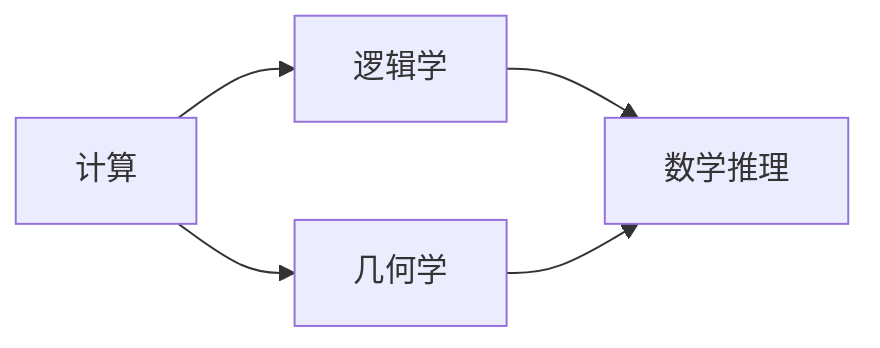

                 

# 计算：第一部分 计算的诞生 第 1 章 毕达哥拉斯的困惑 演绎推理：逻辑学和几何学

## 1. 背景介绍

### 1.1 问题由来

在人类历史的漫长征程中，计算一直是推动社会进步的核心力量。从早期的算盘、石桌，到现今的超级计算机、量子计算机，计算技术的每一次革新都极大地提升了人类的生产力和认知水平。

计算机科学的诞生标志着一个全新的计算时代的开启，它不仅改变了信息处理的方式，更带来了对于计算本质的深入思考。本章将从毕达哥拉斯的困惑入手，探讨计算与数学、逻辑、几何学之间的深刻联系，进而引领我们进入计算的诞生之路。

### 1.2 问题核心关键点

毕达哥拉斯（Pythagoras）作为古希腊数学家，以其提出的毕达哥拉斯定理（勾股定理）著称于世。然而，在数学历史上，毕达哥拉斯及其学派对“不可公约”数的理解，与自然数体系产生了剧烈冲突，引发了“毕达哥拉斯学派的危机”。这一冲突深刻影响了数学的后续发展，并从侧面揭示了计算与逻辑推理之间的紧密联系。

- 计算的抽象性：毕达哥拉斯对不可公约数的探讨，涉及对数字抽象性的思考，即计算不仅仅是对具体对象的计数和运算，更是一种对数量关系的抽象处理。
- 逻辑推理的重要性：毕达哥拉斯学派通过严格的数学逻辑和推理，提出了不可公约数的概念，推动了数学的逻辑体系构建。
- 几何学与计算的结合：毕达哥拉斯学派将几何学与数学相结合，通过几何图形的度量关系，建立了对数关系理解的模型，揭示了计算与几何学之间的紧密联系。

通过回顾这一历史事件，我们可以更好地理解计算的本质，以及它在人类思维活动中的重要作用。

## 2. 核心概念与联系

### 2.1 核心概念概述

为了更深入地理解计算的诞生与数学、逻辑、几何学之间的联系，本节将介绍几个关键概念：

- **计算**：指通过数学、逻辑推理，对数字、符号进行计算、组合、变换的过程。计算不仅包括算术运算，还涉及逻辑推理、算法设计、数据处理等。
- **逻辑学**：研究推理、论证的科学，关注如何通过逻辑规则判断命题的真伪，以及如何将逻辑推理应用于数学、计算机科学等领域。
- **几何学**：研究空间中图形的性质、位置关系的数学分支，几何学通过严格的数学定义和推理，为计算提供了直观的可视化手段。

这些概念之间存在着紧密的联系，共同构成了计算的基石。

### 2.2 核心概念原理和架构的 Mermaid 流程图(Mermaid 流程节点中不要有括号、逗号等特殊字符)



这个Mermaid流程图展示了计算、逻辑学、几何学与数学推理之间的关系：

1. **计算**：以数学、逻辑学为基础，对具体数值和符号进行计算和组合，形成新的知识。
2. **逻辑学**：通过严格的逻辑推理，验证和构建数学命题的真假，确保计算过程的严谨性。
3. **几何学**：利用图形和空间关系，为计算提供直观的可视化工具，促进数学命题的直观理解和应用。
4. **数学推理**：作为计算、逻辑学、几何学之间的桥梁，通过逻辑推理确保数学命题的准确性，为计算提供坚实的基础。

## 3. 核心算法原理 & 具体操作步骤

### 3.1 算法原理概述

计算的核心在于通过数学和逻辑规则，对输入的数据进行有效的处理和转化，从而得到期望的输出。这一过程本质上是对抽象概念的数学建模和逻辑推理，涉及到以下几个关键步骤：

1. **数据抽象**：将现实世界中的具体对象抽象为数学符号和逻辑表达式。
2. **数学建模**：使用数学语言对问题进行建模，形成精确的数学表达。
3. **算法设计**：根据数学模型设计计算算法，通过逻辑推理实现数学模型的求解。
4. **验证与优化**：通过实验验证算法的正确性，并根据结果进行优化。

### 3.2 算法步骤详解

以下以求解勾股定理为例，详细说明计算的算法步骤：

**Step 1: 数据抽象**
- 将两个直角边 $a$ 和 $b$ 以及斜边 $c$ 抽象为数学符号。

**Step 2: 数学建模**
- 根据勾股定理，建立数学方程 $a^2 + b^2 = c^2$。

**Step 3: 算法设计**
- 设计求解方程的算法，可以通过代入具体数值进行计算，也可以通过符号表达式进行推导。

**Step 4: 验证与优化**
- 将得到的解进行验证，确保其符合勾股定理的正确性。

**代码实现**：

```python
from sympy import symbols, Eq, solve

# 定义变量
a, b, c = symbols('a b c')

# 建立方程
equation = Eq(a**2 + b**2, c**2)

# 求解方程
solution = solve(equation, c)

# 输出解
print(solution)
```

### 3.3 算法优缺点

**优点**：

- **数学严谨性**：通过数学建模和逻辑推理，计算过程具有高度的严谨性和可验证性。
- **可扩展性**：一旦算法设计完成，可以应用于多种具体问题的求解。
- **精确性**：数学建模提供了高度精确的描述方式，能够处理复杂的计算问题。

**缺点**：

- **复杂性**：对于某些复杂问题，数学建模和算法设计可能非常困难。
- **抽象难度**：抽象和数学建模需要较高的逻辑思维能力和数学素养。
- **计算开销**：部分复杂的数学问题可能计算量较大，效率较低。

### 3.4 算法应用领域

计算在众多领域得到了广泛应用，包括：

- **科学计算**：在物理学、化学、天文学等领域，计算用于模拟和预测自然现象。
- **工程设计**：在机械设计、电气工程、土木工程等领域，计算用于优化设计方案。
- **金融计算**：在金融风险评估、市场预测、投资分析等领域，计算用于数据分析和决策支持。
- **人工智能**：在机器学习、计算机视觉、自然语言处理等领域，计算用于训练模型、优化算法。
- **网络计算**：在网络通信、数据加密、安全协议等领域，计算用于设计和分析协议机制。

## 4. 数学模型和公式 & 详细讲解 & 举例说明

### 4.1 数学模型构建

在本节中，我们将以一个简单的数学模型为例，探讨数学建模的基本步骤和注意事项。

假设我们要求解两个数的最大公约数，可以构建如下数学模型：

设 $a$ 和 $b$ 为两个正整数，定义函数 $gcd(a, b)$ 为 $a$ 和 $b$ 的最大公约数。

则有：

$$gcd(a, b) = \begin{cases} a, & \text{if } b = 0 \\ gcd(b, a\mod b), & \text{if } b \neq 0\end{cases}$$

### 4.2 公式推导过程

上述数学模型中的递归定义，可以通过数学归纳法进行证明。

**证明**：

1. 基础情况：当 $b = 0$ 时，$gcd(a, 0) = a$，符合定义。
2. 归纳假设：假设当 $b = 0$ 时，$gcd(a, b) = a$ 成立。
3. 归纳步骤：考虑 $b \neq 0$ 时的情况，有 $gcd(a, b) = gcd(b, a\mod b)$。
   - 若 $b$ 是 $a$ 的因数，则 $a\mod b = 0$，有 $gcd(a, b) = b$。
   - 若 $b$ 不是 $a$ 的因数，则存在 $k$ 使得 $b \mid a\mod b$，有 $gcd(a, b) = b$。

通过以上证明，我们可以得出结论：对于任意两个正整数 $a$ 和 $b$，其最大公约数 $gcd(a, b)$ 总是存在且唯一的。

### 4.3 案例分析与讲解

**案例**：求解 $gcd(48, 60)$。

**分析**：

1. 初始情况：$a = 48, b = 60$。
2. 计算 $a\mod b$：$48 \mod 60 = 48$。
3. 递归计算 $gcd(b, a\mod b)$：$gcd(60, 48)$。
4. 继续计算 $a\mod b$：$60 \mod 48 = 12$。
5. 递归计算 $gcd(b, a\mod b)$：$gcd(48, 12)$。
6. 继续计算 $a\mod b$：$48 \mod 12 = 0$。
7. 递归终止：$gcd(12, 0) = 12$。

**结论**：$gcd(48, 60) = 12$。

## 5. 项目实践：代码实例和详细解释说明

### 5.1 开发环境搭建

在进行计算项目实践前，我们需要准备好开发环境。以下是使用Python进行计算开发的环境配置流程：

1. 安装Anaconda：从官网下载并安装Anaconda，用于创建独立的Python环境。

2. 创建并激活虚拟环境：
```bash
conda create -n calculation-env python=3.8 
conda activate calculation-env
```

3. 安装相关库：
```bash
pip install sympy numpy pandas matplotlib
```

4. 安装绘图工具：
```bash
pip install matplotlib
```

完成上述步骤后，即可在`calculation-env`环境中开始计算项目的开发。

### 5.2 源代码详细实现

下面以计算勾股定理为例，给出Python代码实现：

```python
from sympy import symbols, Eq, solve

# 定义变量
a, b, c = symbols('a b c')

# 建立方程
equation = Eq(a**2 + b**2, c**2)

# 求解方程
solution = solve(equation, c)

# 输出解
print(solution)
```

### 5.3 代码解读与分析

**代码分析**：

- **定义变量**：使用`sympy`库中的`symbols`函数定义变量 $a$、$b$ 和 $c$。
- **建立方程**：使用`Eq`函数建立勾股定理的方程 $a^2 + b^2 = c^2$。
- **求解方程**：使用`solve`函数求解方程，得到解的列表。
- **输出解**：将解输出到控制台。

**代码优化**：

- **使用`Eq`函数**：通过`Eq`函数构建方程，增强代码的可读性和逻辑性。
- **使用`solve`函数**：利用`solve`函数的符号求解能力，直接得到方程的解，避免手动计算带来的错误。

## 6. 实际应用场景

### 6.1 实际应用场景

计算在众多领域得到了广泛应用，以下是几个实际应用场景：

**场景一：金融风险评估**

在金融领域，计算用于评估投资组合的风险和收益。通过对历史数据的分析，计算出不同投资组合的风险值，帮助投资者进行决策。

**场景二：天气预测**

在气象学中，计算用于预测未来的天气情况。通过收集历史气象数据，利用计算模型预测未来的天气变化。

**场景三：医学诊断**

在医学领域，计算用于诊断疾病和治疗方案的优化。通过对患者的症状和历史数据进行分析，计算出可能的疾病诊断结果，并给出治疗建议。

**场景四：自动驾驶**

在自动驾驶领域，计算用于实现车辆的路径规划和决策。通过对传感器数据和地图信息进行分析，计算出最优的行驶路径和避障策略。

**场景五：人工智能**

在人工智能领域，计算用于训练和优化机器学习模型。通过计算大量数据，优化模型的参数，提高其预测和推理能力。

## 7. 工具和资源推荐

### 7.1 学习资源推荐

为了帮助开发者系统掌握计算的基础知识和技术方法，这里推荐一些优质的学习资源：

1. 《算法导论》（Introduction to Algorithms）：经典算法教材，涵盖算法设计、分析、实现等方面的知识。
2. 《离散数学》（Discrete Mathematics）：介绍离散数学的基本概念和理论，为计算提供数学基础。
3. 《计算机科学导论》（Introduction to Computer Science）：涵盖计算机科学基础知识和计算思维方法。
4. 《数学之美》（The Beauty of Mathematics）：介绍数学在计算机科学中的应用，展示数学的美妙和计算的力量。
5. 《Python科学计算基础》（Python for Scientific Computing）：介绍Python在科学计算中的应用，提供丰富的计算库和工具。

通过对这些资源的学习实践，相信你一定能够快速掌握计算的基本原理和技术方法，并用于解决实际的计算问题。

### 7.2 开发工具推荐

高效的计算开发离不开优秀的工具支持。以下是几款常用的计算开发工具：

1. Python：作为计算的通用语言，Python提供了丰富的数学库和计算框架，如NumPy、SciPy、SymPy等。
2. Matplotlib：用于绘制数据图表，提供直观的可视化方式。
3. Jupyter Notebook：支持代码和数学公式的混合编写，方便交互式计算和结果展示。
4. LaTeX：用于生成高精度的数学公式和文档，保证学术研究的专业性和严谨性。
5. Git：版本控制工具，支持代码的版本管理和协作开发。

合理利用这些工具，可以显著提升计算开发的效率和精度，加快创新迭代的步伐。

### 7.3 相关论文推荐

计算技术的不断发展得益于学界的持续研究。以下是几篇奠基性的相关论文，推荐阅读：

1. Turing's Test（图灵测试）：图灵提出了通过计算验证人工智能思维的测试方法，奠定了计算智能化的基础。
2. The Church-Turing Thesis（丘奇-图灵论题）：阐述了计算和思维的等价性，对计算机科学的发展产生了深远影响。
3. The Role of Computation in the Understanding of Cognition（计算在认知理解中的角色）：探讨了计算对人类认知活动的影响，推动了对计算本质的深入思考。
4. Computational Complexity: A Modern Approach（计算复杂性：现代方法）：介绍了计算复杂性的基本概念和研究方法，对计算理论的发展有重要贡献。
5. Principles of Mathematical Programming（数学规划原理）：阐述了数学规划的基本原理和方法，为计算优化提供了理论基础。

这些论文代表了大计算技术的发展脉络。通过学习这些前沿成果，可以帮助研究者把握学科前进方向，激发更多的创新灵感。

## 8. 总结：未来发展趋势与挑战

### 8.1 总结

本章通过对毕达哥拉斯的困惑及其启示的探讨，深入分析了计算、逻辑学、几何学之间的紧密联系。从历史的角度回顾了计算的诞生和演化，展示了计算在各个领域的应用，强调了计算的重要性。

通过本章的学习，我们深刻理解了计算的本质，即通过数学和逻辑推理，对具体数值和符号进行计算和组合，形成新的知识。同时，我们了解到计算技术在金融、气象、医学、自动驾驶、人工智能等领域的重要应用，意识到计算技术的广泛影响力。

### 8.2 未来发展趋势

展望未来，计算技术将呈现以下几个发展趋势：

1. **计算复杂度下降**：随着算法和计算硬件的进步，计算复杂度将进一步降低，计算的速度和效率将大幅提升。
2. **计算范式多样化**：计算范式将从传统的串行计算向并行计算、分布式计算、量子计算等多样化的计算范式转变，提高计算的灵活性和适应性。
3. **计算与人工智能的融合**：计算技术和人工智能技术的深度融合，将推动更智能、更高效的计算应用，如深度学习、强化学习、神经网络等。
4. **计算与生物学的结合**：计算技术和生物技术的结合，将推动生命科学的进步，如基因组分析、蛋白质结构预测等。
5. **计算与物理学的结合**：计算技术与物理学研究的结合，将推动对宇宙和物质的深入理解，如粒子物理、量子物理等。

这些趋势将极大地推动计算技术的发展，使其在更多领域中发挥重要作用。

### 8.3 面临的挑战

尽管计算技术在诸多领域中取得了显著进展，但在迈向更加智能化、普适化应用的过程中，它仍面临着诸多挑战：

1. **计算资源瓶颈**：大规模计算任务需要大量的计算资源，如高性能计算机、存储设备等。如何高效利用有限的计算资源，仍是计算技术面临的重要问题。
2. **算法复杂性**：部分计算问题的算法复杂度较高，难以在有限的时间内得到解决。如何设计高效、简洁的算法，仍是计算技术的核心挑战。
3. **数据处理能力**：处理大规模数据集需要高效的算法和硬件支持，现有的计算能力仍难以满足大规模数据处理的需求。
4. **计算与伦理的冲突**：计算技术在数据隐私、安全性等方面存在伦理问题，如数据滥用、隐私泄露等。如何平衡计算技术的进步与伦理道德，仍是重要的课题。
5. **计算的可解释性**：部分计算模型的决策过程缺乏可解释性，难以理解和调试。如何提高计算模型的可解释性，仍是计算技术的重要研究方向。

这些挑战需要研究者、开发者和政策制定者共同努力，才能推动计算技术健康、可持续发展。

### 8.4 研究展望

面对计算技术所面临的种种挑战，未来的研究需要在以下几个方面寻求新的突破：

1. **探索高效的计算模型**：开发更加高效、简洁的计算模型，如量子计算、光子计算等，提高计算速度和效率。
2. **发展智能计算算法**：结合人工智能技术，开发智能计算算法，提高计算的自动化和智能化水平。
3. **优化计算资源配置**：设计更加高效的计算资源配置方案，如云计算、分布式计算等，提高计算资源的利用率。
4. **强化计算伦理研究**：加强计算伦理研究，建立计算技术的伦理规范，确保计算技术的安全、公正、透明。
5. **提升计算模型的可解释性**：开发更加可解释的计算模型，如可解释的人工智能模型，提高计算模型的可理解性和可调试性。

这些研究方向将引领计算技术的进一步发展，推动计算技术在各个领域中发挥更大的作用。

## 9. 附录：常见问题与解答

**Q1：计算和数学有什么区别？**

A: 计算和数学虽然紧密相关，但它们具有不同的研究对象和目的。

- 数学研究数量关系和空间结构，通过逻辑推理构建数学模型和理论体系。
- 计算研究如何通过数学模型和逻辑推理，对具体问题进行求解和优化。

因此，计算是对数学理论的具体应用，而数学为计算提供了坚实的理论基础和分析工具。

**Q2：计算与人工智能的关系是什么？**

A: 计算与人工智能（AI）的关系非常密切，计算是AI的核心基础。

- AI的核心任务是通过计算对大量数据进行分析和推理，形成对现实世界的理解和预测。
- 计算技术的发展，如深度学习、强化学习等，为AI提供了高效、强大的计算工具。
- AI的许多应用，如语音识别、图像处理、自然语言处理等，都需要通过计算实现。

因此，计算是AI不可或缺的重要组成部分，两者相辅相成，共同推动了智能技术的进步。

**Q3：计算中的逻辑学有何作用？**

A: 逻辑学在计算中扮演着重要的角色，主要体现在以下几个方面：

- 逻辑学为计算提供了严谨的推理规则，确保计算过程的可靠性和正确性。
- 逻辑学通过形式化方法，将计算问题转化为数学表达式，便于分析和求解。
- 逻辑学为计算的验证和优化提供了理论基础，确保计算模型的正确性和高效性。

因此，逻辑学为计算提供了坚实的理论支撑，是计算技术发展的重要基石。

**Q4：计算中的几何学有何应用？**

A: 几何学在计算中的应用主要体现在以下几个方面：

- 几何学提供了对空间结构和图形性质的研究，为计算提供了直观的可视化工具。
- 几何学通过严格的数学定义和推理，为计算提供了严谨的数学模型。
- 几何学与计算的结合，如在机器学习中的数据可视化、图像处理中的图形变换等，展示了计算与几何学的紧密联系。

因此，几何学为计算提供了强大的数学工具，增强了计算的直观性和可理解性。

**Q5：计算的未来发展趋势是什么？**

A: 计算技术的发展将呈现以下几个趋势：

1. **计算复杂度下降**：随着算法和计算硬件的进步，计算复杂度将进一步降低，计算的速度和效率将大幅提升。
2. **计算范式多样化**：计算范式将从传统的串行计算向并行计算、分布式计算、量子计算等多样化的计算范式转变，提高计算的灵活性和适应性。
3. **计算与人工智能的融合**：计算技术和人工智能技术的深度融合，将推动更智能、更高效的计算应用，如深度学习、强化学习、神经网络等。
4. **计算与生物学的结合**：计算技术和生物技术的结合，将推动生命科学的进步，如基因组分析、蛋白质结构预测等。
5. **计算与物理学的结合**：计算技术与物理学研究的结合，将推动对宇宙和物质的深入理解，如粒子物理、量子物理等。

这些趋势将极大地推动计算技术的发展，使其在更多领域中发挥重要作用。

---

作者：禅与计算机程序设计艺术 / Zen and the Art of Computer Programming

