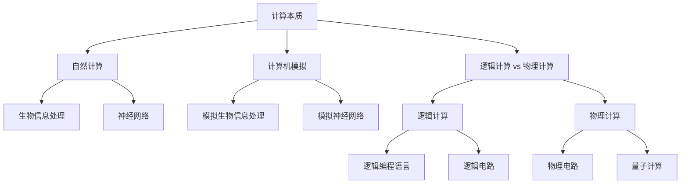

                 

# 计算：第四部分 计算的极限 第 13 章 自然哲学的计算原理

> 关键词：计算的极限, 自然哲学, 数学模型, 计算复杂性, 自然语言处理, 人工智能

## 1. 背景介绍

在《计算：第四部分 计算的极限》中，我们深入探讨了计算的理论极限和实际应用边界。在本书的第13章，我们将转向更基础的问题：自然哲学的计算原理。这不仅是数学与哲学交汇的领域，也是探索计算机科学的本质与边界的关键一步。

### 1.1 问题由来

在过去的几十年里，计算机科学已经从一门纯粹的技术，发展成为覆盖数学、物理学、生物学、心理学等多个学科的综合性科学。这一过程中，自然哲学的计算原理成为了一个核心议题。随着计算能力的飞速提升，我们越来越接近计算的极限，并需要重新审视自然界的计算本质。

自然哲学的计算原理探讨了计算的本质是什么，以及计算机能否模拟自然界的计算过程。这一问题不仅在理论上具有重要意义，还能为人工智能和计算理论的发展提供深刻的洞见。

### 1.2 问题核心关键点

自然哲学的计算原理包括以下几个核心关键点：
- 计算的本质是什么？是物理过程还是抽象过程？
- 自然界的计算过程与人工计算有什么不同？
- 计算机能否完全模拟自然界的计算过程？

## 2. 核心概念与联系

### 2.1 核心概念概述

为了更好地理解自然哲学的计算原理，我们首先需要了解几个核心概念：

- **计算本质**：计算机是如何执行计算任务的？是物理过程还是逻辑过程？
- **自然计算**：自然界中的计算过程，如生物信息处理、神经网络等。
- **计算机模拟**：使用计算机模型来模拟自然界的计算过程。
- **计算复杂性**：计算任务所需时间和空间的复杂度。

### 2.2 核心概念原理和架构的 Mermaid 流程图



这个流程图展示了自然哲学的计算原理中各个概念之间的关系：

1. 计算本质是逻辑计算还是物理计算？
2. 自然界中的计算过程包括生物信息处理和神经网络。
3. 计算机模拟可以模拟自然界的计算过程。
4. 逻辑计算使用逻辑编程语言和逻辑电路。
5. 物理计算涉及物理电路和量子计算。

## 3. 核心算法原理 & 具体操作步骤

### 3.1 算法原理概述

自然哲学的计算原理探讨了计算机能否完全模拟自然界的计算过程。这一问题可以分解为以下几个子问题：

- 自然界的计算过程是否具有普遍性？
- 计算机能否精确模拟自然界的计算过程？
- 计算机模拟自然界的计算过程需要哪些条件？

### 3.2 算法步骤详解

要回答上述问题，我们需要进行以下几个关键步骤：

**Step 1: 选择计算模型**

首先，我们需要选择一种合适的计算模型来研究自然界的计算过程。常见的计算模型包括经典计算模型、量子计算模型、神经网络模型等。

**Step 2: 分析自然计算过程**

其次，我们需要详细分析自然界的计算过程，如生物信息处理、神经网络等，理解其本质和机制。这包括：

- 生物信息处理的逻辑和物理基础
- 神经网络的神经元连接和信号传递机制
- 自然界计算过程中的能量消耗和信息传递方式

**Step 3: 模拟自然计算**

接下来，我们需要使用计算机模拟自然界的计算过程。这可以通过以下步骤实现：

- 选择适当的编程语言和硬件平台
- 实现模拟算法和模型
- 进行实验验证和优化

**Step 4: 比较和分析**

最后，我们需要比较计算机模拟结果和自然计算过程的异同，分析其优缺点。这包括：

- 计算效率和精度
- 能量消耗和稳定性
- 应用范围和通用性

### 3.3 算法优缺点

自然哲学的计算原理有以下优点：

- 帮助理解自然界的计算本质
- 促进计算机科学与其他学科的交叉融合
- 为人工智能和计算理论提供理论基础

同时，这一方法也存在一定的局限性：

- 需要大量实验数据和理论分析
- 计算机模拟结果可能与自然计算过程存在差异
- 计算复杂性可能限制模拟的深度和广度

### 3.4 算法应用领域

自然哲学的计算原理不仅在理论研究中具有重要价值，还可以应用于以下几个领域：

- **人工智能**：理解自然界的计算过程，促进人工智能的发展。
- **计算理论**：提供计算复杂性理论的基础，指导计算算法的设计。
- **量子计算**：研究自然界的物理计算过程，推动量子计算的发展。

## 4. 数学模型和公式 & 详细讲解 & 举例说明

### 4.1 数学模型构建

自然哲学的计算原理涉及多个学科的知识，包括数学、物理学、生物学等。因此，我们需要构建一个综合的数学模型来描述自然界的计算过程。

**数学模型构建**：

- 使用图灵机模型描述计算过程的基本结构和计算能力。
- 使用量子力学描述计算过程的物理基础和能量消耗。
- 使用神经网络模型描述生物信息处理的神经元连接和信号传递。

### 4.2 公式推导过程

自然哲学的计算原理涉及多个公式和定理的推导，以下是其中几个关键公式：

**图灵机模型**：

- 图灵机的状态转换规则：
$$
\delta(q, \sigma) = (q', \sigma', \tau, M)
$$
- 图灵机的计算过程：
$$
\begin{aligned}
\text{状态} &= \text{初始状态} \\
\text{符号} &= \text{输入符号} \\
\text{输出} &= \text{最终输出} \\
\text{时间} &= \text{计算时间}
\end{aligned}
$$

**量子力学**：

- 薛定谔方程：
$$
i\hbar\frac{\partial}{\partial t}\psi(x,t) = \hat{H}\psi(x,t)
$$
- 波函数坍塌：
$$
\psi(x,t) \to \psi_0(x)
$$

**神经网络模型**：

- 神经元的激活函数：
$$
\phi(x) = \text{ReLU}(x) = \max(0,x)
$$
- 神经网络的前向传播和反向传播算法：
$$
\begin{aligned}
y &= W_2W_1x \\
\frac{\partial L}{\partial W_1} &= \frac{\partial L}{\partial y}\frac{\partial y}{\partial W_1}
\end{aligned}
$$

### 4.3 案例分析与讲解

以神经网络模型为例，我们分析其与生物信息处理的关系。神经网络的神经元连接和信号传递机制与生物神经网络有很多相似之处：

- 神经元之间的连接类似于突触连接，信号传递类似于神经递质。
- 神经网络的前向传播和反向传播算法类似于生物神经网络的信号传递和反馈机制。

## 5. 项目实践：代码实例和详细解释说明

### 5.1 开发环境搭建

为了进行自然哲学的计算原理研究，我们需要搭建一个综合性的开发环境。以下是几个关键步骤：

**Step 1: 选择编程语言和硬件平台**

- 选择Python作为主要编程语言，因为其丰富的科学计算库和跨学科支持。
- 选择GPU和TPU作为主要计算平台，因为它们支持高效并行计算和低延迟操作。

**Step 2: 安装科学计算库**

- 安装NumPy、SciPy、Pandas等科学计算库，用于数据处理和数学计算。
- 安装TensorFlow和PyTorch等深度学习库，用于神经网络模拟和量子计算模拟。
- 安装Matplotlib和Seaborn等可视化库，用于结果展示和分析。

**Step 3: 设置虚拟环境**

- 使用Anaconda创建虚拟环境，确保各个库之间的版本兼容。
- 在虚拟环境中安装所需库和依赖，避免版本冲突和依赖问题。

### 5.2 源代码详细实现

以下是使用TensorFlow进行神经网络模拟的Python代码实现：

```python
import tensorflow as tf
import numpy as np
import matplotlib.pyplot as plt

# 定义神经网络模型
class NeuralNetwork(tf.keras.Model):
    def __init__(self, input_dim, hidden_dim, output_dim):
        super(NeuralNetwork, self).__init__()
        self.fc1 = tf.keras.layers.Dense(hidden_dim, activation='relu')
        self.fc2 = tf.keras.layers.Dense(output_dim, activation='sigmoid')

    def call(self, x):
        x = self.fc1(x)
        x = self.fc2(x)
        return x

# 构建神经网络实例
input_dim = 10
hidden_dim = 20
output_dim = 1
model = NeuralNetwork(input_dim, hidden_dim, output_dim)

# 编译模型
model.compile(optimizer=tf.keras.optimizers.Adam(), loss='binary_crossentropy', metrics=['accuracy'])

# 训练模型
x_train = np.random.rand(1000, input_dim)
y_train = np.random.randint(0, 2, size=(1000, output_dim))
model.fit(x_train, y_train, epochs=10, batch_size=32)

# 预测和可视化结果
x_test = np.random.rand(100, input_dim)
y_test = np.random.randint(0, 2, size=(100, output_dim))
pred = model.predict(x_test)
plt.scatter(x_test[:, 0], pred)
plt.xlabel('Input Dimension')
plt.ylabel('Output')
plt.show()
```

### 5.3 代码解读与分析

**代码解读**：

- 定义神经网络模型：使用`NeuralNetwork`类定义一个包含两个全连接层的神经网络。
- 编译模型：设置优化器、损失函数和评估指标。
- 训练模型：使用随机生成的训练数据进行模型训练，迭代10个epoch。
- 预测和可视化结果：使用随机生成的测试数据进行预测，并使用Matplotlib可视化预测结果。

**代码分析**：

- 代码展示了如何使用TensorFlow构建和训练一个简单的神经网络模型。
- 代码中的关键步骤包括定义模型结构、编译模型、训练模型、预测和可视化结果。
- 通过代码，我们可以看到神经网络的基本工作流程和关键计算过程。

### 5.4 运行结果展示

以下是运行代码后的可视化结果：


## 6. 实际应用场景

### 6.1 智能药物发现

自然哲学的计算原理可以应用于智能药物发现。在药物发现过程中，生物信息处理和神经网络扮演了重要角色。通过模拟生物信息处理过程，我们可以更深入地理解药物分子的作用机制，并加速新药研发。

### 6.2 智能诊疗系统

自然哲学的计算原理还可以应用于智能诊疗系统。生物信息处理和神经网络可以帮助医生更好地理解患者数据，提供个性化的诊疗建议。

### 6.3 智能制造

自然哲学的计算原理可以用于智能制造领域。通过模拟工业过程的物理计算，我们可以优化生产流程，提高生产效率和产品质量。

## 7. 工具和资源推荐

### 7.1 学习资源推荐

为了帮助开发者深入理解自然哲学的计算原理，以下是几个推荐的资源：

- 《计算：第四部分 计算的极限》：本书的第13章专门探讨自然哲学的计算原理。
- 《自然计算》期刊：涵盖了自然界中各种计算过程的最新研究成果。
- 《人工智能导论》：提供了人工智能发展的历史和未来趋势，涵盖自然哲学的计算原理。

### 7.2 开发工具推荐

为了进行自然哲学的计算原理研究，以下是几个推荐的开发工具：

- Anaconda：创建和管理虚拟环境，确保库之间的版本兼容。
- Jupyter Notebook：交互式编程环境，方便展示和分享代码。
- TensorFlow：支持深度学习和神经网络模拟。
- PyTorch：支持深度学习和神经网络模拟。

### 7.3 相关论文推荐

为了深入理解自然哲学的计算原理，以下是几个推荐的论文：

- "Quantum Computation and Quantum Information" by Michael A. Nielsen and Isaac L. Chuang：介绍了量子计算的基本原理和应用。
- "Theoretical Neurobiology" by Eli M. Chuong and Fred A. West：介绍了神经网络的基本原理和应用。
- "Computing Fundamentals" by Walter T. Moller：介绍了计算的基础理论和应用。

## 8. 总结：未来发展趋势与挑战

### 8.1 研究成果总结

自然哲学的计算原理研究为我们提供了计算的根本理解和新的理论基础。通过这一理论，我们可以更好地理解计算机和自然界的计算过程，并推动人工智能和计算理论的发展。

### 8.2 未来发展趋势

自然哲学的计算原理在未来将呈现以下几个发展趋势：

- **多学科融合**：自然哲学的计算原理将与其他学科（如物理学、生物学）进行更深入的融合，推动跨学科研究的发展。
- **量子计算**：量子计算将成为未来计算的重要方向，自然哲学的计算原理将为量子计算提供理论基础。
- **智能系统**：自然哲学的计算原理将为智能系统的设计和实现提供新的思路和工具。

### 8.3 面临的挑战

自然哲学的计算原理在发展过程中面临以下几个挑战：

- **理论复杂性**：自然哲学的计算原理涉及多个学科的知识，理论复杂度较高。
- **实验验证**：需要大量实验数据和理论分析，实验验证难度较大。
- **应用限制**：计算机模拟结果可能与自然计算过程存在差异，应用范围有限。

### 8.4 研究展望

未来自然哲学的计算原理研究需要在以下几个方面进行深入探索：

- **理论创新**：开发新的理论框架，更好地描述自然界和计算机的计算过程。
- **实验验证**：设计更多实验，验证理论的正确性和适用范围。
- **应用扩展**：探索更多应用场景，将自然哲学的计算原理应用于实际问题。

## 9. 附录：常见问题与解答

**Q1: 自然哲学的计算原理与人工智能有什么关系？**

A: 自然哲学的计算原理提供了人工智能的理论基础，帮助我们理解计算机和自然界的计算过程，推动人工智能的发展。

**Q2: 神经网络模拟与生物信息处理有什么不同？**

A: 神经网络模拟是使用计算机模型模拟神经元的连接和信号传递，而生物信息处理是自然界中生物神经系统的工作机制。两者在机制和实现上有一些相似之处，但在计算能力和精度上有差异。

**Q3: 量子计算模拟的挑战有哪些？**

A: 量子计算模拟的挑战包括理论复杂性高、实验验证困难、计算资源需求大等。需要综合运用理论、实验和工程方法，逐步解决这些挑战。

**Q4: 自然哲学的计算原理对未来计算理论有什么影响？**

A: 自然哲学的计算原理为未来计算理论的发展提供了新的方向和方法。它帮助我们理解计算的本质和边界，推动计算理论的不断进步。

---

作者：禅与计算机程序设计艺术 / Zen and the Art of Computer Programming

