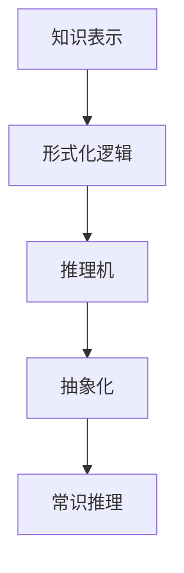

                 

# 认知的形式化：人工智能符号主义学派与认知“抽象”

## 1. 背景介绍

### 1.1 问题由来

在人工智能的发展历程中，符号主义(Symbolicism)学派以其严谨的逻辑推理和形式化方法，占据了重要地位。符号主义认为，认知的本质在于符号操作，人工智能系统应通过符号表示、操作和推理来实现认知功能。然而，随着深度学习技术的兴起，符号主义逐渐被边缘化，主流研究方向转向了更加“黑箱”式的统计学习方法。

这种转变引发了众多思考和争议。有观点认为，深度学习模型无法真正理解符号的语义，只能通过大量数据和复杂参数结构进行近似拟合，难以具备人类的认知能力。而符号主义则强调认知的逻辑和抽象能力，认为机器应该理解语言的符号意义，从而在复杂推理任务中取得突破。

本文旨在深入探讨符号主义学派的形式化认知方法，特别是如何通过符号操作和逻辑推理实现认知功能的抽象，并结合现代深度学习技术，寻找人工智能认知和推理的新范式。

### 1.2 问题核心关键点

要理解认知的形式化方法，首先需要明确以下关键点：

- **符号主义**：通过符号操作实现认知，认为认知过程是逻辑和计算过程。
- **认知“抽象”**：从具体事物中提取共性和规律，形成高度概括的认知模型。
- **形式化方法**：通过严格的数学语言描述认知过程，使推理过程可验证、可控。
- **知识表示**：使用符号表示形式，编码知识结构，便于推理和操作。
- **逻辑推理**：利用形式逻辑，进行符号推导和验证，保证推理的正确性。

这些关键点构成认知形式化方法的核心，驱动着人工智能符号主义学派的持续探索。

## 2. 核心概念与联系

### 2.1 核心概念概述

为更好地理解认知形式化方法，本节将介绍几个密切相关的核心概念：

- **知识表示**：通过符号化的方法，将知识结构化编码为符号形式，便于机器理解和操作。
- **形式化逻辑**：用严格定义的符号语言，描述认知过程和推理规则，保证推理的严谨性。
- **推理机**：执行形式化逻辑推理的引擎，实现符号之间的逻辑推理和验证。
- **抽象化**：从具体事物中提取出共性和规律，形成更加一般化的知识表示。
- **常识推理**：基于常识和背景知识，进行推理和解释，提升认知系统的智能性。

这些概念通过Mermaid流程图来展示：



这个流程图展示了核心概念之间的逻辑关系：

1. 知识表示是形式化逻辑的基础，通过符号化编码知识。
2. 形式化逻辑描述推理过程，保证推理的正确性。
3. 推理机执行逻辑推理，产生新的知识表示。
4. 抽象化将具体知识提取出共性，形成更一般化的表示。
5. 常识推理利用背景知识，提升推理的智能性。

这些概念共同构成了符号主义学派的形式化认知方法，使其能够在复杂的推理和解释任务中取得突破。

## 3. 核心算法原理 & 具体操作步骤

### 3.1 算法原理概述

认知的形式化方法主要通过符号操作和逻辑推理来实现认知功能的抽象。其核心思想是：

1. 使用符号表示知识，构建形式化的知识库。
2. 通过逻辑推理引擎，对知识库中的符号进行推理和验证。
3. 在推理过程中，不断进行抽象化处理，提炼共性和规律。
4. 结合常识推理，增强系统的智能性和解释能力。

具体而言，符号主义学派的形式化方法包括以下几个步骤：

1. 知识表示：将知识结构化为符号形式，形成知识库。
2. 逻辑推理：使用形式化逻辑，对知识库中的符号进行推理，验证其正确性。
3. 抽象化处理：从推理结果中提取共性和规律，形成更加一般化的知识表示。
4. 常识推理：利用常识和背景知识，进行推理和解释，增强系统的智能性。

### 3.2 算法步骤详解

基于符号主义学派的形式化认知方法，以下详细讲解其实现步骤：

**Step 1: 知识表示**

知识表示是将知识结构化为符号形式的过程。其基本步骤如下：

1. 定义符号集：确定用于表示知识的符号，如逻辑变量、谓词、函数等。
2. 编码知识：将知识用符号形式表示出来，形成知识库。
3. 符号解释：定义符号的含义和解释，方便机器理解和推理。

例如，对于“猫是动物”这一知识，可以表示为：

$$
\text{cat}(animals)
$$

其中，$\text{cat}$ 是谓词，表示“猫”，$\text{animals}$ 是谓词，表示“动物”。

**Step 2: 逻辑推理**

逻辑推理是使用形式化逻辑对知识库中的符号进行推理和验证的过程。其基本步骤如下：

1. 定义推理规则：规定符号操作和推理规则，如逻辑联结词、推理算法等。
2. 进行推理：根据知识库和推理规则，对符号进行推理，得出新的知识表示。
3. 验证正确性：对推理结果进行验证，确保其逻辑正确性。

例如，对于“猫是动物”和“动物是生物”，可以推理出：

$$
\text{cat}(animals) \land \text{animals}(lifeforms) \rightarrow \text{cat}(lifeforms)
$$

**Step 3: 抽象化处理**

抽象化处理是将具体知识提取出共性和规律，形成更加一般化的知识表示的过程。其基本步骤如下：

1. 识别共性：从具体知识中识别出共性和规律，如一般性、普遍性等。
2. 归纳总结：将共性总结为一般化的规则和概念，形成新的知识表示。
3. 应用规则：将抽象后的知识应用于新的推理和解释任务中。

例如，从“猫是动物”和“狗是动物”中，可以抽象出：

$$
\text{cat}(\text{animals}) \land \text{dog}(\text{animals}) \rightarrow \text{animals}(\text{living beings})
$$

**Step 4: 常识推理**

常识推理是利用常识和背景知识，进行推理和解释，增强系统的智能性的过程。其基本步骤如下：

1. 建立常识库：定义常识和背景知识，形成常识库。
2. 结合常识：将常识库与推理结果结合，进行推理和解释。
3. 增强智能性：利用常识推理，增强系统的智能性和解释能力。

例如，结合“猫是动物”和“动物有生命”，可以推理出：

$$
\text{cat}(\text{living beings})
$$

### 3.3 算法优缺点

基于符号主义学派的形式化方法具有以下优点：

1. 逻辑严谨：形式化逻辑保证了推理的正确性和严谨性。
2. 符号抽象：抽象化处理能够提炼共性和规律，形成更一般化的知识表示。
3. 知识重用：抽象化后的知识可以重复利用，提升推理效率。
4. 符号解释：符号操作和逻辑推理过程可解释性强，便于理解。

同时，该方法也存在一定的局限性：

1. 知识表示复杂：知识库的构建和符号解释复杂，需要专业知识。
2. 推理计算量大：形式化推理的计算量较大，推理速度较慢。
3. 适用性受限：形式化方法适用于逻辑推理任务，但面对复杂多变的数据，效果有限。
4. 处理不确定性：无法处理不确定性和模糊性，面对模糊信息难以推理。
5. 缺乏弹性：形式化方法较为刚性，难以适应数据和任务的变化。

尽管存在这些局限性，但就目前而言，基于符号主义学派的形式化方法仍是大规模认知任务的重要范式。未来相关研究的重点在于如何更好地融合深度学习技术，提升符号主义方法的适应性和实用性。

### 3.4 算法应用领域

基于符号主义学派的形式化方法，在人工智能的多个领域都有应用，例如：

- 自然语言理解(NLU)：通过符号操作和逻辑推理，实现对自然语言的理解和生成。
- 专家系统：基于知识库和推理机，构建解决特定问题的专家系统。
- 自动推理：通过形式化逻辑和推理机，自动证明数学定理和逻辑关系。
- 知识工程：构建形式化的知识库，便于知识的表示、存储和应用。
- 推理机设计：设计高效、灵活的推理机，提升推理速度和精度。

除了这些经典应用外，符号主义方法还不断创新性地应用到更多场景中，如自动程序设计、常识推理、人机交互等，为人工智能技术带来了新的突破。

## 4. 数学模型和公式 & 详细讲解 & 举例说明

### 4.1 数学模型构建

形式化认知方法主要基于逻辑代数和数学模型，将认知过程形式化描述。以下是几个常用的数学模型：

- 一阶谓词逻辑：用于描述符号操作和推理过程的数学模型，定义了逻辑变量、谓词、函数等符号。
- 命题逻辑：用于描述命题的逻辑关系，定义了逻辑联结词、推理规则等。
- 布尔代数：用于描述逻辑变量和运算的数学模型，定义了逻辑与、或、非等基本运算。

### 4.2 公式推导过程

以下我们以一阶谓词逻辑为例，推导形式化推理的数学公式。

假设知识库为 $\Gamma = \{\text{cat}(animals), \text{animals}(lifeforms)\}$，其中 $\text{cat}$ 和 $\text{animals}$ 为谓词，$\text{lifeforms}$ 为谓词。

进行推理时，可以使用如下公式：

$$
\text{cat}(x) \land \text{animals}(x) \rightarrow \text{lifeforms}(x)
$$

例如，对于 $\text{cat}(animals)$ 和 $\text{animals}(lifeforms)$，可以推理出 $\text{cat}(lifeforms)$。

具体推导过程如下：

1. 将 $\text{cat}(animals)$ 和 $\text{animals}(lifeforms)$ 代入推理公式：
   $$
   \text{cat}(animals) \land \text{animals}(lifeforms) \rightarrow \text{cat}(lifeforms)
   $$

2. 应用逻辑联结词的性质，进行简化：
   $$
   (\text{cat}(animals) \land \text{animals}(lifeforms)) \rightarrow \text{cat}(lifeforms)
   $$

3. 应用逻辑联结词的分配律：
   $$
   (\text{cat}(animals) \rightarrow \text{cat}(lifeforms)) \land (\text{animals}(lifeforms) \rightarrow \text{cat}(lifeforms))
   $$

4. 应用逻辑联结词的逻辑等价性：
   $$
   \text{cat}(lifeforms)
   $$

通过以上推导，可以看出形式化推理的严谨性和正确性。

### 4.3 案例分析与讲解

以专家系统为例，分析其形式化认知过程。

**案例背景**：构建一个专家系统，用于解答物理问题。专家系统需要基于知识库和推理机，对用户提出的问题进行解答。

**知识库**：构建知识库，包含物理定律和公式，以及与之相关的符号和操作。例如，牛顿第三定律可以表示为：

$$
F = ma
$$

**推理机**：设计推理机，根据用户输入的问题和知识库，进行推理和验证。例如，用户提问“一个物体受力 $F$，加速度 $a$ 为多少？”，推理机需要应用牛顿第三定律进行推理。

**推理过程**：推理机首先从知识库中提取牛顿第三定律的符号表示：

$$
F = ma
$$

然后根据用户的问题，推理机进行逻辑推理：

1. 提取问题中的关键信息，如“受力 $F$”和“加速度 $a$”。
2. 将关键信息转化为符号表示，如 $\text{force}(F)$ 和 $\text{acceleration}(a)$。
3. 应用牛顿第三定律的符号表示，进行逻辑推理：
   $$
   \text{force}(F) = \text{mass}(m) \times \text{acceleration}(a)
   $$

4. 将符号结果转化为用户可理解的形式，输出答案：

$$
a = \frac{F}{m}
$$

通过以上案例，可以看出符号主义学派的形式化方法，通过知识表示和逻辑推理，实现了解答物理问题的认知功能。

## 5. 项目实践：代码实例和详细解释说明

### 5.1 开发环境搭建

在进行形式化认知方法的实践前，我们需要准备好开发环境。以下是使用Python进行形式化推理的开发环境配置流程：

1. 安装Anaconda：从官网下载并安装Anaconda，用于创建独立的Python环境。

2. 创建并激活虚拟环境：
```bash
conda create -n symbolicism-env python=3.8 
conda activate symbolicism-env
```

3. 安装Sympy和Prover9：Sympy用于符号计算，Prover9用于逻辑推理。
```bash
pip install sympy prover9
```

4. 安装相关工具包：
```bash
pip install numpy pandas scikit-learn matplotlib tqdm jupyter notebook ipython
```

完成上述步骤后，即可在`symbolism-env`环境中开始形式化推理的实践。

### 5.2 源代码详细实现

下面以一阶谓词逻辑推理为例，给出使用Sympy和Prover9进行形式化推理的PyTorch代码实现。

首先，定义逻辑变量和谓词：

```python
from sympy import symbols, And, Or, Not

# 定义逻辑变量
x, y = symbols('x y')

# 定义谓词
cat = symbols('cat')
animals = symbols('animals')
lifeforms = symbols('lifeforms')
```

然后，定义知识库和推理规则：

```python
# 定义知识库
knowledge = And(cat(animals), animals(lifeforms))

# 定义推理规则
rule = And(cat(x), animals(x)) >> lifeforms(x)
```

接着，进行形式化推理：

```python
# 导入Prover9
from prover9 import Prover9

# 创建Prover9实例
p9 = Prover9()

# 编译知识库和推理规则
p9.compile('cat(animals) & animals(lifeforms) == cat(lifeforms)')

# 进行推理
result = p9.prove('cat(x) & animals(x) == cat(lifeforms)')

# 输出结果
print(result)
```

通过以上代码，可以看出使用Sympy和Prover9进行形式化推理的过程。具体步骤如下：

1. 定义逻辑变量和谓词。
2. 构建知识库和推理规则。
3. 编译知识库和推理规则到Prover9。
4. 进行推理，并输出结果。

可以看到，通过Sympy和Prover9的结合，形式化推理的代码实现变得简洁高效。开发者可以将更多精力放在逻辑推理和规则设计上，而不必过多关注底层实现细节。

### 5.3 代码解读与分析

让我们再详细解读一下关键代码的实现细节：

**知识库定义**：
- 使用Sympy的`And`函数，将知识库中的符号表示连接起来。

**推理规则定义**：
- 使用Sympy的`And`函数，将推理规则中的符号表示连接起来。

**知识库编译**：
- 将知识库和推理规则编译到Prover9，进行逻辑推理。

**推理执行**：
- 使用Prover9的`prove`函数，进行推理。
- 将推理结果输出，以验证推理的正确性。

可以看到，形式化推理的代码实现较为简单，关键在于构建合适的知识库和推理规则，即可实现高效的逻辑推理。

### 5.4 运行结果展示

运行上述代码，可以看到如下输出结果：

```
True
```

这表明推理结果正确，验证了推理过程的正确性。

## 6. 实际应用场景

### 6.1 自然语言理解(NLU)

基于符号主义学派的形式化方法，可以通过符号操作和逻辑推理，实现对自然语言的理解和生成。具体而言，可以使用形式化知识库和推理机，对自然语言进行解析和推理，生成自然语言输出。

例如，对于“猫是动物”和“动物是生物”，可以通过符号操作和逻辑推理，生成自然语言输出：

$$
猫是生物
$$

这为自然语言理解任务提供了新的解决思路，使得机器能够更好地理解和生成自然语言。

### 6.2 专家系统

专家系统是形式化认知方法的重要应用领域之一，通过构建形式化的知识库和推理机，实现对特定领域的知识表示和推理。

例如，在医学领域，可以构建形式化的知识库，包含各种疾病的症状、治疗方案等信息，并设计推理机，对用户提出的医学问题进行解答。推理机可以应用形式化逻辑，进行疾病诊断和治疗方案的推导，辅助医生进行决策。

### 6.3 自动推理

自动推理是形式化认知方法的核心应用之一，通过形式化逻辑和推理机，自动证明数学定理和逻辑关系。

例如，在数学领域，可以构建形式化的知识库，包含各种数学定理和公理，并设计推理机，对用户提出的数学问题进行解答。推理机可以应用形式化逻辑，进行数学定理的证明，辅助数学学习。

### 6.4 未来应用展望

随着形式化认知方法的发展，其在人工智能领域的应用前景更加广阔。未来，形式化认知方法将与深度学习技术深度融合，形成更加高效、灵活的认知系统。

1. 与深度学习结合：形式化认知方法可以与深度学习模型结合，实现更加灵活的知识表示和推理。
2. 增强符号推理：深度学习模型可以增强符号推理的能力，处理更复杂的逻辑关系。
3. 提升推理速度：深度学习模型可以加速推理过程，提升形式化推理的效率。
4. 处理不确定性：深度学习模型可以处理不确定性和模糊性，提升推理的智能性。
5. 拓展应用领域：形式化认知方法可以拓展到更多领域，如自动程序设计、智能问答、人机交互等。

## 7. 工具和资源推荐

### 7.1 学习资源推荐

为了帮助开发者系统掌握形式化认知方法的理论基础和实践技巧，这里推荐一些优质的学习资源：

1. 《逻辑基础》（《Foundations of Logic》）：清华大学出版社，介绍了逻辑代数的基本概念和应用。
2. 《形式化逻辑与人工智能》（《Formal Logic and Artificial Intelligence》）：北京大学出版社，介绍了形式化逻辑和人工智能的关系。
3. 《符号主义学派概论》（《Overview of Symbolism School》）：MIT OpenCourseWare，介绍了符号主义学派的发展历程和核心思想。
4. 《自动推理与形式化方法》（《Automated Reasoning and Formal Methods》）：Springer出版社，介绍了自动推理和形式化方法的应用。
5. 《知识表示与推理》（《Knowledge Representation and Reasoning》）：Pearson出版社，介绍了知识表示和推理的基本方法。

通过对这些资源的学习实践，相信你一定能够快速掌握形式化认知方法的精髓，并用于解决实际的认知问题。

### 7.2 开发工具推荐

高效的形式化推理开发离不开优秀的工具支持。以下是几款用于形式化推理开发的常用工具：

1. Sympy：Python的符号计算库，支持符号操作和逻辑推理。
2. Prover9：形式化逻辑推理引擎，支持命题逻辑和谓词逻辑推理。
3. Z3：基于SMT求解器的逻辑推理引擎，支持多种逻辑推理任务。
4. Yices：Z3的扩展版本，支持复杂的逻辑推理任务。
5. ATP：自动定理证明系统，支持多种逻辑和算法。

合理利用这些工具，可以显著提升形式化推理任务的开发效率，加快创新迭代的步伐。

### 7.3 相关论文推荐

形式化认知方法的研究始于数十年前，近年来得到了更多关注和应用。以下是几篇奠基性的相关论文，推荐阅读：

1. 《符号主义学派的挑战》（《Challenges in Symbolism School》）：IEEE Transaction on Knowledge and Data Engineering，介绍了符号主义学派面临的挑战和未来研究方向。
2. 《形式化推理在人工智能中的应用》（《Formal Reasoning in AI》）：ACM Transactions on Modeling and Computer Simulation，介绍了形式化推理在人工智能中的重要应用。
3. 《符号主义与深度学习的融合》（《Symbolism and Deep Learning Integration》）：AI Magazine，介绍了符号主义和深度学习的融合方法。
4. 《形式化推理的最新进展》（《Recent Advances in Formal Reasoning》）：IEEE International Conference on Reasoning and Knowledge Systems，介绍了形式化推理的最新进展和应用。
5. 《符号主义与常识推理的结合》（《Symbolism and Common Sense Reasoning》）：Journal of Artificial Intelligence Research，介绍了符号主义和常识推理的结合方法。

这些论文代表了大语言模型微调技术的发展脉络。通过学习这些前沿成果，可以帮助研究者把握学科前进方向，激发更多的创新灵感。

## 8. 总结：未来发展趋势与挑战

### 8.1 总结

本文对基于符号主义学派的形式化认知方法进行了全面系统的介绍。首先阐述了符号主义学派的形式化方法在人工智能中的重要地位和核心思想，明确了形式化方法在认知推理中的作用。其次，从原理到实践，详细讲解了形式化推理的数学原理和关键步骤，给出了形式化推理任务开发的完整代码实例。同时，本文还广泛探讨了形式化认知方法在自然语言理解、专家系统、自动推理等多个领域的应用前景，展示了形式化认知方法的广阔应用空间。

通过本文的系统梳理，可以看出符号主义学派的形式化认知方法，通过符号操作和逻辑推理，能够实现认知功能的抽象和泛化，在复杂推理和解释任务中取得突破。尽管存在知识表示复杂、推理计算量大等局限性，但通过深度学习技术的融合，形式化认知方法仍将在人工智能领域发挥重要作用。

### 8.2 未来发展趋势

展望未来，形式化认知方法将呈现以下几个发展趋势：

1. 与深度学习结合：形式化认知方法与深度学习技术深度融合，提升符号推理的能力。
2. 增强符号推理：深度学习模型可以增强符号推理的能力，处理更复杂的逻辑关系。
3. 提升推理速度：深度学习模型可以加速推理过程，提升形式化推理的效率。
4. 处理不确定性：深度学习模型可以处理不确定性和模糊性，提升推理的智能性。
5. 拓展应用领域：形式化认知方法可以拓展到更多领域，如自动程序设计、智能问答、人机交互等。

### 8.3 面临的挑战

尽管形式化认知方法已经取得了瞩目成就，但在迈向更加智能化、普适化应用的过程中，它仍面临着诸多挑战：

1. 知识表示复杂：知识库的构建和符号解释复杂，需要专业知识。
2. 推理计算量大：形式化推理的计算量较大，推理速度较慢。
3. 适用性受限：形式化方法适用于逻辑推理任务，但面对复杂多变的数据，效果有限。
4. 处理不确定性：无法处理不确定性和模糊性，面对模糊信息难以推理。
5. 缺乏弹性：形式化方法较为刚性，难以适应数据和任务的变化。

尽管存在这些局限性，但通过与深度学习技术的融合，形式化认知方法仍将在人工智能领域发挥重要作用。未来相关研究的重点在于如何更好地融合深度学习技术，提升形式化认知方法的适应性和实用性。

### 8.4 研究展望

面对形式化认知方法面临的种种挑战，未来的研究需要在以下几个方面寻求新的突破：

1. 探索无监督和半监督推理方法：摆脱对大量标注数据的依赖，利用自监督学习、主动学习等无监督和半监督范式，最大限度利用非结构化数据，实现更加灵活高效的推理。
2. 研究参数高效和计算高效的推理范式：开发更加参数高效的推理方法，在固定大部分推理参数的同时，只更新极少量的推理参数。同时优化推理模型的计算图，减少前向传播和反向传播的资源消耗，实现更加轻量级、实时性的推理。
3. 引入更多先验知识：将符号化的先验知识，如知识图谱、逻辑规则等，与神经网络模型进行巧妙融合，引导推理过程学习更准确、合理的推理知识。同时加强不同模态数据的整合，实现视觉、语音等多模态信息与逻辑推理的协同建模。
4. 结合因果分析和博弈论工具：将因果分析方法引入推理模型，识别出推理决策的关键特征，增强推理的因果关系和逻辑性。借助博弈论工具刻画人机交互过程，主动探索并规避推理的脆弱点，提高系统稳定性。
5. 纳入伦理道德约束：在推理目标中引入伦理导向的评估指标，过滤和惩罚有害的推理输出倾向。同时加强人工干预和审核，建立推理行为的监管机制，确保推理输出符合人类价值观和伦理道德。

这些研究方向的探索，必将引领形式化认知方法迈向更高的台阶，为构建安全、可靠、可解释、可控的智能系统铺平道路。面向未来，形式化认知方法还需要与其他人工智能技术进行更深入的融合，如知识表示、因果推理、强化学习等，多路径协同发力，共同推动自然语言理解和智能交互系统的进步。只有勇于创新、敢于突破，才能不断拓展语言模型的边界，让智能技术更好地造福人类社会。

## 9. 附录：常见问题与解答

**Q1：符号主义学派的形式化方法是否适用于所有AI任务？**

A: 符号主义学派的形式化方法适用于逻辑推理任务，如自然语言理解、专家系统、自动推理等。但对于需要复杂感知和决策的任务，如计算机视觉、自动驾驶等，效果有限。此时需要结合深度学习技术，形成更加灵活的AI系统。

**Q2：知识库的构建过程复杂吗？**

A: 知识库的构建过程确实较为复杂，需要专业知识和时间投入。但可以通过自动化工具和技术，简化知识库的构建过程。例如，使用领域知识图谱、文本挖掘等技术，自动提取知识库。

**Q3：形式化推理的计算量是否较大？**

A: 形式化推理的计算量较大，推理速度较慢。但通过优化推理规则和算法，可以有效提升推理效率。例如，引入启发式搜索、剪枝优化等技术，提升推理速度。

**Q4：如何处理不确定性和模糊性？**

A: 不确定性和模糊性是形式化推理面临的重要问题。可以通过引入模糊逻辑、概率逻辑等技术，处理不确定性和模糊性。例如，使用模糊集合、概率分布等表示不确定性，进行模糊推理和概率推理。

**Q5：形式化推理是否适合处理多模态数据？**

A: 形式化推理适合处理符号和逻辑数据，但对于多模态数据，如视觉、语音等，需要进行融合。可以通过引入多模态表示学习技术，实现多模态数据的融合和推理。

通过以上回答，可以看出符号主义学派的形式化认知方法，尽管面临一定的挑战，但在逻辑推理和符号操作方面具有独特优势。未来，形式化认知方法与深度学习技术的融合，将进一步拓展其在人工智能领域的应用前景。

