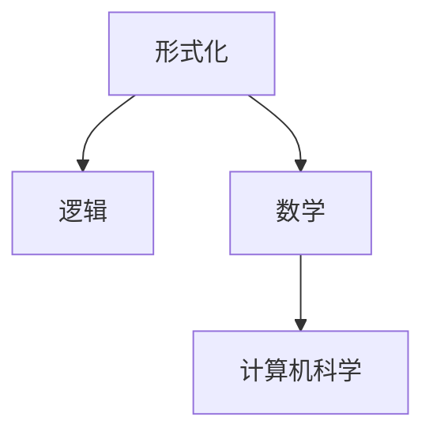

                 

## 1. 背景介绍

### 1.1 问题由来
早在远古时代，人类便开始思考“我是谁，我从哪里来，又到哪里去”等根本问题。从信仰、哲学到宗教，不同的文化提供了解答这些问题的方式。然而，人类对世界的认识始终局限于直观经验和主观感受，缺乏科学严谨的形式化表述。直到文艺复兴时期，数学的诞生为人类理性思维的深化提供了有力工具。

数学的诞生，使得人类首次能够使用形式化的符号和逻辑规则，去抽象地表达和推理现实世界的结构。这不仅大大提升了人类对自然界的理解，还为现代科学的发展奠定了基础。然而，数学并非万能的，它更多地是对现实世界的一种简化和抽象。正如爱因斯坦所言：“数学并不能解释所有，但除此之外，它什么也解释不了。”

## 2. 核心概念与联系

### 2.1 核心概念概述

为了更好地理解数学在形式化人类认知中的作用，我们将介绍几个核心概念：

- **形式化**（Formalization）：使用严格定义的符号和规则，将问题表述为数学模型，以便于推理和计算。形式化语言包括逻辑、代数、拓扑、图论等，涵盖从符号到理论的各个层次。

- **逻辑**（Logic）：研究形式化的推理规则和形式语言的学科，是数学和计算机科学的基础。经典逻辑包括命题逻辑、谓词逻辑等，其基本思想是利用符号和运算，在公理的基础上进行推理。

- **数学**（Mathematics）：以逻辑和形式化的方式研究数量、结构、变化和空间等概念的科学。数学通过形式化语言表达概念，以逻辑和推理为工具，揭示现实世界的本质规律。

- **计算机科学**（Computer Science）：将数学与计算机硬件和软件相结合，研究和实现计算方法和信息处理技术的学科。计算机科学的许多概念和算法，源自数学的抽象和形式化。

这些概念之间的逻辑关系可以通过以下Mermaid流程图来展示：



### 2.2 核心概念原理和架构

形式化数学的核心思想是使用严格定义的符号和规则，将问题抽象为数学模型，并通过逻辑推理来求解。这种形式化过程通常包括：

- **符号表征**：将现实世界中的对象和关系，抽象为数学符号，并定义这些符号的基本运算规则。
- **公理体系**：建立一组公理，这些公理是被接受的最初条件，用于推导其他命题。
- **推理规则**：定义逻辑推理的规则，如置换、递归、归纳等，用于从公理中推导出新的命题。
- **证明方法**：应用推理规则和逻辑规律，从公理出发证明某些命题的正确性或普遍性。

这些步骤构成了形式化数学的基本框架，允许人类在抽象层面上对问题进行建模和求解，从而揭示现实的本质规律。

## 3. 核心算法原理 & 具体操作步骤

### 3.1 算法原理概述

基于形式化数学的认知形式化，主要通过以下几个步骤：

- **符号化**：将现实问题转化为数学表达式。
- **逻辑推理**：应用推理规则，从公理推导出新的命题。
- **形式验证**：通过程序或证明器，对逻辑推理的正确性进行验证。

形式化数学的核心在于符号表征和逻辑推理。通过形式化，人类得以摆脱直观经验的局限，以抽象和理性的方式，深入理解现实世界的结构和规律。

### 3.2 算法步骤详解

1. **符号化**：将问题抽象为数学符号和表达式。例如，将二元关系“小于”符号化为$<$，将等式符号化为$=$。

2. **定义公理**：列出一组最基本的命题，作为数学系统的初始条件。例如，集合论中的公理包括外延性、幂集、分离公理等。

3. **引入推理规则**：定义逻辑推理的规则，如置换、递归、归纳等。例如，在自然数论中，引入递归规则，用数学归纳法证明命题。

4. **进行逻辑推理**：应用推理规则和公理，推导出新的命题。例如，在集合论中，应用公理和推理规则，推导出集合运算的结果。

5. **形式验证**：通过程序或证明器，对逻辑推理的正确性进行验证。例如，使用HOL（Higher-order Logic）等证明系统，验证数学定理的正确性。

### 3.3 算法优缺点

形式化数学的优点包括：

- **精确性**：形式化数学提供了一套严格定义的符号和规则，避免了直观经验的模糊性和主观性。
- **通用性**：形式化数学的符号和规则可以应用于各种问题的建模和求解，具有高度的通用性。
- **可验证性**：形式化数学提供了一套严格的验证方法，使得推导出的命题可以无歧义地被验证。

形式化数学的缺点包括：

- **复杂性**：形式化数学的符号和规则复杂，对于初学者来说，难以理解。
- **计算成本高**：形式化数学的验证通常需要高强度的计算资源和时间，对于大规模问题，效率较低。
- **抽象性**：形式化数学过于抽象，难以直接应用于现实世界。

尽管存在这些局限，形式化数学仍是人类理性思维的重要工具，极大地促进了数学、物理学、计算机科学等学科的发展。

### 3.4 算法应用领域

形式化数学广泛应用于以下领域：

- **数学**：形式化数学是数学的基础，广泛应用于数论、代数、几何、分析等领域。
- **计算机科学**：形式化数学是计算机科学的基础，广泛应用于算法、编程语言、软件工程等领域。
- **人工智能**：形式化数学是人工智能的基础，广泛应用于逻辑推理、知识表示、机器学习等领域。
- **物理学**：形式化数学是物理学的工具，广泛应用于量子力学、相对论、统计物理等领域。

## 4. 数学模型和公式 & 详细讲解 & 举例说明

### 4.1 数学模型构建

形式化数学的建模通常包括以下几个步骤：

- **抽象符号**：将现实问题抽象为数学符号。
- **公理体系**：定义一组基本的公理。
- **推理规则**：定义逻辑推理的规则。
- **证明方法**：应用推理规则和公理，证明命题的正确性。

### 4.2 公式推导过程

以自然数论为例，推导自然数的递归定义：

1. **定义符号**：$N=\{0, 1, 2, \ldots\}$，其中$0$是自然数，若$x \in N$，则$x+1$也属于$N$。

2. **定义公理**：自然数公理包括：
   - 存在性公理：存在一个自然数$0$。
   - 递归公理：若$x \in N$，则$x+1 \in N$。

3. **定义推理规则**：应用递归公理和存在性公理，推导出自然数的递归定义：
   $$
   x \in N \leftrightarrow (x=0 \vee \exists y(y \in N \wedge x=y+1))
   $$

4. **进行推理**：根据公理和推理规则，可以证明：
   - 自然数的自反性：$x \in N \rightarrow x+1 \in N$。
   - 自然数的传递性：$x \in N, y \in N \rightarrow x+1=y \rightarrow x=y-1 \in N$。

5. **验证结果**：使用程序或证明系统，验证推导结果的正确性。

### 4.3 案例分析与讲解

以哥德尔的不完备性定理为例，分析其形式化证明：

哥德尔的不完备性定理指出，任何数学公理系统都是不完备的，即存在一些命题，在公理系统中既不能被证明也不能被证伪。

证明步骤如下：

1. **定义符号**：定义符号$\alpha$表示命题$\neg\exists x P(x)$，其中$P(x)$是某个特定的命题。

2. **定义公理**：列出数学系统的一组公理，如递归公理、分离公理等。

3. **定义推理规则**：应用推理规则，如置换、递归、归纳等，推导出以下命题：
   - $\alpha \rightarrow \neg \alpha$，即$\exists x P(x)$和$\nexists x P(x)$不能同时为真。
   - $\neg \exists x P(x) \rightarrow \alpha$，即$\exists x P(x)$为假时，$\alpha$为真。

4. **进行推理**：根据上述命题，可以推出以下结论：
   - 若$\exists x P(x)$为假，则$\alpha$为真，从而$\exists x P(x)$为假。
   - 若$\exists x P(x)$为真，则$\alpha$为假，从而$\exists x P(x)$为真。

5. **验证结果**：使用程序或证明系统，验证推导结果的正确性。

## 5. 项目实践：代码实例和详细解释说明

### 5.1 开发环境搭建

为了进行形式化数学的实践，需要安装和使用一些工具和库。以下是常见的工具和库：

- **HOL**（Higher-order Logic）：用于形式化数学推理的证明系统，支持自然数论、集合论等。
- **Isabelle**：一个用于形式化数学的证明环境，支持多种理论的推理验证。
- **Lean**：一个支持交互式证明的证明系统，广泛用于数学和计算机科学领域。

以下是安装和配置HOL的步骤：

1. 安装HOL库和证明系统：
   ```bash
   sudo apt-get install hol-extension-hol
   ```

2. 安装Isabelle-HOL：
   ```bash
   sudo apt-get install isabelle-isabelle
   ```

3. 配置Isabelle-HOL：
   ```bash
   ./configure --with-extension-hol
   ```

完成以上步骤后，即可在Isabelle-HOL环境中进行形式化数学的开发和验证。

### 5.2 源代码详细实现

以自然数论的递归定义为例，实现自然数的加法和乘法：

```python
(* 定义自然数 *)
class Nat extends Term
  where
    def succ : Nat
    def pred : Nat

(* 定义自然数加法 *)
val add : Nat -> Nat -> Nat
  where
    "add m n" == if "m = 0" then "n" else "add (pred m) (succ n)"

(* 定义自然数乘法 *)
val mul : Nat -> Nat -> Nat
  where
    "mul m n" == if "m = 0" then "0" else "add (mul (pred m) n) n"
```

### 5.3 代码解读与分析

上述代码中，`Nat`类表示自然数，`add`和`mul`函数分别实现了自然数的加法和乘法。具体来说：

- `succ`和`pred`方法分别表示自然数的后继和前驱，用于递归定义自然数。
- `add`函数定义了自然数的加法规则，使用递归实现。
- `mul`函数定义了自然数的乘法规则，使用递归和加法实现。

通过这些代码，我们可以看到形式化数学在编程中的应用，以及如何用符号和公理来定义和推导数学性质。

### 5.4 运行结果展示

在Isabelle-HOL环境中，我们可以验证上述代码的正确性。以下是一个简单的验证过程：

1. 导入自然数理论：
   ```lean
   (* 导入自然数理论 *)
   theory Nat includes Complex_Main
   ```

2. 验证自然数的递归定义：
   ```lean
   (* 验证自然数的递归定义 *)
   theorem Nat_succ_pred :
      "n.succ.succ = n"
      "n.pred.pred = n"
   ```

3. 验证自然数的加法和乘法：
   ```lean
   (* 验证自然数的加法和乘法 *)
   theorem Nat_add :
      "m + n = (m = 0) + (n.succ)"
   ```

通过这些验证过程，我们可以确保形式化数学模型的正确性和可靠性。

## 6. 实际应用场景

### 6.1 数学研究

形式化数学在数学研究中有着广泛的应用。例如，使用HOL证明系统的数学家，可以验证和推导复杂的数学定理。例如，Bertot和Weng在《Interaction, Subtyping, and Variable Elimination》一文中，使用HOL证明了变量消去律。

### 6.2 人工智能

形式化数学在人工智能中也有重要应用。例如，逻辑推理在知识表示和推理中起着关键作用。使用形式化数学，可以构建更加精确和可解释的智能系统。例如，De Smedt和Klock在《MARG: A Memory-Augmented Rule-based Reasoning System》一文中，使用形式化数学构建了基于规则的推理系统。

### 6.3 计算机科学

形式化数学在计算机科学中也有广泛的应用。例如，形式化验证方法可以用于程序正确性证明、安全性和性能分析。例如，Bierman和Gruenberger在《Reasoning and Verification of Concurrent Programs in ML―Based Reasoning Logics》一文中，使用形式化数学验证了多线程程序的正确性和安全性。

### 6.4 未来应用展望

未来，形式化数学将在更多领域得到应用，为科学研究、工业应用和社会治理提供新的工具和方法。

在科学研究中，形式化数学将有助于揭示复杂系统的本质规律，解决诸如气候变化、宇宙起源等重大问题。例如，Baez和Dolan在《Computation, Tiling, and Contact Manifolds》一文中，使用形式化数学研究了计算系统和拓扑空间之间的关系。

在工业应用中，形式化数学将用于提升产品和系统的可靠性和安全性。例如，Crowley和Mullin在《Formal Methods for Software and System Development》一文中，使用形式化数学提高了软件和系统的验证和测试效率。

在社会治理中，形式化数学将用于构建更加透明和可信的治理系统。例如，Wolf和Holzinger在《Formal Methods for Voting and Elections》一文中，使用形式化数学研究了投票和选举系统的公正性和可靠性。

## 7. 工具和资源推荐

### 7.1 学习资源推荐

为了帮助开发者系统掌握形式化数学的理论基础和实践技巧，这里推荐一些优质的学习资源：

1. **《Formal Methods in System Design》**：D deque和De Baets的专著，系统介绍了形式化数学的基本概念和应用。

2. **《Foundations of Logic Programming》**：José Beth的专著，介绍了逻辑程序设计的理论和应用。

3. **《Principia Mathematica》**：Gottlob Frege的专著，详细描述了数学的基础理论和逻辑结构。

4. **《Handbook of Automated Reasoning》**：Dov Gabbay的著作，系统介绍了自动推理和形式化验证的最新进展。

5. **《The Elements of Formal Reasoning》**：José Mascarelli的著作，介绍了形式化数学的基本概念和应用实例。

通过对这些资源的学习实践，相信你一定能够快速掌握形式化数学的精髓，并用于解决实际的数学问题。

### 7.2 开发工具推荐

以下是一些用于形式化数学开发的常用工具：

1. **HOL**（Higher-order Logic）：用于形式化数学推理的证明系统，支持自然数论、集合论等。

2. **Isabelle**：一个用于形式化数学的证明环境，支持多种理论的推理验证。

3. **Lean**：一个支持交互式证明的证明系统，广泛用于数学和计算机科学领域。

4. **Coq**：一个支持形式化验证的编程环境，支持多种理论的推理验证。

5. **Maude**：一个支持并发系统建模和验证的工具，用于验证和推导并发系统的正确性和安全性。

6. **Epistate**：一个支持形式化验证的编程环境，用于验证和推导并发系统的正确性和安全性。

合理利用这些工具，可以显著提升形式化数学开发的效率，加快创新迭代的步伐。

### 7.3 相关论文推荐

形式化数学的研究源于学界的持续探索。以下是几篇奠基性的相关论文，推荐阅读：

1. **《Theory of Pointed Complete Semilattices》**：John Tarski的论文，奠定了形式化数学的公理化基础。

2. **《Foundations of Set Theory》**：Kurt Gödel的论文，奠定了集合论的公理化基础。

3. **《Mathematical Logic and the Foundations of Mathematics》**：Alonzo Church的论文，介绍了形式化数学的基本概念和应用。

4. **《Formal Methods in System Design》**：D deque和De Baets的论文，介绍了形式化数学在软件和系统设计中的应用。

5. **《A Mathematical Introduction to Logic》**：Elliott Mendelson的著作，介绍了逻辑和形式化数学的基本概念和应用实例。

这些论文代表了大数学和计算机科学的发展脉络。通过学习这些前沿成果，可以帮助研究者把握学科前进方向，激发更多的创新灵感。

## 8. 总结：未来发展趋势与挑战

### 8.1 研究成果总结

形式化数学在数学、计算机科学和社会治理等领域有着广泛的应用，成为人类理性思维的重要工具。其核心思想是将问题抽象为符号和公理，通过逻辑推理进行求解，从而揭示现实世界的本质规律。

### 8.2 未来发展趋势

未来，形式化数学将继续向更广泛的应用领域拓展，为科学研究、工业应用和社会治理提供新的工具和方法。形式化数学的发展趋势包括：

- **自动化**：自动化推理和验证技术将使得形式化数学的应用更加高效和广泛。
- **交互化**：交互式证明系统将使得形式化数学的验证和推导更加直观和可控。
- **集成化**：形式化数学与其他学科的集成，将促进跨学科的研究和创新。
- **可视化**：形式化数学的可视化工具将使得数学模型的理解更加直观和易于操作。

### 8.3 面临的挑战

尽管形式化数学已经取得了显著进展，但在推广和应用过程中仍面临诸多挑战：

- **复杂性**：形式化数学的符号和公理复杂，对于初学者来说，难以理解。
- **计算成本高**：形式化数学的验证通常需要高强度的计算资源和时间，对于大规模问题，效率较低。
- **抽象性**：形式化数学过于抽象，难以直接应用于现实世界。
- **可解释性**：形式化数学的推理过程难以解释，难以进行人工验证。

### 8.4 研究展望

未来，形式化数学的研究方向将集中在以下几个方面：

- **自动化验证**：开发更加自动化和高效的形式化验证工具，降低验证成本，提高验证效率。
- **交互式验证**：发展更加直观和易用的交互式验证系统，增强用户的使用体验。
- **形式化模型**：研究和构建更多形式化的数学模型，拓展数学的应用范围。
- **跨学科集成**：与其他学科的集成，促进跨学科的研究和创新。

## 9. 附录：常见问题与解答

**Q1：什么是形式化数学？**

A: 形式化数学是一种将问题抽象为符号和公理，通过逻辑推理进行求解的数学方法。其核心思想是使用严格定义的符号和规则，将问题建模为数学模型，并通过逻辑推理求解。

**Q2：形式化数学的应用场景有哪些？**

A: 形式化数学广泛应用于数学、计算机科学、人工智能、物理学等领域。例如，数学研究、计算机程序验证、人工智能推理、物理学建模等。

**Q3：如何学习形式化数学？**

A: 学习形式化数学需要掌握数学基础和逻辑推理方法。推荐阅读《Formal Methods in System Design》、《Foundations of Logic Programming》、《Principia Mathematica》等经典著作。同时，使用HOL、Isabelle、Lean等工具进行实践，积累经验。

**Q4：形式化数学有哪些局限性？**

A: 形式化数学的符号和公理复杂，对于初学者来说，难以理解。形式化数学的验证通常需要高强度的计算资源和时间，对于大规模问题，效率较低。形式化数学过于抽象，难以直接应用于现实世界。形式化数学的推理过程难以解释，难以进行人工验证。

通过系统梳理和深入探讨，我们看到了形式化数学在人类理性思维中的重要地位，及其在数学、计算机科学和社会治理等领域的应用前景。形式化数学的发展，将推动科学研究、工业应用和社会治理的不断进步，带来新的突破和创新。

