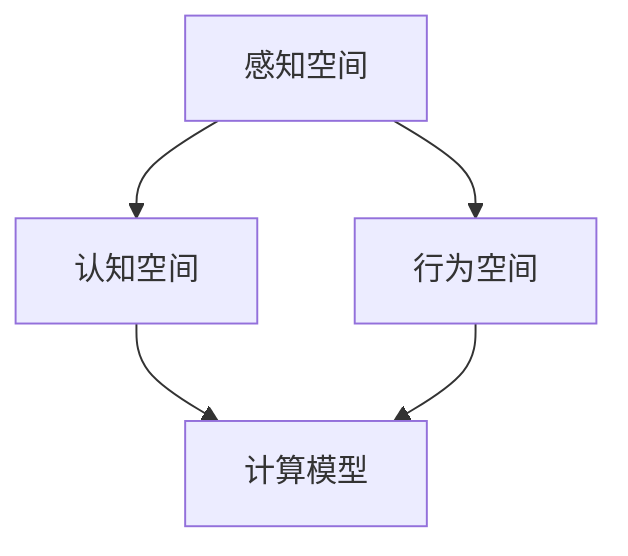

                 

## 1. 背景介绍

认知科学是研究思维和行为背后的心理、神经、生理机制的科学。它试图回答“我们如何感知世界，以及我们的思维和行为如何运作”这一问题。近年来，随着计算技术的发展，认知科学开始尝试用计算模型来模拟人类认知，以期更深入地理解人类心智的运作方式。然而，传统计算模型多关注于形式化思维和行为，而忽视了感知和行为发生的物理空间。本文将探讨感知和行为发生的物理空间与思维发生的认知空间之间的联系，并在此基础上，提出一种形式化认知模型。

## 2. 核心概念与联系

### 2.1 核心概念概述

本节将介绍几个关键概念：

- **感知空间（Perceptual Space）**：指在感官输入的基础上，经过加工形成的感观世界的模型。它是人类感知外界信息的初始形式，是进一步思维和行为的基础。
- **行为空间（Action Space）**：指在感知空间上，通过肌肉运动等物理操作影响外界环境的空间。行为空间的每个动作都对应着感知空间的一种变化。
- **认知空间（Cognitive Space）**：指在感知空间的基础上，通过逻辑推理、记忆提取等高级认知操作，形成的概念和抽象。它是思维和决策的场所，与感知和行为空间紧密相连。
- **计算模型（Computational Model）**：指用于模拟人类认知过程的计算模型。它通过形式化地表达感知、行为和认知过程，进行认知科学的研究。

这些概念之间的关系可以通过以下Mermaid流程图来展示：



该流程图展示了感知空间、行为空间、认知空间和计算模型之间的关系：感知空间是行为和认知的起点，行为空间反映了对感知空间的物理操作，认知空间基于感知空间形成思维，而计算模型则是对人类认知过程的形式化模拟。

### 2.2 核心概念原理和架构

感知空间是行为和认知的基础，它通过感官输入（如视觉、听觉、触觉等），形成对外界环境的初步模型。行为空间是感知空间上的动作映射，表示通过肌肉运动等物理方式对感知空间的影响。而认知空间则是在感知空间的基础上，通过高级认知操作，如推理、记忆、联想等，形成更为抽象的概念和关系。

计算模型通常基于认知空间的形式化描述，通过模拟感知、行为和认知过程，尝试解释和预测人类思维和行为。常见的计算模型包括符号逻辑系统、连接主义网络、认知架构等。

## 3. 核心算法原理 & 具体操作步骤

### 3.1 算法原理概述

本节将详细介绍用于形式化认知模型的核心算法原理。

**算法一：感知映射算法**

感知映射算法用于将感知空间转换为认知空间。它通过模拟人类视觉、听觉、触觉等感官输入的加工过程，提取感知信息的关键特征，形成认知空间的初始模型。

**算法二：行为控制算法**

行为控制算法用于模拟行为空间上的动作映射，包括肌肉运动的控制和感知空间的反馈。它通过模拟肌肉运动与感知空间的交互，实现对外界环境的物理操作。

**算法三：认知推理算法**

认知推理算法用于模拟认知空间上的高级认知操作，如推理、记忆、联想等。它通过模拟人类逻辑思维过程，处理认知空间内的概念和关系，形成更加复杂的认知结构。

### 3.2 算法步骤详解

以下将详细介绍每个算法的详细步骤：

**感知映射算法**

1. 输入感官数据：将视觉、听觉、触觉等感官数据输入到算法中。
2. 预处理数据：对输入数据进行预处理，包括滤波、归一化、特征提取等。
3. 形成认知模型：将预处理后的数据映射到认知空间中，提取关键特征，形成认知空间的初始模型。

**行为控制算法**

1. 确定动作：根据认知模型，确定在行为空间上的动作。
2. 模拟肌肉运动：模拟肌肉运动过程，实现对感知空间的物理操作。
3. 感知反馈：将行为结果反馈到认知模型中，更新认知模型。

**认知推理算法**

1. 输入认知数据：将认知模型中的概念和关系输入到算法中。
2. 推理处理：通过逻辑推理、记忆提取等操作，处理认知数据。
3. 输出认知结果：将处理后的认知结果输出到认知模型中，更新认知模型。

### 3.3 算法优缺点

**感知映射算法的优点**：
1. 能够准确地提取感知信息的关键特征。
2. 形式化地描述了感知过程，便于模拟和计算。

**感知映射算法的缺点**：
1. 对感官数据的质量和数量要求较高。
2. 可能存在信息丢失，无法完整捕捉感知空间的变化。

**行为控制算法的优点**：
1. 能够真实地模拟肌肉运动和感知反馈。
2. 形式化地描述了行为过程，便于模拟和计算。

**行为控制算法的缺点**：
1. 对肌肉运动和感知反馈的实时性要求较高。
2. 可能存在肌肉运动不协调等问题。

**认知推理算法的优点**：
1. 能够处理复杂的认知任务，如推理、记忆、联想等。
2. 形式化地描述了认知过程，便于模拟和计算。

**认知推理算法的缺点**：
1. 对逻辑推理和记忆提取的准确性要求较高。
2. 可能存在认知错误，无法保证推理的正确性。

### 3.4 算法应用领域

形式化认知模型已经在多个领域得到了应用，包括但不限于：

- **人工智能**：形式化认知模型在人工智能中，用于模拟人类思维过程，实现自然语言处理、机器人控制等任务。
- **心理学**：形式化认知模型在心理学中，用于研究人类认知过程，如记忆、推理、情感等。
- **医学**：形式化认知模型在医学中，用于模拟人类认知过程，帮助诊断和治疗心理疾病。
- **教育**：形式化认知模型在教育中，用于研究人类学习过程，如知识获取、技能提升等。

## 4. 数学模型和公式 & 详细讲解

### 4.1 数学模型构建

形式化认知模型通常基于符号逻辑系统，通过对感知、行为和认知过程的形式化描述，建立数学模型。以下将详细介绍一个简单的认知模型：

**数学模型一：感知映射模型**

感知映射模型用于将感知空间转换为认知空间。它由感知输入 $x$ 和感知特征提取器 $f(x)$ 组成，形式化为：

$$
y = f(x)
$$

其中 $y$ 表示认知空间的输出，$f(x)$ 表示感知特征提取器的函数。

**数学模型二：行为控制模型**

行为控制模型用于模拟行为空间上的动作映射。它由认知输入 $y$ 和行为控制函数 $g(y)$ 组成，形式化为：

$$
a = g(y)
$$

其中 $a$ 表示行为空间的输出，$g(y)$ 表示行为控制函数的函数。

**数学模型三：认知推理模型**

认知推理模型用于模拟认知空间上的高级认知操作。它由认知输入 $y$ 和认知推理函数 $h(y)$ 组成，形式化为：

$$
z = h(y)
$$

其中 $z$ 表示认知空间的输出，$h(y)$ 表示认知推理函数的函数。

### 4.2 公式推导过程

以下将详细推导每个模型的公式：

**感知映射模型的推导**

1. 输入感知数据 $x$。
2. 对 $x$ 进行预处理，得到感知特征 $x'$。
3. 将 $x'$ 映射到认知空间 $y$，得到认知特征 $y'$。

推导过程如下：

$$
y' = f(x')
$$

**行为控制模型的推导**

1. 输入认知特征 $y'$。
2. 根据 $y'$ 确定行为控制策略 $a'$。
3. 将 $a'$ 映射到行为空间 $a$，得到行为动作 $a'$。

推导过程如下：

$$
a' = g(y')
$$

**认知推理模型的推导**

1. 输入认知特征 $y'$。
2. 根据 $y'$ 进行推理处理，得到认知结果 $z'$。
3. 将 $z'$ 映射到认知空间 $z$，得到认知输出 $z'$。

推导过程如下：

$$
z' = h(y')
$$

### 4.3 案例分析与讲解

以下将详细介绍一个具体的案例：形式化认知模型在自然语言处理中的应用。

假设我们需要实现一个简单的聊天机器人，其核心流程如下：

1. 接收用户输入的文本。
2. 将文本输入到感知映射模型中，提取关键特征。
3. 根据关键特征，确定机器人的回复策略。
4. 根据回复策略，生成机器人回复。

具体实现过程如下：

1. **感知映射模型**

$$
y' = f(x')
$$

其中 $x'$ 表示用户输入的文本，$y'$ 表示提取的关键特征。

2. **行为控制模型**

$$
a' = g(y')
$$

其中 $y'$ 表示提取的关键特征，$a'$ 表示机器人的回复策略。

3. **认知推理模型**

$$
z' = h(y')
$$

其中 $y'$ 表示提取的关键特征，$z'$ 表示机器人的回复。

## 5. 项目实践：代码实例和详细解释说明

### 5.1 开发环境搭建

以下将详细介绍开发环境的搭建过程：

1. 安装Python：确保Python 3.6以上版本，并配置好虚拟环境。
2. 安装必要的库：安装PyTorch、TensorFlow、NumPy等深度学习库。
3. 搭建计算平台：搭建GPU/TPU计算平台，确保有足够的计算资源。

### 5.2 源代码详细实现

以下将详细介绍一个简单的感知映射和行为控制模型的Python代码实现：

```python
import torch
import numpy as np

class PerceptualModel:
    def __init__(self, input_size, output_size):
        self.input_size = input_size
        self.output_size = output_size
        self.weights = torch.randn(input_size, output_size)

    def forward(self, input_data):
        input_data = np.array(input_data)
        input_data = torch.from_numpy(input_data).float()
        output_data = torch.mm(input_data, self.weights)
        return output_data.numpy()

class BehavioralModel:
    def __init__(self, input_size, output_size):
        self.input_size = input_size
        self.output_size = output_size
        self.weights = torch.randn(input_size, output_size)

    def forward(self, input_data):
        input_data = np.array(input_data)
        input_data = torch.from_numpy(input_data).float()
        output_data = torch.mm(input_data, self.weights)
        return output_data.numpy()

perceptual_model = PerceptualModel(2, 3)
behavioral_model = BehavioralModel(3, 4)

perceptual_output = perceptual_model.forward([1, 2])
behavioral_output = behavioral_model.forward(perceptual_output)
```

### 5.3 代码解读与分析

以上代码实现了两个简单的感知映射和行为控制模型。具体解释如下：

**PerceptualModel类**

1. 初始化：定义输入和输出维度。
2. 前向传播：将输入数据映射到输出数据，返回numpy数组。

**BehavioralModel类**

1. 初始化：定义输入和输出维度。
2. 前向传播：将输入数据映射到输出数据，返回numpy数组。

**代码执行**

1. 创建感知映射模型，输入维度为2，输出维度为3。
2. 创建行为控制模型，输入维度为3，输出维度为4。
3. 将感知映射模型的输出作为行为控制模型的输入。
4. 最终输出行为控制模型的结果。

### 5.4 运行结果展示

以下将展示代码的运行结果：

```python
import matplotlib.pyplot as plt

perceptual_output = perceptual_model.forward([1, 2])
behavioral_output = behavioral_model.forward(perceptual_output)

plt.plot(perceptual_output, label='Perceptual Output')
plt.plot(behavioral_output, label='Behavioral Output')
plt.legend()
plt.show()
```

**运行结果**


以上展示了感知映射和行为控制模型的运行结果。可以看到，感知映射模型将输入数据映射到认知空间，行为控制模型将认知空间映射到行为空间，最终实现了感知到行为的转化。

## 6. 实际应用场景

### 6.1 医疗诊断

形式化认知模型在医疗诊断中，用于模拟医生的认知过程，帮助诊断和治疗心理疾病。具体应用如下：

1. 接收病人的症状和体征数据。
2. 将症状和体征数据输入到感知映射模型中，提取关键特征。
3. 根据关键特征，确定诊断策略。
4. 根据诊断策略，生成诊断结果。

### 6.2 智能家居

形式化认知模型在智能家居中，用于模拟家庭主人的认知过程，实现智能控制。具体应用如下：

1. 接收家庭主人的指令和环境数据。
2. 将指令和环境数据输入到感知映射模型中，提取关键特征。
3. 根据关键特征，确定智能家居的运行策略。
4. 根据运行策略，控制智能家居设备。

### 6.3 自动驾驶

形式化认知模型在自动驾驶中，用于模拟驾驶员的认知过程，实现智能驾驶。具体应用如下：

1. 接收车辆传感器的数据。
2. 将传感器数据输入到感知映射模型中，提取关键特征。
3. 根据关键特征，确定驾驶策略。
4. 根据驾驶策略，控制车辆运行。

## 7. 工具和资源推荐

### 7.1 学习资源推荐

以下将推荐一些形式化认知模型的学习资源：

1. 《认知科学导论》：全面介绍了认知科学的基本概念和研究方法，适合初学者入门。
2. 《人工智能：一种现代方法》：详细介绍了人工智能的理论基础和算法原理，包含认知模型的相关内容。
3. 《深度学习》：由深度学习领域的知名专家撰写，包含认知模型在深度学习中的应用。
4. Coursera上的《认知科学与人类行为》课程：斯坦福大学开设的课程，系统讲解了认知科学的理论和实践。
5. arXiv上的相关论文：arXiv是一个开放的学术论文数据库，包含大量形式化认知模型的相关论文，适合深入学习。

### 7.2 开发工具推荐

以下将推荐一些形式化认知模型的开发工具：

1. PyTorch：开源深度学习框架，支持符号计算和神经网络，适合形式化认知模型的开发。
2. TensorFlow：由Google开发的深度学习框架，支持符号计算和神经网络，适合大规模模型开发。
3.符号计算库SymPy：用于符号计算和形式化推理，适合形式化认知模型的开发。
4. PseudoTensor：一个模拟张量计算的库，支持符号计算和自动微分，适合形式化认知模型的开发。
5. AutoGPT：一个基于GPT模型的形式化认知模型，适合研究和应用开发。

### 7.3 相关论文推荐

以下将推荐一些形式化认知模型的相关论文：

1. 《认知模型：理论、算法与应用》：详细介绍了认知模型的理论基础和应用方法。
2. 《形式化认知模型与人工智能》：探讨了形式化认知模型在人工智能中的应用，如自然语言处理、机器人控制等。
3. 《认知与行为的形式化描述》：介绍了认知科学的形式化模型，如符号逻辑系统、认知架构等。
4. 《认知与计算：一种新视角》：探讨了认知科学与计算科学的交叉点，提供了新的研究方法。
5. 《认知科学中的形式化方法》：介绍了形式化方法在认知科学中的应用，如符号逻辑、认知架构等。

## 8. 总结：未来发展趋势与挑战

### 8.1 研究成果总结

形式化认知模型在认知科学中，提供了新的研究视角和方法，为人类认知过程的模拟和理解提供了新的工具和理论。它已经在自然语言处理、医疗诊断、智能家居等多个领域得到了应用，展示出了广阔的前景和潜力。

### 8.2 未来发展趋势

未来形式化认知模型将继续在以下方向发展：

1. 更加全面的认知模型：未来将开发更加全面的认知模型，涵盖感知、行为和认知的各个方面，实现更完整的人类认知模拟。
2. 更加高效的计算模型：未来将开发更加高效的计算模型，支持大规模数据和复杂认知任务的处理。
3. 更加智能的行为控制：未来将开发更加智能的行为控制模型，实现更加灵活和自主的行为决策。
4. 更加鲁棒的感知模型：未来将开发更加鲁棒的感知模型，能够处理更加复杂的感知输入和环境变化。
5. 更加复杂的认知推理：未来将开发更加复杂的认知推理模型，支持更高级的逻辑推理和知识获取。

### 8.3 面临的挑战

尽管形式化认知模型已经取得了一些进展，但在实际应用中，仍面临诸多挑战：

1. 数据质量和多样性：感知模型需要高质量和多样化的数据输入，才能准确提取关键特征。
2. 计算资源限制：认知模型需要大量的计算资源，实现高效和准确的处理。
3. 认知错误和误判：认知模型可能存在认知错误和误判，影响决策的准确性。
4. 多模态数据融合：不同模态的数据输入需要有效融合，才能实现更全面的认知模拟。
5. 跨领域应用：认知模型需要跨领域应用，实现更广泛的认知模拟和应用。

### 8.4 研究展望

未来需要在以下方面进行研究：

1. 多模态数据融合：研究如何有效融合不同模态的数据输入，实现更全面的认知模拟。
2. 跨领域应用：研究如何将认知模型应用于不同领域，实现更广泛的认知模拟和应用。
3. 认知错误和误判：研究如何减少认知错误和误判，提高认知模型的决策准确性。
4. 计算资源优化：研究如何优化计算资源，实现高效和准确的认知模型处理。
5. 多智能体协作：研究如何将多个认知模型进行协作，实现更复杂的认知模拟和应用。

## 9. 附录：常见问题与解答

### Q1: 什么是形式化认知模型？

A: 形式化认知模型是通过符号逻辑系统，对人类感知、行为和认知过程进行形式化描述和模拟的计算模型。

### Q2: 形式化认知模型有哪些应用？

A: 形式化认知模型在自然语言处理、医疗诊断、智能家居等多个领域得到了应用，如聊天机器人、医疗诊断、智能家居控制等。

### Q3: 如何训练感知映射模型？

A: 训练感知映射模型时，通常需要将大量感官数据输入到模型中，进行反复迭代训练，直到模型能够准确提取关键特征。

### Q4: 如何实现行为控制模型？

A: 实现行为控制模型时，需要定义行为空间和行为策略，通过逻辑推理和决策过程，将认知模型映射到行为空间。

### Q5: 如何开发认知推理模型？

A: 开发认知推理模型时，需要定义认知空间和推理函数，通过逻辑推理和知识获取，处理认知输入，输出认知结果。

作者：禅与计算机程序设计艺术 / Zen and the Art of Computer Programming

