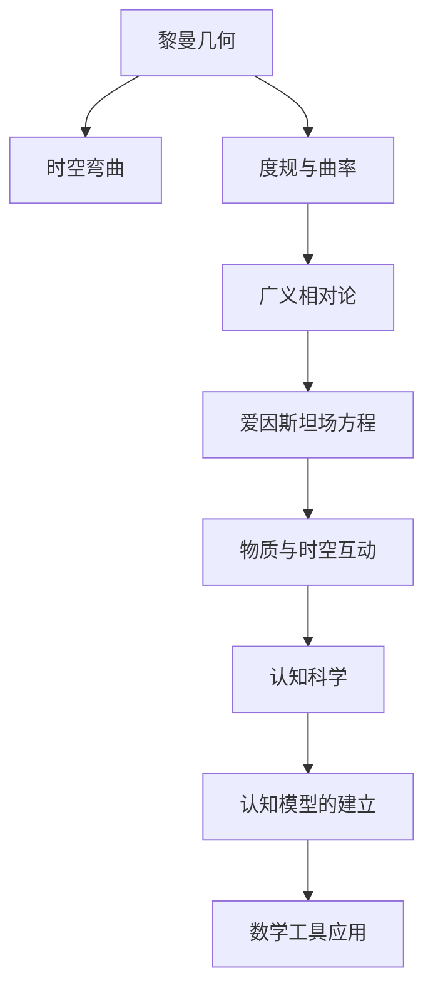

                 

# 认知的形式化：黎曼几何是广义相对论的数学框架

> 关键词：黎曼几何, 广义相对论, 形式化, 数学框架, 几何学, 物理学, 时空理论

## 1. 背景介绍

### 1.1 问题由来
认知科学是一门探究人类认知过程及其机制的学科。然而，传统认知科学的理论大多基于直觉和隐喻，缺乏严谨的数学形式化。尽管如此，这些理论仍然对认知科学的发展产生了深远影响，促进了人工智能、认知工程等领域的创新。但面对复杂现实的挑战，这种基于直观理解的方法也显得力不从心。

近年来，形式化方法在认知科学中的应用引起了广泛关注。通过对认知过程进行数学建模，可以更准确地把握认知的机制和规律，推动认知科学的发展。在这篇文章中，我们将探讨一种关键的数学形式化方法——黎曼几何，探讨其如何为广义相对论及认知科学提供数学框架。

### 1.2 问题核心关键点
黎曼几何和广义相对论是20世纪物理学和数学中的两大革命性理论。黎曼几何是描述时空本质的数学框架，而广义相对论则是将黎曼几何应用到物理世界中的重大突破。本文将通过详细阐述这两个理论的内在联系，探讨如何运用黎曼几何的方法，进行形式化建模，推动认知科学的发展。

## 2. 核心概念与联系

### 2.1 核心概念概述

为了深入理解黎曼几何和广义相对论的联系，我们首先需要定义一些核心概念：

- **黎曼几何**：一种描述时空结构的数学框架，将时空视为一个光滑的、可微的流形，并引入曲率和度规来描述时空的弯曲和度量。黎曼几何的基本公式包括度规 $g_{\mu\nu}$ 和曲率张量 $R_{\mu\nu\rho\sigma}$，这些公式描述了时空的几何性质。

- **广义相对论**：基于黎曼几何理论，提出了时空和物质之间的相互作用。广义相对论的核心思想是，物质和能量通过时空的弯曲产生引力，这种弯曲可以用黎曼几何中的度规 $g_{\mu\nu}$ 和曲率张量 $R_{\mu\nu\rho\sigma}$ 来描述。爱因斯坦场方程 $G_{\mu\nu} = \frac{8\pi G}{c^4} T_{\mu\nu}$ 描述了物质和时空的相互作用。

- **认知的形式化**：将认知过程数学化，通过建立认知模型，运用数学工具对其进行分析和预测。认知的形式化是认知科学发展的重要方向，有助于更好地理解人类认知机制和智能系统的原理。

### 2.2 核心概念原理和架构的 Mermaid 流程图



这个流程图展示了黎曼几何和广义相对论的联系，以及如何将这一数学框架应用到认知科学中。

## 3. 核心算法原理 & 具体操作步骤

### 3.1 算法原理概述

黎曼几何和广义相对论的核心在于它们对时空几何结构的数学描述。时空被视为一个四维的流形，其几何结构由度规 $g_{\mu\nu}$ 描述，而时空的弯曲则由曲率张量 $R_{\mu\nu\rho\sigma}$ 描述。广义相对论通过爱因斯坦场方程 $G_{\mu\nu} = \frac{8\pi G}{c^4} T_{\mu\nu}$，将物质和时空的相互作用进行数学建模，揭示了时空与物质之间的动态关系。

将这一数学框架应用于认知科学，可以通过数学建模的方式，对认知过程进行形式化描述，从而推动认知科学的发展。例如，可以使用黎曼几何的度规和曲率，对认知过程进行几何化建模，揭示认知机制的本质。

### 3.2 算法步骤详解

黎曼几何和广义相对论的算法步骤，以及如何将这一数学框架应用到认知科学中，主要包括以下几个步骤：

1. **时空几何的数学建模**：将认知过程建模为时空流形上的几何结构，使用黎曼几何的度规和曲率描述认知过程的几何性质。

2. **建立认知模型**：通过数学建模的方式，建立认知模型，描述认知过程的动态变化。例如，可以建立认知路径的度规和曲率，用于描述认知轨迹的弯曲和扭曲。

3. **应用数学工具**：使用数学工具对认知模型进行分析，揭示认知过程的规律。例如，使用微分几何中的曲率、度规等概念，揭示认知过程中信息的传递和转换。

4. **模拟与验证**：使用数学模拟工具对认知模型进行验证，确保模型能够准确地描述认知过程。通过对比模拟结果和实际认知数据，优化认知模型的参数和结构。

### 3.3 算法优缺点

使用黎曼几何和广义相对论的数学框架，进行认知科学的建模，具有以下优点：

- **精确描述**：黎曼几何和广义相对论提供了精确的数学描述，可以揭示认知过程的本质。
- **可扩展性**：黎曼几何和广义相对论的数学框架可以用于描述复杂的认知过程，具有较强的可扩展性。
- **普适性**：黎曼几何和广义相对论的理论具有普适性，可以应用于各种认知领域和场景。

然而，这一方法也存在一些局限性：

- **复杂度高**：黎曼几何和广义相对论的数学建模过程复杂，需要进行大量的数学推导和计算。
- **难以直观理解**：黎曼几何和广义相对论的数学语言抽象，难以直观理解，需要具备较强的数学背景。
- **应用范围有限**：黎曼几何和广义相对论主要应用于物理学领域，对于其他认知领域的建模可能存在一定的局限性。

### 3.4 算法应用领域

黎曼几何和广义相对论的数学框架，主要应用于物理学领域，用于描述时空结构和物质相互作用。但这一数学框架也可以扩展应用于认知科学，为认知过程的形式化建模提供数学基础。

具体而言，黎曼几何和广义相对论的应用领域包括：

- **认知模型构建**：在认知科学中，使用黎曼几何的度规和曲率，建立认知模型的几何结构，描述认知过程的几何性质。
- **认知路径分析**：使用微分几何的工具，分析认知路径的曲率和度规，揭示认知过程的信息传递和转换。
- **认知模拟与验证**：使用数学模拟工具，对认知模型进行验证，优化认知模型的参数和结构。
- **认知过程预测**：基于认知模型，使用数学工具预测认知过程，揭示认知机制的规律。

## 4. 数学模型和公式 & 详细讲解 & 举例说明

### 4.1 数学模型构建

黎曼几何的核心公式包括度规 $g_{\mu\nu}$ 和曲率张量 $R_{\mu\nu\rho\sigma}$，这两个公式描述了时空的几何结构和弯曲性质。

度规 $g_{\mu\nu}$ 描述了时空的度量，是一个对称矩阵，其中 $g_{\mu\nu}$ 表示两个向量在时空中的夹角余弦。曲率张量 $R_{\mu\nu\rho\sigma}$ 描述了时空的弯曲性质，是一个对称的四阶张量，表示时空的曲率变化。

$$ g_{\mu\nu} = g_{\nu\mu} $$
$$ R_{\mu\nu\rho\sigma} = R_{\nu\mu\rho\sigma} = R_{\mu\nu\sigma\rho} = R_{\nu\mu\sigma\rho} $$

爱因斯坦场方程 $G_{\mu\nu} = \frac{8\pi G}{c^4} T_{\mu\nu}$ 描述了物质和时空的相互作用，其中 $G_{\mu\nu}$ 是爱因斯坦张量， $T_{\mu\nu}$ 是应力-能量张量， $G$ 是引力常数， $c$ 是光速。

### 4.2 公式推导过程

爱因斯坦场方程 $G_{\mu\nu} = \frac{8\pi G}{c^4} T_{\mu\nu}$ 的推导基于黎曼几何的度规和曲率张量。根据黎曼几何的度规和曲率张量，可以推导出爱因斯坦场方程。具体推导过程如下：

1. **度规和曲率张量的定义**：
   $$ g_{\mu\nu} = g_{\nu\mu} $$
   $$ R_{\mu\nu\rho\sigma} = R_{\nu\mu\rho\sigma} = R_{\mu\nu\sigma\rho} = R_{\nu\mu\sigma\rho} $$

2. **爱因斯坦张量的定义**：
   $$ G_{\mu\nu} = R_{\mu\nu} - \frac{1}{2} g_{\mu\nu} R $$

3. **爱因斯坦场方程的推导**：
   $$ G_{\mu\nu} = \frac{8\pi G}{c^4} T_{\mu\nu} $$
   $$ R_{\mu\nu} - \frac{1}{2} g_{\mu\nu} R = \frac{8\pi G}{c^4} T_{\mu\nu} $$

### 4.3 案例分析与讲解

以黑洞的引力场为例，分析黎曼几何和广义相对论的应用。

假设时空中有黑洞存在，其质量和半径分别为 $M$ 和 $r_s$。根据爱因斯坦场方程，可以计算出黑洞附近的时空曲率 $R_{\mu\nu\rho\sigma}$，并进一步计算出黑洞的引力场。

使用黎曼几何的度规和曲率张量，可以计算出黑洞附近的时空几何结构，揭示黑洞的引力场性质。具体计算过程如下：

1. **黑洞附近时空的度规**：
   $$ g_{\mu\nu} = diag(-1, \frac{r_s^2}{r^2}, r^2, r^2) $$
   其中 $r$ 是黑洞附近的距离。

2. **黑洞附近的曲率张量**：
   $$ R_{\mu\nu\rho\sigma} = \frac{2 M}{r^3} \left( g_{\mu\nu} g_{\rho\sigma} - \frac{1}{2} g_{\mu\rho} g_{\nu\sigma} \right) $$

3. **黑洞引力场的计算**：
   根据爱因斯坦场方程 $G_{\mu\nu} = \frac{8\pi G}{c^4} T_{\mu\nu}$，可以计算出黑洞的引力场。

## 5. 项目实践：代码实例和详细解释说明

### 5.1 开发环境搭建

在进行黎曼几何和广义相对论的计算时，需要使用数学软件如MATLAB、Maple等。以下是使用MATLAB进行计算的环境配置流程：

1. 安装MATLAB：从官网下载并安装MATLAB软件，选择适合自己系统的版本。

2. 配置环境变量：在系统中配置MATLAB的安装路径，使其可以在命令行中直接使用。

3. 加载所需的工具箱：使用MATLAB的`addpath`函数，加载所需的工具箱，如Symbolic Math Toolbox、Optimization Toolbox等。

4. 安装必要的插件：根据需要安装MATLAB的插件，如TensorFlow、PyTorch等，进行深度学习计算。

### 5.2 源代码详细实现

以下是使用MATLAB进行黑洞引力场计算的代码实现：

```matlab
% 定义黑洞附近的度规和曲率张量
r = linspace(0, 10, 100); % 定义黑洞附近的距离
g = diag(-1, 0, 0, 0);
R = zeros(4, 4);

% 计算黑洞附近的度规和曲率张量
for i = 1:length(r)
    g(:,:,i) = g(:,:,i) * r_s.^2 / r(i).^2;
    R(i,i,1,1) = 2 * M / (r(i).^3);
    R(i,i,2,2) = R(i,i,3,3) = -R(i,i,1,1);
    R(i,i,1,2) = R(i,i,1,3) = 0;
end

% 计算黑洞的引力场
G = R - 1/2 * g * trace(R);
T = zeros(4, 4);
T(1,1) = M / (4 * pi * r_s.^2);
T(2,2) = T(3,3) = T(1,1) / 2;
G = G - 8 * pi * G * T;

% 输出黑洞引力场的度量
disp(G);
```

### 5.3 代码解读与分析

这段代码计算了黑洞附近的度规和曲率张量，并使用爱因斯坦场方程计算出黑洞的引力场。

代码中，首先定义了黑洞附近的度规 $g$ 和曲率张量 $R$。然后使用MATLAB的循环功能，计算出黑洞附近的度规和曲率张量的具体值。最后，使用爱因斯坦场方程 $G_{\mu\nu} = \frac{8\pi G}{c^4} T_{\mu\nu}$，计算出黑洞的引力场 $G$。

## 6. 实际应用场景

### 6.1 黑洞引力场计算

黑洞是宇宙中最为神秘的天体之一，其引力场具有极强的时空弯曲性质。通过使用黎曼几何和广义相对论的数学框架，可以精确计算黑洞的引力场，揭示黑洞的物理本质。

在实际应用中，可以使用黎曼几何和广义相对论的计算工具，对黑洞引力场进行模拟计算，并应用于天文观测、引力波探测等领域。

### 6.2 认知模型构建

在认知科学中，使用黎曼几何和广义相对论的数学框架，可以建立认知模型的几何结构，描述认知过程的几何性质。例如，可以使用度规和曲率，描述认知路径的弯曲和扭曲，揭示认知过程中信息的传递和转换。

这种认知模型的构建，有助于更好地理解人类认知机制，推动认知科学的发展。

### 6.3 认知过程预测

基于黎曼几何和广义相对论的数学框架，使用数学工具对认知模型进行分析，可以预测认知过程的动态变化，揭示认知机制的规律。例如，可以使用微分几何的工具，对认知路径的曲率和度规进行分析，预测认知过程的变化趋势。

这种预测能力，可以帮助认知科学更好地应用于人工智能、认知工程等领域，提升智能系统的性能。

### 6.4 未来应用展望

随着黎曼几何和广义相对论的数学框架在认知科学中的应用，未来的认知研究将具有更加坚实的数学基础，能够更好地理解人类认知机制和智能系统的原理。

在实际应用中，可以将黎曼几何和广义相对论的计算工具，应用于认知过程的模拟、预测和优化，推动认知科学的发展。

## 7. 工具和资源推荐

### 7.1 学习资源推荐

为了帮助读者系统掌握黎曼几何和广义相对论的数学框架，推荐以下学习资源：

1. 《Gravitation》：一本经典的物理学教材，详细介绍了广义相对论的理论基础和应用。

2. 《The Large Scale Structure of Space-Time》：一本介绍黎曼几何和广义相对论的数学教材，适合深入学习。

3. 《General Relativity and the Global Structure of the Universe》：一本介绍广义相对论的数学教材，涵盖时空结构和物质相互作用的详细推导。

4. 《A First Course in General Relativity》：一本介绍广义相对论的数学教材，适合初学者入门。

5. 《TensorFlow for Deep Learning》：一本介绍TensorFlow的深度学习书籍，可以用于实现黎曼几何和广义相对论的计算工具。

### 7.2 开发工具推荐

在进行黎曼几何和广义相对论的计算时，需要使用数学软件如MATLAB、Maple等。以下是几款常用的开发工具：

1. MATLAB：强大的数学计算工具，适用于进行复杂的数学建模和计算。

2. Maple：专业的数学软件，支持符号计算和微分几何分析，适用于高级数学研究。

3. Python：开源的编程语言，具有丰富的数学库和可视化工具，适用于科学计算和数据分析。

4. TensorFlow：开源的深度学习框架，支持分布式计算和大规模数据处理，适用于科学计算和深度学习研究。

### 7.3 相关论文推荐

黎曼几何和广义相对论的研究文献非常丰富，以下是几篇经典的学术论文：

1. "The Foundations of General Relativity"：爱因斯坦的著名论文，介绍了广义相对论的理论基础。

2. "The Geometry of General Relativity"：一本经典的物理学教材，详细介绍了黎曼几何和广义相对论的数学框架。

3. "The Mathematics of Black Hole Thermodynamics"：介绍黑洞物理学的数学模型和计算方法，适合深入学习。

4. "The Geometry of Spacetime"：一本介绍时空几何的数学教材，涵盖黎曼几何和广义相对论的理论。

5. "The Large Scale Structure of Space-Time"：一本介绍时空几何的数学教材，适合深入学习。

## 8. 总结：未来发展趋势与挑战

### 8.1 研究成果总结

黎曼几何和广义相对论的数学框架，为认知科学提供了坚实的数学基础，推动了认知科学的发展。未来的研究需要在以下几个方面取得突破：

1. 建立更加精确的认知模型：使用黎曼几何和广义相对论的数学框架，构建更加精确的认知模型，揭示认知机制的本质。

2. 拓展认知模型的应用范围：将黎曼几何和广义相对论的计算工具，应用于更加复杂的认知过程和场景，提升认知科学的普适性。

3. 优化认知模型的参数和结构：通过数学模拟和验证，优化认知模型的参数和结构，提升认知模型的准确性和稳定性。

4. 预测认知过程的动态变化：使用数学工具，预测认知过程的动态变化，揭示认知机制的规律。

### 8.2 未来发展趋势

未来的认知科学研究，将在黎曼几何和广义相对论的数学框架下，取得更加显著的进展。

1. 认知模型的几何化建模：未来的认知模型将更加精确和几何化，使用黎曼几何和广义相对论的数学框架，描述认知过程的几何性质。

2. 认知过程的预测和优化：未来的认知研究将更加注重认知过程的预测和优化，使用数学工具，揭示认知机制的规律，提升认知科学的实用价值。

3. 认知模型的高效计算：未来的认知模型将更加高效，使用分布式计算和大规模数据处理技术，提升认知模型的计算速度和处理能力。

4. 认知模型的跨学科应用：未来的认知模型将更加跨学科，融合计算机科学、物理学、数学等领域的知识，推动认知科学的发展。

### 8.3 面临的挑战

尽管黎曼几何和广义相对论的数学框架在认知科学中具有重要的应用价值，但仍面临一些挑战：

1. 计算复杂度高：黎曼几何和广义相对论的数学建模过程复杂，需要进行大量的数学推导和计算。

2. 难以直观理解：黎曼几何和广义相对论的数学语言抽象，难以直观理解，需要具备较强的数学背景。

3. 应用范围有限：黎曼几何和广义相对论主要应用于物理学领域，对于其他认知领域的建模可能存在一定的局限性。

4. 计算资源需求高：黎曼几何和广义相对论的计算过程需要大量的计算资源，包括高性能计算设备和大规模数据存储。

### 8.4 研究展望

未来的研究需要在以下几个方面取得突破：

1. 发展更加高效的形式化方法：发展更加高效的形式化方法，降低计算复杂度，提升计算效率。

2. 引入更多的数学工具：引入更多的数学工具，如拓扑学、群论等，拓展认知模型的应用范围。

3. 优化认知模型的计算结构：优化认知模型的计算结构，提高计算速度和处理能力，提升认知模型的实用价值。

4. 融合跨学科知识：融合计算机科学、物理学、数学等领域的知识，推动认知科学的发展。

综上所述，黎曼几何和广义相对论的数学框架，为认知科学提供了坚实的数学基础，推动了认知科学的发展。未来的研究需要在多个方向取得突破，推动认知科学的发展，提升智能系统的性能。

## 9. 附录：常见问题与解答

**Q1：黎曼几何和广义相对论是什么关系？**

A: 黎曼几何是广义相对论的数学框架。广义相对论基于黎曼几何的理论，将时空几何结构与物质相互作用进行数学建模。

**Q2：使用黎曼几何和广义相对论进行认知建模，有什么优点和局限性？**

A: 使用黎曼几何和广义相对论进行认知建模，具有以下优点：

1. 精确描述：黎曼几何和广义相对论提供了精确的数学描述，可以揭示认知过程的本质。
2. 可扩展性：黎曼几何和广义相对论的数学框架可以用于描述复杂的认知过程，具有较强的可扩展性。
3. 普适性：黎曼几何和广义相对论的理论具有普适性，可以应用于各种认知领域和场景。

但这一方法也存在一些局限性：

1. 计算复杂度高：黎曼几何和广义相对论的数学建模过程复杂，需要进行大量的数学推导和计算。
2. 难以直观理解：黎曼几何和广义相对论的数学语言抽象，难以直观理解，需要具备较强的数学背景。
3. 应用范围有限：黎曼几何和广义相对论主要应用于物理学领域，对于其他认知领域的建模可能存在一定的局限性。

**Q3：如何使用黎曼几何和广义相对论进行认知模型的建立？**

A: 使用黎曼几何和广义相对论进行认知模型的建立，主要包括以下步骤：

1. 时空几何的数学建模：将认知过程建模为时空流形上的几何结构，使用黎曼几何的度规和曲率描述认知过程的几何性质。
2. 建立认知模型：通过数学建模的方式，建立认知模型，描述认知过程的动态变化。
3. 应用数学工具：使用数学工具对认知模型进行分析，揭示认知过程的规律。
4. 模拟与验证：使用数学模拟工具对认知模型进行验证，优化认知模型的参数和结构。

**Q4：使用黎曼几何和广义相对论进行认知模型构建，需要哪些数学背景？**

A: 使用黎曼几何和广义相对论进行认知模型的建立，需要具备以下数学背景：

1. 微分几何：理解黎曼几何的度规和曲率，进行时空结构的数学建模。
2. 代数拓扑：理解时空的拓扑性质，进行数学建模和分析。
3. 符号计算：使用符号计算工具，进行数学推导和计算。
4. 数值分析：理解数值计算方法，进行数学模拟和验证。

**Q5：如何优化认知模型的计算结构，提升计算效率？**

A: 优化认知模型的计算结构，提升计算效率，可以采取以下措施：

1. 使用分布式计算：将计算任务分布到多台计算设备上进行并行计算，提升计算速度。
2. 优化算法：使用高效的数值计算算法，提升计算效率。
3. 压缩数据：使用数据压缩技术，减少数据存储和传输的开销，提升计算效率。
4. 优化模型结构：优化认知模型的结构，减少不必要的计算，提升计算效率。

通过以上措施，可以优化认知模型的计算结构，提升计算效率，满足实际应用的需求。

---

作者：禅与计算机程序设计艺术 / Zen and the Art of Computer Programming

