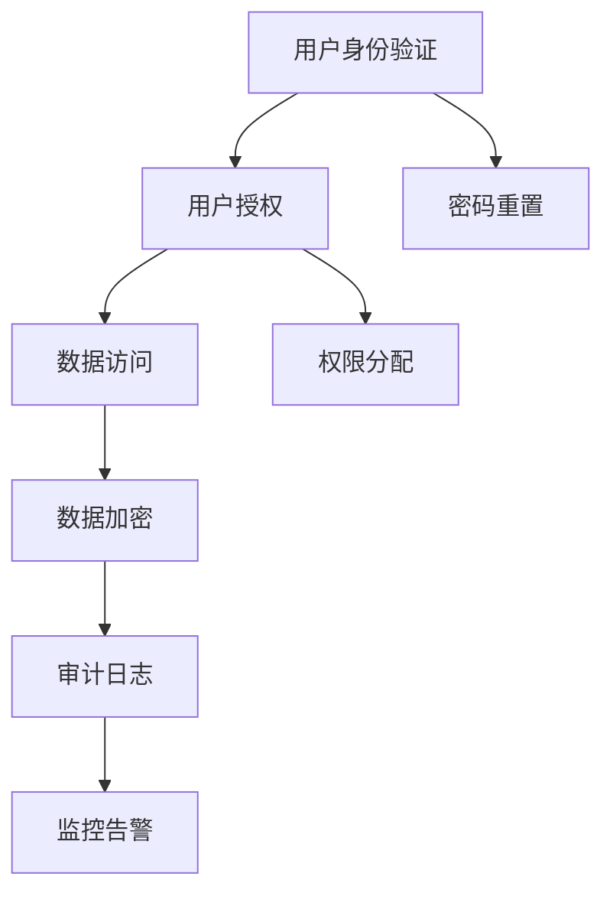

                 

## 1. 背景介绍

在当今数字化的信息时代，信息的获取方式日益多样化。从公开数据集到社交媒体，从学术论文到商业数据库，再到专有信息源，如企业内部系统、政府机构档案等，信息的获取路径愈发复杂。而访问专有信息源（Proprietary Information Sources），由于其信息价值高、覆盖面广，对于企业决策、学术研究、政策制定等领域具有重要意义。但与此同时，专有信息源访问面临诸多挑战，包括数据质量、隐私保护、访问权限等，需要采用专业的技术手段进行管理与控制。

## 2. 核心概念与联系

### 2.1 核心概念概述

本节将介绍几个核心概念，以帮助我们更好地理解专有信息源访问的必要性和技术架构。

- **专有信息源（Proprietary Information Sources）**：指企业内部系统、政府机构档案等由特定机构或组织持有，不对公众开放的专有数据源。这些信息源往往具有较高的保密性和商业价值，能够为企业提供竞争优势。

- **访问控制（Access Control）**：指对专有信息源的访问进行管理和控制，确保只有授权用户能够访问特定的数据和功能。访问控制是保障数据安全和合规性的关键手段。

- **身份验证与授权（Authentication and Authorization）**：身份验证用于验证用户身份的真实性，授权则用于控制用户能够访问哪些数据和功能。这两个过程是实现访问控制的基础。

- **数据加密（Data Encryption）**：指对存储在专有信息源中的数据进行加密处理，以保护数据的安全性和完整性，防止数据泄露和篡改。

- **审计与监控（Audit and Monitoring）**：对专有信息源的访问行为进行记录和分析，以便追踪数据使用情况，发现并应对潜在的安全威胁。

### 2.2 核心概念原理和架构的 Mermaid 流程图



## 3. 核心算法原理 & 具体操作步骤

### 3.1 算法原理概述

访问专有信息源的必要性主要体现在以下几个方面：

- **数据价值**：专有信息源往往包含大量高质量、高价值的数据，能够为企业决策提供重要依据，提升业务竞争力。
- **信息垄断**：专有信息源是企业的核心资产，通过对其访问控制，可以防止外部竞争者获取关键信息，保护企业利益。
- **隐私保护**：访问控制能够防止数据泄露，保护用户的隐私权和机密信息的安全。
- **合规性要求**：许多行业和法律法规要求对敏感数据进行严格的访问控制，以保障数据安全和合规性。

### 3.2 算法步骤详解

访问专有信息源的核心步骤包括：

1. **身份验证（Authentication）**：
   - 用户提交身份凭证（如用户名、密码、生物特征等）。
   - 系统验证用户身份，确保其合法性。

2. **授权（Authorization）**：
   - 根据用户身份，系统检查其是否具备访问特定数据或功能的权限。
   - 权限检查通常基于角色的访问控制（Role-Based Access Control, RBAC）模型。

3. **数据访问（Access）**：
   - 用户获得授权后，才能访问专有信息源中的数据或功能。
   - 访问过程中，系统对数据进行加密处理，确保数据传输和存储的安全。

4. **审计与监控（Audit and Monitoring）**：
   - 记录用户的访问行为，生成审计日志，用于追踪和分析数据使用情况。
   - 监控系统实时检测异常访问行为，如未经授权的访问、数据泄露等，及时发出告警。

### 3.3 算法优缺点

专有信息源访问控制的优点主要包括：

- **安全性高**：通过身份验证和授权机制，确保只有合法用户能够访问数据。
- **灵活性高**：角色访问控制模型可以根据业务需求灵活设置权限，方便管理。
- **可审计性**：审计日志提供详细的访问记录，便于事后追踪和分析。

缺点包括：

- **复杂性高**：系统设计和维护成本较高，需要复杂的权限管理逻辑。
- **性能影响**：频繁的身份验证和授权检查可能影响系统性能。
- **灵活性限制**：固定的角色和权限设置可能无法满足一些特殊需求。

### 3.4 算法应用领域

专有信息源访问控制在多个领域都有广泛应用，包括：

- **企业内部系统**：如ERP、CRM、OA系统等，需要对员工进行访问控制，保护敏感数据。
- **政府机构档案**：如公务员招录、情报资料等，需要对内部人员和访问人员进行严格控制。
- **科研机构数据**：如医学实验数据、科研论文等，需要对研究人员和访客进行授权。
- **金融机构资料**：如客户数据、交易记录等，需要对内部员工和外部审计人员进行访问控制。

## 4. 数学模型和公式 & 详细讲解 & 举例说明

### 4.1 数学模型构建

访问控制通常使用基于角色的访问控制（RBAC）模型，其核心思想是将用户和权限通过角色进行关联。模型包括用户、角色、权限三个基本元素。

**用户（User）**：访问系统的主体，通常包含基本信息和访问权限。

**角色（Role）**：用户权限的抽象，表示一组权限集合。

**权限（Permission）**：用户能够执行的操作，如读取、写入、删除等。

模型可用以下公式表示：

$$
U \times R \times P = \{\langle u, r, p \rangle | u \in U, r \in R, p \in P, (u, r) \in U \times R\}
$$

其中 $U$ 表示用户集合，$R$ 表示角色集合，$P$ 表示权限集合。

### 4.2 公式推导过程

角色访问控制的公式推导过程如下：

1. **用户到角色的分配**：

$$
U \times R = \{\langle u, r \rangle | u \in U, r \in R, (u, r) \in U \times R\}
$$

2. **角色到权限的分配**：

$$
R \times P = \{\langle r, p \rangle | r \in R, p \in P, (r, p) \in R \times P\}
$$

3. **用户到权限的映射**：

$$
U \times P = \{\langle u, p \rangle | u \in U, p \in P, \exists r \in R, (u, r) \in U \times R \wedge (r, p) \in R \times P\}
$$

通过上述公式，可以清晰地表示用户、角色、权限之间的关系，实现基于角色的访问控制。

### 4.3 案例分析与讲解

以企业内部ERP系统的访问控制为例：

- **用户**：企业员工、供应商、客户等。
- **角色**：普通员工、采购员、销售员、管理员等。
- **权限**：查看财务报表、修改订单、生成报告等。

例如，采购员只能查看和修改订单，而不能修改财务报表。管理员则具有所有权限。

## 5. 项目实践：代码实例和详细解释说明

### 5.1 开发环境搭建

为了实现专有信息源的访问控制，需要搭建一个完整的访问控制系统。开发环境可以包括以下组件：

- **数据库**：用于存储用户、角色、权限等信息。
- **身份验证模块**：验证用户身份。
- **授权模块**：根据用户角色分配权限。
- **数据访问模块**：根据用户权限访问数据。
- **审计与监控模块**：记录和监控访问行为。

开发环境搭建步骤如下：

1. **安装开发环境**：安装Python、MySQL、Tomcat等。
2. **配置数据库**：创建数据库和表结构。
3. **开发模块**：分别开发身份验证、授权、数据访问、审计与监控模块。

### 5.2 源代码详细实现

以下是一个简单的用户身份验证模块的实现示例：

```python
from flask import Flask, request, jsonify

app = Flask(__name__)

# 用户信息数据库
users = [
    {'id': 1, 'username': 'user1', 'password': 'password1'},
    {'id': 2, 'username': 'user2', 'password': 'password2'}
]

# 身份验证函数
@app.route('/authenticate', methods=['POST'])
def authenticate():
    data = request.json
    username = data.get('username')
    password = data.get('password')
    
    # 查找用户信息
    user = None
    for u in users:
        if u['username'] == username and u['password'] == password:
            user = u
            break
    
    if user:
        return jsonify({'success': True, 'data': user})
    else:
        return jsonify({'success': False, 'error': 'Authentication failed'})

if __name__ == '__main__':
    app.run(debug=True)
```

该模块实现了基本的身份验证功能，通过用户名和密码验证用户的合法性。

### 5.3 代码解读与分析

身份验证模块的实现如下：

1. **Flask框架**：使用Flask框架搭建Web服务，方便开发和部署。
2. **请求处理**：使用request对象处理POST请求，获取用户输入的用户名和密码。
3. **数据库查询**：遍历用户信息数据库，查找符合输入的用户信息。
4. **响应处理**：根据查询结果返回JSON格式的响应，成功则返回用户信息，失败则返回错误信息。

### 5.4 运行结果展示

运行上述代码，可以通过访问`http://localhost:5000/authenticate`接口进行身份验证，返回结果如下：

```json
{
    "success": true,
    "data": {
        "id": 1,
        "username": "user1",
        "password": "password1"
    }
}
```

## 6. 实际应用场景

专有信息源访问控制在多个场景中都有广泛应用，以下列举几个典型场景：

### 6.1 企业内部系统

企业内部系统如ERP、CRM等，需要对员工进行访问控制，保护敏感数据。例如，采购员只能查看和修改订单，而不能修改财务报表。管理员则具有所有权限。

### 6.2 政府机构档案

政府机构档案如公务员招录、情报资料等，需要对内部人员和访问人员进行严格控制。例如，只有授权的官员才能访问情报资料，普通员工无法访问。

### 6.3 科研机构数据

科研机构数据如医学实验数据、科研论文等，需要对研究人员和访客进行授权。例如，只有注册的科研人员才能访问实验数据，普通学生无法访问。

### 6.4 金融机构资料

金融机构资料如客户数据、交易记录等，需要对内部员工和外部审计人员进行访问控制。例如，普通员工只能访问部分客户数据，审计人员可以访问所有客户数据。

## 7. 工具和资源推荐

### 7.1 学习资源推荐

为了帮助开发者掌握专有信息源访问控制的技术，推荐以下学习资源：

1. **《深入浅出访问控制》**：详细介绍了访问控制的基本概念和实现方法，适合初学者入门。
2. **《RBAC模型与应用》**：介绍了基于角色的访问控制模型的原理和应用场景，适合进阶学习。
3. **《Flask框架教程》**：Flask框架是实现访问控制系统的常用技术栈之一，该教程提供了详细的开发实践指导。

### 7.2 开发工具推荐

专有信息源访问控制开发常用的工具包括：

1. **Flask**：轻量级的Web框架，适合快速开发访问控制系统的后端逻辑。
2. **MySQL**：常用的关系型数据库，适合存储用户、角色、权限等访问控制数据。
3. **Spring Security**：Spring框架下的安全管理模块，提供了丰富的身份验证和授权功能。

### 7.3 相关论文推荐

以下是几篇重要的专有信息源访问控制相关论文：

1. **《RBAC模型与实现》**：详细介绍了基于角色的访问控制模型，包括原理、实现和应用案例。
2. **《访问控制技术综述》**：对访问控制技术进行了全面综述，涵盖身份验证、授权、审计等多个方面。
3. **《访问控制系统的设计与实现》**：介绍了访问控制系统的设计思路和实现方法，提供了实用的开发指导。

## 8. 总结：未来发展趋势与挑战

### 8.1 研究成果总结

专有信息源访问控制技术经过多年的发展，已经形成了一套成熟的技术体系，广泛应用于企业内部系统、政府机构档案、科研机构数据等领域。其核心思想是通过身份验证和授权机制，确保专有信息源的安全性和合规性。

### 8.2 未来发展趋势

未来，专有信息源访问控制技术将呈现以下几个发展趋势：

1. **智能化发展**：引入人工智能技术，实现自动化身份验证和授权，提升系统效率和安全性。
2. **多模态访问控制**：结合人脸识别、指纹识别等多模态技术，提升身份验证的准确性和便捷性。
3. **区块链技术应用**：利用区块链技术进行权限管理和审计，确保数据安全和透明性。
4. **云平台支持**：在云平台中实现访问控制，支持按需扩展和弹性伸缩。
5. **微服务架构**：采用微服务架构，提高系统的可维护性和可扩展性。

### 8.3 面临的挑战

专有信息源访问控制技术在发展过程中仍面临以下挑战：

1. **安全风险**：随着技术的复杂化，系统可能面临更多的安全风险，需要不断更新和优化安全策略。
2. **系统复杂性**：访问控制系统设计复杂，需要综合考虑身份验证、授权、审计等多个环节。
3. **成本问题**：系统的开发和维护成本较高，需要平衡性能和成本之间的关系。

### 8.4 研究展望

未来，专有信息源访问控制技术需要在以下几个方面进行深入研究：

1. **智能化**：引入人工智能技术，提升身份验证和授权的自动化水平，减少人工干预。
2. **多模态**：结合多模态身份验证技术，提升系统的安全性和用户体验。
3. **区块链**：利用区块链技术进行权限管理和审计，确保数据的安全性和透明性。
4. **云平台**：在云平台中实现访问控制，支持按需扩展和弹性伸缩。
5. **微服务**：采用微服务架构，提高系统的可维护性和可扩展性。

通过这些研究方向的突破，专有信息源访问控制技术将更加智能、高效、安全，为信息系统的安全和合规性提供更强大的保障。

## 9. 附录：常见问题与解答

**Q1：专有信息源访问控制的目的是什么？**

A: 专有信息源访问控制的目的是保护专有信息源的安全性和合规性，确保只有授权用户能够访问特定的数据和功能，防止数据泄露和未授权访问。

**Q2：如何实现基于角色的访问控制（RBAC）？**

A: 实现基于角色的访问控制（RBAC）需要以下步骤：
1. 定义用户、角色和权限。
2. 将用户分配到角色。
3. 将角色分配到权限。
4. 根据用户的角色，获取其可访问的权限。

**Q3：访问控制系统中常见的身份验证方式有哪些？**

A: 访问控制系统中常见的身份验证方式包括：
1. 用户名和密码认证。
2. 生物特征认证（如指纹、面部识别等）。
3. 双因素认证（结合密码和手机短信验证码等）。
4. OAuth认证（通过第三方认证服务验证用户身份）。

**Q4：访问控制系统中常见的授权方式有哪些？**

A: 访问控制系统中常见的授权方式包括：
1. 基于角色的访问控制（RBAC）。
2. 基于属性的访问控制（ABAC）。
3. 基于任务的访问控制（TBAC）。

**Q5：访问控制系统的审计与监控有哪些常见技术？**

A: 访问控制系统的审计与监控常见技术包括：
1. 日志记录和审计日志。
2. 实时监控和告警。
3. 访问行为分析。

---

作者：禅与计算机程序设计艺术 / Zen and the Art of Computer Programming

