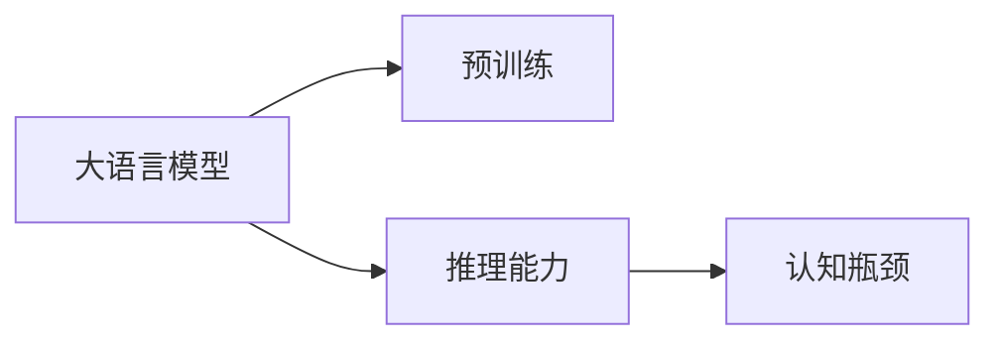

                 

# 语言与推理：大模型的认知瓶颈

## 1. 背景介绍

### 1.1 问题由来
近年来，深度学习尤其是大模型在自然语言处理(NLP)领域取得了显著进展。如GPT系列、BERT、T5等模型，通过在大量无标签数据上进行自监督预训练，掌握了丰富的语言知识，并在多项NLP任务上取得了最先进的性能。然而，尽管大模型在处理语言数据方面表现出强大的能力，它们在理解和推理方面仍存在显著的认知瓶颈。

### 1.2 问题核心关键点
本文聚焦于大模型在语言理解和推理方面存在的问题。以语言模型在大规模预训练后，如何应用于需要推理能力的任务为例，分析其在推理过程中存在的局限性，探索如何通过改进模型设计、优化训练方式等手段，提升大模型的推理能力。

## 2. 核心概念与联系

### 2.1 核心概念概述

为更好地理解大模型在推理方面的瓶颈，本节将介绍几个关键概念：

- **大语言模型(Large Language Model, LLM)**：指通过大规模预训练掌握丰富语言知识的大型深度学习模型，如GPT、BERT等。
- **推理能力(Reasoning Ability)**：指模型从已知信息中得出结论的能力，包括逻辑推理、常识推理、因果推理等。
- **认知瓶颈(Cognitive Bottleneck)**：指模型在处理复杂语言推理任务时表现出的能力不足或性能瓶颈。

这些概念之间的联系可以概括为：

1. 大语言模型通过预训练获得语言知识，具备基本的语言理解能力。
2. 推理能力依赖语言模型的语言理解能力，但在处理复杂任务时，仍然存在认知瓶颈。
3. 认知瓶颈限制了语言模型的实际应用，需要通过模型设计和训练优化，以提升其推理能力。

### 2.2 核心概念原理和架构的 Mermaid 流程图



## 3. 核心算法原理 & 具体操作步骤

### 3.1 算法原理概述

大模型的推理能力受限于其对输入信息的理解深度。尽管语言模型在大规模无标签数据上预训练获得了一定的语言知识，但在处理需要推理的任务时，其推理能力仍然存在瓶颈。

**3.1.1 推理模型的构建**

大模型的推理能力通常通过微调来实现。具体来说，语言模型经过预训练后，在特定推理任务上进行微调，以调整其输出层的结构和损失函数，使其能够更好地适应推理任务。例如，对于问答任务，可以将问题作为输入，答案作为输出，对预训练模型进行微调，以提升其推理能力。

**3.1.2 推理模型的训练**

推理模型的训练分为两个阶段：预训练和微调。预训练阶段，大模型在大量无标签数据上进行自监督学习，学习语言知识。微调阶段，在特定推理任务上进行有监督学习，调整模型参数，提升推理能力。

### 3.2 算法步骤详解

1. **预训练阶段**

   - **数据准备**：收集大规模无标签数据，如维基百科、新闻报道等，进行自监督预训练。
   - **模型构建**：选择适合的模型架构，如Transformer、LSTM等，并设置适当的超参数。
   - **训练过程**：使用自监督学习任务，如语言建模、掩码语言建模等，对模型进行训练，获得语言知识。

2. **微调阶段**

   - **任务适配**：根据特定推理任务，调整模型输出层和损失函数。
   - **训练数据**：准备少量标注数据，标注数据应覆盖尽可能多的推理情况。
   - **模型微调**：在标注数据上进行有监督学习，调整模型参数，提升推理能力。

### 3.3 算法优缺点

**优点**：

- **高效性**：大模型预训练速度快，微调所需的标注数据量相对较少，可以迅速在特定推理任务上进行优化。
- **泛化能力**：经过大规模预训练的大模型，具备一定的泛化能力，能够在不同领域和任务上表现出色。
- **灵活性**：可以通过微调，适应不同推理任务的需求，实现多样化的应用。

**缺点**：

- **数据依赖**：微调依赖标注数据，当标注数据不足时，推理能力提升有限。
- **泛化瓶颈**：在特定推理任务上表现良好，但对新任务的适应能力有限。
- **推理准确性**：在复杂推理任务上，推理能力仍存在瓶颈，输出结果可能不准确。

### 3.4 算法应用领域

大模型的推理能力在多项NLP任务中都有应用，例如：

- **问答系统**：根据用户输入的问题，从知识库中查找答案。
- **对话系统**：通过推理用户意图，进行自然对话。
- **信息检索**：在大量文本数据中，推理与查询最相关的文档。
- **文本摘要**：根据输入文本，推理并生成摘要。
- **情感分析**：通过推理文本中的情感线索，进行情感分类。

这些任务都需要大模型的推理能力，以实现高效、准确的信息处理和响应。

## 4. 数学模型和公式 & 详细讲解 & 举例说明

### 4.1 数学模型构建

大模型的推理能力可以通过微调来实现，其数学模型构建如下：

- **输入**：问题$q$，背景知识$K$。
- **模型**：预训练语言模型$M_{\theta}$。
- **推理目标**：根据$q$和$K$，推理出答案$a$。

### 4.2 公式推导过程

假设推理模型$M_{\theta}$的输出为$\hat{a}$，其推理能力通过以下步骤实现：

1. **预训练模型输出**：
   $$
   \hat{a} = M_{\theta}(q, K)
   $$

2. **微调损失函数**：
   $$
   \mathcal{L}(\theta) = -\sum_{i=1}^N \log P(a_i | q_i, K)
   $$

   其中，$P(a_i | q_i, K)$为模型对问题$q_i$的推理概率分布。

3. **微调优化**：
   $$
   \theta^* = \mathop{\arg\min}_{\theta} \mathcal{L}(\theta)
   $$

   通过梯度下降等优化算法更新模型参数，使其输出更符合推理任务的要求。

### 4.3 案例分析与讲解

以问答系统为例，具体分析大模型的推理过程。

1. **数据准备**：收集问答数据集，包括问题和对应的答案。

2. **模型微调**：
   - **输出层设计**：在预训练模型的基础上，添加新的输出层，如线性分类器或注意力机制。
   - **损失函数设计**：使用交叉熵损失函数，衡量模型输出与真实答案之间的差异。
   - **训练过程**：在问答数据集上进行微调，调整模型参数，提升推理能力。

   例如，对于以下问答对：
   - 问题：今天天气怎么样？
   - 答案：晴朗

   推理过程如下：
   - **输入处理**：将问题"今天天气怎么样"作为输入，背景知识为当前天气信息。
   - **模型推理**：模型根据输入和背景知识，生成推理结果"晴朗"。

## 5. 项目实践：代码实例和详细解释说明

### 5.1 开发环境搭建

在进行项目实践前，需要先搭建好开发环境。以下是使用Python和PyTorch进行微调的开发环境搭建流程：

1. **安装Python**：
   - 下载并安装Python 3.8及以上版本。
   - 安装pip包管理器。

2. **安装PyTorch**：
   - 安装PyTorch及其相关依赖。
   - 使用pip安装torchtext等NLP库。

3. **安装TensorBoard**：
   - 安装TensorBoard可视化工具，用于监控模型训练过程。

4. **配置模型和数据**：
   - 下载预训练模型，如BERT、GPT等。
   - 准备问答数据集，并进行预处理。

### 5.2 源代码详细实现

以下是一个使用BERT模型进行问答系统微调的Python代码实现：

```python
import torch
from transformers import BertTokenizer, BertForQuestionAnswering

# 初始化BERT模型和分词器
model = BertForQuestionAnswering.from_pretrained('bert-base-uncased')
tokenizer = BertTokenizer.from_pretrained('bert-base-uncased')

# 定义微调过程
def fine_tune(model, data_loader, device, learning_rate, epochs):
    optimizer = torch.optim.Adam(model.parameters(), lr=learning_rate)
    for epoch in range(epochs):
        model.train()
        for batch in data_loader:
            inputs = tokenizer(batch['question'], batch['context'], return_tensors='pt').to(device)
            outputs = model(**inputs)
            loss = outputs.loss
            optimizer.zero_grad()
            loss.backward()
            optimizer.step()
        print(f'Epoch {epoch+1}, Loss: {loss.item()}')

# 准备数据集
from datasets import load_dataset
dataset = load_dataset('questions', split='train')

# 将数据集分为训练集和验证集
train_dataset = dataset['train']
valid_dataset = dataset['validation']

# 定义训练参数
device = torch.device('cuda' if torch.cuda.is_available() else 'cpu')
learning_rate = 5e-5
epochs = 5

# 进行微调
fine_tune(model, train_dataset, device, learning_rate, epochs)
```

### 5.3 代码解读与分析

**tokenizer**：
- 用于分词和编码，将问题"今天天气怎么样"和上下文"今天天气晴朗"转换为模型可接受的形式。

**BertForQuestionAnswering**：
- 选择BERT模型，并指定输出层为问答任务所需的结构。

**微调函数fine_tune**：
- 定义优化器，使用Adam优化算法。
- 在训练集上迭代训练，每次更新模型参数。
- 使用交叉熵损失函数计算损失，并反向传播更新模型。

### 5.4 运行结果展示

训练完成后，使用验证集进行评估，输出推理精度等指标。以下是一个简单的验证集评估结果：

```python
for batch in valid_dataset:
    inputs = tokenizer(batch['question'], batch['context'], return_tensors='pt').to(device)
    outputs = model(**inputs)
    pred = outputs.logits.argmax(dim=1)
    print(batch['question'], 'Predicted Answer:', tokenizer.decode(pred))
```

## 6. 实际应用场景

### 6.1 智能客服系统

智能客服系统是问答系统的典型应用。通过微调大模型，可以构建能够理解客户问题的智能客服机器人，并提供高效、准确的回答。在实际应用中，系统需要不断收集用户反馈和客服记录，进行持续微调，以提升机器人对话的准确性和流畅性。

### 6.2 金融舆情监测

金融舆情监测任务需要模型理解金融市场动态，并从大量新闻、评论中筛选出关键信息。通过微调大模型，可以构建金融舆情监测系统，实时监控金融市场舆情，帮助金融机构及时应对市场变化，规避金融风险。

### 6.3 知识图谱构建

知识图谱是构建知识表示系统的基础，需要模型从大量文本中抽取出实体和关系。通过微调大模型，可以构建知识图谱，用于信息检索、推荐系统等应用。

### 6.4 未来应用展望

未来，大模型的推理能力将得到进一步提升，推动其在更多领域的应用。例如：

- **自然语言推理(NLI)**：通过微调大模型，提升其在推理任务上的表现，如判断前提与假设的关系。
- **文本生成**：利用大模型的推理能力，生成更加连贯、合理的长文本。
- **机器翻译**：通过推理模型，提升翻译质量和流畅度，实现自动翻译。

## 7. 工具和资源推荐

### 7.1 学习资源推荐

为了帮助开发者更好地掌握大模型的推理能力，以下是一些推荐的学习资源：

1. **《Reasoning with Neural Networks》书籍**：介绍了神经网络推理的基本原理和应用场景。
2. **Deep Learning with PyTorch**：由TensorFlow官方提供的深度学习教程，涵盖神经网络和模型推理的相关内容。
3. **CS231n：卷积神经网络课程**：斯坦福大学提供的计算机视觉课程，介绍了神经网络推理在计算机视觉中的应用。

### 7.2 开发工具推荐

以下是一些推荐的开发工具：

1. **PyTorch**：灵活的深度学习框架，支持自动微分和动态计算图，适合微调大模型。
2. **TensorFlow**：谷歌开发的深度学习框架，支持分布式训练和生产部署。
3. **TensorBoard**：TensorFlow的可视化工具，用于监控模型训练过程。

### 7.3 相关论文推荐

以下是几篇重要的论文，推荐阅读：

1. **"Reasoning about Uncertain Procedures"**：介绍了使用神经网络进行推理任务的方法。
2. **"Logical Reasoning with Graph Neural Networks"**：使用图神经网络进行逻辑推理，提升推理能力。
3. **"TensorFlow Tutorial: Introduction to TensorFlow and Deep Learning with TensorFlow"**：介绍TensorFlow框架及其在神经网络推理中的应用。

## 8. 总结：未来发展趋势与挑战

### 8.1 研究成果总结

本文详细介绍了大模型的推理能力及其瓶颈，分析了推理模型的构建和微调方法。通过系统梳理，明确了大模型在推理任务中的表现和局限性，并为进一步提升其推理能力提供了方向。

### 8.2 未来发展趋势

未来，大模型的推理能力将迎来新的突破，具体发展趋势如下：

1. **模型架构改进**：通过改进模型架构，如引入注意力机制、逻辑推理模块等，提升推理能力。
2. **多模态融合**：将视觉、听觉等多模态信息与文本信息结合，提升推理模型的全面性。
3. **深度增强学习**：结合深度增强学习，提升推理模型的自适应能力，应对复杂环境变化。
4. **认知模型的融合**：将符号化的认知模型与神经网络结合，提升推理模型的逻辑性和可解释性。

### 8.3 面临的挑战

尽管大模型的推理能力在提升，但仍面临以下挑战：

1. **数据依赖**：微调依赖标注数据，标注数据获取成本高、周期长，限制了模型推理能力的提升。
2. **泛化能力**：模型在新任务上的泛化能力不足，需要更多的数据和模型优化。
3. **推理准确性**：复杂推理任务上，模型的推理结果仍可能不准确，需要进一步优化。
4. **计算资源需求**：推理模型的计算资源需求高，需要高效优化模型结构和算法。

### 8.4 研究展望

未来，在大模型的推理能力提升方面，还有更多的研究空间：

1. **自监督学习**：探索使用自监督学习提升推理能力，减少对标注数据的依赖。
2. **零样本推理**：研究零样本推理方法，提升模型对未见过的推理任务的适应能力。
3. **跨模态推理**：结合视觉、听觉等多模态信息，提升推理模型的全面性和鲁棒性。
4. **知识图谱结合**：将知识图谱与推理模型结合，提升模型推理的逻辑性和准确性。

总之，大模型的推理能力在提升，但其认知瓶颈仍然存在。未来需要在多个方面进行深入研究，以实现大模型的全面智能化。

## 9. 附录：常见问题与解答

**Q1: 如何提升大模型的推理能力？**

A: 可以通过以下方法提升大模型的推理能力：
1. **数据增强**：使用回译、近义词替换等方式扩充训练集。
2. **正则化**：使用L2正则、Dropout等防止过拟合。
3. **对抗训练**：引入对抗样本，提高模型鲁棒性。
4. **多任务学习**：将多个推理任务结合，提升模型的泛化能力。

**Q2: 大模型的推理能力受限于哪些因素？**

A: 大模型的推理能力受限于以下因素：
1. **数据质量**：标注数据质量高、覆盖广泛，模型推理能力更强。
2. **模型架构**：合理的模型架构，如引入注意力机制，提升推理能力。
3. **训练方法**：适当的训练方法，如使用梯度增强、深度增强学习等，提升推理能力。

**Q3: 推理模型在实际应用中需要注意哪些问题？**

A: 推理模型在实际应用中需要注意以下问题：
1. **模型裁剪**：去除不必要的层和参数，减小模型尺寸，加快推理速度。
2. **量化加速**：将浮点模型转为定点模型，压缩存储空间，提高计算效率。
3. **服务化封装**：将模型封装为标准化服务接口，便于集成调用。
4. **弹性伸缩**：根据请求流量动态调整资源配置，平衡服务质量和成本。
5. **监控告警**：实时采集系统指标，设置异常告警阈值，确保服务稳定性。
6. **安全防护**：采用访问鉴权、数据脱敏等措施，保障数据和模型安全。

---

作者：禅与计算机程序设计艺术 / Zen and the Art of Computer Programming

