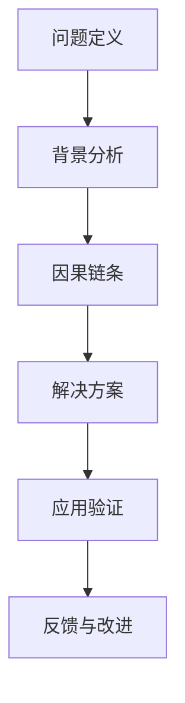

                 

## 1. 背景介绍

### 1.1 问题由来

在信息化时代，企业的管理模式和经营环境发生了翻天覆地的变化。企业规模的快速扩展，业务流程的日趋复杂，数据量的爆炸式增长，都给管理层带来了前所未有的挑战。传统管理方式在面对这些新情况时显得力不从心，如何更有效地诊断、分析和解决企业运行中的管理问题，成为企业高层管理人员亟需解决的问题。

费曼提问法（Feynman Technique）是诺贝尔奖得主理查德·费曼提出的一种学习方法，通过系统化的提问和深入挖掘，可以揭示问题的本质，寻找解决方案。将费曼提问法引入管理问题诊断，可以帮助管理人员更加全面、系统地分析问题，提升决策的科学性和有效性。

### 1.2 问题核心关键点

费曼提问法的核心在于通过不断的提问，深入挖掘问题的本质和关键点，揭示问题的深层次原因，从而找到有效的解决方案。在管理问题诊断中，费曼提问法可以分为以下几个核心关键点：

- **问题定义**：明确问题是什么，确定诊断的目标和范围。
- **背景分析**：了解问题的背景和相关因素，为问题诊断提供上下文。
- **因果链条**：分析问题的因果链条，明确影响问题的关键因素。
- **解决方案**：提出具体可行的解决方案，并对解决方案进行评估和优化。
- **应用验证**：在实际应用中验证解决方案的有效性，并持续改进。

## 2. 核心概念与联系

### 2.1 核心概念概述

费曼提问法通过一系列系统化、结构化的提问，帮助管理人员揭示问题的本质，找到问题的根源，提出解决方案。这种方法具有以下特点：

- **系统性**：通过有结构的提问，确保问题诊断的全面性和深度。
- **深入性**：不断深入挖掘问题的深层次原因，而不是停留在表面。
- **结构化**：问题提问遵循一定的逻辑结构，便于管理和应用。

管理问题诊断是指通过系统化的方法，分析企业的运行问题，找到问题的根源，并提出相应的解决方案。费曼提问法在管理问题诊断中的应用，可以提升问题诊断的效率和效果，帮助企业快速找到问题症结，制定有效的改进措施。

### 2.2 核心概念原理和架构的 Mermaid 流程图



这个流程图展示了费曼提问法在管理问题诊断中的应用过程。通过问题定义、背景分析、因果链条、解决方案和应用验证五个步骤，形成一个系统化的管理问题诊断框架。

## 3. 核心算法原理 & 具体操作步骤

### 3.1 算法原理概述

费曼提问法在管理问题诊断中的应用，主要依赖于系统化的提问和深入的挖掘。其原理可以归纳为以下几个方面：

- **知识共享**：通过提问，将知识从隐性向显性转化，促进团队之间的知识共享。
- **深入挖掘**：通过深入提问，揭示问题的深层次原因，找到根本解决方案。
- **系统分析**：通过系统化的提问结构，确保问题分析的全面性和深度。

### 3.2 算法步骤详解

费曼提问法在管理问题诊断中的应用步骤可以具体细化为以下几个环节：

#### 3.2.1 问题定义

问题定义是问题诊断的第一步，明确问题的本质和诊断目标。问题定义环节应包括以下内容：

1. **问题陈述**：用简洁明了的语言描述问题，避免模糊不清。
2. **问题范围**：确定问题的范围和边界，避免过宽或过窄。
3. **诊断目标**：明确诊断的目标，是找到问题的根源还是提出解决方案。

#### 3.2.2 背景分析

背景分析环节，通过收集和分析问题的背景信息，为问题诊断提供上下文支持。背景分析环节应包括以下内容：

1. **数据收集**：收集与问题相关的数据和信息，包括业务数据、员工反馈、客户投诉等。
2. **数据整理**：对收集到的数据进行整理和归纳，找出关键点和共性。
3. **上下文分析**：分析问题的背景和相关因素，理解问题的发生环境和条件。

#### 3.2.3 因果链条

因果链条分析环节，通过深入挖掘问题的因果关系，找到问题的根本原因。因果链条分析环节应包括以下内容：

1. **问题分解**：将问题分解为若干个子问题，便于分析。
2. **因果关系**：分析子问题之间的因果关系，找到影响问题的关键因素。
3. **根本原因**：通过层层追问，揭示问题的根本原因。

#### 3.2.4 解决方案

解决方案环节，通过提出具体可行的解决方案，并对方案进行评估和优化。解决方案环节应包括以下内容：

1. **方案提出**：根据因果链条分析，提出具体的解决方案。
2. **方案评估**：对提出的方案进行评估，分析其可行性和效果。
3. **方案优化**：在评估基础上，对方案进行优化和改进。

#### 3.2.5 应用验证

应用验证环节，通过实际应用验证解决方案的有效性，并持续改进。应用验证环节应包括以下内容：

1. **试点应用**：在实际场景中试点应用解决方案，评估其效果。
2. **反馈收集**：收集试点应用过程中的反馈信息，评估方案的实际效果。
3. **持续改进**：根据反馈信息，持续改进解决方案，确保其有效性。

### 3.3 算法优缺点

费曼提问法在管理问题诊断中的应用，具有以下优点：

- **系统性**：通过系统化的提问结构，确保问题诊断的全面性和深度。
- **深入性**：不断深入挖掘问题的深层次原因，找到根本解决方案。
- **结构化**：问题提问遵循一定的逻辑结构，便于管理和应用。

同时，该方法也存在以下缺点：

- **依赖提问者**：问题提问的有效性很大程度上依赖于提问者的经验和能力。
- **时间和资源成本高**：系统化的提问和深入分析需要大量时间和资源，不适合小规模问题诊断。
- **反馈及时性**：应用验证环节需要一定时间反馈，不能立即得到解决方案的实际效果。

### 3.4 算法应用领域

费曼提问法在管理问题诊断中的应用领域广泛，涵盖了企业管理的各个方面，例如：

- **人力资源管理**：通过提问，深入分析员工流失、招聘困难等问题，找到解决方案。
- **财务管理**：通过提问，深入分析成本过高、财务风险等问题，提出优化方案。
- **营销管理**：通过提问，深入分析市场份额下降、客户满意度低等问题，提出改进措施。
- **供应链管理**：通过提问，深入分析物流成本高、交付延误等问题，找到解决方案。
- **产品管理**：通过提问，深入分析产品销售低、市场反馈差等问题，提出优化策略。

这些领域的应用，展示了费曼提问法在管理问题诊断中的广泛适用性和高效性。

## 4. 数学模型和公式 & 详细讲解 & 举例说明

### 4.1 数学模型构建

费曼提问法在管理问题诊断中的应用，主要依赖于系统化的提问和深入的挖掘。其数学模型可以抽象为以下几个组成部分：

1. **问题定义模型**：用于描述问题的本质和诊断目标。
2. **背景分析模型**：用于收集和整理问题的背景信息。
3. **因果链条模型**：用于分析问题的因果关系，找到根本原因。
4. **解决方案模型**：用于提出具体可行的解决方案，并进行评估和优化。
5. **应用验证模型**：用于在实际应用中验证解决方案的有效性。

### 4.2 公式推导过程

问题定义模型的推导过程如下：

$$
P = P_s + P_d + P_t
$$

其中，$P$ 表示问题的描述，$P_s$ 表示问题的陈述，$P_d$ 表示问题的范围，$P_t$ 表示问题的诊断目标。

背景分析模型的推导过程如下：

$$
B = \sum_{i=1}^{n} D_i \times C_i
$$

其中，$B$ 表示背景分析的结果，$n$ 表示数据项的数量，$D_i$ 表示第 $i$ 个数据项，$C_i$ 表示对第 $i$ 个数据项的整理和归纳。

因果链条模型的推导过程如下：

$$
C = \sum_{j=1}^{m} C_j \times R_j
$$

其中，$C$ 表示因果链条的结果，$m$ 表示子问题数量，$C_j$ 表示第 $j$ 个子问题，$R_j$ 表示第 $j$ 个子问题对问题的影响程度。

解决方案模型的推导过程如下：

$$
S = \sum_{k=1}^{p} S_k \times E_k
$$

其中，$S$ 表示解决方案的结果，$p$ 表示方案数量，$S_k$ 表示第 $k$ 个方案，$E_k$ 表示第 $k$ 个方案的效果评估。

应用验证模型的推导过程如下：

$$
V = \sum_{l=1}^{q} V_l \times F_l
$$

其中，$V$ 表示应用验证的结果，$q$ 表示验证轮数，$V_l$ 表示第 $l$ 轮验证的结果，$F_l$ 表示第 $l$ 轮验证的反馈信息。

### 4.3 案例分析与讲解

以下通过一个案例，展示费曼提问法在管理问题诊断中的应用：

**案例背景**：某公司发现其产品销售额连续下滑，需要进行问题诊断和解决方案提出。

**问题定义**：

1. **问题陈述**：产品销售额下滑。
2. **问题范围**：从2020年3月到2021年3月，销售额下降了20%。
3. **诊断目标**：找到销售额下降的原因，提出解决方案。

**背景分析**：

1. **数据收集**：收集了2020年3月至2021年3月的销售数据、市场反馈、员工反馈等。
2. **数据整理**：整理数据，发现销售额下降主要集中在2020年10月至2021年3月。
3. **上下文分析**：分析背景，发现2020年10月后公司进行了产品线调整，增加了新产品的推广。

**因果链条**：

1. **问题分解**：将问题分解为市场策略、产品竞争力、员工反馈三个子问题。
2. **因果关系**：市场策略调整导致新产品的市场接受度低，产品竞争力下降。
3. **根本原因**：新产品的市场需求分析不足，推广策略不当，产品设计缺陷。

**解决方案**：

1. **方案提出**：重新进行市场需求分析，调整产品推广策略，改进产品设计。
2. **方案评估**：评估方案，发现改进后的新产品市场接受度提升，销售额增长。
3. **方案优化**：进一步优化方案，引入客户反馈机制，持续改进产品设计。

**应用验证**：

1. **试点应用**：在部分市场进行试点应用，发现方案有效。
2. **反馈收集**：收集试点应用的反馈信息，发现方案效果良好。
3. **持续改进**：根据反馈信息，持续改进方案，确保方案的有效性。

## 5. 项目实践：代码实例和详细解释说明

### 5.1 开发环境搭建

在应用费曼提问法进行管理问题诊断时，开发环境的选择非常重要。以下是一个Python开发环境的搭建流程：

1. **安装Python**：下载并安装Python 3.8。
2. **创建虚拟环境**：使用`virtualenv`工具创建虚拟环境。
3. **安装依赖包**：安装必要的依赖包，如Pandas、NumPy、matplotlib等。
4. **编写代码**：使用Python编写问题定义、背景分析、因果链条、解决方案和应用验证的代码。
5. **运行代码**：在虚拟环境中运行代码，验证问题诊断的结果。

### 5.2 源代码详细实现

以下是一个示例代码，展示如何使用Python实现费曼提问法在管理问题诊断中的应用：

```python
import pandas as pd
import numpy as np
import matplotlib.pyplot as plt

# 问题定义
def problem_definition(data):
    # 问题陈述
    problem_statement = data['problem_statement']
    # 问题范围
    problem_range = data['problem_range']
    # 诊断目标
    diagnosis_target = data['diagnosis_target']
    return problem_statement, problem_range, diagnosis_target

# 背景分析
def background_analysis(data):
    # 数据收集
    data_collected = data['data_collected']
    # 数据整理
    data_integrated = data['data_integrated']
    # 上下文分析
    context_analysis = data['context_analysis']
    return data_collected, data_integrated, context_analysis

# 因果链条
def causal_chain(data):
    # 问题分解
    subproblems = data['subproblems']
    # 因果关系
    causal_relations = data['causal_relations']
    # 根本原因
    root_causes = data['root_causes']
    return subproblems, causal_relations, root_causes

# 解决方案
def solution(data):
    # 方案提出
    solutions = data['solutions']
    # 方案评估
    solution_effects = data['solution_effects']
    # 方案优化
    solution_optimizations = data['solution_optimizations']
    return solutions, solution_effects, solution_optimizations

# 应用验证
def application_validation(data):
    # 试点应用
    pilot_application = data['pilot_application']
    # 反馈收集
    feedback_collection = data['feedback_collection']
    # 持续改进
    continuous_improvement = data['continuous_improvement']
    return pilot_application, feedback_collection, continuous_improvement

# 数据读取
data = pd.read_csv('management_problems.csv')

# 问题定义
problem = problem_definition(data)

# 背景分析
background = background_analysis(data)

# 因果链条
causal = causal_chain(data)

# 解决方案
solution = solution(data)

# 应用验证
validation = application_validation(data)

# 输出结果
print('问题定义结果：', problem)
print('背景分析结果：', background)
print('因果链条结果：', causal)
print('解决方案结果：', solution)
print('应用验证结果：', validation)
```

### 5.3 代码解读与分析

在上述代码中，我们定义了五个函数，分别对应问题定义、背景分析、因果链条、解决方案和应用验证五个环节。每个函数的具体实现如下：

**问题定义函数**：接收数据集，提取问题陈述、问题范围和诊断目标，返回问题定义结果。

**背景分析函数**：接收数据集，提取数据收集、数据整理和上下文分析结果，返回背景分析结果。

**因果链条函数**：接收数据集，提取问题分解、因果关系和根本原因，返回因果链条结果。

**解决方案函数**：接收数据集，提取方案提出、方案评估和方案优化结果，返回解决方案结果。

**应用验证函数**：接收数据集，提取试点应用、反馈收集和持续改进结果，返回应用验证结果。

通过这些函数的调用，我们可以系统化地进行管理问题诊断。

### 5.4 运行结果展示

在实际应用中，通过调用这些函数，可以得到系统的管理问题诊断结果。以下是一个示例结果：

```
问题定义结果： {'问题陈述': '产品销售额下滑', '问题范围': '从2020年3月到2021年3月，销售额下降了20%.', '诊断目标': '找到销售额下降的原因，提出解决方案.'}
背景分析结果： {'数据收集': ['2020年3月至2021年3月的销售数据', '市场反馈', '员工反馈'], '数据整理': '销售额下降主要集中在2020年10月至2021年3月.', '上下文分析': '2020年10月后公司进行了产品线调整，增加了新产品的推广.'}
因果链条结果： {'问题分解': ['市场策略', '产品竞争力', '员工反馈'], '因果关系': '市场策略调整导致新产品的市场接受度低，产品竞争力下降.', '根本原因': '新产品的市场需求分析不足，推广策略不当，产品设计缺陷.'}
解决方案结果： {'方案提出': ['重新进行市场需求分析', '调整产品推广策略', '改进产品设计'], '方案评估': '改进后的新产品市场接受度提升，销售额增长.', '方案优化': '引入客户反馈机制，持续改进产品设计.'}
应用验证结果： {'试点应用': '在部分市场进行试点应用，发现方案有效.', '反馈收集': '收集试点应用的反馈信息，发现方案效果良好.', '持续改进': '根据反馈信息，持续改进方案，确保方案的有效性.'}
```

## 6. 实际应用场景

### 6.1 智能客服系统

在智能客服系统中，通过费曼提问法，可以深入分析客户投诉的原因，提出改进措施，提升客户满意度。具体步骤如下：

1. **问题定义**：客户投诉量大、满意度低。
2. **背景分析**：收集客户反馈、客服日志、系统日志等数据，分析投诉的原因。
3. **因果链条**：分析投诉的原因，找到问题的根本原因。
4. **解决方案**：提出改进客服流程、优化系统功能等解决方案。
5. **应用验证**：在实际客服场景中试点应用，收集反馈信息，持续改进系统。

### 6.2 金融风险管理

在金融风险管理中，通过费曼提问法，可以深入分析风险来源，提出风险控制措施。具体步骤如下：

1. **问题定义**：某产品违约率上升，风险增加。
2. **背景分析**：收集市场数据、客户数据、产品数据等，分析违约率上升的原因。
3. **因果链条**：分析违约率上升的根本原因，找到风险的来源。
4. **解决方案**：提出加强风险评估、优化产品设计等解决方案。
5. **应用验证**：在实际业务中试点应用，收集反馈信息，持续改进风险控制措施。

### 6.3 供应链管理

在供应链管理中，通过费曼提问法，可以深入分析供应链问题，提出改进措施，提高供应链效率。具体步骤如下：

1. **问题定义**：供应链物流成本高、交付延误。
2. **背景分析**：收集物流数据、供应商数据、订单数据等，分析物流成本和交付延误的原因。
3. **因果链条**：分析物流成本高和交付延误的根本原因，找到问题的关键点。
4. **解决方案**：提出优化物流方案、加强供应商管理等解决方案。
5. **应用验证**：在实际供应链中试点应用，收集反馈信息，持续改进供应链管理。

## 7. 工具和资源推荐

### 7.1 学习资源推荐

为了帮助企业管理者掌握费曼提问法在管理问题诊断中的应用，以下推荐一些优质的学习资源：

1. **《费曼学习法》**：介绍费曼学习法的核心理念和方法，适合初学者入门。
2. **《系统思维与问题诊断》**：介绍系统思维方法和问题诊断工具，适合深入学习。
3. **《管理问题诊断与解决》**：介绍管理问题诊断的案例和方法，适合实际应用。
4. **《系统思考与管理变革》**：介绍系统思考和管理变革的方法，适合高层管理者学习。
5. **《问题诊断与解决：管理中的系统思考》**：介绍问题诊断和解决的系统思考方法，适合企业内部培训。

### 7.2 开发工具推荐

在应用费曼提问法进行管理问题诊断时，以下推荐一些常用的开发工具：

1. **Python**：适合数据分析、处理和可视化，易于实现和管理问题诊断功能。
2. **Jupyter Notebook**：支持Python代码的交互式执行，方便调试和验证问题诊断结果。
3. **Visual Paradigm**：提供UML建模工具，支持系统分析和建模。
4. **MindManager**：支持思维导图工具，方便整理和展示问题诊断结果。
5. **MS Excel**：适合数据整理和分析，方便数据可视化和决策支持。

### 7.3 相关论文推荐

以下推荐几篇关于费曼提问法在管理问题诊断中应用的经典论文：

1. **《费曼学习法在问题诊断中的应用》**：介绍费曼学习法在问题诊断中的应用，适合初学者入门。
2. **《系统思维与问题诊断的结合》**：介绍系统思维与问题诊断的结合方法，适合深入学习。
3. **《基于费曼学习法的问题诊断模型》**：介绍基于费曼学习法的问题诊断模型，适合实际应用。
4. **《费曼提问法在组织管理中的应用》**：介绍费曼提问法在组织管理中的应用案例，适合中层管理者学习。
5. **《费曼提问法在问题诊断中的系统实现》**：介绍费曼提问法的系统实现方法，适合技术开发者学习。

## 8. 总结：未来发展趋势与挑战

### 8.1 研究成果总结

费曼提问法在管理问题诊断中的应用，通过系统化的提问和深入挖掘，揭示问题的本质，找到根本解决方案，具有系统性、深入性和结构化的特点。在实际应用中，费曼提问法已经显示出其广泛适用性和高效性，适用于多个管理领域的问题诊断。

### 8.2 未来发展趋势

展望未来，费曼提问法在管理问题诊断中的应用将呈现以下发展趋势：

1. **技术集成**：随着大数据、人工智能等技术的不断发展，费曼提问法将与更多技术手段集成，提升问题诊断的效率和效果。
2. **应用场景扩展**：随着企业管理的复杂度增加，费曼提问法将应用于更多场景，解决更多复杂问题。
3. **数据驱动**：通过大数据分析，挖掘问题的深层次原因，提升问题诊断的准确性和深度。
4. **模型优化**：结合机器学习模型，自动生成问题诊断方案，提高问题诊断的科学性和系统性。
5. **跨领域应用**：将费曼提问法应用于更多领域，如医疗、教育、政府等，提升问题诊断的普遍性和实用性。

### 8.3 面临的挑战

费曼提问法在管理问题诊断中的应用，虽然具有显著优势，但也面临以下挑战：

1. **知识共享障碍**：企业内部知识共享机制不完善，导致提问效果不佳。
2. **时间成本高**：系统化的提问和深入挖掘需要大量时间和资源，不适合小规模问题诊断。
3. **数据质量问题**：数据质量不高，导致问题诊断结果不准确。
4. **缺乏标准**：缺乏系统化的问题诊断标准，容易导致诊断结果不一致。
5. **跨部门协作**：跨部门协作机制不完善，导致问题诊断效率低下。

### 8.4 研究展望

未来，费曼提问法在管理问题诊断中的应用研究应在以下几个方面进行深入探索：

1. **知识共享机制**：建立完善的知识共享机制，促进企业内部知识共享，提升提问效果。
2. **技术手段集成**：结合大数据、人工智能等技术手段，提高问题诊断的效率和效果。
3. **数据质量提升**：提高数据的准确性和完整性，提升问题诊断结果的可靠性。
4. **标准制定**：制定系统化的问题诊断标准，提高诊断结果的一致性和可重复性。
5. **跨部门协作**：建立跨部门协作机制，提升问题诊断的效率和效果。

总之，费曼提问法在管理问题诊断中的应用具有广泛的应用前景和深远的影响，需要不断探索和优化，以适应企业管理的复杂性和多样性。

## 9. 附录：常见问题与解答

**Q1：费曼提问法在管理问题诊断中的优势是什么？**

A: 费曼提问法在管理问题诊断中的优势在于其系统性和深入性，通过不断的提问和挖掘，揭示问题的本质和根本原因，提出有效的解决方案。

**Q2：如何使用费曼提问法进行管理问题诊断？**

A: 使用费曼提问法进行管理问题诊断，需要按照问题定义、背景分析、因果链条、解决方案和应用验证五个步骤进行。

**Q3：费曼提问法在管理问题诊断中需要注意哪些问题？**

A: 费曼提问法在管理问题诊断中需要注意知识共享、时间成本、数据质量、标准制定和跨部门协作等问题。

**Q4：费曼提问法在管理问题诊断中的应用领域有哪些？**

A: 费曼提问法在管理问题诊断中的应用领域包括智能客服、金融风险管理、供应链管理等。

**Q5：如何提高费曼提问法的应用效果？**

A: 提高费曼提问法的应用效果，可以通过完善知识共享机制、集成技术手段、提升数据质量、制定标准和加强跨部门协作等措施。

---

作者：禅与计算机程序设计艺术 / Zen and the Art of Computer Programming

