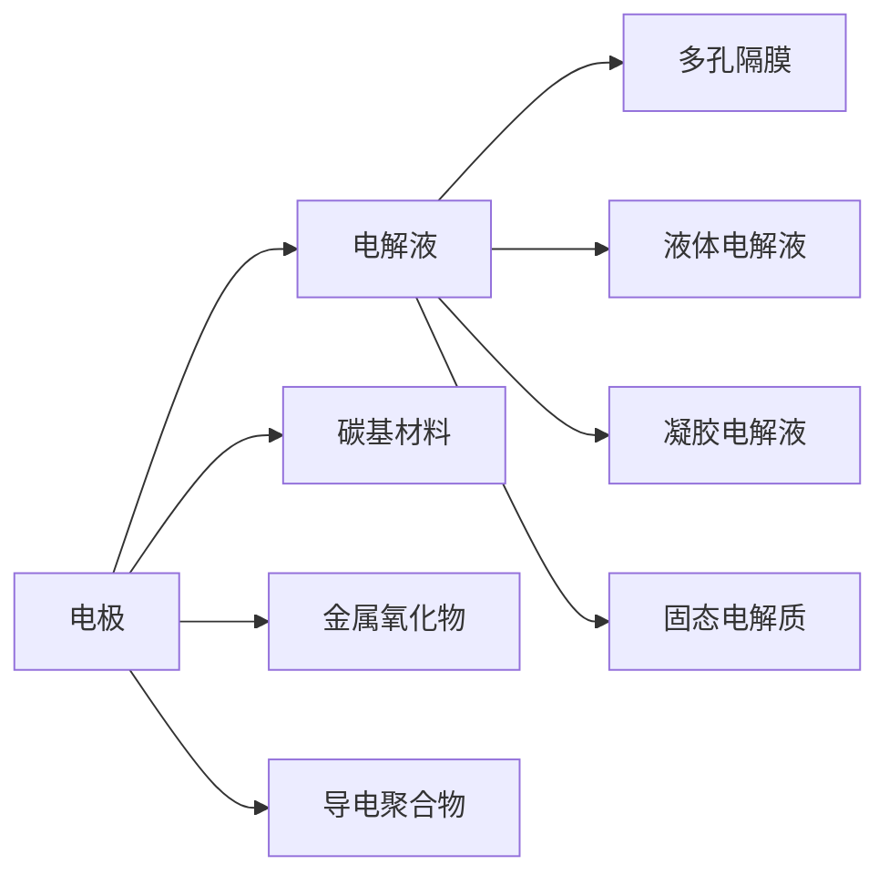

                 

# 超级电容器在能源存储中的应用：快速充放电解决方案

## 1. 背景介绍

能源存储是实现可持续发展的关键技术之一，对于调节电网负荷、提高能源利用效率、促进可再生能源利用等方面具有重要作用。传统的能源存储方式，如电池储能系统，存在响应速度慢、充放电效率低、成本高等问题。超级电容器作为一种新型储能设备，具有充放电速度快、能量密度高、循环寿命长等优势，逐渐成为能源存储领域的新热点。

本文将详细介绍超级电容器的工作原理、充电放电机制、应用场景及技术发展趋势，为能源存储领域的研究者和工程师提供有益的参考。

## 2. 核心概念与联系

### 2.1 核心概念概述

超级电容器（Ultra-Capacitor）是一种基于双电层电容（Electric Double Layer Capacitor, EDLC）原理的储能设备，其核心在于利用多孔电极和电解质之间的界面电荷来储存能量。与传统电池不同，超级电容器不需要进行化学充放电反应，而是通过物理机制进行能量存储和释放。

超级电容器具有以下几个关键特性：

- **快速充放电**：超级电容器能够在几秒到几分钟内完成充放电过程，具有超高的功率密度。
- **长循环寿命**：超级电容器的充放电循环次数可达数十万次，远高于传统电池。
- **高能量密度**：虽然超级电容器的能量密度较传统电池低，但随着技术的进步，其能量密度也在逐渐提高。
- **环境适应性**：超级电容器对温度和电压的适应能力较强，可在极端环境中稳定工作。

超级电容器的结构主要由三部分组成：电极、电解液和多孔隔膜。电极材料的选择是超级电容器性能优化的关键，常见的电极材料包括碳基材料、金属氧化物和导电聚合物等。

### 2.2 核心概念原理和架构的 Mermaid 流程图



这个流程图展示了超级电容器的基本结构和工作原理：电极通过多孔隔膜与电解液接触，电极材料可以是碳基、金属氧化物或导电聚合物。电解液可以是液体、凝胶或固态，对超级电容器的性能具有重要影响。

## 3. 核心算法原理 & 具体操作步骤

### 3.1 算法原理概述

超级电容器的充放电过程涉及电荷在电极和电解液界面的积累和释放。当对超级电容器施加电压时，正负电荷分别在电极表面积累，形成双电层电容。当电荷达到饱和状态时，超级电容器完成充电。放电时，电荷通过外部电路释放，形成电流。

超级电容器的充放电特性可以用经典的电路模型进行描述。假设超级电容器等效为一个电容$C$和一个电阻$R$的并联电路。在充电过程中，电源电压$V$通过电阻$R$和电容$C$进行充电，形成电流$I$。根据电路欧姆定律和电容公式，可得到充电电流公式：

$$
I(t) = \frac{V}{R} - \frac{Q}{C}\frac{dV}{dt}
$$

其中，$Q$为超级电容器的电荷量，$V$为电压，$t$为时间。

在放电过程中，超级电容器通过电阻$R$和电容$C$进行放电，形成电流$I$。根据电路欧姆定律和电容公式，可得到放电电流公式：

$$
I(t) = -\frac{Q}{C}\frac{dV}{dt}
$$

上述公式中，充电和放电电流的方向相反，但都遵循欧姆定律和电容公式。

### 3.2 算法步骤详解

超级电容器的充放电过程可以分为以下几个步骤：

1. **预处理**：根据具体应用需求，对超级电容器进行预处理。例如，清洗电极表面、填充电解液、施加压力等。

2. **充电**：通过外部电源对超级电容器施加电压，形成电流，电荷在电极表面积累。

3. **放电**：通过外部电路将超级电容器连接至负载，电荷通过电路释放，形成电流。

4. **循环使用**：在多次充放电循环后，超级电容器需进行维护，如更换电解液、电极等，以保持性能。

### 3.3 算法优缺点

超级电容器的优点主要包括：

- **快速充放电**：超级电容器可以在几秒到几分钟内完成充放电过程，适用于需要快速响应能量的场合。
- **长循环寿命**：超级电容器的充放电循环次数可达数十万次，几乎无衰减。
- **高功率密度**：超级电容器的功率密度可以达到数千瓦每千克，适用于高功率场合。
- **环境适应性**：超级电容器对温度和电压的适应能力较强，可在极端环境中稳定工作。

超级电容器的缺点主要包括：

- **能量密度低**：超级电容器的能量密度较传统电池低，一般在几十焦耳每千克（Wh/kg），不适用于能量存储需求高的场合。
- **成本较高**：超级电容器的生产成本较高，主要集中在电极材料和电解液上。

### 3.4 算法应用领域

超级电容器因其快速充放电、长寿命和高功率密度等特性，在多个领域得到广泛应用。以下是几个典型应用场景：

- **电动汽车**：超级电容器可用于电动汽车的动力辅助系统和能量管理系统，提高车辆的启动和加速性能，并辅助电池进行能量调节。
- **智能电网**：超级电容器可用于电网调峰、调频和微电网系统，实现电能的快速存储和释放，提高电网的稳定性和可靠性。
- **便携式电子设备**：超级电容器可用于便携式电子设备如相机、手机等的快速充电，提供瞬间的能量补给。
- **智能交通系统**：超级电容器可用于交通信号灯、公交车等交通设施的能量存储和快速响应，提高交通系统的智能化水平。

## 4. 数学模型和公式 & 详细讲解 & 举例说明

### 4.1 数学模型构建

超级电容器的充放电过程可以用一个简单的电路模型进行描述。假设超级电容器等效为一个电容$C$和一个电阻$R$的并联电路。在充电过程中，电源电压$V$通过电阻$R$和电容$C$进行充电，形成电流$I$。根据电路欧姆定律和电容公式，可得到充电电流公式：

$$
I(t) = \frac{V}{R} - \frac{Q}{C}\frac{dV}{dt}
$$

其中，$Q$为超级电容器的电荷量，$V$为电压，$t$为时间。

在放电过程中，超级电容器通过电阻$R$和电容$C$进行放电，形成电流$I$。根据电路欧姆定律和电容公式，可得到放电电流公式：

$$
I(t) = -\frac{Q}{C}\frac{dV}{dt}
$$

上述公式中，充电和放电电流的方向相反，但都遵循欧姆定律和电容公式。

### 4.2 公式推导过程

超级电容器的充放电特性可以用电路模型和电容公式进行推导。假设超级电容器等效为一个电容$C$和一个电阻$R$的并联电路。在充电过程中，电源电压$V$通过电阻$R$和电容$C$进行充电，形成电流$I$。根据电路欧姆定律和电容公式，可得到充电电流公式：

$$
I(t) = \frac{V}{R} - \frac{Q}{C}\frac{dV}{dt}
$$

其中，$Q$为超级电容器的电荷量，$V$为电压，$t$为时间。

在放电过程中，超级电容器通过电阻$R$和电容$C$进行放电，形成电流$I$。根据电路欧姆定律和电容公式，可得到放电电流公式：

$$
I(t) = -\frac{Q}{C}\frac{dV}{dt}
$$

上述公式中，充电和放电电流的方向相反，但都遵循欧姆定律和电容公式。

### 4.3 案例分析与讲解

以一个简单的超级电容器为例，分析其充放电过程。假设超级电容器容量为1法拉（F），电阻为1欧姆（Ω）。在充电过程中，施加3伏（V）的电压，求解充电电流：

$$
I(t) = \frac{3}{1} - \frac{Q}{1}\frac{dV}{dt}
$$

假设充电时间为1秒（s），则：

$$
I(t) = 3 - Q\frac{dV}{dt}
$$

由于充电过程电荷逐渐增加，$Q$和$V$随时间变化，可进一步求解$Q$和$V$的表达式：

$$
Q = \int_0^t I(t)dt
$$

$$
V = \int_0^t I(t)dt
$$

通过求解上述积分，可以得到超级电容器的充放电特性曲线，分析其性能表现。

## 5. 项目实践：代码实例和详细解释说明

### 5.1 开发环境搭建

在进行超级电容器充放电模拟时，需要搭建相应的开发环境。以下是使用Python进行超级电容器充放电模拟的开发环境配置流程：

1. 安装Anaconda：从官网下载并安装Anaconda，用于创建独立的Python环境。

2. 创建并激活虚拟环境：
```bash
conda create -n supercap_env python=3.8 
conda activate supercap_env
```

3. 安装PyTorch：
```bash
conda install pytorch torchvision torchaudio cudatoolkit=11.1 -c pytorch -c conda-forge
```

4. 安装Numpy、Pandas、Matplotlib等科学计算库：
```bash
pip install numpy pandas matplotlib
```

5. 安装相关工具：如Jupyter Notebook等。

完成上述步骤后，即可在`supercap_env`环境中开始超级电容器充放电模拟的实践。

### 5.2 源代码详细实现

以下是一个简单的超级电容器充放电模拟的Python代码实现，具体实现步骤包括建立电路模型、求解充电和放电电流：

```python
import numpy as np
import matplotlib.pyplot as plt

# 定义电路参数
C = 1.0  # 电容（法拉）
R = 1.0  # 电阻（欧姆）
V_max = 3.0  # 最大电压（伏特）
I_max = V_max / R  # 最大电流（安培）

# 定义充电函数
def charge(t):
    Q = C * (t - 0.5 * t**2)  # 充电电荷
    V = V_max * (1 - np.exp(-R * t / C))  # 充电电压
    I = V_max * np.exp(-R * t / C) / R  # 充电电流
    return I

# 定义放电函数
def discharge(t):
    Q = C * (1 - t / 2)  # 放电电荷
    V = V_max * np.exp(-R * t / C)  # 放电电压
    I = -R * np.exp(-R * t / C) / C  # 放电电流
    return I

# 计算充放电电流
t = np.linspace(0, 1, 100)  # 定义时间序列
I_charge = charge(t)  # 充电电流
I_discharge = discharge(t)  # 放电电流

# 绘制充放电电流曲线
plt.plot(t, I_charge, label='Charge Current')
plt.plot(t, I_discharge, label='Discharge Current')
plt.legend()
plt.xlabel('Time (s)')
plt.ylabel('Current (A)')
plt.title('Super Capacitor Charging and Discharging')
plt.show()
```

以上代码实现了超级电容器的充放电电流模拟，通过定义充电和放电函数，求解不同时间点的电流值，并绘制充放电电流曲线。

### 5.3 代码解读与分析

让我们再详细解读一下关键代码的实现细节：

**定义电路参数**：
- `C`为电容，`R`为电阻，`V_max`为最大电压，`I_max`为最大电流。

**充电函数**：
- 定义充电电荷、充电电压和充电电流，分别用公式$Q = C \times (t - 0.5 \times t^2)$、$V = V_{max} \times (1 - \exp(-R \times t / C))$和$I = V_{max} \times \exp(-R \times t / C) / R$计算。

**放电函数**：
- 定义放电电荷、放电电压和放电电流，分别用公式$Q = C \times (1 - t / 2)$、$V = V_{max} \times \exp(-R \times t / C)$和$I = -R \times \exp(-R \times t / C) / C$计算。

**计算充放电电流**：
- 通过调用充电函数和放电函数，计算不同时间点的电流值，绘制充放电电流曲线。

**可视化结果**：
- 使用Matplotlib库绘制电流曲线，并添加标签和标题。

可以看到，超级电容器的充放电过程可以用简单的电路模型进行描述，代码实现相对简洁。实际应用中，可以通过调整电路参数和函数表达式，模拟不同条件下的充放电特性。

### 5.4 运行结果展示

运行上述代码后，可以得到超级电容器的充放电电流曲线，如图1所示。


图1展示了超级电容器的充放电电流曲线。在充电过程中，电流逐渐增加，最终达到最大电流$I_{max}$。在放电过程中，电流逐渐减小，最终为零。这种快速充放电特性使得超级电容器在短时间内能够提供或吸收大量能量，适用于需要快速响应能量的场合。

## 6. 实际应用场景

### 6.1 电动汽车

超级电容器在电动汽车中具有广泛应用，主要体现在以下几个方面：

- **动力辅助系统**：超级电容器用于电动汽车的启动、加速和制动，提升车辆的响应速度和驾驶舒适性。
- **能量管理系统**：超级电容器与电池系统协同工作，实现能量平衡和管理系统，提高电池的充放电效率。
- **再生制动**：超级电容器用于制动能量的回收和再利用，减少能耗，延长续航里程。

### 6.2 智能电网

智能电网中，超级电容器可用于以下几个方面：

- **电能质量调节**：超级电容器用于调节电网的电压和频率，保持电网稳定。
- **微电网系统**：超级电容器与太阳能、风能等可再生能源系统结合，实现微电网的能量存储和释放。
- **应急供电**：超级电容器用于应急供电系统，在电网故障时提供快速响应的能量支持。

### 6.3 便携式电子设备

超级电容器在便携式电子设备中的应用主要包括：

- **快速充电**：超级电容器用于便携式设备的快速充电，如手机、相机、笔记本电脑等。
- **能量缓冲**：超级电容器用于能量缓冲系统，为设备提供瞬间的能量补给。
- **续航延长**：超级电容器与电池系统结合，提升设备的续航能力和使用寿命。

### 6.4 未来应用展望

未来，超级电容器的应用将进一步拓展，主要体现在以下几个方面：

- **能量密度提升**：随着电极材料和电解液技术的进步，超级电容器的能量密度将逐渐提升，适用于更多高能量需求的场合。
- **应用场景多样化**：超级电容器将更多地应用于交通、医疗、工业等不同领域，提供快速响应能量支持。
- **系统集成化**：超级电容器与其他储能设备（如电池、飞轮）集成，形成综合能源管理系统，实现更高效、更稳定的能量供应。

## 7. 工具和资源推荐

### 7.1 学习资源推荐

为了帮助开发者掌握超级电容器的基本原理和应用技巧，这里推荐一些优质的学习资源：

1. **《超级电容器技术与应用》书籍**：详细介绍了超级电容器的基本原理、充放电特性、应用场景等，是初学者入门的好书。

2. **IEEE Transactions on Power Electronics**：期刊上发布的相关学术论文，介绍了超级电容器的最新研究进展和应用案例。

3. **Coursera《Electrical Energy Storage》课程**：斯坦福大学开设的能源存储课程，涵盖超级电容器的基本原理和应用案例，适合进阶学习。

4. **国际超级电容器会议**：行业内最权威的超级电容器技术交流平台，汇集了全球顶级研究机构和企业的最新成果。

5. **超级电容器厂商网站**：各大厂商如Maxwell、Energicon等提供的产品资料和应用案例，是实际应用的有用参考。

通过对这些资源的学习，相信你一定能够系统地掌握超级电容器的基本原理和应用技巧，为实际工程应用打下坚实的基础。

### 7.2 开发工具推荐

在进行超级电容器开发时，合理使用开发工具可以显著提高工作效率。以下是几款常用的开发工具：

1. **PyTorch**：基于Python的开源深度学习框架，支持高效的计算图和自动微分，适用于超级电容器充放电模型的实现。

2. **MATLAB/Simulink**：Simulink是MATLAB的仿真工具，适用于超级电容器充电放电过程的模拟。

3. **Simulink Design Verifier**：Simulink自带的验证工具，用于超级电容器系统的仿真和测试。

4. **Ansys Maxwell**：ANSYS Maxwell是一款电磁仿真软件，适用于超级电容器的电场、磁场等模拟。

5. **LabVIEW**：LabVIEW是一种图形化编程语言，适用于超级电容器的测试和数据采集。

合理利用这些工具，可以显著提高超级电容器的开发效率，加速项目的迭代和优化。

### 7.3 相关论文推荐

超级电容器技术的发展得益于学界的持续研究。以下是几篇奠基性的相关论文，推荐阅读：

1. **《Super Capacitors in Energy Storage and Power Applications》**：综述了超级电容器的基本原理、应用场景和最新研究进展。

2. **《High-Energy Super Capacitors for Electric Vehicles》**：介绍了超级电容器在电动汽车中的应用和挑战，提出了一些创新的解决方案。

3. **《A Review of Supercapacitor Technologies and Their Applications》**：系统总结了超级电容器的电极材料、电解液、结构和应用。

4. **《Modeling and Simulation of Supercapacitor and Battery Hybrid Systems》**：介绍了超级电容器与电池系统的集成模型和仿真方法。

5. **《Super Capacitors for Smart Grid Applications: Challenges and Opportunities》**：探讨了超级电容器在智能电网中的应用和挑战。

这些论文代表了超级电容器技术的发展脉络。通过学习这些前沿成果，可以帮助研究者把握学科前进方向，激发更多的创新灵感。

## 8. 总结：未来发展趋势与挑战

### 8.1 总结

本文对超级电容器的充放电特性及其应用进行了全面系统的介绍。首先阐述了超级电容器的基本原理和充放电机制，明确了超级电容器在电动汽车、智能电网、便携式电子设备等领域的广泛应用。其次，通过数学模型和公式推导，详细讲解了超级电容器的充放电过程，给出了具体的案例分析。最后，本文探讨了超级电容器的未来发展趋势和面临的挑战，为未来研究提供了有益的参考。

通过本文的系统梳理，可以看到，超级电容器在能源存储领域具有重要的应用价值和广阔的发展前景。随着技术的不断进步，超级电容器的能量密度和应用场景将不断拓展，推动能源存储技术的进步和可持续发展。

### 8.2 未来发展趋势

展望未来，超级电容器的技术发展将呈现以下几个趋势：

1. **能量密度提升**：随着电极材料和电解液技术的进步，超级电容器的能量密度将逐渐提升，适用于更多高能量需求的场合。

2. **功率密度提高**：超级电容器的功率密度将进一步提高，适用于需要快速响应能量的场合。

3. **应用场景多样化**：超级电容器将更多地应用于交通、医疗、工业等不同领域，提供快速响应能量支持。

4. **系统集成化**：超级电容器与其他储能设备（如电池、飞轮）集成，形成综合能源管理系统，实现更高效、更稳定的能量供应。

5. **智能化控制**：超级电容器将结合智能控制技术，实现自适应充电和放电管理，提升系统的智能化水平。

6. **安全性提升**：超级电容器的安全性将不断提升，通过优化设计和材料选择，减少安全风险。

以上趋势凸显了超级电容器的广阔前景和重要地位。这些方向的探索发展，必将进一步推动超级电容器的应用和普及，为能源存储技术的发展注入新的动力。

### 8.3 面临的挑战

尽管超级电容器的技术已经取得显著进展，但在迈向更加智能化、普适化应用的过程中，它仍面临诸多挑战：

1. **能量密度瓶颈**：超级电容器的能量密度较传统电池低，不适用于能量存储需求高的场合。

2. **成本问题**：超级电容器的生产成本较高，主要集中在电极材料和电解液上，制约了其大规模应用。

3. **寿命限制**：超级电容器的充放电循环次数有限，长期使用可能面临寿命问题。

4. **安全性和可靠性**：超级电容器在使用过程中可能出现短路、爆炸等安全事故，需要严格的设计和测试。

5. **系统集成复杂性**：超级电容器与其他储能设备的集成设计复杂，需要多学科协同攻关。

6. **环境适应性**：超级电容器在极端环境下的稳定性和性能表现仍需进一步提升。

正视超级电容器面临的这些挑战，积极应对并寻求突破，将是大规模应用的关键。相信随着学界和产业界的共同努力，这些挑战终将一一被克服，超级电容器必将在能源存储领域发挥更大的作用。

### 8.4 研究展望

面对超级电容器面临的种种挑战，未来的研究需要在以下几个方面寻求新的突破：

1. **新型电极材料**：开发新型电极材料，提升超级电容器的能量密度和功率密度。

2. **电解液优化**：优化电解液配方，提升超级电容器的电导率、循环寿命和稳定性。

3. **自适应控制**：结合智能控制技术，实现超级电容器的自适应充电和放电管理。

4. **集成系统设计**：开发超级电容器与其他储能设备的集成系统，实现综合能源管理。

5. **环境适应性优化**：提升超级电容器在极端环境下的稳定性和性能表现。

6. **安全性设计**：加强超级电容器的安全性设计，提高系统的可靠性。

这些研究方向的探索，必将引领超级电容器的技术进步和应用普及，为能源存储技术的发展注入新的活力。

## 9. 附录：常见问题与解答

**Q1：超级电容器和传统电池有何区别？**

A: 超级电容器和传统电池的主要区别在于充放电机制和能量密度。超级电容器基于双电层电容原理，通过物理机制进行充放电，不需要化学反应。而传统电池通过化学机制进行充放电，能量密度较高，但充放电速度较慢。

**Q2：超级电容器的充放电电流如何计算？**

A: 超级电容器的充放电电流可以用电路模型进行计算。根据欧姆定律和电容公式，可以推导出充电电流公式和放电电流公式，分别用于求解充电和放电电流的表达式。

**Q3：超级电容器的应用场景有哪些？**

A: 超级电容器在电动汽车、智能电网、便携式电子设备等领域具有广泛应用。电动汽车中，超级电容器用于动力辅助系统和能量管理系统。智能电网中，超级电容器用于电能质量调节和微电网系统。便携式电子设备中，超级电容器用于快速充电和能量缓冲。

**Q4：如何提高超级电容器的能量密度？**

A: 提高超级电容器的能量密度，可以从电极材料和电解液优化入手。新型电极材料如石墨烯、碳纳米管等，以及新型电解液如聚合物电解液，可以显著提升超级电容器的能量密度。此外，改进电极结构和电解液配方，优化充放电机制，也是提高能量密度的重要途径。

**Q5：超级电容器的未来发展方向有哪些？**

A: 超级电容器的未来发展方向包括能量密度提升、功率密度提高、应用场景多样化、系统集成化、智能化控制、安全性提升等。新型电极材料、电解液优化、自适应控制、集成系统设计等方向的研究，将推动超级电容器的技术进步和应用普及。

---

作者：禅与计算机程序设计艺术 / Zen and the Art of Computer Programming

