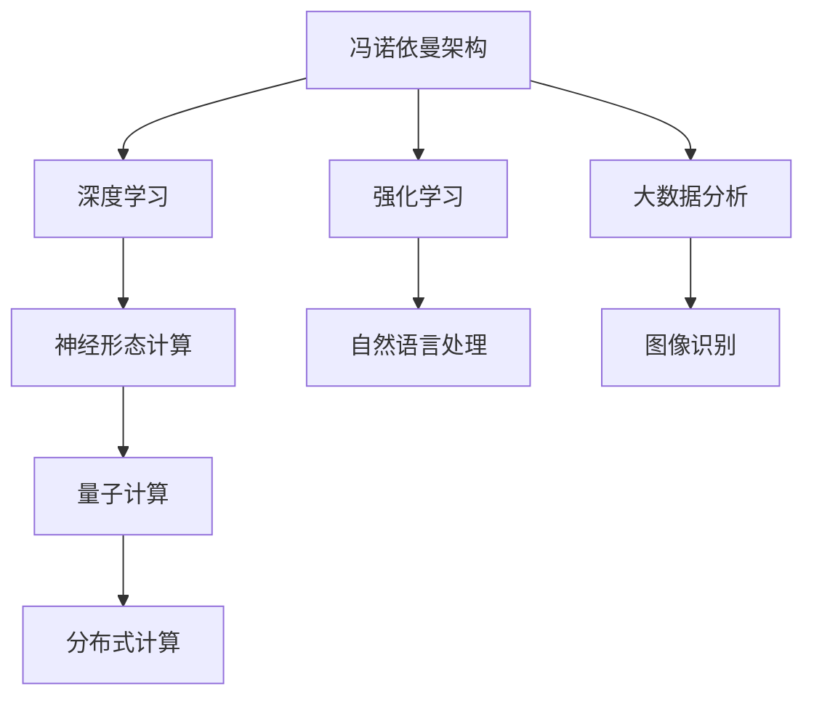

                 

## 1. 背景介绍

### 1.1 问题由来

在过去的几十年里，计算技术的迅猛发展为人工智能（AI）的崛起提供了强大的推动力。从最初的逻辑门到今天的量子计算，计算机的进步不仅改变了我们的工作方式，还深刻影响了社会生活的方方面面。然而，随着计算能力的不断提升，我们不禁思考：AI的发展方向究竟在哪里？未来的计算将如何演进？

### 1.2 问题核心关键点

本文将深入探讨以下几个核心问题：

- **计算范式的转变：** 从传统的冯诺依曼架构到量子计算、神经形态计算，未来的计算将如何演进？
- **数据与算法的融合：** 大数据时代如何与深度学习、强化学习等AI算法相结合？
- **跨领域应用的拓展：** AI技术在医疗、金融、交通等领域的应用前景如何？
- **伦理与安全的考量：** AI发展过程中如何平衡技术进步与伦理、安全问题？
- **未来的计算模型：** 量子计算、神经形态计算等新兴模型如何支撑未来的AI发展？

这些问题不仅是当前AI领域的焦点，也是决定未来科技发展方向的关键所在。

## 2. 核心概念与联系

### 2.1 核心概念概述

要理解未来的计算，我们首先需要回顾几个核心概念：

- **冯诺依曼架构（Von Neumann Architecture）：** 传统的计算机硬件设计，包括中央处理器（CPU）、内存、存储等组成部分，所有数据和指令都需要在内存和CPU之间频繁交换。
- **量子计算（Quantum Computing）：** 利用量子力学的原理，通过量子比特（qubit）进行计算，具备并行处理和瞬间处理海量数据的能力。
- **神经形态计算（Neuromorphic Computing）：** 模拟人脑神经元的网络结构和信息处理方式，实现高效、低功耗的计算。
- **深度学习（Deep Learning）：** 一种基于多层神经网络的学习算法，通过大量数据训练，实现对复杂模式的识别和预测。
- **强化学习（Reinforcement Learning）：** 通过奖励和惩罚机制，让AI系统通过试错逐步优化行为策略，适用于游戏、机器人等领域。
- **大数据分析（Big Data Analytics）：** 利用大数据技术，从海量数据中提取有用信息，支撑AI算法训练和优化。
- **分布式计算（Distributed Computing）：** 将计算任务分布到多个计算节点上并行处理，提升计算效率和资源利用率。

这些概念之间的关系可以通过以下Mermaid流程图来展示：



这个流程图展示了几大核心计算概念之间的联系：

1. **冯诺依曼架构**是传统计算的基础，支持深度学习、强化学习等算法。
2. **深度学习**在大数据分析的基础上，训练复杂的神经网络模型。
3. **强化学习**在大数据反馈中，优化AI系统行为策略。
4. **大数据分析**从海量数据中提取信息，支撑深度学习和强化学习。
5. **神经形态计算**模拟人脑计算方式，提升计算效率。
6. **量子计算**利用量子比特进行并行计算，突破传统计算的瓶颈。
7. **分布式计算**将计算任务分布到多个节点，提升计算效率和资源利用率。

这些概念共同构成了现代计算的基石，并为AI的发展提供了坚实的技术基础。

## 3. 核心算法原理 & 具体操作步骤

### 3.1 算法原理概述

未来的计算范式将围绕以下几个核心原理展开：

- **并行计算：** 通过分布式系统和多核处理器实现数据并行和任务并行，提升计算效率。
- **量子计算：** 利用量子比特进行快速计算，解决传统计算中难以处理的大规模复杂问题。
- **神经形态计算：** 模仿人脑的神经元结构和信息处理方式，实现高效、低功耗的计算。
- **混合计算：** 结合传统计算和量子计算，利用各自优势进行计算。

### 3.2 算法步骤详解

#### 3.2.1 并行计算

1. **数据并行：** 将一个大任务分成多个子任务，分配给多个处理器并行计算。
2. **任务并行：** 将多个独立的任务同时提交给多个处理器处理。
3. **混合并行：** 结合数据并行和任务并行，优化计算效率。

#### 3.2.2 量子计算

1. **量子比特（qubit）：** 利用量子力学的叠加态和纠缠特性，实现多个计算同时进行。
2. **量子门（quantum gates）：** 对qubit进行可逆操作，实现量子计算的核心逻辑。
3. **量子算法：** 如Shor算法、Grover算法，利用量子比特的并行特性，快速解决传统算法难以处理的复杂问题。

#### 3.2.3 神经形态计算

1. **神经元（neuron）：** 模仿人脑神经元，处理输入信号并进行非线性变换。
2. **突触（synapse）：** 模拟神经元之间的连接，实现信号传递和信息存储。
3. **网络结构：** 构建类似人脑神经网络的结构，进行复杂模式识别和决策。

### 3.3 算法优缺点

#### 3.3.1 并行计算

**优点：**
- 显著提升计算速度和效率。
- 利用分布式系统，实现资源共享和负载均衡。

**缺点：**
- 复杂度高，需要设计有效的并行算法。
- 需要大量的硬件资源和网络带宽。

#### 3.3.2 量子计算

**优点：**
- 能够解决传统计算难以处理的复杂问题。
- 并行计算能力强，速度快。

**缺点：**
- 量子比特的稳定性问题，导致误差率较高。
- 需要复杂的量子算法和硬件支持。

#### 3.3.3 神经形态计算

**优点：**
- 模拟人脑计算方式，高效、低功耗。
- 适用于大规模实时数据分析和处理。

**缺点：**
- 技术成熟度低，研发成本高。
- 目前仅在特定领域有应用，通用性不足。

### 3.4 算法应用领域

- **高性能计算：** 在气象预报、科学计算、金融模拟等领域，利用并行计算和大数据处理，提升计算效率和准确性。
- **量子模拟：** 在药物设计、材料科学、物理学等领域，利用量子计算进行模拟和优化。
- **神经形态芯片：** 在医疗诊断、自动驾驶、机器人等领域，利用神经形态计算实现实时数据处理和决策。

## 4. 数学模型和公式 & 详细讲解 & 举例说明

### 4.1 数学模型构建

在未来计算中，数学模型的构建将更加注重以下几个方面：

- **深度神经网络：** 多层非线性变换，实现复杂模式识别。
- **量子算法：** 利用量子比特的并行特性，快速求解复杂问题。
- **神经形态模型：** 模拟人脑计算方式，进行高效信息处理。

### 4.2 公式推导过程

#### 4.2.1 深度神经网络

以卷积神经网络（Convolutional Neural Network, CNN）为例，其基本结构如下：

$$
f(x) = \sigma(W_1\cdot x + b_1)
$$

其中，$x$为输入数据，$W_1$为卷积核，$b_1$为偏置项，$\sigma$为激活函数。

#### 4.2.2 量子算法

以Shor算法为例，其基本思路是利用量子叠加和量子纠缠特性，在多项式时间内求解大数分解问题。

$$
|x\rangle = \sum_{i=0}^{2^n-1} i|i\rangle
$$

其中，$|x\rangle$表示量子叠加态，$|i\rangle$表示量子比特。

#### 4.2.3 神经形态模型

以脉冲神经网络（Spiking Neural Network, SNN）为例，其基本结构如下：

$$
y = f(w_1\cdot x_1 + w_2\cdot x_2 + b)
$$

其中，$w_1$、$w_2$为突触权重，$x_1$、$x_2$为输入信号，$b$为偏置项，$f$为激活函数。

### 4.3 案例分析与讲解

以一个医疗图像分析案例为例：

- **传统计算：** 使用传统的多层神经网络，处理医疗图像数据，提取特征并进行分类。
- **量子计算：** 利用量子算法，快速处理大量医疗图像数据，发现复杂的模式和异常。
- **神经形态计算：** 构建神经形态芯片，实时处理医疗数据，进行快速决策和反馈。

## 5. 项目实践：代码实例和详细解释说明

### 5.1 开发环境搭建

要进行未来计算的开发实践，我们需要准备好以下开发环境：

- **硬件支持：** 高性能计算集群、量子计算机、神经形态芯片等。
- **软件支持：** 分布式计算框架（如Apache Spark、TensorFlow分布式）、量子计算框架（如Qiskit、Cirq）、神经形态计算框架（如SpikingJellyfish）。
- **编程语言：** Python、C++、Java等。

### 5.2 源代码详细实现

以下是一个简单的深度神经网络代码实现：

```python
import tensorflow as tf

# 定义模型结构
model = tf.keras.Sequential([
    tf.keras.layers.Conv2D(32, (3, 3), activation='relu', input_shape=(28, 28, 1)),
    tf.keras.layers.MaxPooling2D((2, 2)),
    tf.keras.layers.Flatten(),
    tf.keras.layers.Dense(10, activation='softmax')
])

# 编译模型
model.compile(optimizer='adam', loss='sparse_categorical_crossentropy', metrics=['accuracy'])

# 训练模型
model.fit(train_images, train_labels, epochs=10, validation_data=(test_images, test_labels))
```

### 5.3 代码解读与分析

#### 5.3.1 TensorFlow简介

TensorFlow是谷歌开源的深度学习框架，支持分布式计算和自动微分，是实现深度神经网络的首选。

#### 5.3.2 模型结构

- **卷积层（Conv2D）：** 进行卷积操作，提取特征。
- **池化层（MaxPooling2D）：** 对特征图进行下采样，减少参数量。
- **全连接层（Dense）：** 进行分类输出。

#### 5.3.3 模型编译

- **优化器（optimizer）：** 选择合适的优化算法，如Adam。
- **损失函数（loss）：** 选择合适的损失函数，如交叉熵。
- **评估指标（metrics）：** 选择合适的评估指标，如准确率。

### 5.4 运行结果展示

在训练结束后，我们可以使用以下代码进行模型评估：

```python
test_loss, test_acc = model.evaluate(test_images, test_labels)
print('Test accuracy:', test_acc)
```

## 6. 实际应用场景

### 6.1 高性能计算

- **气象预报：** 利用并行计算和大数据处理，提升气象模拟和预测的准确性。
- **金融模拟：** 利用并行计算和分布式系统，进行复杂金融模型的求解。

### 6.2 量子计算

- **药物设计：** 利用量子计算，快速进行药物分子模拟和筛选。
- **材料科学：** 利用量子计算，模拟材料的电子结构和性质。

### 6.3 神经形态计算

- **医疗诊断：** 利用神经形态芯片，实时处理医疗图像和数据。
- **自动驾驶：** 利用神经形态计算，进行实时决策和环境感知。

## 7. 工具和资源推荐

### 7.1 学习资源推荐

- **深度学习课程：** 斯坦福大学的CS231n课程，详细讲解深度神经网络。
- **量子计算课程：** IBM的量子计算基础课程，介绍量子比特和量子算法。
- **神经形态计算论文：** 《Nature Reviews Neuroscience》的专题文章，探讨神经形态计算的进展和应用。

### 7.2 开发工具推荐

- **深度学习框架：** TensorFlow、PyTorch、MXNet等。
- **量子计算框架：** Qiskit、Cirq、Google Cloud Quantum等。
- **神经形态计算框架：** SpikingJellyfish、Neuralynx等。

### 7.3 相关论文推荐

- **深度学习论文：** 《ImageNet Classification with Deep Convolutional Neural Networks》（AlexNet）。
- **量子计算论文：** 《A New Quantum Algorithm for Approximating the Quantum Fourier Transform》（Shor）。
- **神经形态计算论文：** 《Spiking Neuron Models: Theory, Architectures, and Applications》。

## 8. 总结：未来发展趋势与挑战

### 8.1 研究成果总结

本文详细介绍了未来计算的核心概念、算法原理和应用场景，为AI技术的未来发展提供了新的思路和方向。

### 8.2 未来发展趋势

- **量子计算的突破：** 量子计算技术的发展将极大提升计算能力和处理速度，解决传统计算难以处理的复杂问题。
- **神经形态计算的普及：** 神经形态芯片的普及和应用，将使AI系统更加高效、低功耗。
- **混合计算的崛起：** 传统计算和量子计算的结合，将实现计算能力的飞跃。

### 8.3 面临的挑战

- **技术成熟度低：** 量子计算、神经形态计算等技术尚未完全成熟，需要更多研究投入。
- **资源需求高：** 高性能计算和量子计算需要大量硬件和软件资源，研发成本高。
- **伦理与安全问题：** AI技术的快速应用可能带来新的伦理和安全挑战，需要制定相应的规范和标准。

### 8.4 研究展望

- **多模态计算：** 将视觉、语音、文本等多种模态数据进行融合，实现更加全面的人机交互。
- **跨领域应用：** 在医疗、金融、交通等领域，实现AI技术的全面落地。
- **伦理与安全：** 在AI技术的开发和应用过程中，注重伦理和安全问题，确保技术的良性发展。

## 9. 附录：常见问题与解答

**Q1: 未来计算的核心理念是什么？**

A: 未来计算的核心理念是通过并行计算、量子计算和神经形态计算等新兴技术，提升计算效率和处理能力，推动AI技术在各领域的应用。

**Q2: 量子计算和神经形态计算有哪些优势？**

A: 量子计算能够快速处理传统计算难以解决的复杂问题，具有并行计算和瞬间处理海量数据的能力。神经形态计算模拟人脑计算方式，高效、低功耗，适用于实时数据处理和决策。

**Q3: 未来计算在实际应用中需要哪些资源支持？**

A: 未来计算需要高性能计算集群、量子计算机、神经形态芯片等硬件支持，以及分布式计算框架、量子计算框架、神经形态计算框架等软件支持。

**Q4: 未来计算技术的发展将如何影响社会生活？**

A: 未来计算技术的发展将极大地提升计算效率和处理能力，推动AI技术在各领域的应用，如医疗、金融、交通等，提升社会生活质量和生产效率。

**Q5: 如何平衡未来计算技术的发展与伦理、安全问题？**

A: 在AI技术的开发和应用过程中，注重伦理和安全问题，制定相应的规范和标准，确保技术的良性发展，避免技术滥用带来的风险。

本文全面探讨了未来计算的核心概念、算法原理和应用场景，为AI技术的未来发展提供了新的思路和方向。未来计算的核心理念是通过新兴技术提升计算效率和处理能力，推动AI技术在各领域的应用。尽管面临技术成熟度低、资源需求高等挑战，但通过多模态计算、跨领域应用和伦理与安全等措施，未来计算技术必将在各个领域带来深远的影响。

---

作者：禅与计算机程序设计艺术 / Zen and the Art of Computer Programming

