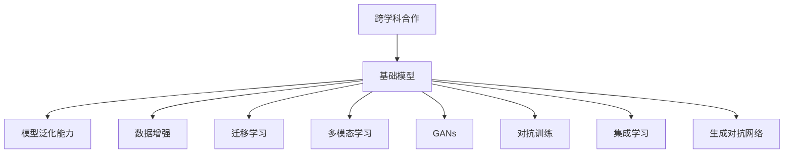

                 

# 跨学科合作与基础模型研究

## 1. 背景介绍

### 1.1 问题由来

当前，人工智能(AI)技术在各行业领域的广泛应用，已经对传统业务模式造成了深刻影响。然而，尽管AI技术发展迅猛，但仍然存在诸多挑战。如何在更复杂的场景下实现AI应用的突破，成为学术界和工业界共同关注的焦点。

### 1.2 问题核心关键点

在推动AI技术向前发展过程中，跨学科合作与基础模型研究扮演着至关重要的角色。一方面，跨学科合作能够整合不同领域的知识和技术优势，激发创新的火花，推动AI技术的深度发展。另一方面，基础模型研究则专注于构建具备广泛通用性和高效泛化能力的AI模型，为各种应用场景提供底层支撑。

## 2. 核心概念与联系

### 2.1 核心概念概述

为更好地理解跨学科合作与基础模型研究的精髓，本节将介绍几个核心概念：

- **跨学科合作(Interdisciplinary Collaboration)**：指不同学科领域的专家、研究人员、工程师等跨界合作，共同攻克复杂AI问题，推动技术进步。跨学科合作不仅包括不同学科间的知识交流，还包括思维方式的融合，为AI研究带来全新的视角和方法。

- **基础模型(Fundamental Model)**：指在大规模数据上训练、在多种任务上表现优异的基本AI模型，具备较强的泛化能力和适应性。这些模型在特定领域应用上可以作为起点，通过微调等技术进行适应性优化，直接或间接地服务于多个AI应用场景。

- **模型泛化能力(Generalization Capability)**：指模型在不同数据分布和任务场景中保持良好性能的能力。高质量的基础模型需要具备较强的泛化能力，以应对数据和场景的多样性变化。

- **数据增强(Data Augmentation)**：指通过对已有数据进行变换、扩充，提高模型对新数据的适应能力。数据增强是提升模型泛化能力的重要手段。

- **迁移学习(Transfer Learning)**：指将一个领域学到的知识迁移到另一个领域的学习范式。通过迁移学习，基础模型可以在多个领域实现高效复用。

- **多模态学习(Multimodal Learning)**：指同时处理多种类型数据（如文本、图像、语音等）的AI模型。多模态学习可以显著提升AI模型对复杂场景的理解能力。

- **生成对抗网络(GANs)**：一种通过生成模型与判别模型对抗训练，生成高质量样本的技术。GANs可以用于生成新的数据样本，增强基础模型的训练数据。

- **对抗训练(Adversarial Training)**：指通过引入对抗样本进行训练，增强模型的鲁棒性，防止模型对特定输入敏感。

- **集成学习(Ensemble Learning)**：指通过组合多个模型进行预测，提高模型性能和鲁棒性。集成学习是提升基础模型效果的重要方法。

这些核心概念之间的逻辑关系可以通过以下Mermaid流程图来展示：



这个流程图展示了基础模型研究的核心概念及其之间的关系：

1. 跨学科合作是基础模型研究的起点，通过整合不同领域的知识和视角，推动模型的设计和优化。
2. 基础模型设计后，通过增强泛化能力、数据增强、迁移学习、多模态学习、GANs、对抗训练、集成学习等技术，提升模型的性能和适应性。
3. 最终构建出的基础模型可以作为多个AI应用场景的底层支撑。

## 3. 核心算法原理 & 具体操作步骤
### 3.1 算法原理概述

跨学科合作与基础模型研究的核心在于构建一个既具备广泛通用性，又能够适应特定应用场景的AI模型。这一过程涉及到多个学科领域知识的融合和技术手段的结合。

基础模型的构建通常包括以下几个关键步骤：

1. **数据收集**：在多个领域收集大量标注数据，涵盖文本、图像、语音等多种类型。

2. **模型设计**：选择合适的模型架构和训练算法，如卷积神经网络(CNN)、循环神经网络(RNN)、Transformer等，设计合理的网络层数和参数规模。

3. **预训练**：在大规模无标签数据上预训练模型，学习通用的语言表示和特征提取能力。

4. **微调**：在特定任务上对预训练模型进行微调，提升模型在该任务上的性能。

5. **部署与优化**：将微调后的模型部署到实际应用场景中，不断优化模型参数和训练过程，提升模型效果。

### 3.2 算法步骤详解

以构建一个文本分类模型为例，介绍基础模型构建的具体步骤：

**Step 1: 数据准备**

1. 收集文本数据集，并划分为训练集、验证集和测试集。
2. 对数据进行清洗、标注，生成标注数据集。

**Step 2: 模型选择与设计**

1. 选择适合文本分类的模型，如BERT、GPT等。
2. 设计模型的网络架构，包括输入层、隐藏层、输出层等。
3. 确定损失函数和优化算法，如交叉熵损失、Adam优化器等。

**Step 3: 预训练**

1. 在大规模无标签文本数据上预训练模型，学习语言表示和特征提取能力。
2. 设置适当的超参数，如学习率、批大小、迭代轮数等。

**Step 4: 微调**

1. 在标注数据集上进行微调，优化模型在特定任务上的性能。
2. 设置适当的超参数，如微调学习率、批大小、迭代轮数等。

**Step 5: 部署与优化**

1. 将微调后的模型部署到实际应用场景中，进行实时推理预测。
2. 不断优化模型参数和训练过程，提升模型效果。

### 3.3 算法优缺点

跨学科合作与基础模型研究具有以下优点：

1. 高效泛化：基础模型通过预训练获得了广泛的语言和特征表示，能够在多个任务上高效泛化，减少重复训练。
2. 跨领域复用：基础模型可以作为多种应用场景的底层支撑，通过微调适应特定任务。
3. 整合知识：跨学科合作能够整合不同领域的知识和技术，推动模型的深度发展。
4. 提升效果：通过跨学科合作，可以引入更多先验知识，提升模型的性能和鲁棒性。

同时，该方法也存在一些局限性：

1. 数据需求大：基础模型的构建需要大量标注数据，数据收集和标注成本较高。
2. 模型复杂：基础模型通常参数规模较大，训练和推理过程复杂，资源占用大。
3. 应用场景多：基础模型的泛化能力虽然强大，但在特定场景下可能需要进一步微调。
4. 理论挑战：跨学科合作需要跨越不同领域的知识壁垒，存在理论和方法的整合挑战。

尽管存在这些局限性，但就目前而言，跨学科合作与基础模型研究仍然是推动AI技术发展的重要手段。未来相关研究的重点在于如何进一步优化数据收集、模型设计、预训练和微调等环节，同时兼顾模型的参数高效和计算高效，以达到更高的性能和更低的成本。

### 3.4 算法应用领域

跨学科合作与基础模型研究已经在众多领域得到广泛应用，如：

- 自然语言处理(NLP)：基础模型如BERT、GPT等，在文本分类、情感分析、机器翻译等任务上取得了优异表现。
- 计算机视觉(CV)：基础模型如ResNet、Inception等，在图像分类、目标检测、人脸识别等任务上效果显著。
- 语音识别(SR)：基础模型如WaveNet、Tacotron等，在语音合成、语音识别等任务上表现出色。
- 机器人学(Robotics)：基础模型如DeepMind的AlphaGo等，在智能决策、自主导航等任务上推动了机器人技术的发展。
- 智能交通(ITS)：基础模型如AutoDrive等，在自动驾驶、交通管理等任务上提升了交通系统的智能化水平。

除了上述这些经典应用外，跨学科合作与基础模型研究还在医疗、教育、金融、能源等多个领域展示了其强大的应用潜力。

## 4. 数学模型和公式 & 详细讲解  
### 4.1 数学模型构建

假设基础模型为 $M_\theta$，其中 $\theta$ 为模型参数。假设训练集为 $D=\{(x_i,y_i)\}_{i=1}^N$，其中 $x_i$ 为输入，$y_i$ 为标签。训练目标是最大化模型在训练集上的准确率。

定义损失函数 $\mathcal{L}(\theta) = -\frac{1}{N} \sum_{i=1}^N \log P(y_i|x_i;\theta)$，其中 $P(y_i|x_i;\theta)$ 为模型在输入 $x_i$ 下的预测概率分布。

训练过程为：

$$
\theta \leftarrow \theta - \eta \nabla_{\theta}\mathcal{L}(\theta)
$$

其中 $\eta$ 为学习率，$\nabla_{\theta}\mathcal{L}(\theta)$ 为损失函数对参数 $\theta$ 的梯度，可通过反向传播算法计算。

### 4.2 公式推导过程

以文本分类为例，介绍损失函数的推导过程。

假设文本 $x_i$ 的长度为 $n$，模型 $M_\theta$ 在输入 $x_i$ 下的预测概率分布为 $P(y_i|x_i;\theta)$，则定义损失函数为：

$$
\mathcal{L}(\theta) = -\frac{1}{N} \sum_{i=1}^N \log P(y_i|x_i;\theta)
$$

其中 $y_i$ 为文本 $x_i$ 的标签，$P(y_i|x_i;\theta)$ 为模型在输入 $x_i$ 下的预测概率分布。

根据条件概率的定义，$P(y_i|x_i;\theta) = \frac{P(x_i,y_i;\theta)}{P(x_i;\theta)}$，其中 $P(x_i,y_i;\theta)$ 为联合概率分布，$P(x_i;\theta)$ 为边际概率分布。

则损失函数可进一步表示为：

$$
\mathcal{L}(\theta) = -\frac{1}{N} \sum_{i=1}^N [y_i \log P(y_i|x_i;\theta) + (1-y_i) \log P(y_i|x_i;\theta)]
$$

通过最大化上述损失函数，最小化模型在训练集上的预测误差，优化模型参数 $\theta$。

## 5. 项目实践：代码实例和详细解释说明
### 5.1 开发环境搭建

在进行基础模型研究时，我们需要准备好开发环境。以下是使用Python进行PyTorch开发的环境配置流程：

1. 安装Anaconda：从官网下载并安装Anaconda，用于创建独立的Python环境。

2. 创建并激活虚拟环境：
```bash
conda create -n pytorch-env python=3.8 
conda activate pytorch-env
```

3. 安装PyTorch：根据CUDA版本，从官网获取对应的安装命令。例如：
```bash
conda install pytorch torchvision torchaudio cudatoolkit=11.1 -c pytorch -c conda-forge
```

4. 安装TensorFlow：从官网下载并按照官方文档安装TensorFlow。

5. 安装各类工具包：
```bash
pip install numpy pandas scikit-learn matplotlib tqdm jupyter notebook ipython
```

完成上述步骤后，即可在`pytorch-env`环境中开始基础模型研究。

### 5.2 源代码详细实现

这里我们以构建一个文本分类模型为例，给出使用PyTorch进行基础模型研究的代码实现。

首先，定义模型类：

```python
import torch
import torch.nn as nn
import torch.nn.functional as F

class TextClassificationModel(nn.Module):
    def __init__(self, input_dim, hidden_dim, output_dim):
        super(TextClassificationModel, self).__init__()
        self.embedding = nn.Embedding(input_dim, hidden_dim)
        self.fc1 = nn.Linear(hidden_dim, hidden_dim)
        self.fc2 = nn.Linear(hidden_dim, output_dim)
        self.dropout = nn.Dropout(0.5)
        
    def forward(self, x):
        embedded = self.embedding(x)
        pooled_output = torch.mean(embedded, dim=1)
        hidden = self.fc1(pooled_output)
        output = self.fc2(hidden)
        return F.log_softmax(output, dim=1)
```

然后，定义训练和评估函数：

```python
from torch.utils.data import DataLoader
from sklearn.metrics import accuracy_score

device = torch.device('cuda') if torch.cuda.is_available() else torch.device('cpu')

def train_epoch(model, data_loader, optimizer, criterion):
    model.train()
    total_loss = 0
    correct = 0
    for batch in data_loader:
        optimizer.zero_grad()
        inputs, labels = batch
        inputs, labels = inputs.to(device), labels.to(device)
        outputs = model(inputs)
        loss = criterion(outputs, labels)
        loss.backward()
        optimizer.step()
        total_loss += loss.item()
        _, predicted = outputs.max(dim=1)
        correct += predicted.eq(labels).sum().item()
    return total_loss / len(data_loader), correct / len(data_loader.dataset)

def evaluate(model, data_loader, criterion):
    model.eval()
    total_loss = 0
    correct = 0
    with torch.no_grad():
        for batch in data_loader:
            inputs, labels = batch
            inputs, labels = inputs.to(device), labels.to(device)
            outputs = model(inputs)
            loss = criterion(outputs, labels)
            total_loss += loss.item()
            _, predicted = outputs.max(dim=1)
            correct += predicted.eq(labels).sum().item()
    return total_loss / len(data_loader), correct / len(data_loader.dataset)

def train_and_evaluate(model, train_data, train_loader, val_data, val_loader, optimizer, criterion, epochs):
    best_loss = float('inf')
    best_acc = 0.0
    for epoch in range(epochs):
        train_loss, train_acc = train_epoch(model, train_loader, optimizer, criterion)
        val_loss, val_acc = evaluate(model, val_loader, criterion)
        print(f'Epoch {epoch+1}, Train Loss: {train_loss:.4f}, Train Acc: {train_acc:.4f}, Val Loss: {val_loss:.4f}, Val Acc: {val_acc:.4f}')
        if val_loss < best_loss:
            best_loss = val_loss
            best_acc = val_acc
    print(f'Best Loss: {best_loss:.4f}, Best Acc: {best_acc:.4f}')
    return model

# 数据处理
from torchtext import datasets
from torchtext.data import Field, LabelField, TabularDataset, BucketIterator

TEXT = Field(tokenize='spacy', lower=True)
LABEL = LabelField(dtype=torch.int64)

train_data, test_data = datasets.MNIST.splits(TEXT, LABEL)
train_data, val_data = train_data.split()

TEXT.build_vocab(train_data, max_size=10000, vectors='glove.6B.100d')
LABEL.build_vocab(train_data)

train_iterator, val_iterator, test_iterator = BucketIterator.splits(
    (train_data, val_data, test_data),
    batch_size=32,
    sort_within_batch=True,
    device=device
)

# 模型训练
model = TextClassificationModel(input_dim=784, hidden_dim=256, output_dim=10)
optimizer = torch.optim.Adam(model.parameters(), lr=0.001)
criterion = nn.CrossEntropyLoss()

model = train_and_evaluate(model, train_data, train_iterator, val_data, val_iterator, optimizer, criterion, epochs=10)
```

以上就是使用PyTorch构建文本分类模型的完整代码实现。可以看到，通过定义模型类、训练函数和评估函数，可以轻松地完成模型的训练和推理过程。

### 5.3 代码解读与分析

让我们再详细解读一下关键代码的实现细节：

**TextClassificationModel类**：
- `__init__`方法：定义模型结构，包括嵌入层、全连接层和Dropout层。
- `forward`方法：定义模型的前向传播过程，包括嵌入、池化、线性层等操作。

**train_epoch函数**：
- 在每个epoch内，使用优化器更新模型参数，计算并记录损失和准确率。

**evaluate函数**：
- 对模型在验证集上进行评估，计算并记录验证集的损失和准确率。

**train_and_evaluate函数**：
- 封装模型训练和评估流程，在多个epoch内迭代训练，保存最佳模型。

**数据处理**：
- 使用torchtext库处理MNIST数据集，定义输入和标签的字段，并使用Embedding、LabelField等构建数据集。
- 使用BucketIterator对数据集进行批次化处理，方便模型的训练和推理。

通过这些代码实现，可以快速构建并训练一个文本分类模型，验证了基础模型的构建和训练过程。

## 6. 实际应用场景
### 6.1 智能医疗诊断

智能医疗诊断是基础模型在医疗领域的重要应用。通过构建高质量的医学基础模型，能够在病人的医疗记录、病理图像、基因信息等多种数据上提供诊断支持。

例如，在病历文本分类任务中，可以构建基于BERT或GPT等模型的文本分类模型，对病人的病历文本进行分类，判断其病患类型和严重程度。这可以大幅提升医生的诊疗效率，减少误诊和漏诊的概率。

### 6.2 自动驾驶

自动驾驶技术是基础模型在交通领域的重要应用。通过构建基于深度学习的视觉识别和行为预测模型，可以实现车辆自主导航和交通流控制。

例如，在目标检测任务中，可以构建基于YOLO或Faster R-CNN等模型的目标检测模型，对道路上的车辆、行人等目标进行实时识别和跟踪。这可以提升自动驾驶的安全性和稳定性，减少交通事故的发生。

### 6.3 智能客服

智能客服系统是基础模型在客服领域的重要应用。通过构建基于BERT或GPT等模型的自然语言处理模型，可以实现机器人自动回答客户咨询，提升客户服务效率和质量。

例如，在问答系统任务中，可以构建基于BERT等模型的问答系统，对客户提出的问题进行理解和解答。这可以大幅提升客户服务响应速度和准确性，减少人力成本。

### 6.4 未来应用展望

随着基础模型研究的不断深入，未来其在各领域的应用前景将更加广阔。

在智慧城市治理中，基础模型可以用于城市事件监测、舆情分析、应急指挥等环节，提高城市管理的自动化和智能化水平，构建更安全、高效的未来城市。

在教育领域，基础模型可以用于自动批改作业、学情分析、个性化推荐等，因材施教，促进教育公平，提高教学质量。

在智慧医疗中，基础模型可以用于医学影像分析、基因组学研究、精准医疗等，提升医疗服务的智能化水平，加速新药开发进程。

此外，在金融、能源、农业等多个领域，基础模型都将展示其强大的应用潜力，为各行业数字化转型升级提供新的技术路径。

## 7. 工具和资源推荐
### 7.1 学习资源推荐

为了帮助开发者系统掌握基础模型研究的理论基础和实践技巧，这里推荐一些优质的学习资源：

1. 《深度学习》（周志华）：全面介绍了深度学习的基本原理和算法，适合初学者和进阶者。
2. 《神经网络与深度学习》（Michael Nielsen）：深入浅出地讲解了神经网络的工作原理和实际应用。
3. 《Hands-On Machine Learning with Scikit-Learn, Keras, and TensorFlow》（Aurélien Géron）：结合实际案例，介绍了Scikit-Learn、Keras和TensorFlow等主流工具的使用方法。
4. arXiv.org：提供最新的AI研究论文，涵盖基础模型、应用模型等多个方向。
5. GitHub：众多开源项目的代码托管平台，可以查看和学习其他开发者实现的代码。

通过对这些资源的学习实践，相信你一定能够快速掌握基础模型研究的精髓，并用于解决实际的AI问题。

### 7.2 开发工具推荐

高效的开发离不开优秀的工具支持。以下是几款用于基础模型研究的常用工具：

1. PyTorch：基于Python的开源深度学习框架，灵活动态的计算图，适合快速迭代研究。
2. TensorFlow：由Google主导开发的开源深度学习框架，生产部署方便，适合大规模工程应用。
3. Jupyter Notebook：交互式笔记本环境，方便代码调试和文档记录，适合科研和开发使用。
4. Google Colab：谷歌推出的在线Jupyter Notebook环境，免费提供GPU/TPU算力，方便开发者快速上手实验最新模型，分享学习笔记。
5. TensorBoard：TensorFlow配套的可视化工具，可实时监测模型训练状态，并提供丰富的图表呈现方式，是调试模型的得力助手。

合理利用这些工具，可以显著提升基础模型研究的开发效率，加快创新迭代的步伐。

### 7.3 相关论文推荐

基础模型研究的发展离不开学界的持续研究。以下是几篇奠基性的相关论文，推荐阅读：

1. AlexNet: ImageNet Classification with Deep Convolutional Neural Networks：提出了卷积神经网络（CNN），为计算机视觉领域奠定了基础。
2. Deep Residual Learning for Image Recognition：提出了残差网络（ResNet），大幅提升了深度学习的训练和推理效率。
3. Attention is All You Need：提出了Transformer模型，开启了预训练大模型时代。
4. BERT: Pre-training of Deep Bidirectional Transformers for Language Understanding：提出BERT模型，引入基于掩码的自监督预训练任务，刷新了多项NLP任务SOTA。
5. GANs: A Tutorial on Training Generative Adversarial Networks：介绍了生成对抗网络（GANs）的基本原理和实际应用，推动了生成模型的发展。

这些论文代表了大模型和基础模型研究的发展脉络。通过学习这些前沿成果，可以帮助研究者把握学科前进方向，激发更多的创新灵感。

## 8. 总结：未来发展趋势与挑战

### 8.1 总结

本文对跨学科合作与基础模型研究的精髓进行了全面系统的介绍。首先阐述了跨学科合作的基础模型研究的背景和意义，明确了基础模型研究在推动AI技术发展中的核心作用。其次，从原理到实践，详细讲解了基础模型的构建、训练和优化过程，给出了具体代码实现。同时，本文还探讨了基础模型在智能医疗、自动驾驶、智能客服等多个领域的应用前景，展示了基础模型的强大应用潜力。此外，本文精选了基础模型研究的各类学习资源，力求为读者提供全方位的技术指引。

通过本文的系统梳理，可以看到，跨学科合作与基础模型研究在推动AI技术发展中扮演着至关重要的角色。它不仅能够整合不同领域的知识和技术优势，推动模型的深度发展，还能构建具备广泛通用性和高效泛化能力的AI模型，为各种应用场景提供底层支撑。未来，跨学科合作与基础模型研究必将进一步拓展AI技术的应用范围，为构建更加智能、普适的AI系统提供重要支撑。

### 8.2 未来发展趋势

展望未来，跨学科合作与基础模型研究将呈现以下几个发展趋势：

1. 深度融合多学科知识。跨学科合作将进一步深化，推动不同领域知识和技术的高效融合，推动AI技术的深度发展。

2. 构建更加高效泛化的基础模型。未来的基础模型将能够应对更多领域、更多类型的任务，具备更强的泛化能力和适应性。

3. 引入更多先验知识。将符号化的先验知识，如知识图谱、逻辑规则等，与神经网络模型进行巧妙融合，引导基础模型学习更准确、合理的语言模型。

4. 多模态学习融合。未来的基础模型将支持多种数据类型的输入，能够处理文本、图像、语音等多种类型的数据，提升对复杂场景的理解能力。

5. 提升模型的鲁棒性和安全性。通过对抗训练、集成学习等技术，提高基础模型的鲁棒性和安全性，防止模型对特定输入敏感，确保输出的正确性。

6. 实现模型的自动化优化。未来的基础模型将能够通过自适应学习，自动优化模型参数和训练过程，提升模型效果和训练效率。

以上趋势凸显了跨学科合作与基础模型研究的广阔前景。这些方向的探索发展，必将进一步提升AI模型的效果和应用范围，为构建更加智能、普适的AI系统提供重要支撑。

### 8.3 面临的挑战

尽管跨学科合作与基础模型研究已经取得了显著进展，但在迈向更加智能化、普适化应用的过程中，仍面临诸多挑战：

1. 数据需求巨大。基础模型的构建需要大量标注数据，数据收集和标注成本较高。如何在保证数据质量的同时，降低数据需求，成为一大难题。

2. 模型规模庞大。基础模型通常参数规模较大，训练和推理过程复杂，资源占用大。如何在大规模数据上高效训练和部署，提升模型的训练和推理效率，还需要进一步优化。

3. 领域特定问题。虽然基础模型具有泛化能力，但在特定领域的应用中，仍需进行微调才能获得最佳效果。如何在保持基础模型通用性的同时，满足特定领域的需求，是基础模型研究的重要方向。

4. 理论与实践的融合。跨学科合作需要跨越不同领域的知识壁垒，存在理论和方法的整合挑战。如何在理论与实践之间建立有效的桥梁，推动基础模型研究的深入发展，还需要更多的探索和实践。

5. 伦理和安全性问题。基础模型需要考虑伦理和安全性问题，避免模型输出有害信息，确保模型的应用符合人类的价值观和伦理道德。

这些挑战需要在未来的研究中不断探索和解决，推动跨学科合作与基础模型研究向更加成熟的方向发展。

### 8.4 研究展望

面对跨学科合作与基础模型研究所面临的诸多挑战，未来的研究需要在以下几个方面寻求新的突破：

1. 探索无监督和半监督学习范式。摆脱对大规模标注数据的依赖，利用自监督学习、主动学习等无监督和半监督范式，最大限度利用非结构化数据，实现更加灵活高效的基础模型构建。

2. 研究参数高效和计算高效的模型设计。开发更加参数高效的模型架构，在固定大部分预训练参数的情况下，只更新极少量的任务相关参数。同时优化模型的计算图，减少前向传播和反向传播的资源消耗，实现更加轻量级、实时性的部署。

3. 引入更多先验知识与多模态融合。将符号化的先验知识，如知识图谱、逻辑规则等，与神经网络模型进行巧妙融合，引导基础模型学习更准确、合理的语言模型。同时加强不同模态数据的整合，实现视觉、语音等多模态信息与文本信息的协同建模。

4. 结合因果分析和博弈论工具。将因果分析方法引入基础模型，识别出模型决策的关键特征，增强输出解释的因果性和逻辑性。借助博弈论工具刻画人机交互过程，主动探索并规避模型的脆弱点，提高系统稳定性。

5. 纳入伦理道德约束。在模型训练目标中引入伦理导向的评估指标，过滤和惩罚有偏见、有害的输出倾向。同时加强人工干预和审核，建立模型行为的监管机制，确保输出符合人类价值观和伦理道德。

这些研究方向的探索，必将引领跨学科合作与基础模型研究迈向更高的台阶，为构建安全、可靠、可解释、可控的智能系统铺平道路。面向未来，跨学科合作与基础模型研究还需要与其他AI技术进行更深入的融合，如知识表示、因果推理、强化学习等，多路径协同发力，共同推动自然语言理解和智能交互系统的进步。只有勇于创新、敢于突破，才能不断拓展AI模型的边界，让智能技术更好地造福人类社会。

## 9. 附录：常见问题与解答

**Q1：跨学科合作与基础模型研究对AI技术发展有何重要意义？**

A: 跨学科合作与基础模型研究在AI技术发展中扮演着至关重要的角色。它不仅能够整合不同领域的知识和技术优势，推动模型的深度发展，还能构建具备广泛通用性和高效泛化能力的AI模型，为各种应用场景提供底层支撑。此外，跨学科合作还能引入更多先验知识，提升模型的性能和鲁棒性，推动AI技术的进一步突破。

**Q2：基础模型的构建需要哪些关键步骤？**

A: 基础模型的构建通常包括以下关键步骤：

1. 数据收集：在多个领域收集大量标注数据，涵盖文本、图像、语音等多种类型。
2. 模型设计：选择合适的模型架构和训练算法，如卷积神经网络(CNN)、循环神经网络(RNN)、Transformer等，设计合理的网络层数和参数规模。
3. 预训练：在大规模无标签数据上预训练模型，学习通用的语言表示和特征提取能力。
4. 微调：在特定任务上对预训练模型进行微调，提升模型在该任务上的性能。

**Q3：如何提升基础模型的泛化能力？**

A: 提升基础模型的泛化能力可以从以下几个方面入手：

1. 数据增强：通过回译、近义替换等方式扩充训练集。
2. 正则化：使用L2正则、Dropout、Early Stopping等防止过拟合。
3. 对抗训练：引入对抗样本，提高模型的鲁棒性。
4. 参数高效微调：只调整少量参数，减小过拟合风险。
5. 多模型集成：组合多个模型进行预测，提高模型性能和鲁棒性。

这些技术手段可以显著提升基础模型的泛化能力，使其在更多场景下表现优异。

**Q4：基础模型在各领域的应用前景如何？**

A: 基础模型在各领域的应用前景非常广阔，具体包括：

1. 自然语言处理(NLP)：用于文本分类、情感分析、机器翻译等任务。
2. 计算机视觉(CV)：用于图像分类、目标检测、人脸识别等任务。
3. 语音识别(SR)：用于语音合成、语音识别等任务。
4. 机器人学(Robotics)：用于智能决策、自主导航等任务。
5. 智能交通(ITS)：用于自动驾驶、交通管理等任务。

除此之外，基础模型还在医疗、教育、金融、能源等多个领域展示了其强大的应用潜力。

**Q5：如何应对基础模型面临的挑战？**

A: 基础模型面临的挑战主要集中在以下几个方面：

1. 数据需求巨大。基础模型的构建需要大量标注数据，数据收集和标注成本较高。解决这一问题，可以从自监督学习、主动学习等无监督和半监督范式入手，最大限度利用非结构化数据。

2. 模型规模庞大。基础模型通常参数规模较大，训练和推理过程复杂，资源占用大。可以采用深度融合多学科知识、引入更多先验知识与多模态融合等方法，提升模型效果和训练效率。

3. 领域特定问题。虽然基础模型具有泛化能力，但在特定领域的应用中，仍需进行微调才能获得最佳效果。可以通过引入因果分析、博弈论工具等技术，提高模型的适应性和鲁棒性。

4. 理论与实践的融合。跨学科合作需要跨越不同领域的知识壁垒，存在理论和方法的整合挑战。可以通过引入伦理导向的评估指标、建立模型行为的监管机制等方法，确保模型的应用符合人类价值观和伦理道德。

只有不断探索和解决这些挑战，才能推动基础模型研究向更加成熟的方向发展，为构建安全、可靠、可解释、可控的智能系统提供重要支撑。

