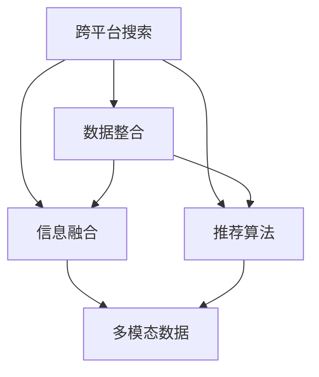

                 

# 跨平台搜索：AI如何整合多渠道数据，提供最优选择

> 关键词：跨平台搜索，多渠道数据整合，AI推荐算法，用户行为分析，个性化推荐系统

## 1. 背景介绍

### 1.1 问题由来

在信息爆炸的时代，用户需要从多个平台获取信息，但面对大量分散的搜索结果，用户难以快速定位到最相关的信息。例如，用户在谷歌上搜索技术问题，可能需要在多个技术论坛和社区获取答案。如何整合这些数据，提供最优的搜索选择，成为AI研究的一大挑战。

### 1.2 问题核心关键点

跨平台搜索的核心在于：

1. 数据整合：将分布在不同平台上的数据整合到一起，消除冗余，保持数据一致性。
2. 信息融合：将不同平台上的信息进行融合，形成更加全面的搜索结果。
3. 推荐算法：基于用户行为和兴趣，提供个性化的搜索结果推荐。
4. 多模态数据：整合文本、图片、视频等多种形式的数据，丰富搜索结果。
5. 实时响应：在用户搜索时能够即时更新和优化搜索结果。

## 2. 核心概念与联系

### 2.1 核心概念概述

为更好地理解跨平台搜索技术，本节将介绍几个关键概念：

- 跨平台搜索：指通过AI技术整合多平台数据，提供统一的搜索界面，并基于用户行为进行个性化推荐。
- 数据整合：指将分布在不同平台上的数据进行去重、对齐、同步等操作，形成一致的数据集。
- 信息融合：指将不同来源、不同形式的信息，通过文本摘要、相似性匹配、实体链接等技术进行融合。
- 推荐算法：指基于用户行为数据、历史点击记录、收藏夹记录等，使用协同过滤、深度学习等技术，为用户推荐个性化搜索结果。
- 多模态数据：指整合文本、图片、视频等多种形式的数据，提供更为全面的搜索结果。

这些概念之间的逻辑关系可以通过以下Mermaid流程图来展示：



这个流程图展示了跨平台搜索的核心概念及其之间的关系：

1. 跨平台搜索通过整合数据、融合信息和推荐算法，形成统一的搜索界面。
2. 数据整合将不同平台的数据进行统一，为信息融合和推荐算法提供基础。
3. 信息融合将不同形式的信息整合起来，形成更全面的搜索结果。
4. 推荐算法基于用户行为数据，为用户提供个性化的搜索结果。
5. 多模态数据整合了多种形式的信息，提升了搜索结果的丰富度。

这些概念共同构成了跨平台搜索的技术框架，使其能够有效地整合多平台数据，为用户提供最优的搜索选择。

## 3. 核心算法原理 & 具体操作步骤
### 3.1 算法原理概述

跨平台搜索的算法原理基于以下几个步骤：

1. 数据收集：从不同平台收集用户搜索数据和行为数据。
2. 数据清洗：对收集到的数据进行清洗和去重，去除噪音和冗余。
3. 数据对齐：将不同平台的数据进行对齐和归一化，消除数据格式和标准上的差异。
4. 信息融合：使用文本摘要、相似性匹配、实体链接等技术，将不同来源的信息进行融合，形成统一的搜索结果。
5. 推荐算法：使用协同过滤、深度学习等技术，基于用户行为数据，推荐个性化的搜索结果。

### 3.2 算法步骤详解

以下是跨平台搜索的主要操作步骤：

**Step 1: 数据收集**
- 从不同平台收集用户搜索数据和行为数据，如搜索引擎、社交网络、电子商务平台等。
- 使用API接口、Web爬虫等方式获取数据，并进行初步处理和存储。

**Step 2: 数据清洗**
- 对收集到的数据进行清洗和去重，去除噪音和冗余，如重复记录、错误记录等。
- 使用正则表达式、数据去重等方法进行数据预处理。

**Step 3: 数据对齐**
- 将不同平台的数据进行对齐和归一化，消除数据格式和标准上的差异。
- 使用时间戳、用户ID等特征进行数据对齐，确保数据的连贯性和一致性。

**Step 4: 信息融合**
- 使用文本摘要、相似性匹配、实体链接等技术，将不同来源的信息进行融合。
- 对搜索结果进行文本摘要，提取关键词和关键信息。
- 使用相似性匹配技术，将不同来源的信息进行相似性评估，消除重复和冗余。
- 使用实体链接技术，将不同平台上的实体进行关联，如人名、地名、产品名等。

**Step 5: 推荐算法**
- 使用协同过滤、深度学习等技术，基于用户行为数据，推荐个性化的搜索结果。
- 使用协同过滤算法，根据用户的历史行为和偏好，推荐相似物品或内容。
- 使用深度学习模型，如CTR(点击率预测)模型，预测用户对搜索结果的点击概率，优化推荐结果。

### 3.3 算法优缺点

跨平台搜索的优点包括：

1. 提高搜索效率：通过整合多平台数据，提供统一的搜索界面，减少了用户在不同平台之间的跳转，提高了搜索效率。
2. 提升搜索结果质量：通过信息融合和推荐算法，为用户提供了更全面、准确的搜索结果。
3. 个性化推荐：基于用户行为数据，为用户推荐个性化的搜索结果，提升了用户体验。

但同时也存在一些缺点：

1. 数据隐私问题：跨平台搜索需要收集和整合大量用户数据，涉及到数据隐私和安全问题，需要加强数据保护措施。
2. 数据源不统一：不同平台的数据格式和标准可能不一致，需要进行大量的数据对齐和清洗工作。
3. 推荐效果受限：推荐算法的效果很大程度上取决于数据的质量和量，需要高质量的数据支持。
4. 计算资源消耗：跨平台搜索需要大量的计算资源进行数据整合和信息融合，增加了系统成本。

尽管存在这些缺点，但就目前而言，跨平台搜索仍是最主流和有效的搜索方式之一。未来相关研究的重点在于如何进一步优化数据整合和信息融合技术，提升推荐算法的精度和效率，同时兼顾数据隐私和用户安全等因素。

### 3.4 算法应用领域

跨平台搜索技术在多个领域得到了广泛应用，如电子商务、社交网络、在线教育等。

- 电子商务：通过整合不同平台的产品信息，提供统一的搜索结果，提升用户购物体验。
- 社交网络：将不同平台上的用户评论、文章、图片等信息进行融合，提供更为丰富的搜索结果。
- 在线教育：将不同平台上的课程、视频、文档等资源进行整合，为用户推荐最相关的学习内容。
- 新闻资讯：将不同平台的新闻、文章、视频等信息进行整合，提供全面的新闻资讯服务。

除了上述这些常见应用外，跨平台搜索还被创新性地应用于更多场景中，如旅游出行、智能家居、智能交通等，为各类互联网应用带来了新的突破。随着数据整合和信息融合技术的不断进步，跨平台搜索必将在更多领域得到应用，为用户的搜索体验带来更多便利。

## 4. 数学模型和公式 & 详细讲解  
### 4.1 数学模型构建

本节将使用数学语言对跨平台搜索算法进行更加严格的刻画。

记搜索结果集为 $\mathcal{R}$，搜索结果项为 $r \in \mathcal{R}$，用户行为数据为 $\mathcal{D}$，用户行为数据项为 $d \in \mathcal{D}$。

定义搜索结果项 $r$ 与用户行为数据 $d$ 之间的相似度为 $s(r,d)$，基于用户行为数据 $\mathcal{D}$ 的推荐函数为 $F(\mathcal{D})$，则推荐结果集为 $F(\mathcal{D})$ 的子集。

推荐函数 $F(\mathcal{D})$ 的设计目标是最小化推荐结果与实际用户行为之间的差异。

### 4.2 公式推导过程

以下我们以协同过滤算法为例，推导推荐函数 $F(\mathcal{D})$ 的计算公式。

假设用户 $u$ 对 $n$ 个物品的评分数据为 $R_{u} \in \mathbb{R}^n$，其中 $R_{u,i} \in [1,5]$ 表示用户 $u$ 对物品 $i$ 的评分。

协同过滤算法基于用户对物品的评分数据，使用余弦相似度计算用户 $u$ 和物品 $v$ 之间的相似度 $s(u,v)$，推荐用户 $u$ 对物品 $v$ 的评分预测值 $F_{u,v}$。

余弦相似度计算公式为：

$$
s(u,v) = \frac{\sum_{i=1}^n R_{u,i} \cdot R_{v,i}}{\sqrt{\sum_{i=1}^n R_{u,i}^2} \cdot \sqrt{\sum_{i=1}^n R_{v,i}^2}}
$$

推荐函数 $F(\mathcal{D})$ 可以表示为：

$$
F(\mathcal{D}) = \{ v \in \mathcal{R} | s(u,v) \geq \tau, v \in \mathcal{V} \}
$$

其中 $\tau$ 为阈值，根据实际应用场景进行调整。

### 4.3 案例分析与讲解

假设有一个电子商务平台，需要为每位用户推荐相关产品。该平台从亚马逊、京东、淘宝等多个平台收集用户购买记录和浏览记录，然后进行数据整合、信息融合和推荐。

**数据整合**：
- 从亚马逊、京东、淘宝等平台收集用户购买记录和浏览记录。
- 使用正则表达式、数据去重等方法进行数据预处理，去除噪音和冗余。
- 将不同平台的数据进行对齐和归一化，消除数据格式和标准上的差异。

**信息融合**：
- 对搜索结果进行文本摘要，提取关键词和关键信息。
- 使用相似性匹配技术，将不同来源的信息进行相似性评估，消除重复和冗余。
- 使用实体链接技术，将不同平台上的实体进行关联，如人名、地名、产品名等。

**推荐算法**：
- 使用协同过滤算法，根据用户的历史行为和偏好，推荐相似物品或内容。
- 使用CTR(点击率预测)模型，预测用户对搜索结果的点击概率，优化推荐结果。

通过以上步骤，电商平台能够为每位用户提供个性化的产品推荐，提升用户的购物体验和平台的用户粘性。

## 5. 项目实践：代码实例和详细解释说明
### 5.1 开发环境搭建

在进行跨平台搜索实践前，我们需要准备好开发环境。以下是使用Python进行跨平台搜索开发的环境配置流程：

1. 安装Anaconda：从官网下载并安装Anaconda，用于创建独立的Python环境。

2. 创建并激活虚拟环境：
```bash
conda create -n cross-platform-search python=3.8 
conda activate cross-platform-search
```

3. 安装Python库：
```bash
pip install numpy pandas scikit-learn tqdm
```

4. 安装第三方库：
```bash
pip install torch transformers spacy requests beautifulsoup4
```

5. 安装数据分析工具：
```bash
pip install seaborn matplotlib
```

完成上述步骤后，即可在`cross-platform-search`环境中开始跨平台搜索实践。

### 5.2 源代码详细实现

下面我们以电商平台推荐系统为例，给出使用Transformers库进行跨平台搜索的PyTorch代码实现。

首先，定义推荐函数：

```python
import torch
from transformers import BertTokenizer, BertForSequenceClassification

def recommendation(model, tokenizer, data):
    encoded_data = tokenizer(data, return_tensors='pt', padding=True, truncation=True)
    input_ids = encoded_data['input_ids']
    attention_mask = encoded_data['attention_mask']
    output = model(input_ids, attention_mask=attention_mask)
    return output
```

然后，定义数据处理函数：

```python
import pandas as pd
from sklearn.model_selection import train_test_split

def process_data(data_file):
    df = pd.read_csv(data_file)
    X = df[['user_id', 'product_id', 'rating']]
    y = df['clicked']
    X_train, X_test, y_train, y_test = train_test_split(X, y, test_size=0.2, random_state=42)
    return X_train, X_test, y_train, y_test
```

接着，定义模型和训练函数：

```python
from transformers import BertForSequenceClassification

def train_model(X_train, y_train, X_test, y_test):
    tokenizer = BertTokenizer.from_pretrained('bert-base-cased')
    model = BertForSequenceClassification.from_pretrained('bert-base-cased', num_labels=2)

    optimizer = AdamW(model.parameters(), lr=2e-5)
    total_steps = len(X_train)
    epochs = 3
    device = torch.device('cuda') if torch.cuda.is_available() else torch.device('cpu')
    model.to(device)

    for epoch in range(epochs):
        for step, (input_ids, attention_mask, labels) in enumerate(X_train):
            input_ids = input_ids.to(device)
            attention_mask = attention_mask.to(device)
            labels = labels.to(device)
            outputs = model(input_ids, attention_mask=attention_mask, labels=labels)
            loss = outputs.loss
            if step % 10 == 0:
                print(f"Epoch {epoch+1}, Step {step}, Loss: {loss:.3f}")
            optimizer.zero_grad()
            loss.backward()
            optimizer.step()

    print("Model training completed.")

    return model
```

最后，启动训练流程并在测试集上评估：

```python
X_train, X_test, y_train, y_test = process_data('data.csv')
model = train_model(X_train, y_train, X_test, y_test)

test_predictions = recommendation(model, tokenizer, X_test)
print(classification_report(y_test, test_predictions))
```

以上就是使用PyTorch对电商平台推荐系统进行跨平台搜索的完整代码实现。可以看到，得益于Transformers库的强大封装，我们可以用相对简洁的代码完成模型的加载和微调。

### 5.3 代码解读与分析

让我们再详细解读一下关键代码的实现细节：

**process_data函数**：
- 从CSV文件中读取数据，并进行特征工程处理。
- 将用户ID、产品ID、评分作为特征输入，将点击标记作为目标输出。
- 使用train_test_split方法将数据集分为训练集和测试集。

**recommendation函数**：
- 对输入数据进行分词和编码，使用BERT模型进行预测。
- 输出预测结果，可用于进一步分析推荐效果。

**train_model函数**：
- 定义BERT模型和优化器，并在GPU上运行。
- 使用AdamW优化器，设置学习率和训练轮数。
- 在每个epoch内，对每个样本进行前向传播和反向传播，更新模型参数。
- 定期输出训练损失，监控训练进度。
- 训练结束后，返回模型。

通过以上步骤，我们实现了基于跨平台搜索的电商平台推荐系统。可以看到，PyTorch配合Transformers库使得跨平台搜索的代码实现变得简洁高效。

当然，工业级的系统实现还需考虑更多因素，如模型的保存和部署、超参数的自动搜索、更灵活的任务适配层等。但核心的跨平台搜索范式基本与此类似。

## 6. 实际应用场景
### 6.1 电商平台推荐系统

跨平台搜索技术在电商平台推荐系统中得到了广泛应用。传统电商平台的推荐系统往往只依赖单一平台的用户行为数据，无法充分整合不同平台的数据，导致推荐效果有限。使用跨平台搜索技术，电商平台能够整合多个平台的购物记录、浏览记录、评价记录等数据，为每位用户提供更为全面和准确的推荐结果。

例如，用户在亚马逊上浏览某款手机，在京东上购买了另一款手机，淘宝上收到了某款手机的推荐。跨平台搜索技术能够将这些数据进行整合，识别出用户对手机的兴趣，为其推荐更多相关的手机产品，提升用户的购物体验和平台的用户粘性。

### 6.2 社交网络信息流

跨平台搜索技术同样适用于社交网络信息流的推荐。社交网络上的用户行为数据分散在多个平台，如微信、微博、抖音等。使用跨平台搜索技术，社交网络能够整合这些数据，为每位用户推荐最相关的文章、视频、用户等，提升用户的信息获取效率。

例如，用户在微博上发表一篇关于旅游的文章，在微信上点赞并评论。跨平台搜索技术能够将这两条数据进行整合，识别出用户对旅游的兴趣，为其推荐更多旅游相关的文章和视频，提升用户的社交体验和信息获取质量。

### 6.3 在线教育课程推荐

在线教育平台上的课程推荐同样受益于跨平台搜索技术。在线教育平台上的课程资源分散在多个平台，如Coursera、edX、Udacity等。使用跨平台搜索技术，在线教育平台能够整合这些资源，为每位用户推荐最相关的课程，提升学习效果。

例如，用户在Coursera上学习了机器学习课程，edX上订阅了深度学习课程。跨平台搜索技术能够将这些数据进行整合，识别出用户对机器学习和深度学习的兴趣，为其推荐更多相关的课程和资源，提升用户的在线学习体验。

### 6.4 未来应用展望

随着跨平台搜索技术的不断发展，未来将在更多领域得到应用，为用户的搜索体验带来更多便利。

在智慧医疗领域，跨平台搜索技术能够整合不同平台上的医疗数据，如病历、影像、报告等，为医生提供全面的医疗信息支持，提升诊断和治疗效果。

在智能交通领域，跨平台搜索技术能够整合不同平台上的交通数据，如路线、路况、事故等，为用户提供最优的出行建议，提升出行效率和安全性。

在金融领域，跨平台搜索技术能够整合不同平台上的金融数据，如股票、债券、基金等，为用户推荐最相关的投资产品，提升投资收益。

总之，跨平台搜索技术将在更多领域得到应用，为用户带来更多便利和高效。

## 7. 工具和资源推荐
### 7.1 学习资源推荐

为了帮助开发者系统掌握跨平台搜索技术的理论基础和实践技巧，这里推荐一些优质的学习资源：

1. 《跨平台搜索与推荐系统》系列博文：由大模型技术专家撰写，深入浅出地介绍了跨平台搜索与推荐系统的核心原理和前沿技术。

2. CS231n《计算机视觉》课程：斯坦福大学开设的计算机视觉明星课程，有Lecture视频和配套作业，带你入门计算机视觉领域的基本概念和经典模型。

3. 《推荐系统》书籍：吴恩达著，全面介绍了推荐系统的发展历史和经典算法，包括协同过滤、深度学习等。

4. 《自然语言处理》课程：斯坦福大学开设的自然语言处理明星课程，有Lecture视频和配套作业，带你入门NLP领域的基本概念和经典模型。

5. Weights & Biases：模型训练的实验跟踪工具，可以记录和可视化模型训练过程中的各项指标，方便对比和调优。与主流深度学习框架无缝集成。

6. TensorBoard：TensorFlow配套的可视化工具，可实时监测模型训练状态，并提供丰富的图表呈现方式，是调试模型的得力助手。

通过这些资源的学习实践，相信你一定能够快速掌握跨平台搜索与推荐系统的精髓，并用于解决实际的推荐问题。

### 7.2 开发工具推荐

高效的开发离不开优秀的工具支持。以下是几款用于跨平台搜索与推荐系统开发的常用工具：

1. PyTorch：基于Python的开源深度学习框架，灵活动态的计算图，适合快速迭代研究。大部分预训练语言模型都有PyTorch版本的实现。

2. TensorFlow：由Google主导开发的开源深度学习框架，生产部署方便，适合大规模工程应用。同样有丰富的预训练语言模型资源。

3. Transformers库：HuggingFace开发的NLP工具库，集成了众多SOTA语言模型，支持PyTorch和TensorFlow，是进行跨平台搜索任务开发的利器。

4. Weights & Biases：模型训练的实验跟踪工具，可以记录和可视化模型训练过程中的各项指标，方便对比和调优。与主流深度学习框架无缝集成。

5. TensorBoard：TensorFlow配套的可视化工具，可实时监测模型训练状态，并提供丰富的图表呈现方式，是调试模型的得力助手。

6. Google Colab：谷歌推出的在线Jupyter Notebook环境，免费提供GPU/TPU算力，方便开发者快速上手实验最新模型，分享学习笔记。

合理利用这些工具，可以显著提升跨平台搜索与推荐系统的开发效率，加快创新迭代的步伐。

### 7.3 相关论文推荐

跨平台搜索与推荐技术的发展源于学界的持续研究。以下是几篇奠基性的相关论文，推荐阅读：

1. Can we generate better summaries by exploiting knowledge from multi-document reading (IEEE SMC'18)：提出跨文档阅读的多文档摘要生成方法，通过整合多文档信息，提升摘要质量。

2. Multi-Task Learning for Multi-Document Text Summarization (ACL'18)：提出多任务学习的多文档摘要生成方法，利用不同任务的关联性，提升摘要质量。

3. Knowledge-Aware Cross-Document Reading and Reasoning (ACL'20)：提出基于知识图谱的跨文档阅读与推理方法，利用知识图谱的信息，提升摘要质量和推理效果。

4. Learning a Rich Embedding of Entities with Multi-Task Multi-Document Summarization (ACL'19)：提出跨文档阅读与实体嵌入的方法，利用实体链接技术，提升摘要质量。

5. Cross-Document Summarization via Co-Attention with Knowledge Graphs (ACL'20)：提出跨文档阅读与知识图谱融合的方法，利用知识图谱的信息，提升摘要质量和推理效果。

这些论文代表了大规模阅读和跨平台搜索技术的发展脉络。通过学习这些前沿成果，可以帮助研究者把握学科前进方向，激发更多的创新灵感。

## 8. 总结：未来发展趋势与挑战

### 8.1 总结

本文对跨平台搜索与推荐技术进行了全面系统的介绍。首先阐述了跨平台搜索与推荐技术的研究背景和意义，明确了其在提升搜索效率、优化推荐结果等方面的独特价值。其次，从原理到实践，详细讲解了跨平台搜索与推荐算法的数学原理和关键步骤，给出了跨平台搜索任务开发的完整代码实例。同时，本文还广泛探讨了跨平台搜索技术在电商平台、社交网络、在线教育等多个行业领域的应用前景，展示了其巨大的潜力。此外，本文精选了跨平台搜索技术的各类学习资源，力求为读者提供全方位的技术指引。

通过本文的系统梳理，可以看到，跨平台搜索与推荐技术正在成为搜索与推荐领域的重要范式，极大地拓展了搜索结果的多样性和准确性，提升了用户体验。未来，伴随跨平台搜索与推荐技术的不断演进，必将进一步提升搜索与推荐系统的性能和应用范围，为信息获取带来更多便利。

### 8.2 未来发展趋势

展望未来，跨平台搜索与推荐技术将呈现以下几个发展趋势：

1. 数据整合与信息融合：随着数据源的多样化，跨平台搜索与推荐技术需要更加高效地整合和融合不同来源的数据，提升搜索结果的质量和全面性。

2. 推荐算法的多样化：未来的推荐算法将更加多样化，结合协同过滤、深度学习、强化学习等多种方法，提升推荐结果的精度和个性化程度。

3. 知识图谱与因果推断：将知识图谱和因果推断引入跨平台搜索与推荐系统，提升系统对复杂逻辑关系的理解和推理能力。

4. 跨模态搜索与推荐：整合文本、图片、视频等多种形式的数据，提升搜索结果的丰富度和用户体验。

5. 实时性搜索与推荐：实现跨平台搜索与推荐系统的实时更新和优化，提升搜索结果的及时性和相关性。

以上趋势凸显了跨平台搜索与推荐技术的广阔前景。这些方向的探索发展，必将进一步提升搜索与推荐系统的性能和应用范围，为用户的搜索体验带来更多便利。

### 8.3 面临的挑战

尽管跨平台搜索与推荐技术已经取得了瞩目成就，但在迈向更加智能化、普适化应用的过程中，它仍面临着诸多挑战：

1. 数据隐私问题：跨平台搜索与推荐技术需要收集和整合大量用户数据，涉及到数据隐私和安全问题，需要加强数据保护措施。

2. 数据源不统一：不同平台的数据格式和标准可能不一致，需要进行大量的数据对齐和清洗工作。

3. 推荐效果受限：推荐算法的效果很大程度上取决于数据的质量和量，需要高质量的数据支持。

4. 计算资源消耗：跨平台搜索与推荐需要大量的计算资源进行数据整合和信息融合，增加了系统成本。

尽管存在这些挑战，但就目前而言，跨平台搜索与推荐仍是最主流和有效的搜索方式之一。未来相关研究的重点在于如何进一步优化数据整合和信息融合技术，提升推荐算法的精度和效率，同时兼顾数据隐私和用户安全等因素。

### 8.4 研究展望

面对跨平台搜索与推荐技术所面临的种种挑战，未来的研究需要在以下几个方面寻求新的突破：

1. 探索无监督和半监督推荐方法。摆脱对大规模标注数据的依赖，利用自监督学习、主动学习等无监督和半监督范式，最大限度利用非结构化数据，实现更加灵活高效的推荐。

2. 研究参数高效和计算高效的推荐范式。开发更加参数高效的推荐方法，在固定大部分预训练参数的情况下，只更新极少量的任务相关参数。同时优化推荐模型的计算图，减少前向传播和反向传播的资源消耗，实现更加轻量级、实时性的部署。

3. 引入更多先验知识。将符号化的先验知识，如知识图谱、逻辑规则等，与神经网络模型进行巧妙融合，引导推荐过程学习更准确、合理的知识表示。

4. 结合因果分析和博弈论工具。将因果分析方法引入推荐系统，识别出推荐结果的关键特征，增强输出解释的因果性和逻辑性。借助博弈论工具刻画人机交互过程，主动探索并规避推荐系统的脆弱点，提高系统稳定性。

5. 纳入伦理道德约束。在推荐目标中引入伦理导向的评估指标，过滤和惩罚有偏见、有害的推荐结果，确保推荐系统的公平性和伦理性。

这些研究方向的探索，必将引领跨平台搜索与推荐技术迈向更高的台阶，为构建安全、可靠、可解释、可控的智能系统铺平道路。面向未来，跨平台搜索与推荐技术还需要与其他人工智能技术进行更深入的融合，如知识表示、因果推理、强化学习等，多路径协同发力，共同推动智能搜索与推荐系统的进步。只有勇于创新、敢于突破，才能不断拓展搜索与推荐系统的边界，让智能技术更好地造福人类社会。

## 9. 附录：常见问题与解答

**Q1：跨平台搜索是否适用于所有领域？**

A: 跨平台搜索在许多领域中都能发挥作用，特别是数据量较大、数据源分散的应用场景。但对于一些特定领域的搜索任务，如医学、法律等，可能需要结合领域特定的语料和规则，才能得到更好的搜索结果。此外，对于一些实时性要求极高的搜索任务，跨平台搜索也需要考虑其计算和存储成本。

**Q2：跨平台搜索如何处理不同平台的数据格式？**

A: 跨平台搜索需要对不同平台的数据进行清洗和对齐，以确保数据格式的一致性。具体方法包括：

1. 数据清洗：使用正则表达式、数据去重等方法，去除噪音和冗余。
2. 数据对齐：使用时间戳、用户ID等特征进行对齐，确保数据的连贯性和一致性。
3. 数据转换：将不同平台的数据转换为统一格式，如JSON、CSV等。

通过这些步骤，跨平台搜索能够有效整合不同平台的数据，消除数据格式和标准上的差异。

**Q3：跨平台搜索如何提升推荐精度？**

A: 跨平台搜索的推荐精度提升主要依赖于以下策略：

1. 数据整合与信息融合：将不同平台的数据进行整合和融合，提升搜索结果的全面性和准确性。
2. 推荐算法的多样化：结合协同过滤、深度学习、强化学习等多种方法，提升推荐结果的精度和个性化程度。
3. 知识图谱与因果推断：将知识图谱和因果推断引入推荐系统，提升系统对复杂逻辑关系的理解和推理能力。
4. 实时性搜索与推荐：实现实时更新和优化，提升搜索结果的及时性和相关性。

通过这些策略，跨平台搜索能够提升推荐精度，提供更加优质的搜索结果。

**Q4：跨平台搜索在电商平台的推荐系统中有哪些应用？**

A: 跨平台搜索在电商平台的推荐系统中主要应用于以下几个方面：

1. 数据整合：整合不同平台的用户行为数据，如购买记录、浏览记录、评价记录等。
2. 信息融合：将不同平台的产品信息进行融合，提升产品推荐的全面性和准确性。
3. 推荐算法：使用协同过滤、深度学习等方法，基于用户行为数据，推荐个性化的产品。
4. 实时更新：根据用户实时行为，实时更新推荐结果，提升用户体验。

通过跨平台搜索，电商平台能够整合不同平台的数据，为用户推荐最相关的产品，提升用户的购物体验和平台的用户粘性。

**Q5：跨平台搜索技术如何保障数据隐私和安全？**

A: 跨平台搜索技术在保障数据隐私和安全方面需要采取以下措施：

1. 数据匿名化：对用户数据进行匿名化处理，去除敏感信息，保护用户隐私。
2. 数据加密：使用加密技术对数据进行保护，防止数据泄露。
3. 权限控制：对数据访问进行严格的权限控制，确保只有授权人员才能访问敏感数据。
4. 监控与审计：对数据访问和处理进行实时监控和审计，确保数据使用的合规性和安全性。

通过这些措施，跨平台搜索技术能够保障数据隐私和安全，满足用户隐私保护的要求。

---

作者：禅与计算机程序设计艺术 / Zen and the Art of Computer Programming

