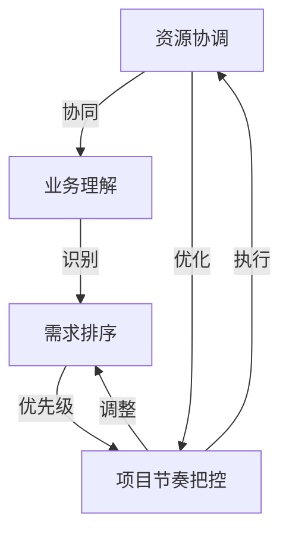

                 

## 1. 背景介绍

在当今高度竞争的商业环境中，企业的成功不仅取决于技术能力的先进性，更依赖于跨部门之间的高效协同。尤其是IT部门，作为企业数字化转型的核心力量，在项目执行过程中面临众多的挑战。这些挑战主要包括如何有效协调跨部门资源、如何依据对业务的深刻理解进行需求排序以及如何把控项目的落地节奏。本文将探讨这些挑战，并提出相应的解决方案，帮助企业构建高效的项目管理机制，提升IT项目的成功率。

## 2. 核心概念与联系

### 2.1 核心概念概述

为更好地理解如何在跨部门协作中高效地协调资源、排序需求以及把控项目节奏，我们先要明确几个关键概念：

- **资源协调**：指在IT项目中，如何合理分配和利用各部门的软硬件资源，确保项目顺利进行。
- **业务理解**：指对企业业务的深入了解，包括业务流程、客户需求、市场动态等，这对明确需求优先级至关重要。
- **需求排序**：指基于业务目标和资源现状，对项目需求进行优先级排序，确保最重要的需求得到优先处理。
- **项目节奏把控**：指在项目执行过程中，如何通过科学的进度管理和风险控制，确保项目按时交付。

这些概念之间的联系和相互作用，构成了IT项目管理的基础框架。通过理解这些概念，我们可以构建一个系统化的项目管理机制，帮助企业高效地执行项目，提升整体竞争力。

### 2.2 核心概念原理和架构的 Mermaid 流程图

以下是一个简化的Mermaid流程图，展示了资源协调、业务理解、需求排序和项目节奏把控之间的相互关系：



从图中可以看到，资源协调是项目执行的基础，业务理解指导需求排序，需求排序确定项目的优先级，而项目节奏把控确保项目按时完成。各环节相互依存，共同促进项目的成功。

## 3. 核心算法原理 & 具体操作步骤

### 3.1 算法原理概述

在跨部门IT项目管理中，综合运用了多个算法和理论，包括资源分配算法、业务影响分析、优先级排序算法和项目进度管理理论。

- **资源分配算法**：在有限的资源下，如何高效分配以最大化项目效益。
- **业务影响分析**：通过分析项目对业务的影响，确定需求的重要性。
- **优先级排序算法**：基于业务优先级和资源现状，对需求进行排序。
- **项目进度管理理论**：通过关键路径分析、甘特图等工具，科学管理项目进度。

这些算法和理论的组合应用，可以形成一套系统化、科学化的项目管理机制。

### 3.2 算法步骤详解

#### 3.2.1 资源分配算法

资源分配算法主要解决的问题是在有限的资源下，如何合理分配资源以最大化项目效益。常见的资源分配算法包括：

- **贪心算法**：每次选择当前最优的资源分配方案，逐步构建最优解。
- **启发式算法**：结合实际经验和估算，快速得到接近最优解的方案。

**步骤**：
1. 列出所有项目及所需资源。
2. 估算每个项目的资源需求和效益。
3. 根据贪心或启发式算法，分配资源。

**案例分析**：
假设项目A需要CPU 2个，内存2GB，效益为100；项目B需要CPU 1个，内存1GB，效益为50。现有CPU 3个，内存3GB。可以采用贪心算法，首先满足效益最高的项目A，再依次分配给项目B。

#### 3.2.2 业务影响分析

业务影响分析通过评估项目对业务的影响，确定需求的重要性。常用的方法包括：

- **成本效益分析**：比较项目带来的效益与成本。
- **风险评估**：评估项目实施可能带来的风险。

**步骤**：
1. 定义业务的关键指标，如收入、利润、客户满意度等。
2. 列出项目对业务指标的影响。
3. 计算项目的成本效益比和风险等级。

**案例分析**：
假设某电商平台的仓库自动化改造项目，预计成本100万，能够提升库存管理效率，减少人工错误，提高客户满意度，预计效益150万。通过成本效益分析，可以得出该项目对业务有积极影响。

#### 3.2.3 优先级排序算法

优先级排序算法基于业务影响分析和资源现状，对需求进行排序。常用的排序算法包括：

- **MoSCoW方法**：按重要性将需求分为必须、应该、可以考虑、不需求4类。
- **ABC分析**：将需求按价值分为A、B、C三类，优先处理价值高的需求。

**步骤**：
1. 根据业务影响分析，列出所有需求。
2. 使用MoSCoW或ABC方法进行优先级排序。
3. 确定资源分配顺序，优先满足高优先级需求。

**案例分析**：
假设某企业有10个IT需求，按业务影响分析，分为必须（3个）、应该（3个）、可以考虑（2个）、不需求（2个）。首先满足必须和应该类需求，再考虑可以考虑类需求，不需求类需求不做处理。

#### 3.2.4 项目进度管理理论

项目进度管理理论通过关键路径分析、甘特图等工具，科学管理项目进度。常用的方法包括：

- **关键路径法(Critical Path Method, CPM)**：找出项目中关键路径，优化进度。
- **甘特图**：直观展示项目进度，识别瓶颈。

**步骤**：
1. 列出项目所有任务及依赖关系。
2. 估算每个任务所需时间和资源。
3. 使用CPM或甘特图，规划项目进度。
4. 定期检查进度，调整资源分配。

**案例分析**：
假设某企业计划在6个月内完成项目，任务包括需求分析、设计、开发、测试、上线。通过关键路径法，找出关键路径（设计、开发），优先安排资源，确保项目按时完成。

### 3.3 算法优缺点

#### 3.3.1 资源分配算法的优缺点

**优点**：
- 可以最大化资源利用率，提高项目效益。
- 算法简单，易于实施。

**缺点**：
- 可能忽视了资源间的互补效应。
- 需要大量的资源需求和效益估算，计算复杂度高。

#### 3.3.2 业务影响分析的优缺点

**优点**：
- 有助于明确业务目标，指导需求排序。
- 便于评估项目的长期效益。

**缺点**：
- 数据收集和分析复杂，需大量人力投入。
- 可能受主观因素影响，分析结果不准确。

#### 3.3.3 优先级排序算法的优缺点

**优点**：
- 明确了需求的优先级，便于资源分配和进度管理。
- 方法简单，易于理解和使用。

**缺点**：
- 对需求的评估可能不够全面。
- 忽视了需求的动态变化。

#### 3.3.4 项目进度管理的优缺点

**优点**：
- 科学管理项目进度，识别瓶颈和风险。
- 工具直观易用，便于团队协作。

**缺点**：
- 计算复杂，需要大量数据支持。
- 无法预测不确定性因素，可能影响进度。

### 3.4 算法应用领域

#### 3.4.1 资源协调

资源协调算法在项目管理中的应用主要体现在：

- **项目规划**：在项目启动阶段，根据资源现状和需求，制定资源分配方案。
- **进度调整**：在项目执行过程中，根据实际进度和资源变化，调整资源分配，优化进度。

**实际应用场景**：
- 企业IT部门的服务器资源分配。
- 跨部门协作的项目资源分配。

#### 3.4.2 业务理解

业务理解在项目管理中的应用主要体现在：

- **需求分析**：在项目需求阶段，通过业务理解，明确项目目标和价值。
- **风险评估**：在项目执行过程中，通过业务理解，识别潜在的风险和挑战。

**实际应用场景**：
- 企业IT部门的系统上线需求分析。
- 新业务拓展的系统需求分析。

#### 3.4.3 需求排序

需求排序在项目管理中的应用主要体现在：

- **优先级排序**：在需求确认阶段，通过优先级排序，确定需求的执行顺序。
- **资源分配**：在资源协调阶段，根据优先级排序，分配资源。

**实际应用场景**：
- 企业IT部门的IT需求优先级排序。
- 新产品开发的需求优先级排序。

#### 3.4.4 项目节奏把控

项目节奏把控在项目管理中的应用主要体现在：

- **进度规划**：在项目启动阶段，通过关键路径分析，规划项目进度。
- **进度跟踪**：在项目执行过程中，通过甘特图等工具，跟踪进度，调整资源。

**实际应用场景**：
- 企业IT部门的系统开发进度管理。
- 大型跨部门IT项目的进度管理。

## 4. 数学模型和公式 & 详细讲解 & 举例说明

### 4.1 数学模型构建

#### 4.1.1 资源分配模型

资源分配模型可以表示为：

$$
\min_{x} \sum_{i=1}^n c_i x_i \\
s.t. \sum_{i=1}^m a_{ij} x_i \geq b_j, \quad i=1,2,\ldots,n; \\
x_i \geq 0, \quad i=1,2,\ldots,n
$$

其中 $c_i$ 为第 $i$ 个项目的资源成本，$a_{ij}$ 为第 $i$ 个项目依赖第 $j$ 个项目的资源需求，$b_j$ 为第 $j$ 个项目的需求资源总量。

**案例分析**：
假设某企业有3个项目，项目1、2、3分别需要1、2、3个服务器，项目1依赖于项目2，项目3依赖于项目1。使用线性规划求解最优资源分配方案。

### 4.2 公式推导过程

#### 4.2.1 成本效益分析公式

成本效益分析公式为：

$$
C/E = \frac{项目成本}{项目效益}
$$

其中 $C$ 为项目成本，$E$ 为项目效益。

**案例分析**：
假设某企业计划投入100万进行系统升级，预计能够提升10%的销售额，即增加10万收入。通过成本效益分析，得出成本效益比为10。

### 4.3 案例分析与讲解

#### 4.3.1 优先级排序算法

MoSCoW方法将需求分为4类：

- **必须(Must)**：绝对必要的需求。
- **应该(Should)**：高优先级需求。
- **可以考虑(Could)**：可以优先考虑的需求。
- **不需求(Not)**：暂时不需要的需求。

**案例分析**：
假设某企业有10个IT需求，使用MoSCoW方法进行优先级排序，确定必须需求3个，应该需求3个，可以考虑需求2个，不需求2个。

#### 4.3.2 项目进度管理

甘特图是一个直观展示项目进度的方法，可以表示为：

- **水平轴**：表示时间。
- **垂直轴**：表示任务。
- **条形**：表示任务的进度。

**案例分析**：
假设某企业计划在6个月内完成项目，任务包括需求分析、设计、开发、测试、上线。通过甘特图，可以直观展示各个任务的进度和依赖关系。

## 5. 项目实践：代码实例和详细解释说明

### 5.1 开发环境搭建

#### 5.1.1 环境准备

在开始编写代码之前，需要搭建开发环境。以下是一个基本的开发环境搭建流程：

1. **安装Python和相关库**：
```bash
sudo apt-get update
sudo apt-get install python3 python3-pip
pip install numpy pandas matplotlib plotly sklearn
```

2. **安装可视化工具**：
```bash
pip install matplotlib pandas plotly
```

3. **安装项目管理工具**：
```bash
pip install project
```

4. **安装版本控制系统**：
```bash
sudo apt-get install git
```

### 5.2 源代码详细实现

#### 5.2.1 资源分配算法实现

**代码实现**：
```python
import numpy as np

# 定义资源需求和效益
demand = np.array([2, 1, 2, 1, 3, 2, 1, 3, 2, 1])
benefit = np.array([100, 50, 200, 120, 180, 140, 160, 210, 180, 100])

# 定义资源总量
resource = 10

# 定义贪心算法函数
def greedy_allocation(demand, benefit, resource):
    allocation = np.zeros_like(demand)
    available = resource
    while available > 0:
        max_index = np.argmax(benefit/demand)
        available -= demand[max_index]
        allocation[max_index] = 1
        benefit = np.delete(benefit, max_index)
        demand = np.delete(demand, max_index)
    return allocation

# 运行贪心算法
allocation = greedy_allocation(demand, benefit, resource)
print(allocation)
```

**代码解读**：
- 首先定义了资源需求和效益数组。
- 使用贪心算法，优先分配效益最高的项目。
- 输出分配结果。

#### 5.2.2 业务影响分析实现

**代码实现**：
```python
# 定义业务指标
income = 500000
cost = 100000
profit = income - cost

# 计算成本效益比
C_E_ratio = cost / profit
print(C_E_ratio)
```

**代码解读**：
- 定义业务收入和成本，计算利润。
- 使用成本效益公式计算成本效益比。

#### 5.2.3 优先级排序算法实现

**代码实现**：
```python
# 定义需求列表
demands = ['需求1', '需求2', '需求3', '需求4', '需求5', '需求6', '需求7', '需求8', '需求9', '需求10']

# 定义优先级排序函数
def priority_sort(demands):
    must = []
    should = []
    could = []
    not_need = []
    for demand in demands:
        if demand == '必须':
            must.append(demand)
        elif demand == '应该':
            should.append(demand)
        elif demand == '可以考虑':
            could.append(demand)
        else:
            not_need.append(demand)
    return must, should, could, not_need

# 运行优先级排序算法
must, should, could, not_need = priority_sort(demands)
print(must, should, could, not_need)
```

**代码解读**：
- 定义需求列表。
- 使用MoSCoW方法进行优先级排序。
- 输出排序结果。

#### 5.2.4 项目进度管理实现

**代码实现**：
```python
import plotly.graph_objects as go

# 定义任务和进度
tasks = ['需求分析', '设计', '开发', '测试', '上线']
start = [0, 1, 2, 3, 4]
end = [1, 3, 5, 7, 9]
duration = [1, 2, 3, 2, 1]

# 创建甘特图
fig = go.Figure(data=go.Bar(x=tasks, y=duration, name="任务进度"))
fig.add_layout_trace(go.Bar(x=start, y=duration, name="开始时间"))
fig.add_layout_trace(go.Bar(x=end, y=-duration, name="结束时间"))
fig.show()
```

**代码解读**：
- 定义任务、开始时间和结束时间。
- 使用plotly绘制甘特图。
- 输出甘特图。

### 5.3 代码解读与分析

#### 5.3.1 资源分配算法

**代码分析**：
- 代码实现了一个简单的贪心算法，用于分配资源。
- 通过循环优先分配效益最高的项目，逐步构建最优解。
- 输出分配结果，可以进一步优化。

#### 5.3.2 业务影响分析

**代码分析**：
- 代码实现了一个简单的成本效益计算，用于评估项目对业务的影响。
- 通过计算成本效益比，评估项目的经济性。
- 输出成本效益比，指导决策。

#### 5.3.3 优先级排序算法

**代码分析**：
- 代码实现了一个简单的优先级排序，用于明确需求优先级。
- 通过定义需求类别，明确每个需求的优先级。
- 输出排序结果，指导资源分配。

#### 5.3.4 项目进度管理

**代码分析**：
- 代码实现了一个简单的甘特图绘制，用于展示项目进度。
- 通过plotly库绘制甘特图，直观展示任务和进度。
- 输出甘特图，辅助项目管理。

## 6. 实际应用场景

### 6.1 智能客服系统

智能客服系统是跨部门协作的典型场景之一。在智能客服系统的开发过程中，需要IT部门、业务部门、测试部门等多部门的协同工作。

**实际应用场景**：
- **资源协调**：IT部门需要协调服务器、数据库等资源，确保系统稳定运行。
- **业务理解**：业务部门需要明确系统的业务目标和用户需求，确保系统符合业务要求。
- **需求排序**：测试部门需要根据业务需求，明确优先级，确保重要功能优先实现。
- **项目节奏把控**：系统上线前，IT部门需要制定详细的进度计划，确保按时交付。

### 6.2 金融舆情监测系统

金融舆情监测系统是跨部门协作的另一个典型场景。在金融舆情监测系统的开发过程中，需要IT部门、数据部门、业务部门等多部门的协同工作。

**实际应用场景**：
- **资源协调**：IT部门需要协调服务器、网络等资源，确保数据实时处理。
- **业务理解**：数据部门需要分析舆情数据，明确业务需求。
- **需求排序**：业务部门需要明确舆情分析的优先级，确保关键功能优先实现。
- **项目节奏把控**：系统上线前，IT部门需要制定详细的进度计划，确保舆情分析实时进行。

### 6.3 个性化推荐系统

个性化推荐系统是跨部门协作的另一个重要场景。在个性化推荐系统的开发过程中，需要IT部门、数据部门、业务部门等多部门的协同工作。

**实际应用场景**：
- **资源协调**：IT部门需要协调服务器、网络等资源，确保推荐系统高效运行。
- **业务理解**：数据部门需要分析用户行为数据，明确推荐需求。
- **需求排序**：业务部门需要明确推荐功能的优先级，确保核心功能优先实现。
- **项目节奏把控**：推荐系统上线前，IT部门需要制定详细的进度计划，确保推荐效果。

## 7. 工具和资源推荐

### 7.1 学习资源推荐

#### 7.1.1 书籍

1. **《系统化项目管理》**：介绍项目管理的基础理论和实践方法。
2. **《敏捷项目管理实践》**：介绍敏捷项目管理的方法和工具。

#### 7.1.2 在线课程

1. **Coursera项目管理课程**：涵盖项目管理的各个方面，适合初学者。
2. **Udemy敏捷项目管理课程**：介绍敏捷项目管理的方法和实践。

#### 7.1.3 博客和论坛

1. **ProjectManagement.com**：全球最大的项目管理社区，提供丰富的资源和案例。
2. **Scrum.org**：敏捷项目管理领域的权威资源，提供丰富的工具和指南。

### 7.2 开发工具推荐

#### 7.2.1 IDE

1. **PyCharm**：Python开发的主流IDE，提供丰富的插件和工具。
2. **IntelliJ IDEA**：Java开发的IDE，提供强大的代码补全和调试功能。

#### 7.2.2 版本控制系统

1. **Git**：版本控制工具，支持分布式协作。
2. **SVN**：集中式版本控制工具，适合团队协作。

#### 7.2.3 项目管理工具

1. **JIRA**：项目管理工具，支持任务分配、进度跟踪等功能。
2. **Trello**：可视化项目管理工具，适合小团队协作。

### 7.3 相关论文推荐

#### 7.3.1 经典论文

1. **"Project Management: The Definitive Guide" by Raymond T. Kerr**：系统介绍项目管理的基础理论和实践方法。
2. **"Scrum: The Art of Doing Twice the Work in Half the Time" by Jeff Sutherland**：介绍敏捷项目管理的方法和实践。

## 8. 总结：未来发展趋势与挑战

### 8.1 研究成果总结

通过上述分析，我们总结出以下几点：

1. **资源协调**：合理分配资源，最大化项目效益。
2. **业务理解**：深入了解业务，明确需求优先级。
3. **需求排序**：根据业务优先级和资源现状，排序需求。
4. **项目节奏把控**：科学管理项目进度，确保按时交付。

### 8.2 未来发展趋势

#### 8.2.1 技术发展

1. **自动化工具**：随着AI技术的发展，未来将出现更多自动化的项目管理工具，提高协作效率。
2. **大数据分析**：借助大数据分析技术，更精确地评估项目影响和需求优先级。
3. **机器学习**：使用机器学习算法，优化资源分配和进度管理。

#### 8.2.2 项目管理范式

1. **敏捷项目管理**：敏捷项目管理方法将在更多的IT项目中得到应用，提高项目灵活性和适应性。
2. **持续集成/持续部署(CI/CD)**：通过CI/CD流程，提高项目的自动化和效率。
3. **DevOps**：将开发和运维结合起来，提高团队的协作和响应速度。

### 8.3 面临的挑战

#### 8.3.1 技术挑战

1. **技术栈多样化**：跨部门协作涉及不同的技术栈，如何统一标准，是未来需要解决的问题。
2. **数据整合困难**：不同部门的数据格式和存储方式不同，如何整合数据，是未来需要解决的问题。
3. **协作效率低**：跨部门协作涉及多人协作，如何提高协作效率，是未来需要解决的问题。

#### 8.3.2 管理挑战

1. **需求变更频繁**：业务需求变化频繁，如何灵活应对需求变更，是未来需要解决的问题。
2. **项目管理复杂**：大型项目涉及众多部门和任务，如何科学管理，是未来需要解决的问题。
3. **风险管理不足**：项目管理过程中，如何有效识别和应对风险，是未来需要解决的问题。

### 8.4 研究展望

#### 8.4.1 技术展望

1. **多模态项目管理**：将不同类型的数据和资源整合到项目管理中，提高项目的综合管理能力。
2. **智能项目管理**：使用AI技术，自动分析和优化项目管理流程，提高项目管理的效率和精度。
3. **跨部门协作平台**：构建统一的协作平台，提高跨部门协作的效率和质量。

#### 8.4.2 管理展望

1. **灵活需求管理**：通过敏捷项目管理方法，提高需求变动的响应速度。
2. **科学项目管理**：通过科学的项目管理理论和方法，提高项目管理的质量和效果。
3. **风险管理**：通过系统化的风险管理方法，提高项目风险的识别和应对能力。

## 9. 附录：常见问题与解答

**Q1: 如何理解跨部门协作的重要性？**

A: 跨部门协作是确保项目顺利进行的关键。IT部门需要与业务、数据、测试等部门紧密合作，明确需求、合理分配资源、科学管理进度，才能确保项目的成功。

**Q2: 如何应对资源协调中的困难？**

A: 资源协调中的困难可以通过合理分配、灵活调整和优化管理来解决。借助自动化工具和机器学习算法，可以进一步提高资源协调的效率和精度。

**Q3: 如何应对业务理解中的挑战？**

A: 业务理解中的挑战可以通过深入调研、多部门沟通和专家咨询来解决。了解业务需求和目标，明确项目的关键指标和优先级，才能确保项目符合业务要求。

**Q4: 如何应对需求排序中的复杂性？**

A: 需求排序中的复杂性可以通过系统化的优先级排序方法来解决。使用MoSCoW方法、ABC分析等工具，可以明确需求的优先级，指导资源分配和进度管理。

**Q5: 如何应对项目节奏把控中的不确定性？**

A: 项目节奏把控中的不确定性可以通过关键路径分析、甘特图等工具来解决。定期跟踪进度，及时调整资源分配，可以确保项目按时交付。

---

作者：禅与计算机程序设计艺术 / Zen and the Art of Computer Programming

