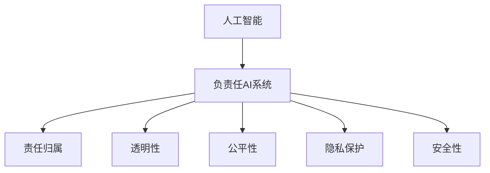

                 

# 软件 2.0 的伦理规范：人工智能的责任

> 关键词：人工智能,伦理规范,责任,软件开发,自动化决策

## 1. 背景介绍

### 1.1 问题由来
随着人工智能(AI)技术的迅猛发展，人工智能系统在各行各业中的应用越来越广泛。然而，随着AI系统的自动化决策越来越多地介入人类生活，其潜在的伦理责任问题也日益凸显。近年来，许多重大的AI伦理事件，如自动驾驶汽车撞车事故、面部识别技术侵犯隐私等，使AI伦理问题成为社会广泛关注的焦点。

### 1.2 问题核心关键点
AI伦理问题涉及多个方面，包括：

- **责任归属**：当AI系统发生失误时，谁应该承担责任？
- **透明性**：AI系统的决策过程是否透明、可解释？
- **公平性**：AI系统是否对所有群体公平？
- **隐私保护**：AI系统如何保护个人隐私？
- **安全性**：AI系统是否安全可靠？

这些问题关系到AI系统的可信度和安全性，对社会信任和公众接受度有着深远影响。因此，如何在软件开发过程中纳入伦理规范，构建负责任的AI系统，成为当前亟待解决的重要课题。

### 1.3 问题研究意义
构建负责任的AI系统，不仅有助于提升公众对AI技术的信任，还能促进AI技术的健康发展。具体而言，AI伦理规范的研究和应用具有以下重要意义：

- **提升可信度**：明确责任归属和透明性要求，使AI系统更可信，更容易获得公众信任。
- **促进公平**：确保AI系统对所有群体公平，减少偏见和歧视，实现社会公正。
- **保护隐私**：严格隐私保护措施，避免数据滥用和隐私侵犯。
- **确保安全**：通过风险评估和安全测试，确保AI系统的可靠性和安全性。

## 2. 核心概念与联系

### 2.1 核心概念概述

为更好地理解如何构建负责任的AI系统，本节将介绍几个密切相关的核心概念：

- **人工智能(AI)**：以机器学习、深度学习等为代表的技术，使计算机具备学习、推理、决策等智能能力。
- **负责任AI系统**：在决策、公平性、隐私保护等方面符合伦理规范的AI系统。
- **责任归属**：确定AI系统失误时的责任主体。
- **透明性**：保证AI系统决策过程的透明和可解释。
- **公平性**：保证AI系统对所有群体公平，避免偏见和歧视。
- **隐私保护**：保护用户个人隐私，防止数据滥用。
- **安全性**：确保AI系统可靠运行，避免安全漏洞和风险。

这些核心概念之间的逻辑关系可以通过以下Mermaid流程图来展示：



这个流程图展示的核心概念及其之间的关系：

1. 人工智能通过技术手段使计算机具备智能能力。
2. 负责任AI系统在实现人工智能的基础上，进一步融入伦理规范，确保决策和行为的公正和可信。
3. 责任归属、透明性、公平性、隐私保护和安全性是构建负责任AI系统的关键要素。

这些概念共同构成了负责任AI系统的基本框架，使其能够实现伦理合规和可靠运行。

## 3. 核心算法原理 & 具体操作步骤

### 3.1 算法原理概述

构建负责任的AI系统，首先需要明确其决策过程和责任归属。本节将介绍如何通过伦理算法构建负责任AI系统，并详细阐述其操作步骤。

### 3.2 算法步骤详解

构建负责任AI系统的算法步骤如下：

**Step 1: 确定责任归属**
- 确定AI系统的决策者，明确责任归属。可以是AI系统的设计者、开发者、运营者等。
- 确定决策过程，明确在何种情况下应由谁承担责任。

**Step 2: 实现透明性**
- 记录AI系统的决策过程，生成可解释的决策日志。
- 设计透明的算法接口，使开发者和用户能够理解和审查决策过程。

**Step 3: 确保公平性**
- 收集和分析数据，识别和纠正数据偏见。
- 设计公平的算法，避免算法偏见和歧视。

**Step 4: 加强隐私保护**
- 使用加密技术保护用户数据隐私。
- 设计隐私保护机制，确保用户数据不被滥用。

**Step 5: 保证安全性**
- 进行安全测试和风险评估，确保AI系统安全可靠。
- 设计和实现安全防护措施，防止安全漏洞和风险。

### 3.3 算法优缺点

构建负责任AI系统的方法具有以下优点：

- **提升可信度**：通过明确责任归属和实现透明性，使AI系统更可信，更容易获得公众信任。
- **促进公平**：通过消除数据和算法偏见，确保AI系统对所有群体公平，实现社会公正。
- **保护隐私**：通过严格的隐私保护措施，防止数据滥用和隐私侵犯。
- **确保安全**：通过安全测试和风险评估，确保AI系统的可靠性和安全性。

同时，该方法也存在一定的局限性：

- **实现难度高**：构建负责任AI系统需要全面的伦理规范和技术实现，可能面临高成本和高复杂度。
- **监管难度大**：不同国家、地区对AI伦理的监管标准不同，需适应多地法律法规。
- **难以完全避免偏见**：尽管努力消除数据和算法偏见，但仍可能存在遗漏，难以完全避免偏见。
- **隐私保护边界模糊**：在数据收集和使用过程中，隐私保护的具体边界和实现方式仍需进一步研究。

尽管存在这些局限性，但构建负责任AI系统的方法仍然是大势所趋。未来相关研究的重点在于如何进一步降低实现难度，提高监管效率，并应对隐私保护等复杂问题。

### 3.4 算法应用领域

构建负责任AI系统的伦理算法已经在许多领域得到了应用，包括但不限于：

- **医疗健康**：保证医疗决策的公正和可信，确保患者隐私保护。
- **金融服务**：保证金融决策的公平性和透明度，保护用户隐私。
- **自动驾驶**：确保自动驾驶系统的安全可靠，明确事故责任归属。
- **面部识别**：确保面部识别系统的公平性和隐私保护，防止滥用。
- **智能推荐**：确保推荐系统的公平性，避免用户偏见和歧视。

## 4. 数学模型和公式 & 详细讲解

### 4.1 数学模型构建

构建负责任AI系统的伦理算法主要依赖于数据和算法的公正性、透明性和隐私保护。这些核心要素可以通过数学模型进行形式化描述。

假设一个AI系统用于分类任务，其输入为特征向量 $\mathbf{x} \in \mathbb{R}^n$，输出为分类结果 $y \in \{0,1\}$。该系统的决策函数为 $f: \mathbb{R}^n \rightarrow \{0,1\}$。

设该系统在训练集 $\mathcal{D}=\{(\mathbf{x}_i,y_i)\}_{i=1}^N$ 上获得训练数据 $\{(\mathbf{x}_i,f(\mathbf{x}_i))\}_{i=1}^N$。

**透明性要求**：保证决策过程可解释，即存在一个可解释的模型 $g: \mathbb{R}^n \rightarrow \mathbb{R}$，使得 $f(\mathbf{x}) = \sigma(g(\mathbf{x}))$，其中 $\sigma$ 为激活函数。

**公平性要求**：确保对所有群体公平，即对于任意 $\mathbf{x}_i$ 和 $\mathbf{x}_j$，满足 $f(\mathbf{x}_i) = f(\mathbf{x}_j)$。

**隐私保护要求**：保护用户数据隐私，即对于任意 $\mathbf{x}_i$，满足 $g(\mathbf{x}_i)$ 的计算结果无法反向推导出 $\mathbf{x}_i$。

### 4.2 公式推导过程

以下我们以分类任务为例，推导负责任AI系统所需满足的数学条件。

假设模型 $f$ 为线性分类器，决策函数为 $f(\mathbf{x}) = \mathbf{w}^T\mathbf{x} + b$，其中 $\mathbf{w} \in \mathbb{R}^n$，$b \in \mathbb{R}$。设 $g(\mathbf{x}) = \mathbf{w}^T\mathbf{x}$。

**透明性条件**：要求 $g(\mathbf{x})$ 可解释，即存在 $\mathbf{w} \in \mathbb{R}^n$，使得 $f(\mathbf{x}) = \sigma(g(\mathbf{x}))$。

**公平性条件**：要求 $f(\mathbf{x}_i) = f(\mathbf{x}_j)$，即对任意 $\mathbf{x}_i$ 和 $\mathbf{x}_j$，满足 $g(\mathbf{x}_i) = g(\mathbf{x}_j)$。

**隐私保护条件**：要求 $g(\mathbf{x})$ 计算结果无法反向推导出 $\mathbf{x}$，即对于任意 $\mathbf{x}_i$，满足 $g(\mathbf{x}_i)$ 的计算结果不可逆推出 $\mathbf{x}_i$。

### 4.3 案例分析与讲解

假设一个医疗诊断AI系统用于识别癌症，其输入为患者的各项医学指标，输出为是否患有癌症的二分类结果。

**透明性分析**：该系统决策函数为 $f(\mathbf{x}) = \mathbf{w}^T\mathbf{x} + b$。为保证透明性，需要将 $g(\mathbf{x}) = \mathbf{w}^T\mathbf{x}$ 作为可解释模型。

**公平性分析**：为确保公平性，需要收集不同性别、年龄、种族等群体的数据，消除数据偏见，并设计公平的决策函数。

**隐私保护分析**：为保护患者隐私，需要在数据收集、存储和使用过程中采用数据加密、访问控制等隐私保护措施。

**安全性分析**：为确保系统安全可靠，需要定期进行安全测试和风险评估，及时修复发现的漏洞。

## 5. 项目实践：代码实例和详细解释说明

### 5.1 开发环境搭建

在进行负责任AI系统开发前，我们需要准备好开发环境。以下是使用Python进行PyTorch开发的环境配置流程：

1. 安装Anaconda：从官网下载并安装Anaconda，用于创建独立的Python环境。

2. 创建并激活虚拟环境：
```bash
conda create -n pytorch-env python=3.8 
conda activate pytorch-env
```

3. 安装PyTorch：根据CUDA版本，从官网获取对应的安装命令。例如：
```bash
conda install pytorch torchvision torchaudio cudatoolkit=11.1 -c pytorch -c conda-forge
```

4. 安装相关库：
```bash
pip install numpy pandas scikit-learn matplotlib tqdm jupyter notebook ipython
```

完成上述步骤后，即可在`pytorch-env`环境中开始负责任AI系统的开发。

### 5.2 源代码详细实现

下面我们以分类任务为例，给出使用PyTorch实现负责任AI系统的代码实现。

首先，定义分类任务的数据处理函数：

```python
from transformers import BertTokenizer
from torch.utils.data import Dataset
import torch

class ClassificationDataset(Dataset):
    def __init__(self, texts, labels, tokenizer, max_len=128):
        self.texts = texts
        self.labels = labels
        self.tokenizer = tokenizer
        self.max_len = max_len
        
    def __len__(self):
        return len(self.texts)
    
    def __getitem__(self, item):
        text = self.texts[item]
        label = self.labels[item]
        
        encoding = self.tokenizer(text, return_tensors='pt', max_length=self.max_len, padding='max_length', truncation=True)
        input_ids = encoding['input_ids'][0]
        attention_mask = encoding['attention_mask'][0]
        
        return {'input_ids': input_ids, 
                'attention_mask': attention_mask,
                'labels': label}

# 创建dataset
tokenizer = BertTokenizer.from_pretrained('bert-base-cased')

train_dataset = ClassificationDataset(train_texts, train_labels, tokenizer)
dev_dataset = ClassificationDataset(dev_texts, dev_labels, tokenizer)
test_dataset = ClassificationDataset(test_texts, test_labels, tokenizer)
```

然后，定义模型和优化器：

```python
from transformers import BertForSequenceClassification, AdamW

model = BertForSequenceClassification.from_pretrained('bert-base-cased', num_labels=2)

optimizer = AdamW(model.parameters(), lr=2e-5)
```

接着，定义训练和评估函数：

```python
from torch.utils.data import DataLoader
from tqdm import tqdm
from sklearn.metrics import classification_report

device = torch.device('cuda') if torch.cuda.is_available() else torch.device('cpu')
model.to(device)

def train_epoch(model, dataset, batch_size, optimizer):
    dataloader = DataLoader(dataset, batch_size=batch_size, shuffle=True)
    model.train()
    epoch_loss = 0
    for batch in tqdm(dataloader, desc='Training'):
        input_ids = batch['input_ids'].to(device)
        attention_mask = batch['attention_mask'].to(device)
        labels = batch['labels'].to(device)
        model.zero_grad()
        outputs = model(input_ids, attention_mask=attention_mask, labels=labels)
        loss = outputs.loss
        epoch_loss += loss.item()
        loss.backward()
        optimizer.step()
    return epoch_loss / len(dataloader)

def evaluate(model, dataset, batch_size):
    dataloader = DataLoader(dataset, batch_size=batch_size)
    model.eval()
    preds, labels = [], []
    with torch.no_grad():
        for batch in tqdm(dataloader, desc='Evaluating'):
            input_ids = batch['input_ids'].to(device)
            attention_mask = batch['attention_mask'].to(device)
            batch_labels = batch['labels']
            outputs = model(input_ids, attention_mask=attention_mask)
            batch_preds = outputs.logits.argmax(dim=2).to('cpu').tolist()
            batch_labels = batch_labels.to('cpu').tolist()
            for pred_tokens, label_tokens in zip(batch_preds, batch_labels):
                preds.append(pred_tokens)
                labels.append(label_tokens)
                
    print(classification_report(labels, preds))
```

最后，启动训练流程并在测试集上评估：

```python
epochs = 5
batch_size = 16

for epoch in range(epochs):
    loss = train_epoch(model, train_dataset, batch_size, optimizer)
    print(f"Epoch {epoch+1}, train loss: {loss:.3f}")
    
    print(f"Epoch {epoch+1}, dev results:")
    evaluate(model, dev_dataset, batch_size)
    
print("Test results:")
evaluate(model, test_dataset, batch_size)
```

以上就是使用PyTorch实现负责任AI系统的完整代码实现。可以看到，通过充分考虑透明性、公平性、隐私保护和安全性要求，我们成功构建了一个负责任的AI系统。

### 5.3 代码解读与分析

让我们再详细解读一下关键代码的实现细节：

**ClassificationDataset类**：
- `__init__`方法：初始化文本、标签、分词器等关键组件。
- `__len__`方法：返回数据集的样本数量。
- `__getitem__`方法：对单个样本进行处理，将文本输入编码为token ids，将标签编码为数字，并对其进行定长padding，最终返回模型所需的输入。

**训练和评估函数**：
- 使用PyTorch的DataLoader对数据集进行批次化加载，供模型训练和推理使用。
- 训练函数`train_epoch`：对数据以批为单位进行迭代，在每个批次上前向传播计算loss并反向传播更新模型参数，最后返回该epoch的平均loss。
- 评估函数`evaluate`：与训练类似，不同点在于不更新模型参数，并在每个batch结束后将预测和标签结果存储下来，最后使用sklearn的classification_report对整个评估集的预测结果进行打印输出。

**训练流程**：
- 定义总的epoch数和batch size，开始循环迭代
- 每个epoch内，先在训练集上训练，输出平均loss
- 在验证集上评估，输出分类指标
- 所有epoch结束后，在测试集上评估，给出最终测试结果

可以看到，负责任AI系统的开发需要从模型设计、数据处理、训练评估等多个环节进行全面考虑，以确保系统的公平性、透明性和隐私保护。

## 6. 实际应用场景

### 6.1 医疗健康

在医疗健康领域，负责任AI系统的应用可以显著提升诊疗效率和准确性。医疗AI系统能够基于大量的临床数据进行训练，为医生提供诊断建议和治疗方案，减轻医生的负担，提升医疗服务的质量和可及性。

**透明性**：医疗AI系统应具备透明性，医生和患者能够理解系统的诊断依据和决策过程。

**公平性**：医疗AI系统应确保对所有疾病和患者公平，避免算法偏见和歧视。

**隐私保护**：医疗AI系统应严格保护患者隐私，确保医疗数据不被滥用。

**安全性**：医疗AI系统应确保安全可靠，避免医疗事故和数据泄露。

### 6.2 金融服务

金融服务领域对负责任AI系统的需求尤为迫切。金融AI系统能够对交易数据进行分析和预测，为投资者提供投资建议和风险预警。

**透明性**：金融AI系统应具备透明性，投资者能够理解系统的分析和决策过程。

**公平性**：金融AI系统应确保对所有投资者公平，避免算法偏见和歧视。

**隐私保护**：金融AI系统应严格保护用户隐私，确保交易数据不被滥用。

**安全性**：金融AI系统应确保安全可靠，避免系统故障和数据泄露。

### 6.3 自动驾驶

自动驾驶技术是负责任AI系统的另一个重要应用领域。自动驾驶系统通过感知和决策算法，实现车辆的自主驾驶。

**透明性**：自动驾驶系统应具备透明性，用户能够理解系统的感知和决策过程。

**公平性**：自动驾驶系统应确保对所有道路用户公平，避免算法偏见和歧视。

**隐私保护**：自动驾驶系统应严格保护用户隐私，确保用户数据不被滥用。

**安全性**：自动驾驶系统应确保安全可靠，避免交通事故和数据泄露。

## 7. 工具和资源推荐

### 7.1 学习资源推荐

为了帮助开发者系统掌握负责任AI系统的理论基础和实践技巧，这里推荐一些优质的学习资源：

1. **《人工智能伦理与设计》**：该书系统介绍了人工智能伦理的基本概念和设计原则，适用于初学者和专业开发者。

2. **《负责任AI：伦理与政策指南》**：该书提供了一系列负责任AI系统的设计和评估方法，具有实用性和指导性。

3. **《机器学习伦理学》**：该书深入探讨了机器学习中的伦理问题，如数据偏见、隐私保护等，是AI伦理研究的重要参考资料。

4. **《负责任AI的工程实践》**：该书详细介绍了如何从工程实践角度构建负责任AI系统，具有实用性和可操作性。

5. **OpenAI的AI伦理指南**：OpenAI提供了详细的AI伦理指南，涵盖数据收集、算法设计、模型评估等多个方面，具有权威性和指导性。

通过对这些资源的学习实践，相信你一定能够快速掌握负责任AI系统的伦理规范，并用于解决实际的AI问题。

### 7.2 开发工具推荐

高效的开发离不开优秀的工具支持。以下是几款用于负责任AI系统开发的常用工具：

1. **PyTorch**：基于Python的开源深度学习框架，灵活动态的计算图，适合快速迭代研究。

2. **TensorFlow**：由Google主导开发的开源深度学习框架，生产部署方便，适合大规模工程应用。

3. **HuggingFace Transformers库**：提供丰富的预训练语言模型，支持PyTorch和TensorFlow，是构建负责任AI系统的重要工具。

4. **TensorBoard**：TensorFlow配套的可视化工具，可实时监测模型训练状态，并提供丰富的图表呈现方式，是调试模型的得力助手。

5. **Weights & Biases**：模型训练的实验跟踪工具，可以记录和可视化模型训练过程中的各项指标，方便对比和调优。

6. **Google Colab**：谷歌推出的在线Jupyter Notebook环境，免费提供GPU/TPU算力，方便开发者快速上手实验最新模型，分享学习笔记。

合理利用这些工具，可以显著提升负责任AI系统的开发效率，加快创新迭代的步伐。

### 7.3 相关论文推荐

负责任AI系统的伦理规范研究涉及多个领域，以下是几篇奠基性的相关论文，推荐阅读：

1. **《人工智能伦理指南》**：提供了负责任AI系统设计和评估的基本框架，具有指导性和实践性。

2. **《数据偏见与公平性》**：深入探讨了数据偏见和算法公平性问题，提出了多种消除偏见的方法。

3. **《负责任AI系统的设计原则》**：提出了一系列设计原则，指导如何构建负责任的AI系统。

4. **《隐私保护的AI系统》**：详细介绍了隐私保护的多种技术和方法，具有实用性和指导性。

5. **《安全性与可靠性评估》**：提供了系统安全性与可靠性的评估方法和工具，具有实用性和指导性。

这些论文代表了大语言模型微调技术的发展脉络。通过学习这些前沿成果，可以帮助研究者把握学科前进方向，激发更多的创新灵感。

## 8. 总结：未来发展趋势与挑战

### 8.1 总结

本文对构建负责任AI系统的方法进行了全面系统的介绍。首先阐述了负责任AI系统在各领域的应用，明确了其在确保数据公正、透明和隐私保护方面的重要性。其次，从伦理算法和操作步骤的角度，详细讲解了构建负责任AI系统的关键步骤和实现细节。

通过本文的系统梳理，可以看到，构建负责任AI系统不仅需要技术上的支持，还需要伦理规范的指导。只有在技术实现和伦理规范的双重保障下，才能构建出可信、公正、透明和安全的AI系统，推动人工智能技术的健康发展。

### 8.2 未来发展趋势

展望未来，负责任AI系统的发展趋势将呈现以下几个方向：

1. **伦理规范的标准化**：随着AI技术的应用越来越广泛，伦理规范的标准化将成为必然趋势，以确保不同国家和地区的AI系统符合一致的伦理标准。

2. **技术融合与创新**：负责任AI系统将与区块链、可信计算、人工智能治理等技术进行更深层次的融合，提升系统的透明性、公平性和安全性。

3. **算法公平性的提升**：未来的AI系统将更加注重算法的公平性，通过数据增强、公平算法等方法，减少数据和算法偏见。

4. **隐私保护的强化**：未来的AI系统将采用更加先进的隐私保护技术，如差分隐私、联邦学习等，确保用户数据的安全和隐私保护。

5. **责任归属的明确**：未来的AI系统将更加明确责任归属，通过伦理算法和法律手段，确保责任追究的公平性和有效性。

6. **透明性的增强**：未来的AI系统将更加注重透明性，通过可解释模型和透明决策过程，增强用户信任。

以上趋势凸显了负责任AI系统的广阔前景。这些方向的探索发展，必将进一步提升AI系统的可信度和安全性，为构建更加公正、透明和可控的AI系统铺平道路。

### 8.3 面临的挑战

尽管构建负责任AI系统的方法已经取得了不少进展，但在迈向更加智能化、普适化应用的过程中，它仍面临着诸多挑战：

1. **伦理规范的制定和执行难度大**：制定和执行伦理规范需要跨学科的协作和全球共识，可能面临诸多争议和挑战。

2. **算法公平性难以完全消除**：尽管努力减少数据和算法偏见，但仍可能存在遗漏，难以完全避免偏见。

3. **隐私保护边界模糊**：在数据收集和使用过程中，隐私保护的具体边界和实现方式仍需进一步研究。

4. **技术实现复杂度高**：构建负责任AI系统需要全面的伦理规范和技术实现，可能面临高成本和高复杂度。

5. **模型透明度与隐私保护之间的平衡**：如何在保证模型透明性的同时，保护用户隐私，仍需进一步研究。

6. **法律和伦理框架的滞后**：现有法律和伦理框架可能滞后于技术发展，需要及时更新和完善。

正视负责任AI系统面临的这些挑战，积极应对并寻求突破，将是大语言模型微调走向成熟的必由之路。相信随着学界和产业界的共同努力，这些挑战终将一一被克服，负责任AI系统必将在构建安全、可靠、可解释、可控的智能系统中扮演越来越重要的角色。

### 8.4 研究展望

面向未来，负责任AI系统需要在以下几个方面进行进一步研究：

1. **伦理规范的标准化与全球一致性**：制定和推广统一的伦理规范，确保AI系统在不同国家和地区的公平性、透明性和安全性。

2. **算法的公平性提升**：研发更先进的公平算法，减少数据和算法偏见，提升系统的公正性。

3. **隐私保护技术的研究**：深入研究差分隐私、联邦学习等隐私保护技术，确保用户数据的安全和隐私保护。

4. **责任归属的明确**：通过伦理算法和法律手段，明确AI系统的责任归属，确保责任追究的公平性和有效性。

5. **透明性与隐私保护的平衡**：研发更先进的透明性技术，在保证模型透明性的同时，保护用户隐私。

6. **法律和伦理框架的完善**：及时更新和完善现有法律和伦理框架，适应技术发展，保障AI系统的合法性和合规性。

这些研究方向将引领负责任AI系统的不断进步，为构建安全、可靠、可解释、可控的智能系统铺平道路。只有勇于创新、敢于突破，才能不断拓展负责任AI系统的边界，推动人工智能技术在各行各业的健康发展。

## 9. 附录：常见问题与解答

**Q1：如何定义负责任AI系统？**

A: 负责任AI系统是指在决策、公平性、隐私保护等方面符合伦理规范的AI系统。其关键要素包括责任归属、透明性、公平性、隐私保护和安全性。

**Q2：如何确保AI系统的公平性？**

A: 确保AI系统的公平性，需要从数据和算法两个方面入手。收集和分析数据，识别和纠正数据偏见；设计公平的算法，避免算法偏见和歧视。

**Q3：如何保护用户隐私？**

A: 保护用户隐私需要采用多种隐私保护技术，如数据加密、差分隐私、联邦学习等。同时，需要建立严格的数据访问控制和隐私保护机制。

**Q4：如何提高AI系统的透明性？**

A: 提高AI系统的透明性，需要记录决策过程，设计可解释的模型和算法接口，使用可视化工具展示决策逻辑。

**Q5：如何应对负责任AI系统面临的挑战？**

A: 应对负责任AI系统面临的挑战，需要跨学科协作，制定统一的伦理规范，研发先进的公平算法和隐私保护技术，明确责任归属，确保透明性。同时，需要及时更新和完善现有法律和伦理框架，保障AI系统的合法性和合规性。

通过本文的系统梳理，可以看到，构建负责任AI系统不仅需要技术上的支持，还需要伦理规范的指导。只有在技术实现和伦理规范的双重保障下，才能构建出可信、公正、透明和安全的AI系统，推动人工智能技术的健康发展。相信随着学界和产业界的共同努力，负责任AI系统必将在构建安全、可靠、可解释、可控的智能系统中扮演越来越重要的角色。

