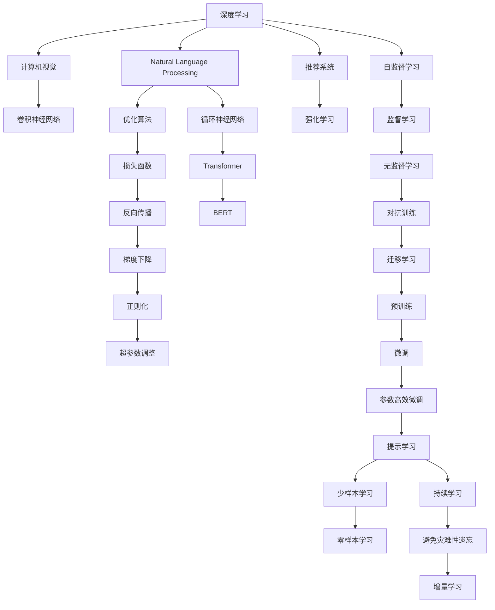

                 

# 软件 2.0 的发展趋势：深度学习、强化学习

> 关键词：软件2.0,深度学习,强化学习,人工智能,机器学习,算法优化,自然语言处理(NLP),计算机视觉(CV),推荐系统

## 1. 背景介绍

### 1.1 问题由来
近年来，随着深度学习（Deep Learning, DL）和强化学习（Reinforcement Learning, RL）技术的飞速发展，软件工程和人工智能（AI）的边界正在逐渐模糊。软件2.0时代的到来，意味着软件不再仅仅是由传统编程语言和架构驱动，而是由智能算法和数据驱动。这一变化深刻影响了软件开发和应用的方方面面，使得软件系统的复杂性和功能边界被重新定义。

深度学习和强化学习作为软件2.0时代的重要技术支撑，正逐步成为构建智能软件系统的关键工具。深度学习在自然语言处理、计算机视觉、推荐系统等领域展现了强大的应用潜力；而强化学习则在自动驾驶、机器人控制、游戏AI等方向取得了显著进展。这两大技术领域的融合和发展，正在重塑软件系统的未来。

### 1.2 问题核心关键点
软件2.0时代，深度学习和强化学习的核心关键点主要包括以下几个方面：

- 数据驱动的开发模式：深度学习和强化学习依赖大量高质量数据进行训练和优化，数据质量直接影响模型性能。
- 算法复杂性与计算资源：深度学习模型通常具有复杂的网络结构，需要耗费大量计算资源进行训练；强化学习则涉及到环境交互和奖励反馈，需要动态调整策略参数。
- 模型可解释性与安全性：深度学习模型的“黑盒”特性使得其难以解释和调试；强化学习模型在特定环境下的决策行为可能存在安全风险。
- 跨领域应用：深度学习和强化学习在多个领域具有广泛应用前景，如自然语言处理、计算机视觉、智能推荐等。

### 1.3 问题研究意义
研究深度学习和强化学习的发展趋势，对于推动软件2.0时代的技术革新，构建智能化、自动化的软件系统具有重要意义：

1. 加速软件开发进程：深度学习和强化学习可以自动化处理复杂的任务，如自然语言理解、图像识别等，极大地提高了开发效率。
2. 提升软件系统性能：通过智能算法优化，软件系统可以在数据驱动下不断迭代优化，提升系统功能和用户体验。
3. 降低开发与运维成本：智能算法可以自动化完成数据分析、模型训练、性能优化等任务，减少了人工干预的需求，降低了开发与运维成本。
4. 促进跨领域融合：深度学习和强化学习的应用范围广泛，不同领域的技术可以相互借鉴，推动技术创新和应用扩展。
5. 推动伦理与监管研究：智能算法在应用中涉及伦理与监管问题，如算法偏见、数据隐私等，需要深入研究以保障系统的公平性与安全性。

## 2. 核心概念与联系

### 2.1 核心概念概述

为了更好地理解深度学习和强化学习的发展趋势，本节将介绍几个密切相关的核心概念：

- 深度学习（Deep Learning, DL）：基于多层神经网络，通过反向传播算法优化模型参数，学习输入数据的高级特征，广泛应用于自然语言处理、计算机视觉等领域。
- 强化学习（Reinforcement Learning, RL）：通过智能体在环境中与环境互动，通过奖励和惩罚信号调整策略参数，学习最优决策行为，广泛应用于自动驾驶、游戏AI等领域。
- 计算机视觉（Computer Vision, CV）：研究如何让计算机"看懂"图像和视频，通过深度学习模型进行图像分类、目标检测、图像生成等任务。
- 自然语言处理（Natural Language Processing, NLP）：研究如何让计算机理解、处理、生成自然语言，通过深度学习模型进行文本分类、情感分析、机器翻译等任务。
- 推荐系统（Recommendation System, RS）：通过用户行为数据，推荐用户可能感兴趣的商品或内容，广泛应用于电商、社交网络等领域。

这些核心概念之间的逻辑关系可以通过以下Mermaid流程图来展示：



这个流程图展示了大语言模型的核心概念及其之间的关系：

1. 深度学习是大语言模型微调的基础，通过多层神经网络学习高级特征。
2. 强化学习在大语言模型的参数更新和优化中起到关键作用。
3. 计算机视觉和自然语言处理是大语言模型常用的任务类型。
4. 推荐系统是大语言模型的实际应用场景之一。
5. 优化算法、损失函数、梯度下降、正则化、超参数调整等是大语言模型微调的关键技术。

这些概念共同构成了大语言模型的学习和应用框架，使其能够在各种场景下发挥强大的语言理解和生成能力。通过理解这些核心概念，我们可以更好地把握深度学习和强化学习的发展方向。

## 3. 核心算法原理 & 具体操作步骤

### 3.1 算法原理概述

深度学习和强化学习的核心原理可以简要概述为：

- 深度学习：通过多层神经网络对输入数据进行特征提取和变换，并通过反向传播算法优化模型参数，使得模型输出逼近目标值。
- 强化学习：智能体在环境中与环境互动，通过奖励和惩罚信号调整策略参数，学习最优决策行为，从而最大化累计奖励。

在软件2.0时代，深度学习和强化学习的应用场景和算法模型不断扩展，推动了软件系统在复杂性、智能性和自适应性方面的进步。这些进步体现在以下几个方面：

1. 模型复杂度的提升：深度神经网络结构和参数量的不断增加，使得模型可以学习到更复杂、更抽象的特征表示。
2. 计算资源的需求增加：深度学习和强化学习的算法优化和模型训练需要大量计算资源，特别是GPU、TPU等高性能设备。
3. 数据驱动的优化：深度学习和强化学习依赖大量标注数据进行训练和优化，数据质量直接影响模型性能。
4. 模型可解释性的需求：深度学习模型的复杂性使得其难以解释和调试，强化学习模型的策略选择存在不可预测性，需要更多的研究和优化。
5. 跨领域应用的拓展：深度学习和强化学习在多个领域具有广泛应用前景，如自然语言处理、计算机视觉、智能推荐等。

### 3.2 算法步骤详解

#### 3.2.1 深度学习算法步骤

1. 数据预处理：包括数据清洗、归一化、分词、图像增强等预处理步骤，以便模型更好地学习数据特征。
2. 构建模型架构：选择合适的深度学习模型，如卷积神经网络（CNN）、循环神经网络（RNN）、Transformer等，构建模型架构。
3. 训练模型：将预处理后的数据输入模型，通过反向传播算法优化模型参数，使得模型输出逼近目标值。
4. 验证和测试：在验证集和测试集上评估模型性能，选择最优模型进行应用。

#### 3.2.2 强化学习算法步骤

1. 环境定义：定义智能体和环境交互的规则，确定状态、动作、奖励等基本元素。
2. 策略选择：选择合适的强化学习算法，如Q-learning、Policy Gradient等，定义智能体的策略。
3. 训练智能体：通过环境交互，智能体根据奖励信号调整策略参数，学习最优决策行为。
4. 测试和评估：在测试环境中评估智能体的性能，选择最优策略进行应用。

### 3.3 算法优缺点

深度学习和强化学习的优点包括：

1. 模型表达能力强：深度学习模型能够学习到复杂的非线性特征，强化学习模型能够适应环境变化，优化决策行为。
2. 数据驱动的优化：深度学习和强化学习能够通过数据驱动的优化方法，提升模型性能。
3. 自动化程度高：深度学习和强化学习能够自动化处理数据、模型训练和参数优化等任务，减少人工干预。

然而，这些算法也存在一些缺点：

1. 数据依赖性强：深度学习和强化学习需要大量标注数据进行训练，数据不足可能导致模型性能下降。
2. 计算资源消耗大：深度学习和强化学习的模型复杂度高，需要高性能设备进行训练和推理。
3. 模型可解释性差：深度学习模型的黑盒特性使得其难以解释和调试，强化学习策略的不可预测性也增加了模型的复杂性。
4. 过拟合风险高：深度学习和强化学习模型容易过拟合，需要采取多种方法缓解过拟合风险。

### 3.4 算法应用领域

深度学习和强化学习在多个领域具有广泛应用，以下是几个主要应用领域：

1. 自然语言处理（NLP）：深度学习模型在文本分类、情感分析、机器翻译等任务上取得了显著成果；强化学习在聊天机器人、智能问答系统等方向展现了潜力。
2. 计算机视觉（CV）：深度学习模型在图像分类、目标检测、图像生成等任务上表现优异；强化学习在自动驾驶、机器人视觉等方向有广泛应用。
3. 推荐系统（RS）：深度学习模型在推荐系统中的用户行为建模、物品相似度计算等环节有显著效果；强化学习在个性化推荐、用户行为预测等方面有应用前景。
4. 游戏AI：强化学习在自动游戏AI、游戏策略优化等方面具有优势。
5. 医疗领域：深度学习在医学影像分析、病历分析等方向有应用；强化学习在医疗决策、机器人手术等方面有潜力。

此外，深度学习和强化学习在金融、电商、智能制造、智能家居等众多领域也具有广泛应用，推动了这些行业的智能化进程。

## 4. 数学模型和公式 & 详细讲解 & 举例说明

### 4.1 数学模型构建

#### 4.1.1 深度学习数学模型

假设深度学习模型为 $M(x; \theta)$，其中 $x$ 为输入数据，$\theta$ 为模型参数。定义模型在训练集 $D=\{(x_i, y_i)\}_{i=1}^N$ 上的损失函数为：

$$
\mathcal{L}(\theta) = \frac{1}{N} \sum_{i=1}^N \ell(M(x_i; \theta), y_i)
$$

其中 $\ell$ 为损失函数，$\ell(M(x_i; \theta), y_i)$ 表示模型 $M(x; \theta)$ 在输入 $x_i$ 上的预测输出 $M(x_i; \theta)$ 与真实标签 $y_i$ 之间的差异。

#### 4.1.2 强化学习数学模型

假设强化学习环境为 $E$，智能体策略为 $\pi(a|s)$，定义状态空间为 $S$，动作空间为 $A$，奖励函数为 $R(s, a, s')$，则强化学习模型的优化目标为最大化累计奖励：

$$
\max_{\pi} \mathbb{E}_{(s, a, s') \sim \pi} [\sum_{t=1}^{\infty} \gamma^{t-1} R(s_t, a_t, s_{t+1})]
$$

其中 $\gamma$ 为折扣因子，用于调整未来奖励的重要性。

### 4.2 公式推导过程

#### 4.2.1 深度学习公式推导

以多分类任务为例，假设模型 $M(x; \theta)$ 为 $K$ 类分类器，输入为 $x$，输出为 $\hat{y} \in [0,1]^K$，真实标签为 $y \in \{1,0\}^K$。二分类交叉熵损失函数为：

$$
\ell(M(x; \theta), y) = -[y_k \log \hat{y}_k + (1-y_k) \log (1-\hat{y}_k)]
$$

其中 $k$ 为类别编号，$y_k=1$ 表示样本属于类别 $k$。

#### 4.2.2 强化学习公式推导

以Q-learning算法为例，定义状态-动作对 $(s, a)$ 的Q值函数为 $Q(s, a)$，状态转移概率为 $P(s'|s, a)$，奖励函数为 $R(s, a, s')$。Q-learning的优化目标为最大化状态-动作对的Q值：

$$
Q(s, a) \leftarrow Q(s, a) + \alpha [r + \gamma \max_{a'} Q(s', a') - Q(s, a)]
$$

其中 $\alpha$ 为学习率，$r$ 为即时奖励，$\gamma$ 为折扣因子。

### 4.3 案例分析与讲解

#### 4.3.1 深度学习案例：图像分类

以ImageNet数据集为例，深度学习模型如ResNet、Inception等通过多层卷积神经网络对图像进行特征提取和分类。具体步骤如下：

1. 数据预处理：对图像进行归一化、中心裁剪等预处理。
2. 构建模型：选择ResNet、Inception等卷积神经网络模型。
3. 训练模型：将预处理后的图像数据输入模型，通过反向传播算法优化模型参数。
4. 验证和测试：在验证集和测试集上评估模型性能，选择最优模型进行应用。

#### 4.3.2 强化学习案例：自动驾驶

自动驾驶系统通过深度学习和强化学习技术实现自主驾驶。具体步骤如下：

1. 环境定义：定义车辆状态、传感器数据、道路环境等元素，确定状态空间、动作空间和奖励函数。
2. 策略选择：选择深度Q网络（DQN）、Actor-Critic等强化学习算法，定义智能体的策略。
3. 训练智能体：通过环境交互，智能体根据奖励信号调整策略参数，学习最优驾驶策略。
4. 测试和评估：在测试环境中评估智能体的性能，选择最优策略进行应用。

## 5. 项目实践：代码实例和详细解释说明

### 5.1 开发环境搭建

在进行深度学习和强化学习实践前，我们需要准备好开发环境。以下是使用Python进行TensorFlow和Keras开发的环境配置流程：

1. 安装Anaconda：从官网下载并安装Anaconda，用于创建独立的Python环境。

2. 创建并激活虚拟环境：
```bash
conda create -n deep_learning_env python=3.8 
conda activate deep_learning_env
```

3. 安装TensorFlow和Keras：
```bash
conda install tensorflow==2.4.1 
pip install keras==2.4.3
```

4. 安装各类工具包：
```bash
pip install numpy pandas scikit-learn matplotlib tqdm jupyter notebook ipython
```

完成上述步骤后，即可在`deep_learning_env`环境中开始深度学习和强化学习的实践。

### 5.2 源代码详细实现

这里我们以图像分类任务为例，给出使用Keras进行卷积神经网络（CNN）模型微调的PyTorch代码实现。

```python
from keras.models import Sequential
from keras.layers import Conv2D, MaxPooling2D, Flatten, Dense
from keras.preprocessing.image import ImageDataGenerator

# 构建CNN模型
model = Sequential()
model.add(Conv2D(32, (3, 3), activation='relu', input_shape=(32, 32, 3)))
model.add(MaxPooling2D(pool_size=(2, 2)))
model.add(Conv2D(64, (3, 3), activation='relu'))
model.add(MaxPooling2D(pool_size=(2, 2)))
model.add(Flatten())
model.add(Dense(128, activation='relu'))
model.add(Dense(10, activation='softmax'))

# 编译模型
model.compile(optimizer='adam', loss='categorical_crossentropy', metrics=['accuracy'])

# 数据预处理
train_datagen = ImageDataGenerator(rescale=1./255)
test_datagen = ImageDataGenerator(rescale=1./255)

train_generator = train_datagen.flow_from_directory(
        'train_dir',
        target_size=(32, 32),
        batch_size=32,
        class_mode='categorical')

test_generator = test_datagen.flow_from_directory(
        'test_dir',
        target_size=(32, 32),
        batch_size=32,
        class_mode='categorical')

# 训练模型
model.fit(train_generator, epochs=10, validation_data=test_generator)

# 评估模型
test_loss, test_acc = model.evaluate(test_generator)
print('Test accuracy:', test_acc)
```

### 5.3 代码解读与分析

让我们再详细解读一下关键代码的实现细节：

**Sequential模型构建**：
- `Sequential` 模型是一种线性堆叠的模型，通过 `add` 方法逐层添加模型层。

**卷积层和池化层**：
- `Conv2D` 和 `MaxPooling2D` 用于构建卷积神经网络，卷积层用于特征提取，池化层用于降维和特征选择。

**全连接层**：
- `Flatten` 层用于将卷积层的输出展平，`Dense` 层用于连接分类器，进行分类。

**损失函数和优化器**：
- `categorical_crossentropy` 用于多分类任务，`adam` 优化器用于模型训练。

**数据增强**：
- `ImageDataGenerator` 用于数据增强，`rescale` 用于数据归一化，`flow_from_directory` 用于批量加载数据。

**模型训练与评估**：
- `fit` 方法用于训练模型，`evaluate` 方法用于评估模型性能。

以上代码实现了基本的卷积神经网络模型，并使用Keras进行模型训练和评估。Keras的简洁和易用性，使得深度学习模型的开发和调试变得更加简单高效。

当然，工业级的系统实现还需考虑更多因素，如模型的保存和部署、超参数的自动搜索、更灵活的任务适配层等。但核心的算法模型和训练过程基本与此类似。

## 6. 实际应用场景

### 6.1 智能推荐系统

深度学习和强化学习在推荐系统中的应用主要体现在以下几个方面：

1. 用户行为建模：通过深度学习模型学习用户的历史行为数据，生成用户行为特征向量。
2. 物品相似度计算：通过深度学习模型学习物品的属性和关系，计算物品间的相似度。
3. 推荐策略优化：通过强化学习算法优化推荐策略，最大化用户满意度和平台收益。

智能推荐系统通过深度学习和强化学习技术，能够实时分析用户行为数据，动态生成推荐结果，显著提升用户满意度和平台收益。例如，电商平台的商品推荐、社交网络的内容推荐等应用，都已经采用了基于深度学习和强化学习的推荐系统，取得了显著效果。

### 6.2 游戏AI

游戏AI是深度学习和强化学习的重要应用领域之一。通过深度学习模型处理游戏状态，通过强化学习算法优化游戏策略，AI能够在各种游戏场景中展现出超人类的游戏水平。例如，AlphaGo通过深度学习和强化学习技术，在围棋、AlphaStar中通过深度强化学习算法，在星际争霸等游戏中也取得了优秀表现。

### 6.3 自动驾驶

自动驾驶技术是深度学习和强化学习的典型应用之一。通过深度学习模型处理传感器数据，通过强化学习算法优化驾驶策略，自动驾驶汽车能够在复杂的城市道路环境中安全行驶。例如，Waymo、Tesla等公司的自动驾驶系统，已经采用了深度学习和强化学习技术，实现了L4级别的自动驾驶功能。

### 6.4 未来应用展望

随着深度学习和强化学习技术的不断进步，未来在以下几个方向有望取得新的突破：

1. 跨模态学习：将深度学习和强化学习应用于多模态数据融合，如图像、语音、文本等数据的联合建模。
2. 自监督学习：利用无标注数据进行预训练，提升模型的泛化能力和可解释性。
3. 联邦学习：在分布式环境中进行模型训练，保护数据隐私。
4. 对抗训练：提高模型对抗噪声和攻击的能力，增强系统的鲁棒性。
5. 分布式训练：在大规模数据集上进行模型训练，提高训练效率。

深度学习和强化学习在多个领域的应用前景广阔，未来将在更多场景中大放异彩，带来新的技术革新和产业变革。

## 7. 工具和资源推荐

### 7.1 学习资源推荐

为了帮助开发者系统掌握深度学习和强化学习的发展趋势和应用实践，这里推荐一些优质的学习资源：

1. 《深度学习》（Deep Learning）书籍：Ian Goodfellow、Yoshua Bengio和Aaron Courville所著，全面介绍了深度学习的基本概念和算法。
2. 《强化学习》（Reinforcement Learning: An Introduction）书籍：Richard S. Sutton和Andrew G. Barto所著，系统讲解了强化学习的基本理论和算法。
3. Deep Learning Specialization课程：由Coursera和Andrew Ng合作开发的深度学习课程，涵盖深度学习的多个重要主题。
4. Reinforcement Learning Specialization课程：由Coursera和David Silver合作开发的强化学习课程，涵盖强化学习的多个重要主题。
5. arXiv.org：深度学习和强化学习的最新研究成果和论文，关注最新技术动态。

通过对这些资源的学习实践，相信你一定能够快速掌握深度学习和强化学习的精髓，并用于解决实际的AI问题。

### 7.2 开发工具推荐

高效的开发离不开优秀的工具支持。以下是几款用于深度学习和强化学习开发的常用工具：

1. TensorFlow：由Google主导开发的深度学习框架，支持分布式训练和模型优化，适合大规模工程应用。
2. PyTorch：由Facebook主导开发的深度学习框架，易于使用和扩展，适合研究与开发。
3. Keras：基于TensorFlow和Theano开发的高级深度学习框架，易于上手，适合快速迭代研究。
4. OpenAI Gym：用于测试和比较强化学习算法的开源环境，提供了丰富的环境库和评估工具。
5. TensorBoard：TensorFlow配套的可视化工具，可实时监测模型训练状态，并提供丰富的图表呈现方式。
6. Weights & Biases：模型训练的实验跟踪工具，可以记录和可视化模型训练过程中的各项指标，方便对比和调优。

合理利用这些工具，可以显著提升深度学习和强化学习任务的开发效率，加快创新迭代的步伐。

### 7.3 相关论文推荐

深度学习和强化学习作为AI领域的重要技术，已经产生了大量经典和前沿的研究成果。以下是几篇奠基性的相关论文，推荐阅读：

1. Deep Residual Learning for Image Recognition（ResNet论文）：提出了深度残差网络，解决了深度神经网络训练中的梯度消失问题，显著提升了模型性能。
2. ImageNet Classification with Deep Convolutional Neural Networks：提出了卷积神经网络模型，在ImageNet数据集上取得了突破性成果。
3. Playing Atari with Deep Reinforcement Learning（AlphaGo论文）：展示了通过深度强化学习技术，AI在围棋游戏中达到了人类水平。
4. Human-level Control through Deep Reinforcement Learning：展示了通过深度强化学习技术，AI在星际争霸等游戏中取得了人类水平的表现。
5. AlphaStar: Playing StarCraft at the Grandmaster Level：展示了通过深度强化学习技术，AI在星际争霸游戏中达到了人类顶级玩家水平。

这些论文代表了大语言模型微调技术的发展脉络。通过学习这些前沿成果，可以帮助研究者把握学科前进方向，激发更多的创新灵感。

## 8. 总结：未来发展趋势与挑战

### 8.1 研究成果总结

深度学习和强化学习在多个领域展示了强大的应用潜力，推动了软件2.0时代的技术革新。深度学习在自然语言处理、计算机视觉、推荐系统等领域取得了显著成果；强化学习在游戏AI、自动驾驶、智能推荐等方面展现出了良好的应用前景。

### 8.2 未来发展趋势

展望未来，深度学习和强化学习的发展趋势将呈现以下几个方向：

1. 模型复杂度的提升：深度神经网络结构和参数量的不断增加，使得模型可以学习到更复杂、更抽象的特征表示。
2. 计算资源的需求增加：深度学习和强化学习的算法优化和模型训练需要大量计算资源，特别是高性能设备。
3. 数据驱动的优化：深度学习和强化学习依赖大量标注数据进行训练和优化，数据质量直接影响模型性能。
4. 模型可解释性的需求：深度学习模型的复杂性使得其难以解释和调试，强化学习策略的不可预测性也增加了模型的复杂性。
5. 跨领域应用的拓展：深度学习和强化学习在多个领域具有广泛应用前景，如自然语言处理、计算机视觉、智能推荐等。

### 8.3 面临的挑战

尽管深度学习和强化学习在多个领域展现了强大的应用潜力，但在迈向更加智能化、普适化应用的过程中，仍面临诸多挑战：

1. 数据依赖性强：深度学习和强化学习需要大量标注数据进行训练，数据不足可能导致模型性能下降。
2. 计算资源消耗大：深度学习和强化学习的模型复杂度高，需要高性能设备进行训练和推理。
3. 模型可解释性差：深度学习模型的复杂性使得其难以解释和调试，强化学习策略的不可预测性也增加了模型的复杂性。
4. 过拟合风险高：深度学习和强化学习模型容易过拟合，需要采取多种方法缓解过拟合风险。
5. 伦理与监管问题：深度学习和强化学习在应用中涉及伦理与监管问题，如算法偏见、数据隐私等，需要深入研究以保障系统的公平性与安全性。

### 8.4 研究展望

为了应对这些挑战，未来的研究需要在以下几个方面寻求新的突破：

1. 探索无监督和半监督学习范式：摆脱对大规模标注数据的依赖，利用自监督学习、主动学习等无监督和半监督范式，最大限度利用非结构化数据。
2. 研究参数高效和计算高效的微调范式：开发更加参数高效的微调方法，在固定大部分预训练参数的同时，只更新极少量的任务相关参数。同时优化微调模型的计算图，减少前向传播和反向传播的资源消耗，实现更加轻量级、实时性的部署。
3. 融合因果分析和博弈论工具：将因果分析方法引入微调模型，识别出模型决策的关键特征，增强输出解释的因果性和逻辑性。借助博弈论工具刻画人机交互过程，主动探索并规避模型的脆弱点，提高系统稳定性。
4. 纳入伦理道德约束：在模型训练目标中引入伦理导向的评估指标，过滤和惩罚有偏见、有害的输出倾向。同时加强人工干预和审核，建立模型行为的监管机制，确保输出符合人类价值观和伦理道德。

这些研究方向将引领深度学习和强化学习技术的进一步发展，推动其在更广泛的应用领域落地，构建更加智能、安全的AI系统。

## 9. 附录：常见问题与解答

**Q1：深度学习和强化学习的区别是什么？**

A: 深度学习是一种通过多层神经网络学习数据的高级特征表示的算法，主要用于图像识别、自然语言处理等任务；强化学习是一种通过智能体在环境中与环境互动，通过奖励和惩罚信号调整策略参数，学习最优决策行为的算法，主要用于游戏AI、自动驾驶等任务。

**Q2：深度学习和强化学习有哪些应用场景？**

A: 深度学习和强化学习在多个领域具有广泛应用，如自然语言处理、计算机视觉、智能推荐、游戏AI、自动驾驶等。

**Q3：深度学习和强化学习有哪些优缺点？**

A: 深度学习的优点包括模型表达能力强、数据驱动的优化、自动化程度高；缺点包括数据依赖性强、计算资源消耗大、模型可解释性差、过拟合风险高。强化学习的优点包括适应环境变化、优化决策行为；缺点包括环境复杂度高、策略选择不可预测、模型复杂性高。

**Q4：深度学习和强化学习有哪些发展趋势？**

A: 深度学习和强化学习的发展趋势包括模型复杂度提升、计算资源需求增加、数据驱动的优化、模型可解释性需求、跨领域应用拓展等。

**Q5：深度学习和强化学习面临哪些挑战？**

A: 深度学习和强化学习面临的挑战包括数据依赖性强、计算资源消耗大、模型可解释性差、过拟合风险高、伦理与监管问题等。

以上问题及解答，旨在帮助读者更好地理解深度学习和强化学习的核心概念和应用前景，为未来的研究和发展提供参考。

