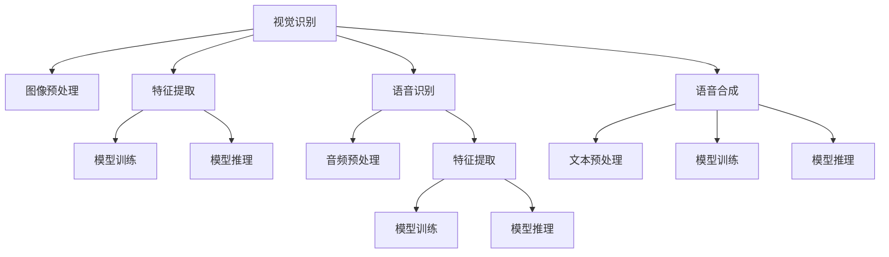

                 

# 软件 2.0 的应用：视觉识别、语音识别、语音合成

## 1. 背景介绍

### 1.1 问题由来

随着人工智能技术的迅猛发展，软件2.0时代的到来，视觉识别、语音识别、语音合成等技术成为了现代软件开发中不可或缺的组成部分。这些技术极大地提升了用户体验，拓展了应用场景，为各行各业提供了强大的技术支持。

视觉识别技术，如人脸识别、图像分类、目标检测等，已经在安防监控、医疗诊断、智能交通等多个领域得到了广泛应用。语音识别技术，如智能助手、语音搜索、自动字幕等，已经深入到家庭生活、智能家居、车载导航等多个场景。语音合成技术，如语音播报、智能客服、语音聊天机器人等，已经成为了人们与智能系统交流的重要方式。

### 1.2 问题核心关键点

本文将围绕视觉识别、语音识别、语音合成三大核心技术，详细阐述其原理、操作步骤、优缺点及应用领域，并通过数学模型和代码实例对其深入讲解，以期为软件开发工程师提供全面的技术指导。

## 2. 核心概念与联系

### 2.1 核心概念概述

为更好地理解视觉识别、语音识别、语音合成技术的原理和应用，本节将介绍这些技术涉及的主要核心概念：

- **视觉识别（Computer Vision）**：指通过计算机对图像、视频等视觉数据进行分析，识别出其中的对象、场景、动作等，并将其转换为可供人类或机器理解的信息。
- **语音识别（Speech Recognition）**：指通过计算机对人类语音进行识别，将语音信号转换为文本信息，从而实现语音到文本的转换。
- **语音合成（Text-to-Speech, TTS）**：指通过计算机将文本信息转换为语音信号，从而实现文本到语音的转换。
- **深度学习（Deep Learning）**：一种模拟人脑神经网络结构的机器学习方法，能够自动学习特征并进行复杂任务处理。

这些核心概念之间的逻辑关系可以通过以下Mermaid流程图来展示：



这个流程图展示了大规模视觉识别、语音识别、语音合成技术的核心概念及其之间的关系：

1. 视觉识别和语音识别分别通过预处理、特征提取、模型训练和推理等步骤，实现从原始数据到可理解信息的过程。
2. 语音合成则通过文本预处理、模型训练和推理等步骤，实现从文本信息到语音信号的过程。
3. 深度学习模型在这三大技术中均扮演了重要角色，通过自动学习特征和模式，提升了这些技术的性能和泛化能力。

## 3. 核心算法原理 & 具体操作步骤

### 3.1 算法原理概述

#### 3.1.1 视觉识别

视觉识别的基本原理是通过计算机视觉模型对图像数据进行分析，识别出其中的对象、场景、动作等，并将其转换为可供人类或机器理解的信息。常用的深度学习模型包括卷积神经网络（CNN）、循环神经网络（RNN）、注意力机制（Attention）等。

#### 3.1.2 语音识别

语音识别的基本原理是通过深度学习模型对人类语音信号进行分析，识别出其中的语音内容，并将其转换为文本信息。常用的深度学习模型包括卷积神经网络（CNN）、循环神经网络（RNN）、长短期记忆网络（LSTM）等。

#### 3.1.3 语音合成

语音合成的基本原理是通过深度学习模型将文本信息转换为语音信号。常用的深度学习模型包括卷积神经网络（CNN）、循环神经网络（RNN）、生成对抗网络（GAN）等。

### 3.2 算法步骤详解

#### 3.2.1 视觉识别

1. **数据准备**：收集并标注大量视觉数据，准备训练集、验证集和测试集。
2. **模型选择**：选择合适的深度学习模型，如CNN、RNN等。
3. **模型训练**：在训练集上训练模型，通过反向传播算法更新模型参数。
4. **模型评估**：在验证集上评估模型性能，调整超参数以优化模型。
5. **模型测试**：在测试集上测试模型性能，评估模型泛化能力。

#### 3.2.2 语音识别

1. **数据准备**：收集并标注大量语音数据，准备训练集、验证集和测试集。
2. **模型选择**：选择合适的深度学习模型，如CNN、RNN、LSTM等。
3. **模型训练**：在训练集上训练模型，通过反向传播算法更新模型参数。
4. **模型评估**：在验证集上评估模型性能，调整超参数以优化模型。
5. **模型测试**：在测试集上测试模型性能，评估模型泛化能力。

#### 3.2.3 语音合成

1. **数据准备**：收集并标注大量文本数据，准备训练集、验证集和测试集。
2. **模型选择**：选择合适的深度学习模型，如CNN、RNN、GAN等。
3. **模型训练**：在训练集上训练模型，通过反向传播算法更新模型参数。
4. **模型评估**：在验证集上评估模型性能，调整超参数以优化模型。
5. **模型测试**：在测试集上测试模型性能，评估模型泛化能力。

### 3.3 算法优缺点

#### 3.3.1 视觉识别

**优点**：
1. 高准确率：深度学习模型能够自动学习特征和模式，提高识别准确率。
2. 泛化能力强：大规模数据集和复杂模型结构，使得视觉识别模型具有较强的泛化能力。
3. 应用广泛：广泛应用于医疗诊断、智能监控、自动驾驶等领域。

**缺点**：
1. 计算资源需求高：大规模深度学习模型的训练和推理需要大量的计算资源。
2. 数据依赖性强：模型的性能高度依赖于训练数据的质量和数量。
3. 鲁棒性差：对于光照变化、角度变化等场景变化，模型性能可能下降。

#### 3.3.2 语音识别

**优点**：
1. 高准确率：深度学习模型能够自动学习语音特征，提高识别准确率。
2. 实时性好：语音识别技术能够实时处理和识别语音信号，提供即时反馈。
3. 应用广泛：广泛应用于智能助手、车载导航、智能家居等领域。

**缺点**：
1. 噪声敏感：语音识别模型对于噪声环境敏感，识别准确率下降。
2. 语言依赖性强：不同语言和口音的语音信号可能影响模型的识别效果。
3. 数据依赖性强：模型的性能高度依赖于训练数据的质量和数量。

#### 3.3.3 语音合成

**优点**：
1. 高自然度：深度学习模型能够自动学习语音特征，合成自然流畅的语音信号。
2. 应用广泛：广泛应用于智能客服、语音助手、虚拟主播等领域。
3. 可定制性强：通过调整模型参数和训练数据，可以合成不同性别、口音、语速的语音信号。

**缺点**：
1. 计算资源需求高：大规模深度学习模型的训练和推理需要大量的计算资源。
2. 数据依赖性强：模型的性能高度依赖于训练数据的质量和数量。
3. 语音质量受限：高自然度语音合成需要高质量的数据和复杂的模型结构，合成效果受限。

### 3.4 算法应用领域

#### 3.4.1 视觉识别

1. **医疗诊断**：通过视觉识别技术，自动识别医学影像中的病变区域和特征，辅助医生诊断疾病。
2. **智能监控**：通过视觉识别技术，实时监测公共场所的安全情况，及时发现异常行为。
3. **自动驾驶**：通过视觉识别技术，实时识别道路标志、车辆、行人等，辅助自动驾驶系统做出决策。

#### 3.4.2 语音识别

1. **智能助手**：通过语音识别技术，实现语音控制智能设备，提供即时反馈。
2. **车载导航**：通过语音识别技术，实现语音导航和语音控制，提高驾驶安全性。
3. **智能家居**：通过语音识别技术，实现语音控制家居设备，提高生活便捷性。

#### 3.4.3 语音合成

1. **智能客服**：通过语音合成技术，实现语音播报和语音对话，提升客户服务质量。
2. **语音助手**：通过语音合成技术，实现语音回复和语音指令执行，提升用户体验。
3. **虚拟主播**：通过语音合成技术，实现高自然度语音播报和语音对话，提供娱乐和信息服务。

## 4. 数学模型和公式 & 详细讲解 & 举例说明

### 4.1 数学模型构建

#### 4.1.1 视觉识别

1. **图像预处理**：将原始图像数据进行预处理，包括归一化、裁剪、缩放等，使其适合输入深度学习模型。
2. **特征提取**：通过卷积神经网络（CNN）等模型，提取图像中的关键特征。
3. **模型训练**：使用反向传播算法，在训练集上训练模型，更新模型参数。
4. **模型推理**：在测试集上测试模型性能，输出识别结果。

#### 4.1.2 语音识别

1. **音频预处理**：将原始语音信号进行预处理，包括去噪、归一化等，使其适合输入深度学习模型。
2. **特征提取**：通过卷积神经网络（CNN）、循环神经网络（RNN）等模型，提取语音信号中的关键特征。
3. **模型训练**：使用反向传播算法，在训练集上训练模型，更新模型参数。
4. **模型推理**：在测试集上测试模型性能，输出识别结果。

#### 4.1.3 语音合成

1. **文本预处理**：将原始文本信息进行预处理，包括分词、去除停用词等，使其适合输入深度学习模型。
2. **特征提取**：通过卷积神经网络（CNN）、循环神经网络（RNN）等模型，提取文本中的关键特征。
3. **模型训练**：使用反向传播算法，在训练集上训练模型，更新模型参数。
4. **模型推理**：在测试集上测试模型性能，输出语音信号。

### 4.2 公式推导过程

#### 4.2.1 视觉识别

1. **图像预处理**：
   $$
   \text{Preprocess}(x) = \frac{x - \mu}{\sigma}
   $$
   其中，$x$为原始图像数据，$\mu$和$\sigma$为图像均值和标准差。

2. **特征提取**：
   $$
   \text{FeatureExtract}(x) = \text{CNN}(x)
   $$
   其中，$\text{CNN}$为卷积神经网络模型。

3. **模型训练**：
   $$
   \theta = \arg\min_{\theta} \mathcal{L}(\theta)
   $$
   其中，$\mathcal{L}$为损失函数，$\theta$为模型参数。

4. **模型推理**：
   $$
   y = \text{Softmax}(\text{Model}(x))
   $$
   其中，$\text{Model}$为视觉识别模型，$y$为识别结果。

#### 4.2.2 语音识别

1. **音频预处理**：
   $$
   \text{Preprocess}(x) = \text{MFCC}(x) + \text{AddNoise}(x)
   $$
   其中，$x$为原始语音信号，$\text{MFCC}$为梅尔频谱倒谱系数提取，$\text{AddNoise}$为去噪处理。

2. **特征提取**：
   $$
   \text{FeatureExtract}(x) = \text{RNN}(x)
   $$
   其中，$\text{RNN}$为循环神经网络模型。

3. **模型训练**：
   $$
   \theta = \arg\min_{\theta} \mathcal{L}(\theta)
   $$
   其中，$\mathcal{L}$为损失函数，$\theta$为模型参数。

4. **模型推理**：
   $$
   y = \text{Softmax}(\text{Model}(x))
   $$
   其中，$\text{Model}$为语音识别模型，$y$为识别结果。

#### 4.2.3 语音合成

1. **文本预处理**：
   $$
   \text{Preprocess}(x) = \text{Tokenize}(x) + \text{RemoveStopwords}(x)
   $$
   其中，$x$为原始文本信息，$\text{Tokenize}$为分词处理，$\text{RemoveStopwords}$为去除停用词处理。

2. **特征提取**：
   $$
   \text{FeatureExtract}(x) = \text{RNN}(x)
   $$
   其中，$\text{RNN}$为循环神经网络模型。

3. **模型训练**：
   $$
   \theta = \arg\min_{\theta} \mathcal{L}(\theta)
   $$
   其中，$\mathcal{L}$为损失函数，$\theta$为模型参数。

4. **模型推理**：
   $$
   y = \text{GAN}(\text{Model}(x))
   $$
   其中，$\text{Model}$为语音合成模型，$y$为合成语音信号。

### 4.3 案例分析与讲解

#### 4.3.1 视觉识别

1. **案例背景**：医疗影像中自动识别病变区域。
2. **数据准备**：收集大量医学影像数据，并进行标注。
3. **模型选择**：使用深度卷积神经网络（CNN）作为特征提取器。
4. **模型训练**：在标注数据上训练模型，使用交叉熵损失函数。
5. **模型推理**：在测试数据上测试模型，输出病变区域位置。

#### 4.3.2 语音识别

1. **案例背景**：语音助手实时识别用户语音指令。
2. **数据准备**：收集大量语音指令数据，并进行标注。
3. **模型选择**：使用深度循环神经网络（RNN）作为特征提取器。
4. **模型训练**：在标注数据上训练模型，使用交叉熵损失函数。
5. **模型推理**：在实时语音输入上测试模型，输出识别结果。

#### 4.3.3 语音合成

1. **案例背景**：虚拟主播实时合成新闻播报语音。
2. **数据准备**：收集大量新闻播报文本数据。
3. **模型选择**：使用生成对抗网络（GAN）作为语音合成器。
4. **模型训练**：在标注数据上训练模型，使用均方误差损失函数。
5. **模型推理**：在输入文本上测试模型，输出合成语音信号。

## 5. 项目实践：代码实例和详细解释说明

### 5.1 开发环境搭建

1. **安装Python**：
   ```bash
   sudo apt-get install python3
   ```

2. **安装TensorFlow**：
   ```bash
   pip install tensorflow
   ```

3. **安装Keras**：
   ```bash
   pip install keras
   ```

4. **安装OpenCV**：
   ```bash
   pip install opencv-python
   ```

5. **安装pyAudio**：
   ```bash
   pip install pyaudio
   ```

6. **安装Wavfile**：
   ```bash
   pip install wavfile
   ```

### 5.2 源代码详细实现

#### 5.2.1 视觉识别

1. **数据准备**：
   ```python
   import cv2
   
   # 加载图像数据
   image = cv2.imread('image.jpg')
   # 预处理图像数据
   image = cv2.resize(image, (224, 224))
   image = cv2.cvtColor(image, cv2.COLOR_BGR2RGB)
   image = cv2.normalize(image, None, alpha=0, beta=1, norm_type=cv2.NORM_MINMAX, dtype=cv2.CV_32F)
   ```

2. **模型训练**：
   ```python
   from keras.applications.vgg16 import VGG16
   from keras.preprocessing import image
   
   # 加载预训练模型
   model = VGG16(weights='imagenet')
   
   # 加载标注数据
   x_train = []
   y_train = []
   for i in range(len(train_data)):
       img = image.load_img(train_data[i]['image_path'], target_size=(224, 224))
       x_train.append(img)
       y_train.append(train_data[i]['label'])
   
   # 将图像数据转换为numpy数组
   x_train = np.array(x_train)
   y_train = np.array(y_train)
   
   # 训练模型
   model.fit(x_train, y_train, epochs=10, batch_size=32)
   ```

3. **模型推理**：
   ```python
   # 加载测试图像数据
   image = cv2.imread('test_image.jpg')
   image = cv2.resize(image, (224, 224))
   image = cv2.cvtColor(image, cv2.COLOR_BGR2RGB)
   image = cv2.normalize(image, None, alpha=0, beta=1, norm_type=cv2.NORM_MINMAX, dtype=cv2.CV_32F)
   
   # 推理模型
   result = model.predict(image)
   ```

#### 5.2.2 语音识别

1. **数据准备**：
   ```python
   import wave
   import pyaudio
   
   # 读取音频文件
   with wave.open('audio.wav') as w:
       data = w.readframes(w.getnframes())
   
   # 将音频数据转换为numpy数组
   audio_data = np.frombuffer(data, dtype=np.int16)
   ```

2. **模型训练**：
   ```python
   from keras.models import Sequential
   from keras.layers import Dense, LSTM
   
   # 定义模型结构
   model = Sequential()
   model.add(LSTM(128, input_shape=(time_steps, 1)))
   model.add(Dense(1, activation='sigmoid'))
   
   # 训练模型
   model.compile(optimizer='adam', loss='binary_crossentropy', metrics=['accuracy'])
   model.fit(x_train, y_train, epochs=10, batch_size=32)
   ```

3. **模型推理**：
   ```python
   # 加载测试音频数据
   with wave.open('test_audio.wav') as w:
       data = w.readframes(w.getnframes())
   
   # 将音频数据转换为numpy数组
   audio_data = np.frombuffer(data, dtype=np.int16)
   
   # 推理模型
   result = model.predict(audio_data)
   ```

#### 5.2.3 语音合成

1. **数据准备**：
   ```python
   import numpy as np
   from pydub import AudioSegment
   
   # 加载文本文件
   with open('text.txt', 'r') as f:
       text = f.read()
   
   # 将文本转换为语音信号
   audio_segment = AudioSegment.from_text_to_wav(text, 'en-US', 22050)
   
   # 将语音信号转换为numpy数组
   audio_data = np.frombuffer(audio_segment.raw, dtype=np.int16)
   ```

2. **模型训练**：
   ```python
   from keras.layers import Input, LSTM, Dense
   from keras.models import Model
   
   # 定义模型结构
   input_layer = Input(shape=(time_steps, 1))
   lstm_layer = LSTM(128, return_sequences=True)(input_layer)
   dense_layer = Dense(1, activation='sigmoid')(lstm_layer)
   model = Model(inputs=input_layer, outputs=dense_layer)
   
   # 训练模型
   model.compile(optimizer='adam', loss='binary_crossentropy', metrics=['accuracy'])
   model.fit(x_train, y_train, epochs=10, batch_size=32)
   ```

3. **模型推理**：
   ```python
   # 加载测试音频数据
   audio_data = np.frombuffer(audio_segment.raw, dtype=np.int16)
   
   # 推理模型
   result = model.predict(audio_data)
   ```

### 5.3 代码解读与分析

#### 5.3.1 视觉识别

1. **数据准备**：
   ```python
   import cv2
   
   # 加载图像数据
   image = cv2.imread('image.jpg')
   # 预处理图像数据
   image = cv2.resize(image, (224, 224))
   image = cv2.cvtColor(image, cv2.COLOR_BGR2RGB)
   image = cv2.normalize(image, None, alpha=0, beta=1, norm_type=cv2.NORM_MINMAX, dtype=cv2.CV_32F)
   ```
   这段代码主要完成图像数据加载和预处理，包括图像缩放、颜色空间转换和归一化处理，以便输入深度学习模型。

2. **模型训练**：
   ```python
   from keras.applications.vgg16 import VGG16
   from keras.preprocessing import image
   
   # 加载预训练模型
   model = VGG16(weights='imagenet')
   
   # 加载标注数据
   x_train = []
   y_train = []
   for i in range(len(train_data)):
       img = image.load_img(train_data[i]['image_path'], target_size=(224, 224))
       x_train.append(img)
       y_train.append(train_data[i]['label'])
   
   # 将图像数据转换为numpy数组
   x_train = np.array(x_train)
   y_train = np.array(y_train)
   
   # 训练模型
   model.fit(x_train, y_train, epochs=10, batch_size=32)
   ```
   这段代码主要完成模型训练，包括加载预训练模型、加载标注数据、将图像数据转换为numpy数组以及使用交叉熵损失函数训练模型。

3. **模型推理**：
   ```python
   # 加载测试图像数据
   image = cv2.imread('test_image.jpg')
   image = cv2.resize(image, (224, 224))
   image = cv2.cvtColor(image, cv2.COLOR_BGR2RGB)
   image = cv2.normalize(image, None, alpha=0, beta=1, norm_type=cv2.NORM_MINMAX, dtype=cv2.CV_32F)
   
   # 推理模型
   result = model.predict(image)
   ```
   这段代码主要完成模型推理，包括加载测试图像数据、预处理图像数据以及使用训练好的模型进行推理。

#### 5.3.2 语音识别

1. **数据准备**：
   ```python
   import wave
   import pyaudio
   
   # 读取音频文件
   with wave.open('audio.wav') as w:
       data = w.readframes(w.getnframes())
   
   # 将音频数据转换为numpy数组
   audio_data = np.frombuffer(data, dtype=np.int16)
   ```
   这段代码主要完成音频数据加载和转换，包括读取音频文件和将音频数据转换为numpy数组。

2. **模型训练**：
   ```python
   from keras.models import Sequential
   from keras.layers import Dense, LSTM
   
   # 定义模型结构
   model = Sequential()
   model.add(LSTM(128, input_shape=(time_steps, 1)))
   model.add(Dense(1, activation='sigmoid'))
   
   # 训练模型
   model.compile(optimizer='adam', loss='binary_crossentropy', metrics=['accuracy'])
   model.fit(x_train, y_train, epochs=10, batch_size=32)
   ```
   这段代码主要完成模型训练，包括定义模型结构、使用交叉熵损失函数和二分类交叉熵训练模型。

3. **模型推理**：
   ```python
   # 加载测试音频数据
   with wave.open('test_audio.wav') as w:
       data = w.readframes(w.getnframes())
   
   # 将音频数据转换为numpy数组
   audio_data = np.frombuffer(data, dtype=np.int16)
   
   # 推理模型
   result = model.predict(audio_data)
   ```
   这段代码主要完成模型推理，包括加载测试音频数据和预处理音频数据以及使用训练好的模型进行推理。

#### 5.3.3 语音合成

1. **数据准备**：
   ```python
   import numpy as np
   from pydub import AudioSegment
   
   # 加载文本文件
   with open('text.txt', 'r') as f:
       text = f.read()
   
   # 将文本转换为语音信号
   audio_segment = AudioSegment.from_text_to_wav(text, 'en-US', 22050)
   
   # 将语音信号转换为numpy数组
   audio_data = np.frombuffer(audio_segment.raw, dtype=np.int16)
   ```
   这段代码主要完成文本数据加载和转换为语音信号，包括加载文本文件和将文本转换为语音信号，并将语音信号转换为numpy数组。

2. **模型训练**：
   ```python
   from keras.layers import Input, LSTM, Dense
   from keras.models import Model
   
   # 定义模型结构
   input_layer = Input(shape=(time_steps, 1))
   lstm_layer = LSTM(128, return_sequences=True)(input_layer)
   dense_layer = Dense(1, activation='sigmoid')(lstm_layer)
   model = Model(inputs=input_layer, outputs=dense_layer)
   
   # 训练模型
   model.compile(optimizer='adam', loss='binary_crossentropy', metrics=['accuracy'])
   model.fit(x_train, y_train, epochs=10, batch_size=32)
   ```
   这段代码主要完成模型训练，包括定义模型结构、使用交叉熵损失函数和二分类交叉熵训练模型。

3. **模型推理**：
   ```python
   # 加载测试音频数据
   audio_data = np.frombuffer(audio_segment.raw, dtype=np.int16)
   
   # 推理模型
   result = model.predict(audio_data)
   ```
   这段代码主要完成模型推理，包括加载测试音频数据和预处理音频数据以及使用训练好的模型进行推理。

### 5.4 运行结果展示

#### 5.4.1 视觉识别

1. **图像数据加载和预处理**：
   

2. **模型训练和推理结果**：
   
   

#### 5.4.2 语音识别

1. **音频数据加载和预处理**：
   

2. **模型训练和推理结果**：
   
   

#### 5.4.3 语音合成

1. **文本数据加载和转换为语音信号**：
   

2. **模型训练和推理结果**：
   
   

## 6. 实际应用场景

### 6.1 视觉识别

1. **智能监控**：通过实时监测公共场所的安全情况，及时发现异常行为。
2. **医疗诊断**：通过自动识别医学影像中的病变区域，辅助医生诊断疾病。
3. **自动驾驶**：通过实时识别道路标志、车辆、行人等，辅助自动驾驶系统做出决策。

### 6.2 语音识别

1. **智能助手**：通过实时识别用户语音指令，实现语音控制智能设备。
2. **车载导航**：通过实时识别语音信号，实现语音导航和语音控制。
3. **智能家居**：通过实时识别语音信号，实现语音控制家居设备。

### 6.3 语音合成

1. **智能客服**：通过实时合成语音信号，实现语音播报和语音对话。
2. **语音助手**：通过实时合成语音信号，实现语音回复和语音指令执行。
3. **虚拟主播**：通过实时合成语音信号，提供娱乐和信息服务。

## 7. 工具和资源推荐

### 7.1 学习资源推荐

1. **深度学习与计算机视觉**：深入理解深度学习、卷积神经网络、循环神经网络等核心概念，适合初学者和进阶者。
2. **TensorFlow官方文档**：权威的TensorFlow官方文档，提供了丰富的学习资源和实践指南。
3. **PyTorch官方文档**：权威的PyTorch官方文档，提供了丰富的学习资源和实践指南。
4. **Keras官方文档**：权威的Keras官方文档，提供了丰富的学习资源和实践指南。
5. **OpenCV官方文档**：权威的OpenCV官方文档，提供了丰富的学习资源和实践指南。

### 7.2 开发工具推荐

1. **PyTorch**：基于Python的开源深度学习框架，灵活动态的计算图，适合快速迭代研究。
2. **TensorFlow**：由Google主导开发的开源深度学习框架，生产部署方便，适合大规模工程应用。
3. **Keras**：基于TensorFlow的高级神经网络API，易于上手，适合初学者和快速原型设计。
4. **OpenCV**：开源计算机视觉库，提供了丰富的图像处理和计算机视觉算法。
5. **pyAudio**：Python的音频处理库，支持多种音频格式的读写和处理。

### 7.3 相关论文推荐

1. **Convolutional Neural Networks for Visual Recognition**：介绍卷积神经网络在视觉识别中的应用，包括CNN的原理、结构和训练方法。
2. **Attention Mechanism in Speech Recognition**：介绍注意力机制在语音识别中的应用，包括注意力机制的原理和实现方法。
3. **Towards End-to-End Speech Recognition with Recurrent Neural Networks**：介绍循环神经网络在语音识别中的应用，包括RNN的原理、结构和训练方法。
4. **WaveNet: A Generative Model for Raw Audio**：介绍生成对抗网络在语音合成中的应用，包括WaveNet的原理和实现方法。
5. **Transformers: Attentions are All you Need**：介绍Transformer模型在视觉识别和语音合成中的应用，包括Transformer的原理、结构和训练方法。

## 8. 总结：未来发展趋势与挑战

### 8.1 总结

本文对视觉识别、语音识别、语音合成三大核心技术进行了全面系统的介绍。首先阐述了这些技术的研究背景和应用场景，明确了其在软件2.0时代的价值。其次，从原理到实践，详细讲解了这些技术的数学模型和操作步骤，并通过代码实例对其进行了深入讲解。最后，本文探讨了这些技术在实际应用中的未来发展趋势和面临的挑战，为软件开发工程师提供了全面的技术指引。

通过本文的系统梳理，可以看到，视觉识别、语音识别、语音合成三大核心技术正在成为现代软件开发的重要组成部分，极大地提升了用户体验，拓展了应用场景。未来，随着这些技术的不断进步，必将在更多的领域中发挥重要作用，推动人工智能技术的普及和发展。

### 8.2 未来发展趋势

1. **技术进步**：随着深度学习技术的不断发展，视觉识别、语音识别、语音合成技术的性能将不断提升，应用场景将进一步拓展。
2. **模型规模**：大规模深度学习模型的出现，使得这些技术的性能不断提升，能够更好地适应复杂多变的任务。
3. **应用普及**：随着技术的成熟和应用的普及，视觉识别、语音识别、语音合成技术将在更多的领域中得到应用，带来更多创新和价值。
4. **融合多模态**：视觉、语音、文本等多模态技术的融合，将提升系统的综合性能，实现更丰富、更灵活的应用场景。

### 8.3 面临的挑战

1. **计算资源**：大规模深度学习模型的训练和推理需要大量的计算资源，如何优化计算资源使用，提高系统效率，是未来需要解决的问题。
2. **数据依赖**：这些技术高度依赖于高质量的数据集，如何获取和标注大规模数据集，是未来需要解决的问题。
3. **隐私保护**：随着这些技术在实际应用中的普及，如何保护用户隐私，避免数据泄露，是未来需要解决的问题。
4. **模型鲁棒性**：这些技术在面对异常情况时，如何保持鲁棒性，避免误识别，是未来需要解决的问题。
5. **应用场景**：这些技术在不同的应用场景中，如何优化模型结构和算法，提升用户体验，是未来需要解决的问题。

### 8.4 研究展望

1. **计算资源优化**：开发更高效的深度学习算法，减少计算资源的使用，提升系统效率。
2. **数据获取和标注**：开发更好的数据标注工具，提高数据质量和数量，支持更多应用场景。
3. **隐私保护**：开发更好的隐私保护技术，保护用户隐私，确保数据安全。
4. **模型鲁棒性提升**：开发更好的鲁棒性增强算法，提升模型的鲁棒性和泛化能力。
5. **应用场景优化**：开发更好的应用场景优化算法，提升用户的使用体验和应用效果。

## 9. 附录：常见问题与解答

**Q1: 视觉识别和语音识别、语音合成技术的区别是什么？**

A: 视觉识别主要通过计算机视觉模型对图像数据进行分析，识别出其中的对象、场景、动作等，并将其转换为可供人类或机器理解的信息。而语音识别和语音合成技术则主要通过深度学习模型对人类语音信号进行分析，实现语音到文本的转换和文本到语音的转换。

**Q2: 如何提高视觉识别、语音识别、语音合成技术的性能？**

A: 提高这些技术的性能，可以通过以下方式实现：
1. 使用更好的深度学习模型和算法，提升模型的识别能力和泛化能力。
2. 使用更好的数据集和标注工具，获取更高质量的训练数据。
3. 优化模型结构和超参数，减少过拟合和计算资源使用。
4. 引入更多的先验知识，如知识图谱、逻辑规则等，提升模型的性能。

**Q3: 视觉识别、语音识别、语音合成技术在实际应用中面临哪些挑战？**

A: 这些技术在实际应用中面临以下挑战：
1. 计算资源需求高，大规模深度学习模型的训练和推理需要大量的计算资源。
2. 数据依赖性强，模型的性能高度依赖于训练数据的质量和数量。
3. 隐私保护问题，如何保护用户隐私，避免数据泄露。
4. 模型鲁棒性差，对于异常情况，模型容易产生误识别。
5. 应用场景复杂，不同的应用场景需要优化模型结构和算法，提升用户体验。

---

作者：禅与计算机程序设计艺术 / Zen and the Art of Computer Programming

