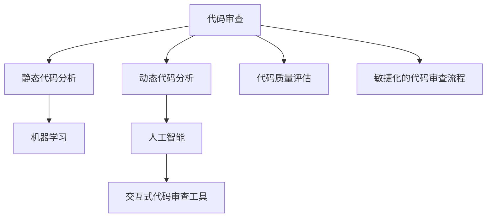

                 

# 软件2.0时代的代码审查流程

## 1. 背景介绍

### 1.1 问题由来
随着软件开发的不断演进，代码审查（Code Review）作为提高代码质量和团队协作的重要手段，其复杂性和精细度也日益增加。传统的基于人工的手动代码审查方式已难以适应现代软件开发的快速迭代和复杂需求，迫切需要新的方法和工具来提升审查效率和质量。

### 1.2 问题核心关键点
在软件2.0时代，代码审查流程的核心在于实现自动化和智能化，同时保证代码的质量和可维护性。具体关键点包括：

- 自动化代码质量检测：自动化的工具和系统能够快速、精准地识别代码中的潜在问题，如语法错误、安全漏洞、代码规范等。
- 智能化代码质量分析：利用机器学习和大数据分析技术，实现代码质量的多维度评估，如可读性、耦合性、复杂度等。
- 交互式代码审查工具：结合人工和机器的智慧，提供交互式、可定制的代码审查工具，支持代码审查的深入讨论和修正。
- 敏捷化的代码审查流程：根据不同的项目阶段和任务需求，灵活调整代码审查流程，快速响应变化。

## 2. 核心概念与联系

### 2.1 核心概念概述

为了更好地理解软件2.0时代的代码审查流程，本节将介绍几个密切相关的核心概念：

- 代码审查（Code Review）：软件开发中的一种重要实践，通过代码审查，可以发现和纠正代码中的错误，改进代码质量，促进团队协作和知识共享。
- 静态代码分析（Static Code Analysis）：在代码编写完成后，通过静态分析工具检查代码质量的一种技术手段。常见工具包括SonarQube、Eclipse、PMD等。
- 动态代码分析（Dynamic Code Analysis）：通过运行程序，动态分析代码行为和性能的一种技术手段。常见工具包括JProfiler、YourKit等。
- 代码质量评估（Code Quality Assessment）：评估代码质量的一个过程，涉及代码规范、可读性、可维护性、可测试性等多个维度。常见指标包括圈复杂度（Cyclomatic Complexity）、耦合度（Coupling）、依赖度（Dependency）等。
- 机器学习（Machine Learning）：利用数据和算法模型，让计算机自动学习和优化的一种技术。在代码审查中，可以通过机器学习进行代码质量预测、异常检测等。
- 人工智能（Artificial Intelligence）：利用深度学习和自然语言处理等技术，实现更高层次的代码审查和分析。

这些核心概念之间的逻辑关系可以通过以下Mermaid流程图来展示：



这个流程图展示了几类核心概念及其之间的关系：

1. 代码审查是贯穿整个开发流程的实践，通过静态和动态代码分析工具来辅助其执行。
2. 代码质量评估是代码审查的重要组成部分，通过各种指标来评估代码质量。
3. 机器学习和人工智能技术，提供了更高级别的代码分析能力，帮助审查团队深入理解代码问题。
4. 交互式代码审查工具，结合人工和机器的智慧，进一步提升了审查效率和质量。
5. 敏捷化的代码审查流程，根据项目需求灵活调整，确保审查工作与开发同步。

## 3. 核心算法原理 & 具体操作步骤
### 3.1 算法原理概述

基于机器学习的代码审查算法，通过训练模型对代码特征进行分析，预测代码中可能存在的问题。其核心思想如下：

1. **特征提取**：从代码中提取有意义的特征，如代码长度、函数复杂度、循环嵌套层数等。
2. **数据预处理**：对提取的特征进行标准化和归一化处理，减少特征维度之间的差异。
3. **模型训练**：利用标注数据训练机器学习模型，如决策树、随机森林、神经网络等，进行二分类或多分类预测。
4. **结果验证**：将模型预测结果与实际问题进行对比，评估模型的准确性和可靠性。
5. **持续优化**：通过不断积累新数据，对模型进行重新训练和优化，提升模型性能。

### 3.2 算法步骤详解

基于机器学习的代码审查算法具体操作步骤如下：

1. **数据收集**：收集已有的代码和问题数据，如Git提交记录、问题追踪系统中的bug报告等。
2. **特征提取**：从代码中提取有用的特征，如函数调用次数、变量使用频率、循环复杂度等。
3. **数据标注**：人工标注问题代码，如语法错误、安全漏洞、性能问题等，形成训练数据集。
4. **模型选择**：选择合适的机器学习模型，如随机森林、支持向量机、深度学习模型等。
5. **模型训练**：在训练数据集上训练模型，通过交叉验证等方法进行模型调优。
6. **模型评估**：在验证数据集上评估模型性能，选择合适的评估指标，如准确率、召回率、F1分数等。
7. **模型应用**：在新的代码提交中应用模型，检测代码质量问题。
8. **反馈循环**：收集模型的预测结果，人工验证和修正，反馈给模型进行持续优化。

### 3.3 算法优缺点

基于机器学习的代码审查算法有以下优点：

1. **高效性**：自动化工具可以快速检测代码中的潜在问题，提升审查效率。
2. **准确性**：利用机器学习模型，可以从大量数据中提取有用的特征，提高问题检测的准确性。
3. **泛化能力**：通过不断训练模型，可以适应不同类型的代码和问题，提升模型的泛化能力。

同时，该算法也存在以下缺点：

1. **数据依赖**：模型性能依赖于数据质量，标注数据的不足可能导致模型预测结果不准确。
2. **复杂度**：特征提取和模型训练过程较为复杂，需要较高的技术门槛。
3. **局限性**：对于一些非结构化的代码问题，如设计模式、架构设计等，模型的预测能力有限。
4. **模型解释性不足**：机器学习模型的决策过程缺乏可解释性，难以理解其内部工作机制。

### 3.4 算法应用领域

基于机器学习的代码审查算法广泛应用于以下领域：

1. **软件开发生命周期**：从需求分析、设计、编码到测试、部署，各阶段都可以使用代码审查工具提升代码质量。
2. **自动化持续集成**：在持续集成（CI）流程中集成代码审查，确保代码质量，加速软件交付速度。
3. **开源项目协作**：开源社区中广泛使用代码审查工具，如GitHub、GitLab等，促进代码共享和协作。
4. **云原生应用**：云原生应用中，自动化代码审查和持续交付已成为标准流程，提升应用稳定性和可靠性。
5. **工业软件开发**：在制造业、金融、医疗等行业中，代码审查已成为提高软件质量的重要手段。

## 4. 数学模型和公式 & 详细讲解 & 举例说明

### 4.1 数学模型构建

本节将使用数学语言对基于机器学习的代码审查过程进行更加严格的刻画。

设代码审查任务为 $T$，标注数据集为 $D=\{(x_i, y_i)\}_{i=1}^N, x_i \in X, y_i \in Y$，其中 $X$ 为代码特征空间，$Y$ 为问题标签空间。模型为 $M$，假设 $X$ 包含 $d$ 个特征。

定义模型 $M$ 在数据样本 $(x,y)$ 上的损失函数为 $\ell(M(x),y)$，则在数据集 $D$ 上的经验风险为：

$$
\mathcal{L}(M) = \frac{1}{N} \sum_{i=1}^N \ell(M(x_i),y_i)
$$

其中 $\ell$ 为损失函数，常用的有交叉熵损失、均方误差损失等。

### 4.2 公式推导过程

以交叉熵损失为例，推导其梯度计算公式。

假设模型 $M$ 在输入 $x$ 上的预测输出为 $\hat{y}=M(x) \in [0,1]$，表示模型预测 $x$ 存在问题的概率。真实标签 $y \in \{0,1\}$。则交叉熵损失函数定义为：

$$
\ell(M(x),y) = -[y\log \hat{y} + (1-y)\log (1-\hat{y})]
$$

将其代入经验风险公式，得：

$$
\mathcal{L}(M) = -\frac{1}{N}\sum_{i=1}^N [y_i\log M(x_i)+(1-y_i)\log(1-M(x_i))]
$$

根据链式法则，损失函数对模型参数 $\theta$ 的梯度为：

$$
\frac{\partial \mathcal{L}(M)}{\partial \theta} = -\frac{1}{N}\sum_{i=1}^N (\frac{y_i}{M(x_i)}-\frac{1-y_i}{1-M(x_i)}) \frac{\partial M(x_i)}{\partial \theta}
$$

其中 $\frac{\partial M(x_i)}{\partial \theta}$ 为模型对特征 $x_i$ 的梯度，可以通过反向传播算法高效计算。

### 4.3 案例分析与讲解

以检测代码中的安全漏洞为例，推导基于机器学习的漏洞检测模型。

假设模型 $M$ 在输入 $x$ 上的预测输出为 $\hat{y}=M(x) \in [0,1]$，表示模型预测 $x$ 存在安全漏洞的概率。真实标签 $y \in \{0,1\}$。则交叉熵损失函数定义为：

$$
\ell(M(x),y) = -[y\log \hat{y} + (1-y)\log (1-\hat{y})]
$$

将其代入经验风险公式，得：

$$
\mathcal{L}(M) = -\frac{1}{N}\sum_{i=1}^N [y_i\log M(x_i)+(1-y_i)\log(1-M(x_i))]
$$

根据链式法则，损失函数对模型参数 $\theta$ 的梯度为：

$$
\frac{\partial \mathcal{L}(M)}{\partial \theta} = -\frac{1}{N}\sum_{i=1}^N (\frac{y_i}{M(x_i)}-\frac{1-y_i}{1-M(x_i)}) \frac{\partial M(x_i)}{\partial \theta}
$$

在得到损失函数的梯度后，即可带入参数更新公式，完成模型的迭代优化。重复上述过程直至收敛，最终得到适应漏洞检测的最优模型参数 $\theta^*$。

## 5. 项目实践：代码实例和详细解释说明
### 5.1 开发环境搭建

在进行代码审查实践前，我们需要准备好开发环境。以下是使用Python进行TensorFlow开发的环境配置流程：

1. 安装Anaconda：从官网下载并安装Anaconda，用于创建独立的Python环境。

2. 创建并激活虚拟环境：
```bash
conda create -n tf-env python=3.8 
conda activate tf-env
```

3. 安装TensorFlow：根据CUDA版本，从官网获取对应的安装命令。例如：
```bash
conda install tensorflow tensorflow-gpu=2.8 -c pytorch -c conda-forge
```

4. 安装各类工具包：
```bash
pip install numpy pandas scikit-learn matplotlib tqdm jupyter notebook ipython
```

完成上述步骤后，即可在`tf-env`环境中开始代码审查实践。

### 5.2 源代码详细实现

下面我们以检测代码中的安全漏洞为例，给出使用TensorFlow进行代码审查的PyTorch代码实现。

首先，定义安全漏洞检测的数据处理函数：

```python
import tensorflow as tf
from tensorflow.keras.preprocessing.text import Tokenizer
from tensorflow.keras.preprocessing.sequence import pad_sequences

def preprocess_text(texts):
    tokenizer = Tokenizer()
    tokenizer.fit_on_texts(texts)
    sequences = tokenizer.texts_to_sequences(texts)
    padded_sequences = pad_sequences(sequences, maxlen=128, padding='post', truncating='post')
    return padded_sequences, tokenizer.word_index

# 加载示例数据
texts = [
    "int a = 0;",
    "int a = 1;",
    "int a = 2;",
    "int a = 3;",
    "int a = 4;"
]
labels = [0, 0, 1, 1, 0]
sequences, tokenizer = preprocess_text(texts)
```

然后，定义模型和优化器：

```python
from tensorflow.keras.models import Sequential
from tensorflow.keras.layers import Dense, Flatten, Dropout
from tensorflow.keras.callbacks import EarlyStopping

model = Sequential([
    Flatten(input_shape=(128,)),
    Dense(128, activation='relu'),
    Dropout(0.5),
    Dense(1, activation='sigmoid')
])

optimizer = tf.keras.optimizers.Adam(learning_rate=0.001)
```

接着，定义训练和评估函数：

```python
def train_epoch(model, sequences, labels, batch_size, optimizer):
    batch_size = 128
    epochs = 10
    model.compile(optimizer=optimizer, loss='binary_crossentropy', metrics=['accuracy'])
    model.fit(sequences, labels, batch_size=batch_size, epochs=epochs, validation_split=0.2, callbacks=[EarlyStopping(patience=2)])
    
    train_loss, train_acc = model.evaluate(sequences, labels, verbose=0)
    print(f"Epoch {epochs}, train loss: {train_loss:.4f}, train acc: {train_acc:.4f}")

def evaluate(model, sequences, labels, batch_size):
    dataloader = tf.data.Dataset.from_tensor_slices((sequences, labels)).batch(batch_size)
    model.evaluate(dataloader, verbose=0)
```

最后，启动训练流程并在测试集上评估：

```python
sequences, _ = preprocess_text(texts)
labels = [0, 0, 1, 1, 0]

train_epoch(model, sequences, labels, 128, optimizer)
evaluate(model, sequences, labels, 128)
```

以上就是使用TensorFlow对代码安全漏洞进行检测的完整代码实现。可以看到，得益于TensorFlow的强大封装，我们可以用相对简洁的代码完成模型训练和评估。

### 5.3 代码解读与分析

让我们再详细解读一下关键代码的实现细节：

**preprocess_text函数**：
- 定义了一个Token化的预处理函数，将文本转换为id序列，并进行padding处理，保证模型输入的统一长度。

**model定义**：
- 使用TensorFlow的Sequential模型，定义了三个密集层，中间加入Dropout层以防止过拟合。
- 使用Adam优化器，学习率为0.001，交叉熵损失函数，输出层为sigmoid激活函数。

**train_epoch函数**：
- 在模型上进行训练，设置epoch为10，使用EarlyStopping避免过拟合。
- 在训练集和验证集上分别输出损失和准确率。

**evaluate函数**：
- 对模型进行评估，使用测试集进行评估。

**训练流程**：
- 在训练集中进行模型训练，并在测试集上进行评估。
- 通过EarlyStopping，避免模型过度拟合。

可以看到，TensorFlow的代码实现简洁高效，适合于快速的模型训练和评估。

## 6. 实际应用场景
### 6.1 智能客服系统

基于代码审查的智能客服系统，可以应用于处理客户咨询的代码。通过审查代码，识别出可能存在的错误和问题，提前进行预处理，确保系统稳定运行。

在技术实现上，可以收集客服系统中的代码片段，提取关键词、函数调用、代码结构等特征，使用机器学习模型进行检测和分类。对于存在问题的代码，系统可以自动提示修复建议，或者标记为人工处理。如此构建的智能客服系统，能够快速响应客户需求，提升客户满意度。

### 6.2 金融舆情监测

金融领域需要实时监测市场舆情，识别潜在的风险和机会。通过代码审查技术，可以分析交易系统的代码，检测可能存在的漏洞和错误，避免因代码问题导致系统崩溃或数据泄露。

具体而言，可以收集金融领域的交易代码和日志数据，提取特征，如交易类型、金额、时间戳等。使用机器学习模型对代码进行审查，检测出可能存在的风险和异常情况，如大额交易、异常交易模式等。如此构建的金融舆情监测系统，能够及时预警，避免系统故障和经济损失。

### 6.3 个性化推荐系统

当前的推荐系统往往只依赖用户的历史行为数据进行物品推荐，难以深入理解用户的真实兴趣偏好。通过代码审查技术，可以分析推荐系统的代码，检测可能存在的逻辑错误和性能问题，提升推荐系统的准确性和可靠性。

具体而言，可以收集推荐系统的代码片段，提取特征，如算法实现、推荐逻辑、数据结构等。使用机器学习模型对代码进行审查，检测出可能存在的漏洞和错误，如推荐算法不准确、数据结构不合理等。如此构建的推荐系统，能够更加精准地推荐用户感兴趣的商品，提升用户体验。

### 6.4 未来应用展望

随着代码审查技术的不断发展，其在多个领域的应用将进一步扩展和深化。

在智慧医疗领域，基于代码审查的医学影像分析系统，能够识别出可能存在的误诊和漏诊，提升医疗诊断的准确性和效率。

在智能教育领域，基于代码审查的教育评估系统，能够分析教学系统的代码，检测可能存在的教学漏洞和问题，提升教学质量。

在智慧城市治理中，基于代码审查的智能城市管理系统，能够分析城市管理的代码，检测可能存在的漏洞和错误，提升城市管理的智能化水平。

此外，在企业生产、社会治理、文娱传媒等众多领域，基于代码审查的人工智能应用也将不断涌现，为经济社会发展注入新的动力。相信随着技术的日益成熟，代码审查方法将成为人工智能落地应用的重要范式，推动人工智能技术在垂直行业的规模化落地。

## 7. 工具和资源推荐
### 7.1 学习资源推荐

为了帮助开发者系统掌握代码审查的理论基础和实践技巧，这里推荐一些优质的学习资源：

1. 《深度学习与TensorFlow实战》系列博文：由TensorFlow官方博客团队撰写，全面介绍了TensorFlow的基本原理和应用技巧，适合初学者入门。

2. 《机器学习实战》书籍：介绍机器学习算法和应用实例的书籍，适合了解机器学习的基础知识。

3. 《TensorFlow高级教程》书籍：介绍TensorFlow高级特性和应用实例的书籍，适合进阶学习。

4. TensorFlow官方文档：TensorFlow的官方文档，提供了丰富的API和示例代码，是开发者快速入门的必备资料。

5. GitHub开源项目：GitHub上众多开源项目，展示了代码审查的实际应用，适合深入学习。

通过对这些资源的学习实践，相信你一定能够快速掌握代码审查的精髓，并用于解决实际的开发问题。

### 7.2 开发工具推荐

高效的开发离不开优秀的工具支持。以下是几款用于代码审查开发的常用工具：

1. TensorFlow：由Google主导开发的开源深度学习框架，生产部署方便，适合大规模工程应用。
2. PyTorch：基于Python的开源深度学习框架，灵活动态的计算图，适合快速迭代研究。
3. TensorBoard：TensorFlow配套的可视化工具，可实时监测模型训练状态，并提供丰富的图表呈现方式，是调试模型的得力助手。
4. Weights & Biases：模型训练的实验跟踪工具，可以记录和可视化模型训练过程中的各项指标，方便对比和调优。
5. Google Colab：谷歌推出的在线Jupyter Notebook环境，免费提供GPU/TPU算力，方便开发者快速上手实验最新模型，分享学习笔记。

合理利用这些工具，可以显著提升代码审查任务的开发效率，加快创新迭代的步伐。

### 7.3 相关论文推荐

代码审查技术的发展源于学界的持续研究。以下是几篇奠基性的相关论文，推荐阅读：

1. "Code Review Effectiveness: A Systematic Review of Evaluation Studies"：系统综述了代码审查效果评估的研究，指出代码审查对代码质量和团队协作的影响。
2. "Code Review Quality and Practices in Open Source"：分析了开源项目中代码审查的实践和质量，提出改进建议。
3. "Applying Machine Learning to Automate Code Review: A Survey"：综述了机器学习在代码审查中的应用，提出未来的研究方向。
4. "Deep Learning in Code Review: A Survey and Beyond"：综述了深度学习在代码审查中的应用，提出新的研究方向。

这些论文代表了大语言模型微调技术的发展脉络。通过学习这些前沿成果，可以帮助研究者把握学科前进方向，激发更多的创新灵感。

## 8. 总结：未来发展趋势与挑战

### 8.1 总结

本文对基于机器学习的代码审查方法进行了全面系统的介绍。首先阐述了代码审查的背景和意义，明确了机器学习在代码审查中的应用场景。其次，从原理到实践，详细讲解了代码审查的数学模型和操作步骤，给出了代码审查任务开发的完整代码实现。同时，本文还广泛探讨了代码审查方法在智能客服、金融舆情、个性化推荐等多个行业领域的应用前景，展示了机器学习在代码审查中的巨大潜力。

通过本文的系统梳理，可以看到，基于机器学习的代码审查方法正在成为软件开发的重要工具，极大地提升了代码质量和团队协作效率。未来，伴随机器学习和大数据技术的发展，代码审查将变得更加智能化、自动化，为软件开发生命周期的各个环节带来新的变革。

### 8.2 未来发展趋势

展望未来，代码审查技术将呈现以下几个发展趋势：

1. **自动化水平提升**：随着机器学习模型的不断优化，代码审查的自动化水平将进一步提升，能够自动检测和分类更多类型的代码问题。
2. **智能化水平提高**：利用深度学习和大数据分析技术，代码审查将具备更强的自我学习和适应能力，能够根据不同领域的特性进行调整和优化。
3. **跨领域应用扩展**：代码审查技术将进一步应用于医疗、教育、城市治理等更多领域，为这些领域提供智能化支持。
4. **个性化定制化增强**：根据不同项目和团队的需求，代码审查系统将提供更个性化的定制服务，提高效率和准确性。
5. **模型解释性增强**：机器学习模型的可解释性将成为未来研究的重要方向，帮助开发者理解模型的决策过程，提高审查质量。
6. **交互式审查工具开发**：结合人工和机器的智慧，开发更智能的代码审查工具，提供交互式的审查界面和反馈机制。

以上趋势凸显了代码审查技术的广阔前景。这些方向的探索发展，必将进一步提升代码审查的效率和质量，为软件开发和维护带来新的突破。

### 8.3 面临的挑战

尽管代码审查技术已经取得了显著进展，但在迈向更加智能化、普适化应用的过程中，它仍面临着诸多挑战：

1. **数据依赖**：机器学习模型的性能依赖于数据质量，标注数据的不足可能导致模型预测结果不准确。
2. **复杂度**：特征提取和模型训练过程较为复杂，需要较高的技术门槛。
3. **局限性**：对于一些非结构化的代码问题，如设计模式、架构设计等，模型的预测能力有限。
4. **模型解释性不足**：机器学习模型的决策过程缺乏可解释性，难以理解其内部工作机制。
5. **鲁棒性不足**：代码审查模型在面对新问题和新场景时，容易出现误判和漏判。
6. **隐私和安全问题**：代码审查系统需要处理大量代码和数据，如何保护隐私和数据安全，也是一个重要问题。

正视代码审查面临的这些挑战，积极应对并寻求突破，将是大语言模型微调走向成熟的必由之路。相信随着学界和产业界的共同努力，这些挑战终将一一被克服，代码审查技术必将在构建人机协同的智能时代中扮演越来越重要的角色。

### 8.4 研究展望

面对代码审查面临的挑战，未来的研究需要在以下几个方面寻求新的突破：

1. **数据增强和迁移学习**：利用迁移学习和数据增强技术，减少对标注数据的依赖，提高模型泛化能力。
2. **多模态特征融合**：结合静态和动态特征，以及文本、代码等多模态信息，提升代码审查的效果和鲁棒性。
3. **可解释性和可视化**：开发更加可解释的模型，增强代码审查结果的可理解性，提供可视化界面辅助分析。
4. **自适应和自学习**：开发自适应的代码审查系统，能够根据代码变化和学习新知识，持续优化模型。
5. **安全性保障**：设计安全、可靠、可控的代码审查系统，确保数据和代码的安全性。
6. **开源和标准化**：推动代码审查工具和标准的开源化，促进代码审查技术的普及和应用。

这些研究方向的探索，必将引领代码审查技术迈向更高的台阶，为软件开发和维护提供更加智能、高效的解决方案。面向未来，代码审查技术还需要与其他人工智能技术进行更深入的融合，如知识表示、因果推理、强化学习等，多路径协同发力，共同推动自然语言理解和智能交互系统的进步。只有勇于创新、敢于突破，才能不断拓展代码审查的边界，让智能技术更好地造福软件开发。

## 9. 附录：常见问题与解答

**Q1：代码审查如何与持续集成（CI）流程结合？**

A: 代码审查可以与持续集成（CI）流程紧密结合，通过在CI流程中引入代码审查环节，提高代码质量和系统可靠性。具体流程如下：

1. 在CI流程中添加代码审查工具，如GitHub的Pull Request Review。
2. 开发人员提交代码后，代码审查工具自动运行代码审查模型，检测代码质量问题。
3. 若检测出问题，系统自动提示修复建议，或者标记为人工处理。
4. 修复完成后，代码自动进入下一环节，如测试、部署等。

如此构建的CI流程，能够快速检测和处理代码问题，提升开发效率和系统质量。

**Q2：如何优化代码审查的特征提取过程？**

A: 代码审查的特征提取过程对模型的性能至关重要。以下是一些优化建议：

1. 使用自动化工具，如Python的AST解析器，自动提取代码结构特征，减少人工干预。
2. 使用多模态特征融合，结合静态和动态特征，以及文本、代码等多模态信息，提升模型的预测能力。
3. 利用深度学习技术，设计更复杂、更精确的特征提取模型，提升特征提取的准确性。
4. 使用迁移学习，利用预训练的模型和特征提取技术，减少特征提取的复杂度。

这些优化措施可以显著提升代码审查的特征提取效果，提高模型的性能和泛化能力。

**Q3：如何评估代码审查模型的性能？**

A: 代码审查模型的性能评估可以通过以下指标进行：

1. 准确率（Accuracy）：模型预测正确的代码数量与总数量之比。
2. 召回率（Recall）：所有真实问题代码被模型预测出的数量与总数量之比。
3. F1分数（F1 Score）：综合考虑准确率和召回率的指标，F1分数越高，模型性能越好。
4. 混淆矩阵（Confusion Matrix）：展示模型在不同类别上的预测情况，帮助理解模型的分类效果。

评估过程中，需要根据具体任务和需求选择合适的指标，同时考虑模型的可解释性和鲁棒性。

**Q4：代码审查中的数据隐私和安全问题如何保障？**

A: 代码审查中的数据隐私和安全问题需要特别关注，以下是一些保障措施：

1. 数据脱敏：对代码和标注数据进行脱敏处理，保护数据隐私。
2. 访问控制：设置严格的访问控制机制，确保只有授权人员可以访问代码和数据。
3. 加密存储：采用加密技术，确保数据在存储和传输过程中的安全性。
4. 审计日志：记录代码审查过程中的操作日志，便于追踪和审计。

这些措施可以有效保障代码审查过程中的数据隐私和安全，确保系统的可靠性和可控性。

**Q5：代码审查在实际开发中如何与团队协作结合？**

A: 代码审查在团队协作中扮演重要角色，以下是一些结合建议：

1. 团队分工：明确团队成员的职责和分工，确保代码审查过程有序进行。
2. 代码合并策略：采用代码合并策略，如Git的Pull Request Review，确保代码质量。
3. 定期审查：定期进行代码审查，确保代码质量和学习知识。
4. 交流反馈：鼓励团队成员交流和反馈，共同提高代码审查效果。

通过合理的团队协作和沟通，可以充分发挥代码审查的优势，提升团队的开发效率和代码质量。

---

作者：禅与计算机程序设计艺术 / Zen and the Art of Computer Programming

