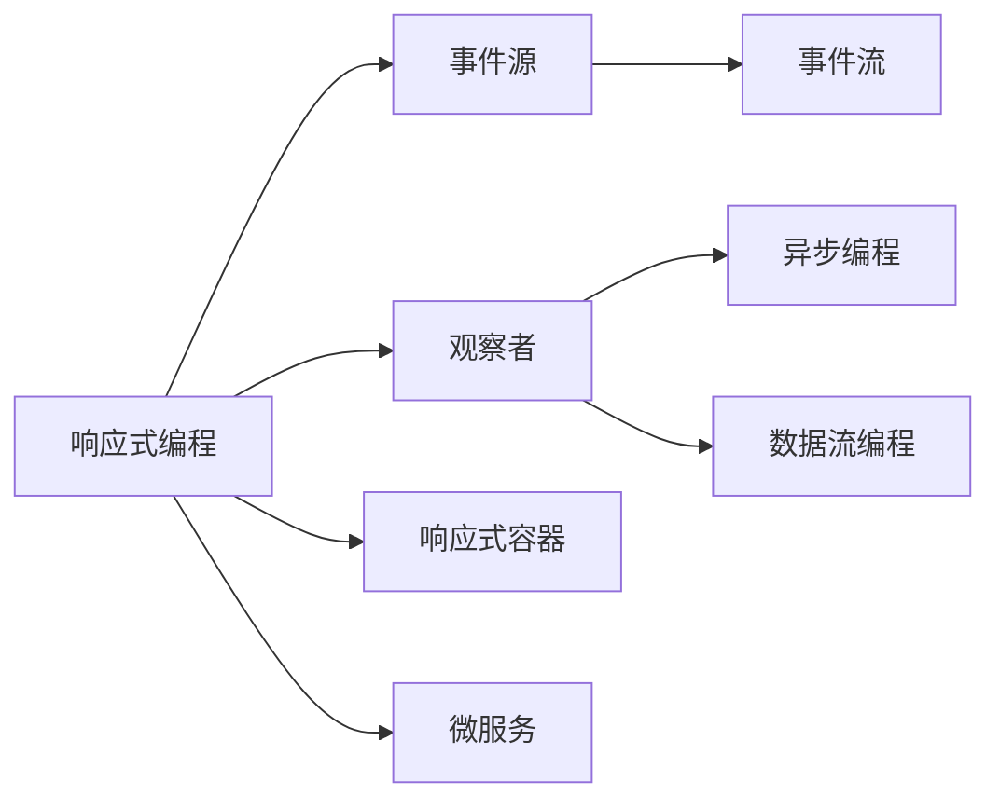
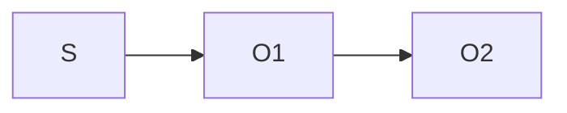

                 

# 软件2.0的反应式系统架构

## 1. 背景介绍

### 1.1 问题由来
随着软件应用的不断扩展和复杂度的提升，传统的基于进程和线程的系统架构已难以满足高效、稳定、可扩展的需求。而响应式编程（Reactive Programming）作为一种新兴的编程范式，因其高效、异步、事件驱动的特性，逐渐成为软件开发的主流方向。本文将详细阐述响应式系统架构的原理和设计，以及其在实际项目中的应用实践，以期为软件开发者提供有价值的参考和指导。

### 1.2 问题核心关键点
响应式系统架构的核心思想是：通过事件驱动的异步编程模型，使得系统能够高效地处理大量并发请求，同时保持高性能和稳定性。其核心组件包括事件源（Event Source）、观察者（Observer）和事件流（Event Stream）。

- 事件源：负责产生事件并发布到事件流中，常见的包括数据流、消息队列、UI事件等。
- 观察者：负责订阅事件流，并在事件触发时进行相应处理。观察者可以同时订阅多个事件源，实现多源数据同步。
- 事件流：由事件源产生的数据流，负责承载事件并通知观察者。

响应式架构通过构建清晰、可复用的事件流，实现组件间的解耦和异步处理，极大地提升了系统的性能和可维护性。

### 1.3 问题研究意义
响应式系统架构在微服务、分布式计算、高并发系统等场景中具有重要应用价值。它能够降低系统复杂度，提高开发效率，同时还能提高系统的可伸缩性和可用性。

本文聚焦于响应式系统架构的设计和实现，系统地介绍其原理和关键技术点，并通过具体项目实践，展示其如何应用于实际的业务场景中，为软件开发提供一种全新的思路和方法。

## 2. 核心概念与联系

### 2.1 核心概念概述

为了更好地理解响应式系统架构，本节将介绍几个密切相关的核心概念：

- 响应式编程（Reactive Programming）：一种编程范式，强调数据流和状态变化的处理，通过观察者模式实现数据同步和处理。
- 事件源（Event Source）：负责产生并发布事件的组件，如消息队列、传感器、数据库变更等。
- 观察者（Observer）：订阅事件流的组件，实现异步处理和数据同步。
- 事件流（Event Stream）：承载事件并通知观察者的数据流。
- 响应式容器（Reactive Container）：提供响应式编程的支持，如RxJava、Akka Streams等。
- 异步编程（Asynchronous Programming）：利用线程池、Future、CompletableFuture等技术实现并发处理。
- 数据流编程（Dataflow Programming）：通过数据流图描述计算流程，如Apache Beam、Apache Flink等。

这些核心概念之间的逻辑关系可以通过以下Mermaid流程图来展示：



这个流程图展示响应式系统架构的核心概念及其之间的关系：

1. 响应式编程是整个架构的基底，强调数据流和状态的同步处理。
2. 事件源负责产生并发布事件，是数据流和异步处理的来源。
3. 观察者订阅事件流，实现异步处理和数据同步。
4. 事件流承载并通知观察者，是数据传输的载体。
5. 响应式容器提供响应式编程的支持，是实现响应式架构的工具。
6. 异步编程和数据流编程是实现响应式编程的技术手段。
7. 微服务是响应式架构的一个典型应用场景。

这些概念共同构成了响应式系统架构的逻辑框架，使其能够高效、灵活地处理各种并发和异步请求。

## 3. 核心算法原理 & 具体操作步骤
### 3.1 算法原理概述

响应式系统架构的原理主要基于观察者模式（Observer Pattern）和事件流模型（Event Stream Model），其核心思想是：通过事件驱动的异步编程模型，使得系统能够高效地处理大量并发请求，同时保持高性能和稳定性。

具体来说，事件源（Event Source）负责产生事件并发布到事件流中，观察者（Observer）负责订阅事件流，并在事件触发时进行相应处理。事件流（Event Stream）则承载事件并通知观察者，实现数据的同步和传输。

在响应式架构中，数据流的处理是通过一系列观察者链（Observer Chain）实现的，每个观察者可以在事件触发时进行处理，并将结果传递给下一个观察者，直到事件被完全处理。

### 3.2 算法步骤详解

响应式系统架构的实现主要包括以下几个关键步骤：

**Step 1: 确定事件源和观察者**
- 确定系统的核心事件源，如数据流、消息队列、UI事件等。
- 确定观察者的实现方式，如订阅模型、观察者链、异步处理等。

**Step 2: 设计事件流模型**
- 设计数据流的传输路径，确保数据流能够被多个观察者共享和处理。
- 确定数据流的类型，如无状态流、状态流、时间序列流等。

**Step 3: 实现事件流的订阅和处理**
- 实现观察者订阅事件流的逻辑，确保观察者能够在事件触发时及时处理数据。
- 实现事件流的处理逻辑，确保数据能够按照指定规则进行传递和处理。

**Step 4: 优化数据流的处理性能**
- 使用异步编程和数据流编程技术，提高数据流的处理效率。
- 使用缓存和分片等技术，减少数据流的传输量和处理开销。

**Step 5: 测试和部署**
- 对响应式架构进行单元测试和集成测试，确保系统能够正确处理事件流。
- 部署响应式架构到实际的生产环境，监控系统性能，优化处理逻辑。

以上是响应式系统架构的一般流程。在实际应用中，还需要针对具体业务场景，对架构进行优化设计，如引入消息队列、使用分布式数据流等，以进一步提升系统性能。

### 3.3 算法优缺点

响应式系统架构的优点在于：

- 高效异步：通过事件驱动的异步处理机制，系统能够高效地处理大量并发请求，避免线程竞争和锁等待。
- 高可扩展性：观察者链的设计使得系统能够灵活扩展，支持多源数据同步和多线程处理。
- 高可用性：事件流的订阅和处理机制使得系统能够实现负载均衡和故障转移。

但其缺点也显而易见：

- 学习曲线陡峭：响应式编程需要掌握新的编程范式和编程模型，学习成本较高。
- 性能调优复杂：事件流的处理逻辑复杂，性能调优需要深入理解数据流和观察者链的实现细节。
- 数据一致性问题：观察者链的设计可能导致数据一致性问题，需要在设计和实现上特别注意。

尽管存在这些缺点，但响应式系统架构在处理高并发、高异步的场景中仍具有重要应用价值。未来相关研究的重点在于如何进一步优化架构设计和实现，降低学习成本，提升性能调优效率，确保数据一致性。

### 3.4 算法应用领域

响应式系统架构在多个领域中得到了广泛应用，以下是几个典型应用场景：

- 微服务架构：通过事件流和观察者链，实现微服务之间的数据同步和处理。
- 分布式计算：通过消息队列和事件流，实现分布式系统的高效数据传输和处理。
- 高并发系统：通过异步编程和数据流编程，实现高并发请求的处理和响应。
- 实时数据处理：通过事件流和观察者链，实现实时数据的处理和分析。
- 用户界面：通过UI事件和响应式容器，实现用户界面的动态更新和响应。

除了上述这些场景外，响应式系统架构还被创新性地应用到更多领域中，如游戏开发、物联网等，为软件开发提供了新的思路和方法。

## 4. 数学模型和公式 & 详细讲解 & 举例说明（备注：数学公式请使用latex格式，latex嵌入文中独立段落使用 $$，段落内使用 $)
### 4.1 数学模型构建

本节将使用数学语言对响应式系统架构的原理进行更加严格的刻画。

记事件源为 $S$，观察者为 $O$，事件流为 $E$。事件流 $E$ 由事件源 $S$ 产生，并通过观察者 $O$ 进行处理。观察者 $O$ 和事件源 $S$ 的关系可以用函数 $f(S, O)$ 表示，其中 $f$ 表示事件流的传输逻辑，即如何将事件源产生的事件数据传递给观察者。

在响应式架构中，事件流的传输和处理过程可以用以下数学模型来描述：

$$
E = S \rightarrow f(S, O) \rightarrow O
$$

其中 $\rightarrow$ 表示事件流的传输方向，$O$ 表示观察者链中的每个观察者。

### 4.2 公式推导过程

以下我们以一个简单的示例，推导事件流的传输和处理逻辑。

假设事件源 $S$ 是一个消息队列，事件流 $E$ 是一个无状态流，观察者 $O$ 是一个数据处理器。事件流 $E$ 的传输逻辑为：

$$
E = S \rightarrow f(S, O) = S \rightarrow \left\{ \begin{array}{ll}
O_1 & \text{收到事件数据} \\
O_2 & \text{转发事件数据} \\
\end{array} \right.
$$

其中 $O_1$ 是数据处理器，$O_2$ 是转发器，表示事件数据在 $O_1$ 处理完毕后，转发给 $O_2$。

事件流 $E$ 的传输和处理逻辑可以用以下图形表示：



通过上述模型，我们可以清晰地理解事件流的传输和处理逻辑。在实际应用中，还可以通过引入更多的观察者、异步编程和数据流编程技术，实现更加复杂和多样的数据处理逻辑。

### 4.3 案例分析与讲解

下面以一个简单的实际案例，说明响应式系统架构的具体实现过程。

假设一个电商平台的订单系统，需要处理用户的订单信息。订单信息从用户模块产生，并发送到订单模块进行处理。在订单模块中，订单信息需要进行一系列的处理和存储，最终存储到数据库中。

在这个案例中，事件源 $S$ 是用户模块，事件流 $E$ 是订单信息的数据流，观察者 $O$ 是订单模块。事件流 $E$ 的传输逻辑为：

$$
E = S \rightarrow f(S, O) = S \rightarrow \left\{ \begin{array}{ll}
O_1 & \text{收到订单信息} \\
O_2 & \text{处理订单信息} \\
O_3 & \text{存储订单信息} \\
\end{array} \right.
$$

其中 $O_1$ 是订单接收器，$O_2$ 是订单处理器，$O_3$ 是订单存储器，表示订单信息在 $O_1$ 接收后，依次经过 $O_2$ 处理和 $O_3$ 存储。

通过响应式架构的设计，订单系统能够高效地处理大量并发订单请求，同时确保订单信息的准确性和完整性。

## 5. 项目实践：代码实例和详细解释说明
### 5.1 开发环境搭建

在进行响应式系统架构的实践前，我们需要准备好开发环境。以下是使用Java和RxJava进行项目开发的环境配置流程：

1. 安装Java Development Kit (JDK)：从官网下载并安装最新版本的JDK，用于Java开发。

2. 安装IDE：推荐使用IntelliJ IDEA或Eclipse，提供Java开发的全功能支持。

3. 安装RxJava库：通过Maven或Gradle引入RxJava库，用于实现响应式编程。

4. 配置项目依赖：在Maven或Gradle中配置项目依赖，引入所需的库和工具包。

5. 设置项目结构：根据项目需求，设置模块结构，定义事件源、观察者和事件流。

完成上述步骤后，即可在IDE中进行响应式系统架构的开发实践。

### 5.2 源代码详细实现

下面我们以一个简单的订单系统为例，给出使用RxJava实现响应式架构的Java代码实现。

首先，定义事件源（订单模块）：

```java
import rx2.Observable;
import rx2.subjects.PublishSubject;

public class OrderSource {
    private PublishSubject<String> orderSubject = PublishSubject.create();

    public Observable<String> getObservable() {
        return orderSubject;
    }

    public void sendOrder(String order) {
        orderSubject.onNext(order);
    }
}
```

然后，定义观察者（订单处理器和存储器）：

```java
import rx2.Observer;
import rx2.Scheduler;

public class OrderObserver implements Observer<String> {
    private Scheduler scheduler;

    public OrderObserver(Scheduler scheduler) {
        this.scheduler = scheduler;
    }

    @Override
    public void onSubscribe(Disposable disposable) {
        // 实现资源的自动释放逻辑
    }

    @Override
    public void onNext(String order) {
        // 在异步线程中处理订单信息
        scheduler.schedule(new Runnable() {
            @Override
            public void run() {
                // 处理订单逻辑
                System.out.println("Processing order: " + order);
            }
        });
    }

    @Override
    public void onError(Throwable throwable) {
        // 处理错误逻辑
    }

    @Override
    public void onComplete() {
        // 处理完成逻辑
    }
}
```

最后，启动事件流和观察者链：

```java
import rx2.Observable;
import rx2.Schedulers;
import rx2.subjects.PublishSubject;

public class Main {
    public static void main(String[] args) {
        // 创建事件源
        OrderSource orderSource = new OrderSource();

        // 创建观察者
        OrderObserver observer1 = new OrderObserver(Schedulers.io());
        OrderObserver observer2 = new OrderObserver(Schedulers.io());
        OrderObserver observer3 = new OrderObserver(Schedulers.io());

        // 订阅事件流
        Observable<String> orderObservable = orderSource.getObservable();
        orderObservable.subscribe(observer1);
        orderObservable.subscribe(observer2);
        orderObservable.subscribe(observer3);

        // 发送订单数据
        orderSource.sendOrder("123456");
        orderSource.sendOrder("654321");
    }
}
```

以上就是使用RxJava实现响应式架构的完整代码实现。可以看到，通过订阅事件流，观察者能够在事件触发时进行异步处理，实现了数据的同步和传输。

### 5.3 代码解读与分析

让我们再详细解读一下关键代码的实现细节：

**OrderSource类**：
- 定义了一个PublishSubject对象，用于发布订单数据。
- 通过getObservable方法返回Observable对象，供观察者订阅。

**OrderObserver类**：
- 实现了Observer接口，用于订阅事件流。
- 在onNext方法中，通过异步线程处理订单信息，保证了系统的异步性和高性能。

**Main类**：
- 创建了订单源和多个观察者，并通过Observable订阅事件流。
- 发送订单数据到事件源，观察者在收到订单数据后进行异步处理。

通过以上代码，可以清晰地理解响应式架构的实现逻辑。在实际应用中，还可以根据具体需求，添加更多的观察者和异步处理逻辑，实现更复杂的数据处理流程。

## 6. 实际应用场景
### 6.1 智能监控系统

响应式系统架构在智能监控系统中具有重要应用价值。通过事件驱动的异步编程模型，系统能够高效地处理大量并发请求，同时保持高性能和稳定性。

在实际应用中，智能监控系统通过传感器、摄像头、数据库变更等事件源，产生监控数据，并将其发送至事件流中。监控数据通过多个观察者进行处理和分析，最终生成告警信息和统计报告。

通过响应式架构的设计，智能监控系统能够实时响应告警信息，快速定位问题，提高系统运行的稳定性和可靠性。

### 6.2 金融交易系统

金融交易系统需要处理大量的高并发请求，且对系统的响应速度和稳定性要求非常高。通过响应式架构的设计，系统能够高效地处理大量并发交易请求，同时确保交易数据的准确性和完整性。

在实际应用中，金融交易系统通过消息队列和事件流，实现交易数据的传输和处理。观察者链的设计使得系统能够灵活扩展，支持多源数据同步和多线程处理。

通过响应式架构的设计，金融交易系统能够实现高并发交易处理和高稳定性保障，为金融市场提供高效、可靠的交易服务。

### 6.3 实时数据处理系统

实时数据处理系统需要处理大量的实时数据，且对数据处理的时效性和准确性要求非常高。通过响应式架构的设计，系统能够高效地处理实时数据，同时确保数据的准确性和完整性。

在实际应用中，实时数据处理系统通过事件流和观察者链，实现实时数据的传输和处理。观察者链的设计使得系统能够灵活扩展，支持多源数据同步和多线程处理。

通过响应式架构的设计，实时数据处理系统能够实现实时数据的处理和分析，为业务决策提供准确、实时的数据支持。

### 6.4 未来应用展望

随着响应式系统架构的不断发展和完善，其应用场景将进一步拓展，带来更多创新和突破。

在物联网领域，响应式架构将实现设备之间的实时数据交互和事件处理，提升设备的智能化和自动化水平。

在智能城市领域，响应式架构将实现城市基础设施的实时监控和事件响应，提升城市的智能化和可控性。

在自动驾驶领域，响应式架构将实现车辆和道路设施的实时交互和事件处理，提升驾驶的安全性和舒适性。

除此之外，响应式架构还将拓展到更多的领域，如智能家居、智能医疗、智能制造等，为各行各业的智能化转型提供新的技术支持。

## 7. 工具和资源推荐
### 7.1 学习资源推荐

为了帮助开发者系统掌握响应式系统架构的理论基础和实践技巧，这里推荐一些优质的学习资源：

1. 《Reactive Programming with Java 8》书籍：讲解了响应式编程的基本概念和实现方法，适合Java开发者学习。
2. RxJava官方文档：详细介绍了RxJava库的使用方法和设计原理，是响应式编程的核心参考资料。
3. Akka Streams官方文档：讲解了Akka Streams的实现原理和应用场景，适合响应式架构的开发者学习。
4. 《Designing Distributed Systems》书籍：讲解了分布式系统设计和响应式架构的应用，适合系统架构师学习。
5. Coursera《Introduction to Reactor》课程：由Reactor团队提供的响应式编程课程，适合入门级开发者学习。

通过对这些资源的学习实践，相信你一定能够快速掌握响应式系统架构的精髓，并用于解决实际的业务问题。

### 7.2 开发工具推荐

高效的开发离不开优秀的工具支持。以下是几款用于响应式架构开发的常用工具：

1. IntelliJ IDEA：推荐使用的Java开发工具，提供响应式编程的插件和支持，提高开发效率。
2. Eclipse：支持Java开发的开源IDE，提供丰富的开发插件和工具。
3. RxJava：提供响应式编程的库和工具，支持异步编程和数据流处理。
4. Akka Streams：提供分布式数据流和响应式编程的支持，适合大规模分布式系统开发。
5. Kafka：提供高吞吐量的消息队列和事件流支持，适合数据驱动的应用场景。

合理利用这些工具，可以显著提升响应式系统架构的开发效率，加快创新迭代的步伐。

### 7.3 相关论文推荐

响应式系统架构的研究始于学界的持续研究。以下是几篇奠基性的相关论文，推荐阅读：

1. Reaktive Systems：探讨了事件流和观察者模式的基本概念和应用，奠定了响应式编程的理论基础。
2. Akka Streams：介绍了Akka Streams的实现原理和应用场景，展示了分布式响应式编程的实践案例。
3. RxJava：详细介绍了RxJava库的使用方法和设计原理，展示了响应式编程的实现技术。
4. Designing Distributed Systems：讲解了分布式系统设计和响应式架构的应用，展示了分布式响应式编程的实际案例。
5. Introduction to Reactor：讲解了Reactor框架的实现原理和应用场景，展示了响应式编程的最新进展。

这些论文代表响应式系统架构的发展脉络。通过学习这些前沿成果，可以帮助研究者把握学科前进方向，激发更多的创新灵感。

## 8. 总结：未来发展趋势与挑战

### 8.1 总结

本文对响应式系统架构的设计和实现进行了全面系统的介绍。首先阐述了响应式编程的基本概念和实现方法，明确了响应式系统架构的核心理念和应用价值。其次，从原理到实践，详细讲解了响应式架构的实现流程和关键技术点，并通过具体项目实践，展示了其如何应用于实际的业务场景中。

通过本文的系统梳理，可以看到，响应式系统架构在处理高并发、高异步的场景中具有重要应用价值。得益于事件驱动的异步编程模型，系统能够高效地处理大量并发请求，同时保持高性能和稳定性。未来，随着技术的不断发展和优化，响应式系统架构必将在更多领域得到广泛应用，为软件开发提供新的思路和方法。

### 8.2 未来发展趋势

展望未来，响应式系统架构将呈现以下几个发展趋势：

1. 高性能异步：随着硬件性能的提升和并发技术的进步，响应式架构将实现更高的异步性能，满足更复杂的业务需求。
2. 分布式处理：响应式架构将更多地应用于分布式系统，通过事件流和观察者链实现分布式数据同步和处理。
3. 微服务架构：响应式架构将与微服务架构深度融合，实现微服务之间的高效通信和数据同步。
4. 实时数据处理：响应式架构将更多地应用于实时数据处理系统，实现数据流的实时传输和处理。
5. 跨平台支持：响应式架构将支持更多的编程语言和平台，实现跨平台的数据处理和交互。

以上趋势凸显了响应式系统架构的广阔前景。这些方向的探索发展，必将进一步提升系统的性能和可维护性，为软件开发提供更高效、灵活、可扩展的解决方案。

### 8.3 面临的挑战

尽管响应式系统架构已经取得了瞩目成就，但在迈向更加智能化、普适化应用的过程中，它仍面临诸多挑战：

1. 学习成本较高：响应式编程需要掌握新的编程范式和编程模型，学习成本较高。
2. 性能调优复杂：事件流的处理逻辑复杂，性能调优需要深入理解数据流和观察者链的实现细节。
3. 数据一致性问题：观察者链的设计可能导致数据一致性问题，需要在设计和实现上特别注意。
4. 资源消耗较大：响应式架构需要大量的内存和CPU资源，对于资源有限的设备可能难以支持。
5. 错误处理困难：事件流的异步处理特性使得错误处理变得更加复杂和困难。

尽管存在这些挑战，但响应式系统架构在处理高并发、高异步的场景中仍具有重要应用价值。未来相关研究的重点在于如何进一步优化架构设计和实现，降低学习成本，提升性能调优效率，确保数据一致性。

### 8.4 研究展望

面对响应式系统架构所面临的挑战，未来的研究需要在以下几个方面寻求新的突破：

1. 优化事件流的处理逻辑：通过优化数据流的传输和处理逻辑，减少数据流的传输量和处理开销，提高系统的处理效率。
2. 引入异步编程框架：通过引入异步编程框架，如Reactor、Akka Streams等，提高系统的异步性能和可扩展性。
3. 引入缓存和分片技术：通过引入缓存和分片技术，减少数据流的传输量和处理开销，提高系统的性能和可扩展性。
4. 引入流处理框架：通过引入流处理框架，如Apache Flink、Apache Beam等，实现数据流的实时处理和分析，提高系统的实时性。
5. 引入分布式计算框架：通过引入分布式计算框架，如Apache Spark、Hadoop等，实现分布式数据处理和分析，提高系统的可扩展性。

这些研究方向的探索，必将引领响应式系统架构技术迈向更高的台阶，为软件开发提供更高效、灵活、可扩展的解决方案。

## 9. 附录：常见问题与解答

**Q1：响应式编程和传统编程有什么区别？**

A: 响应式编程与传统编程的最大区别在于，响应式编程强调数据流和状态的同步处理，通过观察者模式实现数据同步和处理。传统编程则是通过显式控制流，实现数据的顺序处理。

**Q2：如何理解事件驱动的异步编程模型？**

A: 事件驱动的异步编程模型，通过事件源产生事件，并发布到事件流中。观察者订阅事件流，并在事件触发时进行相应处理。这种方式能够高效地处理大量并发请求，同时保持高性能和稳定性。

**Q3：响应式架构的优势是什么？**

A: 响应式架构的优势在于高效异步、高可扩展性、高可用性。通过事件驱动的异步处理机制，系统能够高效地处理大量并发请求，避免线程竞争和锁等待。观察者链的设计使得系统能够灵活扩展，支持多源数据同步和多线程处理。事件流的订阅和处理机制使得系统能够实现负载均衡和故障转移。

**Q4：响应式架构的实现难点是什么？**

A: 响应式架构的实现难点在于性能调优和数据一致性问题。事件流的处理逻辑复杂，性能调优需要深入理解数据流和观察者链的实现细节。观察者链的设计可能导致数据一致性问题，需要在设计和实现上特别注意。

**Q5：响应式架构的典型应用场景有哪些？**

A: 响应式架构在微服务、分布式计算、高并发系统、实时数据处理、用户界面等场景中具有重要应用价值。它能够高效地处理大量并发请求，同时保持高性能和稳定性。

通过以上问答，可以看出响应式系统架构具有显著的优势和广泛的应用前景。尽管在实际应用中仍面临诸多挑战，但随着技术的不断发展和优化，响应式系统架构必将在更多领域得到应用，为软件开发提供新的思路和方法。

---

作者：禅与计算机程序设计艺术 / Zen and the Art of Computer Programming

